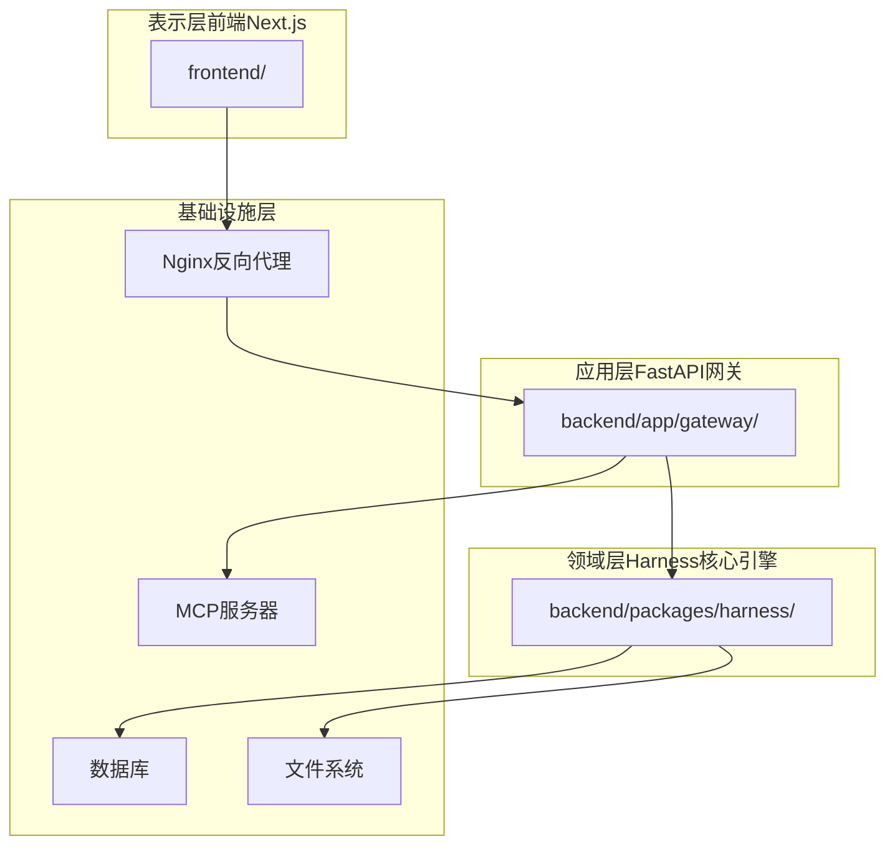
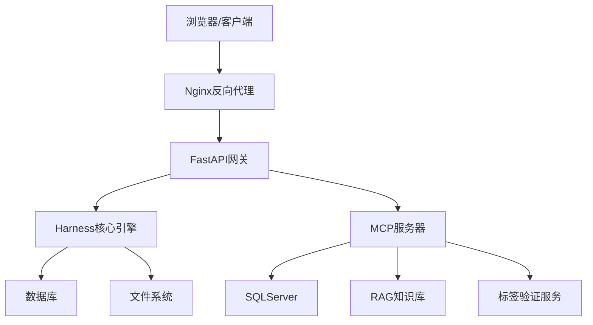
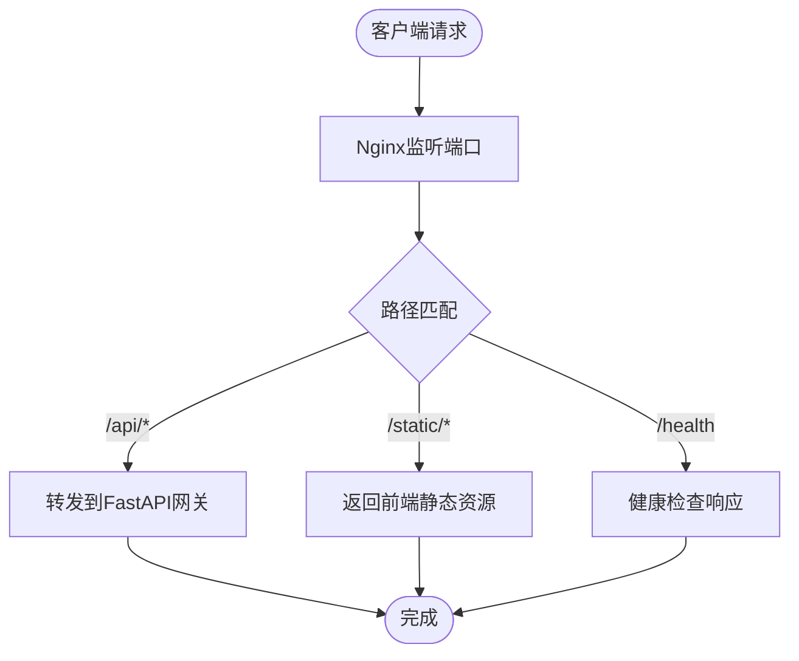
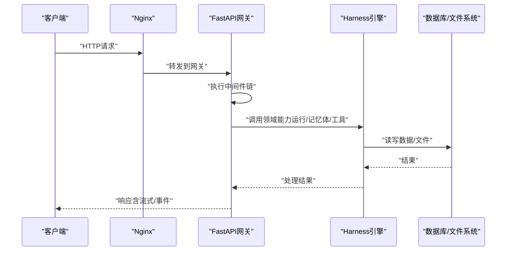
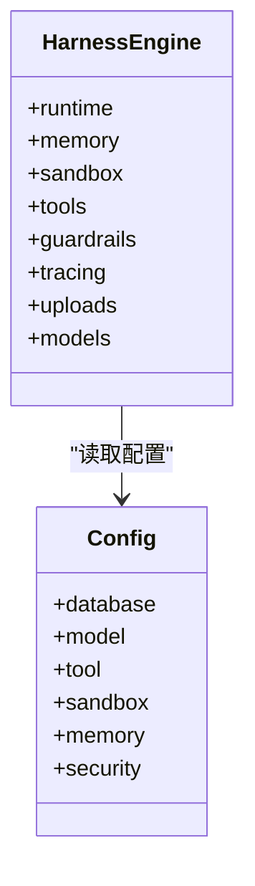
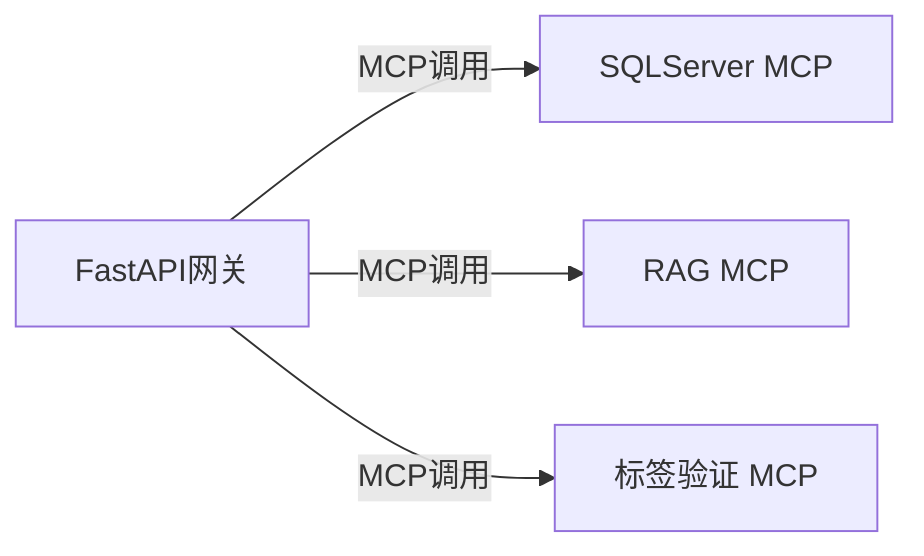
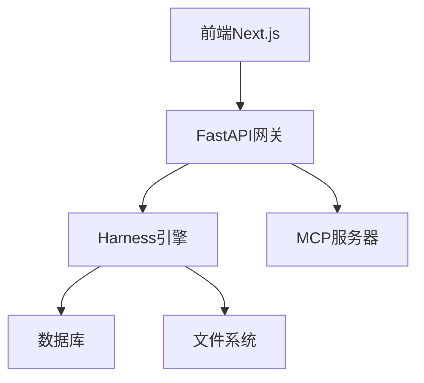

# 系统架构

<cite>
**本文引用的文件**
- [nginx.conf](file://docker/nginx/nginx.conf)
- [nginx.local.conf](file://docker/nginx/nginx.local.conf)
- [docker-compose.yaml](file://docker/docker-compose.yaml)
- [docker-compose-dev.yaml](file://docker/docker-compose-dev.yaml)
- [app.py](file://backend/app/gateway/app.py)
- [pyproject.toml](file://backend/pyproject.toml)
- [next.config.js](file://frontend/next.config.js)
- [package.json](file://frontend/package.json)
- [pyproject.toml](file://backend/packages/harness/pyproject.toml)
- [README.md](file://README.md)
- [ARCHITECTURE.md](file://backend/docs/ARCHITECTURE.md)
- [MCP_SERVER.md](file://backend/docs/MCP_SERVER.md)
- [MCP_SERVER_ZH.md](file://backend/docs/MCP_SERVER_ZH.md)
- [CONFIGURATION.md](file://backend/docs/CONFIGURATION.md)
- [PATH_EXAMPLES.md](file://backend/docs/PATH_EXAMPLES.md)
- [STREAMING.md](file://backend/docs/STREAMING.md)
- [GUARDRAILS.md](file://backend/docs/GUARDRAILS.md)
- [MEMORY_IMPROVEMENTS.md](file://backend/docs/MEMORY_IMPROVEMENTS.md)
- [SANDBOX_MEMORY_PROFILING.md](file://backend/docs/SANDBOX_MEMORY_PROFILING.md)
- [BLOCKING_IO_DETECTION.md](file://backend/docs/BLOCKING_IO_DETECTION.md)
- [AUTO_TITLE_GENERATION.md](file://backend/docs/AUTO_TITLE_GENERATION.md)
- [TITLE_GENERATION_IMPLEMENTATION.md](file://backend/docs/TITLE_GENERATION_IMPLEMENTATION.md)
- [TODO.md](file://backend/docs/TODO.md)
- [AUTH_DESIGN.md](file://backend/docs/AUTH_DESIGN.md)
- [AUTH_TEST_DOCKER_GAP.md](file://backend/docs/AUTH_TEST_DOCKER_GAP.md)
- [AUTH_UPGRADE.md](file://backend/docs/AUTH_UPGRADE.md)
- [middleware-execution-flow.md](file://backend/docs/middleware-execution-flow.md)
- [setup-sandbox.sh](file://scripts/setup-sandbox.sh)
- [wait-for-port.sh](file://scripts/wait-for-port.sh)
- [dev-entrypoint.sh](file://docker/dev-entrypoint.sh)
- [Dockerfile](file://frontend/Dockerfile)
- [Dockerfile](file://backend/Dockerfile)
- [Dockerfile](file://docker/provisioner/Dockerfile)
- [sqlserver_mcp_server.py](file://mcp_servers/sqlserver_mcp_server.py)
- [rag_kb_server.py](file://mcp_servers/rag_kb_server.py)
- [label_verification_mcp_server.py](file://mcp_servers/label_verification_mcp_server.py)
- [label_verification_lib.py](file://mcp_servers/label_verification_lib.py)
</cite>

## 目录
1. [引言](#引言)
2. [项目结构](#项目结构)
3. [核心组件](#核心组件)
4. [架构总览](#架构总览)
5. [详细组件分析](#详细组件分析)
6. [依赖分析](#依赖分析)
7. [性能考虑](#性能考虑)
8. [故障排查指南](#故障排查指南)
9. [结论](#结论)
10. [附录](#附录)

## 引言
本文件面向DeerFlow系统的架构设计与实现，采用分层架构模式：表示层（前端Next.js应用）、应用层（FastAPI网关）、领域层（Harness核心引擎）、基础设施层（数据库、文件系统、MCP服务器）。文档详细说明Nginx反向代理配置、端口映射与路由规则；解释组件间交互关系、数据流向与集成模式；提供系统上下文图与组件分解图；并结合部署拓扑、可扩展性与性能优化策略进行深入分析。

## 项目结构
仓库采用多模块组织方式：
- 前端：Next.js应用，负责用户界面与交互
- 后端：FastAPI服务，提供REST API与业务编排
- Harness引擎：领域核心，封装运行时、记忆体、工具、沙箱等能力
- MCP服务器：外部工具/知识库桥接服务
- Nginx与Docker：反向代理与容器化编排
- 文档与脚本：架构设计、配置说明、部署脚本

**图表来源**
- [docker-compose.yaml](file://docker/docker-compose.yaml)
- [app.py](file://backend/app/gateway/app.py)
- [pyproject.toml](file://backend/packages/harness/pyproject.toml)

**章节来源**
- [README.md](file://README.md)
- [docker-compose.yaml](file://docker/docker-compose.yaml)

## 核心组件
- 表示层（前端Next.js）
  - Next.js应用位于frontend目录，通过next.config.js进行构建与运行配置，package.json定义依赖与脚本。
  - 提供聊天、工作区、博客、设置等功能页面与组件体系。
- 应用层（FastAPI网关）
  - 网关入口在backend/app/gateway/app.py，提供认证、授权、路由与中间件链路。
  - 路由覆盖agents、artifacts、auth、channels、memory、models、runs、skills、threads等资源域。
- 领域层（Harness核心引擎）
  - Harness作为后端packages中的独立包，提供运行时、检查点、事件流、沙箱、工具、记忆体、追踪等能力。
  - 通过配置模块管理模型、内存、工具、沙箱、安全等子系统。
- 基础设施层
  - 数据库与文件系统：持久化线程、运行、用户、反馈等数据。
  - MCP服务器：SQLServer查询、RAG知识库、标签验证等外部能力的统一接入点。

**章节来源**
- [next.config.js](file://frontend/next.config.js)
- [package.json](file://frontend/package.json)
- [app.py](file://backend/app/gateway/app.py)
- [pyproject.toml](file://backend/packages/harness/pyproject.toml)

## 架构总览
下图展示系统上下文与组件交互：

**图表来源**
- [nginx.conf](file://docker/nginx/nginx.conf)
- [docker-compose.yaml](file://docker/docker-compose.yaml)
- [app.py](file://backend/app/gateway/app.py)
- [sqlserver_mcp_server.py](file://mcp_servers/sqlserver_mcp_server.py)
- [rag_kb_server.py](file://mcp_servers/rag_kb_server.py)
- [label_verification_mcp_server.py](file://mcp_servers/label_verification_mcp_server.py)

## 详细组件分析

### 反向代理与端口映射（Nginx）
- 配置文件
  - 生产环境：docker/nginx/nginx.conf
  - 本地开发：docker/nginx/nginx.local.conf
- 主要职责
  - 将HTTP请求转发至后端FastAPI服务
  - 提供静态资源服务（前端构建产物）
  - 统一入口与TLS终止（如启用）
- 关键路由规则
  - API前缀路由到后端网关
  - 静态资源路由到前端构建目录
  - 健康检查与监控路径
- 端口映射
  - 外部端口与容器内部端口映射由docker-compose定义
  - 开发与生产环境的端口策略不同

**图表来源**
- [nginx.conf](file://docker/nginx/nginx.conf)
- [nginx.local.conf](file://docker/nginx/nginx.local.conf)

**章节来源**
- [nginx.conf](file://docker/nginx/nginx.conf)
- [nginx.local.conf](file://docker/nginx/nginx.local.conf)
- [docker-compose.yaml](file://docker/docker-compose.yaml)

### FastAPI网关（应用层）
- 入口与生命周期
  - app.py定义ASGI应用、中间件、路由注册与启动/关闭逻辑
- 中间件与安全
  - 认证中间件、CSRF保护、权限控制、守卫（guardrails）
- 路由域
  - 涵盖agents、artifacts、auth、channels、feedback、memory、models、runs、skills、suggestions、thread_runs、threads、uploads等
- 流式与事件
  - 支持SSE与事件存储，便于长连接与实时更新

**图表来源**
- [app.py](file://backend/app/gateway/app.py)
- [middleware-execution-flow.md](file://backend/docs/middleware-execution-flow.md)
- [STREAMING.md](file://backend/docs/STREAMING.md)

**章节来源**
- [app.py](file://backend/app/gateway/app.py)
- [middleware-execution-flow.md](file://backend/docs/middleware-execution-flow.md)
- [STREAMING.md](file://backend/docs/STREAMING.md)

### Harness核心引擎（领域层）
- 能力边界
  - 运行时（runs）、检查点（checkpointer）、事件（events）、流桥接（stream_bridge）
  - 记忆体（memory）、沙箱（sandbox）、工具（tools）、子代理（subagents）
  - 守卫（guardrails）、追踪（tracing）、上传（uploads）、模型工厂（models）
- 配置体系
  - 通过config模块集中管理数据库、模型、工具、沙箱、内存、安全等参数
- 数据与文件
  - 持久化线程元数据、运行事件、用户反馈、上传文件等

**图表来源**
- [pyproject.toml](file://backend/packages/harness/pyproject.toml)
- [CONFIGURATION.md](file://backend/docs/CONFIGURATION.md)

**章节来源**
- [pyproject.toml](file://backend/packages/harness/pyproject.toml)
- [CONFIGURATION.md](file://backend/docs/CONFIGURATION.md)

### MCP服务器（基础设施层）
- 作用
  - 将外部能力（如SQLServer查询、RAG知识库、标签验证）以MCP协议暴露给Harness引擎
- 实现
  - sqlserver_mcp_server.py：SQLServer查询能力
  - rag_kb_server.py：RAG知识库检索
  - label_verification_mcp_server.py + label_verification_lib.py：标签验证流程
- 集成
  - 网关侧文档说明了MCP服务器的设计与使用方式

**图表来源**
- [MCP_SERVER.md](file://backend/docs/MCP_SERVER.md)
- [MCP_SERVER_ZH.md](file://backend/docs/MCP_SERVER_ZH.md)
- [sqlserver_mcp_server.py](file://mcp_servers/sqlserver_mcp_server.py)
- [rag_kb_server.py](file://mcp_servers/rag_kb_server.py)
- [label_verification_mcp_server.py](file://mcp_servers/label_verification_mcp_server.py)
- [label_verification_lib.py](file://mcp_servers/label_verification_lib.py)

**章节来源**
- [MCP_SERVER.md](file://backend/docs/MCP_SERVER.md)
- [MCP_SERVER_ZH.md](file://backend/docs/MCP_SERVER_ZH.md)
- [sqlserver_mcp_server.py](file://mcp_servers/sqlserver_mcp_server.py)
- [rag_kb_server.py](file://mcp_servers/rag_kb_server.py)
- [label_verification_mcp_server.py](file://mcp_servers/label_verification_mcp_server.py)
- [label_verification_lib.py](file://mcp_servers/label_verification_lib.py)

### 前端Next.js（表示层）
- 技术栈
  - Next.js + TypeScript + TailwindCSS + MDX
  - 通过next.config.js与package.json管理构建与运行
- 页面与功能
  - 登录、工作区、聊天线程、博客、设置、多语言支持等
- 与后端集成
  - 通过API路由访问后端网关，支持流式响应与事件订阅

**章节来源**
- [next.config.js](file://frontend/next.config.js)
- [package.json](file://frontend/package.json)

## 依赖分析
- 组件耦合
  - 前端仅通过HTTP API与网关交互，低耦合
  - 网关聚合Harness能力，承担编排职责
  - MCP服务器作为外部能力的抽象接口，降低领域层对第三方的直接依赖
- 外部依赖
  - 数据库、文件系统、MCP服务、模型提供商
- 配置与版本
  - 各模块通过各自的pyproject.toml/package.json管理依赖，确保可复现构建

**图表来源**
- [docker-compose.yaml](file://docker/docker-compose.yaml)
- [pyproject.toml](file://backend/pyproject.toml)
- [package.json](file://frontend/package.json)

**章节来源**
- [docker-compose.yaml](file://docker/docker-compose.yaml)
- [pyproject.toml](file://backend/pyproject.toml)
- [package.json](file://frontend/package.json)

## 性能考虑
- 反向代理与缓存
  - 利用Nginx进行静态资源缓存与压缩，减少后端压力
- 网关与中间件
  - 中间件链路应尽量短且无阻塞I/O；参考阻塞I/O检测文档
- 记忆体与事件
  - 内存改进与队列优化有助于提升并发与吞吐
- 沙箱与工具
  - 沙箱内存剖析与限制可避免资源滥用
- 流式与事件
  - SSE与事件存储需合理分页与清理，避免内存膨胀

**章节来源**
- [BLOCKING_IO_DETECTION.md](file://backend/docs/BLOCKING_IO_DETECTION.md)
- [MEMORY_IMPROVEMENTS.md](file://backend/docs/MEMORY_IMPROVEMENTS.md)
- [SANDBOX_MEMORY_PROFILING.md](file://backend/docs/SANDBOX_MEMORY_PROFILING.md)
- [STREAMING.md](file://backend/docs/STREAMING.md)

## 故障排查指南
- 端口与服务可用性
  - 使用wait-for-port脚本等待后端或数据库就绪
- 网关健康检查
  - 通过Nginx路由到健康检查端点确认网关状态
- 日志与追踪
  - 启用追踪与日志级别，定位中间件与路由问题
- 阻塞I/O检测
  - 使用阻塞I/O检测工具识别潜在性能瓶颈
- 配置校验
  - 参考配置文档核对数据库、模型、工具与沙箱参数

**章节来源**
- [wait-for-port.sh](file://scripts/wait-for-port.sh)
- [nginx.conf](file://docker/nginx/nginx.conf)
- [BLOCKING_IO_DETECTION.md](file://backend/docs/BLOCKING_IO_DETECTION.md)
- [CONFIGURATION.md](file://backend/docs/CONFIGURATION.md)

## 结论
DeerFlow采用清晰的分层架构：前端负责表现与交互，网关承担编排与安全，Harness引擎提供核心领域能力，MCP服务器抽象外部能力。通过Nginx统一入口与Docker容器化编排，系统具备良好的可维护性、可扩展性与可移植性。建议持续关注中间件性能、内存与事件处理优化，并完善MCP能力的可观测性与治理。

## 附录
- 部署拓扑
  - 生产与开发环境分别由docker-compose与docker-compose-dev定义，包含Nginx、后端、数据库、文件系统与MCP服务
- 可扩展性
  - 垂直扩展：提升单节点CPU/内存；水平扩展：多副本网关+共享数据库
  - 缓存与CDN：静态资源与热点数据缓存
- 最佳实践
  - 严格中间件顺序与职责分离；启用守卫与审计；定期清理事件与上传文件

**章节来源**
- [docker-compose.yaml](file://docker/docker-compose.yaml)
- [docker-compose-dev.yaml](file://docker/docker-compose-dev.yaml)
- [dev-entrypoint.sh](file://docker/dev-entrypoint.sh)
- [setup-sandbox.sh](file://scripts/setup-sandbox.sh)
- [Dockerfile](file://frontend/Dockerfile)
- [Dockerfile](file://backend/Dockerfile)
- [Dockerfile](file://docker/provisioner/Dockerfile)