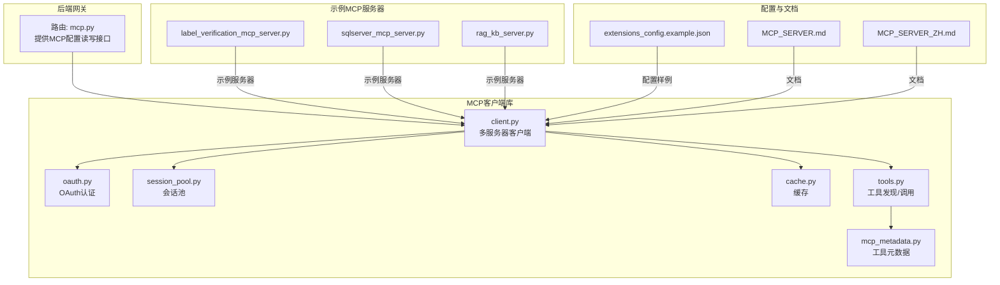
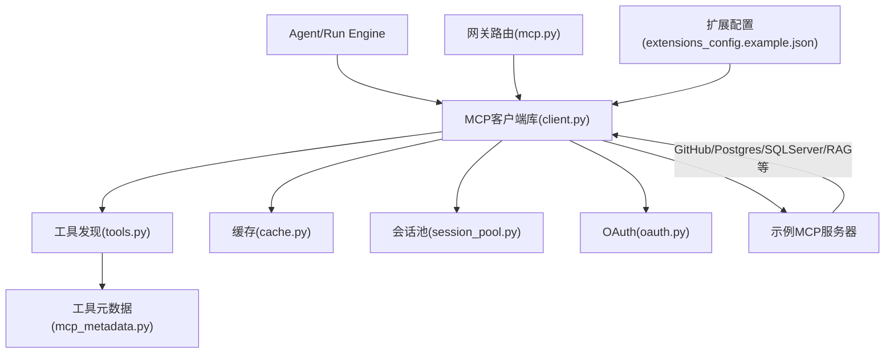
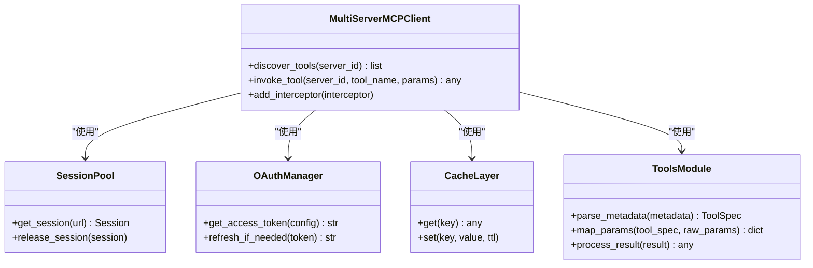
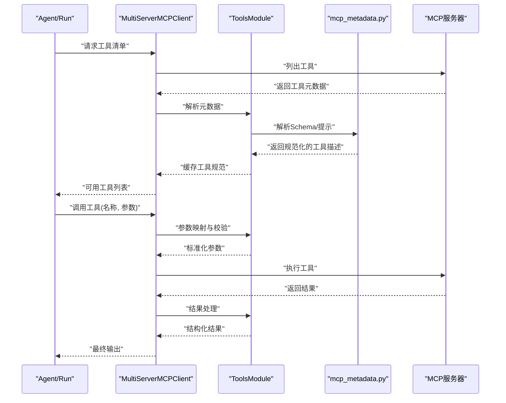
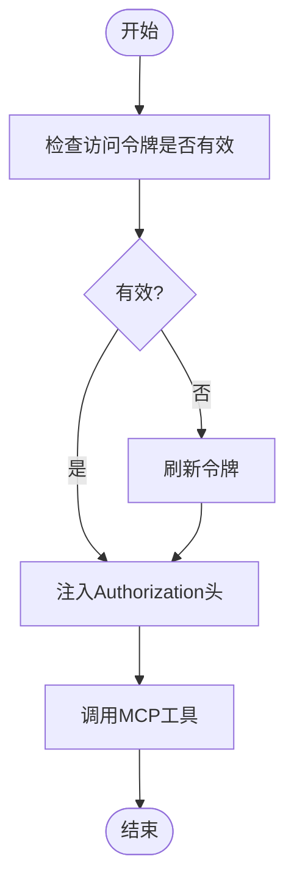
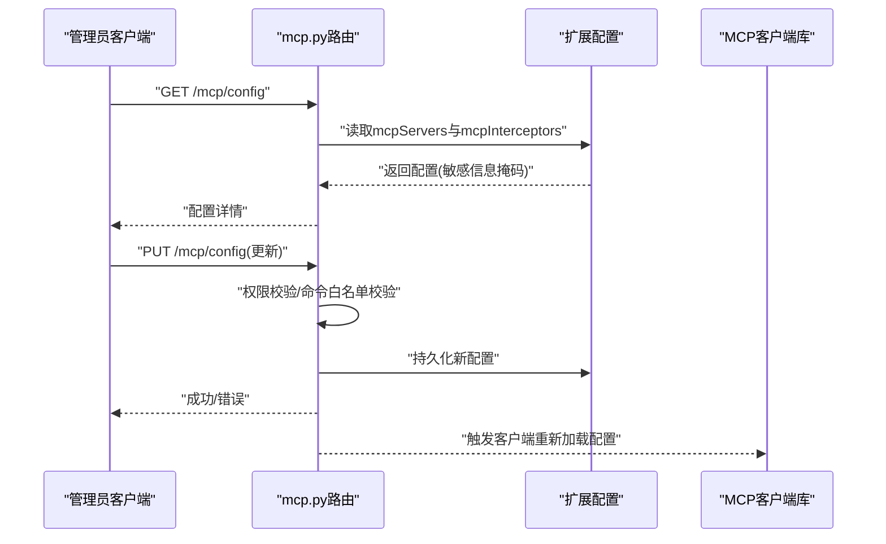
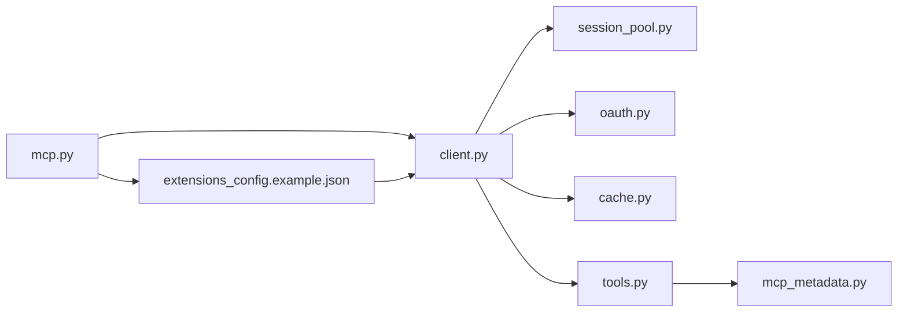

# MCP集成

<cite>
**本文引用的文件**
- [mcp.py](file://backend/app/gateway/routers/mcp.py)
- [MCP_SERVER_ZH.md](file://backend/docs/MCP_SERVER_ZH.md)
- [MCP_SERVER.md](file://backend/docs/MCP_SERVER.md)
- [extensions_config.example.json](file://extensions_config.example.json)
- [__init__.py](file://backend/packages/harness/deerflow/mcp/__init__.py)
- [cache.py](file://backend/packages/harness/deerflow/mcp/cache.py)
- [client.py](file://backend/packages/harness/deerflow/mcp/client.py)
- [oauth.py](file://backend/packages/harness/deerflow/mcp/oauth.py)
- [session_pool.py](file://backend/packages/harness/deerflow/mcp/session_pool.py)
- [tools.py](file://backend/packages/harness/deerflow/mcp/tools.py)
- [mcp_metadata.py](file://backend/packages/harness/deerflow/tools/mcp_metadata.py)
- [label_verification_mcp_server.py](file://mcp_servers/label_verification_mcp_server.py)
- [sqlserver_mcp_server.py](file://mcp_servers/sqlserver_mcp_server.py)
- [rag_kb_server.py](file://mcp_servers/rag_kb_server.py)
- [label_verification_lib.py](file://mcp_servers/label_verification_lib.py)
- [test_mcp_client_config.py](file://backend/tests/test_mcp_client_config.py)
- [test_mcp_oauth.py](file://backend/tests/test_mcp_oauth.py)
- [test_mcp_session_pool.py](file://backend/tests/test_mcp_session_pool.py)
- [test_mcp_custom_interceptors.py](file://backend/tests/test_mcp_custom_interceptors.py)
- [test_mcp_config_secrets.py](file://backend/tests/test_mcp_config_secrets.py)
</cite>

## 目录
1. [简介](#简介)
2. [项目结构](#项目结构)
3. [核心组件](#核心组件)
4. [架构总览](#架构总览)
5. [详细组件分析](#详细组件分析)
6. [依赖关系分析](#依赖关系分析)
7. [性能考虑](#性能考虑)
8. [故障排查指南](#故障排查指南)
9. [结论](#结论)
10. [附录](#附录)

## 简介
本文件面向DeerFlow MCP（Model Context Protocol）集成，系统性阐述MCP客户端实现架构与工具生态，包括多服务器客户端、缓存机制、OAuth认证与会话池管理；详解MCP工具的发现与调用流程（元数据解析、参数映射、结果处理）；提供MCP服务器配置与工具注册示例；对比MCP与传统工具系统的差异与优势，并给出开发自定义MCP服务器的实践指引。

## 项目结构
MCP能力主要由后端网关路由、MCP客户端库、工具元数据与测试用例构成，同时包含若干参考型MCP服务器示例。

**图表来源**
- [mcp.py](file://backend/app/gateway/routers/mcp.py)
- [client.py](file://backend/packages/harness/deerflow/mcp/client.py)
- [oauth.py](file://backend/packages/harness/deerflow/mcp/oauth.py)
- [session_pool.py](file://backend/packages/harness/deerflow/mcp/session_pool.py)
- [cache.py](file://backend/packages/harness/deerflow/mcp/cache.py)
- [tools.py](file://backend/packages/harness/deerflow/mcp/tools.py)
- [mcp_metadata.py](file://backend/packages/harness/deerflow/tools/mcp_metadata.py)
- [label_verification_mcp_server.py](file://mcp_servers/label_verification_mcp_server.py)
- [sqlserver_mcp_server.py](file://mcp_servers/sqlserver_mcp_server.py)
- [rag_kb_server.py](file://mcp_servers/rag_kb_server.py)
- [extensions_config.example.json](file://extensions_config.example.json)
- [MCP_SERVER.md](file://backend/docs/MCP_SERVER.md)
- [MCP_SERVER_ZH.md](file://backend/docs/MCP_SERVER_ZH.md)

**章节来源**
- [mcp.py](file://backend/app/gateway/routers/mcp.py)
- [extensions_config.example.json](file://extensions_config.example.json)
- [MCP_SERVER.md](file://backend/docs/MCP_SERVER.md)
- [MCP_SERVER_ZH.md](file://backend/docs/MCP_SERVER_ZH.md)

## 核心组件
- 多服务器客户端：统一管理多个MCP服务器实例，负责工具发现、调用与拦截器注入。
- 缓存机制：对工具元数据与部分查询结果进行缓存，降低重复请求开销。
- OAuth认证：支持HTTP类型MCP服务器的OAuth令牌获取与刷新。
- 会话池：复用HTTP连接，提升并发与稳定性。
- 工具发现与调用：解析工具元数据，执行参数映射与结果处理。
- 工具元数据：描述工具签名、输入输出模式与提示信息。
- 网关路由：提供MCP配置的读取与更新接口，支持安全策略与命令白名单。

**章节来源**
- [client.py](file://backend/packages/harness/deerflow/mcp/client.py)
- [cache.py](file://backend/packages/harness/deerflow/mcp/cache.py)
- [oauth.py](file://backend/packages/harness/deerflow/mcp/oauth.py)
- [session_pool.py](file://backend/packages/harness/deerflow/mcp/session_pool.py)
- [tools.py](file://backend/packages/harness/deerflow/mcp/tools.py)
- [mcp_metadata.py](file://backend/packages/harness/deerflow/tools/mcp_metadata.py)
- [mcp.py](file://backend/app/gateway/routers/mcp.py)

## 架构总览
下图展示MCP客户端在系统中的位置与交互关系：网关路由负责配置管理，客户端库负责与MCP服务器通信，工具模块负责元数据解析与调用编排。

**图表来源**
- [client.py](file://backend/packages/harness/deerflow/mcp/client.py)
- [tools.py](file://backend/packages/harness/deerflow/mcp/tools.py)
- [cache.py](file://backend/packages/harness/deerflow/mcp/cache.py)
- [session_pool.py](file://backend/packages/harness/deerflow/mcp/session_pool.py)
- [oauth.py](file://backend/packages/harness/deerflow/mcp/oauth.py)
- [mcp_metadata.py](file://backend/packages/harness/deerflow/tools/mcp_metadata.py)
- [mcp.py](file://backend/app/gateway/routers/mcp.py)
- [extensions_config.example.json](file://extensions_config.example.json)
- [label_verification_mcp_server.py](file://mcp_servers/label_verification_mcp_server.py)
- [sqlserver_mcp_server.py](file://mcp_servers/sqlserver_mcp_server.py)
- [rag_kb_server.py](file://mcp_servers/rag_kb_server.py)

## 详细组件分析

### 多服务器客户端（client.py）
- 角色与职责
  - 统一接入多个MCP服务器（stdio/http），抽象出一致的工具发现与调用接口。
  - 支持工具拦截器链路，允许在每次工具调用前注入请求头、日志或指标。
  - 与会话池、缓存、OAuth模块协同工作，优化性能与安全性。
- 关键设计点
  - 服务器类型区分：stdio（进程启动）、http（URL直连）。
  - 工具拦截器：通过扩展配置声明，构建函数返回与MultiServerMCPClient接口兼容的异步拦截器。
  - 安全策略：默认允许npx作为stdio命令，可通过环境变量限制白名单。

**图表来源**
- [client.py](file://backend/packages/harness/deerflow/mcp/client.py)
- [session_pool.py](file://backend/packages/harness/deerflow/mcp/session_pool.py)
- [oauth.py](file://backend/packages/harness/deerflow/mcp/oauth.py)
- [cache.py](file://backend/packages/harness/deerflow/mcp/cache.py)
- [tools.py](file://backend/packages/harness/deerflow/mcp/tools.py)

**章节来源**
- [client.py](file://backend/packages/harness/deerflow/mcp/client.py)
- [MCP_SERVER.md](file://backend/docs/MCP_SERVER.md)
- [MCP_SERVER_ZH.md](file://backend/docs/MCP_SERVER_ZH.md)

### 工具发现与调用流程（tools.py + mcp_metadata.py）
- 工具发现
  - 通过客户端向各MCP服务器请求工具清单，客户端缓存元数据以减少重复拉取。
  - 元数据解析：提取工具名称、参数Schema、返回格式与提示信息。
- 参数映射
  - 将上游传入的参数与工具Schema进行匹配与转换，确保类型与必填约束满足。
- 结果处理
  - 对原始结果进行结构化处理，必要时进行序列化或二次加工，供后续步骤使用。

**图表来源**
- [tools.py](file://backend/packages/harness/deerflow/mcp/tools.py)
- [mcp_metadata.py](file://backend/packages/harness/deerflow/tools/mcp_metadata.py)
- [client.py](file://backend/packages/harness/deerflow/mcp/client.py)

**章节来源**
- [tools.py](file://backend/packages/harness/deerflow/mcp/tools.py)
- [mcp_metadata.py](file://backend/packages/harness/deerflow/tools/mcp_metadata.py)

### 缓存机制（cache.py）
- 目标
  - 减少对MCP服务器的重复请求，提升响应速度与稳定性。
- 策略
  - 基于键值存储工具元数据与热点查询结果，设置合理TTL。
  - 在工具清单变更或显式刷新时失效缓存。

**章节来源**
- [cache.py](file://backend/packages/harness/deerflow/mcp/cache.py)

### OAuth认证（oauth.py）
- 适用场景
  - HTTP类型的MCP服务器需要访问受保护资源时，通过OAuth获取与刷新访问令牌。
- 流程
  - 初始化OAuth配置（token_url、grant_type、client_id/secret、scope、refresh_skew_seconds）。
  - 在工具调用前检查令牌有效性，必要时触发刷新。
  - 将令牌注入到请求头中，随工具调用发送至服务器。

**图表来源**
- [oauth.py](file://backend/packages/harness/deerflow/mcp/oauth.py)
- [MCP_SERVER.md](file://backend/docs/MCP_SERVER.md)

**章节来源**
- [oauth.py](file://backend/packages/harness/deerflow/mcp/oauth.py)
- [MCP_SERVER.md](file://backend/docs/MCP_SERVER.md)

### 会话池管理（session_pool.py）
- 目标
  - 复用HTTP连接，降低握手开销，提升并发吞吐。
- 策略
  - 按服务器URL维护连接池，按需获取与释放会话。
  - 结合超时与重试策略，增强鲁棒性。

**章节来源**
- [session_pool.py](file://backend/packages/harness/deerflow/mcp/session_pool.py)

### 网关路由与配置（mcp.py + extensions_config.example.json）
- 路由职责
  - 提供MCP配置的GET/PUT接口，支持管理员权限校验与敏感字段掩码。
  - 返回当前已加载的MCP服务器配置（含类型、命令/URL、环境变量、描述等）。
- 配置要点
  - 支持stdio与http两类服务器。
  - http服务器可配置OAuth子域。
  - 可通过mcpInterceptors声明工具拦截器构建函数。
  - 默认允许npx作为stdio命令，可通过环境变量限制白名单。

**图表来源**
- [mcp.py](file://backend/app/gateway/routers/mcp.py)
- [extensions_config.example.json](file://extensions_config.example.json)
- [MCP_SERVER.md](file://backend/docs/MCP_SERVER.md)
- [MCP_SERVER_ZH.md](file://backend/docs/MCP_SERVER_ZH.md)

**章节来源**
- [mcp.py](file://backend/app/gateway/routers/mcp.py)
- [extensions_config.example.json](file://extensions_config.example.json)
- [MCP_SERVER.md](file://backend/docs/MCP_SERVER.md)
- [MCP_SERVER_ZH.md](file://backend/docs/MCP_SERVER_ZH.md)

### 示例MCP服务器（mcp_servers）
- 标签验证服务器：演示如何实现标签验证类工具。
- SQL Server服务器：演示数据库类工具的MCP实现。
- RAG知识库服务器：演示检索增强工具的MCP实现。

**章节来源**
- [label_verification_mcp_server.py](file://mcp_servers/label_verification_mcp_server.py)
- [sqlserver_mcp_server.py](file://mcp_servers/sqlserver_mcp_server.py)
- [rag_kb_server.py](file://mcp_servers/rag_kb_server.py)

## 依赖关系分析
- 组件耦合
  - MultiServerMCPClient对SessionPool、OAuthManager、CacheLayer、ToolsModule存在直接依赖。
  - ToolsModule依赖mcp_metadata进行Schema解析。
  - 网关路由与扩展配置文件耦合，用于驱动客户端初始化。
- 外部依赖
  - HTTP服务器（如GitHub、Postgres、Brave Search等）。
  - OAuth提供商（如client_credentials授权）。
- 拦截器接口
  - 通过扩展配置声明，构建与MultiServerMCPClient工具拦截器接口兼容的异步拦截器。

**图表来源**
- [client.py](file://backend/packages/harness/deerflow/mcp/client.py)
- [session_pool.py](file://backend/packages/harness/deerflow/mcp/session_pool.py)
- [oauth.py](file://backend/packages/harness/deerflow/mcp/oauth.py)
- [cache.py](file://backend/packages/harness/deerflow/mcp/cache.py)
- [tools.py](file://backend/packages/harness/deerflow/mcp/tools.py)
- [mcp_metadata.py](file://backend/packages/harness/deerflow/tools/mcp_metadata.py)
- [mcp.py](file://backend/app/gateway/routers/mcp.py)
- [extensions_config.example.json](file://extensions_config.example.json)

**章节来源**
- [client.py](file://backend/packages/harness/deerflow/mcp/client.py)
- [tools.py](file://backend/packages/harness/deerflow/mcp/tools.py)
- [mcp_metadata.py](file://backend/packages/harness/deerflow/tools/mcp_metadata.py)
- [mcp.py](file://backend/app/gateway/routers/mcp.py)
- [extensions_config.example.json](file://extensions_config.example.json)

## 性能考虑
- 连接复用：通过会话池减少TCP/TLS握手次数，提升高并发下的吞吐量。
- 缓存策略：对工具元数据与热点查询结果进行缓存，降低服务器压力。
- 拦截器最小化：仅在必要时注入额外头或日志，避免增加调用延迟。
- 并发控制：根据服务器负载与网络状况调整并发度，结合超时与重试策略。
- 配置热更新：在不重启服务的情况下动态加载新配置，减少停机时间。

## 故障排查指南
- 认证失败
  - 检查OAuth配置（token_url、grant_type、client_id/secret、scope）是否正确。
  - 确认令牌未过期且刷新逻辑正常工作。
- 工具不可用
  - 确认工具已在目标服务器上注册并可被发现。
  - 检查参数映射是否符合工具Schema。
- 权限问题
  - 管理员接口仅允许系统管理员操作，普通用户会收到403。
  - stdio命令默认允许npx，可通过环境变量限制白名单。
- 拦截器异常
  - 拦截器构建函数需返回可调用对象，否则会被跳过并记录警告。

**章节来源**
- [test_mcp_oauth.py](file://backend/tests/test_mcp_oauth.py)
- [test_mcp_session_pool.py](file://backend/tests/test_mcp_session_pool.py)
- [test_mcp_custom_interceptors.py](file://backend/tests/test_mcp_custom_interceptors.py)
- [test_mcp_config_secrets.py](file://backend/tests/test_mcp_config_secrets.py)

## 结论
MCP集成通过多服务器客户端统一管理不同来源的工具，结合缓存、OAuth与会话池，在保证安全性的同时显著提升了工具发现与调用的效率。配合网关路由与扩展配置，系统实现了即插即用的工具生态，相较传统工具系统具备更强的可扩展性与可维护性。

## 附录

### MCP服务器配置与工具注册示例
- 扩展配置样例
  - 包含stdio与http两类服务器示例，以及OAuth配置字段。
- 工具拦截器
  - 通过mcpInterceptors声明构建函数，注入认证头或日志等横切关注点。

**章节来源**
- [extensions_config.example.json](file://extensions_config.example.json)
- [MCP_SERVER.md](file://backend/docs/MCP_SERVER.md)
- [MCP_SERVER_ZH.md](file://backend/docs/MCP_SERVER_ZH.md)

### 开发自定义MCP服务器
- 参考现有示例
  - 标签验证服务器、SQL Server服务器、RAG知识库服务器展示了不同领域的工具实现思路。
- 关键步骤
  - 实现工具清单与调用协议，确保与客户端约定一致。
  - 提供稳定的HTTP或stdio接口，便于集成与部署。
  - 如需访问受保护资源，实现OAuth或代理鉴权。

**章节来源**
- [label_verification_mcp_server.py](file://mcp_servers/label_verification_mcp_server.py)
- [sqlserver_mcp_server.py](file://mcp_servers/sqlserver_mcp_server.py)
- [rag_kb_server.py](file://mcp_servers/rag_kb_server.py)