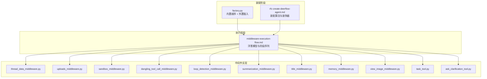
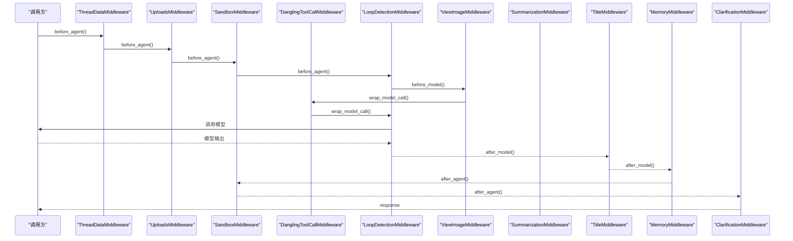
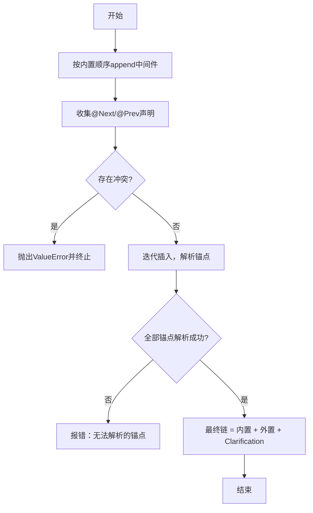

# 中间件系统

<cite>
**本文引用的文件**
- [factory.py](file://backend/packages/harness/deerflow/agents/factory.py)
- [rfc-create-deerflow-agent.md](file://backend/docs/rfc-create-deerflow-agent.md)
- [middleware-execution-flow.md](file://backend/docs/middleware-execution-flow.md)
- [thread_data_middleware.py](file://backend/packages/harness/deerflow/agents/middlewares/thread_data_middleware.py)
- [uploads_middleware.py](file://backend/packages/harness/deerflow/agents/middlewares/uploads_middleware.py)
- [sandbox_middleware.py](file://backend/packages/harness/deerflow/agents/middlewares/sandbox_middleware.py)
- [dangling_tool_call_middleware.py](file://backend/packages/harness/deerflow/agents/middlewares/dangling_tool_call_middleware.py)
- [loop_detection_middleware.py](file://backend/packages/harness/deerflow/agents/middlewares/loop_detection_middleware.py)
- [summarization_middleware.py](file://backend/packages/harness/deerflow/agents/middlewares/summarization_middleware.py)
- [title_middleware.py](file://backend/packages/harness/deerflow/agents/middlewares/title_middleware.py)
- [memory_middleware.py](file://backend/packages/harness/deerflow/agents/middlewares/memory_middleware.py)
- [view_image_middleware.py](file://backend/packages/harness/deerflow/agents/middlewares/view_image_middleware.py)
- [task_tool.py](file://backend/packages/harness/deerflow/tools/task_tool.py)
- [ask_clarification_tool.py](file://backend/packages/harness/deerflow/tools/ask_clarification_tool.py)
- [journal.py](file://backend/packages/harness/deerflow/runtime/journal.py)
- [app_config.py](file://backend/packages/harness/deerflow/config/app_config.py)
- [token_usage_config.py](file://backend/packages/harness/deerflow/config/token_usage_config.py)
- [guardrails_config.py](file://backend/packages/harness/deerflow/config/guardrails_config.py)
- [loop_detection_config.py](file://backend/packages/harness/deerflow/config/loop_detection_config.py)
- [safety_finish_reason_config.py](file://backend/packages/harness/deerflow/config/safety_finish_reason_config.py)
- [auth_middleware.py](file://backend/app/gateway/auth_middleware.py)
- [csrf_middleware.py](file://backend/app/gateway/csrf_middleware.py)
</cite>

## 目录
1. [引言](#引言)
2. [项目结构](#项目结构)
3. [核心组件](#核心组件)
4. [架构总览](#架构总览)
5. [详细组件分析](#详细组件分析)
6. [依赖关系分析](#依赖关系分析)
7. [性能考量](#性能考量)
8. [故障排查指南](#故障排查指南)
9. [结论](#结论)
10. [附录](#附录)

## 引言
本文件面向DeerFlow中间件系统，系统性阐述中间件链的执行机制、注册顺序、执行流程与数据传递方式，并逐项解析各中间件的功能职责（线程数据初始化、文件上传处理、沙箱环境获取、上下文摘要、标题生成、任务跟踪、图像处理与澄清处理）。文档还提供中间件实现模式、配置选项与扩展方法，解释中间件与代理核心及外部系统的交互方式，并给出性能优化策略。

## 项目结构
中间件体系位于后端Python包deerflow.agents下，核心由“工厂装配”“执行流程图”“具体中间件实现”三部分组成：
- 工厂装配：根据运行特性与配置，按固定顺序构建中间件链，并支持外置中间件通过@Next/@Prev装饰器插入。
- 执行流程：以“洋葱模型”描述中间件在before_agent/before_model/wrap_model_call/after_model/after_agent各阶段的调用顺序与数据流。
- 具体中间件：覆盖线程数据、上传、沙箱、工具错误处理、循环检测、摘要、标题、记忆、图像查看、任务工具、澄清等。

图表来源
- [factory.py:306-379](file://backend/packages/harness/deerflow/agents/factory.py#L306-L379)
- [rfc-create-deerflow-agent.md:190-284](file://backend/docs/rfc-create-deerflow-agent.md#L190-L284)
- [middleware-execution-flow.md:32-224](file://backend/docs/middleware-execution-flow.md#L32-L224)

章节来源
- [factory.py:306-379](file://backend/packages/harness/deerflow/agents/factory.py#L306-L379)
- [rfc-create-deerflow-agent.md:190-284](file://backend/docs/rfc-create-deerflow-agent.md#L190-L284)
- [middleware-execution-flow.md:32-224](file://backend/docs/middleware-execution-flow.md#L32-L224)

## 核心组件
- 中间件链装配器：依据运行特性与配置，按固定顺序append内置中间件，再通过@Next/@Prev插入外置中间件；最后强制将ClarificationMiddleware置于链尾。
- 执行引擎：采用“洋葱模型”，按阶段顺序执行，before_*正序、after_*反序，wrap_model_call贯穿模型调用前后。
- 数据通道：中间件通过共享状态对象（AgentState/ThreadState）传递上下文，Journal记录中间件钩子事件，便于可观测性与调试。

章节来源
- [rfc-create-deerflow-agent.md:190-284](file://backend/docs/rfc-create-deerflow-agent.md#L190-L284)
- [middleware-execution-flow.md:32-224](file://backend/docs/middleware-execution-flow.md#L32-L224)
- [journal.py:488](file://backend/packages/harness/deerflow/runtime/journal.py#L488)

## 架构总览
中间件链在代理生命周期的关键节点执行，形成“前置处理—模型调用—后置处理”的完整闭环。下图展示典型链路与阶段：

图表来源
- [middleware-execution-flow.md:32-224](file://backend/docs/middleware-execution-flow.md#L32-L224)
- [rfc-create-deerflow-agent.md:190-284](file://backend/docs/rfc-create-deerflow-agent.md#L190-L284)

## 详细组件分析

### 中间件装配与排序策略
- 固定顺序：内置中间件严格按代码append顺序确定，不参与@Next/@Prev调整。
- 外置插入：通过@Next/@Prev装饰器声明锚点，支持跨中间件锚定；插入过程包含冲突检测与循环依赖检测。
- 结束约束：ClarificationMiddleware始终位于链尾，确保其能优先拦截模型输出。

图表来源
- [factory.py:306-379](file://backend/packages/harness/deerflow/agents/factory.py#L306-L379)
- [rfc-create-deerflow-agent.md:238-284](file://backend/docs/rfc-create-deerflow-agent.md#L238-L284)

章节来源
- [factory.py:306-379](file://backend/packages/harness/deerflow/agents/factory.py#L306-L379)
- [rfc-create-deerflow-agent.md:190-284](file://backend/docs/rfc-create-deerflow-agent.md#L190-L284)

### 线程数据初始化（ThreadDataMiddleware）
- 职责：在会话开始时创建线程目录与基础上下文，保证后续中间件与工具可访问一致的线程状态。
- 关键点：作为链首执行，确保后续中间件在统一的线程空间内工作。

章节来源
- [thread_data_middleware.py:17-23](file://backend/packages/harness/deerflow/agents/middlewares/thread_data_middleware.py#L17-L23)

### 文件上传处理（UploadsMiddleware）
- 职责：扫描并处理上传附件，为后续工具与模型提供输入准备。
- 关键点：紧随线程数据之后，确保上传资源在沙箱与模型调用前可用。

章节来源
- [uploads_middleware.py](file://backend/packages/harness/deerflow/agents/middlewares/uploads_middleware.py)

### 沙箱环境获取（SandboxMiddleware）
- 职责：分配与回收沙箱资源，隔离工具执行环境，保障安全与稳定性。
- 关键点：在上传之后、循环检测之前，确保工具在受控环境中执行；after_agent阶段释放资源。

章节来源
- [sandbox_middleware.py](file://backend/packages/harness/deerflow/agents/middlewares/sandbox_middleware.py)

### 循环检测（LoopDetectionMiddleware）
- 职责：在before_agent/before_model/wrap_model_call/after_model/after_agent多点注入与清理警告，防止长时间无进展或死循环。
- 关键点：在链中部靠前位置，贯穿模型调用前后，确保及时发现并处理异常。

章节来源
- [loop_detection_middleware.py:173](file://backend/packages/harness/deerflow/agents/middlewares/loop_detection_middleware.py#L173)

### 上下文摘要（SummarizationMiddleware）
- 职责：对对话历史进行摘要，降低上下文长度，提升长对话效率。
- 关键点：按需启用，通常在标题生成之前执行，减少模型负担。

章节来源
- [summarization_middleware.py:98](file://backend/packages/harness/deerflow/agents/middlewares/summarization_middleware.py#L98)

### 标题生成（TitleMiddleware）
- 职责：基于对话内容生成标题，便于检索与归档。
- 关键点：在摘要之后、记忆之前，确保标题反映最新上下文。

章节来源
- [title_middleware.py:22-28](file://backend/packages/harness/deerflow/agents/middlewares/title_middleware.py#L22-L28)

### 记忆（MemoryMiddleware）
- 职责：将当前轮次的记忆入队，供后续会话复用。
- 关键点：after_agent阶段执行，确保资源释放后再持久化。

章节来源
- [memory_middleware.py:21-27](file://backend/packages/harness/deerflow/agents/middlewares/memory_middleware.py#L21-L27)

### 图像处理（ViewImageMiddleware）
- 职责：将图片转换为模型可消费的格式（如base64），注入到提示词中。
- 关键点：在before_model阶段执行，确保模型输入包含图像信息。

章节来源
- [view_image_middleware.py](file://backend/packages/harness/deerflow/agents/middlewares/view_image_middleware.py)

### 任务跟踪（SubagentLimitMiddleware + TaskTool）
- 职责：限制子代理任务数量，避免过度拆分；TaskTool用于创建与管理任务。
- 关键点：在标题生成之后、记忆之前，确保任务边界清晰。

章节来源
- [subagent_limit_middleware.py:24](file://backend/packages/harness/deerflow/agents/middlewares/subagent_limit_middleware.py#L24)
- [task_tool.py](file://backend/packages/harness/deerflow/tools/task_tool.py)

### 澄清处理（ClarificationMiddleware + AskClarificationTool）
- 职责：在链尾拦截模型输出，若需要更多信息则引导用户提供澄清。
- 关键点：强制位于链尾，确保所有中间件处理完成后才进行澄清。

章节来源
- [clarification_middleware.py:18-24](file://backend/packages/harness/deerflow/agents/middlewares/clarification_middleware.py#L18-L24)
- [ask_clarification_tool.py](file://backend/packages/harness/deerflow/tools/ask_clarification_tool.py)

### 工具错误处理（ToolErrorHandlingMiddleware）
- 职责：捕获并规范化工具调用错误，避免中断代理流程。
- 关键点：在沙箱之后、摘要之前，确保工具失败不影响整体链路。

章节来源
- [tool_error_handling_middleware.py](file://backend/packages/harness/deerflow/agents/middlewares/tool_error_handling_middleware.py)

### 悬空工具消息处理（DanglingToolCallMiddleware）
- 职责：补全缺失的工具消息，保证消息序列完整性。
- 关键点：在wrap_model_call阶段执行，确保模型输出与工具调用匹配。

章节来源
- [dangling_tool_call_middleware.py:34](file://backend/packages/harness/deerflow/agents/middlewares/dangling_tool_call_middleware.py#L34)

### 安全完成原因（SafetyFinishReasonMiddleware）
- 职责：拦截并替换某些提供商的安全过滤导致的完成原因。
- 关键点：在after_model阶段执行，确保对外返回一致的语义。

章节来源
- [safety_finish_reason_middleware.py:66](file://backend/packages/harness/deerflow/agents/middlewares/safety_finish_reason_middleware.py#L66)

### 网关中间件（认证与CSRF）
- 职责：在HTTP入口处进行身份验证与CSRF防护，确保请求合法性。
- 关键点：独立于代理中间件链，属于网关层安全控制。

章节来源
- [auth_middleware.py:58](file://backend/app/gateway/auth_middleware.py#L58)
- [csrf_middleware.py:178](file://backend/app/gateway/csrf_middleware.py#L178)

## 依赖关系分析
- 组件耦合：中间件通过共享状态对象与工具接口耦合，彼此解耦于具体实现细节。
- 外部依赖：沙箱、上传管理、记忆存储、图像处理工具等均作为外部系统集成点。
- 配置驱动：Token用量、守卫护栏、循环检测、安全完成原因等通过配置开关控制。

```mermaid
graph LR
CFG["AppConfig<br/>token_usage_config.py<br/>guardrails_config.py<br/>loop_detection_config.py<br/>safety_finish_reason_config.py"]
FAC["factory.py"]
FLOW["middleware-execution-flow.md"]
TD["ThreadDataMiddleware"]
UL["UploadsMiddleware"]
SB["SandboxMiddleware"]
DTC["DanglingToolCallMiddleware"]
LD["LoopDetectionMiddleware"]
SUM["SummarizationMiddleware"]
TI["TitleMiddleware"]
MEM["MemoryMiddleware"]
VI["ViewImageMiddleware"]
ST["SubagentLimitMiddleware"]
TT["TaskTool"]
CL["ClarificationMiddleware"]
ACT["AskClarificationTool"]
CFG --> FAC
FAC --> FLOW
FLOW --> TD --> UL --> SB --> LD
LD --> DTC
LD --> VI
VI --> SUM --> TI --> MEM --> SB
TI --> ST --> TT --> MEM
MEM --> CL
CL --> ACT
```

图表来源
- [app_config.py:120-123](file://backend/packages/harness/deerflow/config/app_config.py#L120-L123)
- [token_usage_config.py:6](file://backend/packages/harness/deerflow/config/token_usage_config.py#L6)
- [guardrails_config.py:20](file://backend/packages/harness/deerflow/config/guardrails_config.py#L20)
- [loop_detection_config.py](file://backend/packages/harness/deerflow/config/loop_detection_config.py)
- [safety_finish_reason_config.py](file://backend/packages/harness/deerflow/config/safety_finish_reason_config.py)
- [factory.py:306-379](file://backend/packages/harness/deerflow/agents/factory.py#L306-L379)
- [middleware-execution-flow.md:32-224](file://backend/docs/middleware-execution-flow.md#L32-L224)

章节来源
- [app_config.py:120-123](file://backend/packages/harness/deerflow/config/app_config.py#L120-L123)
- [token_usage_config.py:6](file://backend/packages/harness/deerflow/config/token_usage_config.py#L6)
- [guardrails_config.py:20](file://backend/packages/harness/deerflow/config/guardrails_config.py#L20)
- [loop_detection_config.py](file://backend/packages/harness/deerflow/config/loop_detection_config.py)
- [safety_finish_reason_config.py](file://backend/packages/harness/deerflow/config/safety_finish_reason_config.py)
- [factory.py:306-379](file://backend/packages/harness/deerflow/agents/factory.py#L306-L379)
- [middleware-execution-flow.md:32-224](file://backend/docs/middleware-execution-flow.md#L32-L224)

## 性能考量
- 上下文压缩：启用摘要中间件，定期压缩历史，降低token消耗与延迟。
- 并发与隔离：沙箱中间件隔离工具执行，避免阻塞与资源争用；上传处理异步化以减少等待。
- 警告与早停：循环检测中间件在早期注入warning，在wrap_model_call阶段注入当前run warning，有助于快速收敛。
- 观测与回放：Journal记录中间件钩子事件，便于定位瓶颈与回归分析。

章节来源
- [middleware-execution-flow.md:32-224](file://backend/docs/middleware-execution-flow.md#L32-L224)
- [journal.py:488](file://backend/packages/harness/deerflow/runtime/journal.py#L488)

## 故障排查指南
- 中间件插入失败：检查@Next/@Prev声明是否冲突或锚点不存在，遵循“两阶段排序”原则。
- 循环检测误报：核对before_model/wrap_model_call/after_model阶段的warning注入与清理逻辑。
- 图像处理异常：确认ViewImageMiddleware在before_model阶段正确注入图像数据。
- 沙箱资源泄漏：检查after_agent阶段是否释放沙箱，避免孤儿进程与文件句柄泄露。
- 网关安全拦截：若出现认证或CSRF相关问题，核查网关中间件配置与请求头。

章节来源
- [factory.py:306-379](file://backend/packages/harness/deerflow/agents/factory.py#L306-L379)
- [loop_detection_middleware.py:173](file://backend/packages/harness/deerflow/agents/middlewares/loop_detection_middleware.py#L173)
- [view_image_middleware.py](file://backend/packages/harness/deerflow/agents/middlewares/view_image_middleware.py)
- [sandbox_middleware.py](file://backend/packages/harness/deerflow/agents/middlewares/sandbox_middleware.py)
- [auth_middleware.py:58](file://backend/app/gateway/auth_middleware.py#L58)
- [csrf_middleware.py:178](file://backend/app/gateway/csrf_middleware.py#L178)

## 结论
DeerFlow中间件系统通过“固定顺序+外置插入”的装配策略与“洋葱模型”的执行机制，实现了高内聚、低耦合的可扩展架构。各中间件职责明确、数据传递清晰，并通过配置与工具接口与外部系统无缝集成。遵循本文提供的实现模式、配置选项与扩展方法，可在保证性能与安全的前提下快速定制与优化中间件链。

## 附录
- 实现模式要点
  - 使用@Next/@Prev装饰器声明插入位置，避免直接修改内置顺序。
  - 在before_agent/before_model/wrap_model_call/after_model/after_agent各阶段按需读写状态。
  - 将最终拦截类（如ClarificationMiddleware）置于链尾。
- 配置选项参考
  - Token用量追踪：开启/关闭与默认行为。
  - 守卫护栏：启用与否与策略。
  - 循环检测：阈值与行为配置。
  - 安全完成原因：拦截与替换策略。

章节来源
- [rfc-create-deerflow-agent.md:238-284](file://backend/docs/rfc-create-deerflow-agent.md#L238-L284)
- [token_usage_config.py:6](file://backend/packages/harness/deerflow/config/token_usage_config.py#L6)
- [guardrails_config.py:20](file://backend/packages/harness/deerflow/config/guardrails_config.py#L20)
- [loop_detection_config.py](file://backend/packages/harness/deerflow/config/loop_detection_config.py)
- [safety_finish_reason_config.py](file://backend/packages/harness/deerflow/config/safety_finish_reason_config.py)