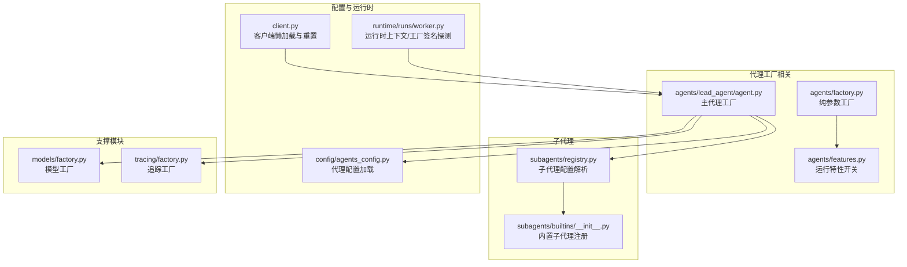
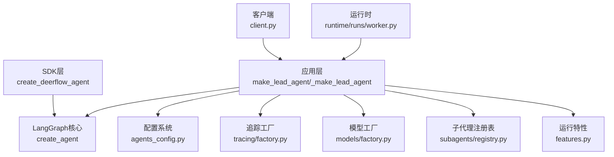
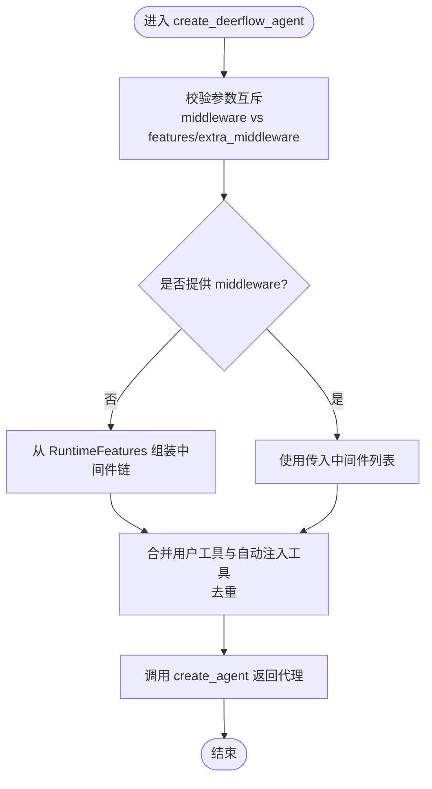
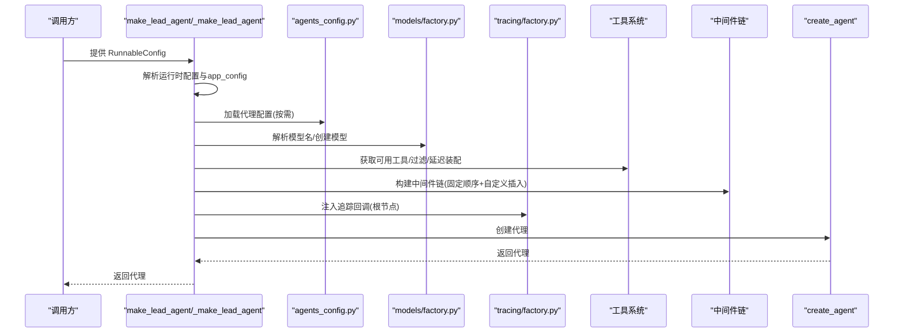
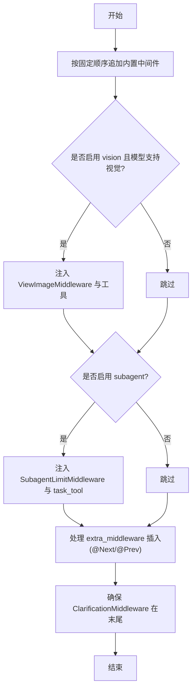
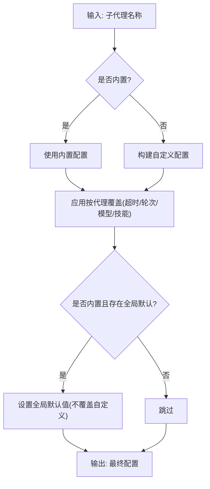
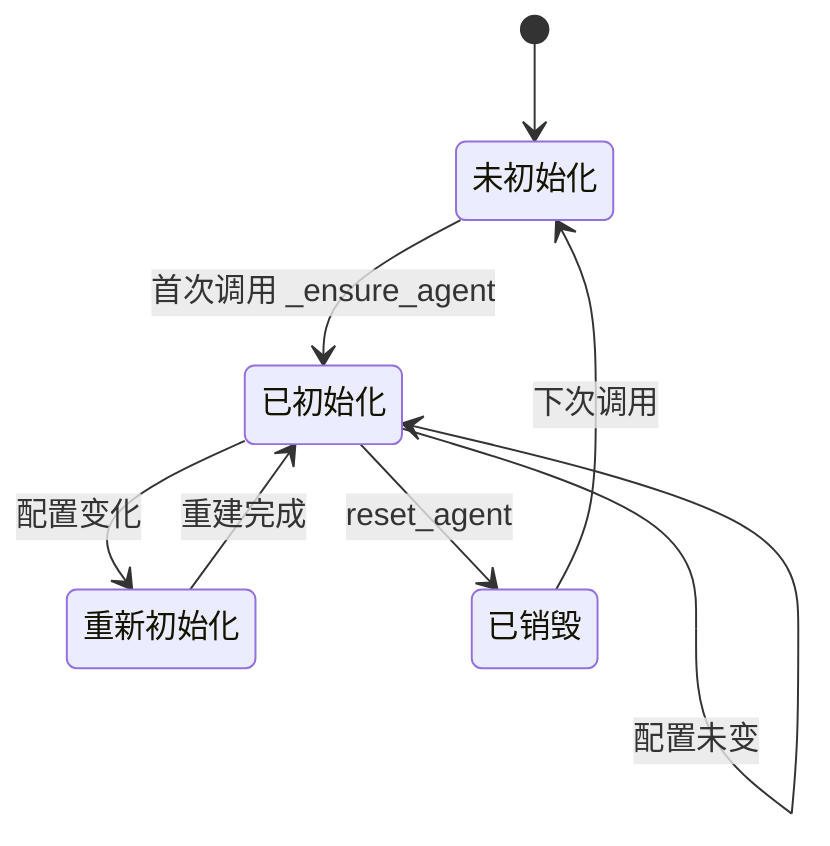
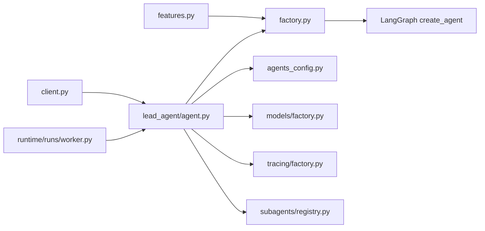

# 代理工厂

<cite>
**本文引用的文件**
- [agents/factory.py](file://backend/packages/harness/deerflow/agents/factory.py)
- [agents/lead_agent/agent.py](file://backend/packages/harness/deerflow/agents/lead_agent/agent.py)
- [agents/features.py](file://backend/packages/harness/deerflow/agents/features.py)
- [subagents/registry.py](file://backend/packages/harness/deerflow/subagents/registry.py)
- [subagents/builtins/__init__.py](file://backend/packages/harness/deerflow/subagents/builtins/__init__.py)
- [runtime/runs/worker.py](file://backend/packages/harness/deerflow/runtime/runs/worker.py)
- [client.py](file://backend/packages/harness/deerflow/client.py)
- [config/agents_config.py](file://backend/packages/harness/deerflow/config/agents_config.py)
- [models/factory.py](file://backend/packages/harness/deerflow/models/factory.py)
- [tracing/factory.py](file://backend/packages/harness/deerflow/tracing/factory.py)
- [rfc-create-deerflow-agent.md](file://backend/docs/rfc-create-deerflow-agent.md)
- [ARCHITECTURE.md](file://backend/docs/ARCHITECTURE.md)
</cite>

## 目录
1. [简介](#简介)
2. [项目结构](#项目结构)
3. [核心组件](#核心组件)
4. [架构总览](#架构总览)
5. [详细组件分析](#详细组件分析)
6. [依赖关系分析](#依赖关系分析)
7. [性能考量](#性能考量)
8. [故障排查指南](#故障排查指南)
9. [结论](#结论)
10. [附录](#附录)

## 简介
本文件面向DeerFlow代理工厂的技术文档，重点阐述AgentFactory类（以函数形式暴露）的设计原理与实现机制，覆盖以下关键主题：
- LeadAgent与SubAgent的创建流程与职责边界
- 中间件链的配置、装配与管理策略
- 工厂模式在代理创建中的应用：参数传递、配置解析与对象实例化
- 如何使用工厂创建不同类型的代理（含自定义代理配置与默认代理设置）
- 代理工厂与配置系统的耦合关系、动态代理创建与生命周期管理

## 项目结构
围绕代理工厂的核心代码主要位于后端Harness包下的agents子模块，并与模型工厂、追踪工厂、子代理注册表等模块协同工作。

**图表来源**
- [agents/factory.py:1-380](file://backend/packages/harness/deerflow/agents/factory.py#L1-L380)
- [agents/lead_agent/agent.py:1-541](file://backend/packages/harness/deerflow/agents/lead_agent/agent.py#L1-L541)
- [agents/features.py](file://backend/packages/harness/deerflow/agents/features.py)
- [subagents/registry.py:50-114](file://backend/packages/harness/deerflow/subagents/registry.py#L50-L114)
- [subagents/builtins/__init__.py:1-15](file://backend/packages/harness/deerflow/subagents/builtins/__init__.py#L1-L15)
- [config/agents_config.py:80-116](file://backend/packages/harness/deerflow/config/agents_config.py#L80-L116)
- [runtime/runs/worker.py:75-113](file://backend/packages/harness/deerflow/runtime/runs/worker.py#L75-L113)
- [client.py:158-239](file://backend/packages/harness/deerflow/client.py#L158-L239)
- [models/factory.py](file://backend/packages/harness/deerflow/models/factory.py)
- [tracing/factory.py](file://backend/packages/harness/deerflow/tracing/factory.py)

**章节来源**
- [agents/factory.py:1-380](file://backend/packages/harness/deerflow/agents/factory.py#L1-L380)
- [agents/lead_agent/agent.py:1-541](file://backend/packages/harness/deerflow/agents/lead_agent/agent.py#L1-L541)

## 核心组件
- 纯参数工厂（SDK级入口）：create_deerflow_agent，接受模型、工具、系统提示、中间件、特性开关、额外中间件、状态模式、检查点等纯参数，零配置依赖，返回可编译的状态图。
- 主代理工厂（应用级入口）：make_lead_agent/_make_lead_agent，负责从运行时配置解析模型名、技能集合、工具集、中间件链、系统提示模板与追踪回调注入，最终委托底层create_agent创建代理。
- 运行特性（RuntimeFeatures）：以布尔或中间件实例的形式声明启用哪些功能，内部组装中间件链并处理工具去重与注入。
- 子代理配置解析：根据名称解析内置或自定义子代理配置，并应用全局默认与按代理覆盖规则。
- 客户端懒加载与重置：DeerFlowClient对代理进行懒创建与变更感知重建，确保外部环境变化（如内存更新、技能安装）能反映到代理行为。
- 运行时上下文与工厂签名探测：在运行时将线程/运行ID等上下文注入配置，并探测工厂是否支持app_config参数以适配不同调用方。

**章节来源**
- [agents/factory.py:61-147](file://backend/packages/harness/deerflow/agents/factory.py#L61-L147)
- [agents/lead_agent/agent.py:402-541](file://backend/packages/harness/deerflow/agents/lead_agent/agent.py#L402-L541)
- [agents/features.py](file://backend/packages/harness/deerflow/agents/features.py)
- [subagents/registry.py:50-114](file://backend/packages/harness/deerflow/subagents/registry.py#L50-L114)
- [client.py:158-239](file://backend/packages/harness/deerflow/client.py#L158-L239)
- [runtime/runs/worker.py:75-113](file://backend/packages/harness/deerflow/runtime/runs/worker.py#L75-L113)

## 架构总览
下图展示了代理工厂在系统中的位置与交互关系，突出“纯参数工厂”与“主代理工厂”的分工与协作。

**图表来源**
- [agents/factory.py:61-147](file://backend/packages/harness/deerflow/agents/factory.py#L61-L147)
- [agents/lead_agent/agent.py:402-541](file://backend/packages/harness/deerflow/agents/lead_agent/agent.py#L402-L541)
- [config/agents_config.py:80-116](file://backend/packages/harness/deerflow/config/agents_config.py#L80-L116)
- [tracing/factory.py](file://backend/packages/harness/deerflow/tracing/factory.py)
- [models/factory.py](file://backend/packages/harness/deerflow/models/factory.py)
- [subagents/registry.py:50-114](file://backend/packages/harness/deerflow/subagents/registry.py#L50-L114)
- [client.py:158-239](file://backend/packages/harness/deerflow/client.py#L158-L239)
- [runtime/runs/worker.py:75-113](file://backend/packages/harness/deerflow/runtime/runs/worker.py#L75-L113)

## 详细组件分析

### 组件A：纯参数工厂（create_deerflow_agent）
- 设计要点
  - 零配置依赖：仅接收模型、工具、系统提示、中间件、特性开关、额外中间件、状态模式、检查点等纯参数。
  - 特性驱动装配：当未显式传入中间件时，由RuntimeFeatures驱动自动装配中间件链；当传入中间件时为“完全接管”，禁止与特性/额外中间件混用。
  - 工具去重：用户提供的工具优先，自动注入工具不会覆盖同名工具。
  - 额外中间件插入：通过@Next/@Prev装饰器声明锚点，支持跨中间件锚定与冲突检测，保证ClarificationMiddleware始终位于末尾。
- 关键流程
  - 参数校验与互斥检查
  - 特性解析与中间件链构建
  - 工具合并与去重
  - 调用底层create_agent生成代理

**图表来源**
- [agents/factory.py:110-147](file://backend/packages/harness/deerflow/agents/factory.py#L110-L147)
- [agents/factory.py:155-298](file://backend/packages/harness/deerflow/agents/factory.py#L155-L298)
- [agents/factory.py:306-379](file://backend/packages/harness/deerflow/agents/factory.py#L306-L379)

**章节来源**
- [agents/factory.py:61-147](file://backend/packages/harness/deerflow/agents/factory.py#L61-L147)
- [agents/factory.py:155-298](file://backend/packages/harness/deerflow/agents/factory.py#L155-L298)
- [agents/factory.py:306-379](file://backend/packages/harness/deerflow/agents/factory.py#L306-L379)

### 组件B：主代理工厂（make_lead_agent/_make_lead_agent）
- 设计要点
  - 运行时配置解析：从RunnableConfig中提取agent_name、model_name、thinking_enabled、reasoning_effort、is_plan_mode、subagent_enabled、max_concurrent_subagents等。
  - 模型名解析：优先请求参数，其次代理配置，再次全局默认；未知模型名回退至默认模型并记录警告。
  - 技能与工具过滤：基于技能允许策略过滤可用工具，支持延迟工具装配（deferred tools）。
  - 中间件链构建：按固定顺序构建，包含动态上下文、技能激活、摘要、任务清单、标题、记忆、视觉、延迟工具过滤、子代理限制、循环检测、安全终止原因、澄清等；支持自定义中间件插入。
  - 追踪回调注入：在图调用根节点注入追踪回调，避免重复跨度与属性传播问题。
  - 系统提示模板：根据运行时参数与技能集合应用模板，支持延迟工具名称。
- 关键流程
  - 解析运行时配置与app_config
  - 解析模型名与特性校验
  - 加载代理配置与可用技能
  - 构建工具集与延迟工具装配
  - 组装中间件链
  - 注入追踪回调与元数据
  - 创建代理并返回

**图表来源**
- [agents/lead_agent/agent.py:402-541](file://backend/packages/harness/deerflow/agents/lead_agent/agent.py#L402-L541)
- [config/agents_config.py:80-116](file://backend/packages/harness/deerflow/config/agents_config.py#L80-L116)
- [models/factory.py](file://backend/packages/harness/deerflow/models/factory.py)
- [tracing/factory.py](file://backend/packages/harness/deerflow/tracing/factory.py)

**章节来源**
- [agents/lead_agent/agent.py:402-541](file://backend/packages/harness/deerflow/agents/lead_agent/agent.py#L402-L541)

### 组件C：中间件链装配与管理
- 固定顺序（内置链）：ThreadData → Uploads → Sandbox → DanglingToolCall → Guardrail → ToolErrorHandling → Summarization → Todo → Title → Memory → ViewImage → SubagentLimit → LoopDetection → Clarification（始终最后）
- 额外中间件插入：通过@Next/@Prev装饰器声明锚点，支持未锚定中间件插入到Clarification之前，迭代解析锚点，冲突即报错，循环依赖也报错。
- 视觉与子代理工具注入：当启用vision且模型支持视觉时注入ViewImageMiddleware与对应工具；启用subagent时注入SubagentLimitMiddleware与task_tool。
- 计划模式：is_plan_mode为真时注入TodoMiddleware。

**图表来源**
- [agents/factory.py:155-298](file://backend/packages/harness/deerflow/agents/factory.py#L155-L298)
- [agents/factory.py:306-379](file://backend/packages/harness/deerflow/agents/factory.py#L306-L379)

**章节来源**
- [agents/factory.py:155-298](file://backend/packages/harness/deerflow/agents/factory.py#L155-L298)
- [agents/factory.py:306-379](file://backend/packages/harness/deerflow/agents/factory.py#L306-L379)

### 组件D：子代理配置解析与动态创建
- 解析顺序：内置子代理 → 自定义子代理 → 按代理覆盖（超时、最大轮次、模型、技能）
- 全局默认：内置子代理可继承全局默认值（如超时、最大轮次），但不覆盖自定义代理自身的默认值。
- 执行器集成：子代理执行器在构造时解析模型名（支持继承父模型），并携带沙箱状态、线程数据、trace_id等上下文。

**图表来源**
- [subagents/registry.py:50-114](file://backend/packages/harness/deerflow/subagents/registry.py#L50-L114)
- [subagents/builtins/__init__.py:1-15](file://backend/packages/harness/deerflow/subagents/builtins/__init__.py#L1-L15)
- [subagents/executor.py:292-318](file://backend/packages/harness/deerflow/subagents/executor.py#L292-L318)

**章节来源**
- [subagents/registry.py:50-114](file://backend/packages/harness/deerflow/subagents/registry.py#L50-L114)
- [subagents/builtins/__init__.py:1-15](file://backend/packages/harness/deerflow/subagents/builtins/__init__.py#L1-L15)
- [subagents/executor.py:292-318](file://backend/packages/harness/deerflow/subagents/executor.py#L292-L318)

### 组件E：客户端懒加载与生命周期管理
- 懒代理：首次调用时创建，后续根据configurable参数变化重建，确保外部变更（如内存更新、技能安装）能反映到代理行为。
- 强制重置：reset_agent用于在外部状态发生重大变化时强制重建代理。
- 工厂签名探测：缓存探测结果，判断工厂是否支持app_config参数，便于运行时适配。

**图表来源**
- [client.py:158-239](file://backend/packages/harness/deerflow/client.py#L158-L239)
- [runtime/runs/worker.py:104-113](file://backend/packages/harness/deerflow/runtime/runs/worker.py#L104-L113)

**章节来源**
- [client.py:158-239](file://backend/packages/harness/deerflow/client.py#L158-L239)
- [runtime/runs/worker.py:75-113](file://backend/packages/harness/deerflow/runtime/runs/worker.py#L75-L113)

## 依赖关系分析
- 组件内聚与耦合
  - 纯参数工厂与主代理工厂分别承担SDK层与应用层职责，通过公共接口（create_agent）解耦。
  - 主代理工厂依赖配置系统、模型工厂、追踪工厂、子代理注册表与运行特性模块。
  - 客户端与运行时模块通过工厂签名探测与运行时上下文注入增强动态适配能力。
- 外部依赖与集成点
  - LangGraph create_agent作为底层执行引擎
  - 配置系统提供代理与子代理配置解析
  - 模型工厂与追踪工厂提供运行时基础设施
- 潜在循环依赖
  - 主代理工厂内部采用延迟导入避免循环依赖（如工具系统）

**图表来源**
- [agents/factory.py:61-147](file://backend/packages/harness/deerflow/agents/factory.py#L61-L147)
- [agents/lead_agent/agent.py:402-541](file://backend/packages/harness/deerflow/agents/lead_agent/agent.py#L402-L541)
- [agents/features.py](file://backend/packages/harness/deerflow/agents/features.py)
- [config/agents_config.py:80-116](file://backend/packages/harness/deerflow/config/agents_config.py#L80-L116)
- [models/factory.py](file://backend/packages/harness/deerflow/models/factory.py)
- [tracing/factory.py](file://backend/packages/harness/deerflow/tracing/factory.py)
- [subagents/registry.py:50-114](file://backend/packages/harness/deerflow/subagents/registry.py#L50-L114)
- [client.py:158-239](file://backend/packages/harness/deerflow/client.py#L158-L239)
- [runtime/runs/worker.py:75-113](file://backend/packages/harness/deerflow/runtime/runs/worker.py#L75-L113)

**章节来源**
- [agents/factory.py:61-147](file://backend/packages/harness/deerflow/agents/factory.py#L61-L147)
- [agents/lead_agent/agent.py:402-541](file://backend/packages/harness/deerflow/agents/lead_agent/agent.py#L402-L541)

## 性能考量
- 中间件顺序优化：将摘要中间件置于早期以减少上下文长度，有助于降低LLM调用成本与延迟。
- 工具去重：避免重复注入同名工具，减少绑定开销与错误风险。
- 懒加载与缓存：客户端懒代理与工厂签名探测缓存减少不必要的初始化与反射开销。
- 追踪回调根节点注入：避免重复跨度与属性传播问题，减少追踪系统的额外负担。

## 故障排查指南
- 中间件插入冲突
  - 症状：@Next与@Prev同时声明或同一锚点被多个中间件竞争
  - 处理：移除互斥装饰器，调整锚点或改为未锚定插入
  - 参考：[agents/factory.py:306-379](file://backend/packages/harness/deerflow/agents/factory.py#L306-L379)
- 模型不可用或未知
  - 症状：无可用模型配置或请求模型名不存在
  - 处理：在配置中添加至少一个模型，或提供有效模型名
  - 参考：[agents/lead_agent/agent.py:64-76](file://backend/packages/harness/deerflow/agents/lead_agent/agent.py#L64-L76)
- 子代理覆盖与默认值
  - 症状：内置子代理未按预期继承全局默认
  - 处理：确认覆盖规则与日志调试信息，避免自定义代理覆盖自身默认
  - 参考：[subagents/registry.py:72-114](file://backend/packages/harness/deerflow/subagents/registry.py#L72-L114)
- 客户端代理未更新
  - 症状：外部状态变化后代理行为未更新
  - 处理：调用reset_agent强制重建
  - 参考：[client.py:175-183](file://backend/packages/harness/deerflow/client.py#L175-L183)

**章节来源**
- [agents/factory.py:306-379](file://backend/packages/harness/deerflow/agents/factory.py#L306-L379)
- [agents/lead_agent/agent.py:64-76](file://backend/packages/harness/deerflow/agents/lead_agent/agent.py#L64-L76)
- [subagents/registry.py:72-114](file://backend/packages/harness/deerflow/subagents/registry.py#L72-L114)
- [client.py:175-183](file://backend/packages/harness/deerflow/client.py#L175-L183)

## 结论
DeerFlow代理工厂通过“纯参数工厂 + 主代理工厂”的双层设计，在保持SDK级简洁与应用级灵活之间取得平衡。工厂模式贯穿于参数传递、配置解析与对象实例化全过程，配合严格的中间件装配策略与动态代理生命周期管理，实现了可扩展、可维护、可观测的代理创建体系。借助配置系统与运行时上下文，工厂能够支持动态代理创建与按需适配，满足复杂场景下的代理定制需求。

## 附录
- 使用示例（路径参考）
  - 创建默认代理（纯参数工厂）：[agents/factory.py:61-147](file://backend/packages/harness/deerflow/agents/factory.py#L61-L147)
  - 创建主代理（主代理工厂）：[agents/lead_agent/agent.py:402-541](file://backend/packages/harness/deerflow/agents/lead_agent/agent.py#L402-L541)
  - 自定义中间件插入（@Next/@Prev）：[rfc-create-deerflow-agent.md:248-284](file://backend/docs/rfc-create-deerflow-agent.md#L248-L284)
  - 中间件链固定顺序与装配逻辑：[rfc-create-deerflow-agent.md:190-236](file://backend/docs/rfc-create-deerflow-agent.md#L190-L236)
  - 代理架构示意（中间件链与核心模块）：[ARCHITECTURE.md:96-127](file://backend/docs/ARCHITECTURE.md#L96-L127)