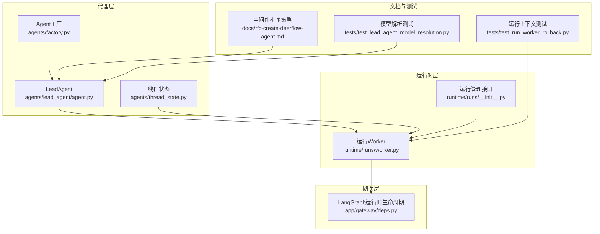
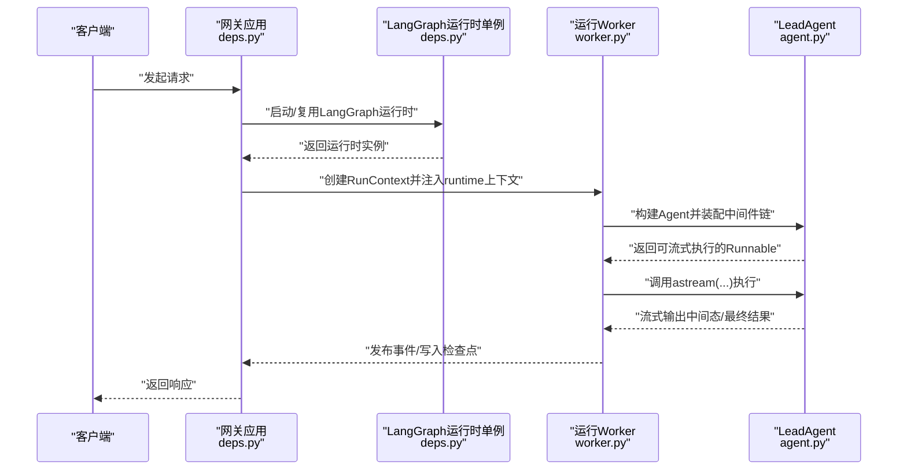
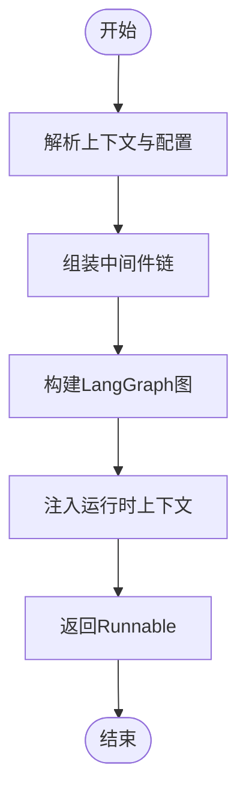
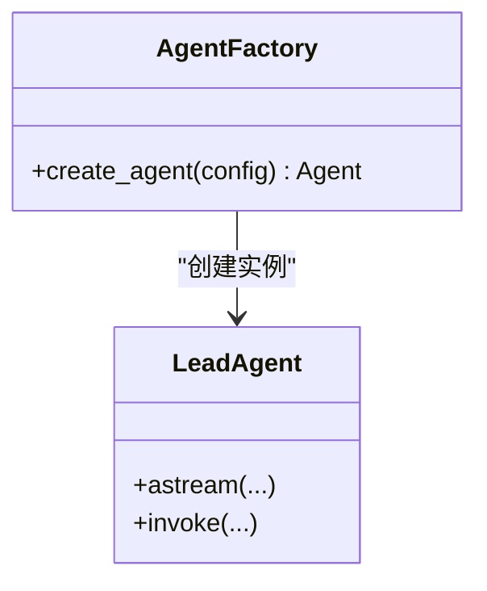
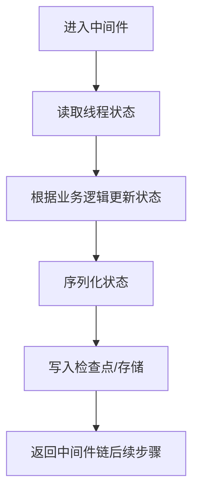
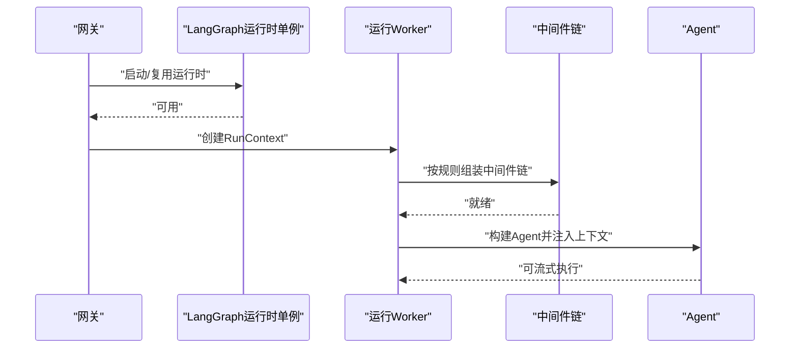
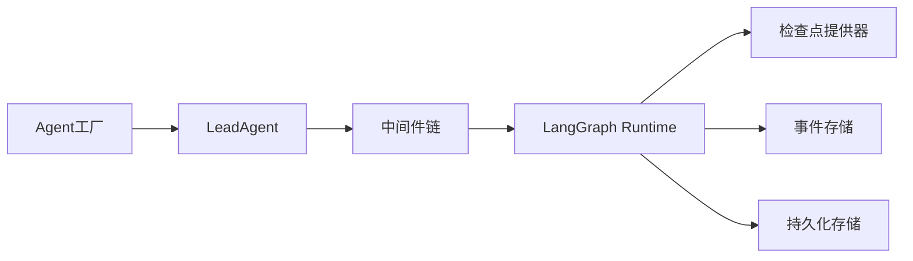

# 代理运行时

<cite>
**本文引用的文件**
- [agent.py](file://backend/packages/harness/deerflow/agents/lead_agent/agent.py)
- [factory.py](file://backend/packages/harness/deerflow/agents/factory.py)
- [thread_state.py](file://backend/packages/harness/deerflow/agents/thread_state.py)
- [worker.py](file://backend/packages/harness/deerflow/runtime/runs/worker.py)
- [__init__.py](file://backend/packages/harness/deerflow/runtime/runs/__init__.py)
- [deps.py](file://backend/app/gateway/deps.py)
- [rfc-create-deerflow-agent.md](file://backend/docs/rfc-create-deerflow-agent.md)
- [AUTO_TITLE_GENERATION.md](file://backend/docs/AUTO_TITLE_GENERATION.md)
- [test_lead_agent_model_resolution.py](file://backend/tests/test_lead_agent_model_resolution.py)
- [test_run_worker_rollback.py](file://backend/tests/test_run_worker_rollback.py)
</cite>

## 目录
1. [简介](#简介)
2. [项目结构](#项目结构)
3. [核心组件](#核心组件)
4. [架构总览](#架构总览)
5. [组件详解](#组件详解)
6. [依赖关系分析](#依赖关系分析)
7. [性能考量](#性能考量)
8. [故障排查指南](#故障排查指南)
9. [结论](#结论)
10. [附录](#附录)

## 简介
本文件面向DeerFlow代理运行时的技术文档，聚焦以下主题：
- LeadAgent的创建流程与运行时装配
- Agent工厂模式的实现与扩展点
- 线程状态管理机制与LangGraph兼容性
- 运行时生命周期管理、状态序列化与检查点
- 中间件系统集成与多代理工作流编排
- 配置加载与运行时行为示例

文档以“从高层到细节”的方式组织，既适合快速上手，也便于深入研究实现。

## 项目结构
围绕代理运行时的关键模块分布如下：
- agents/lead_agent：LeadAgent的构建入口与核心逻辑
- agents/factory：Agent工厂模式与实例化策略
- agents/thread_state：线程状态数据结构与序列化
- runtime/runs：运行时生命周期、Worker与运行上下文
- app/gateway/deps：LangGraph运行时单例的启动与关闭
- docs/rfc-create-deerflow-agent.md：中间件链组装与排序策略
- tests：端到端与单元测试覆盖运行时行为

图表来源
- [agent.py:1-200](file://backend/packages/harness/deerflow/agents/lead_agent/agent.py#L1-L200)
- [factory.py:1-200](file://backend/packages/harness/deerflow/agents/factory.py#L1-L200)
- [thread_state.py:1-200](file://backend/packages/harness/deerflow/agents/thread_state.py#L1-L200)
- [worker.py:1-250](file://backend/packages/harness/deerflow/runtime/runs/worker.py#L1-L250)
- [__init__.py:1-16](file://backend/packages/harness/deerflow/runtime/runs/__init__.py#L1-L16)
- [deps.py:144-184](file://backend/app/gateway/deps.py#L144-L184)
- [rfc-create-deerflow-agent.md:190-504](file://backend/docs/rfc-create-deerflow-agent.md#L190-L504)
- [test_lead_agent_model_resolution.py:249-279](file://backend/tests/test_lead_agent_model_resolution.py#L249-L279)
- [test_run_worker_rollback.py:44-86](file://backend/tests/test_run_worker_rollback.py#L44-L86)

章节来源
- [agent.py:1-200](file://backend/packages/harness/deerflow/agents/lead_agent/agent.py#L1-L200)
- [factory.py:1-200](file://backend/packages/harness/deerflow/agents/factory.py#L1-L200)
- [thread_state.py:1-200](file://backend/packages/harness/deerflow/agents/thread_state.py#L1-L200)
- [worker.py:1-250](file://backend/packages/harness/deerflow/runtime/runs/worker.py#L1-L250)
- [__init__.py:1-16](file://backend/packages/harness/deerflow/runtime/runs/__init__.py#L1-L16)
- [deps.py:144-184](file://backend/app/gateway/deps.py#L144-L184)
- [rfc-create-deerflow-agent.md:190-504](file://backend/docs/rfc-create-deerflow-agent.md#L190-L504)
- [test_lead_agent_model_resolution.py:249-279](file://backend/tests/test_lead_agent_model_resolution.py#L249-L279)
- [test_run_worker_rollback.py:44-86](file://backend/tests/test_run_worker_rollback.py#L44-L86)

## 核心组件
- LeadAgent：基于LangGraph与LangChain原语构建的核心执行体，负责接收输入、维护对话状态、规划下一步动作、调用工具与委派子Agent。
- Agent工厂：提供统一的Agent实例化接口，支持按配置与特性开关生成不同变体。
- 线程状态：封装运行期状态，支持序列化与持久化，确保跨步骤的状态一致性。
- 运行Worker：封装一次具体运行的上下文、中间件链、LangGraph运行时注入与事件回调。
- 网关生命周期：LangGraph运行时单例的启动与关闭，绑定持久化引擎、检查点提供器、存储与事件存储。

章节来源
- [agent.py:1-200](file://backend/packages/harness/deerflow/agents/lead_agent/agent.py#L1-L200)
- [factory.py:1-200](file://backend/packages/harness/deerflow/agents/factory.py#L1-L200)
- [thread_state.py:1-200](file://backend/packages/harness/deerflow/agents/thread_state.py#L1-L200)
- [worker.py:1-250](file://backend/packages/harness/deerflow/runtime/runs/worker.py#L1-L250)
- [deps.py:144-184](file://backend/app/gateway/deps.py#L144-L184)

## 架构总览
下图展示了从请求进入网关，到LangGraph运行时单例初始化，再到运行Worker执行的具体流程。

图表来源
- [deps.py:144-184](file://backend/app/gateway/deps.py#L144-L184)
- [worker.py:48-235](file://backend/packages/harness/deerflow/runtime/runs/worker.py#L48-L235)
- [agent.py:1-200](file://backend/packages/harness/deerflow/agents/lead_agent/agent.py#L1-L200)

## 组件详解

### LeadAgent 创建流程
- 入口函数：通过导出的工厂方法创建LeadAgent，内部完成模型解析、中间件链组装与Agent构建。
- 关键步骤：
  - 解析上下文中的模型参数（如模型名、推理能力开关等）
  - 基于特性开关与配置组装中间件链
  - 构建LangGraph图并注入运行时上下文
  - 返回可流式执行的Runnable

图表来源
- [agent.py:1-200](file://backend/packages/harness/deerflow/agents/lead_agent/agent.py#L1-L200)
- [rfc-create-deerflow-agent.md:190-504](file://backend/docs/rfc-create-deerflow-agent.md#L190-L504)

章节来源
- [agent.py:1-200](file://backend/packages/harness/deerflow/agents/lead_agent/agent.py#L1-L200)
- [rfc-create-deerflow-agent.md:190-504](file://backend/docs/rfc-create-deerflow-agent.md#L190-L504)
- [test_lead_agent_model_resolution.py:249-279](file://backend/tests/test_lead_agent_model_resolution.py#L249-L279)

### Agent 工厂模式
- 设计要点：
  - 统一的工厂接口，屏蔽不同Agent类型的差异
  - 支持按特性开关与配置动态生成Agent实例
  - 与中间件链装配解耦，便于扩展与测试
- 扩展建议：
  - 新增Agent类型时，仅需在工厂中注册映射
  - 通过配置项控制Agent变体与特性组合

图表来源
- [factory.py:1-200](file://backend/packages/harness/deerflow/agents/factory.py#L1-L200)
- [agent.py:1-200](file://backend/packages/harness/deerflow/agents/lead_agent/agent.py#L1-L200)

章节来源
- [factory.py:1-200](file://backend/packages/harness/deerflow/agents/factory.py#L1-L200)

### 线程状态管理与序列化
- 线程状态：承载运行期状态，支持序列化以便LangGraph检查点与持久化
- 序列化策略：遵循LangGraph兼容的数据结构，保证跨版本迁移与恢复
- 使用场景：状态在中间件链中被读取与更新，确保多步推理的一致性

图表来源
- [thread_state.py:1-200](file://backend/packages/harness/deerflow/agents/thread_state.py#L1-L200)
- [AUTO_TITLE_GENERATION.md:246-259](file://backend/docs/AUTO_TITLE_GENERATION.md#L246-L259)

章节来源
- [thread_state.py:1-200](file://backend/packages/harness/deerflow/agents/thread_state.py#L1-L200)
- [AUTO_TITLE_GENERATION.md:246-259](file://backend/docs/AUTO_TITLE_GENERATION.md#L246-L259)

### 运行时生命周期与中间件链
- 生命周期：
  - 网关启动时初始化LangGraph运行时单例（包含持久化引擎、检查点提供器、存储与事件存储）
  - 请求到达时，运行Worker创建RunContext并注入runtime上下文
  - 中间件链在Agent构建阶段确定，按固定顺序与可插拔锚点进行组装
- 中间件排序：
  - 两阶段排序：内置固定顺序 + 外置插入（@Next/@Prev）
  - 冲突检测：同一目标不能同时被多个外置中间件锚定

图表来源
- [deps.py:144-184](file://backend/app/gateway/deps.py#L144-L184)
- [worker.py:48-235](file://backend/packages/harness/deerflow/runtime/runs/worker.py#L48-L235)
- [rfc-create-deerflow-agent.md:238-284](file://backend/docs/rfc-create-deerflow-agent.md#L238-L284)

章节来源
- [deps.py:144-184](file://backend/app/gateway/deps.py#L144-L184)
- [worker.py:48-235](file://backend/packages/harness/deerflow/runtime/runs/worker.py#L48-L235)
- [rfc-create-deerflow-agent.md:190-504](file://backend/docs/rfc-create-deerflow-agent.md#L190-L504)

### 配置加载与运行时行为示例
- 配置加载：
  - 网关在启动时冻结一次AppConfig快照，LangGraph运行时单例绑定该快照
  - 请求时仍可通过热重载边界获取最新配置字段
- 运行时行为：
  - Worker在每次运行前构建runtime上下文，注入thread_id、run_id、app_config与运行日志
  - 通过回调注入RunJournal，捕获token用量与生命周期事件

章节来源
- [deps.py:144-184](file://backend/app/gateway/deps.py#L144-L184)
- [worker.py:48-235](file://backend/packages/harness/deerflow/runtime/runs/worker.py#L48-L235)
- [test_run_worker_rollback.py:44-86](file://backend/tests/test_run_worker_rollback.py#L44-L86)

### 多代理工作流编排
- 主Agent与SubAgent：
  - 主Agent共享基础中间件链，SubAgent链更精简（减少上传、摘要、待办、标题、记忆、图像查看、循环检测、澄清等中间件）
  - SubAgent通过task工具委派任务，主Agent负责协调与汇总
- 中间件差异：
  - 通过特性开关与装饰器锚点控制中间件是否启用与排序
  - extra_middleware当前仅影响主Agent，不传递给SubAgent

章节来源
- [rfc-create-deerflow-agent.md:479-503](file://backend/docs/rfc-create-deerflow-agent.md#L479-L503)

## 依赖关系分析
- 组件内聚与耦合：
  - LeadAgent与运行Worker通过Runnable接口解耦，便于替换与测试
  - 中间件链与Agent构建分离，提升可扩展性
- 外部依赖：
  - LangGraph Runtime与检查点提供器
  - 持久化引擎与事件存储
  - 中间件生态（上传、沙箱、记忆、摘要、循环检测、澄清等）

图表来源
- [factory.py:1-200](file://backend/packages/harness/deerflow/agents/factory.py#L1-L200)
- [agent.py:1-200](file://backend/packages/harness/deerflow/agents/lead_agent/agent.py#L1-L200)
- [worker.py:1-250](file://backend/packages/harness/deerflow/runtime/runs/worker.py#L1-L250)
- [deps.py:144-184](file://backend/app/gateway/deps.py#L144-L184)

章节来源
- [factory.py:1-200](file://backend/packages/harness/deerflow/agents/factory.py#L1-L200)
- [agent.py:1-200](file://backend/packages/harness/deerflow/agents/lead_agent/agent.py#L1-L200)
- [worker.py:1-250](file://backend/packages/harness/deerflow/runtime/runs/worker.py#L1-L250)
- [deps.py:144-184](file://backend/app/gateway/deps.py#L144-L184)

## 性能考量
- 流式执行：通过LangGraph的astream降低首包延迟，提升交互体验
- 检查点与持久化：合理设置检查点频率，平衡恢复能力与I/O开销
- 中间件链长度：主Agent中间件链较长，SubAgent链较短，按需启用特性以减少开销
- 并发与隔离：运行时上下文包含thread_id与run_id，确保并发场景下的隔离与可观测性

## 故障排查指南
- 运行上下文丢失：
  - 确认Worker在调用astream前正确注入runtime上下文与LangGraph运行时句柄
  - 核对thread_id与run_id是否被覆盖
- 中间件排序冲突：
  - 检查@Next/@Prev锚点是否指向同一目标，避免冲突
- 配置加载失败：
  - 网关启动时冻结的AppConfig快照应保持可用；请求时的热重载字段需符合边界约定
- 日志与审计：
  - 通过RunJournal回调记录生命周期与token用量，辅助问题定位

章节来源
- [worker.py:48-235](file://backend/packages/harness/deerflow/runtime/runs/worker.py#L48-L235)
- [rfc-create-deerflow-agent.md:238-284](file://backend/docs/rfc-create-deerflow-agent.md#L238-L284)
- [test_run_worker_rollback.py:44-86](file://backend/tests/test_run_worker_rollback.py#L44-L86)

## 结论
DeerFlow代理运行时以LeadAgent为核心，结合Agent工厂、中间件链与LangGraph运行时，实现了高扩展、可编排、可观测的代理执行框架。通过明确的生命周期管理、严格的中间件排序策略与完善的线程状态序列化，系统在复杂工作流场景下仍能保持稳定与高效。

## 附录
- 示例参考路径（不含代码内容）：
  - LeadAgent创建与模型解析：[agent.py:1-200](file://backend/packages/harness/deerflow/agents/lead_agent/agent.py#L1-L200)，[test_lead_agent_model_resolution.py:249-279](file://backend/tests/test_lead_agent_model_resolution.py#L249-L279)
  - 运行Worker上下文注入与回调：[worker.py:48-235](file://backend/packages/harness/deerflow/runtime/runs/worker.py#L48-L235)，[__init__.py:1-16](file://backend/packages/harness/deerflow/runtime/runs/__init__.py#L1-L16)
  - LangGraph运行时单例生命周期：[deps.py:144-184](file://backend/app/gateway/deps.py#L144-L184)
  - 中间件链组装与排序策略：[rfc-create-deerflow-agent.md:190-504](file://backend/docs/rfc-create-deerflow-agent.md#L190-L504)
  - 线程状态与序列化：[thread_state.py:1-200](file://backend/packages/harness/deerflow/agents/thread_state.py#L1-L200)，[AUTO_TITLE_GENERATION.md:246-259](file://backend/docs/AUTO_TITLE_GENERATION.md#L246-L259)