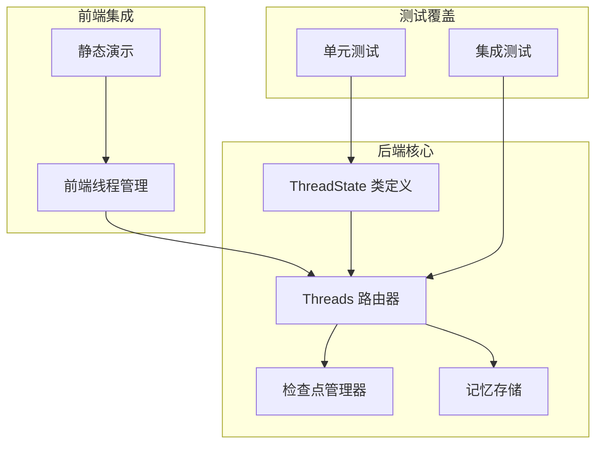
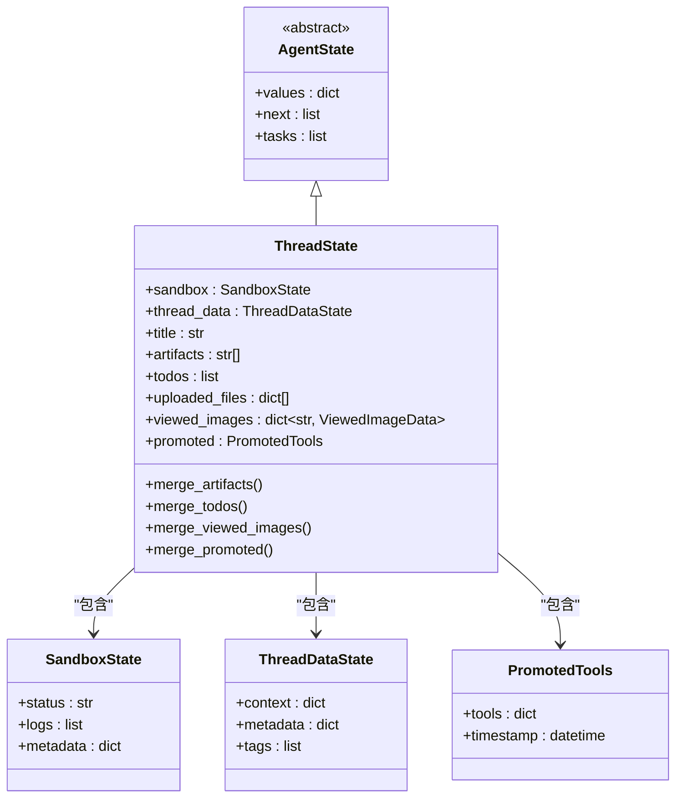
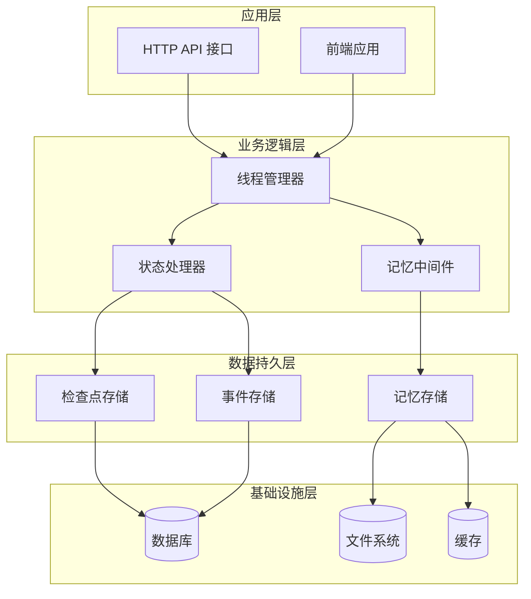
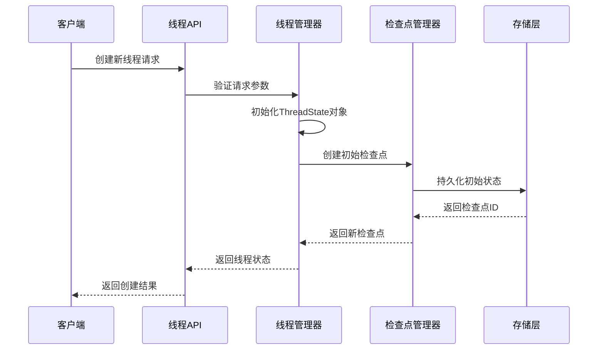
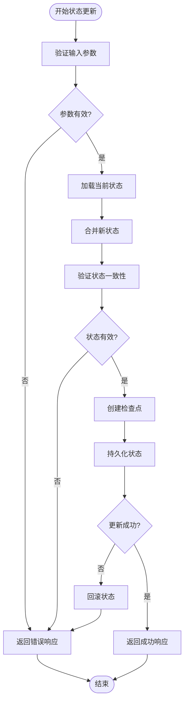
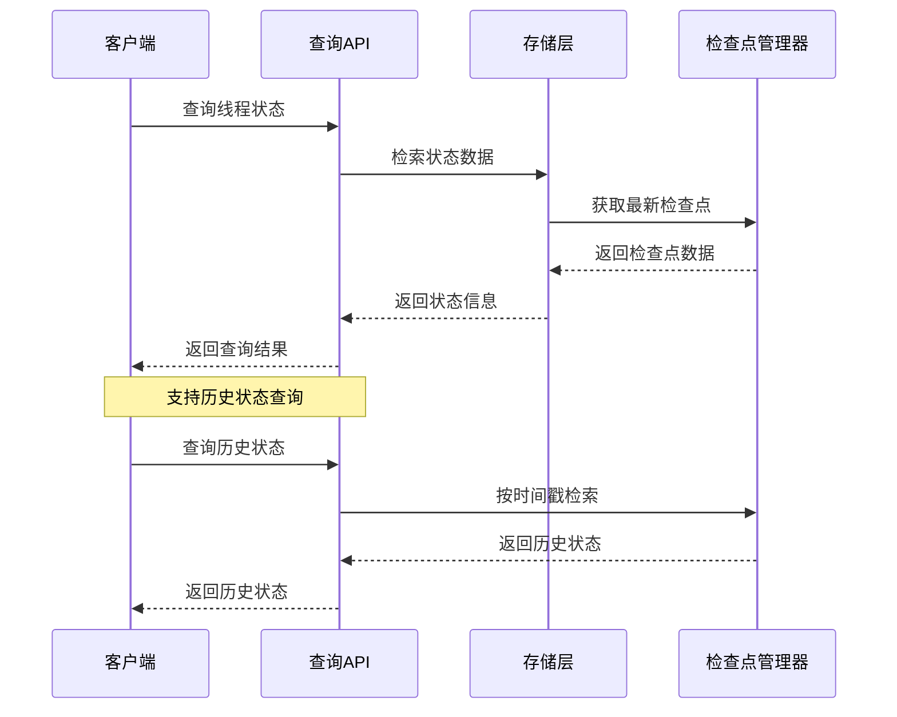
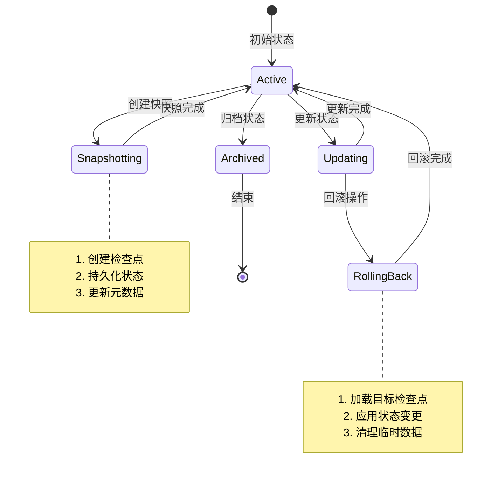
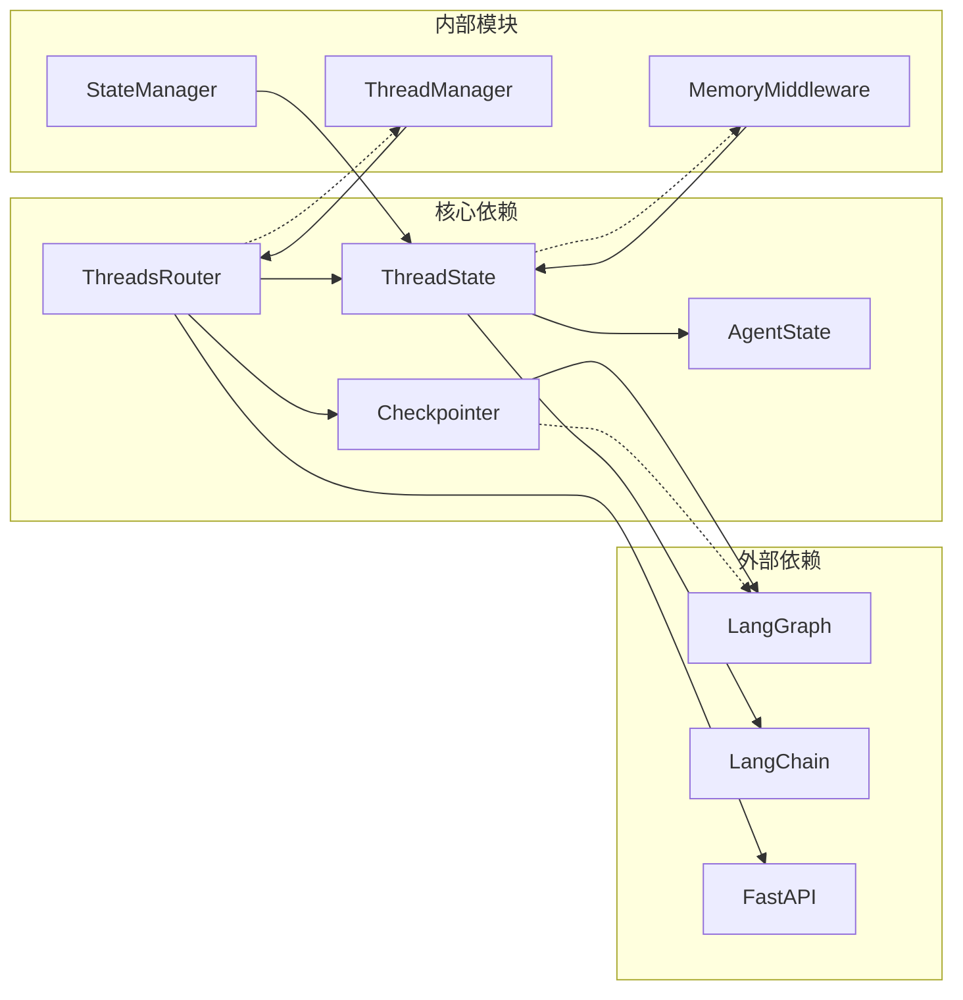
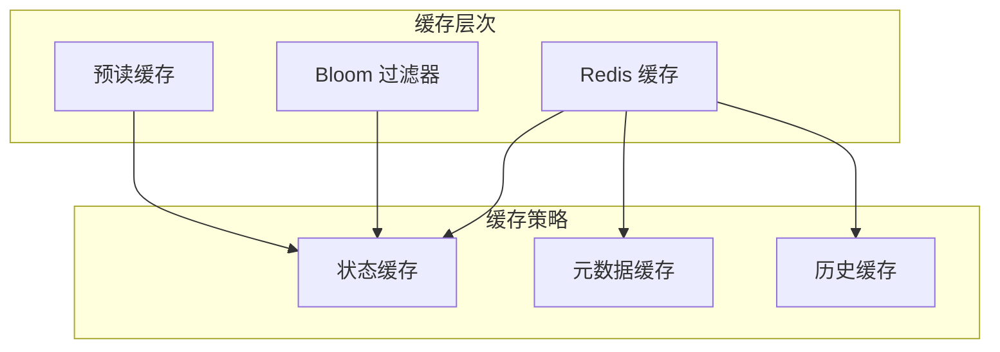
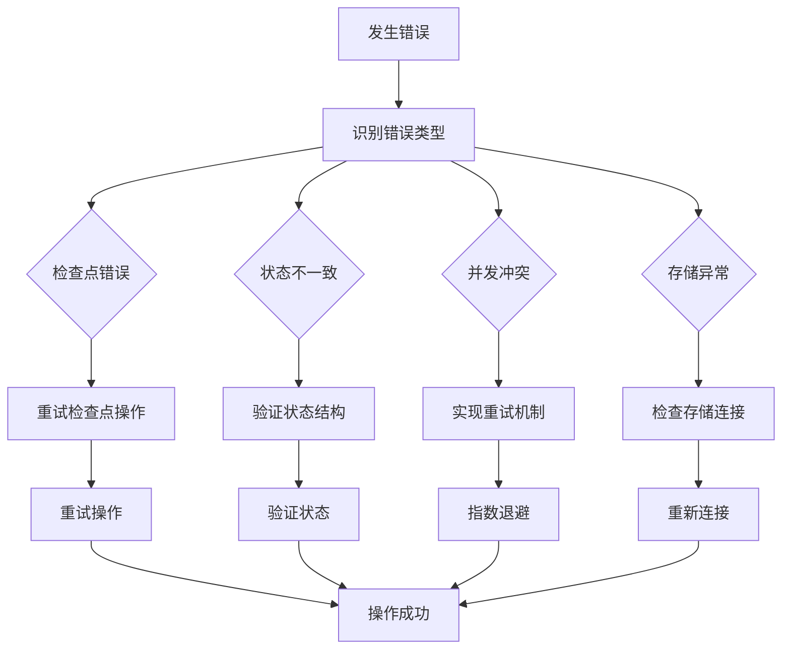

# 线程状态管理

<cite>
**本文档引用的文件**
- [backend/packages/harness/deerflow/agents/thread_state.py](file://backend/packages/harness/deerflow/agents/thread_state.py)
- [backend/app/gateway/routers/threads.py](file://backend/app/gateway/routers/threads.py)
- [backend/tests/test_threads_router.py](file://backend/tests/test_threads_router.py)
- [backend/tests/test_runtime_lifecycle_e2e.py](file://backend/tests/test_runtime_lifecycle_e2e.py)
- [backend/docs/ARCHITECTURE.md](file://backend/docs/ARCHITECTURE.md)
- [backend/docs/AUTO_TITLE_GENERATION.md](file://backend/docs/AUTO_TITLE_GENERATION.md)
- [frontend/src/core/threads/static-demo.ts](file://frontend/src/core/threads/static-demo.ts)
</cite>

## 目录
1. [引言](#引言)
2. [项目结构](#项目结构)
3. [核心组件](#核心组件)
4. [架构概览](#架构概览)
5. [详细组件分析](#详细组件分析)
6. [依赖关系分析](#依赖关系分析)
7. [性能考虑](#性能考虑)
8. [故障排除指南](#故障排除指南)
9. [结论](#结论)

## 引言

DeerFlow线程状态管理系统是DeerFlow智能代理平台的核心组成部分，负责管理多轮对话的状态持久化、序列化和恢复。该系统基于LangGraph检查点机制构建，提供了完整的线程状态生命周期管理能力，包括状态创建、更新、查询、快照和回滚功能。

系统采用模块化设计，将线程状态管理与记忆系统深度集成，支持复杂的多轮对话场景和上下文管理需求。通过检查点机制，系统能够确保状态的一致性和可靠性，同时提供灵活的状态转换和验证逻辑。

## 项目结构

DeerFlow线程状态管理系统主要分布在以下关键位置：

**图表来源**
- [backend/packages/harness/deerflow/agents/thread_state.py:86-95](file://backend/packages/harness/deerflow/agents/thread_state.py#L86-L95)
- [backend/app/gateway/routers/threads.py:546-568](file://backend/app/gateway/routers/threads.py#L546-L568)

**章节来源**
- [backend/packages/harness/deerflow/agents/thread_state.py:86-95](file://backend/packages/harness/deerflow/agents/thread_state.py#L86-L95)
- [backend/app/gateway/routers/threads.py:546-568](file://backend/app/gateway/routers/threads.py#L546-L568)

## 核心组件

### ThreadState 类设计

ThreadState类是线程状态管理系统的核心数据结构，继承自AgentState基类，扩展了专门用于DeerFlow的字段和方法。

**图表来源**
- [backend/packages/harness/deerflow/agents/thread_state.py:86-95](file://backend/packages/harness/deerflow/agents/thread_state.py#L86-L95)

### 状态字段详解

ThreadState类包含了多个专门的状态字段，每个字段都有特定的用途和管理策略：

- **sandbox**: 沙盒环境状态，包含执行环境的运行时信息
- **thread_data**: 线程数据状态，存储上下文和元数据
- **title**: 对话标题，用于用户界面显示
- **artifacts**: 生成的工件列表，支持合并策略
- **todos**: 待办事项列表，支持合并策略
- **uploaded_files**: 上传文件信息列表
- **viewed_images**: 已查看图像数据映射
- **promoted**: 提升工具状态

**章节来源**
- [backend/packages/harness/deerflow/agents/thread_state.py:86-95](file://backend/packages/harness/deerflow/agents/thread_state.py#L86-L95)

## 架构概览

DeerFlow线程状态管理系统采用分层架构设计，确保了良好的可维护性和扩展性：

**图表来源**
- [backend/app/gateway/routers/threads.py:546-568](file://backend/app/gateway/routers/threads.py#L546-L568)
- [backend/docs/ARCHITECTURE.md:133](file://backend/docs/ARCHITECTURE.md#L133)

系统的核心流程包括状态创建、更新、查询和持久化四个主要阶段，每个阶段都有相应的验证和错误处理机制。

## 详细组件分析

### 状态创建与初始化

线程状态的创建过程涉及多个步骤，从初始状态到完整状态的构建：

**图表来源**
- [backend/app/gateway/routers/threads.py:546-568](file://backend/app/gateway/routers/threads.py#L546-L568)

### 状态更新与持久化

状态更新过程需要确保数据的一致性和完整性，同时处理并发访问问题：

**图表来源**
- [backend/app/gateway/routers/threads.py:546-568](file://backend/app/gateway/routers/threads.py#L546-L568)

### 状态查询与检索

状态查询接口提供了多种查询模式，支持按不同条件检索线程状态：

**图表来源**
- [backend/tests/test_threads_router.py:372-402](file://backend/tests/test_threads_router.py#L372-L402)

**章节来源**
- [backend/app/gateway/routers/threads.py:546-568](file://backend/app/gateway/routers/threads.py#L546-L568)
- [backend/tests/test_threads_router.py:372-402](file://backend/tests/test_threads_router.py#L372-L402)

### 状态快照与回滚机制

系统提供了完整的状态快照和回滚功能，确保在出现问题时能够快速恢复：

**图表来源**
- [backend/tests/test_runtime_lifecycle_e2e.py:405-444](file://backend/tests/test_runtime_lifecycle_e2e.py#L405-L444)

**章节来源**
- [backend/tests/test_runtime_lifecycle_e2e.py:405-444](file://backend/tests/test_runtime_lifecycle_e2e.py#L405-L444)

## 依赖关系分析

### 组件耦合度分析

线程状态管理系统展现了良好的内聚性和低耦合性：

**图表来源**
- [backend/packages/harness/deerflow/agents/thread_state.py:86-95](file://backend/packages/harness/deerflow/agents/thread_state.py#L86-L95)
- [backend/app/gateway/routers/threads.py:546-568](file://backend/app/gateway/routers/threads.py#L546-L568)

### 数据流依赖

系统中的数据流遵循单向依赖原则，确保了数据的一致性和可追踪性：

- **状态流向**: ThreadState → Checkpointer → Storage
- **控制流向**: ThreadsRouter → ThreadManager → StateManager
- **配置流向**: Config → ThreadState → Checkpointer

**章节来源**
- [backend/packages/harness/deerflow/agents/thread_state.py:86-95](file://backend/packages/harness/deerflow/agents/thread_state.py#L86-L95)
- [backend/app/gateway/routers/threads.py:546-568](file://backend/app/gateway/routers/threads.py#L546-L568)

## 性能考虑

### 并发访问控制

系统采用了多层并发控制机制来确保数据一致性：

1. **检查点锁机制**: 使用检查点ID作为并发控制令牌
2. **乐观锁策略**: 基于版本号的状态更新
3. **事务隔离**: 数据库事务确保原子性操作

### 缓存策略

### 性能优化建议

- **批量操作**: 支持批量状态更新以减少网络往返
- **增量同步**: 只传输变化的状态部分
- **压缩存储**: 对大状态进行压缩存储
- **异步处理**: 后台异步持久化减少请求延迟

## 故障排除指南

### 常见问题诊断

系统提供了完善的错误处理和诊断机制：

### 调试工具

- **日志记录**: 详细的请求和响应日志
- **性能监控**: 关键指标的实时监控
- **状态检查**: 在线状态检查工具
- **回滚测试**: 安全的回滚验证机制

**章节来源**
- [backend/tests/test_threads_router.py:372-402](file://backend/tests/test_threads_router.py#L372-L402)

## 结论

DeerFlow线程状态管理系统通过精心设计的架构和实现，为多轮对话提供了强大而可靠的状态管理能力。系统的核心优势包括：

1. **完整的生命周期管理**: 从创建到销毁的全生命周期状态管理
2. **强一致性的保证**: 基于检查点机制的状态持久化
3. **灵活的状态转换**: 支持复杂的状态转换规则和验证逻辑
4. **高效的并发控制**: 多层并发控制确保数据一致性
5. **完善的错误处理**: 全面的错误检测和恢复机制

通过与记忆系统的深度集成，系统能够支持复杂的多轮对话场景，为用户提供流畅的交互体验。未来的发展方向包括进一步优化性能、增强扩展性以及提供更丰富的状态管理功能。