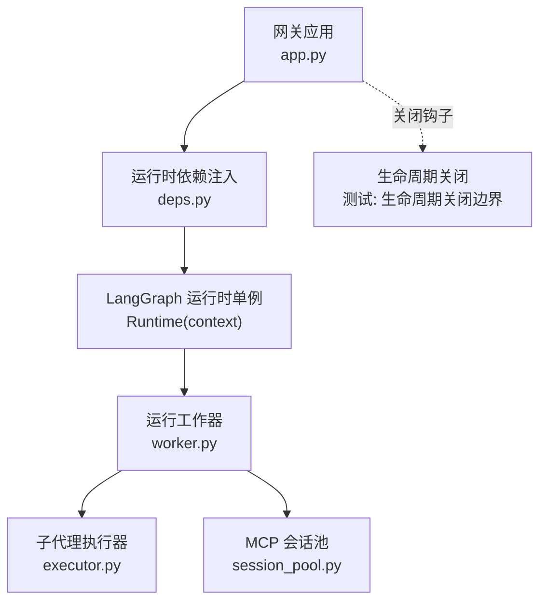
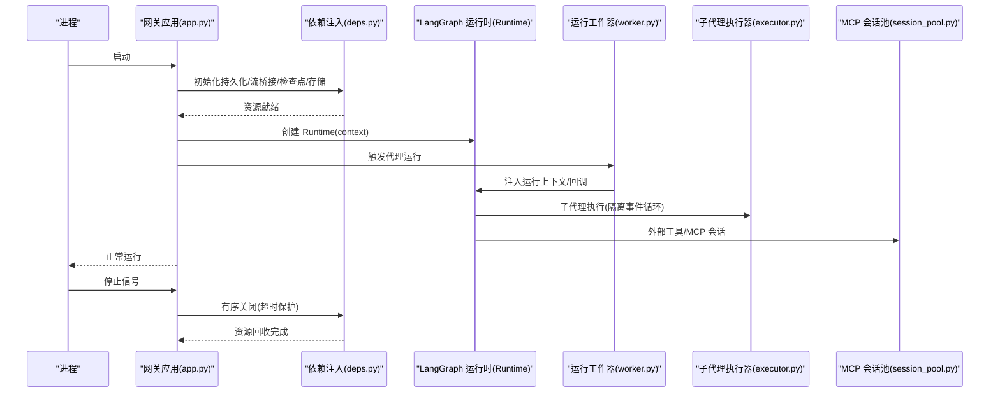
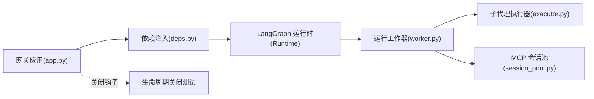

# 运行时生命周期

<cite>
**本文引用的文件**
- [app.py](file://backend/app/gateway/app.py)
- [deps.py](file://backend/app/gateway/deps.py)
- [worker.py](file://backend/packages/harness/deerflow/runtime/runs/worker.py)
- [_setup_agent_e2e_user_isolation.py](file://backend/tests/test_setup_agent_e2e_user_isolation.py)
- [executor.py](file://backend/packages/harness/deerflow/subagents/executor.py)
- [session_pool.py](file://backend/packages/harness/deerflow/mcp/session_pool.py)
- [test_gateway_lifespan_shutdown.py](file://backend/tests/test_gateway_lifespan_shutdown.py)
- [serve.sh](file://scripts/serve.sh)
</cite>

## 目录
1. [引言](#引言)
2. [项目结构](#项目结构)
3. [核心组件](#核心组件)
4. [架构总览](#架构总览)
5. [详细组件分析](#详细组件分析)
6. [依赖关系分析](#依赖关系分析)
7. [性能考量](#性能考量)
8. [故障排查指南](#故障排查指南)
9. [结论](#结论)
10. [附录](#附录)

## 引言
本文件系统性阐述 DeerFlow 代理在运行时的完整生命周期：从启动初始化、运行期监控、状态同步到优雅关闭；并深入解析 LangGraph 集成机制（图注册表、运行时配置与回调处理）以及运行时与外部服务（模型调用、工具执行、中间件链）的协同方式。文档面向不同技术背景读者，既提供高层概览，也包含可追溯到源码的细节与图示。

## 项目结构
围绕运行时生命周期的关键模块分布于网关应用与运行时封装包中：
- 网关应用负责生命周期托管与资源初始化/清理
- 运行时封装提供代理运行所需的上下文、回调与工具链集成
- 子代理与 MCP 会话池等扩展组件参与异步与外部服务协调

图表来源
- [app.py](file://backend/app/gateway/app.py)
- [deps.py](file://backend/app/gateway/deps.py)
- [worker.py](file://backend/packages/harness/deerflow/runtime/runs/worker.py)
- [executor.py](file://backend/packages/harness/deerflow/subagents/executor.py)
- [session_pool.py](file://backend/packages/harness/deerflow/mcp/session_pool.py)
- [test_gateway_lifespan_shutdown.py](file://backend/tests/test_gateway_lifespan_shutdown.py)

章节来源
- [app.py](file://backend/app/gateway/app.py)
- [deps.py](file://backend/app/gateway/deps.py)

## 核心组件
- 网关运行时生命周期管理器：负责在应用启动时初始化持久化引擎、流桥接、检查点提供者与存储，并在关闭时确保资源有序释放。
- 运行工作器：构建运行时上下文、注入回调、驱动 LangGraph 图执行，并与运行日志/审计通道联动。
- 子代理执行器：维护独立事件循环，支持隔离的子代理执行与优雅关闭。
- MCP 会话池：管理跨线程/跨循环的 MCP 会话生命周期，确保在所属事件循环中安全关闭。
- 生命周期关闭边界测试：验证在通道停止挂起的情况下，网关仍能在限定时间内完成关闭。

章节来源
- [deps.py](file://backend/app/gateway/deps.py)
- [worker.py](file://backend/packages/harness/deerflow/runtime/runs/worker.py)
- [executor.py](file://backend/packages/harness/deerflow/subagents/executor.py)
- [session_pool.py](file://backend/packages/harness/deerflow/mcp/session_pool.py)
- [test_gateway_lifespan_shutdown.py](file://backend/tests/test_gateway_lifespan_shutdown.py)

## 架构总览
下图展示了从网关启动到运行期执行、再到优雅关闭的整体流程，以及 LangGraph 运行时与外部服务的交互位置。

图表来源
- [app.py](file://backend/app/gateway/app.py)
- [deps.py](file://backend/app/gateway/deps.py)
- [worker.py](file://backend/packages/harness/deerflow/runtime/runs/worker.py)
- [executor.py](file://backend/packages/harness/deerflow/subagents/executor.py)
- [session_pool.py](file://backend/packages/harness/deerflow/mcp/session_pool.py)

## 详细组件分析

### 启动初始化与资源绑定
- 在应用生命周期内，通过依赖注入器创建并持有以下运行时单例：
  - 流桥接：用于事件/消息的桥接与转发
  - 持久化引擎：数据库连接与迁移
  - 检查点提供者：用于状态检查点的读写
  - 存储：键值/对象存储
- 这些资源以“启动快照”形式绑定，避免随配置热重载而频繁重建，保证稳定性与一致性。

章节来源
- [deps.py](file://backend/app/gateway/deps.py)

### 运行时上下文构建与回调注入
- 运行工作器负责构建运行时上下文，包含线程 ID、运行 ID、调用方上下文与应用配置等关键字段，并将其注入到 LangGraph 的 Runtime 中。
- 工作器同时将运行日志/审计通道作为回调注入到 LangChain 回调体系，以便在 LLM 结束时捕获令牌用量、在链路开始/结束时记录生命周期事件。
- 该上下文还通过配置键暴露给下游中间件与工具，确保它们能访问线程级数据与应用配置。

章节来源
- [worker.py](file://backend/packages/harness/deerflow/runtime/runs/worker.py)

### LangGraph 集成机制
- 图注册表与运行时配置
  - 代理在运行前会构建运行时上下文并创建 Runtime 实例，随后将 Runtime 注入到配置中，使底层图能够通过父运行时合并上下文。
  - 运行时上下文中的应用配置允许工具与中间件在不依赖全局状态的前提下获取当前运行所需的配置。
- 回调处理
  - 将运行日志/审计通道作为回调附加到运行配置中，从而在链路生命周期与 LLM 输出阶段自动收集指标与审计事件。

章节来源
- [worker.py](file://backend/packages/harness/deerflow/runtime/runs/worker.py)

### 运行期监控与状态同步
- 运行日志/审计通道作为回调被注入到运行配置，实现对链路生命周期与 LLM 输出的自动监控。
- 运行时上下文中的线程 ID/运行 ID 使得多并发运行的状态得以区分与追踪。
- 通过检查点提供者与持久化引擎，运行状态可在重启后恢复或回放。

章节来源
- [worker.py](file://backend/packages/harness/deerflow/runtime/runs/worker.py)
- [deps.py](file://backend/app/gateway/deps.py)

### 与外部服务的交互
- 模型调用
  - 运行时根据应用配置解析模型名称，若请求模型不在配置中则回退到默认模型，确保调用安全与可用。
- 工具执行
  - 工具可通过运行时上下文访问线程级数据与应用配置；对于需要隔离的子代理，使用独立事件循环执行，避免阻塞主循环。
- 中间件链协调
  - 中间件通过运行时上下文与回调通道进行协作，实现动态上下文注入、错误处理、安全终止检测、上传过滤等横切能力。

章节来源
- [worker.py](file://backend/packages/harness/deerflow/runtime/runs/worker.py)
- [executor.py](file://backend/packages/harness/deerflow/subagents/executor.py)

### 优雅关闭与生命周期边界
- 网关在生命周期退出时，必须在限定时间内完成所有资源的有序关闭，即使某些通道停止操作挂起也不应无限等待。
- 通过超时保护与事件循环调度，确保即使部分组件阻塞，也能在合理时间内完成回收，避免信号重入死锁等问题。

章节来源
- [test_gateway_lifespan_shutdown.py](file://backend/tests/test_gateway_lifespan_shutdown.py)

### 代码示例路径
以下为关键流程的代码片段路径，便于定位实现细节：
- 启动初始化与资源绑定
  - [deps.py](file://backend/app/gateway/deps.py)
- 运行时上下文构建与回调注入
  - [worker.py](file://backend/packages/harness/deerflow/runtime/runs/worker.py)
- LangGraph 运行时创建与配置注入
  - [worker.py](file://backend/packages/harness/deerflow/runtime/runs/worker.py)
- 子代理隔离执行与关闭
  - [executor.py](file://backend/packages/harness/deerflow/subagents/executor.py)
- MCP 会话池的关闭协调
  - [session_pool.py](file://backend/packages/harness/deerflow/mcp/session_pool.py)
- 生命周期关闭边界测试
  - [test_gateway_lifespan_shutdown.py](file://backend/tests/test_gateway_lifespan_shutdown.py)

## 依赖关系分析
运行时生命周期涉及多个组件之间的耦合与协作，下图展示了主要依赖关系：

图表来源
- [app.py](file://backend/app/gateway/app.py)
- [deps.py](file://backend/app/gateway/deps.py)
- [worker.py](file://backend/packages/harness/deerflow/runtime/runs/worker.py)
- [executor.py](file://backend/packages/harness/deerflow/subagents/executor.py)
- [session_pool.py](file://backend/packages/harness/deerflow/mcp/session_pool.py)
- [test_gateway_lifespan_shutdown.py](file://backend/tests/test_gateway_lifespan_shutdown.py)

章节来源
- [app.py](file://backend/app/gateway/app.py)
- [deps.py](file://backend/app/gateway/deps.py)
- [worker.py](file://backend/packages/harness/deerflow/runtime/runs/worker.py)
- [executor.py](file://backend/packages/harness/deerflow/subagents/executor.py)
- [session_pool.py](file://backend/packages/harness/deerflow/mcp/session_pool.py)
- [test_gateway_lifespan_shutdown.py](file://backend/tests/test_gateway_lifespan_shutdown.py)

## 性能考量
- 资源复用与冷启动成本
  - 启动时一次性初始化持久化引擎、流桥接、检查点提供者与存储，避免频繁重建带来的开销。
- 事件循环与隔离执行
  - 子代理使用独立事件循环，减少对主循环的阻塞，提升并发吞吐。
- 回调与日志采集
  - 通过回调通道在链路生命周期与 LLM 输出阶段自动采集指标，降低手动埋点成本。
- 关闭超时保护
  - 在生命周期关闭阶段设置超时上限，防止个别组件挂起导致整体停机。

## 故障排查指南
- 启动失败或配置不可用
  - 现象：请求边界返回 503，日志显示配置加载异常。
  - 排查：确认配置文件存在且可解析，检查权限与格式；参考依赖注入器的异常处理与降级策略。
  - 参考路径：[deps.py](file://backend/app/gateway/deps.py)
- 运行时上下文缺失或线程隔离问题
  - 现象：工具无法获取线程级数据或用户 ID 传播异常。
  - 排查：确认运行工作器已正确构建并安装运行时上下文；验证回调通道是否注入。
  - 参考路径：[worker.py](file://backend/packages/harness/deerflow/runtime/runs/worker.py)
- 子代理执行卡顿或阻塞
  - 现象：子代理任务长时间无响应。
  - 排查：检查隔离事件循环是否正常启动与运行；确认线程与循环状态；必要时触发关闭并重建。
  - 参考路径：[executor.py](file://backend/packages/harness/deerflow/subagents/executor.py)
- MCP 会话关闭异常
  - 现象：MCP 会话无法在所属事件循环中安全关闭。
  - 排查：确认会话池在所属循环中执行关闭；若循环非运行态，采用线程安全信号或回退策略。
  - 参考路径：[session_pool.py](file://backend/packages/harness/deerflow/mcp/session_pool.py)
- 生命周期关闭超时
  - 现象：关闭时间过长或无法完成。
  - 排查：检查是否存在挂起的通道停止操作；参考关闭边界测试用例，确保超时保护生效。
  - 参考路径：[test_gateway_lifespan_shutdown.py](file://backend/tests/test_gateway_lifespan_shutdown.py)

章节来源
- [deps.py](file://backend/app/gateway/deps.py)
- [worker.py](file://backend/packages/harness/deerflow/runtime/runs/worker.py)
- [executor.py](file://backend/packages/harness/deerflow/subagents/executor.py)
- [session_pool.py](file://backend/packages/harness/deerflow/mcp/session_pool.py)
- [test_gateway_lifespan_shutdown.py](file://backend/tests/test_gateway_lifespan_shutdown.py)

## 结论
DeerFlow 的运行时生命周期通过“启动初始化—运行监控—状态同步—优雅关闭”的闭环设计，结合 LangGraph 的运行时上下文与回调机制，实现了代理在复杂外部服务环境下的稳定运行。资源单例化、事件循环隔离与超时保护共同保障了系统的可靠性与可观测性。实际部署中，建议关注配置加载、上下文注入与关闭边界三类关键风险点，并配合测试用例持续验证生命周期行为。

## 附录
- 开发与生产模式的服务停止脚本
  - 参考路径：[serve.sh](file://scripts/serve.sh)