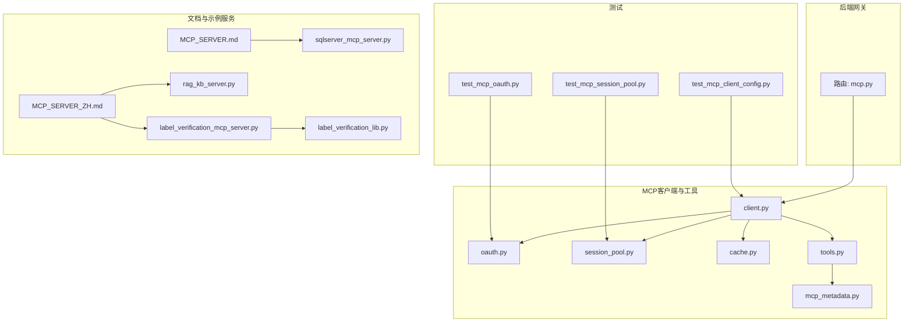
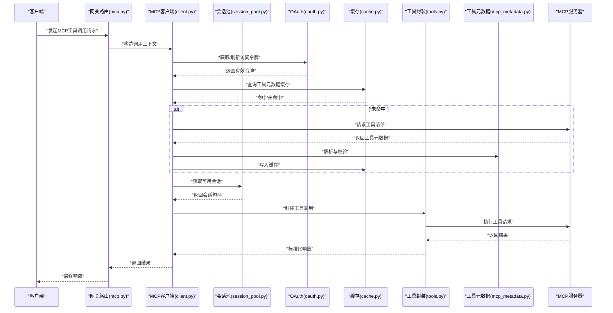
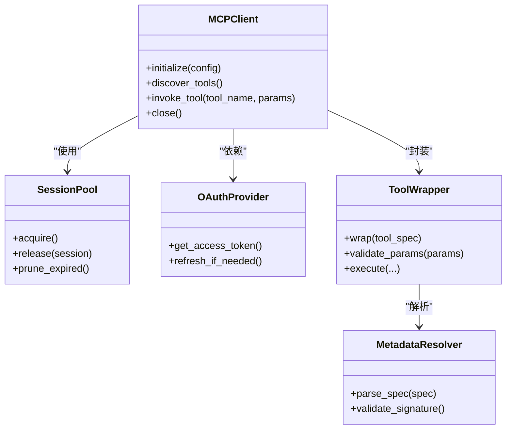
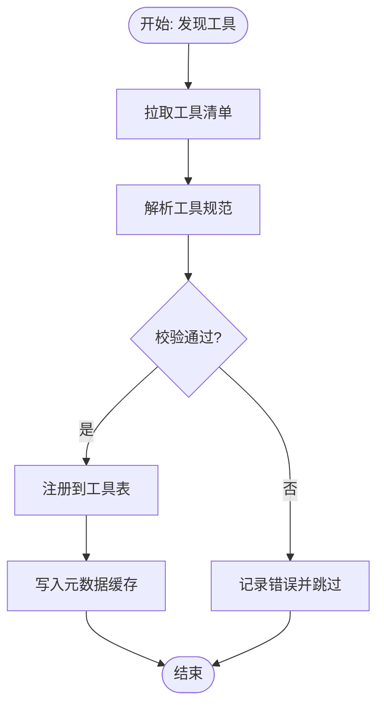
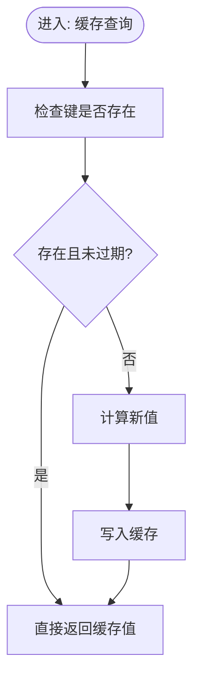
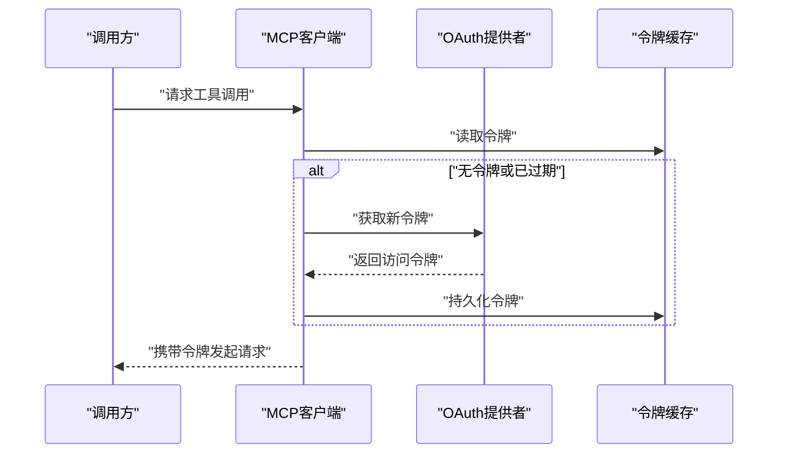
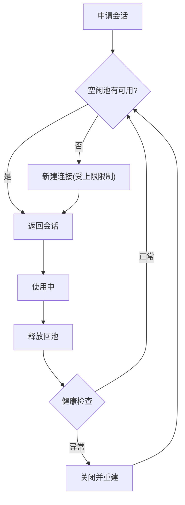
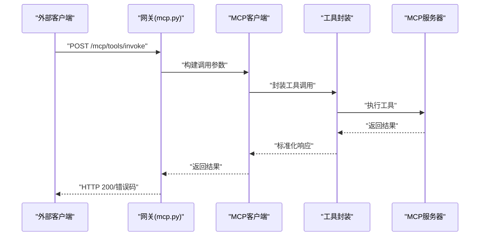
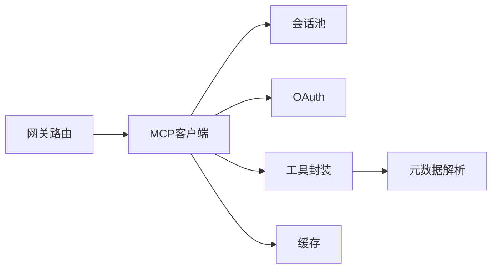

# MCP工具

<cite>
**本文引用的文件**
- [backend/app/gateway/routers/mcp.py](file://backend/app/gateway/routers/mcp.py)
- [backend/packages/harness/deerflow/mcp/__init__.py](file://backend/packages/harness/deerflow/mcp/__init__.py)
- [backend/packages/harness/deerflow/mcp/cache.py](file://backend/packages/harness/deerflow/mcp/cache.py)
- [backend/packages/harness/deerflow/mcp/client.py](file://backend/packages/harness/deerflow/mcp/client.py)
- [backend/packages/harness/deerflow/mcp/oauth.py](file://backend/packages/harness/deerflow/mcp/oauth.py)
- [backend/packages/harness/deerflow/mcp/session_pool.py](file://backend/packages/harness/deerflow/mcp/session_pool.py)
- [backend/packages/harness/deerflow/mcp/tools.py](file://backend/packages/harness/deerflow/mcp/tools.py)
- [backend/packages/harness/deerflow/tools/mcp_metadata.py](file://backend/packages/harness/deerflow/tools/mcp_metadata.py)
- [backend/tests/test_mcp_oauth.py](file://backend/tests/test_mcp_oauth.py)
- [backend/tests/test_mcp_session_pool.py](file://backend/tests/test_mcp_session_pool.py)
- [backend/tests/test_mcp_client_config.py](file://backend/tests/test_mcp_client_config.py)
- [backend/docs/MCP_SERVER.md](file://backend/docs/MCP_SERVER.md)
- [backend/docs/MCP_SERVER_ZH.md](file://backend/docs/MCP_SERVER_ZH.md)
- [mcp_servers/sqlserver_mcp_server.py](file://mcp_servers/sqlserver_mcp_server.py)
- [mcp_servers/rag_kb_server.py](file://mcp_servers/rag_kb_server.py)
- [mcp_servers/label_verification_mcp_server.py](file://mcp_servers/label_verification_mcp_server.py)
- [mcp_servers/label_verification_lib.py](file://mcp_servers/label_verification_lib.py)
</cite>

## 目录
1. [简介](#简介)
2. [项目结构](#项目结构)
3. [核心组件](#核心组件)
4. [架构总览](#架构总览)
5. [详细组件分析](#详细组件分析)
6. [依赖关系分析](#依赖关系分析)
7. [性能考量](#性能考量)
8. [故障排查指南](#故障排查指南)
9. [结论](#结论)
10. [附录](#附录)

## 简介
本文件面向DeerFlow MCP（Microsoft Cognitive Platform）工具系统的集成与使用，系统性阐述MCP客户端初始化、会话管理、工具发现机制、缓存策略、OAuth认证流程以及会话池管理等关键能力，并提供可操作的实践路径与最佳实践。读者无需深入底层实现细节即可理解并正确使用MCP工具链。

## 项目结构
MCP相关能力主要分布在后端网关路由、MCP客户端与工具封装、测试用例与文档说明四个层面：
- 后端网关路由：对外暴露MCP相关接口，协调认证与工具调用
- MCP客户端与工具封装：包含客户端、缓存、OAuth、会话池、工具元数据等模块
- 测试用例：覆盖OAuth、会话池、客户端配置等关键场景
- 文档与示例MCP服务器：提供部署与对接参考

图表来源
- [backend/app/gateway/routers/mcp.py](file://backend/app/gateway/routers/mcp.py)
- [backend/packages/harness/deerflow/mcp/client.py](file://backend/packages/harness/deerflow/mcp/client.py)
- [backend/packages/harness/deerflow/mcp/oauth.py](file://backend/packages/harness/deerflow/mcp/oauth.py)
- [backend/packages/harness/deerflow/mcp/session_pool.py](file://backend/packages/harness/deerflow/mcp/session_pool.py)
- [backend/packages/harness/deerflow/mcp/cache.py](file://backend/packages/harness/deerflow/mcp/cache.py)
- [backend/packages/harness/deerflow/mcp/tools.py](file://backend/packages/harness/deerflow/mcp/tools.py)
- [backend/packages/harness/deerflow/tools/mcp_metadata.py](file://backend/packages/harness/deerflow/tools/mcp_metadata.py)
- [backend/tests/test_mcp_oauth.py](file://backend/tests/test_mcp_oauth.py)
- [backend/tests/test_mcp_session_pool.py](file://backend/tests/test_mcp_session_pool.py)
- [backend/tests/test_mcp_client_config.py](file://backend/tests/test_mcp_client_config.py)
- [backend/docs/MCP_SERVER.md](file://backend/docs/MCP_SERVER.md)
- [backend/docs/MCP_SERVER_ZH.md](file://backend/docs/MCP_SERVER_ZH.md)
- [mcp_servers/sqlserver_mcp_server.py](file://mcp_servers/sqlserver_mcp_server.py)
- [mcp_servers/rag_kb_server.py](file://mcp_servers/rag_kb_server.py)
- [mcp_servers/label_verification_mcp_server.py](file://mcp_servers/label_verification_mcp_server.py)
- [mcp_servers/label_verification_lib.py](file://mcp_servers/label_verification_lib.py)

章节来源
- [backend/app/gateway/routers/mcp.py](file://backend/app/gateway/routers/mcp.py)
- [backend/packages/harness/deerflow/mcp/__init__.py](file://backend/packages/harness/deerflow/mcp/__init__.py)
- [backend/docs/MCP_SERVER.md](file://backend/docs/MCP_SERVER.md)
- [backend/docs/MCP_SERVER_ZH.md](file://backend/docs/MCP_SERVER_ZH.md)

## 核心组件
- 客户端初始化与会话管理：负责MCP服务器连接、会话建立与复用、请求拦截与重试
- 工具发现与元数据：解析MCP服务器提供的工具清单，提取工具签名与参数约束
- 缓存策略：对工具元数据与工具调用结果进行缓存，降低重复查询成本
- OAuth认证流程：在MCP工具调用前完成令牌获取与刷新，确保访问安全
- 会话池管理：多路并发下复用连接，提升吞吐与稳定性
- 网关路由：对外暴露MCP相关接口，统一接入与鉴权

章节来源
- [backend/packages/harness/deerflow/mcp/client.py](file://backend/packages/harness/deerflow/mcp/client.py)
- [backend/packages/harness/deerflow/mcp/session_pool.py](file://backend/packages/harness/deerflow/mcp/session_pool.py)
- [backend/packages/harness/deerflow/mcp/tools.py](file://backend/packages/harness/deerflow/mcp/tools.py)
- [backend/packages/harness/deerflow/tools/mcp_metadata.py](file://backend/packages/harness/deerflow/tools/mcp_metadata.py)
- [backend/packages/harness/deerflow/mcp/oauth.py](file://backend/packages/harness/deerflow/mcp/oauth.py)
- [backend/packages/harness/deerflow/mcp/cache.py](file://backend/packages/harness/deerflow/mcp/cache.py)
- [backend/app/gateway/routers/mcp.py](file://backend/app/gateway/routers/mcp.py)

## 架构总览
下图展示了从网关到MCP客户端、再到MCP服务器的整体调用链路，以及认证与缓存的关键节点。

图表来源
- [backend/app/gateway/routers/mcp.py](file://backend/app/gateway/routers/mcp.py)
- [backend/packages/harness/deerflow/mcp/client.py](file://backend/packages/harness/deerflow/mcp/client.py)
- [backend/packages/harness/deerflow/mcp/session_pool.py](file://backend/packages/harness/deerflow/mcp/session_pool.py)
- [backend/packages/harness/deerflow/mcp/oauth.py](file://backend/packages/harness/deerflow/mcp/oauth.py)
- [backend/packages/harness/deerflow/mcp/cache.py](file://backend/packages/harness/deerflow/mcp/cache.py)
- [backend/packages/harness/deerflow/mcp/tools.py](file://backend/packages/harness/deerflow/mcp/tools.py)
- [backend/packages/harness/deerflow/tools/mcp_metadata.py](file://backend/packages/harness/deerflow/tools/mcp_metadata.py)

## 详细组件分析

### 客户端初始化与会话管理
- 初始化职责
  - 解析MCP服务器地址与认证配置
  - 建立与维护与MCP服务器的连接通道
  - 提供请求拦截器与重试策略
- 会话管理
  - 通过会话池复用连接，避免频繁握手
  - 支持并发场景下的会话分配与回收
  - 对异常会话进行隔离与重建

图表来源
- [backend/packages/harness/deerflow/mcp/client.py](file://backend/packages/harness/deerflow/mcp/client.py)
- [backend/packages/harness/deerflow/mcp/session_pool.py](file://backend/packages/harness/deerflow/mcp/session_pool.py)
- [backend/packages/harness/deerflow/mcp/oauth.py](file://backend/packages/harness/deerflow/mcp/oauth.py)
- [backend/packages/harness/deerflow/mcp/tools.py](file://backend/packages/harness/deerflow/mcp/tools.py)
- [backend/packages/harness/deerflow/tools/mcp_metadata.py](file://backend/packages/harness/deerflow/tools/mcp_metadata.py)

章节来源
- [backend/packages/harness/deerflow/mcp/client.py](file://backend/packages/harness/deerflow/mcp/client.py)
- [backend/packages/harness/deerflow/mcp/session_pool.py](file://backend/packages/harness/deerflow/mcp/session_pool.py)

### 工具发现与元数据解析
- 工具发现机制
  - 调用MCP服务器的工具清单接口
  - 将原始规范转换为内部工具描述
- 元数据解析
  - 校验工具签名与参数约束
  - 生成调用前置校验规则
- 生命周期管理
  - 将工具注册到运行时工具表
  - 维护工具版本与兼容性

图表来源
- [backend/packages/harness/deerflow/mcp/tools.py](file://backend/packages/harness/deerflow/mcp/tools.py)
- [backend/packages/harness/deerflow/tools/mcp_metadata.py](file://backend/packages/harness/deerflow/tools/mcp_metadata.py)

章节来源
- [backend/packages/harness/deerflow/mcp/tools.py](file://backend/packages/harness/deerflow/mcp/tools.py)
- [backend/packages/harness/deerflow/tools/mcp_metadata.py](file://backend/packages/harness/deerflow/tools/mcp_metadata.py)

### 缓存策略
- 缓存对象
  - 工具元数据：减少重复解析与网络往返
  - 工具调用结果：针对可缓存的只读查询
- 失效策略
  - 基于TTL的时间失效
  - 版本变更触发的主动失效
- 并发一致性
  - 读写锁或原子更新，避免脏读
  - 写穿透防护与缓存预热

图表来源
- [backend/packages/harness/deerflow/mcp/cache.py](file://backend/packages/harness/deerflow/mcp/cache.py)

章节来源
- [backend/packages/harness/deerflow/mcp/cache.py](file://backend/packages/harness/deerflow/mcp/cache.py)

### OAuth认证流程
- 认证模式
  - 使用客户端凭证或用户授权码模式
  - 自动刷新过期令牌
- 安全要点
  - 令牌存储与传输加密
  - 限制令牌作用域与有效期
- 与客户端集成
  - 在每次工具调用前注入Authorization头
  - 失败时自动重试与降级

图表来源
- [backend/packages/harness/deerflow/mcp/oauth.py](file://backend/packages/harness/deerflow/mcp/oauth.py)
- [backend/packages/harness/deerflow/mcp/client.py](file://backend/packages/harness/deerflow/mcp/client.py)

章节来源
- [backend/packages/harness/deerflow/mcp/oauth.py](file://backend/packages/harness/deerflow/mcp/oauth.py)
- [backend/tests/test_mcp_oauth.py](file://backend/tests/test_mcp_oauth.py)

### 会话池管理
- 设计目标
  - 降低连接建立开销
  - 提升高并发下的吞吐
- 关键机制
  - 连接池容量与超时配置
  - 会话健康检查与自愈
  - 并发队列与公平调度
- 故障恢复
  - 检测到异常时快速剔除并重建
  - 重试与熔断策略

图表来源
- [backend/packages/harness/deerflow/mcp/session_pool.py](file://backend/packages/harness/deerflow/mcp/session_pool.py)

章节来源
- [backend/packages/harness/deerflow/mcp/session_pool.py](file://backend/packages/harness/deerflow/mcp/session_pool.py)
- [backend/tests/test_mcp_session_pool.py](file://backend/tests/test_mcp_session_pool.py)

### 网关路由与工具生命周期
- 路由职责
  - 接收外部请求，转发至MCP客户端
  - 执行鉴权与权限校验
  - 统一错误处理与日志记录
- 工具生命周期
  - 注册：工具发现后写入运行时表
  - 调用：参数校验、令牌注入、请求转发
  - 卸载：按需清理缓存与会话

图表来源
- [backend/app/gateway/routers/mcp.py](file://backend/app/gateway/routers/mcp.py)
- [backend/packages/harness/deerflow/mcp/client.py](file://backend/packages/harness/deerflow/mcp/client.py)
- [backend/packages/harness/deerflow/mcp/tools.py](file://backend/packages/harness/deerflow/mcp/tools.py)

章节来源
- [backend/app/gateway/routers/mcp.py](file://backend/app/gateway/routers/mcp.py)
- [backend/packages/harness/deerflow/mcp/tools.py](file://backend/packages/harness/deerflow/mcp/tools.py)

## 依赖关系分析
- 组件耦合
  - 客户端对会话池与OAuth的强依赖
  - 工具封装依赖元数据解析
  - 网关路由依赖客户端与鉴权中间件
- 外部依赖
  - MCP服务器协议与实现
  - 配置中心与密钥管理
- 循环依赖
  - 当前设计避免循环导入，采用接口抽象与延迟绑定

图表来源
- [backend/app/gateway/routers/mcp.py](file://backend/app/gateway/routers/mcp.py)
- [backend/packages/harness/deerflow/mcp/client.py](file://backend/packages/harness/deerflow/mcp/client.py)
- [backend/packages/harness/deerflow/mcp/session_pool.py](file://backend/packages/harness/deerflow/mcp/session_pool.py)
- [backend/packages/harness/deerflow/mcp/oauth.py](file://backend/packages/harness/deerflow/mcp/oauth.py)
- [backend/packages/harness/deerflow/mcp/tools.py](file://backend/packages/harness/deerflow/mcp/tools.py)
- [backend/packages/harness/deerflow/tools/mcp_metadata.py](file://backend/packages/harness/deerflow/tools/mcp_metadata.py)
- [backend/packages/harness/deerflow/mcp/cache.py](file://backend/packages/harness/deerflow/mcp/cache.py)

章节来源
- [backend/packages/harness/deerflow/mcp/__init__.py](file://backend/packages/harness/deerflow/mcp/__init__.py)

## 性能考量
- 连接复用
  - 使用会话池降低握手与TLS开销
- 缓存命中
  - 工具元数据与只读结果缓存显著降低延迟
- 并发调度
  - 合理设置会话池上限与超时，避免资源争用
- 请求批量化
  - 对同类工具调用进行合并与去抖
- 监控与告警
  - 连接池利用率、超时率、错误率作为关键指标

## 故障排查指南
- 常见问题定位
  - OAuth失败：检查令牌配置、作用域与有效期
  - 会话不可用：查看连接池耗尽与健康检查失败
  - 工具调用异常：核对工具签名与参数校验
- 诊断步骤
  - 开启客户端与网关日志，捕获请求ID
  - 复现最小化用例，逐步排除环境因素
  - 对比测试用例中的期望行为与实际行为
- 参考测试
  - OAuth流程测试、会话池行为测试、客户端配置测试

章节来源
- [backend/tests/test_mcp_oauth.py](file://backend/tests/test_mcp_oauth.py)
- [backend/tests/test_mcp_session_pool.py](file://backend/tests/test_mcp_session_pool.py)
- [backend/tests/test_mcp_client_config.py](file://backend/tests/test_mcp_client_config.py)

## 结论
MCP工具系统通过“网关路由—客户端—会话池—OAuth—缓存—工具封装”的分层设计，实现了对MCP服务器的稳定接入与高效调用。结合工具元数据缓存、会话池复用与OAuth自动刷新，系统在安全性与性能之间取得平衡。建议在生产环境中配合完善的监控与告警体系，持续优化连接池参数与缓存策略，以获得更佳的用户体验与运维效率。

## 附录
- 示例MCP服务器
  - SQLServer MCP服务器：用于数据库类工具的演示与对接
  - RAG知识库MCP服务器：用于检索增强生成场景
  - 标签验证MCP服务器：用于标签合规性校验
- 文档参考
  - MCP服务器部署与对接指南（英文与中文）

章节来源
- [mcp_servers/sqlserver_mcp_server.py](file://mcp_servers/sqlserver_mcp_server.py)
- [mcp_servers/rag_kb_server.py](file://mcp_servers/rag_kb_server.py)
- [mcp_servers/label_verification_mcp_server.py](file://mcp_servers/label_verification_mcp_server.py)
- [mcp_servers/label_verification_lib.py](file://mcp_servers/label_verification_lib.py)
- [backend/docs/MCP_SERVER.md](file://backend/docs/MCP_SERVER.md)
- [backend/docs/MCP_SERVER_ZH.md](file://backend/docs/MCP_SERVER_ZH.md)