# 内置工具

<cite>
**本文引用的文件**
- [builtins/__init__.py](file://backend/packages/harness/deerflow/tools/builtins/__init__.py)
- [builtins/present_file_tool.py](file://backend/packages/harness/deerflow/tools/builtins/present_file_tool.py)
- [builtins/clarification_tool.py](file://backend/packages/harness/deerflow/tools/builtins/clarification_tool.py)
- [builtins/task_tool.py](file://backend/packages/harness/deerflow/tools/builtins/task_tool.py)
- [builtins/tool_search.py](file://backend/packages/harness/deerflow/tools/builtins/tool_search.py)
- [builtins/setup_agent_tool.py](file://backend/packages/harness/deerflow/tools/builtins/setup_agent_tool.py)
- [builtins/update_agent_tool.py](file://backend/packages/harness/deerflow/tools/builtins/update_agent_tool.py)
- [builtins/invoke_acp_agent_tool.py](file://backend/packages/harness/deerflow/tools/builtins/invoke_acp_agent_tool.py)
- [builtins/view_image_tool.py](file://backend/packages/harness/deerflow/tools/builtins/view_image_tool.py)
- [sandbox/tools.py](file://backend/packages/harness/deerflow/sandbox/tools.py)
- [mcp/tools.py](file://backend/packages/harness/deerflow/mcp/tools.py)
- [config/tool_config.py](file://backend/packages/harness/deerflow/config/tool_config.py)
- [config/tool_search_config.py](file://backend/packages/harness/deerflow/config/tool_search_config.py)
- [config/tool_output_config.py](file://backend/packages/harness/deerflow/config/tool_output_config.py)
- [test_present_file_tool_core_logic.py](file://backend/tests/test_present_file_tool_core_logic.py)
- [test_task_tool_core_logic.py](file://backend/tests/test_task_tool_core_logic.py)
- [test_setup_agent_tool.py](file://backend/tests/test_setup_agent_tool.py)
- [test_update_agent_tool.py](file://backend/tests/test_update_agent_tool.py)
- [test_invoke_acp_agent_tool.py](file://backend/tests/test_invoke_acp_agent_tool.py)
- [test_view_image_tool.py](file://backend/tests/test_view_image_tool.py)
</cite>

## 目录
1. [简介](#简介)
2. [项目结构](#项目结构)
3. [核心组件](#核心组件)
4. [架构总览](#架构总览)
5. [详细组件分析](#详细组件分析)
6. [依赖关系分析](#依赖关系分析)
7. [性能考虑](#性能考虑)
8. [故障排除指南](#故障排除指南)
9. [结论](#结论)

## 简介
本文件系统性梳理 DeerFlow 内置工具模块，覆盖以下工具：文件展示工具（present_file_tool）、澄清请求工具（clarification_tool）、任务管理工具（task_tool）、工具搜索工具（tool_search）、代理设置工具（setup_agent_tool）、代理更新工具（update_agent_tool）、ACP 代理调用工具（invoke_acp_agent_tool）与图像查看工具（view_image_tool）。文档从架构设计、数据流、处理逻辑、参数校验、错误处理到最佳实践进行深入说明，并通过测试用例定位关键行为与边界条件。

## 项目结构
内置工具集中于 deerflow 包的 tools/builtins 子模块，统一在导出入口中聚合；同时，沙箱与 MCP 层提供了底层能力支撑，配置模块定义了工具相关的行为参数。

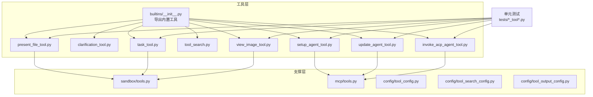

图表来源
- [builtins/__init__.py:1-15](file://backend/packages/harness/deerflow/tools/builtins/__init__.py#L1-L15)
- [sandbox/tools.py](file://backend/packages/harness/deerflow/sandbox/tools.py)
- [mcp/tools.py](file://backend/packages/harness/deerflow/mcp/tools.py)
- [config/tool_config.py](file://backend/packages/harness/deerflow/config/tool_config.py)
- [config/tool_search_config.py](file://backend/packages/harness/deerflow/config/tool_search_config.py)
- [config/tool_output_config.py](file://backend/packages/harness/deerflow/config/tool_output_config.py)

章节来源
- [builtins/__init__.py:1-15](file://backend/packages/harness/deerflow/tools/builtins/__init__.py#L1-L15)

## 核心组件
- 文件展示工具（present_file_tool）：负责将指定文件内容以可读格式呈现给用户，支持路径合法性校验与内容截断策略。
- 澄清请求工具（clarification_tool）：用于在对话上下文中收集必要的澄清信息，避免因指令模糊导致的错误输出。
- 任务管理工具（task_tool）：封装任务创建、状态查询与进度跟踪等操作，结合沙箱环境执行具体任务。
- 工具搜索工具（tool_search）：根据关键词检索可用工具集合，辅助智能体选择合适的工具组合。
- 代理设置工具（setup_agent_tool）：初始化并配置代理运行所需的环境与参数，确保后续工具链路稳定。
- 代理更新工具（update_agent_tool）：动态更新代理配置或运行参数，支持热更新场景。
- ACP 代理调用工具（invoke_acp_agent_tool）：桥接外部 ACP 兼容代理，隔离工作空间并返回最终响应。
- 图像查看工具（view_image_tool）：在受控环境中读取并展示图像，保障文件访问安全与合规。

章节来源
- [builtins/__init__.py:1-15](file://backend/packages/harness/deerflow/tools/builtins/__init__.py#L1-L15)

## 架构总览
内置工具通过统一导出入口暴露给上层智能体；部分工具依赖沙箱（sandbox）进行文件系统操作，另一些工具依赖 MCP（Model Context Protocol）进行外部代理交互。配置模块为工具行为提供参数化控制，测试模块覆盖核心逻辑与边界条件。

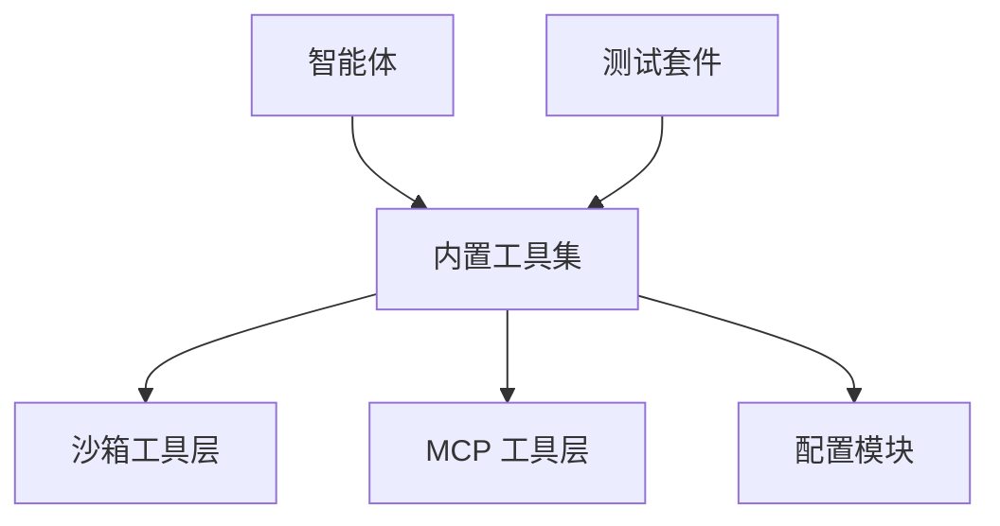

图表来源
- [sandbox/tools.py](file://backend/packages/harness/deerflow/sandbox/tools.py)
- [mcp/tools.py](file://backend/packages/harness/deerflow/mcp/tools.py)
- [config/tool_config.py](file://backend/packages/harness/deerflow/config/tool_config.py)
- [config/tool_search_config.py](file://backend/packages/harness/deerflow/config/tool_search_config.py)
- [config/tool_output_config.py](file://backend/packages/harness/deerflow/config/tool_output_config.py)

## 详细组件分析

### 文件展示工具（present_file_tool）
- 定义与导出：在内置工具导出入口中声明并公开。
- 参数验证：校验输入路径是否存在、是否为文件类型、是否在允许的根目录范围内。
- 执行流程：读取文件内容，应用内容长度限制与编码处理，必要时进行敏感信息脱敏。
- 结果处理：将内容格式化为字符串返回，若超出长度阈值则截断并标注。
- 错误处理：对不存在、权限不足、编码异常等情况返回明确错误信息。
- 最佳实践：优先使用相对路径与受控根目录，避免跨目录访问；对大文件采用分页或摘要模式。

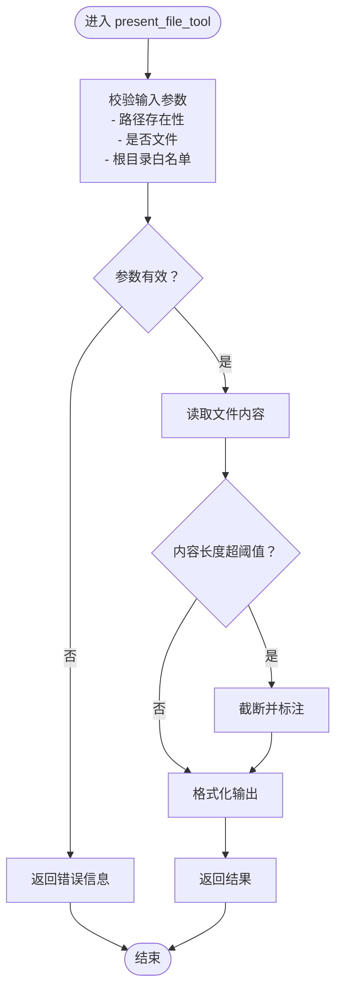

图表来源
- [builtins/present_file_tool.py](file://backend/packages/harness/deerflow/tools/builtins/present_file_tool.py)
- [sandbox/tools.py](file://backend/packages/harness/deerflow/sandbox/tools.py)

章节来源
- [builtins/__init__.py:1-15](file://backend/packages/harness/deerflow/tools/builtins/__init__.py#L1-L15)
- [builtins/present_file_tool.py](file://backend/packages/harness/deerflow/tools/builtins/present_file_tool.py)
- [test_present_file_tool_core_logic.py](file://backend/tests/test_present_file_tool_core_logic.py)

### 澄清请求工具（clarification_tool）
- 定义与导出：在内置工具导出入口中声明并公开。
- 参数验证：校验问题描述长度、关键词列表有效性。
- 执行流程：根据上下文生成澄清问题清单，等待用户反馈后继续对话。
- 结果处理：将澄清结果合并回消息历史，驱动后续推理。
- 错误处理：对空输入、重复澄清、超时等情况进行降级处理。
- 最佳实践：保持问题简洁明确，避免引导性语言；在多轮澄清中记录关键上下文。

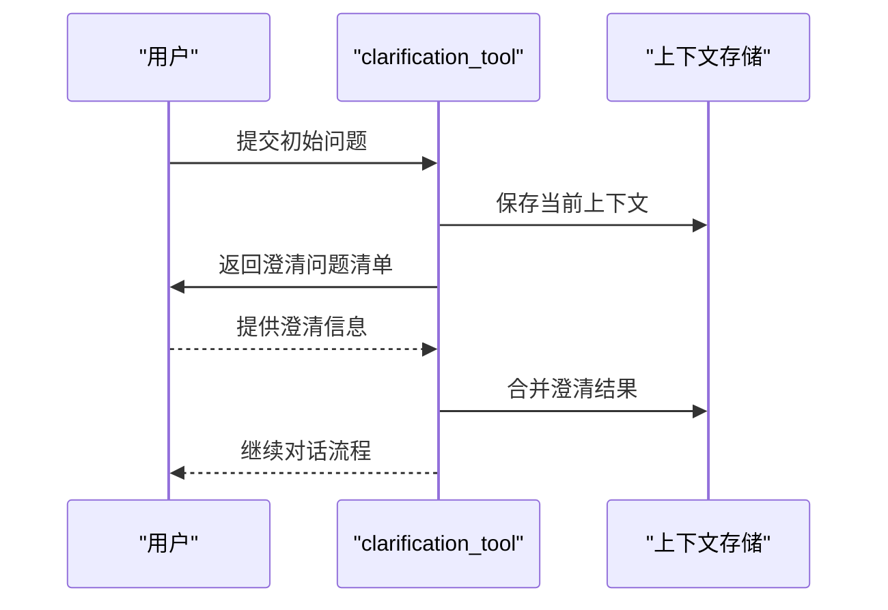

图表来源
- [builtins/clarification_tool.py](file://backend/packages/harness/deerflow/tools/builtins/clarification_tool.py)

章节来源
- [builtins/__init__.py:1-15](file://backend/packages/harness/deerflow/tools/builtins/__init__.py#L1-L15)
- [builtins/clarification_tool.py](file://backend/packages/harness/deerflow/tools/builtins/clarification_tool.py)

### 任务管理工具（task_tool）
- 定义与导出：在内置工具导出入口中声明并公开。
- 参数验证：校验任务名称唯一性、参数完整性、执行环境可用性。
- 执行流程：创建任务实例，调度至沙箱执行器，监控状态变化，汇总结果。
- 结果处理：返回任务 ID、状态、输出摘要与可选的详细日志链接。
- 错误处理：捕获执行失败、超时、资源不足等异常并返回标准化错误。
- 最佳实践：为长耗时任务设置合理的超时与重试策略；对敏感任务启用审计日志。

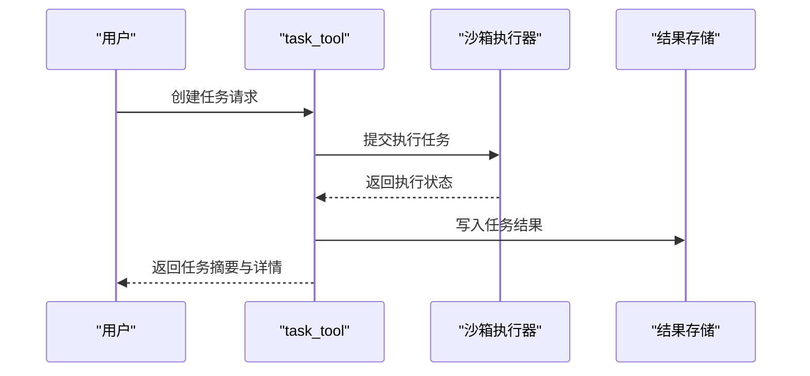

图表来源
- [builtins/task_tool.py](file://backend/packages/harness/deerflow/tools/builtins/task_tool.py)
- [sandbox/tools.py](file://backend/packages/harness/deerflow/sandbox/tools.py)

章节来源
- [builtins/__init__.py:1-15](file://backend/packages/harness/deerflow/tools/builtins/__init__.py#L1-L15)
- [builtins/task_tool.py](file://backend/packages/harness/deerflow/tools/builtins/task_tool.py)
- [test_task_tool_core_logic.py](file://backend/tests/test_task_tool_core_logic.py)

### 工具搜索工具（tool_search）
- 定义与导出：在内置工具导出入口中声明并公开。
- 参数验证：校验关键词非空、匹配模式合法。
- 执行流程：基于关键词在工具注册表中检索匹配项，按相关度排序。
- 结果处理：返回工具清单与简要说明，便于智能体决策。
- 错误处理：对无匹配、索引异常等情况返回空结果或警告。
- 最佳实践：为常用工具建立清晰的标签与描述；定期维护工具索引。

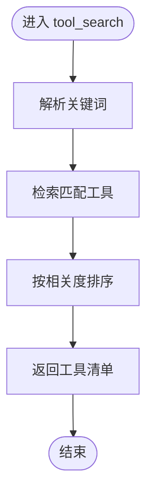

图表来源
- [builtins/tool_search.py](file://backend/packages/harness/deerflow/tools/builtins/tool_search.py)
- [config/tool_search_config.py](file://backend/packages/harness/deerflow/config/tool_search_config.py)

章节来源
- [builtins/__init__.py:1-15](file://backend/packages/harness/deerflow/tools/builtins/__init__.py#L1-L15)
- [builtins/tool_search.py](file://backend/packages/harness/deerflow/tools/builtins/tool_search.py)
- [config/tool_search_config.py](file://backend/packages/harness/deerflow/config/tool_search_config.py)

### 代理设置工具（setup_agent_tool）
- 定义与导出：在内置工具导出入口中声明并公开。
- 参数验证：校验代理配置字段完整性、认证凭据有效性。
- 执行流程：初始化代理运行环境，加载模型与插件，建立通信通道。
- 结果处理：返回代理标识与可用工具列表。
- 错误处理：对配置错误、网络异常、认证失败进行降级与重试。
- 最佳实践：将敏感配置放入安全存储；启用最小权限原则。

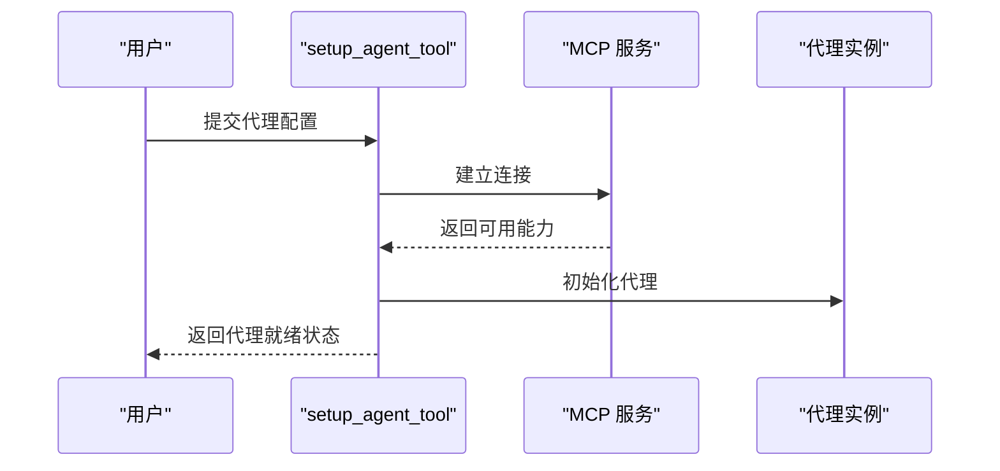

图表来源
- [builtins/setup_agent_tool.py](file://backend/packages/harness/deerflow/tools/builtins/setup_agent_tool.py)
- [mcp/tools.py](file://backend/packages/harness/deerflow/mcp/tools.py)

章节来源
- [builtins/__init__.py:1-15](file://backend/packages/harness/deerflow/tools/builtins/__init__.py#L1-L15)
- [builtins/setup_agent_tool.py](file://backend/packages/harness/deerflow/tools/builtins/setup_agent_tool.py)
- [test_setup_agent_tool.py](file://backend/tests/test_setup_agent_tool.py)

### 代理更新工具（update_agent_tool）
- 定义与导出：在内置工具导出入口中声明并公开。
- 参数验证：校验更新字段范围、版本兼容性。
- 执行流程：应用增量配置，重启或热更新代理组件。
- 结果处理：返回更新后的代理状态与变更摘要。
- 错误处理：对不兼容更新、并发冲突进行回滚与告警。
- 最佳实践：灰度发布更新；保留回滚点。

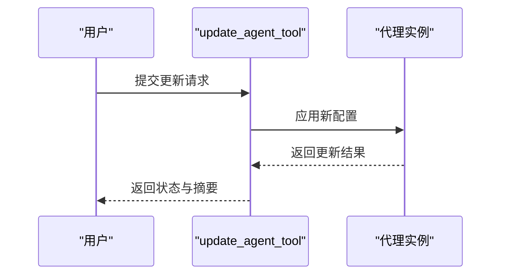

图表来源
- [builtins/update_agent_tool.py](file://backend/packages/harness/deerflow/tools/builtins/update_agent_tool.py)

章节来源
- [builtins/__init__.py:1-15](file://backend/packages/harness/deerflow/tools/builtins/__init__.py#L1-L15)
- [builtins/update_agent_tool.py](file://backend/packages/harness/deerflow/tools/builtins/update_agent_tool.py)
- [test_update_agent_tool.py](file://backend/tests/test_update_agent_tool.py)

### ACP 代理调用工具（invoke_acp_agent_tool）
- 定义与导出：在内置工具导出入口中声明并公开。
- 参数验证：校验代理名称存在性、提示词长度与上下文完整性。
- 执行流程：选择目标 ACP 代理，隔离工作空间执行，收集最终输出。
- 结果处理：返回代理的最终响应文本，必要时附带只读工作区文件路径。
- 错误处理：对未知代理、执行失败、超时进行错误提示与日志记录。
- 最佳实践：提供自包含的任务描述；避免引用外部路径。

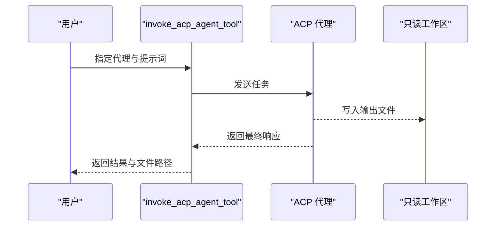

图表来源
- [builtins/invoke_acp_agent_tool.py](file://backend/packages/harness/deerflow/tools/builtins/invoke_acp_agent_tool.py)

章节来源
- [builtins/__init__.py:1-15](file://backend/packages/harness/deerflow/tools/builtins/__init__.py#L1-L15)
- [builtins/invoke_acp_agent_tool.py](file://backend/packages/harness/deerflow/tools/builtins/invoke_acp_agent_tool.py)
- [test_invoke_acp_agent_tool.py](file://backend/tests/test_invoke_acp_agent_tool.py)

### 图像查看工具（view_image_tool）
- 定义与导出：在内置工具导出入口中声明并公开。
- 参数验证：校验图像路径存在性、文件类型与尺寸限制。
- 执行流程：读取图像元数据与内容，进行格式转换与缩放处理。
- 结果处理：返回图像描述、尺寸与可访问的展示链接。
- 错误处理：对损坏文件、格式不支持、权限不足进行错误提示。
- 最佳实践：优先使用受控目录；对大图进行预处理与缓存。

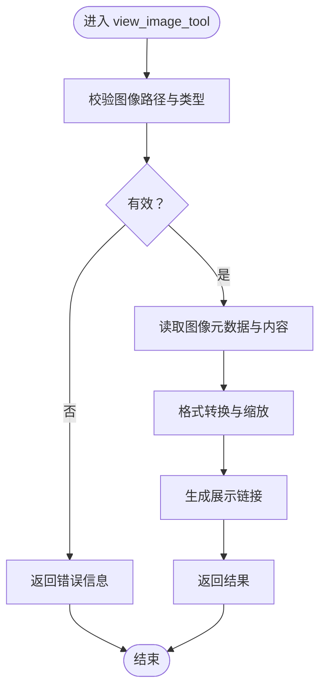

图表来源
- [builtins/view_image_tool.py](file://backend/packages/harness/deerflow/tools/builtins/view_image_tool.py)
- [sandbox/tools.py](file://backend/packages/harness/deerflow/sandbox/tools.py)

章节来源
- [builtins/__init__.py:1-15](file://backend/packages/harness/deerflow/tools/builtins/__init__.py#L1-L15)
- [builtins/view_image_tool.py](file://backend/packages/harness/deerflow/tools/builtins/view_image_tool.py)
- [test_view_image_tool.py](file://backend/tests/test_view_image_tool.py)

## 依赖关系分析
- 导出聚合：内置工具通过导出入口统一对外暴露，便于智能体按需导入。
- 沙箱依赖：文件读写、任务执行等需要沙箱层的安全隔离与资源管理。
- MCP 依赖：代理设置与外部 ACP 代理交互依赖 MCP 工具层提供的会话与通道能力。
- 配置依赖：工具行为由配置模块参数化，包括搜索策略、输出长度限制等。

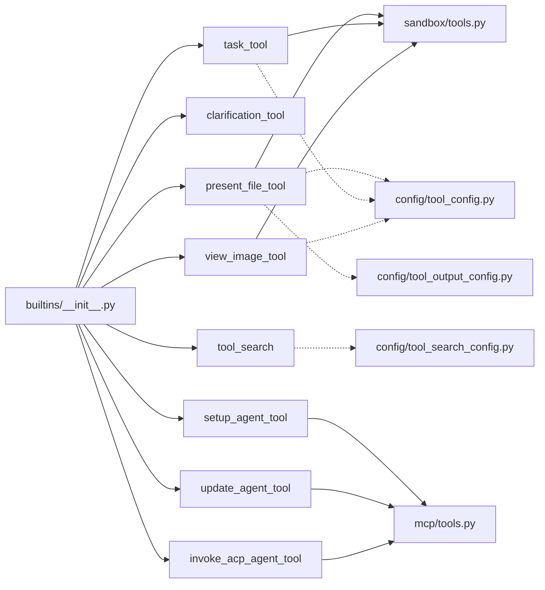

图表来源
- [builtins/__init__.py:1-15](file://backend/packages/harness/deerflow/tools/builtins/__init__.py#L1-L15)
- [sandbox/tools.py](file://backend/packages/harness/deerflow/sandbox/tools.py)
- [mcp/tools.py](file://backend/packages/harness/deerflow/mcp/tools.py)
- [config/tool_config.py](file://backend/packages/harness/deerflow/config/tool_config.py)
- [config/tool_search_config.py](file://backend/packages/harness/deerflow/config/tool_search_config.py)
- [config/tool_output_config.py](file://backend/packages/harness/deerflow/config/tool_output_config.py)

章节来源
- [builtins/__init__.py:1-15](file://backend/packages/harness/deerflow/tools/builtins/__init__.py#L1-L15)

## 性能考虑
- I/O 优化：文件与图像工具应采用流式读取与分块处理，避免一次性加载大文件。
- 缓存策略：对频繁访问的工具结果与配置进行缓存，减少重复计算与网络往返。
- 并发控制：任务工具与代理调用工具应限制并发度，防止资源争用。
- 超时与重试：为网络与外部代理调用设置合理超时与指数退避重试。
- 输出截断：对长输出进行智能截断与摘要生成，降低传输与渲染成本。

## 故障排除指南
- 文件展示工具
  - 症状：无法读取文件或返回空内容。
  - 排查：确认路径存在且在白名单内；检查编码与权限；查看内容长度限制。
  - 参考测试：[test_present_file_tool_core_logic.py](file://backend/tests/test_present_file_tool_core_logic.py)
- 任务管理工具
  - 症状：任务卡住或超时。
  - 排查：检查沙箱执行器状态、资源配额与日志；确认任务参数合法。
  - 参考测试：[test_task_tool_core_logic.py](file://backend/tests/test_task_tool_core_logic.py)
- 代理设置/更新工具
  - 症状：代理启动失败或配置不生效。
  - 排查：核对 MCP 连接参数、认证凭据与版本兼容性；查看重试与回滚日志。
  - 参考测试：[test_setup_agent_tool.py](file://backend/tests/test_setup_agent_tool.py)、[test_update_agent_tool.py](file://backend/tests/test_update_agent_tool.py)
- ACP 代理调用工具
  - 症状：返回未知代理或无响应。
  - 排查：确认代理名称正确、提示词完整；检查只读工作区文件是否生成。
  - 参考测试：[test_invoke_acp_agent_tool.py](file://backend/tests/test_invoke_acp_agent_tool.py)
- 图像查看工具
  - 症状：图像无法显示或格式错误。
  - 排查：确认文件类型与尺寸限制；检查转换与缩放过程的日志。
  - 参考测试：[test_view_image_tool.py](file://backend/tests/test_view_image_tool.py)

章节来源
- [test_present_file_tool_core_logic.py](file://backend/tests/test_present_file_tool_core_logic.py)
- [test_task_tool_core_logic.py](file://backend/tests/test_task_tool_core_logic.py)
- [test_setup_agent_tool.py](file://backend/tests/test_setup_agent_tool.py)
- [test_update_agent_tool.py](file://backend/tests/test_update_agent_tool.py)
- [test_invoke_acp_agent_tool.py](file://backend/tests/test_invoke_acp_agent_tool.py)
- [test_view_image_tool.py](file://backend/tests/test_view_image_tool.py)

## 结论
DeerFlow 内置工具模块通过清晰的职责划分与统一导出机制，为智能体提供了稳定、可扩展的工具集。配合沙箱与 MCP 的底层能力以及配置模块的参数化控制，能够在保证安全性与合规性的前提下，高效完成文件展示、任务执行、代理交互与图像查看等常见场景。建议在生产环境中遵循本文的最佳实践与故障排除指南，持续优化性能与稳定性。