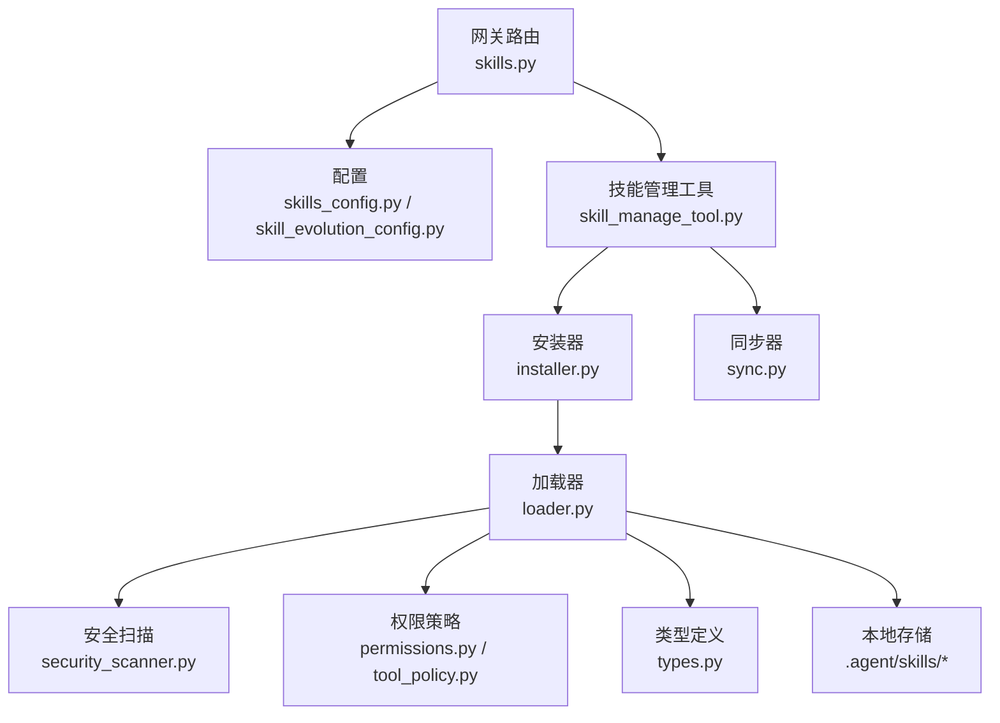
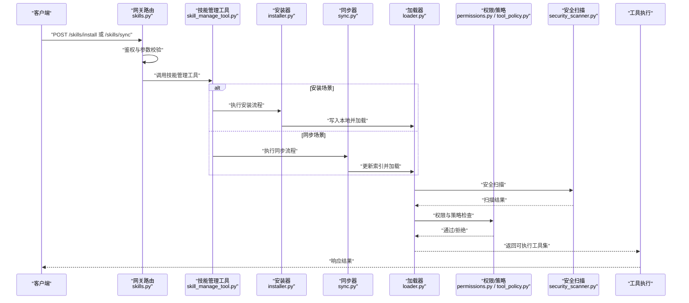
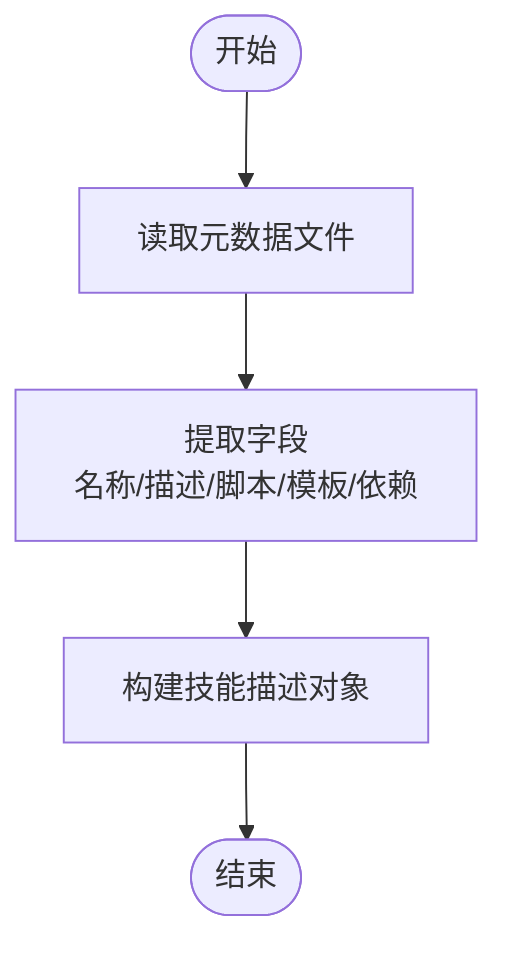
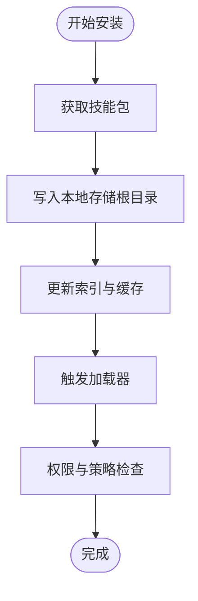
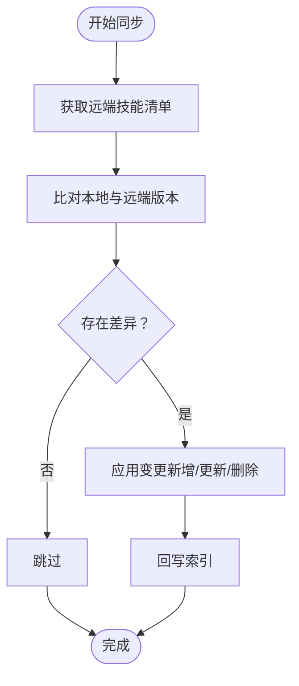
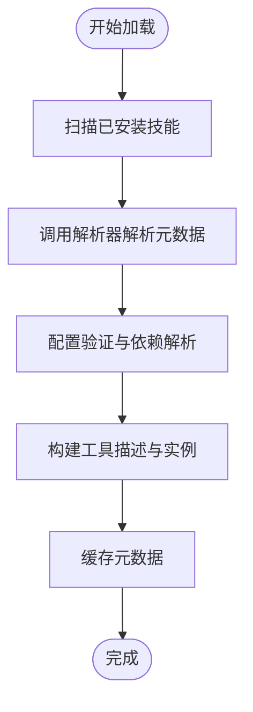
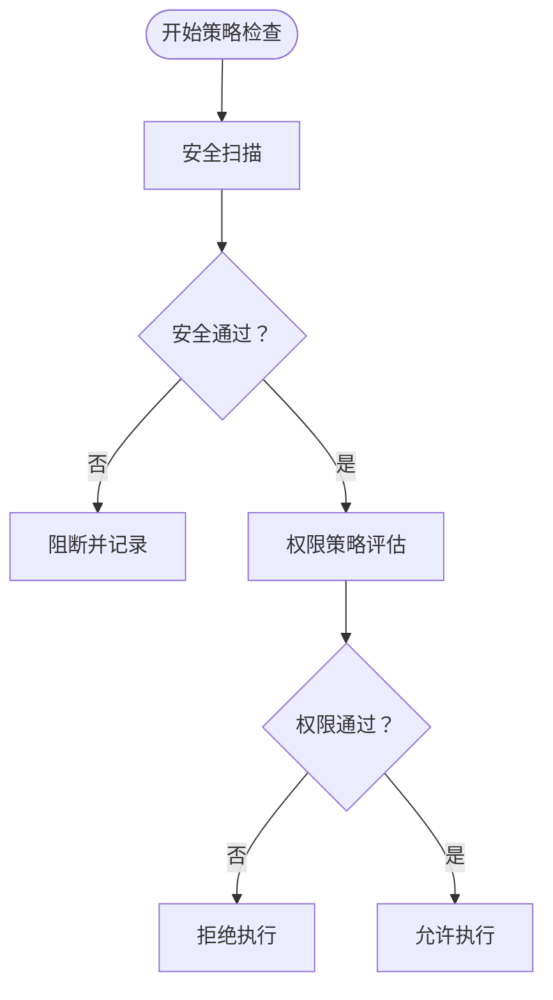
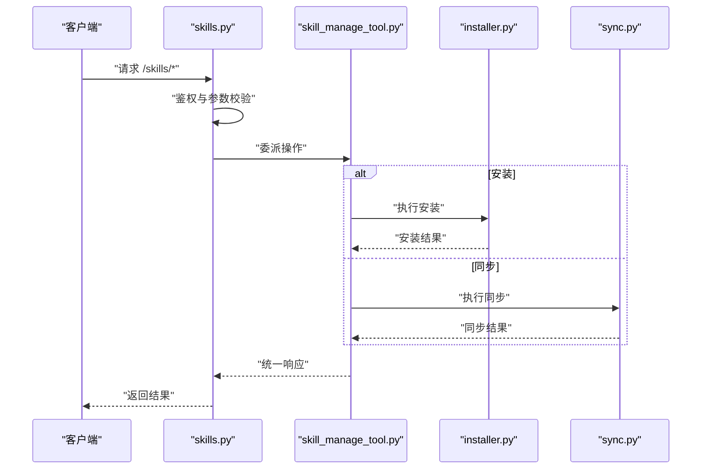
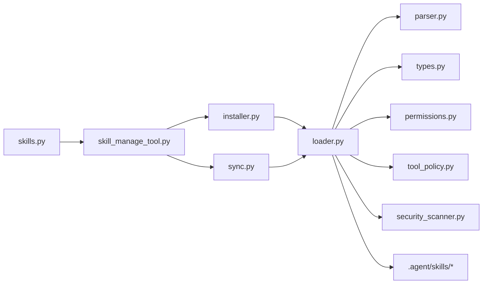

# 工具管理

<cite>
**本文引用的文件**
- [skills.py](file://backend/app/gateway/routers/skills.py)
- [installer.py](file://backend/packages/harness/deerflow/skills/installer.py)
- [loader.py](file://backend/packages/harness/deerflow/skills/loader.py)
- [parser.py](file://backend/packages/harness/deerflow/skills/parser.py)
- [permissions.py](file://backend/packages/harness/deerflow/skills/permissions.py)
- [security_scanner.py](file://backend/packages/harness/deerflow/skills/security_scanner.py)
- [tool_policy.py](file://backend/packages/harness/deerflow/skills/tool_policy.py)
- [types.py](file://backend/packages/harness/deerflow/skills/types.py)
- [sync.py](file://backend/packages/harness/deerflow/tools/sync.py)
- [skill_manage_tool.py](file://backend/packages/harness/deerflow/tools/skill_manage_tool.py)
- [skills_config.py](file://backend/packages/harness/deerflow/config/skills_config.py)
- [skill_evolution_config.py](file://backend/packages/harness/deerflow/config/skill_evolution_config.py)
- [skill_activation_middleware.py](file://backend/packages/harness/deerflow/agents/middlewares/skill_activation_middleware.py)
- [SKILL.md](file://skills/public/bootstrap/SKILL.md)
- [SKILL.md](file://skills/public/skill-creator/SKILL.md)
- [SKILL.md](file://skills/public/systematic-literature-review/SKILL.md)
- [check_docker.sh](file://.agent/skills/smoke-test/scripts/check_docker.sh)
- [deploy_docker.sh](file://.agent/skills/smoke-test/scripts/deploy_docker.sh)
- [health_check.sh](file://.agent/skills/smoke-test/scripts/health_check.sh)
- [report.docker.template.md](file://.agent/skills/smoke-test/templates/report.docker.template.md)
- [report.local.template.md](file://.agent/skills/smoke-test/templates/report.local.template.md)
</cite>

## 目录
1. [简介](#简介)
2. [项目结构](#项目结构)
3. [核心组件](#核心组件)
4. [架构总览](#架构总览)
5. [详细组件分析](#详细组件分析)
6. [依赖关系分析](#依赖关系分析)
7. [性能考量](#性能考量)
8. [故障排查指南](#故障排查指南)
9. [结论](#结论)
10. [附录](#附录)

## 简介
本文件面向DeerFlow工具管理系统，系统性阐述工具的注册、同步、存储与权限管理机制，详解工具同步流程、本地存储策略、技能安装器工作原理，并提供代码示例路径以展示工具的动态加载、配置验证与权限检查。同时，解释工具管理的安全策略、版本控制与依赖管理方法，并给出扩展自定义工具存储后端的实践建议。

## 项目结构
DeerFlow的工具管理由“网关路由层”“运行时配置层”“技能执行层”“工具实现层”四部分协同构成：
- 网关路由层：对外暴露技能相关API（如安装、同步、查询等），负责鉴权与参数校验。
- 运行时配置层：管理技能与工具的配置项（启用/禁用、路径、版本策略等）。
- 技能执行层：包含解析器、安装器、加载器、权限与安全扫描模块，支撑技能生命周期管理。
- 工具实现层：具体工具的实现与模板脚本，配合技能元数据完成功能交付。

图示来源
- [skills.py](file://backend/app/gateway/routers/skills.py)
- [skills_config.py](file://backend/packages/harness/deerflow/config/skills_config.py)
- [skill_evolution_config.py](file://backend/packages/harness/deerflow/config/skill_evolution_config.py)
- [skill_manage_tool.py](file://backend/packages/harness/deerflow/tools/skill_manage_tool.py)
- [installer.py](file://backend/packages/harness/deerflow/skills/installer.py)
- [loader.py](file://backend/packages/harness/deerflow/skills/loader.py)
- [security_scanner.py](file://backend/packages/harness/deerflow/skills/security_scanner.py)
- [permissions.py](file://backend/packages/harness/deerflow/skills/permissions.py)
- [tool_policy.py](file://backend/packages/harness/deerflow/skills/tool_policy.py)
- [types.py](file://backend/packages/harness/deerflow/skills/types.py)
- [sync.py](file://backend/packages/harness/deerflow/tools/sync.py)

章节来源
- [skills.py](file://backend/app/gateway/routers/skills.py)
- [skills_config.py](file://backend/packages/harness/deerflow/config/skills_config.py)
- [skill_evolution_config.py](file://backend/packages/harness/deerflow/config/skill_evolution_config.py)

## 核心组件
- 网关路由（skills.py）：提供技能安装、同步、查询、删除等接口；对接鉴权中间件与业务服务。
- 技能管理工具（skill_manage_tool.py）：封装对安装器与同步器的调用，统一入口处理技能生命周期操作。
- 安装器（installer.py）：负责从源位置拉取技能包、写入本地存储、生成索引与元数据。
- 同步器（sync.py）：实现技能的增量/全量同步，支持版本比对与冲突处理。
- 加载器（loader.py）：动态加载技能模块，解析元数据，构建可用工具集合。
- 解析器（parser.py）：解析技能目录中的元数据文件（如SKILL.md），提取技能描述、脚本路径、模板等。
- 权限与策略（permissions.py、tool_policy.py）：定义技能与工具的访问控制规则与策略执行点。
- 安全扫描（security_scanner.py）：对技能脚本与模板进行静态安全扫描，阻断高风险内容。
- 类型与配置（types.py、skills_config.py、skill_evolution_config.py）：定义技能与工具的数据模型、默认行为与演进策略。
- 执行中间件（skill_activation_middleware.py）：在运行时激活技能，注入上下文与权限检查。

章节来源
- [skills.py](file://backend/app/gateway/routers/skills.py)
- [skill_manage_tool.py](file://backend/packages/harness/deerflow/tools/skill_manage_tool.py)
- [installer.py](file://backend/packages/harness/deerflow/skills/installer.py)
- [sync.py](file://backend/packages/harness/deerflow/tools/sync.py)
- [loader.py](file://backend/packages/harness/deerflow/skills/loader.py)
- [parser.py](file://backend/packages/harness/deerflow/skills/parser.py)
- [permissions.py](file://backend/packages/harness/deerflow/skills/permissions.py)
- [tool_policy.py](file://backend/packages/harness/deerflow/skills/tool_policy.py)
- [security_scanner.py](file://backend/packages/harness/deerflow/skills/security_scanner.py)
- [types.py](file://backend/packages/harness/deerflow/skills/types.py)
- [skills_config.py](file://backend/packages/harness/deerflow/config/skills_config.py)
- [skill_evolution_config.py](file://backend/packages/harness/deerflow/config/skill_evolution_config.py)
- [skill_activation_middleware.py](file://backend/packages/harness/deerflow/agents/middlewares/skill_activation_middleware.py)

## 架构总览
下图展示了从API请求到技能执行的关键交互链路，包括鉴权、参数校验、安装/同步、加载与安全扫描、权限检查与工具执行。

图示来源
- [skills.py](file://backend/app/gateway/routers/skills.py)
- [skill_manage_tool.py](file://backend/packages/harness/deerflow/tools/skill_manage_tool.py)
- [installer.py](file://backend/packages/harness/deerflow/skills/installer.py)
- [sync.py](file://backend/packages/harness/deerflow/tools/sync.py)
- [loader.py](file://backend/packages/harness/deerflow/skills/loader.py)
- [permissions.py](file://backend/packages/harness/deerflow/skills/permissions.py)
- [tool_policy.py](file://backend/packages/harness/deerflow/skills/tool_policy.py)
- [security_scanner.py](file://backend/packages/harness/deerflow/skills/security_scanner.py)

## 详细组件分析

### 注册与元数据解析（parser.py）
- 职责：解析技能目录中的元数据文件（如SKILL.md），抽取技能名称、描述、脚本路径、模板路径、依赖声明等。
- 关键流程：读取元数据文件 → 提取字段 → 构建技能描述对象 → 输出给加载器使用。
- 复杂度：线性于元数据大小与脚本/模板数量。

图示来源
- [parser.py](file://backend/packages/harness/deerflow/skills/parser.py)

章节来源
- [parser.py](file://backend/packages/harness/deerflow/skills/parser.py)

### 安装器工作原理（installer.py）
- 职责：从源位置（本地/远程仓库）拉取技能包，写入本地存储根目录，生成索引与元数据缓存。
- 关键流程：下载/复制 → 写入目标目录 → 更新索引 → 生成元数据缓存 → 触发加载器。
- 安全要点：安装前进行权限与策略评估，必要时阻断高风险技能。

图示来源
- [installer.py](file://backend/packages/harness/deerflow/skills/installer.py)
- [loader.py](file://backend/packages/harness/deerflow/skills/loader.py)
- [permissions.py](file://backend/packages/harness/deerflow/skills/permissions.py)
- [tool_policy.py](file://backend/packages/harness/deerflow/skills/tool_policy.py)

章节来源
- [installer.py](file://backend/packages/harness/deerflow/skills/installer.py)

### 同步器工作原理（sync.py）
- 职责：实现技能的增量/全量同步，比较远端与本地版本，执行更新或回滚。
- 关键流程：获取远端清单 → 比较版本 → 计算差异 → 应用变更 → 回写索引。
- 版本控制：基于元数据中的版本号与哈希值进行一致性校验。

图示来源
- [sync.py](file://backend/packages/harness/deerflow/tools/sync.py)

章节来源
- [sync.py](file://backend/packages/harness/deerflow/tools/sync.py)

### 动态加载与配置验证（loader.py）
- 职责：动态导入技能模块，解析脚本与模板，构建工具集合；执行配置验证与依赖解析。
- 关键流程：扫描已安装技能 → 调用解析器 → 生成工具描述 → 验证配置 → 构建工具实例。
- 性能：按需加载，避免一次性加载全部技能；缓存已解析的元数据。

图示来源
- [loader.py](file://backend/packages/harness/deerflow/skills/loader.py)
- [parser.py](file://backend/packages/harness/deerflow/skills/parser.py)
- [types.py](file://backend/packages/harness/deerflow/skills/types.py)

章节来源
- [loader.py](file://backend/packages/harness/deerflow/skills/loader.py)

### 权限管理与安全策略（permissions.py、tool_policy.py、security_scanner.py）
- 权限策略：定义技能与工具的访问范围、执行域与最小权限原则。
- 安全扫描：对脚本与模板进行静态扫描，识别高危模式（如任意命令执行、敏感路径访问）。
- 策略执行：在加载与运行阶段分别进行权限与安全检查，失败则阻断。

图示来源
- [permissions.py](file://backend/packages/harness/deerflow/skills/permissions.py)
- [tool_policy.py](file://backend/packages/harness/deerflow/skills/tool_policy.py)
- [security_scanner.py](file://backend/packages/harness/deerflow/skills/security_scanner.py)

章节来源
- [permissions.py](file://backend/packages/harness/deerflow/skills/permissions.py)
- [tool_policy.py](file://backend/packages/harness/deerflow/skills/tool_policy.py)
- [security_scanner.py](file://backend/packages/harness/deerflow/skills/security_scanner.py)

### 网关路由与技能管理工具（skills.py、skill_manage_tool.py）
- 网关路由：提供REST接口，接收安装/同步/查询/删除请求，进行鉴权与参数校验。
- 技能管理工具：封装安装/同步的具体实现，协调安装器与同步器，返回统一结果格式。

图示来源
- [skills.py](file://backend/app/gateway/routers/skills.py)
- [skill_manage_tool.py](file://backend/packages/harness/deerflow/tools/skill_manage_tool.py)
- [installer.py](file://backend/packages/harness/deerflow/skills/installer.py)
- [sync.py](file://backend/packages/harness/deerflow/tools/sync.py)

章节来源
- [skills.py](file://backend/app/gateway/routers/skills.py)
- [skill_manage_tool.py](file://backend/packages/harness/deerflow/tools/skill_manage_tool.py)

### 本地存储策略与技能目录结构
- 存储根目录：.agent/skills/<技能名>/scripts、templates、references 等子目录。
- 元数据文件：每个技能包含SKILL.md，用于描述技能用途、脚本与模板路径、依赖等。
- 示例路径：
  - [check_docker.sh](file://.agent/skills/smoke-test/scripts/check_docker.sh)
  - [deploy_docker.sh](file://.agent/skills/smoke-test/scripts/deploy_docker.sh)
  - [health_check.sh](file://.agent/skills/smoke-test/scripts/health_check.sh)
  - [report.docker.template.md](file://.agent/skills/smoke-test/templates/report.docker.template.md)
  - [report.local.template.md](file://.agent/skills/smoke-test/templates/report.local.template.md)

章节来源
- [.agent/skills/smoke-test/scripts/check_docker.sh](file://.agent/skills/smoke-test/scripts/check_docker.sh)
- [.agent/skills/smoke-test/scripts/deploy_docker.sh](file://.agent/skills/smoke-test/scripts/deploy_docker.sh)
- [.agent/skills/smoke-test/scripts/health_check.sh](file://.agent/skills/smoke-test/scripts/health_check.sh)
- [.agent/skills/smoke-test/templates/report.docker.template.md](file://.agent/skills/smoke-test/templates/report.docker.template.md)
- [.agent/skills/smoke-test/templates/report.local.template.md](file://.agent/skills/smoke-test/templates/report.local.template.md)

### 运行时中间件与技能激活（skill_activation_middleware.py）
- 职责：在运行时激活技能，注入上下文信息，执行权限检查与策略评估，确保工具调用符合安全与权限要求。
- 适用场景：当代理需要根据当前对话状态动态选择与激活技能工具时。

章节来源
- [skill_activation_middleware.py](file://backend/packages/harness/deerflow/agents/middlewares/skill_activation_middleware.py)

## 依赖关系分析
- 组件耦合：网关路由依赖技能管理工具；技能管理工具依赖安装器与同步器；安装器与同步器共同依赖加载器；加载器依赖解析器、权限与安全模块。
- 外部依赖：脚本与模板依赖操作系统环境（如Docker、Shell脚本）、第三方工具（如健康检查脚本）。
- 配置依赖：技能与工具的行为受skills_config与skill_evolution_config影响，包括启用策略、版本控制与演进规则。

图示来源
- [skills.py](file://backend/app/gateway/routers/skills.py)
- [skill_manage_tool.py](file://backend/packages/harness/deerflow/tools/skill_manage_tool.py)
- [installer.py](file://backend/packages/harness/deerflow/skills/installer.py)
- [sync.py](file://backend/packages/harness/deerflow/tools/sync.py)
- [loader.py](file://backend/packages/harness/deerflow/skills/loader.py)
- [parser.py](file://backend/packages/harness/deerflow/skills/parser.py)
- [permissions.py](file://backend/packages/harness/deerflow/skills/permissions.py)
- [tool_policy.py](file://backend/packages/harness/deerflow/skills/tool_policy.py)
- [security_scanner.py](file://backend/packages/harness/deerflow/skills/security_scanner.py)
- [types.py](file://backend/packages/harness/deerflow/skills/types.py)

章节来源
- [skills.py](file://backend/app/gateway/routers/skills.py)
- [skill_manage_tool.py](file://backend/packages/harness/deerflow/tools/skill_manage_tool.py)
- [installer.py](file://backend/packages/harness/deerflow/skills/installer.py)
- [sync.py](file://backend/packages/harness/deerflow/tools/sync.py)
- [loader.py](file://backend/packages/harness/deerflow/skills/loader.py)

## 性能考量
- 按需加载：仅在需要时加载技能模块，减少内存占用与启动时间。
- 缓存策略：对解析后的元数据与工具描述进行缓存，避免重复解析。
- 并发控制：安装与同步操作应串行化，防止并发写入导致的索引不一致。
- I/O优化：批量写入本地存储，合并小文件写操作，降低磁盘压力。
- 安全扫描前置：在加载前完成安全扫描，避免后续执行阶段的失败重试成本。

## 故障排查指南
- 安装失败
  - 检查网络连通性与源地址可达性。
  - 查看安装器日志，确认写入权限与存储空间。
  - 参考路径：[installer.py](file://backend/packages/harness/deerflow/skills/installer.py)
- 同步异常
  - 对比远端与本地版本，确认版本号与哈希是否匹配。
  - 检查同步器差异计算逻辑与应用过程。
  - 参考路径：[sync.py](file://backend/packages/harness/deerflow/tools/sync.py)
- 加载失败
  - 检查元数据文件完整性与字段正确性。
  - 确认脚本与模板路径是否存在且可执行。
  - 参考路径：[loader.py](file://backend/packages/harness/deerflow/skills/loader.py)、[parser.py](file://backend/packages/harness/deerflow/skills/parser.py)
- 权限/安全阻断
  - 检查权限策略与安全扫描规则，调整策略或修复脚本。
  - 参考路径：[permissions.py](file://backend/packages/harness/deerflow/skills/permissions.py)、[security_scanner.py](file://backend/packages/harness/deerflow/skills/security_scanner.py)
- 运行时激活问题
  - 检查中间件是否正确注入上下文与权限。
  - 参考路径：[skill_activation_middleware.py](file://backend/packages/harness/deerflow/agents/middlewares/skill_activation_middleware.py)

章节来源
- [installer.py](file://backend/packages/harness/deerflow/skills/installer.py)
- [sync.py](file://backend/packages/harness/deerflow/tools/sync.py)
- [loader.py](file://backend/packages/harness/deerflow/skills/loader.py)
- [parser.py](file://backend/packages/harness/deerflow/skills/parser.py)
- [permissions.py](file://backend/packages/harness/deerflow/skills/permissions.py)
- [security_scanner.py](file://backend/packages/harness/deerflow/skills/security_scanner.py)
- [skill_activation_middleware.py](file://backend/packages/harness/deerflow/agents/middlewares/skill_activation_middleware.py)

## 结论
DeerFlow工具管理系统通过“网关路由 + 技能管理工具 + 安装器/同步器 + 加载器 + 权限与安全模块”的分层设计，实现了从技能注册、同步、存储到运行时激活的完整闭环。其核心优势在于：
- 明确的职责分离与可扩展的插件式架构；
- 前置的安全扫描与严格的权限策略；
- 基于元数据的动态加载与缓存优化；
- 支持版本控制与演进策略的配置化管理。

## 附录

### 代码示例路径（用于演示关键流程）
- 动态加载与配置验证
  - [loader.py](file://backend/packages/harness/deerflow/skills/loader.py)
  - [parser.py](file://backend/packages/harness/deerflow/skills/parser.py)
  - [types.py](file://backend/packages/harness/deerflow/skills/types.py)
- 权限检查与策略执行
  - [permissions.py](file://backend/packages/harness/deerflow/skills/permissions.py)
  - [tool_policy.py](file://backend/packages/harness/deerflow/skills/tool_policy.py)
- 安全扫描
  - [security_scanner.py](file://backend/packages/harness/deerflow/skills/security_scanner.py)
- 网关与技能管理
  - [skills.py](file://backend/app/gateway/routers/skills.py)
  - [skill_manage_tool.py](file://backend/packages/harness/deerflow/tools/skill_manage_tool.py)
- 安装与同步
  - [installer.py](file://backend/packages/harness/deerflow/skills/installer.py)
  - [sync.py](file://backend/packages/harness/deerflow/tools/sync.py)
- 本地存储与示例脚本
  - [check_docker.sh](file://.agent/skills/smoke-test/scripts/check_docker.sh)
  - [deploy_docker.sh](file://.agent/skills/smoke-test/scripts/deploy_docker.sh)
  - [health_check.sh](file://.agent/skills/smoke-test/scripts/health_check.sh)
  - [report.docker.template.md](file://.agent/skills/smoke-test/templates/report.docker.template.md)
  - [report.local.template.md](file://.agent/skills/smoke-test/templates/report.local.template.md)
- 技能元数据示例
  - [bootstrap/SKILL.md](file://skills/public/bootstrap/SKILL.md)
  - [skill-creator/SKILL.md](file://skills/public/skill-creator/SKILL.md)
  - [systematic-literature-review/SKILL.md](file://skills/public/systematic-literature-review/SKILL.md)