# 工具系统

<cite>
**本文引用的文件**
- [tools.py](file://backend/packages/harness/deerflow/mcp/tools.py)
- [__init__.py](file://backend/packages/harness/deerflow/tools/__init__.py)
- [builtins/__init__.py](file://backend/packages/harness/deerflow/tools/builtins/__init__.py)
- [clarification_tool.py](file://backend/packages/harness/deerflow/tools/builtins/clarification_tool.py)
- [present_file_tool.py](file://backend/packages/harness/deerflow/tools/builtins/present_file_tool.py)
- [setup_agent_tool.py](file://backend/packages/harness/deerflow/tools/builtins/setup_agent_tool.py)
- [task_tool.py](file://backend/packages/harness/deerflow/tools/builtins/task_tool.py)
- [update_agent_tool.py](file://backend/packages/harness/deerflow/tools/builtins/update_agent_tool.py)
- [view_image_tool.py](file://backend/packages/harness/deerflow/tools/builtins/view_image_tool.py)
- [tool_search.py](file://backend/packages/harness/deerflow/tools/builtins/tool_search.py)
- [sandbox/tools.py](file://backend/packages/harness/deerflow/sandbox/tools.py)
- [community/*/tools.py](file://backend/packages/harness/deerflow/community/ddg_search/tools.py)
- [mcp/metadata.py](file://backend/packages/harness/deerflow/tools/mcp_metadata.py)
- [tool_config.py](file://backend/packages/harness/deerflow/config/tool_config.py)
- [tool_output_config.py](file://backend/packages/harness/deerflow/config/tool_output_config.py)
- [tool_search_config.py](file://backend/packages/harness/deerflow/config/tool_search_config.py)
- [permissions.py](file://backend/packages/harness/deerflow/skills/permissions.py)
- [security_scanner.py](file://backend/packages/harness/deerflow/skills/security_scanner.py)
- [validation.py](file://backend/packages/harness/deerflow/skills/validation.py)
- [skill_manage_tool.py](file://backend/packages/harness/deerflow/tools/skill_manage_tool.py)
- [mcp/client.py](file://backend/packages/harness/deerflow/mcp/client.py)
- [mcp/session_pool.py](file://backend/packages/harness/deerflow/mcp/session_pool.py)
- [mcp/oauth.py](file://backend/packages/harness/deerflow/mcp/oauth.py)
- [mcp/cache.py](file://backend/packages/harness/deerflow/mcp/cache.py)
- [routers/mcp.py](file://backend/app/gateway/routers/mcp.py)
- [routers/skills.py](file://backend/app/gateway/routers/skills.py)
- [routers/artifacts.py](file://backend/app/gateway/routers/artifacts.py)
- [test_tool_deduplication.py](file://backend/tests/test_tool_deduplication.py)
- [test_tool_output_budget_middleware.py](file://backend/tests/test_tool_output_budget_middleware.py)
- [test_invoke_acp_agent_tool.py](file://backend/tests/test_invoke_acp_agent_tool.py)
- [mcp.mdx](file://frontend/src/content/en/harness/mcp.mdx)
</cite>

## 目录
1. [简介](#简介)
2. [项目结构](#项目结构)
3. [核心组件](#核心组件)
4. [架构总览](#架构总览)
5. [详细组件分析](#详细组件分析)
6. [依赖关系分析](#依赖关系分析)
7. [性能考量](#性能考量)
8. [故障排查指南](#故障排查指南)
9. [结论](#结论)
10. [附录](#附录)

## 简介
本文件面向DeerFlow工具系统，系统性阐述其架构设计与实现细节，重点覆盖以下方面：
- 统一接口：内置工具、配置工具与MCP工具的统一抽象与调用机制
- 内置工具：文件展示、澄清请求、任务管理、工具搜索等核心能力
- 执行流程：参数校验、权限控制、安全扫描、结果处理与缓存策略
- 扩展机制：如何注册自定义工具、如何接入MCP服务器与社区工具包

## 项目结构
DeerFlow工具系统主要分布在后端Python包与前端内容中：
- 后端核心位置：backend/packages/harness/deerflow
  - tools：工具定义与注册（内置、MCP、社区）
  - mcp：MCP客户端、会话池、OAuth、缓存与拦截器
  - sandbox：沙箱工具与安全中间件
  - skills：技能权限、安全扫描与验证
  - config：工具配置、输出预算与搜索配置
  - persistence、models、runtime等支撑模块
- 前端内容：frontend/src/content/en/harness/mcp.mdx，描述MCP工具加载与搜索集成

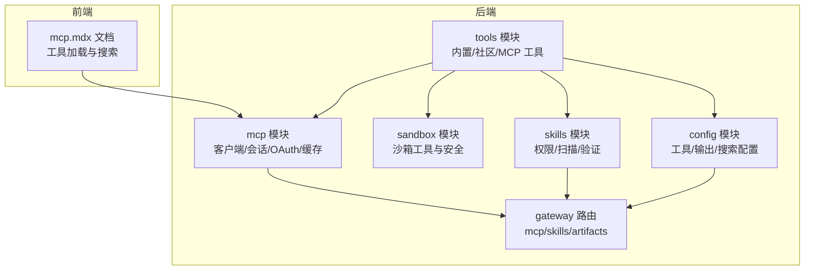

**图表来源**
- [tools.py](file://backend/packages/harness/deerflow/mcp/tools.py)
- [__init__.py](file://backend/packages/harness/deerflow/tools/__init__.py)
- [builtins/__init__.py](file://backend/packages/harness/deerflow/tools/builtins/__init__.py)
- [mcp/client.py](file://backend/packages/harness/deerflow/mcp/client.py)
- [routers/mcp.py](file://backend/app/gateway/routers/mcp.py)

**章节来源**
- [__init__.py](file://backend/packages/harness/deerflow/tools/__init__.py)
- [builtins/__init__.py](file://backend/packages/harness/deerflow/tools/builtins/__init__.py)
- [mcp.mdx](file://frontend/src/content/en/harness/mcp.mdx)

## 核心组件
- 工具注册与聚合
  - 内置工具集合通过tools/builtins/__init__.py导出，统一纳入可用工具列表
  - MCP工具通过mcp/tools.py动态加载并缓存，支持懒加载与失效策略
  - 社区工具（如ddg_search、exa等）以独立包形式提供，按需启用
- 工具类型与职责
  - 文件展示：present_file_tool.py
  - 澄清请求：clarification_tool.py
  - 任务管理：task_tool.py
  - 工具搜索：tool_search.py
  - 图像查看：view_image_tool.py
  - 代理设置/更新：setup_agent_tool.py、update_agent_tool.py
- 安全与权限
  - 技能权限与安全扫描：skills/permissions.py、security_scanner.py、validation.py
  - 沙箱工具与安全中间件：sandbox/tools.py
- 配置与输出
  - 工具配置：config/tool_config.py
  - 输出预算与路径外化：config/tool_output_config.py、tests/test_tool_output_budget_middleware.py
  - 工具搜索开关：config/tool_search_config.py

**章节来源**
- [builtins/__init__.py](file://backend/packages/harness/deerflow/tools/builtins/__init__.py)
- [present_file_tool.py](file://backend/packages/harness/deerflow/tools/builtins/present_file_tool.py)
- [clarification_tool.py](file://backend/packages/harness/deerflow/tools/builtins/clarification_tool.py)
- [task_tool.py](file://backend/packages/harness/deerflow/tools/builtins/task_tool.py)
- [tool_search.py](file://backend/packages/harness/deerflow/tools/builtins/tool_search.py)
- [view_image_tool.py](file://backend/packages/harness/deerflow/tools/builtins/view_image_tool.py)
- [setup_agent_tool.py](file://backend/packages/harness/deerflow/tools/builtins/setup_agent_tool.py)
- [update_agent_tool.py](file://backend/packages/harness/deerflow/tools/builtins/update_agent_tool.py)
- [permissions.py](file://backend/packages/harness/deerflow/skills/permissions.py)
- [security_scanner.py](file://backend/packages/harness/deerflow/skills/security_scanner.py)
- [validation.py](file://backend/packages/harness/deerflow/skills/validation.py)
- [sandbox/tools.py](file://backend/packages/harness/deerflow/sandbox/tools.py)
- [tool_output_config.py](file://backend/packages/harness/deerflow/config/tool_output_config.py)
- [tool_search_config.py](file://backend/packages/harness/deerflow/config/tool_search_config.py)

## 架构总览
工具系统采用“统一抽象 + 分层实现”的架构：
- 抽象层：所有工具遵循统一的接口约定（名称、描述、参数模式、执行函数/协程）
- 实现层：内置工具、社区工具与MCP工具在运行时被统一收集与去重
- 安全层：权限检查、安全扫描与沙箱隔离贯穿工具生命周期
- 配置层：通过配置文件与路由接口动态调整工具可用性与行为

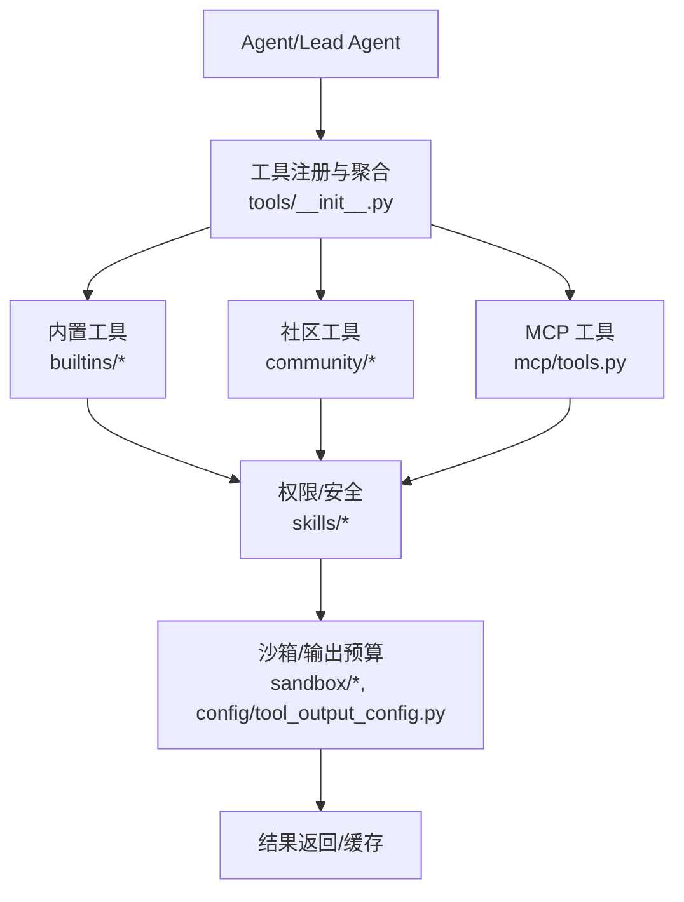

**图表来源**
- [__init__.py](file://backend/packages/harness/deerflow/tools/__init__.py)
- [builtins/__init__.py](file://backend/packages/harness/deerflow/tools/builtins/__init__.py)
- [mcp/tools.py](file://backend/packages/harness/deerflow/mcp/tools.py)
- [permissions.py](file://backend/packages/harness/deerflow/skills/permissions.py)
- [security_scanner.py](file://backend/packages/harness/deerflow/skills/security_scanner.py)
- [sandbox/tools.py](file://backend/packages/harness/deerflow/sandbox/tools.py)
- [tool_output_config.py](file://backend/packages/harness/deerflow/config/tool_output_config.py)

## 详细组件分析

### 统一工具接口与注册机制
- 接口约定
  - 工具需具备名称、描述、参数Schema、执行函数或协程
  - 支持同步包装（当客户端以同步方式调用时）
- 注册与聚合
  - 内置工具通过builtins/__init__.py集中导出
  - MCP工具通过mcp/tools.py动态加载，支持拦截器注入与缓存
  - 社区工具以独立包形式提供，按需启用
- 去重策略
  - 工具名唯一性保证，避免重复注册导致的冲突

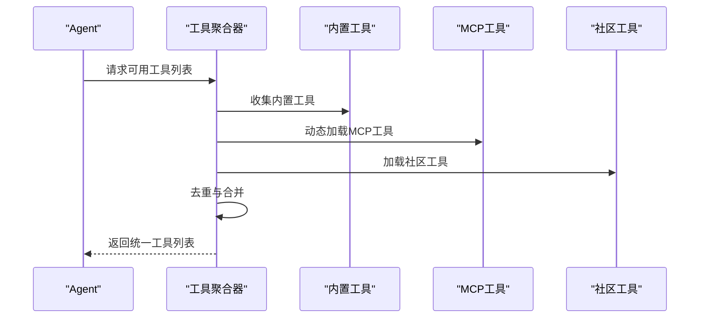

**图表来源**
- [__init__.py](file://backend/packages/harness/deerflow/tools/__init__.py)
- [builtins/__init__.py](file://backend/packages/harness/deerflow/tools/builtins/__init__.py)
- [mcp/tools.py](file://backend/packages/harness/deerflow/mcp/tools.py)

**章节来源**
- [__init__.py](file://backend/packages/harness/deerflow/tools/__init__.py)
- [builtins/__init__.py](file://backend/packages/harness/deerflow/tools/builtins/__init__.py)
- [test_tool_deduplication.py](file://backend/tests/test_tool_deduplication.py)

### 内置工具：文件展示与图像查看
- 文件展示工具
  - 功能：将指定文件内容以可读格式呈现给用户
  - 参数：文件路径、显示选项（如编码、行数限制）
  - 结果：文本片段或结构化摘要
- 图像查看工具
  - 功能：对图像进行预览与元数据提取
  - 参数：图像路径、缩放比例、格式转换
  - 结果：图像URL或二进制数据

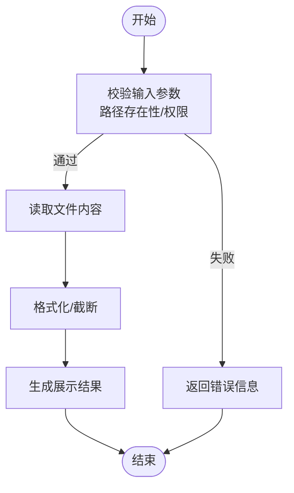

**图表来源**
- [present_file_tool.py](file://backend/packages/harness/deerflow/tools/builtins/present_file_tool.py)
- [view_image_tool.py](file://backend/packages/harness/deerflow/tools/builtins/view_image_tool.py)

**章节来源**
- [present_file_tool.py](file://backend/packages/harness/deerflow/tools/builtins/present_file_tool.py)
- [view_image_tool.py](file://backend/packages/harness/deerflow/tools/builtins/view_image_tool.py)

### 内置工具：澄清请求
- 功能：当Agent需要更多信息以继续推理时，触发澄清请求
- 流程：构造澄清问题 → 发送至渠道 → 等待用户回复 → 继续执行
- 关键点：与消息通道系统集成，确保上下文连贯

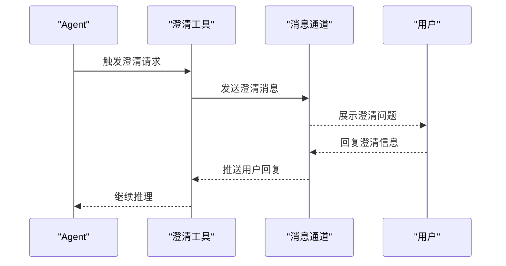

**图表来源**
- [clarification_tool.py](file://backend/packages/harness/deerflow/tools/builtins/clarification_tool.py)

**章节来源**
- [clarification_tool.py](file://backend/packages/harness/deerflow/tools/builtins/clarification_tool.py)

### 内置工具：任务管理
- 功能：创建、查询、更新与完成任务
- 参数：任务标题、描述、优先级、截止日期、状态
- 结果：任务ID、状态变更记录、关联工件

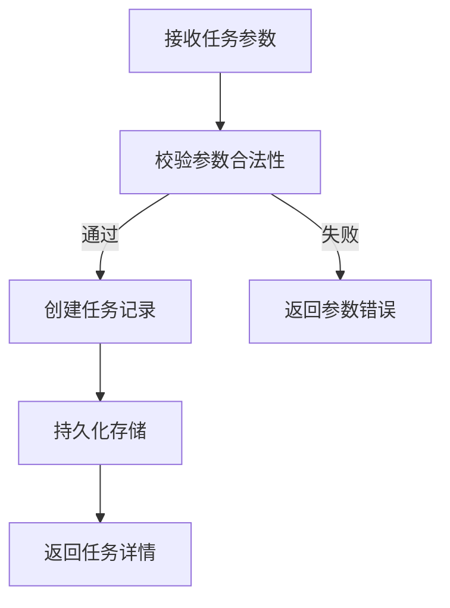

**图表来源**
- [task_tool.py](file://backend/packages/harness/deerflow/tools/builtins/task_tool.py)

**章节来源**
- [task_tool.py](file://backend/packages/harness/deerflow/tools/builtins/task_tool.py)

### 内置工具：工具搜索
- 功能：在大量工具中按关键词检索，降低上下文开销
- 行为：开启后延迟加载MCP工具；根据关键词过滤工具集合
- 配置：通过tool_search_config.py启用/禁用

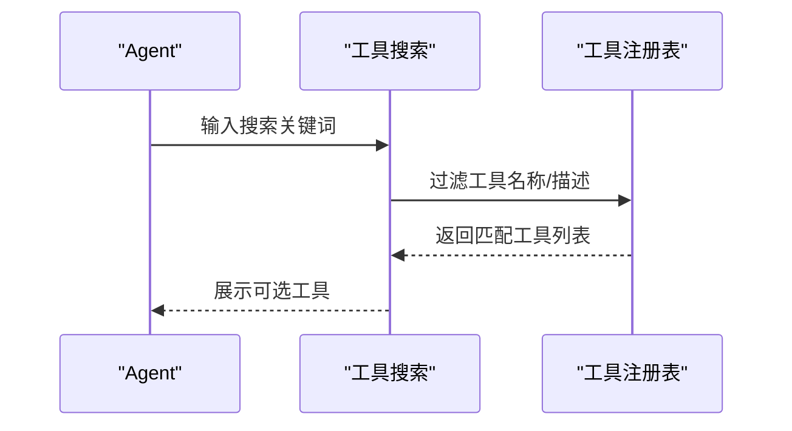

**图表来源**
- [tool_search.py](file://backend/packages/harness/deerflow/tools/builtins/tool_search.py)
- [tool_search_config.py](file://backend/packages/harness/deerflow/config/tool_search_config.py)

**章节来源**
- [tool_search.py](file://backend/packages/harness/deerflow/tools/builtins/tool_search.py)
- [tool_search_config.py](file://backend/packages/harness/deerflow/config/tool_search_config.py)

### 内置工具：代理设置与更新
- 设置代理：初始化Agent配置（模型、提示词、工具集合）
- 更新代理：动态调整Agent参数与工具授权

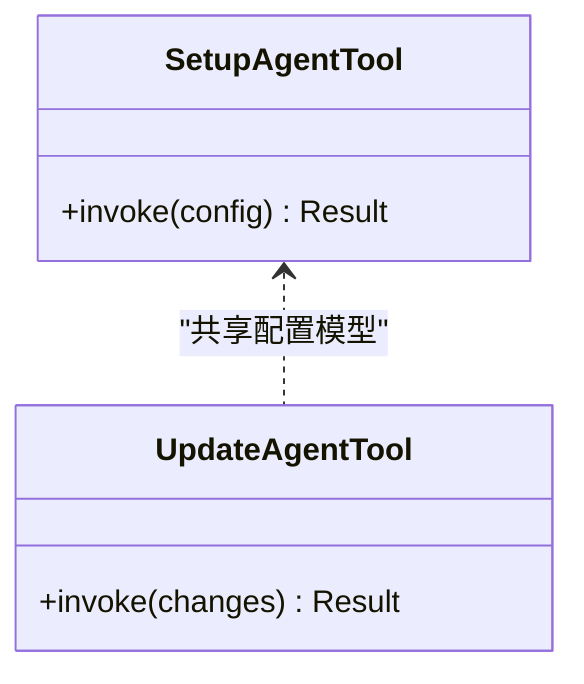

**图表来源**
- [setup_agent_tool.py](file://backend/packages/harness/deerflow/tools/builtins/setup_agent_tool.py)
- [update_agent_tool.py](file://backend/packages/harness/deerflow/tools/builtins/update_agent_tool.py)

**章节来源**
- [setup_agent_tool.py](file://backend/packages/harness/deerflow/tools/builtins/setup_agent_tool.py)
- [update_agent_tool.py](file://backend/packages/harness/deerflow/tools/builtins/update_agent_tool.py)

### MCP工具：加载、拦截与缓存
- 加载流程
  - 启动时连接已启用的MCP服务器，拉取工具Schema并缓存
  - 首次调用时进行懒加载，避免冷启动延迟
  - 监控extensions_config.json修改时间，变更时失效缓存并重新加载
- 拦截器
  - 支持从配置中声明自定义拦截器，按顺序应用到工具调用链
- 同步包装
  - 将异步工具包装为同步函数，适配客户端同步调用场景

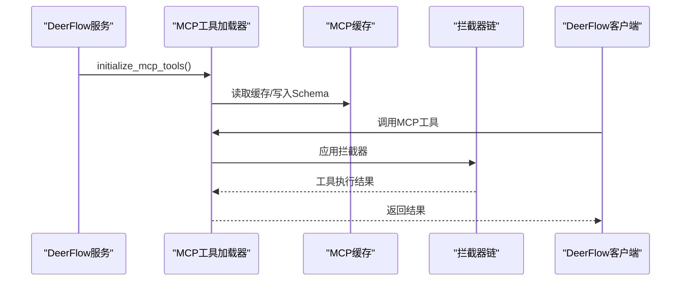

**图表来源**
- [mcp/tools.py](file://backend/packages/harness/deerflow/mcp/tools.py)
- [mcp/cache.py](file://backend/packages/harness/deerflow/mcp/cache.py)
- [mcp/client.py](file://backend/packages/harness/deerflow/mcp/client.py)

**章节来源**
- [mcp/tools.py](file://backend/packages/harness/deerflow/mcp/tools.py)
- [mcp/cache.py](file://backend/packages/harness/deerflow/mcp/cache.py)
- [mcp.mdx](file://frontend/src/content/en/harness/mcp.mdx)

### 社区工具与沙箱工具
- 社区工具
  - 示例：ddg_search、exa、firecrawl、image_search、infoquest、jina_ai、serper、tavily
  - 特点：按需启用，遵循统一接口，便于扩展
- 沙箱工具
  - 在受限环境中执行命令与文件操作，防止越权访问
  - 提供安全中间件与文件操作锁，保障系统稳定

**章节来源**
- [community/*/tools.py](file://backend/packages/harness/deerflow/community/ddg_search/tools.py)
- [sandbox/tools.py](file://backend/packages/harness/deerflow/sandbox/tools.py)

### 权限控制与安全考虑
- 权限模型
  - 技能权限：基于角色/资源的细粒度授权
  - 安全扫描：对工具与脚本进行静态扫描，识别高风险模式
  - 参数验证：对工具输入进行Schema校验与白名单过滤
- 沙箱与输出预算
  - 沙箱：隔离执行环境，限制文件系统与网络访问
  - 输出预算：对外部输出进行路径外化与大小限制，防止路径穿越与滥用

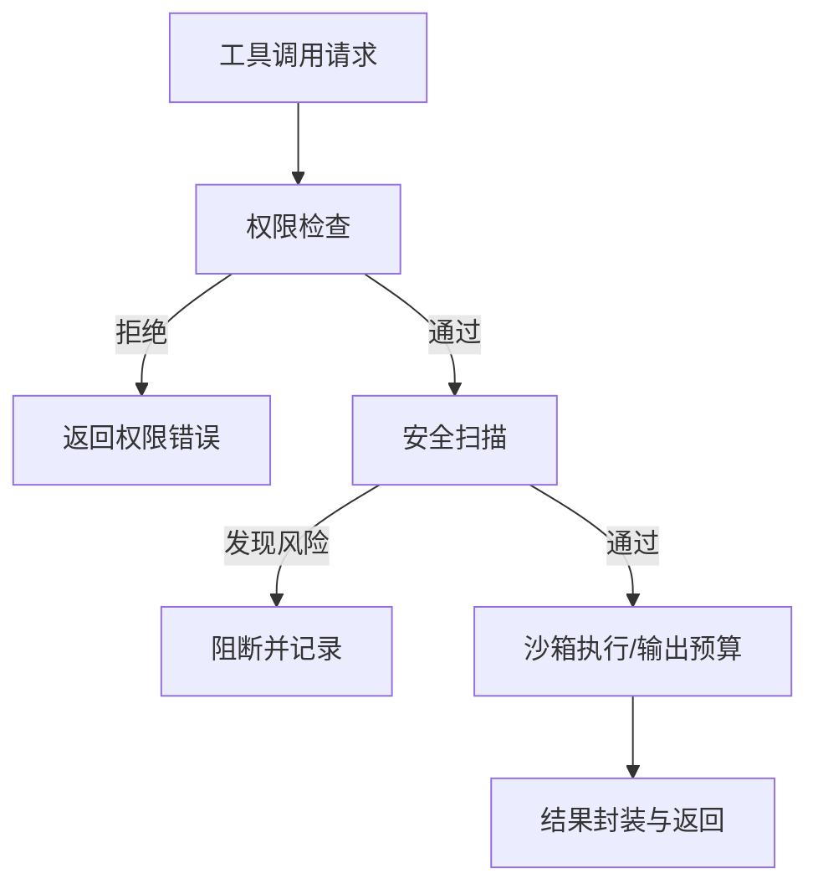

**图表来源**
- [permissions.py](file://backend/packages/harness/deerflow/skills/permissions.py)
- [security_scanner.py](file://backend/packages/harness/deerflow/skills/security_scanner.py)
- [validation.py](file://backend/packages/harness/deerflow/skills/validation.py)
- [sandbox/tools.py](file://backend/packages/harness/deerflow/sandbox/tools.py)
- [tool_output_config.py](file://backend/packages/harness/deerflow/config/tool_output_config.py)

**章节来源**
- [permissions.py](file://backend/packages/harness/deerflow/skills/permissions.py)
- [security_scanner.py](file://backend/packages/harness/deerflow/skills/security_scanner.py)
- [validation.py](file://backend/packages/harness/deerflow/skills/validation.py)
- [sandbox/tools.py](file://backend/packages/harness/deerflow/sandbox/tools.py)
- [tool_output_config.py](file://backend/packages/harness/deerflow/config/tool_output_config.py)

### 扩展自定义工具
- 自定义内置工具
  - 定义工具类/函数，遵循统一接口
  - 在builtins/__init__.py中注册，确保名称唯一
- 自定义MCP工具
  - 实现MCP服务器，暴露工具Schema
  - 在extensions_config.json中启用对应服务器
  - 可选：添加拦截器以增强日志、鉴权或限流
- 自定义社区工具
  - 以独立包形式提供，遵循工具接口规范
  - 通过配置启用，参与统一注册与去重

**章节来源**
- [builtins/__init__.py](file://backend/packages/harness/deerflow/tools/builtins/__init__.py)
- [mcp/tools.py](file://backend/packages/harness/deerflow/mcp/tools.py)

## 依赖关系分析
- 组件耦合
  - 工具聚合器依赖内置、社区与MCP三类工具源
  - 安全模块与沙箱模块被所有工具调用链路依赖
  - 配置模块为工具行为提供运行时开关
- 外部依赖
  - MCP客户端与会话池负责与外部服务器通信
  - 网关路由提供HTTP入口，承载工具调用与配置变更

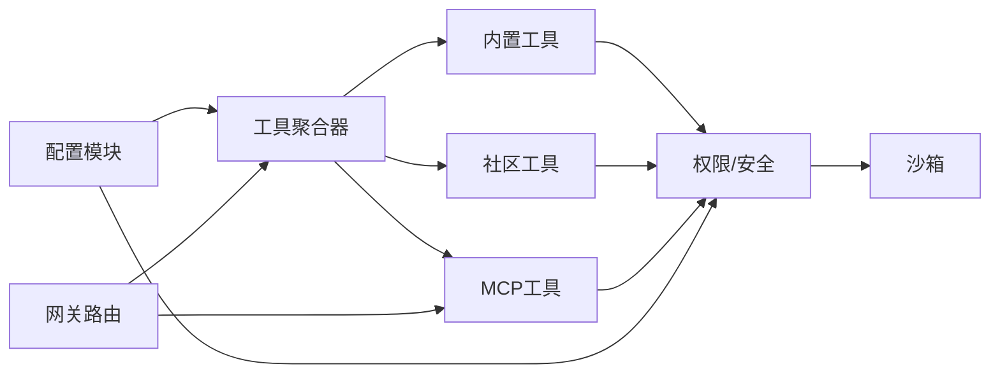

**图表来源**
- [__init__.py](file://backend/packages/harness/deerflow/tools/__init__.py)
- [permissions.py](file://backend/packages/harness/deerflow/skills/permissions.py)
- [security_scanner.py](file://backend/packages/harness/deerflow/skills/security_scanner.py)
- [sandbox/tools.py](file://backend/packages/harness/deerflow/sandbox/tools.py)
- [routers/mcp.py](file://backend/app/gateway/routers/mcp.py)

**章节来源**
- [__init__.py](file://backend/packages/harness/deerflow/tools/__init__.py)
- [routers/mcp.py](file://backend/app/gateway/routers/mcp.py)

## 性能考量
- 工具加载
  - MCP工具缓存与懒加载减少启动与首次调用延迟
  - 工具去重避免重复Schema解析与注册
- 工具搜索
  - 搜索模式降低上下文长度，提升选择准确性与响应速度
- 输出预算
  - 限制输出大小与路径外化，避免磁盘膨胀与路径穿越风险

[本节为通用指导，无需特定文件引用]

## 故障排查指南
- 工具重复注册
  - 现象：工具名冲突导致异常
  - 处理：检查内置/社区/MCP工具命名，确保唯一性
  - 参考测试：[test_tool_deduplication.py](file://backend/tests/test_tool_deduplication.py)
- 输出路径问题
  - 现象：输出外化失败或路径穿越
  - 处理：确认输出目录可写，避免绝对路径与上层目录
  - 参考测试：[test_tool_output_budget_middleware.py](file://backend/tests/test_tool_output_budget_middleware.py)
- MCP工具加载失败
  - 现象：MCP工具不可用或报错
  - 处理：检查MCP服务器可达性、认证配置与拦截器构建
  - 参考实现：[mcp/tools.py](file://backend/packages/harness/deerflow/mcp/tools.py)
- 权限与安全阻断
  - 现象：工具被拒绝执行
  - 处理：核对技能权限、安全扫描规则与参数验证
  - 参考模块：[permissions.py](file://backend/packages/harness/deerflow/skills/permissions.py)、[security_scanner.py](file://backend/packages/harness/deerflow/skills/security_scanner.py)、[validation.py](file://backend/packages/harness/deerflow/skills/validation.py)

**章节来源**
- [test_tool_deduplication.py](file://backend/tests/test_tool_deduplication.py)
- [test_tool_output_budget_middleware.py](file://backend/tests/test_tool_output_budget_middleware.py)
- [mcp/tools.py](file://backend/packages/harness/deerflow/mcp/tools.py)
- [permissions.py](file://backend/packages/harness/deerflow/skills/permissions.py)
- [security_scanner.py](file://backend/packages/harness/deerflow/skills/security_scanner.py)
- [validation.py](file://backend/packages/harness/deerflow/skills/validation.py)

## 结论
DeerFlow工具系统通过统一接口与分层实现，实现了内置、社区与MCP工具的无缝集成。配合完善的权限控制、安全扫描与沙箱机制，既保证了灵活性与可扩展性，也确保了运行时的安全与稳定。通过配置与路由接口，用户可以按需启用工具搜索、调整输出预算与MCP拦截器，从而在不同场景下获得最佳体验。

[本节为总结性内容，无需特定文件引用]

## 附录
- 配置参考
  - 工具配置：[tool_config.py](file://backend/packages/harness/deerflow/config/tool_config.py)
  - 输出预算：[tool_output_config.py](file://backend/packages/harness/deerflow/config/tool_output_config.py)
  - 工具搜索：[tool_search_config.py](file://backend/packages/harness/deerflow/config/tool_search_config.py)
- 路由参考
  - MCP路由：[routers/mcp.py](file://backend/app/gateway/routers/mcp.py)
  - 技能路由：[routers/skills.py](file://backend/app/gateway/routers/skills.py)
  - 工件路由：[routers/artifacts.py](file://backend/app/gateway/routers/artifacts.py)
- 前端文档
  - MCP工具加载与搜索：[mcp.mdx](file://frontend/src/content/en/harness/mcp.mdx)

**章节来源**
- [tool_config.py](file://backend/packages/harness/deerflow/config/tool_config.py)
- [tool_output_config.py](file://backend/packages/harness/deerflow/config/tool_output_config.py)
- [tool_search_config.py](file://backend/packages/harness/deerflow/config/tool_search_config.py)
- [routers/mcp.py](file://backend/app/gateway/routers/mcp.py)
- [routers/skills.py](file://backend/app/gateway/routers/skills.py)
- [routers/artifacts.py](file://backend/app/gateway/routers/artifacts.py)
- [mcp.mdx](file://frontend/src/content/en/harness/mcp.mdx)