# 技能系统

<cite>
**本文引用的文件**
- [skills/public/bootstrap/SKILL.md](file://skills/public/bootstrap/SKILL.md)
- [skills/public/data-analysis/SKILL.md](file://skills/public/data-analysis/SKILL.md)
- [skills/public/github-deep-research/SKILL.md](file://skills/public/github-deep-research/SKILL.md)
- [skills/public/image-generation/SKILL.md](file://skills/public/image-generation/SKILL.md)
- [skills/public/music-generation/SKILL.md](file://skills/public/music-generation/SKILL.md)
- [skills/public/podcast-generation/SKILL.md](file://skills/public/podcast-generation/SKILL.md)
- [skills/public/video-generation/SKILL.md](file://skills/public/video-generation/SKILL.md)
- [skills/public/skill-creator/SKILL.md](file://skills/public/skill-creator/SKILL.md)
- [skills/public/systematic-literature-review/SKILL.md](file://skills/public/systematic-literature-review/SKILL.md)
- [skills/public/web-design-guidelines/SKILL.md](file://skills/public/web-design-guidelines/SKILL.md)
- [skills/public/academic-paper-review/SKILL.md](file://skills/public/academic-paper-review/SKILL.md)
- [skills/public/chart-visualization/SKILL.md](file://skills/public/chart-visualization/SKILL.md)
- [skills/public/deep-research/SKILL.md](file://skills/public/deep-research/SKILL.md)
- [skills/public/find-skills/SKILL.md](file://skills/public/find-skills/SKILL.md)
- [skills/public/consulting-analysis/SKILL.md](file://skills/public/consulting-analysis/SKILL.md)
- [skills/public/code-documentation/SKILL.md](file://skills/public/code-documentation/SKILL.md)
- [skills/public/claude-to-deerflow/SKILL.md](file://skills/public/claude-to-deerflow/SKILL.md)
- [skills/public/frontend-design/SKILL.md](file://skills/public/frontend-design/SKILL.md)
- [skills/public/newsletter-generation/SKILL.md](file://skills/public/newsletter-generation/SKILL.md)
- [skills/public/ppt-generation/SKILL.md](file://skills/public/ppt-generation/SKILL.md)
- [skills/public/surprise-me/SKILL.md](file://skills/public/surprise-me/SKILL.md)
- [skills/public/vercel-deploy-claimable/SKILL.md](file://skills/public/vercel-deploy-claimable/SKILL.md)
- [skills/public/vercel-deploy-claimable/scripts/deploy.sh](file://skills/public/vercel-deploy-claimable/scripts/deploy.sh)
- [skills/public/skill-creator/scripts/create_skill.sh](file://skills/public/skill-creator/scripts/create_skill.sh)
- [skills/public/skill-creator/scripts/generate_references.sh](file://skills/public/skill-creator/scripts/generate_references.sh)
- [skills/public/skill-creator/scripts/generate_templates.sh](file://skills/public/skill-creator/scripts/generate_templates.sh)
- [skills/public/skill-creator/scripts/generate_scripts.sh](file://skills/public/skill-creator/scripts/generate_scripts.sh)
- [skills/public/skill-creator/scripts/generate_license.sh](file://skills/public/skill-creator/scripts/generate_license.sh)
- [skills/public/skill-creator/scripts/generate_assets.sh](file://skills/public/skill-creator/scripts/generate_assets.sh)
- [skills/public/skill-creator/scripts/generate_evals.sh](file://skills/public/skill-creator/scripts/generate_evals.sh)
- [skills/public/skill-creator/scripts/generate_agents.sh](file://skills/public/skill-creator/scripts/generate_agents.sh)
- [skills/public/skill-creator/scripts/generate_eval_viewer.sh](file://skills/public/skill-creator/scripts/generate_eval_viewer.sh)
- [skills/public/skill-creator/scripts/generate_ui.sh](file://skills/public/skill-creator/scripts/generate_ui.sh)
- [skills/public/skill-creator/scripts/generate_docs.sh](file://skills/public/skill-creator/scripts/generate_docs.sh)
- [skills/public/skill-creator/scripts/generate_readme.sh](file://skills/public/skill-creator/scripts/generate_readme.sh)
- [skills/public/skill-creator/scripts/generate_config.sh](file://skills/public/skill-creator/scripts/generate_config.sh)
- [skills/public/skill-creator/scripts/generate_requirements.sh](file://skills/public/skill-creator/scripts/generate_requirements.sh)
- [skills/public/skill-creator/scripts/generate_pyproject.sh](file://skills/public/skill-creator/scripts/generate_pyproject.sh)
- [skills/public/skill-creator/scripts/generate_tests.sh](file://skills/public/skill-creator/scripts/generate_tests.sh)
- [skills/public/skill-creator/scripts/generate_workflow.sh](file://skills/public/skill-creator/scripts/generate_workflow.sh)
- [skills/public/skill-creator/scripts/generate_github_actions.sh](file://skills/public/skill-creator/scripts/generate_github_actions.sh)
- [skills/public/skill-creator/scripts/generate_gitignore.sh](file://skills/public/skill-creator/scripts/generate_gitignore.sh)
- [skills/public/skill-creator/scripts/generate_pre_commit.sh](file://skills/public/skill-creator/scripts/generate_pre_commit.sh)
- [skills/public/skill-creator/scripts/generate_dockerfile.sh](file://skills/public/skill-creator/scripts/generate_dockerfile.sh)
- [skills/public/skill-creator/scripts/generate_makefile.sh](file://skills/public/skill-creator/scripts/generate_makefile.sh)
- [skills/public/skill-creator/scripts/generate_readme_zh.sh](file://skills/public/skill-creator/scripts/generate_readme_zh.sh)
- [skills/public/skill-creator/scripts/generate_readme_fr.sh](file://skills/public/skill-creator/scripts/generate_readme_fr.sh)
- [skills/public/skill-creator/scripts/generate_readme_ja.sh](file://skills/public/skill-creator/scripts/generate_readme_ja.sh)
- [skills/public/skill-creator/scripts/generate_readme_ru.sh](file://skills/public/skill-creator/scripts/generate_readme_ru.sh)
- [skills/public/skill-creator/scripts/generate_readme_en.sh](file://skills/public/skill-creator/scripts/generate_readme_en.sh)
- [skills/public/skill-creator/scripts/generate_all.sh](file://skills/public/skill-creator/scripts/generate_all.sh)
- [skills/public/skill-creator/references/README.md](file://skills/public/skill-creator/references/README.md)
- [skills/public/skill-creator/templates/report.template.md](file://skills/public/skill-creator/templates/report.template.md)
- [skills/public/skill-creator/assets/icon.png](file://skills/public/skill-creator/assets/icon.png)
- [skills/public/skill-creator/LICENSE.txt](file://skills/public/skill-creator/LICENSE.txt)
- [skills/custom/.gitkeep](file://skills/custom/.gitkeep)
- [.agent/skills/smoke-test/SKILL.md](file://.agent/skills/smoke-test/SKILL.md)
- [.agent/skills/smoke-test/scripts/check_docker.sh](file://.agent/skills/smoke-test/scripts/check_docker.sh)
- [.agent/skills/smoke-test/scripts/check_local_env.sh](file://.agent/skills/smoke-test/scripts/check_local_env.sh)
- [.agent/skills/smoke-test/scripts/deploy_docker.sh](file://.agent/skills/smoke-test/scripts/deploy_docker.sh)
- [.agent/skills/smoke-test/scripts/deploy_local.sh](file://.agent/skills/smoke-test/scripts/deploy_local.sh)
- [.agent/skills/smoke-test/scripts/frontend_check.sh](file://.agent/skills/smoke-test/scripts/frontend_check.sh)
- [.agent/skills/smoke-test/scripts/health_check.sh](file://.agent/skills/smoke-test/scripts/health_check.sh)
- [.agent/skills/smoke-test/scripts/pull_code.sh](file://.agent/skills/smoke-test/scripts/pull_code.sh)
- [.agent/skills/smoke-test/templates/report.docker.template.md](file://.agent/skills/smoke-test/templates/report.docker.template.md)
- [.agent/skills/smoke-test/templates/report.local.template.md](file://.agent/skills/smoke-test/templates/report.local.template.md)
- [backend/app/gateway/routers/skills.py](file://backend/app/gateway/routers/skills.py)
- [backend/packages/harness/deerflow/skills/__init__.py](file://backend/packages/harness/deerflow/skills/__init__.py)
- [backend/packages/harness/deerflow/skills/parser.py](file://backend/packages/harness/deerflow/skills/parser.py)
- [backend/packages/harness/deerflow/skills/validation.py](file://backend/packages/harness/deerflow/skills/validation.py)
- [backend/packages/harness/deerflow/skills/security_scanner.py](file://backend/packages/harness/deerflow/skills/security_scanner.py)
- [backend/packages/harness/deerflow/skills/permissions.py](file://backend/packages/harness/deerflow/skills/permissions.py)
- [backend/packages/harness/deerflow/skills/installer.py](file://backend/packages/harness/deerflow/skills/installer.py)
- [backend/packages/harness/deerflow/skills/types.py](file://backend/packages/harness/deerflow/skills/types.py)
- [backend/packages/harness/deerflow/skills/storage/__init__.py](file://backend/packages/harness/deerflow/skills/storage/__init__.py)
- [backend/packages/harness/deerflow/skills/storage/local.py](file://backend/packages/harness/deerflow/skills/storage/local.py)
- [backend/packages/harness/deerflow/skills/storage/base.py](file://backend/packages/harness/deerflow/skills/storage/base.py)
- [backend/packages/harness/deerflow/skills/tool_policy.py](file://backend/packages/harness/deerflow/skills/tool_policy.py)
- [backend/packages/harness/deerflow/skills/slash.py](file://backend/packages/harness/deerflow/skills/slash.py)
- [backend/packages/harness/deerflow/agents/middlewares/skill_activation_middleware.py](file://backend/packages/harness/deerflow/agents/middlewares/skill_activation_middleware.py)
- [backend/packages/harness/deerflow/agents/lead_agent/prompt.py](file://backend/packages/harness/deerflow/agents/lead_agent/prompt.py)
- [backend/packages/harness/deerflow/sandbox/tools.py](file://backend/packages/harness/deerflow/sandbox/tools.py)
- [backend/packages/harness/deerflow/sandbox/exceptions.py](file://backend/packages/harness/deerflow/sandbox/exceptions.py)
- [backend/packages/harness/deerflow/config/skills_config.py](file://backend/packages/harness/deerflow/config/skills_config.py)
- [backend/docs/AUTH_DESIGN.md](file://backend/docs/AUTH_DESIGN.md)
- [backend/docs/GUARDRAILS.md](file://backend/docs/GUARDRAILS.md)
- [backend/docs/SANDBOX_MEMORY_PROFILING.md](file://backend/docs/SANDBOX_MEMORY_PROFILING.md)
- [backend/tests/test_skills_parser.py](file://backend/tests/test_skills_parser.py)
- [backend/tests/test_skills_validation.py](file://backend/tests/test_skills_validation.py)
- [backend/tests/test_skills_install.py](file://backend/tests/test_skills_install.py)
- [backend/tests/test_skills_loader.py](file://backend/tests/test_skills_loader.py)
- [backend/tests/test_skills_bundled.py](file://backend/tests/test_skills_bundled.py)
- [backend/tests/test_skills_custom_router.py](file://backend/tests/test_skills_custom_router.py)
- [backend/tests/test_skills_installer.py](file://backend/tests/test_skills_installer.py)
- [backend/tests/test_skills_load.py](file://backend/tests/test_skills_load.py)
- [backend/tests/test_skills_permissions.py](file://backend/tests/test_skills_permissions.py)
- [backend/tests/test_slash_skills.py](file://backend/tests/test_slash_skills.py)
- [backend/tests/test_security_scanner.py](file://backend/tests/test_security_scanner.py)
- [backend/tests/test_skill_permissions.py](file://backend/tests/test_skill_permissions.py)
- [backend/tests/test_skill_manage_tool.py](file://backend/tests/test_skill_manage_tool.py)
- [backend/tests/test_local_sandbox_provider_mounts.py](file://backend/tests/test_local_sandbox_provider_mounts.py)
- [backend/tests/test_local_sandbox_encoding.py](file://backend/tests/test_local_sandbox_encoding.py)
- [backend/tests/test_local_sandbox_readiness.py](file://backend/tests/test_local_sandbox_readiness.py)
- [backend/tests/test_local_sandbox.py](file://backend/tests/test_local_sandbox.py)
- [backend/tests/test_aio_sandbox.py](file://backend/tests/test_aio_sandbox.py)
- [backend/tests/test_aio_sandbox_provider.py](file://backend/tests/test_aio_sandbox_provider.py)
- [backend/README.md](file://backend/README.md)
- [backend/CLAUDE.md](file://backend/CLAUDE.md)
- [README.md](file://README.md)
- [Install.md](file://Install.md)
- [config.example.yaml](file://config.example.yaml)
- [extensions_config.example.json](file://extensions_config.example.json)
</cite>

## 目录
1. [简介](#简介)
2. [项目结构](#项目结构)
3. [核心组件](#核心组件)
4. [架构总览](#架构总览)
5. [详细组件分析](#详细组件分析)
6. [依赖关系分析](#依赖关系分析)
7. [性能考虑](#性能考虑)
8. [故障排查指南](#故障排查指南)
9. [结论](#结论)
10. [附录](#附录)

## 简介
本技术文档面向DeerFlow技能系统，系统性阐述技能的存储机制、安装流程与运行时加载方式；详解技能解析过程（SKILL.md文件格式、元数据提取与权限声明）；提供开发规范、安全扫描与验证流程；解释权限控制、沙箱隔离与资源限制，并给出创建与发布自定义技能的完整实践路径。本文所有技术细节均基于仓库中的实际实现与测试用例进行归纳总结。

## 项目结构
技能系统由“前端展示与交互”、“后端网关与路由”、“技能解析与存储”、“权限与安全扫描”、“沙箱执行环境”等模块协同组成。公共技能与自定义技能分别存放于skills/public与skills/custom目录，每个技能通过根目录下的SKILL.md描述其元信息与使用方式。

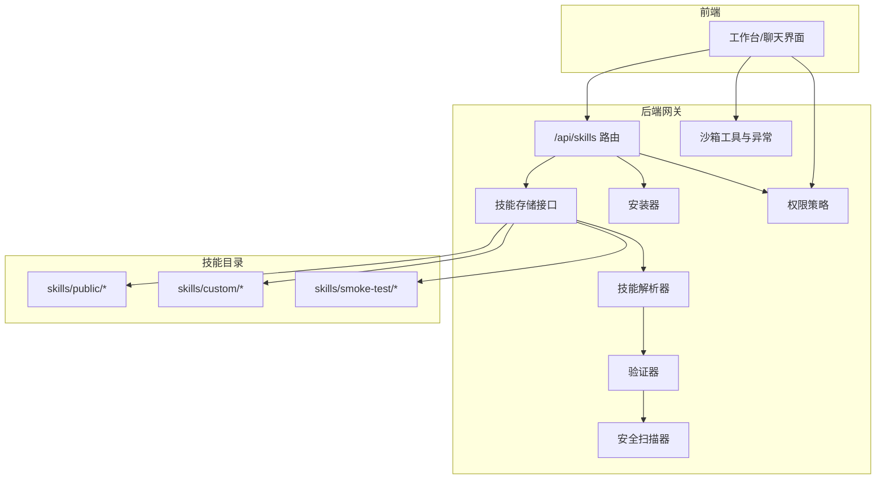

图示来源
- [backend/app/gateway/routers/skills.py](file://backend/app/gateway/routers/skills.py)
- [backend/packages/harness/deerflow/skills/storage/__init__.py](file://backend/packages/harness/deerflow/skills/storage/__init__.py)
- [backend/packages/harness/deerflow/skills/parser.py](file://backend/packages/harness/deerflow/skills/parser.py)
- [backend/packages/harness/deerflow/skills/validation.py](file://backend/packages/harness/deerflow/skills/validation.py)
- [backend/packages/harness/deerflow/skills/security_scanner.py](file://backend/packages/harness/deerflow/skills/security_scanner.py)
- [backend/packages/harness/deerflow/skills/installer.py](file://backend/packages/harness/deerflow/skills/installer.py)
- [backend/packages/harness/deerflow/skills/permissions.py](file://backend/packages/harness/deerflow/skills/permissions.py)
- [backend/packages/harness/deerflow/sandbox/tools.py](file://backend/packages/harness/deerflow/sandbox/tools.py)

章节来源
- [backend/README.md](file://backend/README.md)
- [backend/CLAUDE.md](file://backend/CLAUDE.md)
- [README.md](file://README.md)

## 核心组件
- 技能存储与发现：递归扫描public与custom目录，识别SKILL.md并构建技能索引。
- 技能解析器：从SKILL.md中提取元数据（名称、版本、作者、兼容性、类别、描述、脚本列表、模板列表、参考材料、许可证等），并校验格式与字段完整性。
- 验证器：对解析结果进行规则校验（如必填字段、版本号格式、脚本/模板/参考文件存在性、许可证合法性等）。
- 安全扫描器：对脚本与模板内容进行静态安全扫描，识别潜在危险模式（如命令注入、文件写入、网络访问等）。
- 安装器：支持从.zip归档安装技能到custom目录，处理重名冲突与目标路径安全。
- 权限策略：结合扩展配置与自定义代理白名单，控制技能启用状态与可见范围。
- 沙箱工具：在本地/容器沙箱中对路径访问进行严格限制，仅允许受控虚拟路径与只读技能路径，防止越权写入与路径穿越。
- 运行时激活：支持“/技能名”前缀触发当前轮次的技能上下文加载，遵循禁用技能、白名单与保留命令限制。

章节来源
- [backend/CLAUDE.md](file://backend/CLAUDE.md)
- [backend/app/gateway/routers/skills.py](file://backend/app/gateway/routers/skills.py)
- [backend/packages/harness/deerflow/skills/parser.py](file://backend/packages/harness/deerflow/skills/parser.py)
- [backend/packages/harness/deerflow/skills/validation.py](file://backend/packages/harness/deerflow/skills/validation.py)
- [backend/packages/harness/deerflow/skills/security_scanner.py](file://backend/packages/harness/deerflow/skills/security_scanner.py)
- [backend/packages/harness/deerflow/skills/installer.py](file://backend/packages/harness/deerflow/skills/installer.py)
- [backend/packages/harness/deerflow/skills/permissions.py](file://backend/packages/harness/deerflow/skills/permissions.py)
- [backend/packages/harness/deerflow/sandbox/tools.py](file://backend/packages/harness/deerflow/sandbox/tools.py)
- [backend/packages/harness/deerflow/agents/middlewares/skill_activation_middleware.py](file://backend/packages/harness/deerflow/agents/middlewares/skill_activation_middleware.py)

## 架构总览
下图展示了技能从安装到运行时加载的关键流程与组件交互：

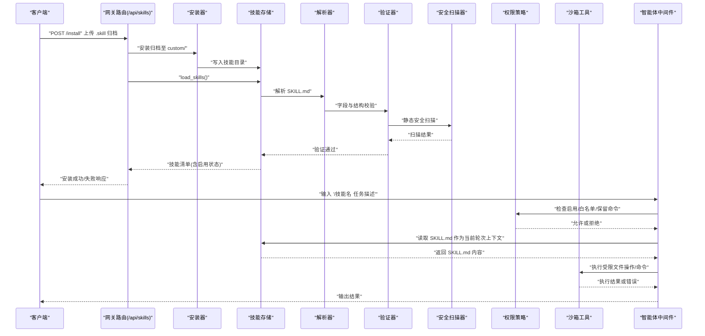

图示来源
- [backend/app/gateway/routers/skills.py](file://backend/app/gateway/routers/skills.py)
- [backend/packages/harness/deerflow/skills/installer.py](file://backend/packages/harness/deerflow/skills/installer.py)
- [backend/packages/harness/deerflow/skills/storage/__init__.py](file://backend/packages/harness/deerflow/skills/storage/__init__.py)
- [backend/packages/harness/deerflow/skills/parser.py](file://backend/packages/harness/deerflow/skills/parser.py)
- [backend/packages/harness/deerflow/skills/validation.py](file://backend/packages/harness/deerflow/skills/validation.py)
- [backend/packages/harness/deerflow/skills/security_scanner.py](file://backend/packages/harness/deerflow/skills/security_scanner.py)
- [backend/packages/harness/deerflow/skills/permissions.py](file://backend/packages/harness/deerflow/skills/permissions.py)
- [backend/packages/harness/deerflow/sandbox/tools.py](file://backend/packages/harness/deerflow/sandbox/tools.py)
- [backend/packages/harness/deerflow/agents/middlewares/skill_activation_middleware.py](file://backend/packages/harness/deerflow/agents/middlewares/skill_activation_middleware.py)

## 详细组件分析

### 存储与发现（技能目录与加载）
- 发现范围：public与custom两个根目录，递归扫描每个子目录下的SKILL.md。
- 加载策略：按需加载，支持启用状态查询与全量枚举；运行时可按需读取特定技能的SKILL.md作为当前轮次上下文。
- 路由接口：提供列出、详情、更新启用状态、安装归档等REST接口。

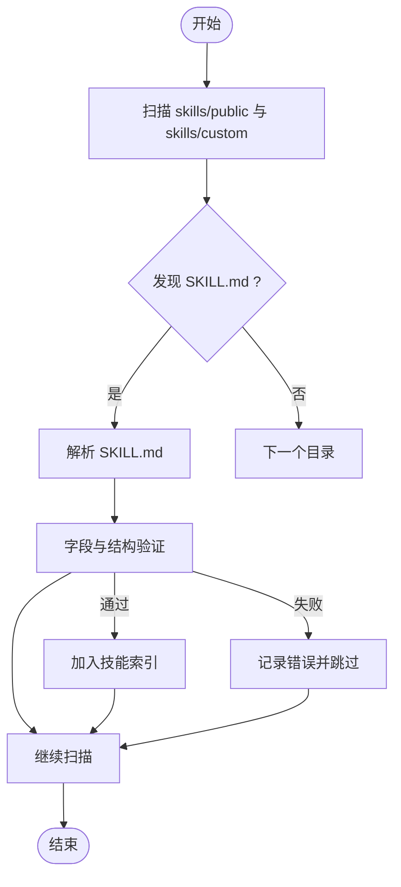

图示来源
- [backend/packages/harness/deerflow/skills/storage/__init__.py](file://backend/packages/harness/deerflow/skills/storage/__init__.py)
- [backend/app/gateway/routers/skills.py](file://backend/app/gateway/routers/skills.py)

章节来源
- [backend/CLAUDE.md](file://backend/CLAUDE.md)
- [backend/app/gateway/routers/skills.py](file://backend/app/gateway/routers/skills.py)
- [backend/tests/test_skills_load.py](file://backend/tests/test_skills_load.py)
- [backend/tests/test_skills_bundled.py](file://backend/tests/test_skills_bundled.py)
- [backend/tests/test_skills_custom_router.py](file://backend/tests/test_skills_custom_router.py)

### 解析器（SKILL.md格式、元数据提取与权限声明）
- 文件位置：每个技能根目录必须包含SKILL.md。
- 元数据字段：名称、版本、作者、兼容性、类别、描述、脚本列表、模板列表、参考材料、许可证等。
- 权限声明：通过frontmatter声明脚本/模板/参考文件的访问范围与执行权限。
- 解析流程：读取文件→提取frontmatter→解析脚本/模板/参考项→生成标准化技能对象。

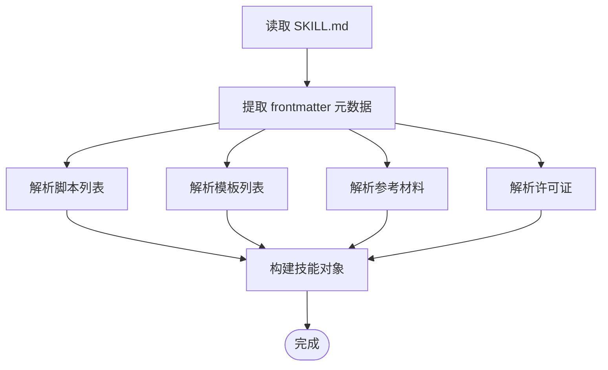

图示来源
- [backend/packages/harness/deerflow/skills/parser.py](file://backend/packages/harness/deerflow/skills/parser.py)
- [backend/tests/test_skills_parser.py](file://backend/tests/test_skills_parser.py)

章节来源
- [backend/packages/harness/deerflow/skills/parser.py](file://backend/packages/harness/deerflow/skills/parser.py)
- [backend/tests/test_skills_parser.py](file://backend/tests/test_skills_parser.py)

### 验证器（字段完整性与一致性）
- 必填字段校验：名称、版本、类别、描述等。
- 结构一致性：脚本/模板/参考文件路径存在性与可访问性。
- 许可证合法性：支持的许可证类型与合规性检查。
- 版本与兼容性：版本号格式与兼容性范围校验。

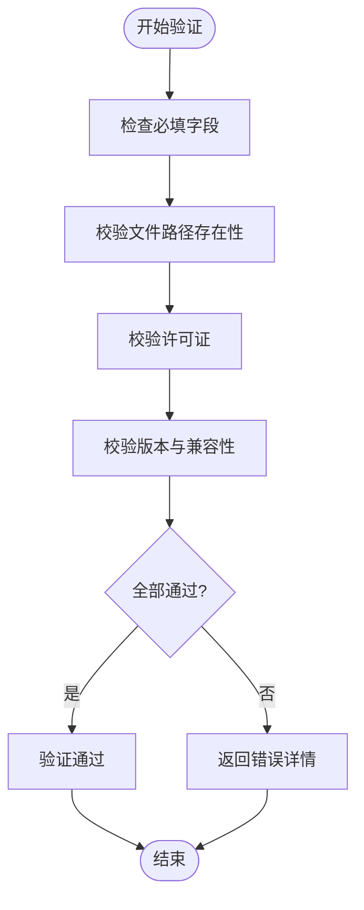

图示来源
- [backend/packages/harness/deerflow/skills/validation.py](file://backend/packages/harness/deerflow/skills/validation.py)
- [backend/tests/test_skills_validation.py](file://backend/tests/test_skills_validation.py)

章节来源
- [backend/packages/harness/deerflow/skills/validation.py](file://backend/packages/harness/deerflow/skills/validation.py)
- [backend/tests/test_skills_validation.py](file://backend/tests/test_skills_validation.py)

### 安全扫描器（静态扫描与风险识别）
- 扫描范围：脚本与模板内容。
- 危险模式识别：命令注入、文件写入、网络访问、敏感路径引用等。
- 报告与阻断：根据扫描结果决定是否允许安装或执行。

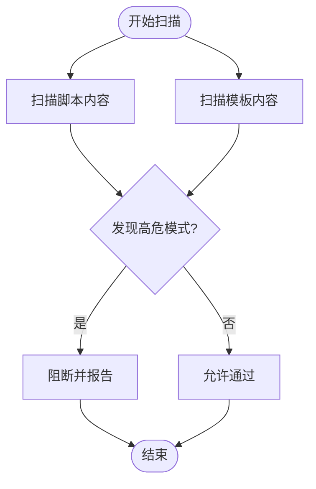

图示来源
- [backend/packages/harness/deerflow/skills/security_scanner.py](file://backend/packages/harness/deerflow/skills/security_scanner.py)
- [backend/tests/test_security_scanner.py](file://backend/tests/test_security_scanner.py)

章节来源
- [backend/packages/harness/deerflow/skills/security_scanner.py](file://backend/packages/harness/deerflow/skills/security_scanner.py)
- [backend/tests/test_security_scanner.py](file://backend/tests/test_security_scanner.py)

### 安装器（归档安装与路径安全）
- 支持从.zip归档安装技能到custom目录。
- 处理重名冲突与目标路径安全（禁止路径穿越、确保写入在允许范围内）。
- 安装完成后触发重新加载与验证。

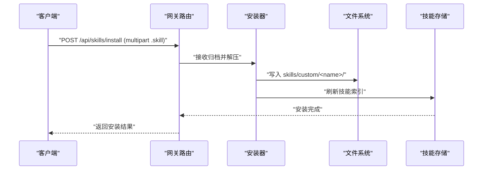

图示来源
- [backend/app/gateway/routers/skills.py](file://backend/app/gateway/routers/skills.py)
- [backend/packages/harness/deerflow/skills/installer.py](file://backend/packages/harness/deerflow/skills/installer.py)
- [backend/tests/test_skills_installer.py](file://backend/tests/test_skills_installer.py)

章节来源
- [backend/app/gateway/routers/skills.py](file://backend/app/gateway/routers/skills.py)
- [backend/packages/harness/deerflow/skills/installer.py](file://backend/packages/harness/deerflow/skills/installer.py)
- [backend/tests/test_skills_install.py](file://backend/tests/test_skills_install.py)
- [backend/tests/test_skills_installer.py](file://backend/tests/test_skills_installer.py)

### 权限控制系统（启用状态、白名单与保留命令）
- 启用状态：通过扩展配置控制技能启用/禁用。
- 自定义代理白名单：限制特定代理可见与使用的技能集合。
- 保留命令：禁用与通道命令冲突的技能名（如/new、/help等）。
- 运行时激活：/技能名前缀仅在当前轮次生效，不影响基础提示词。

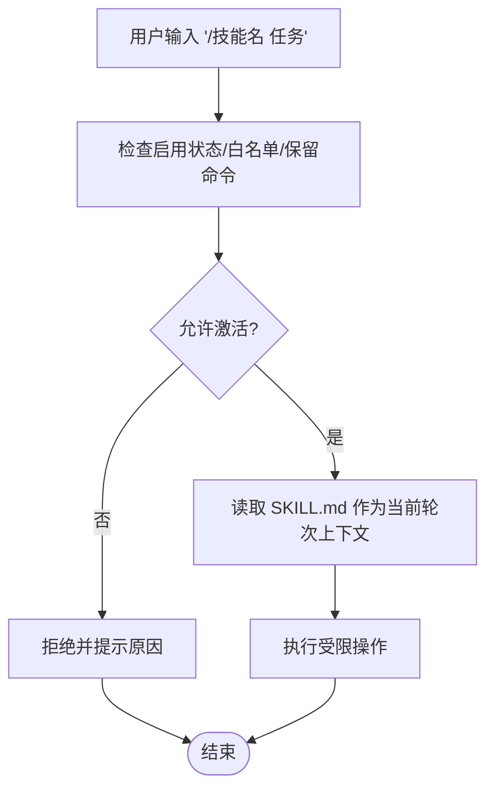

图示来源
- [backend/packages/harness/deerflow/skills/permissions.py](file://backend/packages/harness/deerflow/skills/permissions.py)
- [backend/packages/harness/deerflow/agents/middlewares/skill_activation_middleware.py](file://backend/packages/harness/deerflow/agents/middlewares/skill_activation_middleware.py)
- [backend/tests/test_skills_permissions.py](file://backend/tests/test_skills_permissions.py)
- [backend/tests/test_slash_skills.py](file://backend/tests/test_slash_skills.py)

章节来源
- [backend/packages/harness/deerflow/skills/permissions.py](file://backend/packages/harness/deerflow/skills/permissions.py)
- [backend/packages/harness/deerflow/agents/middlewares/skill_activation_middleware.py](file://backend/packages/harness/deerflow/agents/middlewares/skill_activation_middleware.py)
- [backend/tests/test_skills_permissions.py](file://backend/tests/test_skills_permissions.py)
- [backend/tests/test_slash_skills.py](file://backend/tests/test_slash_skills.py)

### 沙箱隔离与资源限制（路径访问与命令执行）
- 路径访问控制：仅允许虚拟路径/mnt/user-data、只读技能路径、只读ACP工作区路径、已配置挂载点（且受read_only约束）。
- 写入限制：技能路径默认只读；用户数据路径在明确配置下才允许写入。
- 命令执行：本地沙箱模式下对bash命令中的绝对路径进行严格校验，仅允许受控路径与少量系统路径白名单。
- 异常模型：统一的沙箱异常类型，便于上层捕获与处理。

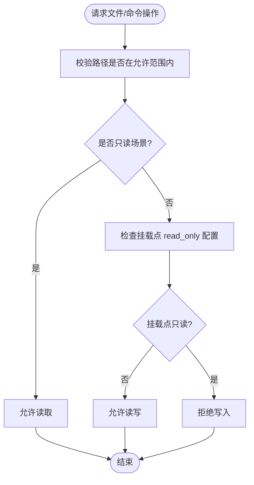

图示来源
- [backend/packages/harness/deerflow/sandbox/tools.py](file://backend/packages/harness/deerflow/sandbox/tools.py)
- [backend/packages/harness/deerflow/sandbox/exceptions.py](file://backend/packages/harness/deerflow/sandbox/exceptions.py)
- [backend/tests/test_local_sandbox.py](file://backend/tests/test_local_sandbox.py)
- [backend/tests/test_aio_sandbox.py](file://backend/tests/test_aio_sandbox.py)

章节来源
- [backend/packages/harness/deerflow/sandbox/tools.py](file://backend/packages/harness/deerflow/sandbox/tools.py)
- [backend/packages/harness/deerflow/sandbox/exceptions.py](file://backend/packages/harness/deerflow/sandbox/exceptions.py)
- [backend/tests/test_local_sandbox.py](file://backend/tests/test_local_sandbox.py)
- [backend/tests/test_aio_sandbox.py](file://backend/tests/test_aio_sandbox.py)

### 运行时加载与上下文注入
- 基础提示词：包含可用技能列表与渐进式加载指导。
- 当前轮次上下文：当用户以/技能名触发时，仅将该技能的SKILL.md作为隐藏上下文注入，不改变基础提示词。
- 文件读取：遵循沙箱路径限制，避免越权访问。

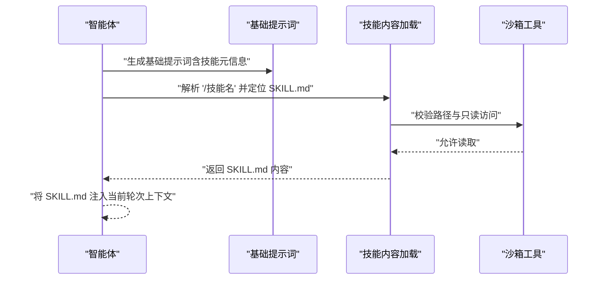

图示来源
- [backend/packages/harness/deerflow/agents/lead_agent/prompt.py](file://backend/packages/harness/deerflow/agents/lead_agent/prompt.py)
- [backend/packages/harness/deerflow/agents/middlewares/skill_activation_middleware.py](file://backend/packages/harness/deerflow/agents/middlewares/skill_activation_middleware.py)

章节来源
- [backend/packages/harness/deerflow/agents/lead_agent/prompt.py](file://backend/packages/harness/deerflow/agents/lead_agent/prompt.py)
- [backend/packages/harness/deerflow/agents/middlewares/skill_activation_middleware.py](file://backend/packages/harness/deerflow/agents/middlewares/skill_activation_middleware.py)
- [README.md](file://README.md)

## 依赖关系分析
技能系统各模块之间的依赖关系如下：

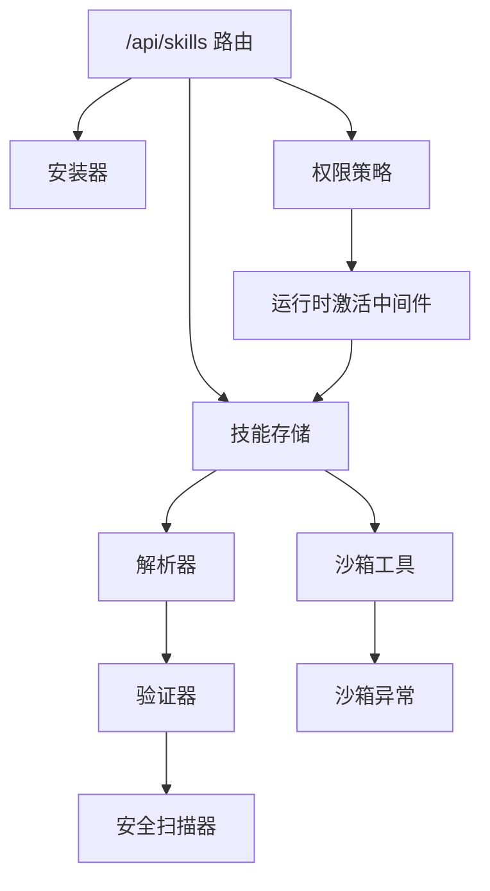

图示来源
- [backend/app/gateway/routers/skills.py](file://backend/app/gateway/routers/skills.py)
- [backend/packages/harness/deerflow/skills/installer.py](file://backend/packages/harness/deerflow/skills/installer.py)
- [backend/packages/harness/deerflow/skills/storage/__init__.py](file://backend/packages/harness/deerflow/skills/storage/__init__.py)
- [backend/packages/harness/deerflow/skills/parser.py](file://backend/packages/harness/deerflow/skills/parser.py)
- [backend/packages/harness/deerflow/skills/validation.py](file://backend/packages/harness/deerflow/skills/validation.py)
- [backend/packages/harness/deerflow/skills/security_scanner.py](file://backend/packages/harness/deerflow/skills/security_scanner.py)
- [backend/packages/harness/deerflow/skills/permissions.py](file://backend/packages/harness/deerflow/skills/permissions.py)
- [backend/packages/harness/deerflow/agents/middlewares/skill_activation_middleware.py](file://backend/packages/harness/deerflow/agents/middlewares/skill_activation_middleware.py)
- [backend/packages/harness/deerflow/sandbox/tools.py](file://backend/packages/harness/deerflow/sandbox/tools.py)
- [backend/packages/harness/deerflow/sandbox/exceptions.py](file://backend/packages/harness/deerflow/sandbox/exceptions.py)

章节来源
- [backend/CLAUDE.md](file://backend/CLAUDE.md)
- [backend/app/gateway/routers/skills.py](file://backend/app/gateway/routers/skills.py)

## 性能考虑
- 递归扫描：在大型技能库中，扫描与解析成本可能上升，建议：
  - 使用缓存（如LRU缓存）复用解析结果。
  - 分页加载与延迟解析，仅在需要时读取SKILL.md。
- 安全扫描：对大体积脚本/模板进行增量扫描或并行化处理。
- 沙箱I/O：尽量减少频繁的小文件读写，合并必要操作。
- 测试锚点：回归测试锁定关键加载行为，避免性能退化引入新问题。

## 故障排查指南
- 安装失败
  - 检查归档完整性与目标路径权限。
  - 关注安装器抛出的重名冲突与路径安全异常。
- 解析失败
  - 核对SKILL.md格式与frontmatter字段是否符合要求。
  - 查看验证器返回的具体字段缺失或格式错误。
- 安全扫描阻断
  - 检查脚本/模板中是否存在高危模式，按扫描报告修改。
- 权限拒绝
  - 确认技能启用状态、自定义代理白名单与保留命令限制。
- 沙箱访问被拒
  - 确保访问路径在允许范围内（/mnt/user-data、只读技能路径、已配置挂载点）。
  - 本地沙箱模式下避免直接写入非受控路径。

章节来源
- [backend/tests/test_skills_install.py](file://backend/tests/test_skills_install.py)
- [backend/tests/test_skills_parser.py](file://backend/tests/test_skills_parser.py)
- [backend/tests/test_skills_validation.py](file://backend/tests/test_skills_validation.py)
- [backend/tests/test_security_scanner.py](file://backend/tests/test_security_scanner.py)
- [backend/tests/test_skills_permissions.py](file://backend/tests/test_skills_permissions.py)
- [backend/tests/test_local_sandbox.py](file://backend/tests/test_local_sandbox.py)

## 结论
DeerFlow技能系统通过“存储发现—解析—验证—安全扫描—安装—权限控制—沙箱执行”的闭环设计，实现了可扩展、可审计、可隔离的技能生态。开发者只需遵循SKILL.md规范与安全扫描要求，即可快速创建并发布高质量技能；平台侧通过严格的权限与沙箱策略保障运行安全与资源边界。

## 附录

### SKILL.md文件格式与元数据字段
- 必填字段：名称、版本、作者、兼容性、类别、描述。
- 可选字段：脚本列表、模板列表、参考材料、许可证、图标等。
- 示例参考：公共技能目录中的多个SKILL.md文件。

章节来源
- [skills/public/bootstrap/SKILL.md](file://skills/public/bootstrap/SKILL.md)
- [skills/public/data-analysis/SKILL.md](file://skills/public/data-analysis/SKILL.md)
- [skills/public/github-deep-research/SKILL.md](file://skills/public/github-deep-research/SKILL.md)
- [skills/public/image-generation/SKILL.md](file://skills/public/image-generation/SKILL.md)
- [skills/public/music-generation/SKILL.md](file://skills/public/music-generation/SKILL.md)
- [skills/public/podcast-generation/SKILL.md](file://skills/public/podcast-generation/SKILL.md)
- [skills/public/video-generation/SKILL.md](file://skills/public/video-generation/SKILL.md)
- [skills/public/skill-creator/SKILL.md](file://skills/public/skill-creator/SKILL.md)
- [skills/public/systematic-literature-review/SKILL.md](file://skills/public/systematic-literature-review/SKILL.md)
- [skills/public/web-design-guidelines/SKILL.md](file://skills/public/web-design-guidelines/SKILL.md)
- [skills/public/academic-paper-review/SKILL.md](file://skills/public/academic-paper-review/SKILL.md)
- [skills/public/chart-visualization/SKILL.md](file://skills/public/chart-visualization/SKILL.md)
- [skills/public/deep-research/SKILL.md](file://skills/public/deep-research/SKILL.md)
- [skills/public/find-skills/SKILL.md](file://skills/public/find-skills/SKILL.md)
- [skills/public/consulting-analysis/SKILL.md](file://skills/public/consulting-analysis/SKILL.md)
- [skills/public/code-documentation/SKILL.md](file://skills/public/code-documentation/SKILL.md)
- [skills/public/claude-to-deerflow/SKILL.md](file://skills/public/claude-to-deerflow/SKILL.md)
- [skills/public/frontend-design/SKILL.md](file://skills/public/frontend-design/SKILL.md)
- [skills/public/newsletter-generation/SKILL.md](file://skills/public/newsletter-generation/SKILL.md)
- [skills/public/ppt-generation/SKILL.md](file://skills/public/ppt-generation/SKILL.md)
- [skills/public/surprise-me/SKILL.md](file://skills/public/surprise-me/SKILL.md)
- [skills/public/vercel-deploy-claimable/SKILL.md](file://skills/public/vercel-deploy-claimable/SKILL.md)

### 开发规范与最佳实践
- 使用技能创建器脚本生成标准目录结构与模板。
- 在脚本与模板中避免硬编码敏感信息，优先使用参数化与环境变量。
- 严格遵守沙箱路径访问限制，避免写入非受控路径。
- 提交前通过安全扫描器自检，修复高危模式。

章节来源
- [skills/public/skill-creator/scripts/generate_all.sh](file://skills/public/skill-creator/scripts/generate_all.sh)
- [skills/public/skill-creator/scripts/generate_scripts.sh](file://skills/public/skill-creator/scripts/generate_scripts.sh)
- [skills/public/skill-creator/scripts/generate_templates.sh](file://skills/public/skill-creator/scripts/generate_templates.sh)
- [skills/public/skill-creator/scripts/generate_references.sh](file://skills/public/skill-creator/scripts/generate_references.sh)
- [skills/public/skill-creator/references/README.md](file://skills/public/skill-creator/references/README.md)
- [skills/public/skill-creator/templates/report.template.md](file://skills/public/skill-creator/templates/report.template.md)
- [skills/public/skill-creator/assets/icon.png](file://skills/public/skill-creator/assets/icon.png)
- [skills/public/skill-creator/LICENSE.txt](file://skills/public/skill-creator/LICENSE.txt)

### 创建与发布自定义技能
- 步骤概览：
  - 使用技能创建器生成初始结构与脚手架。
  - 编写SKILL.md与脚本/模板/参考材料。
  - 本地验证（解析、验证、安全扫描、权限测试）。
  - 打包为.skill归档并通过网关安装到custom目录。
  - 在扩展配置中启用并进行集成测试。

章节来源
- [skills/public/skill-creator/scripts/create_skill.sh](file://skills/public/skill-creator/scripts/create_skill.sh)
- [backend/app/gateway/routers/skills.py](file://backend/app/gateway/routers/skills.py)
- [backend/packages/harness/deerflow/skills/installer.py](file://backend/packages/harness/deerflow/skills/installer.py)
- [backend/README.md](file://backend/README.md)

### 配置与示例
- 扩展配置示例：extensions_config.example.json
- 应用配置示例：config.example.yaml
- 文档参考：AUTH_DESIGN、GUARDRAILS、SANDBOX_MEMORY_PROFILING

章节来源
- [extensions_config.example.json](file://extensions_config.example.json)
- [config.example.yaml](file://config.example.yaml)
- [backend/docs/AUTH_DESIGN.md](file://backend/docs/AUTH_DESIGN.md)
- [backend/docs/GUARDRAILS.md](file://backend/docs/GUARDRAILS.md)
- [backend/docs/SANDBOX_MEMORY_PROFILING.md](file://backend/docs/SANDBOX_MEMORY_PROFILING.md)