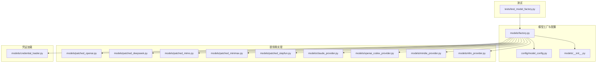
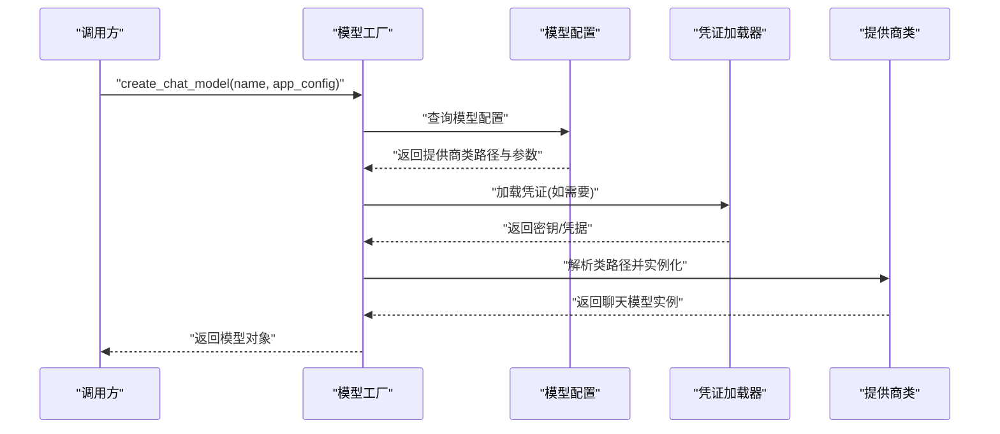
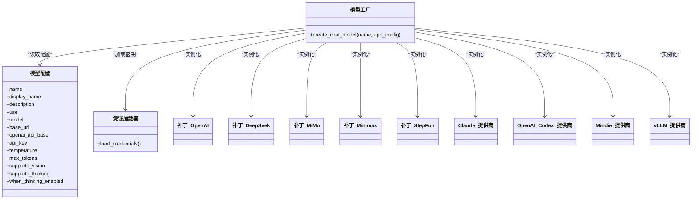
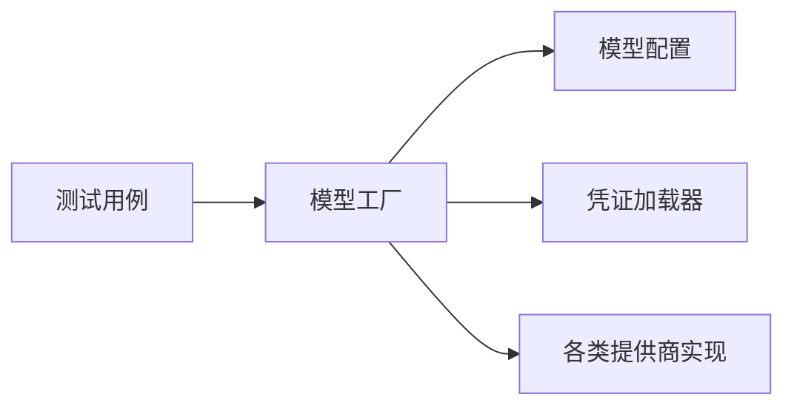

# 模型工厂

<cite>
**本文引用的文件**
- [models/factory.py](file://backend/packages/harness/deerflow/models/factory.py)
- [models/__init__.py](file://backend/packages/harness/deerflow/models/__init__.py)
- [config/model_config.py](file://backend/packages/harness/deerflow/config/model_config.py)
- [models/claude_provider.py](file://backend/packages/harness/deerflow/models/claude_provider.py)
- [models/openai_codex_provider.py](file://backend/packages/harness/deerflow/models/openai_codex_provider.py)
- [models/mindie_provider.py](file://backend/packages/harness/deerflow/models/mindie_provider.py)
- [models/vllm_provider.py](file://backend/packages/harness/deerflow/models/vllm_provider.py)
- [models/patched_openai.py](file://backend/packages/harness/deerflow/models/patched_openai.py)
- [models/patched_deepseek.py](file://backend/packages/harness/deerflow/models/patched_deepseek.py)
- [models/patched_mimo.py](file://backend/packages/harness/deerflow/models/patched_mimo.py)
- [models/patched_minimax.py](file://backend/packages/harness/deerflow/models/patched_minimax.py)
- [models/patched_stepfun.py](file://backend/packages/harness/deerflow/models/patched_stepfun.py)
- [models/credential_loader.py](file://backend/packages/harness/deerflow/models/credential_loader.py)
- [tests/test_model_factory.py](file://backend/tests/test_model_factory.py)
</cite>

## 目录
1. [简介](#简介)
2. [项目结构](#项目结构)
3. [核心组件](#核心组件)
4. [架构总览](#架构总览)
5. [详细组件分析](#详细组件分析)
6. [依赖关系分析](#依赖关系分析)
7. [性能考量](#性能考量)
8. [故障排查指南](#故障排查指南)
9. [结论](#结论)
10. [附录](#附录)

## 简介
本文件系统化阐述 DeerFlow 模型工厂的设计与实现，重点覆盖以下方面：
- 抽象工厂模式在模型工厂中的应用：统一入口、按需解析与实例化不同 LLM 提供商的聊天模型。
- 模型提供者注册与动态创建机制：通过配置驱动，支持多种提供商（如 OpenAI、Claude、vLLM、Mindie 等）及补丁类模型。
- 补丁的作用与实现：针对特定提供商的协议差异或功能增强（如思维模式、视觉能力、流式用量统计等），以“补丁”形式封装适配。
- 典型集成与配置：展示如何为不同提供商配置关键参数，并给出可复用的调用流程与优化建议。

## 项目结构
与模型工厂直接相关的核心模块位于 backend/packages/harness/deerflow 下的 models 子包，配合 config 中的模型配置定义，以及 tests 中的工厂测试用例验证行为。

图表来源
- [models/factory.py](file://backend/packages/harness/deerflow/models/factory.py)
- [config/model_config.py](file://backend/packages/harness/deerflow/config/model_config.py)
- [models/__init__.py](file://backend/packages/harness/deerflow/models/__init__.py)
- [models/patched_openai.py](file://backend/packages/harness/deerflow/models/patched_openai.py)
- [models/patched_deepseek.py](file://backend/packages/harness/deerflow/models/patched_deepseek.py)
- [models/patched_mimo.py](file://backend/packages/harness/deerflow/models/patched_mimo.py)
- [models/patched_minimax.py](file://backend/packages/harness/deerflow/models/patched_minimax.py)
- [models/patched_stepfun.py](file://backend/packages/harness/deerflow/models/patched_stepfun.py)
- [models/claude_provider.py](file://backend/packages/harness/deerflow/models/claude_provider.py)
- [models/openai_codex_provider.py](file://backend/packages/harness/deerflow/models/openai_codex_provider.py)
- [models/mindie_provider.py](file://backend/packages/harness/deerflow/models/mindie_provider.py)
- [models/vllm_provider.py](file://backend/packages/harness/deerflow/models/vllm_provider.py)
- [models/credential_loader.py](file://backend/packages/harness/deerflow/models/credential_loader.py)
- [tests/test_model_factory.py](file://backend/tests/test_model_factory.py)

章节来源
- [models/factory.py](file://backend/packages/harness/deerflow/models/factory.py)
- [config/model_config.py](file://backend/packages/harness/deerflow/config/model_config.py)
- [models/__init__.py](file://backend/packages/harness/deerflow/models/__init__.py)
- [models/credential_loader.py](file://backend/packages/harness/deerflow/models/credential_loader.py)
- [tests/test_model_factory.py](file://backend/tests/test_model_factory.py)

## 核心组件
- 模型工厂入口：负责根据模型名称与配置，解析并创建对应的聊天模型实例；支持从配置中读取提供商类路径、参数与补丁策略。
- 模型配置：集中定义各模型的名称、显示名、描述、提供商类路径、模型名、API 密钥、基础 URL、温度、最大令牌数、是否支持视觉与思考模式等。
- 提供商实现：针对不同提供商的适配器或补丁类，例如 OpenAI、DeepSeek、MiMo、Minimax、StepFun、Claude、Mindie、vLLM 等。
- 凭证加载：从安全位置或环境变量加载 API 密钥等敏感信息，避免硬编码。
- 测试用例：覆盖多种提供商的创建、参数透传、流式用量统计默认值、OpenAI 兼容接口的 base_url/openai_api_base 处理等。

章节来源
- [models/factory.py](file://backend/packages/harness/deerflow/models/factory.py)
- [config/model_config.py](file://backend/packages/harness/deerflow/config/model_config.py)
- [models/credential_loader.py](file://backend/packages/harness/deerflow/models/credential_loader.py)
- [tests/test_model_factory.py](file://backend/tests/test_model_factory.py)

## 架构总览
模型工厂采用“配置驱动 + 类路径解析 + 动态实例化”的抽象工厂模式：
- 输入：模型名称与应用配置（包含模型列表与全局设置）。
- 解析：根据配置查找对应模型的提供商类路径与参数，必要时加载凭证。
- 实例化：调用提供商类构造函数，注入参数与补丁策略（如思维模式开关、额外请求体等）。
- 输出：返回可直接用于对话生成的聊天模型对象。

图表来源
- [models/factory.py](file://backend/packages/harness/deerflow/models/factory.py)
- [config/model_config.py](file://backend/packages/harness/deerflow/config/model_config.py)
- [models/credential_loader.py](file://backend/packages/harness/deerflow/models/credential_loader.py)

## 详细组件分析

### 模型工厂（抽象工厂）
- 职责
  - 依据模型名称从配置中解析提供商类路径与参数。
  - 加载凭证（如 API Key）并合并到参数字典。
  - 支持补丁类模型（如 patched_openai、patched_mimo 等）的特殊参数注入（如思维模式开关、额外请求体）。
  - 对 OpenAI 兼容接口进行默认行为处理（如 openai_api_base 触发流式用量统计默认开启）。
- 关键流程
  - 参数透传：确保模型名、基础 URL、API Key、温度、最大令牌数等被正确传递给提供商类。
  - 默认值策略：对流式用量统计等字段设置默认值，同时允许显式配置覆盖。
  - 多模型共存：同一提供商的不同模型（如 MiniMax 的 M3/M2.7）可并行存在，参数隔离。
- 代码片段路径
  - [models/factory.py](file://backend/packages/harness/deerflow/models/factory.py)
  - [tests/test_model_factory.py](file://backend/tests/test_model_factory.py)

章节来源
- [models/factory.py](file://backend/packages/harness/deerflow/models/factory.py)
- [tests/test_model_factory.py](file://backend/tests/test_model_factory.py)

### 模型配置（ModelConfig）
- 字段要点
  - 名称与显示名：唯一标识与用户可见名称。
  - 描述：模型能力说明。
  - 提供商类路径：形如 “deerflow.models.patched_openai:Patch” 或 “langchain_openai:ChatOpenAI”。
  - 模型名：具体模型标识符。
  - 基础 URL/openai_api_base：OpenAI 兼容接口的基础地址。
  - API Key：访问凭证。
  - 温度与最大令牌数：推理参数。
  - 视觉与思考模式支持：是否支持视觉输入与思维模式。
  - 思维模式启用时的额外请求体：如 {"thinking": {"type": "enabled"}}。
- 代码片段路径
  - [config/model_config.py](file://backend/packages/harness/deerflow/config/model_config.py)

章节来源
- [config/model_config.py](file://backend/packages/harness/deerflow/config/model_config.py)

### 凭证加载器
- 职责：从安全位置或环境变量加载 API Key 等敏感信息，避免硬编码。
- 与工厂协作：在工厂解析配置后，按需调用凭证加载器获取密钥并注入到参数字典。
- 代码片段路径
  - [models/credential_loader.py](file://backend/packages/harness/deerflow/models/credential_loader.py)

章节来源
- [models/credential_loader.py](file://backend/packages/harness/deerflow/models/credential_loader.py)

### 提供商实现与补丁

#### OpenAI 及兼容接口
- 补丁类：patched_openai
  - 作用：增强 OpenAI Chat 模型的参数注入与行为控制（如思维模式、流式用量统计等）。
  - 适用场景：OpenAI 官方 API 或兼容接口（如自建网关）。
  - 代码片段路径
    - [models/patched_openai.py](file://backend/packages/harness/deerflow/models/patched_openai.py)
    - [tests/test_model_factory.py](file://backend/tests/test_model_factory.py)

#### DeepSeek
- 补丁类：patched_deepseek
  - 作用：适配 DeepSeek 的特定参数或行为。
  - 代码片段路径
    - [models/patched_deepseek.py](file://backend/packages/harness/deerflow/models/patched_deepseek.py)

#### MiMo（小米生态）
- 补丁类：patched_mimo
  - 作用：支持 MiMo 的思维模式开关与额外请求体注入。
  - 代码片段路径
    - [models/patched_mimo.py](file://backend/packages/harness/deerflow/models/patched_mimo.py)
    - [tests/test_model_factory.py](file://backend/tests/test_model_factory.py)

#### Minimax（MiniMax）
- 补丁类：patched_minimax
  - 作用：适配 MiniMax 的兼容接口，支持 base_url 透传与多模型并存。
  - 代码片段路径
    - [models/patched_minimax.py](file://backend/packages/harness/deerflow/models/patched_minimax.py)
    - [tests/test_model_factory.py](file://backend/tests/test_model_factory.py)

#### StepFun
- 补丁类：patched_stepfun
  - 作用：适配 StepFun 的特定参数或行为。
  - 代码片段路径
    - [models/patched_stepfun.py](file://backend/packages/harness/deerflow/models/patched_stepfun.py)

#### Claude
- 提供商类：claude_provider
  - 作用：封装 Claude 的认证、请求与响应处理。
  - 代码片段路径
    - [models/claude_provider.py](file://backend/packages/harness/deerflow/models/claude_provider.py)

#### OpenAI Codex
- 提供商类：openai_codex_provider
  - 作用：面向文本补全或代码生成的 OpenAI Codex 接口适配。
  - 代码片段路径
    - [models/openai_codex_provider.py](file://backend/packages/harness/deerflow/models/openai_codex_provider.py)

#### Mindie
- 提供商类：mindie_provider
  - 作用：Mindie 提供商的适配器。
  - 代码片段路径
    - [models/mindie_provider.py](file://backend/packages/harness/deerflow/models/mindie_provider.py)

#### vLLM
- 提供商类：vllm_provider
  - 作用：面向本地或私有部署的 vLLM 推理服务。
  - 代码片段路径
    - [models/vllm_provider.py](file://backend/packages/harness/deerflow/models/vllm_provider.py)

章节来源
- [models/patched_openai.py](file://backend/packages/harness/deerflow/models/patched_openai.py)
- [models/patched_deepseek.py](file://backend/packages/harness/deerflow/models/patched_deepseek.py)
- [models/patched_mimo.py](file://backend/packages/harness/deerflow/models/patched_mimo.py)
- [models/patched_minimax.py](file://backend/packages/harness/deerflow/models/patched_minimax.py)
- [models/patched_stepfun.py](file://backend/packages/harness/deerflow/models/patched_stepfun.py)
- [models/claude_provider.py](file://backend/packages/harness/deerflow/models/claude_provider.py)
- [models/openai_codex_provider.py](file://backend/packages/harness/deerflow/models/openai_codex_provider.py)
- [models/mindie_provider.py](file://backend/packages/harness/deerflow/models/mindie_provider.py)
- [models/vllm_provider.py](file://backend/packages/harness/deerflow/models/vllm_provider.py)
- [tests/test_model_factory.py](file://backend/tests/test_model_factory.py)

### 类关系图（代码级）

图表来源
- [models/factory.py](file://backend/packages/harness/deerflow/models/factory.py)
- [config/model_config.py](file://backend/packages/harness/deerflow/config/model_config.py)
- [models/credential_loader.py](file://backend/packages/harness/deerflow/models/credential_loader.py)
- [models/patched_openai.py](file://backend/packages/harness/deerflow/models/patched_openai.py)
- [models/patched_deepseek.py](file://backend/packages/harness/deerflow/models/patched_deepseek.py)
- [models/patched_mimo.py](file://backend/packages/harness/deerflow/models/patched_mimo.py)
- [models/patched_minimax.py](file://backend/packages/harness/deerflow/models/patched_minimax.py)
- [models/patched_stepfun.py](file://backend/packages/harness/deerflow/models/patched_stepfun.py)
- [models/claude_provider.py](file://backend/packages/harness/deerflow/models/claude_provider.py)
- [models/openai_codex_provider.py](file://backend/packages/harness/deerflow/models/openai_codex_provider.py)
- [models/mindie_provider.py](file://backend/packages/harness/deerflow/models/mindie_provider.py)
- [models/vllm_provider.py](file://backend/packages/harness/deerflow/models/vllm_provider.py)

## 依赖关系分析
- 工厂对配置的依赖：通过模型配置决定提供商类路径与参数。
- 工厂对凭证加载器的依赖：在需要时加载密钥并注入到参数字典。
- 工厂对提供商实现的依赖：通过类路径解析与动态导入实例化具体提供商。
- 测试对工厂的依赖：通过构造最小配置与打桩（mock）验证参数透传与默认值策略。

图表来源
- [models/factory.py](file://backend/packages/harness/deerflow/models/factory.py)
- [config/model_config.py](file://backend/packages/harness/deerflow/config/model_config.py)
- [models/credential_loader.py](file://backend/packages/harness/deerflow/models/credential_loader.py)
- [tests/test_model_factory.py](file://backend/tests/test_model_factory.py)

章节来源
- [models/factory.py](file://backend/packages/harness/deerflow/models/factory.py)
- [config/model_config.py](file://backend/packages/harness/deerflow/config/model_config.py)
- [models/credential_loader.py](file://backend/packages/harness/deerflow/models/credential_loader.py)
- [tests/test_model_factory.py](file://backend/tests/test_model_factory.py)

## 性能考量
- 流式用量统计默认值：当使用 OpenAI 兼容接口（如 openai_api_base）时，默认开启流式用量统计，有助于实时监控与成本控制；若明确关闭，应保持显式配置以避免默认覆盖。
- 多模型并存：同一提供商的多个模型可并行存在，注意参数隔离与资源占用评估。
- 补丁类参数注入：仅在需要时启用思维模式等增强功能，避免不必要的开销。
- 基础 URL 与网络延迟：合理设置 base_url/openai_api_base，优先选择低延迟节点，减少连接超时风险。

## 故障排查指南
- 参数未生效
  - 检查模型配置中的提供商类路径与参数是否正确。
  - 确认凭证加载器已成功注入 API Key。
  - 参考测试用例中的断言，核对参数透传（如 model、base_url、api_key、temperature、max_tokens、stream_usage）。
- 流式用量统计异常
  - 若使用 openai_api_base，请确认默认值策略已被触发；若不希望默认开启，需显式设置 stream_usage=False。
  - 参考测试用例中关于 openai_api_base 与 stream_usage 的断言。
- OpenAI 兼容接口
  - 当使用 MiniMax 等兼容接口时，确保 base_url 正确透传；同一提供商的多个模型可并存，注意区分参数。
- 思维模式未生效
  - 确认 when_thinking_enabled 是否正确配置，且补丁类支持该参数注入（如 MiMo）。

章节来源
- [tests/test_model_factory.py](file://backend/tests/test_model_factory.py)
- [models/factory.py](file://backend/packages/harness/deerflow/models/factory.py)

## 结论
DeerFlow 模型工厂通过抽象工厂模式实现了对多提供商、多形态模型的统一管理与动态创建。借助配置驱动与补丁机制，工厂能够灵活适配不同提供商的差异性与兼容性问题，同时保证参数透传与默认值策略的一致性。结合凭证加载与完善的测试用例，开发者可以快速集成新的提供商或调整现有模型的行为。

## 附录
- 快速上手步骤
  - 在模型配置中添加新模型条目，指定提供商类路径与参数。
  - 如需增强行为（如思维模式），选择对应的补丁类并配置 when_thinking_enabled。
  - 使用工厂方法 create_chat_model 创建模型实例，并在运行时注入凭证。
- 参考测试用例
  - OpenAI 兼容接口与多模型并存：[tests/test_model_factory.py](file://backend/tests/test_model_factory.py)
  - 流式用量统计默认值与显式覆盖：同上
  - MiMo 思维模式补丁：同上