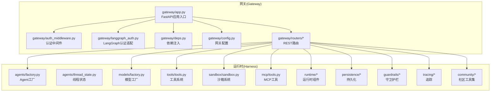
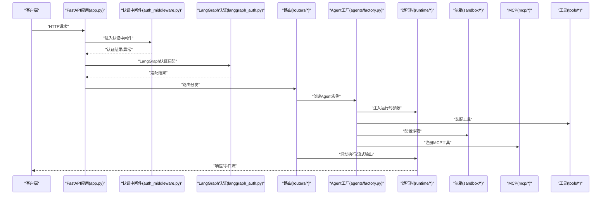
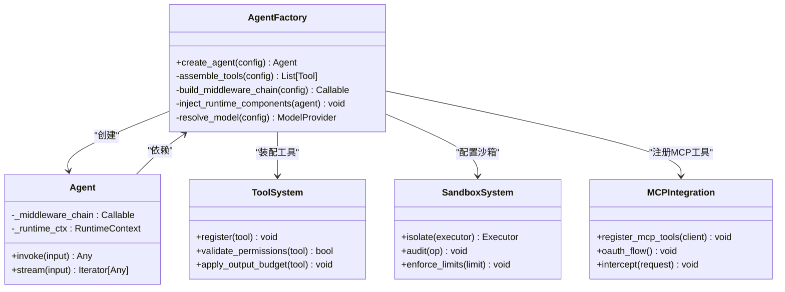
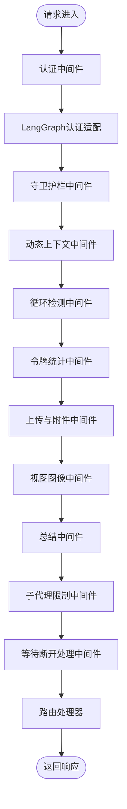
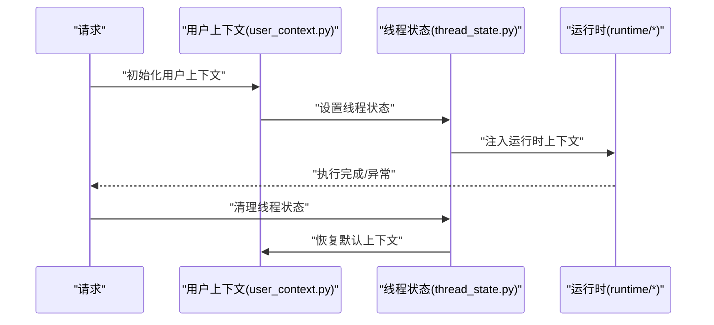
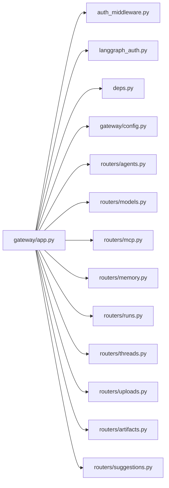
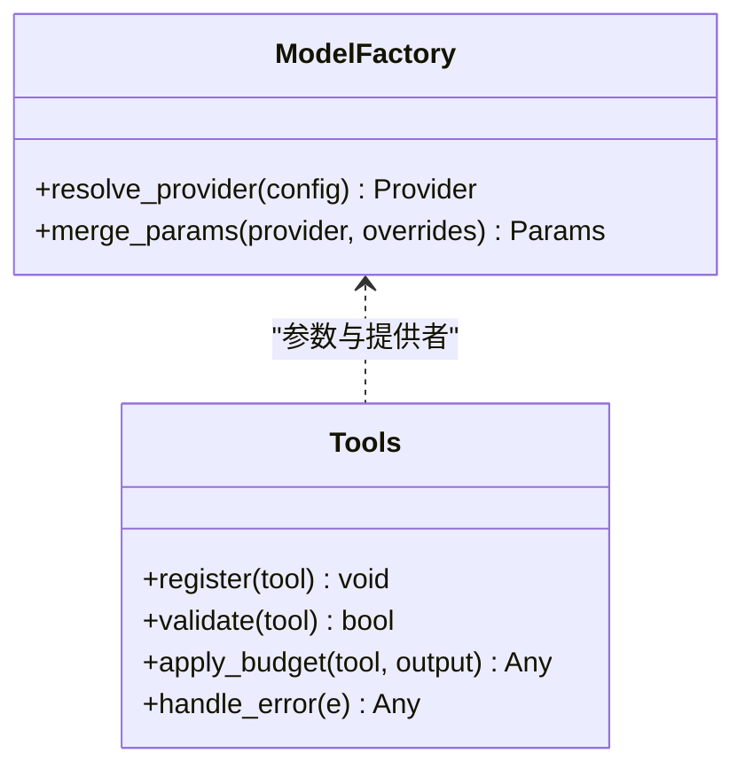
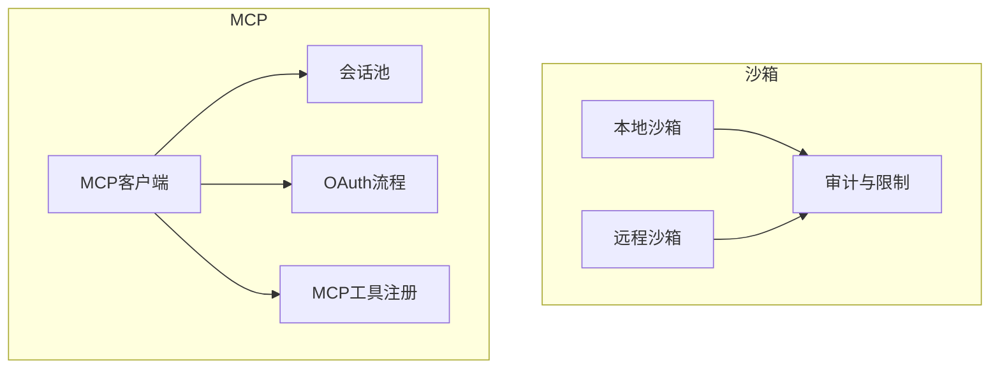
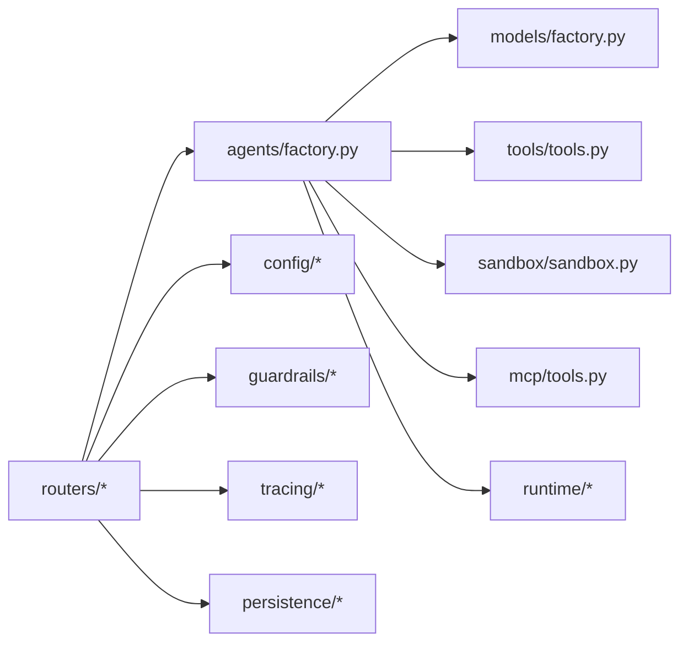

# 组件详解

<cite>
**本文引用的文件**
- [app.py](file://backend/app/gateway/app.py)
- [agents.py](file://backend/app/gateway/routers/agents.py)
- [models.py](file://backend/app/gateway/routers/models.py)
- [mcp.py](file://backend/app/gateway/routers/mcp.py)
- [factory.py](file://backend/packages/harness/deerflow/agents/factory.py)
- [thread_state.py](file://backend/packages/harness/deerflow/agents/thread_state.py)
- [sandbox.py](file://backend/packages/harness/deerflow/sandbox/sandbox.py)
- [tools.py](file://backend/packages/harness/deerflow/tools/tools.py)
- [mcp_tools.py](file://backend/packages/harness/deerflow/mcp/tools.py)
- [models_factory.py](file://backend/packages/harness/deerflow/models/factory.py)
- [middlewares目录](file://backend/packages/harness/deerflow/agents/middlewares)
- [auth_middleware.py](file://backend/app/gateway/auth_middleware.py)
- [langgraph_auth.py](file://backend/app/gateway/langgraph_auth.py)
- [deps.py](file://backend/app/gateway/deps.py)
- [config.py](file://backend/app/gateway/config.py)
- [paths.py](file://backend/packages/harness/deerflow/config/paths.py)
- [model_config.py](file://backend/packages/harness/deerflow/config/model_config.py)
- [sandbox_config.py](file://backend/packages/harness/deerflow/config/sandbox_config.py)
- [mcp_config.py](file://backend/packages/harness/deerflow/config/mcp_config.py)
- [acp_config.py](file://backend/packages/harness/deerflow/config/acp_config.py)
- [stream_bridge_config.py](file://backend/packages/harness/deerflow/config/stream_bridge_config.py)
- [checkpointer_config.py](file://backend/packages/harness/deerflow/config/checkpointer_config.py)
- [memory_config.py](file://backend/packages/harness/deerflow/config/memory_config.py)
- [guardrails_config.py](file://backend/packages/harness/deerflow/config/guardrails_config.py)
- [loop_detection_config.py](file://backend/packages/harness/deerflow/config/loop_detection_config.py)
- [token_usage_config.py](file://backend/packages/harness/deerflow/config/token_usage_config.py)
- [subagents_config.py](file://backend/packages/harness/deerflow/config/subagents_config.py)
- [skills_config.py](file://backend/packages/harness/deerflow/config/skills_config.py)
- [runtime_paths.py](file://backend/packages/harness/deerflow/config/runtime_paths.py)
- [extensions_config.py](file://backend/packages/harness/deerflow/config/extensions_config.py)
- [tracing_config.py](file://backend/packages/harness/deerflow/config/tracing_config.py)
- [run_events_config.py](file://backend/packages/harness/deerflow/config/run_events_config.py)
- [title_config.py](file://backend/packages/harness/deerflow/config/title_config.py)
- [summarization_config.py](file://backend/packages/harness/deerflow/config/summarization_config.py)
- [safety_finish_reason_config.py](file://backend/packages/harness/deerflow/config/safety_finish_reason_config.py)
- [skill_evolution_config.py](file://backend/packages/harness/deerflow/config/skill_evolution_config.py)
- [tool_config.py](file://backend/packages/harness/deerflow/config/tool_config.py)
- [tool_output_config.py](file://backend/packages/harness/deerflow/config/tool_output_config.py)
- [tool_search_config.py](file://backend/packages/harness/deerflow/config/tool_search_config.py)
- [user_context.py](file://backend/packages/harness/deerflow/runtime/user_context.py)
- [journal.py](file://backend/packages/harness/deerflow/runtime/journal.py)
- [serialization.py](file://backend/packages/harness/deerflow/runtime/serialization.py)
- [events目录](file://backend/packages/harness/deerflow/runtime/events)
- [store目录](file://backend/packages/harness/deerflow/runtime/store)
- [stream_bridge目录](file://backend/packages/harness/deerflow/runtime/stream_bridge)
- [checkpointer目录](file://backend/packages/harness/deerflow/runtime/checkpointer)
- [persistence目录](file://backend/packages/harness/deerflow/persistence)
- [uploads目录](file://backend/packages/harness/deerflow/uploads)
- [reflection目录](file://backend/packages/harness/deerflow/reflection)
- [tracing目录](file://backend/packages/harness/deerflow/tracing)
- [guardrails目录](file://backend/packages/harness/deerflow/guardrails)
- [community工具目录](file://backend/packages/harness/deerflow/community)
- [mcp目录](file://backend/packages/harness/deerflow/mcp)
- [sandbox目录](file://backend/packages/harness/deerflow/sandbox)
- [tools目录](file://backend/packages/harness/deerflow/tools)
- [models目录](file://backend/packages/harness/deerflow/models)
- [config目录](file://backend/packages/harness/deerflow/config)
- [runtime目录](file://backend/packages/harness/deerflow/runtime)
- [persistence目录](file://backend/packages/harness/deerflow/persistence)
- [uploads目录](file://backend/packages/harness/deerflow/uploads)
- [reflection目录](file://backend/packages/harness/deerflow/reflection)
- [tracing目录](file://backend/packages/harness/deerflow/tracing)
- [guardrails目录](file://backend/packages/harness/deerflow/guardrails)
</cite>

## 目录
1. [引言](#引言)
2. [项目结构](#项目结构)
3. [核心组件](#核心组件)
4. [架构总览](#架构总览)
5. [详细组件分析](#详细组件分析)
6. [依赖分析](#依赖分析)
7. [性能考虑](#性能考虑)
8. [故障排查指南](#故障排查指南)
9. [结论](#结论)
10. [附录](#附录)

## 引言
本技术文档聚焦于DeerFlow网关嵌入式代理运行时的核心组件与实现细节，涵盖以下主题：
- Agent工厂模式：如何通过工厂统一创建与配置Agent实例，支持多模型与多工具组合。
- 中间件链执行机制：请求在进入路由处理前后的拦截、校验与增强流程。
- 线程状态管理：在并发与异步场景下维护上下文与状态一致性。
- FastAPI应用的路由组织与REST端点设计：各模块路由的职责划分与接口规范。
- LangGraph兼容性：与LangGraph生态的认证、序列化与事件流对接。
- Agent架构组件：模型工厂、工具系统、沙箱系统、MCP集成及其配置与通信协议。

## 项目结构
后端采用FastAPI应用作为入口，路由按功能域拆分；核心运行时能力集中在packages/harness/deerflow包内，包含模型、工具、沙箱、MCP、运行时、持久化等子系统，并通过配置模块进行集中管理。

**图表来源**
- [app.py](file://backend/app/gateway/app.py)
- [auth_middleware.py](file://backend/app/gateway/auth_middleware.py)
- [langgraph_auth.py](file://backend/app/gateway/langgraph_auth.py)
- [deps.py](file://backend/app/gateway/deps.py)
- [config.py](file://backend/app/gateway/config.py)
- [agents.py](file://backend/app/gateway/routers/agents.py)
- [models.py](file://backend/app/gateway/routers/models.py)
- [mcp.py](file://backend/app/gateway/routers/mcp.py)
- [factory.py](file://backend/packages/harness/deerflow/agents/factory.py)
- [thread_state.py](file://backend/packages/harness/deerflow/agents/thread_state.py)
- [models_factory.py](file://backend/packages/harness/deerflow/models/factory.py)
- [tools.py](file://backend/packages/harness/deerflow/tools/tools.py)
- [sandbox.py](file://backend/packages/harness/deerflow/sandbox/sandbox.py)
- [mcp_tools.py](file://backend/packages/harness/deerflow/mcp/tools.py)
- [runtime目录](file://backend/packages/harness/deerflow/runtime)
- [persistence目录](file://backend/packages/harness/deerflow/persistence)
- [guardrails目录](file://backend/packages/harness/deerflow/guardrails)
- [tracing目录](file://backend/packages/harness/deerflow/tracing)
- [community工具目录](file://backend/packages/harness/deerflow/community)

**章节来源**
- [app.py](file://backend/app/gateway/app.py)
- [config.py](file://backend/app/gateway/config.py)

## 核心组件
本节概述关键组件及其职责：
- Agent工厂：负责根据配置与上下文创建Agent实例，封装模型解析、工具装配、中间件链构建与运行时参数注入。
- 模型工厂：统一管理模型提供者与参数解析，支持OpenAI、Claude、vLLM等不同后端。
- 工具系统：提供内置工具与社区工具的注册、权限与安全策略、输出预算与截断、错误处理与降级。
- 沙箱系统：隔离执行环境，限制文件操作与网络访问，提供本地与远程后端，支持审计与内存监控。
- MCP集成：通过MCP客户端与会话池，桥接外部工具服务，支持OAuth与自定义拦截器。
- 运行时组件：事件存储、检查点、流桥接、序列化与用户上下文，保障长事务与流式输出的一致性。
- 守卫护栏与追踪：在中间件层插入安全与可观测性逻辑，支持可插拔的策略与元数据采集。
- 路由与认证：REST路由按领域划分，认证中间件与LangGraph适配确保与外部平台兼容。

**章节来源**
- [factory.py](file://backend/packages/harness/deerflow/agents/factory.py)
- [models_factory.py](file://backend/packages/harness/deerflow/models/factory.py)
- [tools.py](file://backend/packages/harness/deerflow/tools/tools.py)
- [sandbox.py](file://backend/packages/harness/deerflow/sandbox/sandbox.py)
- [mcp_tools.py](file://backend/packages/harness/deerflow/mcp/tools.py)
- [thread_state.py](file://backend/packages/harness/deerflow/agents/thread_state.py)
- [user_context.py](file://backend/packages/harness/deerflow/runtime/user_context.py)
- [journal.py](file://backend/packages/harness/deerflow/runtime/journal.py)
- [serialization.py](file://backend/packages/harness/deerflow/runtime/serialization.py)
- [guardrails目录](file://backend/packages/harness/deerflow/guardrails)
- [tracing目录](file://backend/packages/harness/deerflow/tracing)

## 架构总览
下图展示从HTTP请求到Agent执行的全链路调用序列，体现中间件、认证、路由、工厂与运行时的交互。

**图表来源**
- [app.py](file://backend/app/gateway/app.py)
- [auth_middleware.py](file://backend/app/gateway/auth_middleware.py)
- [langgraph_auth.py](file://backend/app/gateway/langgraph_auth.py)
- [agents.py](file://backend/app/gateway/routers/agents.py)
- [factory.py](file://backend/packages/harness/deerflow/agents/factory.py)
- [runtime目录](file://backend/packages/harness/deerflow/runtime)
- [sandbox目录](file://backend/packages/harness/deerflow/sandbox)
- [mcp目录](file://backend/packages/harness/deerflow/mcp)
- [tools目录](file://backend/packages/harness/deerflow/tools)

## 详细组件分析

### Agent工厂模式
Agent工厂通过统一接口创建Agent实例，负责：
- 解析模型提供者与参数（来自模型工厂与配置）。
- 装配工具集合（内置与社区工具），应用权限与安全策略。
- 构建中间件链，注入认证、守卫护栏、令牌统计、循环检测等中间件。
- 注入运行时组件（事件、检查点、流桥接、序列化、用户上下文）。
- 管理线程状态，确保并发安全与上下文一致性。

**图表来源**
- [factory.py](file://backend/packages/harness/deerflow/agents/factory.py)
- [tools.py](file://backend/packages/harness/deerflow/tools/tools.py)
- [sandbox.py](file://backend/packages/harness/deerflow/sandbox/sandbox.py)
- [mcp_tools.py](file://backend/packages/harness/deerflow/mcp/tools.py)

**章节来源**
- [factory.py](file://backend/packages/harness/deerflow/agents/factory.py)
- [models_factory.py](file://backend/packages/harness/deerflow/models/factory.py)
- [tools.py](file://backend/packages/harness/deerflow/tools/tools.py)
- [sandbox.py](file://backend/packages/harness/deerflow/sandbox/sandbox.py)
- [mcp_tools.py](file://backend/packages/harness/deerflow/mcp/tools.py)

### 中间件链执行机制
中间件链在请求进入路由处理前执行，典型顺序包括：
- 认证中间件：校验凭据与权限。
- LangGraph认证适配：对特定头部或协议进行适配。
- 守卫护栏中间件：触发预设规则与策略。
- 动态上下文中间件：根据请求动态注入上下文。
- 循环检测中间件：防止无限循环。
- 令牌使用统计中间件：记录输入输出token。
- 上传与文件附件中间件：处理文件上传与过滤。
- 视图图像中间件：对图片内容进行预处理。
- 总结中间件：生成摘要或标题。
- 子代理限制中间件：控制子代理数量与超时。
- 等待断开处理中间件：优雅处理客户端断开。

**图表来源**
- [auth_middleware.py](file://backend/app/gateway/auth_middleware.py)
- [langgraph_auth.py](file://backend/app/gateway/langgraph_auth.py)
- [middlewares目录](file://backend/packages/harness/deerflow/agents/middlewares)

**章节来源**
- [auth_middleware.py](file://backend/app/gateway/auth_middleware.py)
- [langgraph_auth.py](file://backend/app/gateway/langgraph_auth.py)
- [middlewares目录](file://backend/packages/harness/deerflow/agents/middlewares)

### 线程状态管理
线程状态管理用于在并发与异步场景中保持上下文一致，关键点：
- 用户上下文注入：在每次请求开始时设置用户标识与租户信息。
- 线程边界检测：识别阻塞I/O与线程边界，避免影响异步性能。
- 状态还原：在请求结束或异常时清理上下文，防止泄漏。
- 与运行时组件协作：与事件存储、检查点、流桥接协同，保证事务一致性。

**图表来源**
- [user_context.py](file://backend/packages/harness/deerflow/runtime/user_context.py)
- [thread_state.py](file://backend/packages/harness/deerflow/agents/thread_state.py)
- [runtime目录](file://backend/packages/harness/deerflow/runtime)

**章节来源**
- [user_context.py](file://backend/packages/harness/deerflow/runtime/user_context.py)
- [thread_state.py](file://backend/packages/harness/deerflow/agents/thread_state.py)

### FastAPI应用与路由组织
- 应用入口：在网关应用中注册路由、中间件与依赖注入。
- 路由组织：按领域拆分路由，如agents、models、runs、threads、memory、suggestions、uploads、mcp等。
- REST端点设计：遵循资源化命名与HTTP方法约定，支持分页、过滤与流式输出。
- LangGraph兼容：提供认证适配与序列化转换，确保与LangGraph生态无缝对接。

**图表来源**
- [app.py](file://backend/app/gateway/app.py)
- [auth_middleware.py](file://backend/app/gateway/auth_middleware.py)
- [langgraph_auth.py](file://backend/app/gateway/langgraph_auth.py)
- [deps.py](file://backend/app/gateway/deps.py)
- [config.py](file://backend/app/gateway/config.py)
- [agents.py](file://backend/app/gateway/routers/agents.py)
- [models.py](file://backend/app/gateway/routers/models.py)
- [mcp.py](file://backend/app/gateway/routers/mcp.py)

**章节来源**
- [app.py](file://backend/app/gateway/app.py)
- [agents.py](file://backend/app/gateway/routers/agents.py)
- [models.py](file://backend/app/gateway/routers/models.py)
- [mcp.py](file://backend/app/gateway/routers/mcp.py)

### 模型工厂与工具系统
- 模型工厂：统一解析模型提供者与参数，支持OpenAI、Claude、vLLM等，结合配置模块进行参数合并与校验。
- 工具系统：提供工具注册、权限校验、输出预算与截断、错误处理与降级策略，支持延迟工具与跨上下文推广。

**图表来源**
- [models_factory.py](file://backend/packages/harness/deerflow/models/factory.py)
- [tools.py](file://backend/packages/harness/deerflow/tools/tools.py)

**章节来源**
- [models_factory.py](file://backend/packages/harness/deerflow/models/factory.py)
- [tools.py](file://backend/packages/harness/deerflow/tools/tools.py)

### 沙箱系统与MCP集成
- 沙箱系统：提供本地与远程后端，限制文件操作与网络访问，支持审计与内存监控，保障执行安全。
- MCP集成：通过MCP客户端与会话池，桥接外部工具服务，支持OAuth与自定义拦截器，实现工具即服务。

**图表来源**
- [sandbox.py](file://backend/packages/harness/deerflow/sandbox/sandbox.py)
- [mcp_tools.py](file://backend/packages/harness/deerflow/mcp/tools.py)

**章节来源**
- [sandbox.py](file://backend/packages/harness/deerflow/sandbox/sandbox.py)
- [mcp_tools.py](file://backend/packages/harness/deerflow/mcp/tools.py)

## 依赖分析
- 组件耦合：路由依赖工厂与运行时组件；工厂依赖模型、工具、沙箱与MCP；运行时依赖事件、检查点、流桥接与序列化。
- 外部依赖：LangGraph认证适配、社区工具集、MCP服务器、数据库与文件存储。
- 配置驱动：所有组件通过配置模块集中管理，支持热重载与边界控制。

**图表来源**
- [agents.py](file://backend/app/gateway/routers/agents.py)
- [factory.py](file://backend/packages/harness/deerflow/agents/factory.py)
- [models_factory.py](file://backend/packages/harness/deerflow/models/factory.py)
- [tools.py](file://backend/packages/harness/deerflow/tools/tools.py)
- [sandbox.py](file://backend/packages/harness/deerflow/sandbox/sandbox.py)
- [mcp_tools.py](file://backend/packages/harness/deerflow/mcp/tools.py)
- [runtime目录](file://backend/packages/harness/deerflow/runtime)
- [guardrails目录](file://backend/packages/harness/deerflow/guardrails)
- [tracing目录](file://backend/packages/harness/deerflow/tracing)
- [persistence目录](file://backend/packages/harness/deerflow/persistence)
- [config目录](file://backend/packages/harness/deerflow/config)

**章节来源**
- [config目录](file://backend/packages/harness/deerflow/config)

## 性能考虑
- 避免阻塞I/O：通过线程边界检测与异步执行减少阻塞，提升吞吐量。
- 流式输出：利用流桥接与事件存储，降低内存占用并提升响应速度。
- 工具输出预算：对工具输出进行预算与截断，防止过长输出影响性能。
- 沙箱隔离：合理设置沙箱限制与审计，平衡安全性与性能。
- 缓存与会话池：MCP会话池与模型缓存减少重复初始化成本。

## 故障排查指南
- 认证失败：检查认证中间件与LangGraph适配配置，确认凭据与权限范围。
- 工具执行异常：查看工具错误处理与降级策略，核对权限与输出预算。
- 沙箱限制问题：检查沙箱配置与审计日志，确认文件操作与网络访问策略。
- 运行时异常：查看事件存储与序列化日志，定位事务不一致或状态丢失。
- MCP连接问题：检查MCP客户端配置与OAuth流程，确认会话池状态。

**章节来源**
- [auth_middleware.py](file://backend/app/gateway/auth_middleware.py)
- [langgraph_auth.py](file://backend/app/gateway/langgraph_auth.py)
- [tools.py](file://backend/packages/harness/deerflow/tools/tools.py)
- [sandbox.py](file://backend/packages/harness/deerflow/sandbox/sandbox.py)
- [mcp_tools.py](file://backend/packages/harness/deerflow/mcp/tools.py)
- [journal.py](file://backend/packages/harness/deerflow/runtime/journal.py)
- [serialization.py](file://backend/packages/harness/deerflow/runtime/serialization.py)

## 结论
DeerFlow通过工厂模式与中间件链实现了高内聚、低耦合的Agent运行时架构，配合配置驱动与LangGraph兼容，提供了可扩展、可观测且安全的智能体执行平台。沙箱与MCP集成进一步增强了工具生态的灵活性与安全性。建议在生产环境中重点关注阻塞I/O规避、流式输出优化与工具输出预算控制。

## 附录
- 配置模块概览：模型、沙箱、MCP、ACD、流桥接、检查点、内存、守卫护栏、循环检测、令牌统计、子代理、技能、扩展、追踪、运行事件、标题生成、摘要、安全终止原因、技能演进、工具、工具输出、工具搜索、运行时路径、扩展、追踪、运行事件、标题生成、摘要、安全终止原因、技能演进等。
- 路由端点概览：agents、models、mcp、memory、runs、threads、uploads、artifacts、suggestions等。

**章节来源**
- [config目录](file://backend/packages/harness/deerflow/config)
- [agents.py](file://backend/app/gateway/routers/agents.py)
- [models.py](file://backend/app/gateway/routers/models.py)
- [mcp.py](file://backend/app/gateway/routers/mcp.py)
- [memory_config.py](file://backend/packages/harness/deerflow/config/memory_config.py)
- [sandbox_config.py](file://backend/packages/harness/deerflow/config/sandbox_config.py)
- [mcp_config.py](file://backend/packages/harness/deerflow/config/mcp_config.py)
- [acp_config.py](file://backend/packages/harness/deerflow/config/acp_config.py)
- [stream_bridge_config.py](file://backend/packages/harness/deerflow/config/stream_bridge_config.py)
- [checkpointer_config.py](file://backend/packages/harness/deerflow/config/checkpointer_config.py)
- [guardrails_config.py](file://backend/packages/harness/deerflow/config/guardrails_config.py)
- [loop_detection_config.py](file://backend/packages/harness/deerflow/config/loop_detection_config.py)
- [token_usage_config.py](file://backend/packages/harness/deerflow/config/token_usage_config.py)
- [subagents_config.py](file://backend/packages/harness/deerflow/config/subagents_config.py)
- [skills_config.py](file://backend/packages/harness/deerflow/config/skills_config.py)
- [extensions_config.py](file://backend/packages/harness/deerflow/config/extensions_config.py)
- [tracing_config.py](file://backend/packages/harness/deerflow/config/tracing_config.py)
- [run_events_config.py](file://backend/packages/harness/deerflow/config/run_events_config.py)
- [title_config.py](file://backend/packages/harness/deerflow/config/title_config.py)
- [summarization_config.py](file://backend/packages/harness/deerflow/config/summarization_config.py)
- [safety_finish_reason_config.py](file://backend/packages/harness/deerflow/config/safety_finish_reason_config.py)
- [skill_evolution_config.py](file://backend/packages/harness/deerflow/config/skill_evolution_config.py)
- [tool_config.py](file://backend/packages/harness/deerflow/config/tool_config.py)
- [tool_output_config.py](file://backend/packages/harness/deerflow/config/tool_output_config.py)
- [tool_search_config.py](file://backend/packages/harness/deerflow/config/tool_search_config.py)
- [runtime_paths.py](file://backend/packages/harness/deerflow/config/runtime_paths.py)