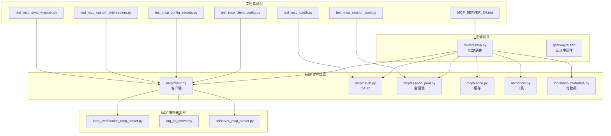
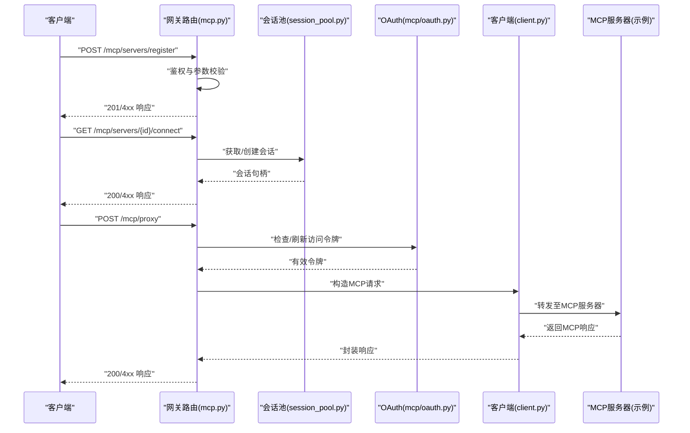
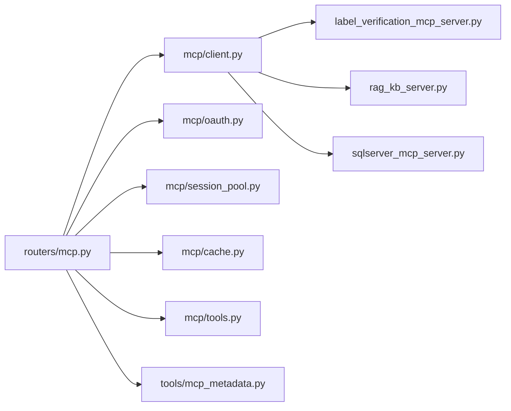

# MCP服务器路由

<cite>
**本文档引用的文件**
- [mcp.py](file://backend/app/gateway/routers/mcp.py)
- [client.py](file://backend/packages/harness/deerflow/mcp/client.py)
- [oauth.py](file://backend/packages/harness/deerflow/mcp/oauth.py)
- [session_pool.py](file://backend/packages/harness/deerflow/mcp/session_pool.py)
- [cache.py](file://backend/packages/harness/deerflow/mcp/cache.py)
- [tools.py](file://backend/packages/harness/deerflow/mcp/tools.py)
- [mcp_metadata.py](file://backend/packages/harness/deerflow/tools/mcp_metadata.py)
- [MCP_SERVER_ZH.md](file://backend/docs/MCP_SERVER_ZH.md)
- [label_verification_mcp_server.py](file://mcp_servers/label_verification_mcp_server.py)
- [rag_kb_server.py](file://mcp_servers/rag_kb_server.py)
- [sqlserver_mcp_server.py](file://mcp_servers/sqlserver_mcp_server.py)
- [test_mcp_oauth.py](file://backend/tests/test_mcp_oauth.py)
- [test_mcp_session_pool.py](file://backend/tests/test_mcp_session_pool.py)
- [test_mcp_client_config.py](file://backend/tests/test_mcp_client_config.py)
- [test_mcp_config_secrets.py](file://backend/tests/test_mcp_config_secrets.py)
- [test_mcp_custom_interceptors.py](file://backend/tests/test_mcp_custom_interceptors.py)
- [test_mcp_sync_wrapper.py](file://backend/tests/test_mcp_sync_wrapper.py)
</cite>

## 目录
1. [简介](#简介)
2. [项目结构](#项目结构)
3. [核心组件](#核心组件)
4. [架构总览](#架构总览)
5. [详细组件分析](#详细组件分析)
6. [依赖关系分析](#依赖关系分析)
7. [性能考虑](#性能考虑)
8. [故障排除指南](#故障排除指南)
9. [结论](#结论)
10. [附录](#附录)

## 简介
本文件面向DeerFlow MCP（Model Context Protocol）服务器路由的技术文档，聚焦于后端网关中MCP路由的REST API设计与实现，涵盖以下主题：
- MCP服务器配置与管理的REST端点：服务器注册、连接管理、会话池维护
- MCP客户端集成：OAuth认证、令牌管理、安全通信协议
- 具体HTTP请求/响应示例：URL模式、请求参数、响应格式与认证流程
- MCP服务器发现机制、负载均衡与故障恢复策略

该文档旨在帮助开发者快速理解并正确集成MCP服务，同时为运维人员提供部署与排障参考。

## 项目结构
MCP相关代码主要分布在以下位置：
- 后端网关路由：`backend/app/gateway/routers/mcp.py`
- MCP客户端与工具库：`backend/packages/harness/deerflow/mcp/`
- MCP服务器示例：`mcp_servers/`
- 文档：`backend/docs/MCP_SERVER_ZH.md`
- 测试用例：`backend/tests/` 下与MCP相关的测试文件

**图表来源**
- [mcp.py](file://backend/app/gateway/routers/mcp.py)
- [client.py](file://backend/packages/harness/deerflow/mcp/client.py)
- [oauth.py](file://backend/packages/harness/deerflow/mcp/oauth.py)
- [session_pool.py](file://backend/packages/harness/deerflow/mcp/session_pool.py)
- [cache.py](file://backend/packages/harness/deerflow/mcp/cache.py)
- [tools.py](file://backend/packages/harness/deerflow/mcp/tools.py)
- [mcp_metadata.py](file://backend/packages/harness/deerflow/tools/mcp_metadata.py)
- [label_verification_mcp_server.py](file://mcp_servers/label_verification_mcp_server.py)
- [rag_kb_server.py](file://mcp_servers/rag_kb_server.py)
- [sqlserver_mcp_server.py](file://mcp_servers/sqlserver_mcp_server.py)
- [MCP_SERVER_ZH.md](file://backend/docs/MCP_SERVER_ZH.md)
- [test_mcp_oauth.py](file://backend/tests/test_mcp_oauth.py)
- [test_mcp_session_pool.py](file://backend/tests/test_mcp_session_pool.py)
- [test_mcp_client_config.py](file://backend/tests/test_mcp_client_config.py)
- [test_mcp_config_secrets.py](file://backend/tests/test_mcp_config_secrets.py)
- [test_mcp_custom_interceptors.py](file://backend/tests/test_mcp_custom_interceptors.py)
- [test_mcp_sync_wrapper.py](file://backend/tests/test_mcp_sync_wrapper.py)

**章节来源**
- [mcp.py](file://backend/app/gateway/routers/mcp.py)
- [MCP_SERVER_ZH.md](file://backend/docs/MCP_SERVER_ZH.md)

## 核心组件
本节概述MCP路由与客户端的关键模块及其职责：
- 路由器（routers/mcp.py）：定义MCP服务器管理与代理调用的REST端点，负责请求转发、鉴权与错误处理
- 客户端（mcp/client.py）：封装与MCP服务器的连接、消息发送与接收、重试与超时控制
- OAuth（mcp/oauth.py）：提供OAuth认证流程、令牌获取与刷新、令牌存储与验证
- 会话池（mcp/session_pool.py）：管理MCP服务器连接的生命周期、复用与健康检查
- 缓存（mcp/cache.py）：缓存MCP元数据与查询结果，降低重复请求开销
- 工具（mcp/tools.py）：提供MCP工具元数据解析、类型转换与校验
- 元数据（tools/mcp_metadata.py）：定义MCP工具与方法的标准描述结构
- 示例服务器（mcp_servers/*.py）：演示如何实现符合MCP协议的服务端

**章节来源**
- [mcp.py](file://backend/app/gateway/routers/mcp.py)
- [client.py](file://backend/packages/harness/deerflow/mcp/client.py)
- [oauth.py](file://backend/packages/harness/deerflow/mcp/oauth.py)
- [session_pool.py](file://backend/packages/harness/deerflow/mcp/session_pool.py)
- [cache.py](file://backend/packages/harness/deerflow/mcp/cache.py)
- [tools.py](file://backend/packages/harness/deerflow/mcp/tools.py)
- [mcp_metadata.py](file://backend/packages/harness/deerflow/tools/mcp_metadata.py)
- [label_verification_mcp_server.py](file://mcp_servers/label_verification_mcp_server.py)
- [rag_kb_server.py](file://mcp_servers/rag_kb_server.py)
- [sqlserver_mcp_server.py](file://mcp_servers/sqlserver_mcp_server.py)

## 架构总览
下图展示了从客户端到MCP服务器的典型调用链路，以及网关路由在其中的作用：

**图表来源**
- [mcp.py](file://backend/app/gateway/routers/mcp.py)
- [session_pool.py](file://backend/packages/harness/deerflow/mcp/session_pool.py)
- [oauth.py](file://backend/packages/harness/deerflow/mcp/oauth.py)
- [client.py](file://backend/packages/harness/deerflow/mcp/client.py)
- [label_verification_mcp_server.py](file://mcp_servers/label_verification_mcp_server.py)

## 详细组件分析

### 路由器（mcp.py）
- 职责
  - 提供MCP服务器注册、连接建立、代理转发等REST端点
  - 实现请求鉴权、参数校验、错误处理与响应封装
- 关键端点
  - 注册服务器：POST /mcp/servers
  - 获取服务器列表：GET /mcp/servers
  - 连接管理：GET /mcp/servers/{id}/connect
  - 代理调用：POST /mcp/proxy
- 处理流程
  - 鉴权中间件拦截请求，提取并验证令牌
  - 参数校验通过后，根据目标服务器选择会话池中的连接
  - 将MCP消息通过客户端库转发至对应服务器
  - 捕获异常并返回标准化错误响应

**章节来源**
- [mcp.py](file://backend/app/gateway/routers/mcp.py)

### 客户端（client.py）
- 职责
  - 维护与MCP服务器的长连接或短连接
  - 发送/接收MCP消息，支持重试与超时控制
  - 对请求进行序列化与响应反序列化
- 关键能力
  - 连接建立与断线重连
  - 请求去重与幂等性保障
  - 错误码映射与异常传播

**章节来源**
- [client.py](file://backend/packages/harness/deerflow/mcp/client.py)

### OAuth认证（oauth.py）
- 职责
  - 实现OAuth授权码/刷新流程
  - 存储与轮换访问令牌，确保安全通信
- 关键流程
  - 获取授权码与交换访问令牌
  - 刷新过期令牌
  - 校验令牌有效性与作用域

**章节来源**
- [oauth.py](file://backend/packages/harness/deerflow/mcp/oauth.py)

### 会话池（session_pool.py）
- 职责
  - 管理多个MCP服务器的连接实例
  - 提供连接复用、健康检查与故障隔离
- 关键机制
  - 连接池容量与超时配置
  - 心跳检测与自动剔除失效连接
  - 负载均衡策略（轮询/权重）

**章节来源**
- [session_pool.py](file://backend/packages/harness/deerflow/mcp/session_pool.py)

### 缓存（cache.py）
- 职责
  - 缓存MCP元数据、工具清单与查询结果
  - 减少重复网络请求，提升响应速度
- 关键策略
  - TTL控制与LRU淘汰
  - 分级缓存与失效通知

**章节来源**
- [cache.py](file://backend/packages/harness/deerflow/mcp/cache.py)

### 工具与元数据（tools.py, mcp_metadata.py）
- 职责
  - 解析与校验MCP工具描述
  - 提供类型转换与默认值处理
- 关键结构
  - 工具元数据模型
  - 方法签名与参数约束

**章节来源**
- [tools.py](file://backend/packages/harness/deerflow/mcp/tools.py)
- [mcp_metadata.py](file://backend/packages/harness/deerflow/tools/mcp_metadata.py)

### 示例MCP服务器（mcp_servers/*.py）
- 功能
  - 展示如何实现符合MCP协议的服务端
  - 包含标签验证、RAG知识库、SQLServer查询等场景
- 集成方式
  - 客户端通过统一的MCP协议与这些服务器交互

**章节来源**
- [label_verification_mcp_server.py](file://mcp_servers/label_verification_mcp_server.py)
- [rag_kb_server.py](file://mcp_servers/rag_kb_server.py)
- [sqlserver_mcp_server.py](file://mcp_servers/sqlserver_mcp_server.py)

## 依赖关系分析
MCP路由与客户端库之间的依赖关系如下：

**图表来源**
- [mcp.py](file://backend/app/gateway/routers/mcp.py)
- [client.py](file://backend/packages/harness/deerflow/mcp/client.py)
- [oauth.py](file://backend/packages/harness/deerflow/mcp/oauth.py)
- [session_pool.py](file://backend/packages/harness/deerflow/mcp/session_pool.py)
- [cache.py](file://backend/packages/harness/deerflow/mcp/cache.py)
- [tools.py](file://backend/packages/harness/deerflow/mcp/tools.py)
- [mcp_metadata.py](file://backend/packages/harness/deerflow/tools/mcp_metadata.py)
- [label_verification_mcp_server.py](file://mcp_servers/label_verification_mcp_server.py)
- [rag_kb_server.py](file://mcp_servers/rag_kb_server.py)
- [sqlserver_mcp_server.py](file://mcp_servers/sqlserver_mcp_server.py)

**章节来源**
- [mcp.py](file://backend/app/gateway/routers/mcp.py)
- [client.py](file://backend/packages/harness/deerflow/mcp/client.py)
- [session_pool.py](file://backend/packages/harness/deerflow/mcp/session_pool.py)

## 性能考虑
- 连接复用与池化
  - 使用会话池减少TCP握手与TLS协商开销
  - 合理设置连接池大小与超时阈值
- 缓存策略
  - 对静态元数据与热点查询结果进行缓存
  - 控制TTL与失效策略，避免缓存雪崩
- 负载均衡
  - 在多服务器场景下采用轮询或基于健康状态的加权策略
- 超时与重试
  - 为代理请求设置合理的超时与指数退避重试
- 并发与背压
  - 限制并发请求数，防止下游拥塞

## 故障排除指南
- 认证失败
  - 检查OAuth令牌是否过期或作用域不足
  - 确认网关路由的鉴权中间件配置
- 连接异常
  - 查看会话池中连接状态与健康检查结果
  - 排查网络连通性与服务器端口监听
- 代理超时
  - 增大超时阈值或优化下游服务器性能
  - 检查客户端重试策略与退避算法
- 数据不一致
  - 清理缓存或调整TTL
  - 校验工具元数据与版本匹配

**章节来源**
- [test_mcp_oauth.py](file://backend/tests/test_mcp_oauth.py)
- [test_mcp_session_pool.py](file://backend/tests/test_mcp_session_pool.py)
- [test_mcp_client_config.py](file://backend/tests/test_mcp_client_config.py)
- [test_mcp_config_secrets.py](file://backend/tests/test_mcp_config_secrets.py)
- [test_mcp_custom_interceptors.py](file://backend/tests/test_mcp_custom_interceptors.py)
- [test_mcp_sync_wrapper.py](file://backend/tests/test_mcp_sync_wrapper.py)

## 结论
本文档系统梳理了DeerFlow MCP服务器路由的架构与实现，明确了后端网关路由、客户端库、认证与会话池等关键组件的职责与交互关系，并提供了HTTP端点、认证流程与故障排除的实用指导。通过遵循本文档的规范与最佳实践，可稳定地集成与扩展MCP服务生态。

## 附录

### HTTP端点与示例
- 服务器注册
  - 方法：POST
  - 路径：/mcp/servers
  - 请求体：包含服务器地址、凭据与元数据
  - 成功响应：201 Created，Location指向新注册的服务器资源
- 获取服务器列表
  - 方法：GET
  - 路径：/mcp/servers
  - 成功响应：200 OK，返回服务器清单
- 连接管理
  - 方法：GET
  - 路径：/mcp/servers/{id}/connect
  - 成功响应：200 OK，返回会话标识
- 代理调用
  - 方法：POST
  - 路径：/mcp/proxy
  - 请求体：MCP消息（如工具调用）
  - 成功响应：200 OK，返回MCP服务器响应

**章节来源**
- [mcp.py](file://backend/app/gateway/routers/mcp.py)

### 认证与安全
- OAuth流程
  - 客户端通过授权码交换访问令牌
  - 网关路由在每次代理请求前检查并刷新令牌
- 令牌管理
  - 支持令牌存储、轮换与失效处理
- 通信安全
  - 建议使用HTTPS与TLS 1.3
  - 严格校验服务器证书与主机名

**章节来源**
- [oauth.py](file://backend/packages/harness/deerflow/mcp/oauth.py)
- [test_mcp_oauth.py](file://backend/tests/test_mcp_oauth.py)

### 服务器发现、负载均衡与故障恢复
- 服务器发现
  - 通过注册中心或配置中心动态发现可用MCP服务器
- 负载均衡
  - 采用轮询或基于健康状态的加权策略
- 故障恢复
  - 自动剔除不可用节点
  - 会话池内重试与熔断保护

**章节来源**
- [session_pool.py](file://backend/packages/harness/deerflow/mcp/session_pool.py)
- [test_mcp_session_pool.py](file://backend/tests/test_mcp_session_pool.py)