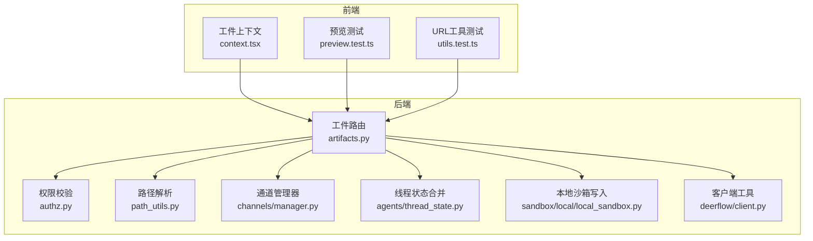
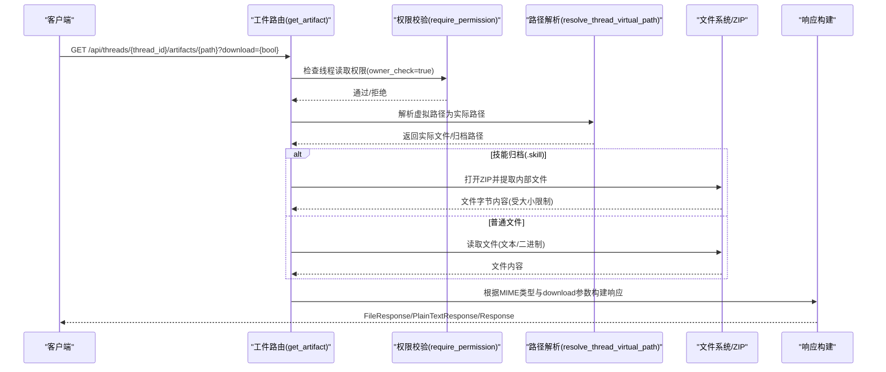
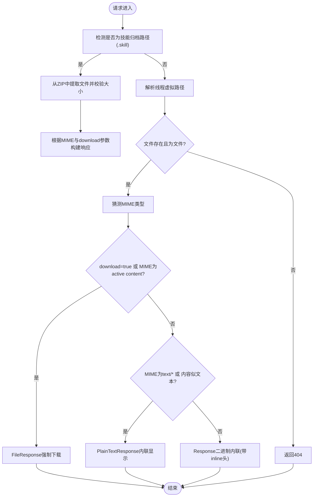
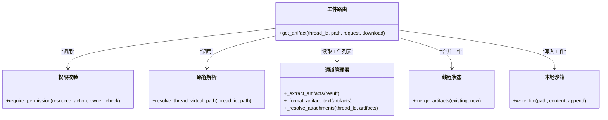
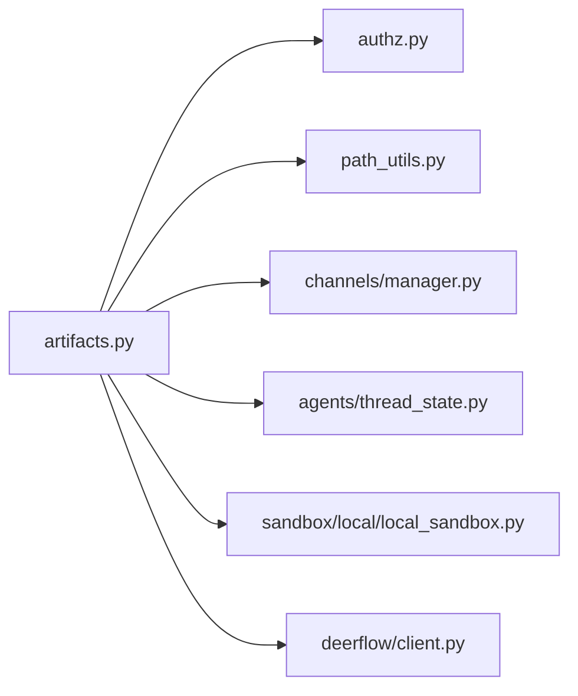

# 工件管理路由

<cite>
**本文引用的文件**
- [artifacts.py](file://backend/app/gateway/routers/artifacts.py)
- [test_artifacts_router.py](file://backend/tests/test_artifacts_router.py)
- [authz.py](file://backend/app/gateway/authz.py)
- [path_utils.py](file://backend/app/gateway/path_utils.py)
- [manager.py](file://backend/app/channels/manager.py)
- [thread_state.py](file://backend/packages/harness/deerflow/agents/thread_state.py)
- [client.py](file://backend/packages/harness/deerflow/client.py)
- [local_sandbox.py](file://backend/packages/harness/deerflow/sandbox/local/local_sandbox.py)
- [context.tsx](file://frontend/src/components/workspace/artifacts/context.tsx)
- [preview.test.ts](file://frontend/tests/unit/core/artifacts/preview.test.ts)
- [utils.test.ts](file://frontend/tests/unit/core/artifacts/utils.test.ts)
</cite>

## 目录
1. [简介](#简介)
2. [项目结构](#项目结构)
3. [核心组件](#核心组件)
4. [架构总览](#架构总览)
5. [详细组件分析](#详细组件分析)
6. [依赖关系分析](#依赖关系分析)
7. [性能考虑](#性能考虑)
8. [故障排除指南](#故障排除指南)
9. [结论](#结论)
10. [附录](#附录)

## 简介
本文件面向DeerFlow后端“工件管理路由”的技术文档，聚焦于工件的创建、检索、更新与删除相关接口，以及与线程、运行（runs）的关系。文档还涵盖工件类型分类、元数据管理、版本控制策略、存储策略（文件系统布局、索引与访问优化）、预览与导出实现，并提供HTTP请求/响应示例、错误处理说明。

## 项目结构
工件管理路由位于后端网关层，采用FastAPI路由模块化组织，配合权限校验与路径解析工具，实现对线程内工件的安全访问与下载预览。前端侧提供工件上下文与URL解析工具，支持在工作区中展示与导航工件。

**图表来源**
- [artifacts.py:15-203](file://backend/app/gateway/routers/artifacts.py#L15-L203)
- [authz.py](file://backend/app/gateway/authz.py)
- [path_utils.py](file://backend/app/gateway/path_utils.py)
- [manager.py](file://backend/app/channels/manager.py)
- [thread_state.py:1-40](file://backend/packages/harness/deerflow/agents/thread_state.py#L1-L40)
- [local_sandbox.py:408-429](file://backend/packages/harness/deerflow/sandbox/local/local_sandbox.py#L408-L429)
- [client.py:1297-1310](file://backend/packages/harness/deerflow/client.py#L1297-L1310)
- [context.tsx:1-96](file://frontend/src/components/workspace/artifacts/context.tsx#L1-L96)
- [preview.test.ts:52-77](file://frontend/tests/unit/core/artifacts/preview.test.ts#L52-L77)
- [utils.test.ts:56-69](file://frontend/tests/unit/core/artifacts/utils.test.ts#L56-L69)

**章节来源**
- [artifacts.py:15-203](file://backend/app/gateway/routers/artifacts.py#L15-L203)
- [context.tsx:1-96](file://frontend/src/components/workspace/artifacts/context.tsx#L1-L96)

## 核心组件
- 工件路由：提供GET /api/threads/{thread_id}/artifacts/{path:path}端点，负责工件读取、类型判定、安全下载与预览。
- 权限校验：基于require_permission装饰器，确保线程级读取权限与所有者检查。
- 路径解析：通过resolve_thread_virtual_path将虚拟路径映射到宿主文件系统实际位置。
- 技能归档支持：对.mnt/user-data/outputs/*.skill内的文件进行解压提取与大小限制。
- 前端工件上下文：维护选中工件、自动选择与打开状态，辅助工作区展示。

**章节来源**
- [artifacts.py:99-203](file://backend/app/gateway/routers/artifacts.py#L99-L203)
- [authz.py](file://backend/app/gateway/authz.py)
- [path_utils.py](file://backend/app/gateway/path_utils.py)
- [context.tsx:34-87](file://frontend/src/components/workspace/artifacts/context.tsx#L34-L87)

## 架构总览
工件路由在后端的调用链路如下：客户端请求经由FastAPI路由进入get_artifact，随后进行权限校验与路径解析，再根据内容类型与查询参数决定返回方式（内联文本、二进制流或强制下载）。对于技能归档场景，先从ZIP中提取目标文件并应用大小限制，最后返回响应。

**图表来源**
- [artifacts.py:99-203](file://backend/app/gateway/routers/artifacts.py#L99-L203)
- [authz.py](file://backend/app/gateway/authz.py)
- [path_utils.py](file://backend/app/gateway/path_utils.py)

## 详细组件分析

### 工件路由与端点设计
- 路径模式：/api/threads/{thread_id}/artifacts/{path:path}
- 方法：GET
- 查询参数：
  - download: 是否强制以附件下载（默认false）
- 权限要求：threads.read，且执行所有者检查
- 安全策略：
  - 对active content（text/html、application/xhtml+xml、image/svg+xml）一律强制下载
  - 技能归档成员大小上限限制，防止过大文件导致内存压力
  - 路径解析严格限定在线程虚拟根下，避免路径穿越

**图表来源**
- [artifacts.py:138-203](file://backend/app/gateway/routers/artifacts.py#L138-L203)

**章节来源**
- [artifacts.py:99-203](file://backend/app/gateway/routers/artifacts.py#L99-L203)

### 工件类型分类与元数据管理
- 类型判定：
  - MIME类型：通过mimetypes.guess_type推断
  - 文本判定：is_text_file_by_content通过采样检测空字节判断
- 元数据：
  - Content-Disposition：使用RFC 5987编码的文件名
  - 缓存控制：技能归档预览设置Cache-Control: private, max-age=300
- 版本控制：
  - 仓库未发现显式版本字段或版本表结构；工件版本通常由文件名或时间戳体现，或通过线程/运行上下文关联

**章节来源**
- [artifacts.py:39-48](file://backend/app/gateway/routers/artifacts.py#L39-L48)
- [artifacts.py:161-163](file://backend/app/gateway/routers/artifacts.py#L161-L163)

### 存储策略与访问优化
- 文件系统布局：
  - 虚拟路径前缀：mnt/user-data/outputs
  - 实际宿主映射：通过resolve_thread_virtual_path完成
- 索引机制：
  - 未见专用索引；工件列表通常由通道管理器收集附件路径，再由线程状态合并
- 访问优化：
  - 技能归档预览缓存：针对ZIP内文件设置短期缓存
  - 大小限制：单成员最大16MB，分块读取避免内存峰值

**章节来源**
- [artifacts.py:23-24](file://backend/app/gateway/routers/artifacts.py#L23-L24)
- [artifacts.py:50-63](file://backend/app/gateway/routers/artifacts.py#L50-L63)
- [manager.py:397-497](file://backend/app/channels/manager.py#L397-L497)

### 工件与线程、运行的关系
- 线程关联：路径解析以thread_id为边界，确保跨线程隔离
- 运行集成：通道管理器负责从消息结果中提取工件路径，线程状态合并最新工件列表
- 客户端访问：本地沙箱写入文件时会记录agent_written_paths，便于后续读取与反向解析

**图表来源**
- [artifacts.py:104-105](file://backend/app/gateway/routers/artifacts.py#L104-L105)
- [path_utils.py](file://backend/app/gateway/path_utils.py)
- [manager.py:397-497](file://backend/app/channels/manager.py#L397-L497)
- [thread_state.py:1-40](file://backend/packages/harness/deerflow/agents/thread_state.py#L1-L40)
- [local_sandbox.py:408-429](file://backend/packages/harness/deerflow/sandbox/local/local_sandbox.py#L408-L429)

**章节来源**
- [manager.py:397-497](file://backend/app/channels/manager.py#L397-L497)
- [thread_state.py:1-40](file://backend/packages/harness/deerflow/agents/thread_state.py#L1-L40)
- [local_sandbox.py:408-429](file://backend/packages/harness/deerflow/sandbox/local/local_sandbox.py#L408-L429)

### 预览与导出实现
- 预览策略：
  - 文本类MIME直接内联显示
  - 二进制类MIME默认内联，但不强制下载
  - Active content（HTML/XHTML/SVG）强制下载，避免脚本执行风险
- 导出行为：
  - download=true时强制下载
  - 技能归档中的文件同样遵循上述规则
- 前端支持：
  - 工件上下文维护选中项与打开状态
  - URL工具测试验证了虚拟路径到演示URL的转换

**章节来源**
- [artifacts.py:164-174](file://backend/app/gateway/routers/artifacts.py#L164-L174)
- [artifacts.py:188-194](file://backend/app/gateway/routers/artifacts.py#L188-L194)
- [context.tsx:34-87](file://frontend/src/components/workspace/artifacts/context.tsx#L34-L87)
- [utils.test.ts:56-69](file://frontend/tests/unit/core/artifacts/utils.test.ts#L56-L69)

### HTTP请求与响应示例
- 获取文本文件（内联）
  - 请求：GET /api/threads/{thread_id}/artifacts/mnt/user-data/outputs/notes.txt
  - 响应：200 OK，Content-Type: text/plain；正文为文件内容
- 下载CSV文件
  - 请求：GET /api/threads/{thread_id}/artifacts/mnt/user-data/outputs/data.csv?download=true
  - 响应：200 OK，Content-Disposition: attachment；正文为二进制CSV
- 获取SVG文件（强制下载）
  - 请求：GET /api/threads/{thread_id}/artifacts/mnt/user-data/outputs/pic.svg
  - 响应：200 OK，Content-Disposition: attachment；正文为SVG二进制
- 技能归档内文件预览
  - 请求：GET /api/threads/{thread_id}/artifacts/mnt/user-data/outputs/sample.skill/SKILL.md
  - 响应：200 OK，Content-Type: text/markdown；正文为文件内容；设置Cache-Control: private, max-age=300
- 错误场景
  - 404：文件不存在或不在技能归档中
  - 400：路径不是文件或非法
  - 403：权限不足或路径穿越检测
  - 413：技能归档成员过大

**章节来源**
- [artifacts.py:128-137](file://backend/app/gateway/routers/artifacts.py#L128-L137)
- [test_artifacts_router.py:25-44](file://backend/tests/test_artifacts_router.py#L25-L44)
- [test_artifacts_router.py:46-57](file://backend/tests/test_artifacts_router.py#L46-L57)
- [test_artifacts_router.py:73-87](file://backend/tests/test_artifacts_router.py#L73-L87)
- [test_artifacts_router.py:90-105](file://backend/tests/test_artifacts_router.py#L90-L105)
- [test_artifacts_router.py:108-119](file://backend/tests/test_artifacts_router.py#L108-L119)

## 依赖关系分析
- 组件耦合：
  - 工件路由强依赖权限校验与路径解析模块
  - 与通道管理器、线程状态存在间接依赖（通过附件路径与合并逻辑）
- 外部依赖：
  - mimetypes用于MIME推断
  - zipfile用于技能归档读取
  - FastAPI FileResponse/PlainTextResponse用于响应构建

**图表来源**
- [artifacts.py:10-11](file://backend/app/gateway/routers/artifacts.py#L10-L11)
- [authz.py](file://backend/app/gateway/authz.py)
- [path_utils.py](file://backend/app/gateway/path_utils.py)
- [manager.py](file://backend/app/channels/manager.py)
- [thread_state.py:1-40](file://backend/packages/harness/deerflow/agents/thread_state.py#L1-L40)
- [local_sandbox.py:408-429](file://backend/packages/harness/deerflow/sandbox/local/local_sandbox.py#L408-L429)
- [client.py:1297-1310](file://backend/packages/harness/deerflow/client.py#L1297-L1310)

**章节来源**
- [artifacts.py:10-11](file://backend/app/gateway/routers/artifacts.py#L10-L11)

## 性能考虑
- 技能归档预览：
  - 单成员大小限制与分块读取，避免内存峰值与长时间阻塞
  - 设置短期缓存减少重复解压开销
- 文本检测：
  - 采样读取避免全量读取大文件
- MIME推断：
  - 使用系统mimetypes库，性能稳定

**章节来源**
- [artifacts.py:23-24](file://backend/app/gateway/routers/artifacts.py#L23-L24)
- [artifacts.py:50-63](file://backend/app/gateway/routers/artifacts.py#L50-L63)
- [artifacts.py:39-48](file://backend/app/gateway/routers/artifacts.py#L39-L48)

## 故障排除指南
- 404文件未找到
  - 检查路径是否正确、是否在技能归档内存在
  - 确认resolve_thread_virtual_path映射是否有效
- 400路径不是文件或非法
  - 确保path指向具体文件而非目录
- 403权限不足
  - 确认当前用户对线程具有threads.read权限
- 413技能归档成员过大
  - 减小单个归档成员体积或调整MAX_SKILL_ARCHIVE_MEMBER_BYTES
- 预览异常
  - Active content会强制下载，如需内联请使用download=false（仅对非active content生效）

**章节来源**
- [artifacts.py:176-184](file://backend/app/gateway/routers/artifacts.py#L176-L184)
- [artifacts.py:188-194](file://backend/app/gateway/routers/artifacts.py#L188-L194)
- [test_artifacts_router.py:108-119](file://backend/tests/test_artifacts_router.py#L108-L119)

## 结论
工件管理路由通过严格的权限校验、路径解析与类型判定，实现了对线程内工件的安全访问与灵活预览/导出。结合技能归档的大小限制与缓存策略，兼顾了安全性与性能。未来可在以下方面进一步完善：引入显式的工件版本字段与版本历史、增强工件索引与元数据持久化、扩展批量操作与权限继承策略。

## 附录
- 前端工件上下文与URL工具测试验证了虚拟路径到演示URL的转换，有助于在工作区中定位与打开工件。

**章节来源**
- [context.tsx:34-87](file://frontend/src/components/workspace/artifacts/context.tsx#L34-L87)
- [utils.test.ts:56-69](file://frontend/tests/unit/core/artifacts/utils.test.ts#L56-L69)