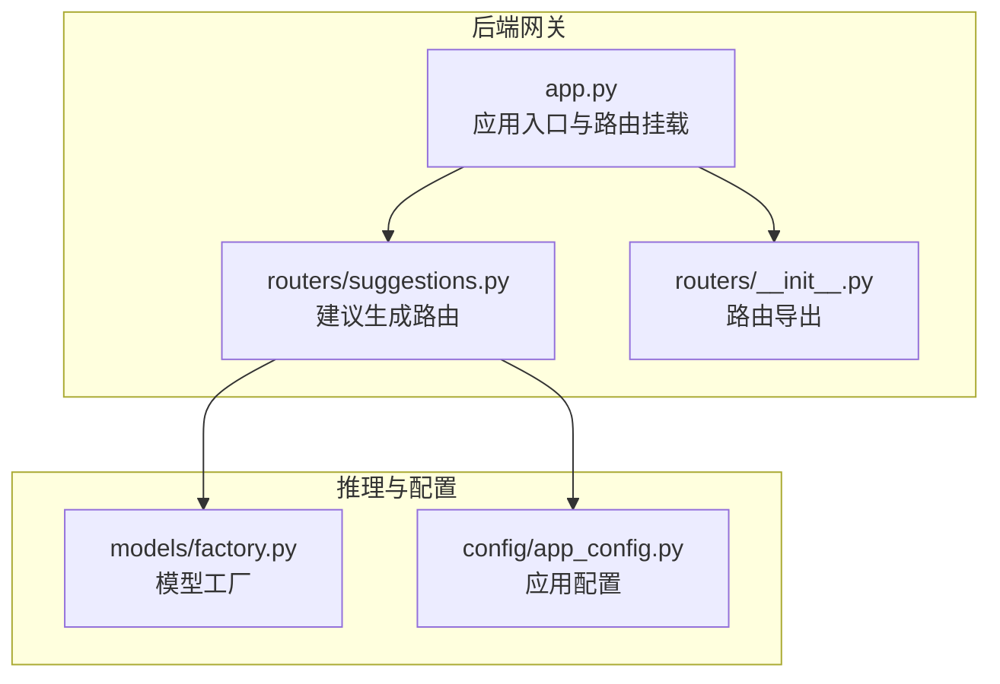
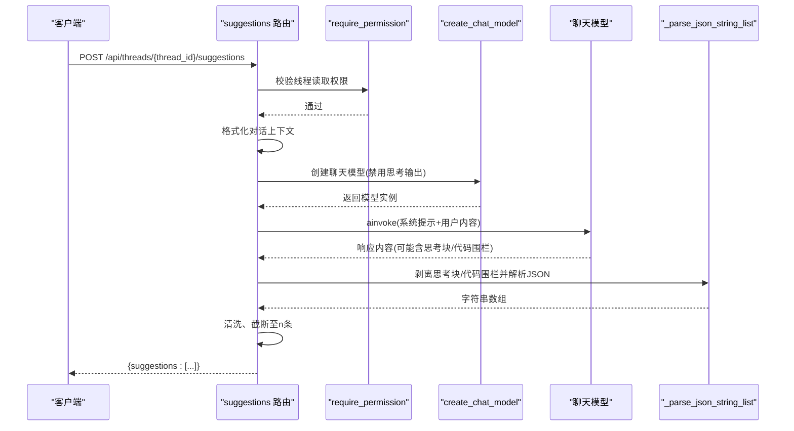
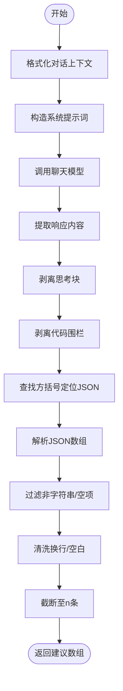
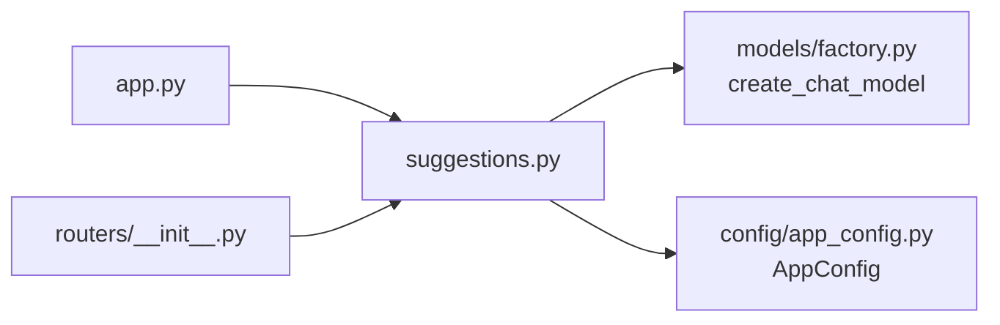
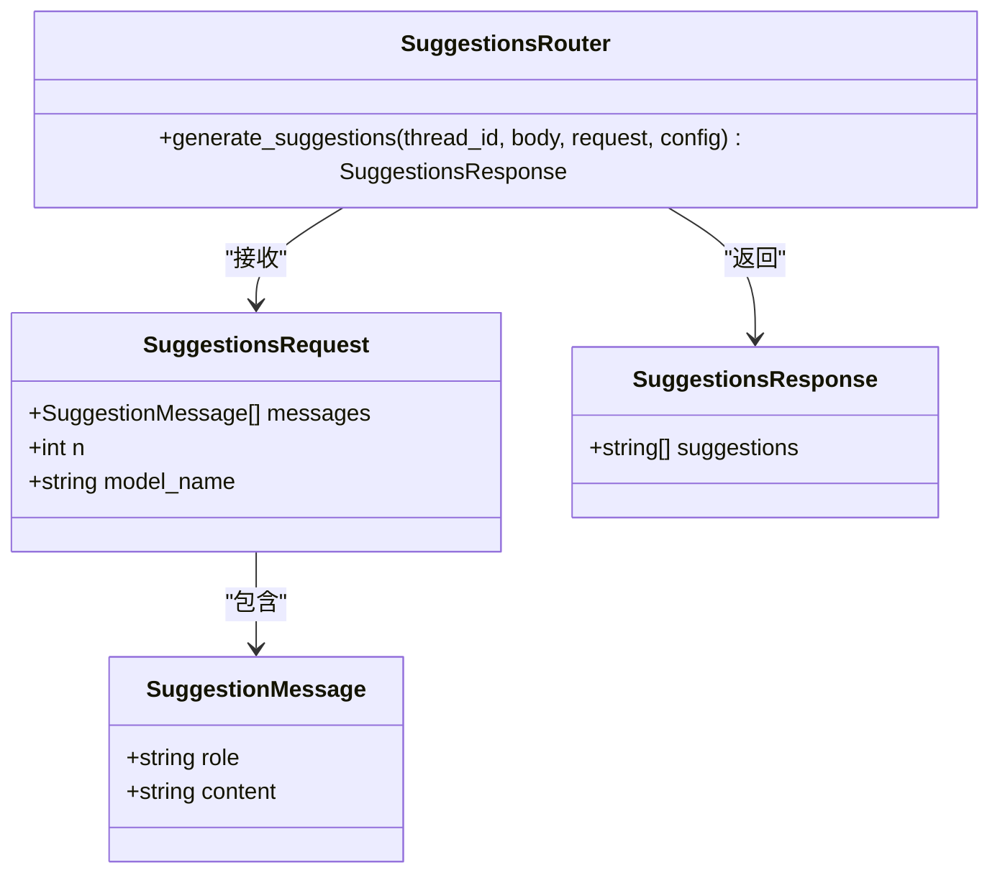

# 建议生成路由

<cite>
**本文引用的文件**
- [suggestions.py](file://backend/app/gateway/routers/suggestions.py)
- [app.py](file://backend/app/gateway/app.py)
- [__init__.py（routers）](file://backend/app/gateway/routers/__init__.py)
- [test_suggestions_router.py](file://backend/tests/test_suggestions_router.py)
- [app_config.py](file://backend/packages/harness/deerflow/config/app_config.py)
- [factory.py（models）](file://backend/packages/harness/deerflow/models/factory.py)
</cite>

## 目录
1. [简介](#简介)
2. [项目结构](#项目结构)
3. [核心组件](#核心组件)
4. [架构总览](#架构总览)
5. [详细组件分析](#详细组件分析)
6. [依赖分析](#依赖分析)
7. [性能考虑](#性能考虑)
8. [故障排查指南](#故障排查指南)
9. [结论](#结论)
10. [附录](#附录)

## 简介
本文件面向DeerFlow的“建议生成路由”，系统性阐述基于对话上下文生成后续问题建议的REST API端点设计与实现细节。内容涵盖：
- 接口定义：URL模式、请求参数、响应格式
- 上下文分析与建议算法：消息格式化、系统提示词、解析与清洗策略
- 触发条件与处理流程：权限校验、错误回退、运行追踪
- 质量评估机制：思考块剥离、JSON提取、长度与语言一致性
- 个性化与上下文关系：建议数量、角色映射、语言适配
- 具体HTTP请求/响应示例与建议模板

## 项目结构
建议生成路由位于后端网关层，采用FastAPI路由模块化组织，通过应用入口统一挂载。

图表来源
- [app.py:377-378](file://backend/app/gateway/app.py#L377-L378)
- [suggestions.py:15-16](file://backend/app/gateway/routers/suggestions.py#L15-L16)
- [__init__.py（routers）:0-2](file://backend/app/gateway/routers/__init__.py#L0-L2)
- [factory.py（models）](file://backend/packages/harness/deerflow/models/factory.py)
- [app_config.py](file://backend/packages/harness/deerflow/config/app_config.py)

章节来源
- [app.py:377-378](file://backend/app/gateway/app.py#L377-L378)
- [suggestions.py:15-16](file://backend/app/gateway/routers/suggestions.py#L15-L16)
- [__init__.py（routers）:0-2](file://backend/app/gateway/routers/__init__.py#L0-L2)

## 核心组件
- 路由器与端点
  - 路由前缀与标签：/api，标签为“suggestions”
  - 端点路径：/threads/{thread_id}/suggestions
  - 方法：POST
  - 权限：require_permission("threads","read", owner_check=True)
- 请求体模型
  - messages：最近对话消息列表（至少1条）
  - n：建议数量（默认3，范围[1,5]）
  - model_name：可选模型覆盖
- 响应体模型
  - suggestions：字符串数组，建议的后续问题
- 内部工具函数
  - 对话格式化：按角色拼接文本
  - 响应提取：兼容字符串与多段内容
  - JSON解析：剥离思考块与代码围栏，提取数组
  - 清洗与截断：去除空白、换行，限制数量

章节来源
- [suggestions.py:16-32](file://backend/app/gateway/routers/suggestions.py#L16-L32)
- [suggestions.py:125-131](file://backend/app/gateway/routers/suggestions.py#L125-L131)
- [suggestions.py:112-123](file://backend/app/gateway/routers/suggestions.py#L112-L123)
- [suggestions.py:94-110](file://backend/app/gateway/routers/suggestions.py#L94-L110)
- [suggestions.py:69-91](file://backend/app/gateway/routers/suggestions.py#L69-L91)

## 架构总览
建议生成的调用链路如下：

图表来源
- [suggestions.py:131-168](file://backend/app/gateway/routers/suggestions.py#L131-L168)
- [suggestions.py:158-165](file://backend/app/gateway/routers/suggestions.py#L158-L165)
- [suggestions.py:40-56](file://backend/app/gateway/routers/suggestions.py#L40-L56)
- [suggestions.py:59-66](file://backend/app/gateway/routers/suggestions.py#L59-L66)
- [suggestions.py:69-91](file://backend/app/gateway/routers/suggestions.py#L69-L91)
- [suggestions.py:94-110](file://backend/app/gateway/routers/suggestions.py#L94-L110)

## 详细组件分析

### 端点定义与权限
- URL模式：/api/threads/{thread_id}/suggestions
- 方法：POST
- 权限：线程读取权限(owner_check启用)，确保仅线程所有者或授权主体可访问
- 运行追踪：调用时设置run_name为"suggest_agent"，便于链路追踪

章节来源
- [suggestions.py:125-131](file://backend/app/gateway/routers/suggestions.py#L125-L131)
- [suggestions.py:131-131](file://backend/app/gateway/routers/suggestions.py#L131-L131)
- [suggestions.py:159-160](file://backend/app/gateway/routers/suggestions.py#L159-L160)

### 请求与响应数据模型
- 请求体
  - messages：消息列表，每条包含role与content
  - n：建议数量，默认3，最小1，最大5
  - model_name：可选，用于覆盖默认模型
- 响应体
  - suggestions：字符串数组，每个元素为一条建议

章节来源
- [suggestions.py:19-32](file://backend/app/gateway/routers/suggestions.py#L19-L32)

### 对话上下文分析与格式化
- 角色映射：user/human → User，assistant/ai → Assistant，其他保持原样
- 拼接规则：每条消息一行，形如“Role: Content”
- 语言一致性：系统提示要求输出与用户语言一致（由底层模型决定）

章节来源
- [suggestions.py:112-123](file://backend/app/gateway/routers/suggestions.py#L112-L123)

### 建议算法与质量控制
- 系统提示词要点
  - 明确生成目标：基于对话生成后续问题
  - 输出要求：严格JSON数组；不带编号、Markdown或额外文本
  - 长度约束：每条建议尽量简洁（≤20英文单词或≤40中文字符）
  - 数量约束：精确产出n条
- 响应解析与清洗
  - 思考块剥离：移除<think>... </think>及未闭合的<think>片段
  - 代码围栏剥离：识别并去除三引号包裹的代码块
  - JSON提取：定位方括号，解析数组，过滤空值与非字符串项
  - 清洗：去除换行、多余空白，保留前n条

图表来源
- [suggestions.py:146-155](file://backend/app/gateway/routers/suggestions.py#L146-L155)
- [suggestions.py:158-165](file://backend/app/gateway/routers/suggestions.py#L158-L165)
- [suggestions.py:40-56](file://backend/app/gateway/routers/suggestions.py#L40-L56)
- [suggestions.py:59-66](file://backend/app/gateway/routers/suggestions.py#L59-L66)
- [suggestions.py:69-91](file://backend/app/gateway/routers/suggestions.py#L69-L91)

### 触发条件与处理流程
- 触发条件
  - 必须提供至少1条消息
  - 线程存在且当前用户有读取权限
- 处理流程
  - 校验消息列表与上下文有效性
  - 组装系统提示词与用户内容
  - 创建禁用思考输出的聊天模型
  - 异步调用模型并解析响应
  - 清洗与截断，返回结果
- 错误回退
  - 任何异常均记录日志并返回空数组，保证接口稳定性

章节来源
- [suggestions.py:138-144](file://backend/app/gateway/routers/suggestions.py#L138-L144)
- [suggestions.py:158-168](file://backend/app/gateway/routers/suggestions.py#L158-L168)

### 个性化与上下文关系
- 个性化维度
  - 建议数量：由n参数控制
  - 语言适配：系统提示要求与用户语言一致
  - 角色感知：根据消息角色区分用户与助手
- 上下文利用
  - 使用最近对话作为生成依据
  - 通过系统提示词强调相关性与简洁性

章节来源
- [suggestions.py:24-27](file://backend/app/gateway/routers/suggestions.py#L24-L27)
- [suggestions.py:146-155](file://backend/app/gateway/routers/suggestions.py#L146-L155)
- [suggestions.py:112-123](file://backend/app/gateway/routers/suggestions.py#L112-L123)

### HTTP请求/响应示例与建议模板
- 请求示例
  - URL：POST /api/threads/{thread_id}/suggestions
  - 请求头：Content-Type: application/json
  - 请求体：
    - messages: [{role: "user", content: "..."}, {role: "assistant", content: "..."}]
    - n: 3
    - model_name: 可选
  - 成功响应：
    - 200 OK
    - 响应体：{suggestions: ["问题1", "问题2", "问题3"]}
  - 失败响应：
    - 403 Forbidden 或 500 Internal Server Error
    - 响应体：{suggestions: []}

- 建议模板
  - 语言：与用户输入一致
  - 结构：简洁短语，避免编号与Markdown
  - 数量：严格n条

章节来源
- [suggestions.py:125-131](file://backend/app/gateway/routers/suggestions.py#L125-L131)
- [suggestions.py:146-155](file://backend/app/gateway/routers/suggestions.py#L146-L155)
- [suggestions.py:161-165](file://backend/app/gateway/routers/suggestions.py#L161-L165)

## 依赖分析
- 路由注册
  - 应用入口在启动时挂载suggestions路由
- 模型工厂
  - create_chat_model负责创建聊天模型实例，支持禁用思考输出
- 配置注入
  - 通过Depends(get_config)注入AppConfig，供模型工厂使用

图表来源
- [suggestions.py:10-12](file://backend/app/gateway/routers/suggestions.py#L10-L12)
- [suggestions.py:159-160](file://backend/app/gateway/routers/suggestions.py#L159-L160)
- [app.py:377-378](file://backend/app/gateway/app.py#L377-L378)
- [__init__.py（routers）:0-2](file://backend/app/gateway/routers/__init__.py#L0-L2)

章节来源
- [app.py:377-378](file://backend/app/gateway/app.py#L377-L378)
- [__init__.py（routers）:0-2](file://backend/app/gateway/routers/__init__.py#L0-L2)
- [suggestions.py:10-12](file://backend/app/gateway/routers/suggestions.py#L10-L12)
- [suggestions.py:159-160](file://backend/app/gateway/routers/suggestions.py#L159-L160)

## 性能考虑
- 异步调用：使用异步模型调用，降低阻塞风险
- 最小必要解析：仅提取方括号内的JSON数组，减少无关文本处理
- 截断与清洗：在解析后进行截断与清洗，避免下游处理负担
- 错误隔离：异常捕获与回退，避免级联失败

## 故障排查指南
- 常见问题
  - 响应为空：检查messages是否为空或上下文无效；确认系统提示词是否被正确传入
  - JSON解析失败：确认模型输出是否为标准JSON数组；检查是否存在未闭合<think>或代码围栏
  - 权限拒绝：确认当前用户对thread_id拥有读取权限
- 定位手段
  - 查看日志：端点会记录异常详情
  - 单元测试参考：测试覆盖了思考块剥离、代码围栏剥离、JSON解析与截断等关键路径
- 修复建议
  - 确保模型输出符合要求（纯JSON数组，不含额外文本）
  - 在上游确保消息列表有效且包含至少1条消息
  - 如需调试，可在本地复现测试用例中的场景

章节来源
- [suggestions.py:166-168](file://backend/app/gateway/routers/suggestions.py#L166-L168)
- [test_suggestions_router.py:28-46](file://backend/tests/test_suggestions_router.py#L28-L46)
- [test_suggestions_router.py:57-59](file://backend/tests/test_suggestions_router.py#L57-L59)
- [test_suggestions_router.py:157-172](file://backend/tests/test_suggestions_router.py#L157-L172)

## 结论
建议生成路由以简洁稳健的方式实现了基于对话上下文的后续问题生成。其核心优势在于：
- 明确的权限边界与线程隔离
- 鲁棒的响应解析与清洗策略
- 可配置的建议数量与禁用思考输出的模型行为
- 可观测的运行追踪与完善的错误回退

该设计既满足了易用性，又兼顾了生产环境的稳定性与可维护性。

## 附录

### 类与方法关系图（代码级）

图表来源
- [suggestions.py:19-32](file://backend/app/gateway/routers/suggestions.py#L19-L32)
- [suggestions.py:131-137](file://backend/app/gateway/routers/suggestions.py#L131-L137)