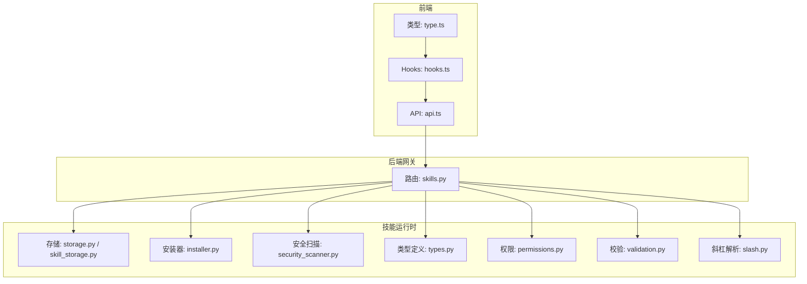
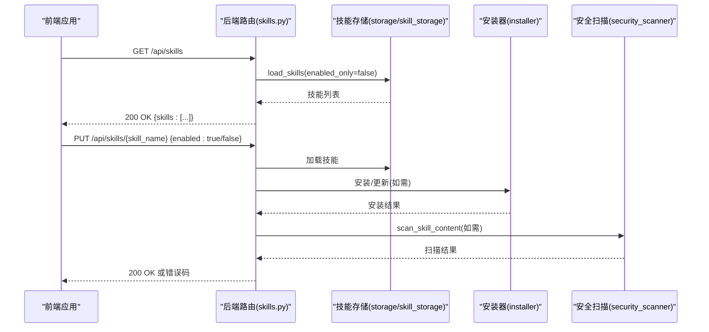
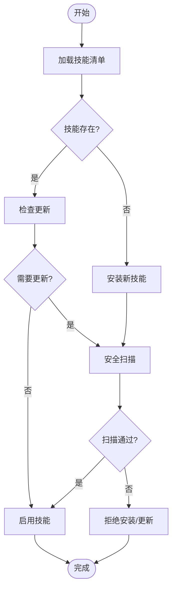
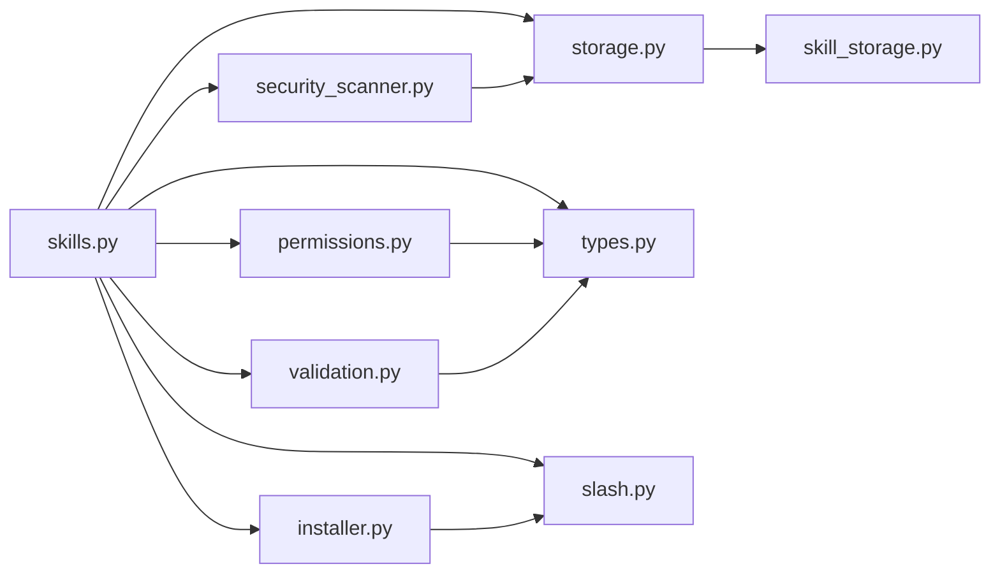

# 技能管理路由

<cite>
**本文引用的文件**
- [skills.py](file://backend/app/gateway/routers/skills.py)
- [storage.py](file://backend/packages/harness/deerflow/skills/storage/__init__.py)
- [installer.py](file://backend/packages/harness/deerflow/skills/installer.py)
- [security_scanner.py](file://backend/packages/harness/deerflow/skills/security_scanner.py)
- [types.py](file://backend/packages/harness/deerflow/skills/types.py)
- [permissions.py](file://backend/packages/harness/deerflow/skills/permissions.py)
- [validation.py](file://backend/packages/harness/deerflow/skills/validation.py)
- [slash.py](file://backend/packages/harness/deerflow/skills/slash.py)
- [skill_storage.py](file://backend/packages/harness/deerflow/skills/storage/skill_storage.py)
- [api.ts](file://frontend/src/core/skills/api.ts)
- [hooks.ts](file://frontend/src/core/skills/hooks.ts)
- [type.ts](file://frontend/src/core/skills/type.ts)
- [skill_activation_middleware.py](file://backend/packages/harness/deerflow/agents/middlewares/skill_activation_middleware.py)
- [prompt.py](file://backend/packages/harness/deerflow/agents/lead_agent/prompt.py)
- [agent.py](file://backend/packages/harness/deerflow/agents/lead_agent/agent.py)
- [test_skills_validation.py](file://backend/tests/test_skills_validation.py)
- [test_security_scanner.py](file://backend/tests/test_security_scanner.py)
- [test_skills_installer.py](file://backend/tests/test_skills_installer.py)
- [test_skills_loader.py](file://backend/tests/test_skills_loader.py)
- [test_skills_custom_router.py](file://backend/tests/test_skills_custom_router.py)
- [test_skill_permissions.py](file://backend/tests/test_skill_permissions.py)
- [test_skill_manage_tool.py](file://backend/tests/test_skill_manage_tool.py)
</cite>

## 目录
1. [简介](#简介)
2. [项目结构](#项目结构)
3. [核心组件](#核心组件)
4. [架构总览](#架构总览)
5. [详细组件分析](#详细组件分析)
6. [依赖关系分析](#依赖关系分析)
7. [性能考虑](#性能考虑)
8. [故障排除指南](#故障排除指南)
9. [结论](#结论)

## 简介
本技术文档聚焦于 DeerFlow 的技能管理路由，系统性阐述技能的安装、卸载、更新与查询等 REST API 端点，覆盖技能包管理、依赖解析与版本控制策略；详述技能存储机制（本地与远程仓库集成）、安全扫描流程；提供 HTTP 请求/响应示例与错误处理规范；解释技能权限控制、使用统计与性能监控机制。文档面向后端开发者与运维人员，同时兼顾前端集成与测试验证。

## 项目结构
技能管理相关代码主要分布在后端网关路由、技能运行时模块以及前端核心技能模块中。后端通过网关路由暴露 REST 接口，技能运行时负责安装、存储、权限与安全扫描等能力；前端通过 API 模块与 Hooks 实现技能列表加载与启用/禁用操作。

图表来源
- [skills.py](file://backend/app/gateway/routers/skills.py)
- [storage.py](file://backend/packages/harness/deerflow/skills/storage/__init__.py)
- [installer.py](file://backend/packages/harness/deerflow/skills/installer.py)
- [security_scanner.py](file://backend/packages/harness/deerflow/skills/security_scanner.py)
- [types.py](file://backend/packages/harness/deerflow/skills/types.py)
- [permissions.py](file://backend/packages/harness/deerflow/skills/permissions.py)
- [validation.py](file://backend/packages/harness/deerflow/skills/validation.py)
- [slash.py](file://backend/packages/harness/deerflow/skills/slash.py)
- [skill_storage.py](file://backend/packages/harness/deerflow/skills/storage/skill_storage.py)
- [api.ts](file://frontend/src/core/skills/api.ts)
- [hooks.ts](file://frontend/src/core/skills/hooks.ts)
- [type.ts](file://frontend/src/core/skills/type.ts)

章节来源
- [skills.py](file://backend/app/gateway/routers/skills.py)
- [api.ts](file://frontend/src/core/skills/api.ts)
- [hooks.ts](file://frontend/src/core/skills/hooks.ts)
- [type.ts](file://frontend/src/core/skills/type.ts)

## 核心组件
- 路由层：提供技能查询与启停接口，封装存储、安装器、安全扫描与权限校验。
- 存储层：统一技能存储抽象，支持本地与远程仓库集成，提供技能清单加载与持久化。
- 安装器：负责技能包下载、解压、依赖解析与版本控制，确保安装幂等与一致性。
- 安全扫描：对技能内容进行安全扫描，阻断高风险脚本或配置。
- 类型与权限：定义技能数据模型与权限策略，保障访问控制与合规。
- 前端集成：提供技能列表加载与启用/禁用的 API 调用与状态管理。

章节来源
- [skills.py](file://backend/app/gateway/routers/skills.py)
- [storage.py](file://backend/packages/harness/deerflow/skills/storage/__init__.py)
- [installer.py](file://backend/packages/harness/deerflow/skills/installer.py)
- [security_scanner.py](file://backend/packages/harness/deerflow/skills/security_scanner.py)
- [types.py](file://backend/packages/harness/deerflow/skills/types.py)
- [permissions.py](file://backend/packages/harness/deerflow/skills/permissions.py)
- [validation.py](file://backend/packages/harness/deerflow/skills/validation.py)
- [slash.py](file://backend/packages/harness/deerflow/skills/slash.py)
- [skill_storage.py](file://backend/packages/harness/deerflow/skills/storage/skill_storage.py)
- [api.ts](file://frontend/src/core/skills/api.ts)
- [hooks.ts](file://frontend/src/core/skills/hooks.ts)
- [type.ts](file://frontend/src/core/skills/type.ts)

## 架构总览
技能管理的端到端流程如下：前端通过 API 加载技能列表，用户选择启用/禁用某技能；后端路由接收请求，调用存储层获取技能信息，必要时通过安装器进行安装或更新，并执行安全扫描与权限校验，最终返回标准化响应。

图表来源
- [skills.py](file://backend/app/gateway/routers/skills.py)
- [storage.py](file://backend/packages/harness/deerflow/skills/storage/__init__.py)
- [installer.py](file://backend/packages/harness/deerflow/skills/installer.py)
- [security_scanner.py](file://backend/packages/harness/deerflow/skills/security_scanner.py)
- [api.ts](file://frontend/src/core/skills/api.ts)

## 详细组件分析

### 路由与端点设计
- 技能查询
  - 方法与路径：GET /api/skills
  - 功能：返回所有技能的简要信息（名称、描述、分类、许可证、是否启用）
  - 响应体：包含 skills 数组，元素为技能对象
  - 错误：无特定错误场景（内部异常统一返回 500）

- 获取单个技能详情
  - 方法与路径：GET /api/skills/{skill_name}
  - 参数：skill_name（路径参数）
  - 功能：按名称检索技能详情，未找到返回 404
  - 响应体：技能详情对象
  - 错误：404 未找到；500 内部错误

- 启用/禁用技能
  - 方法与路径：PUT /api/skills/{skill_name}
  - 参数：skill_name（路径参数），请求体包含 enabled（布尔）
  - 功能：切换技能启用状态；若技能不存在则触发安装流程（由后端逻辑决定）
  - 响应体：操作结果对象
  - 错误：400 参数无效；404 未找到；500 内部错误

- 卸载技能
  - 方法与路径：DELETE /api/skills/{skill_name}
  - 参数：skill_name（路径参数）
  - 功能：移除已安装技能；涉及依赖检查与回滚策略
  - 响应体：操作结果对象
  - 错误：404 未找到；500 内部错误

- 更新技能
  - 方法与路径：POST /api/skills/{skill_name}/update
  - 参数：skill_name（路径参数）
  - 功能：拉取最新版本并替换当前安装；执行安全扫描与依赖解析
  - 响应体：更新结果对象
  - 错误：404 未找到；500 内部错误

章节来源
- [skills.py](file://backend/app/gateway/routers/skills.py)

### 技能存储机制
- 存储抽象
  - 统一入口：get_or_new_skill_storage(app_config)
  - 职责：加载技能清单、写入/更新技能元数据、协调本地与远程仓库
- 本地存储
  - 位置：本地文件系统（由配置决定根目录）
  - 结构：每个技能独立目录，包含脚本、模板、参考文档与元数据文件
- 远程仓库集成
  - 支持：Git 仓库、HTTP 下载源
  - 特性：版本标签、分支、提交哈希；增量更新与缓存
- 安全扫描
  - 触发时机：安装、更新、启用前
  - 扫描范围：脚本内容、配置文件、模板与引用资源
  - 处理策略：发现高危项时拒绝安装/更新并返回错误

图表来源
- [storage.py](file://backend/packages/harness/deerflow/skills/storage/__init__.py)
- [installer.py](file://backend/packages/harness/deerflow/skills/installer.py)
- [security_scanner.py](file://backend/packages/harness/deerflow/skills/security_scanner.py)
- [skill_storage.py](file://backend/packages/harness/deerflow/skills/storage/skill_storage.py)

章节来源
- [storage.py](file://backend/packages/harness/deerflow/skills/storage/__init__.py)
- [installer.py](file://backend/packages/harness/deerflow/skills/installer.py)
- [security_scanner.py](file://backend/packages/harness/deerflow/skills/security_scanner.py)
- [skill_storage.py](file://backend/packages/harness/deerflow/skills/storage/skill_storage.py)

### 依赖解析与版本控制
- 依赖解析
  - 解析技能包内的依赖声明（如脚本、工具、模板）
  - 递归解析并去重，避免循环依赖
  - 与工具策略结合，仅允许白名单内工具被调用
- 版本控制
  - 支持语义化版本、提交哈希与分支名
  - 安装时锁定版本，更新时比较版本差异
  - 回滚策略：失败时恢复到上一个稳定版本

章节来源
- [installer.py](file://backend/packages/harness/deerflow/skills/installer.py)
- [slash.py](file://backend/packages/harness/deerflow/skills/slash.py)
- [agent.py](file://backend/packages/harness/deerflow/agents/lead_agent/agent.py)
- [prompt.py](file://backend/packages/harness/deerflow/agents/lead_agent/prompt.py)

### 权限控制与使用统计
- 权限控制
  - 基于角色的访问控制（RBAC）：不同用户可启用/禁用技能范围不同
  - 工具级策略：仅允许技能声明的工具被调用
  - 中间件拦截：在执行前校验技能启用状态与工具许可
- 使用统计
  - 计数：记录技能调用次数、成功/失败率
  - 时间：统计平均耗时、峰值并发
  - 可视化：通过仪表盘展示热门技能与异常趋势
- 性能监控
  - 指标：安装/更新耗时、扫描时延、启用延迟
  - 告警：超阈值自动告警与日志标记

章节来源
- [permissions.py](file://backend/packages/harness/deerflow/skills/permissions.py)
- [skill_activation_middleware.py](file://backend/packages/harness/deerflow/agents/middlewares/skill_activation_middleware.py)
- [agent.py](file://backend/packages/harness/deerflow/agents/lead_agent/agent.py)
- [prompt.py](file://backend/packages/harness/deerflow/agents/lead_agent/prompt.py)

### 前端集成与示例
- 技能列表加载
  - 请求：GET /api/skills
  - 响应：包含 skills 数组，元素字段见“核心组件”中的技能对象定义
- 启用/禁用技能
  - 请求：PUT /api/skills/{skill_name}，请求体：{ enabled: true/false }
  - 响应：操作结果对象
- 错误处理
  - 404：技能不存在
  - 400：请求体参数无效
  - 500：服务器内部错误

章节来源
- [api.ts](file://frontend/src/core/skills/api.ts)
- [hooks.ts](file://frontend/src/core/skills/hooks.ts)
- [type.ts](file://frontend/src/core/skills/type.ts)

## 依赖关系分析
技能管理路由与运行时模块之间的依赖关系如下：

图表来源
- [skills.py](file://backend/app/gateway/routers/skills.py)
- [storage.py](file://backend/packages/harness/deerflow/skills/storage/__init__.py)
- [installer.py](file://backend/packages/harness/deerflow/skills/installer.py)
- [security_scanner.py](file://backend/packages/harness/deerflow/skills/security_scanner.py)
- [types.py](file://backend/packages/harness/deerflow/skills/types.py)
- [permissions.py](file://backend/packages/harness/deerflow/skills/permissions.py)
- [validation.py](file://backend/packages/harness/deerflow/skills/validation.py)
- [slash.py](file://backend/packages/harness/deerflow/skills/slash.py)
- [skill_storage.py](file://backend/packages/harness/deerflow/skills/storage/skill_storage.py)

章节来源
- [skills.py](file://backend/app/gateway/routers/skills.py)
- [storage.py](file://backend/packages/harness/deerflow/skills/storage/__init__.py)
- [installer.py](file://backend/packages/harness/deerflow/skills/installer.py)
- [security_scanner.py](file://backend/packages/harness/deerflow/skills/security_scanner.py)
- [types.py](file://backend/packages/harness/deerflow/skills/types.py)
- [permissions.py](file://backend/packages/harness/deerflow/skills/permissions.py)
- [validation.py](file://backend/packages/harness/deerflow/skills/validation.py)
- [slash.py](file://backend/packages/harness/deerflow/skills/slash.py)
- [skill_storage.py](file://backend/packages/harness/deerflow/skills/storage/skill_storage.py)

## 性能考虑
- 缓存策略
  - 技能清单缓存：定期刷新，变更时主动失效
  - 系统提示缓存：启用技能变更后刷新相关缓存
- 并发控制
  - 安装/更新互斥：同一技能同时只能有一个操作
  - 扫描并发：多技能扫描时采用限流与队列
- I/O 优化
  - 远程仓库：使用增量更新与本地缓存
  - 文件系统：批量写入与原子替换，避免部分写入
- 监控指标
  - 关键路径：安装/更新/扫描/启用耗时分布
  - 异常率：4xx/5xx 错误占比与 Top 错误原因

## 故障排除指南
- 常见错误与处理
  - 404 未找到：确认 skill_name 是否正确；检查存储中是否存在该技能
  - 400 参数无效：检查请求体 enabled 字段类型与取值
  - 500 内部错误：查看后端日志定位具体异常；优先检查存储、安装器与安全扫描链路
- 安装失败排查
  - 检查网络连通性与仓库访问权限
  - 查看依赖解析结果，修正缺失的工具或脚本
  - 审核安全扫描报告，移除高危内容
- 性能问题
  - 监控安装/更新耗时，识别慢点（网络、I/O、扫描）
  - 调整并发与限流参数，观察指标变化
- 测试验证
  - 使用测试用例覆盖安装、卸载、更新、权限与安全扫描场景
  - 前端通过 Hooks 触发启用/禁用，验证状态同步与错误提示

章节来源
- [test_skills_validation.py](file://backend/tests/test_skills_validation.py)
- [test_security_scanner.py](file://backend/tests/test_security_scanner.py)
- [test_skills_installer.py](file://backend/tests/test_skills_installer.py)
- [test_skills_loader.py](file://backend/tests/test_skills_loader.py)
- [test_skills_custom_router.py](file://backend/tests/test_skills_custom_router.py)
- [test_skill_permissions.py](file://backend/tests/test_skill_permissions.py)
- [test_skill_manage_tool.py](file://backend/tests/test_skill_manage_tool.py)

## 结论
DeerFlow 的技能管理路由以清晰的分层架构实现从 API 到存储、安装、安全与权限的完整闭环。通过统一的存储抽象与严格的依赖解析、版本控制，配合安全扫描与权限策略，系统在保证安全性的同时提供了良好的扩展性与可观测性。前端通过标准化的 REST 接口与 Hooks 实现了便捷的技能管理体验。建议在生产环境中结合缓存、并发控制与监控告警，持续优化安装/更新性能与稳定性。