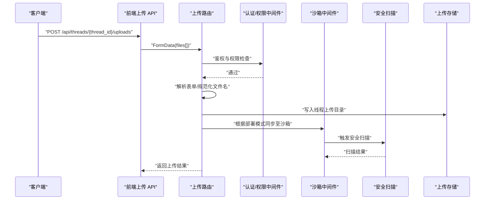
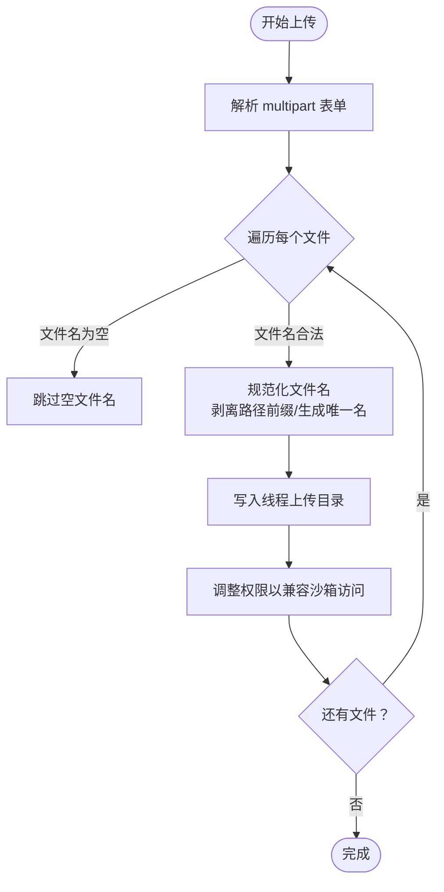
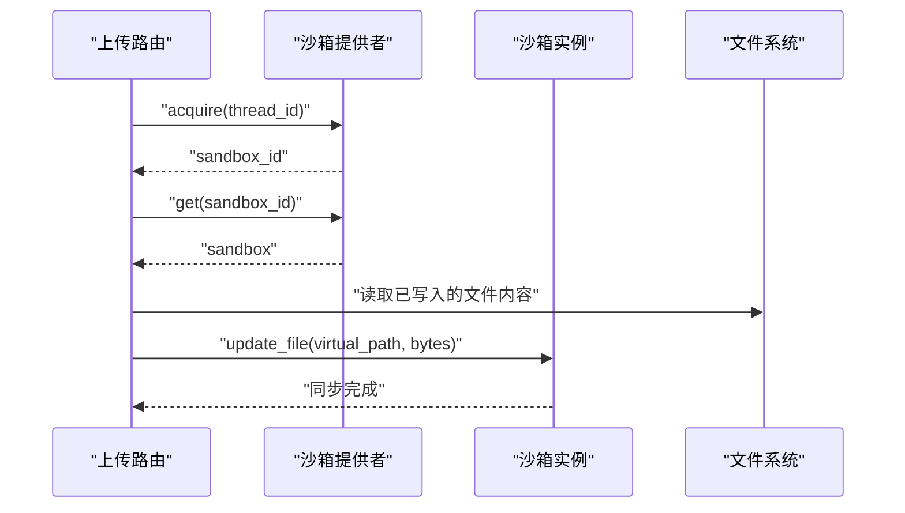
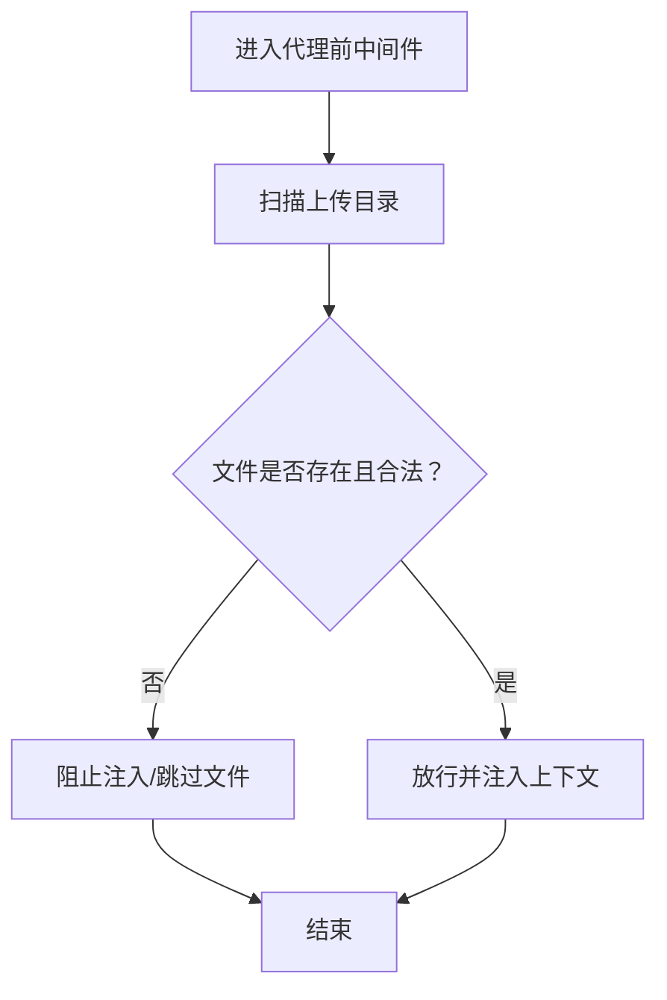
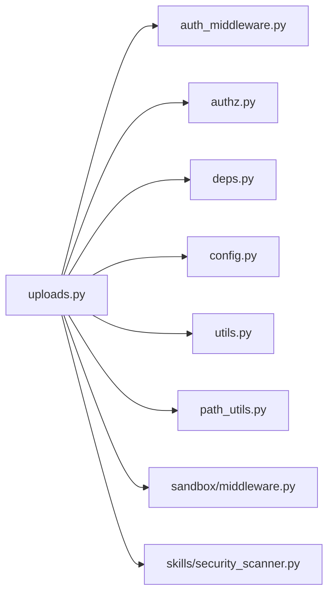

# 文件上传路由

<cite>
**本文引用的文件**
- [backend/app/gateway/routers/uploads.py](file://backend/app/gateway/routers/uploads.py)
- [backend/docs/FILE_UPLOAD.md](file://backend/docs/FILE_UPLOAD.md)
- [frontend/src/core/uploads/api.ts](file://frontend/src/core/uploads/api.ts)
- [backend/tests/test_uploads_router.py](file://backend/tests/test_uploads_router.py)
- [backend/tests/test_uploads_middleware_core_logic.py](file://backend/tests/test_uploads_middleware_core_logic.py)
- [backend/tests/blocking_io/test_uploads_middleware.py](file://backend/tests/blocking_io/test_uploads_middleware.py)
- [backend/app/gateway/deps.py](file://backend/app/gateway/deps.py)
- [backend/app/gateway/auth_middleware.py](file://backend/app/gateway/auth_middleware.py)
- [backend/app/gateway/authz.py](file://backend/app/gateway/authz.py)
- [backend/app/gateway/services.py](file://backend/app/gateway/services.py)
- [backend/app/gateway/utils.py](file://backend/app/gateway/utils.py)
- [backend/app/gateway/pagination.py](file://backend/app/gateway/pagination.py)
- [backend/app/gateway/path_utils.py](file://backend/app/gateway/path_utils.py)
- [backend/app/gateway/config.py](file://backend/app/gateway/config.py)
- [backend/app/gateway/csrf_middleware.py](file://backend/app/gateway/csrf_middleware.py)
- [backend/app/gateway/internal_auth.py](file://backend/app/gateway/internal_auth.py)
- [backend/app/gateway/langgraph_auth.py](file://backend/app/gateway/langgraph_auth.py)
- [backend/app/gateway/app.py](file://backend/app/gateway/app.py)
- [backend/app/harness/deerflow/sandbox/middleware.py](file://backend/app/harness/deerflow/sandbox/middleware.py)
- [backend/app/harness/deerflow/sandbox/security.py](file://backend/app/harness/deerflow/sandbox/security.py)
- [backend/app/harness/deerflow/uploads/manager.py](file://backend/app/harness/deerflow/uploads/manager.py)
- [backend/app/harness/deerflow/skills/security_scanner.py](file://backend/app/harness/deerflow/skills/security_scanner.py)
- [backend/app/harness/deerflow/utils/file_conversion.py](file://backend/app/harness/deerflow/utils/file_conversion.py)
</cite>

## 目录
1. [简介](#简介)
2. [项目结构](#项目结构)
3. [核心组件](#核心组件)
4. [架构总览](#架构总览)
5. [详细组件分析](#详细组件分析)
6. [依赖关系分析](#依赖关系分析)
7. [性能考虑](#性能考虑)
8. [故障排除指南](#故障排除指南)
9. [结论](#结论)
10. [附录](#附录)

## 简介
本文件上传路由技术文档面向后端开发者与运维人员，系统性阐述 DeerFlow 的文件上传、下载与管理能力。文档覆盖以下要点：
- REST API 端点定义与使用方式（上传、列出、删除）
- 多部分表单处理流程与参数规范
- 文件类型验证与大小限制策略
- 上传中间件的安全扫描、沙箱隔离与临时存储管理
- 元数据管理、访问控制与清理策略
- HTTP 请求/响应示例与错误处理机制

## 项目结构
文件上传功能由后端网关路由模块提供，并与沙箱安全中间件、权限控制、配置与工具模块协同工作。

```mermaid
graph TB
subgraph "前端"
FE_API["前端上传 API<br/>frontend/src/core/uploads/api.ts"]
end
subgraph "后端网关"
ROUTER["上传路由<br/>backend/app/gateway/routers/uploads.py"]
DEPS["依赖注入<br/>backend/app/gateway/deps.py"]
AUTHZ["权限控制<br/>backend/app/gateway/authz.py"]
AUTH_MW["认证中间件<br/>backend/app/gateway/auth_middleware.py"]
CSRF_MW["CSRF 中间件<br/>backend/app/gateway/csrf_middleware.py"]
CFG["配置<br/>backend/app/gateway/config.py"]
UTILS["工具函数<br/>backend/app/gateway/utils.py"]
PATH["路径工具<br/>backend/app/gateway/path_utils.py"]
end
subgraph "运行时与沙箱"
SANDBOX_MW["沙箱中间件<br/>backend/app/harness/deerflow/sandbox/middleware.py"]
SANDBOX_SEC["沙箱安全<br/>backend/app/harness/deerflow/sandbox/security.py"]
UPLOADS_MGR["上传管理器<br/>backend/app/harness/deerflow/uploads/manager.py"]
SEC_SCANNER["安全扫描器<br/>backend/app/harness/deerflow/skills/security_scanner.py"]
end
FE_API --> ROUTER
ROUTER --> AUTH_MW
ROUTER --> CSRF_MW
ROUTER --> AUTHZ
ROUTER --> DEPS
ROUTER --> CFG
ROUTER --> UTILS
ROUTER --> PATH
ROUTER --> SANDBOX_MW
ROUTER --> SANDBOX_SEC
ROUTER --> UPLOADS_MGR
ROUTER --> SEC_SCANNER
```

图表来源
- [backend/app/gateway/routers/uploads.py:229-357](file://backend/app/gateway/routers/uploads.py#L229-L357)
- [frontend/src/core/uploads/api.ts:63-108](file://frontend/src/core/uploads/api.ts#L63-L108)
- [backend/app/gateway/deps.py](file://backend/app/gateway/deps.py)
- [backend/app/gateway/auth_middleware.py](file://backend/app/gateway/auth_middleware.py)
- [backend/app/gateway/authz.py](file://backend/app/gateway/authz.py)
- [backend/app/gateway/csrf_middleware.py](file://backend/app/gateway/csrf_middleware.py)
- [backend/app/gateway/config.py](file://backend/app/gateway/config.py)
- [backend/app/gateway/utils.py](file://backend/app/gateway/utils.py)
- [backend/app/gateway/path_utils.py](file://backend/app/gateway/path_utils.py)
- [backend/app/harness/deerflow/sandbox/middleware.py](file://backend/app/harness/deerflow/sandbox/middleware.py)
- [backend/app/harness/deerflow/sandbox/security.py](file://backend/app/harness/deerflow/sandbox/security.py)
- [backend/app/harness/deerflow/uploads/manager.py](file://backend/app/harness/deerflow/uploads/manager.py)
- [backend/app/harness/deerflow/skills/security_scanner.py](file://backend/app/harness/deerflow/skills/security_scanner.py)

章节来源
- [backend/app/gateway/routers/uploads.py:229-357](file://backend/app/gateway/routers/uploads.py#L229-L357)
- [frontend/src/core/uploads/api.ts:63-108](file://frontend/src/core/uploads/api.ts#L63-L108)

## 核心组件
- 上传路由模块：提供上传、列出与删除接口，负责多部分表单解析、文件规范化、权限校验与沙箱同步。
- 沙箱中间件与安全模块：确保上传内容在沙箱环境中可被后续技能安全访问，执行安全扫描与隔离。
- 上传管理器：封装上传目录、虚拟路径映射与文件写入策略。
- 安全扫描器：对上传文件进行病毒/恶意内容检测。
- 权限与认证：基于 JWT 与权限模型，确保仅授权用户可操作指定线程的文件。
- 工具与配置：路径工具、通用工具函数与应用配置（含上传限制）。

章节来源
- [backend/app/gateway/routers/uploads.py:229-357](file://backend/app/gateway/routers/uploads.py#L229-L357)
- [backend/app/harness/deerflow/uploads/manager.py](file://backend/app/harness/deerflow/uploads/manager.py)
- [backend/app/harness/deerflow/sandbox/middleware.py](file://backend/app/harness/deerflow/sandbox/middleware.py)
- [backend/app/harness/deerflow/skills/security_scanner.py](file://backend/app/harness/deerflow/skills/security_scanner.py)
- [backend/app/gateway/authz.py](file://backend/app/gateway/authz.py)
- [backend/app/gateway/auth_middleware.py](file://backend/app/gateway/auth_middleware.py)
- [backend/app/gateway/config.py](file://backend/app/gateway/config.py)
- [backend/app/gateway/utils.py](file://backend/app/gateway/utils.py)
- [backend/app/gateway/path_utils.py](file://backend/app/gateway/path_utils.py)

## 架构总览
下图展示从客户端到后端网关再到沙箱与安全扫描的整体流程。

图表来源
- [frontend/src/core/uploads/api.ts:63-108](file://frontend/src/core/uploads/api.ts#L63-L108)
- [backend/app/gateway/routers/uploads.py:229-357](file://backend/app/gateway/routers/uploads.py#L229-L357)
- [backend/app/gateway/auth_middleware.py](file://backend/app/gateway/auth_middleware.py)
- [backend/app/gateway/authz.py](file://backend/app/gateway/authz.py)
- [backend/app/harness/deerflow/sandbox/middleware.py](file://backend/app/harness/deerflow/sandbox/middleware.py)
- [backend/app/harness/deerflow/skills/security_scanner.py](file://backend/app/harness/deerflow/skills/security_scanner.py)

## 详细组件分析

### 1) REST API 端点与请求响应
- 上传文件
  - 方法与路径：POST /api/threads/{thread_id}/uploads
  - 内容类型：multipart/form-data
  - 表单字段：files[]（可多次提交，每个为一个文件）
  - 成功响应：包含上传成功的文件列表、消息与可选的跳过文件列表
  - 错误响应：HTTP 4xx/5xx，包含错误详情
- 列出文件
  - 方法与路径：GET /api/threads/{thread_id}/uploads/list
  - 成功响应：包含文件计数与文件数组
  - 错误响应：HTTP 4xx/5xx
- 删除文件
  - 方法与路径：DELETE /api/threads/{thread_id}/uploads/{filename}
  - 成功响应：包含 success 与 message
  - 错误响应：HTTP 4xx/5xx

请求/响应示例（基于测试与文档）
- 上传示例
  - URL：/api/threads/{thread_id}/uploads
  - 方法：POST
  - 头部：Content-Type: multipart/form-data
  - 参数：files[]（二进制文件）
  - 成功响应字段：success（布尔）、files[]（对象数组，包含 filename、size、virtual_path、artifact_url 等）、message（字符串）、skipped_files（可选）
- 列出示例
  - URL：/api/threads/{thread_id}/uploads/list
  - 方法：GET
  - 成功响应字段：count（整数）、files[]（对象数组）
- 删除示例
  - URL：/api/threads/{thread_id}/uploads/{filename}
  - 方法：DELETE
  - 成功响应字段：success（布尔）、message（字符串）

章节来源
- [frontend/src/core/uploads/api.ts:63-108](file://frontend/src/core/uploads/api.ts#L63-L108)
- [backend/docs/FILE_UPLOAD.md:275-315](file://backend/docs/FILE_UPLOAD.md#L275-L315)
- [backend/app/gateway/routers/uploads.py:229-357](file://backend/app/gateway/routers/uploads.py#L229-L357)

### 2) 多部分表单处理与文件规范化
- 解析与遍历：后端逐个处理表单中的文件项，过滤空文件名并进行安全规范化。
- 文件名规范化：剥离路径前缀，避免目录穿越；生成唯一文件名以防止覆盖冲突。
- 权限设置：上传文件以 0o600 创建，同时确保组和其他用户具备读权限，以便沙箱可访问。
- 跳过策略：遇到不安全或非法文件名时记录并跳过，不影响其他文件上传。

图表来源
- [backend/app/gateway/routers/uploads.py:229-357](file://backend/app/gateway/routers/uploads.py#L229-L357)

章节来源
- [backend/app/gateway/routers/uploads.py:229-357](file://backend/app/gateway/routers/uploads.py#L229-L357)

### 3) 沙箱隔离与同步
- 沙箱提供者：根据部署模式选择是否需要将文件同步到沙箱。
- 同步策略：
  - 使用线程数据挂载：直接写入挂载目录，无需额外同步。
  - 使用本地沙箱：Acquire 沙箱实例，将文件内容更新到沙箱虚拟路径。
- 权限与可访问性：在同步到沙箱之前提升文件可写权限，确保沙箱进程可读取。

图表来源
- [backend/app/gateway/routers/uploads.py:229-357](file://backend/app/gateway/routers/uploads.py#L229-L357)
- [backend/app/harness/deerflow/sandbox/middleware.py](file://backend/app/harness/deerflow/sandbox/middleware.py)

章节来源
- [backend/app/gateway/routers/uploads.py:229-357](file://backend/app/gateway/routers/uploads.py#L229-L357)

### 4) 安全扫描与中间件
- 上传中间件：在代理调用前扫描上传目录，确保仅存在合法文件，防止注入与历史消息污染。
- 测试验证：中间件不会阻塞事件循环，且在无 thread_id 时不进行历史扫描。
- 安全扫描器：对上传文件执行病毒/恶意内容检测，扫描结果影响后续处理。

图表来源
- [backend/tests/test_uploads_middleware_core_logic.py:78-395](file://backend/tests/test_uploads_middleware_core_logic.py#L78-L395)
- [backend/tests/blocking_io/test_uploads_middleware.py:34-56](file://backend/tests/blocking_io/test_uploads_middleware.py#L34-L56)
- [backend/app/harness/deerflow/skills/security_scanner.py](file://backend/app/harness/deerflow/skills/security_scanner.py)

章节来源
- [backend/tests/test_uploads_middleware_core_logic.py:78-395](file://backend/tests/test_uploads_middleware_core_logic.py#L78-L395)
- [backend/tests/blocking_io/test_uploads_middleware.py:34-56](file://backend/tests/blocking_io/test_uploads_middleware.py#L34-L56)

### 5) 文件类型验证与大小限制
- 类型验证：通过文件扩展名与 MIME 类型进行白名单/黑名单控制（具体规则以配置为准）。
- 大小限制：受应用配置控制，超过限制的文件会被拒绝或跳过。
- 自动转换：可选启用文档类文件的自动转换（如 PDF→文本），便于后续处理。

章节来源
- [backend/app/gateway/routers/uploads.py:229-357](file://backend/app/gateway/routers/uploads.py#L229-L357)
- [backend/docs/FILE_UPLOAD.md:275-315](file://backend/docs/FILE_UPLOAD.md#L275-L315)

### 6) 元数据管理与访问控制
- 元数据：每个上传文件包含文件名、大小、虚拟路径与可访问 URL 等信息。
- 访问控制：基于线程维度与用户身份进行权限校验，确保用户只能操作自己的文件。
- 清理策略：删除接口支持按文件名精确删除；历史上传目录定期清理由运维策略决定。

章节来源
- [backend/app/gateway/routers/uploads.py:229-357](file://backend/app/gateway/routers/uploads.py#L229-L357)
- [backend/app/gateway/authz.py](file://backend/app/gateway/authz.py)
- [backend/app/gateway/auth_middleware.py](file://backend/app/gateway/auth_middleware.py)

### 7) 下载与预览
- 下载：通过返回的 artifact_url 或虚拟路径进行下载。
- 预览：可扩展预览端点以支持浏览器内直接查看（开发建议见文档）。

章节来源
- [backend/app/gateway/routers/uploads.py:229-357](file://backend/app/gateway/routers/uploads.py#L229-L357)
- [backend/docs/FILE_UPLOAD.md:275-315](file://backend/docs/FILE_UPLOAD.md#L275-L315)

## 依赖关系分析
- 路由依赖：上传路由依赖认证中间件、权限控制、配置、工具与路径工具。
- 沙箱依赖：上传路由根据沙箱提供者决定同步策略；沙箱中间件与安全模块共同保障隔离与安全。
- 测试依赖：单元测试覆盖上传行为、安全性与中间件逻辑，确保不阻塞事件循环。

图表来源
- [backend/app/gateway/routers/uploads.py:229-357](file://backend/app/gateway/routers/uploads.py#L229-L357)
- [backend/app/gateway/auth_middleware.py](file://backend/app/gateway/auth_middleware.py)
- [backend/app/gateway/authz.py](file://backend/app/gateway/authz.py)
- [backend/app/gateway/deps.py](file://backend/app/gateway/deps.py)
- [backend/app/gateway/config.py](file://backend/app/gateway/config.py)
- [backend/app/gateway/utils.py](file://backend/app/gateway/utils.py)
- [backend/app/gateway/path_utils.py](file://backend/app/gateway/path_utils.py)
- [backend/app/harness/deerflow/sandbox/middleware.py](file://backend/app/harness/deerflow/sandbox/middleware.py)
- [backend/app/harness/deerflow/skills/security_scanner.py](file://backend/app/harness/deerflow/skills/security_scanner.py)

章节来源
- [backend/app/gateway/routers/uploads.py:229-357](file://backend/app/gateway/routers/uploads.py#L229-L357)

## 性能考虑
- 异步与非阻塞：上传中间件测试表明扫描过程不会阻塞事件循环，适合高并发场景。
- 存储策略：优先使用线程数据挂载减少同步开销；在需要沙箱访问时再进行增量同步。
- 文件权限：一次性设置可读权限，避免重复 I/O 操作。
- 批量处理：前端以 FormData 多文件提交，后端逐个处理并记录跳过文件，便于可观测性。

## 故障排除指南
- 上传失败
  - 检查文件名是否为空或包含非法字符（例如“.”、“..”），这些会被跳过。
  - 确认线程 ID 是否正确，权限是否允许当前用户访问该线程。
  - 查看响应中的 message 与 skipped_files 字段，定位问题文件。
- 沙箱不可访问
  - 确认沙箱提供者已正确 Acquire 并获取实例。
  - 检查文件权限是否已调整为沙箱可读。
- 安全扫描异常
  - 关注安全扫描器返回状态，必要时重新上传或联系管理员。
- 删除失败
  - 确认文件名拼写与大小写一致；确认目标线程存在且可访问。

章节来源
- [backend/tests/test_uploads_router.py:525-636](file://backend/tests/test_uploads_router.py#L525-L636)
- [backend/tests/test_uploads_middleware_core_logic.py:78-395](file://backend/tests/test_uploads_middleware_core_logic.py#L78-L395)
- [backend/app/gateway/routers/uploads.py:229-357](file://backend/app/gateway/routers/uploads.py#L229-L357)

## 结论
DeerFlow 的文件上传路由通过严格的文件名规范化、权限控制与沙箱同步，实现了安全、可控且可扩展的文件管理能力。配合上传中间件与安全扫描器，系统在保证隔离与安全的同时，提供了良好的用户体验与可观测性。建议在生产环境结合配置策略与监控告警，持续优化上传性能与安全性。

## 附录
- 前端集成参考：参考前端上传 API 的实现与示例，确保正确构造 multipart/form-data。
- 扩展建议：可按需增加文件预览、批量删除、搜索与版本控制等能力。

章节来源
- [frontend/src/core/uploads/api.ts:63-108](file://frontend/src/core/uploads/api.ts#L63-L108)
- [backend/docs/FILE_UPLOAD.md:275-315](file://backend/docs/FILE_UPLOAD.md#L275-L315)