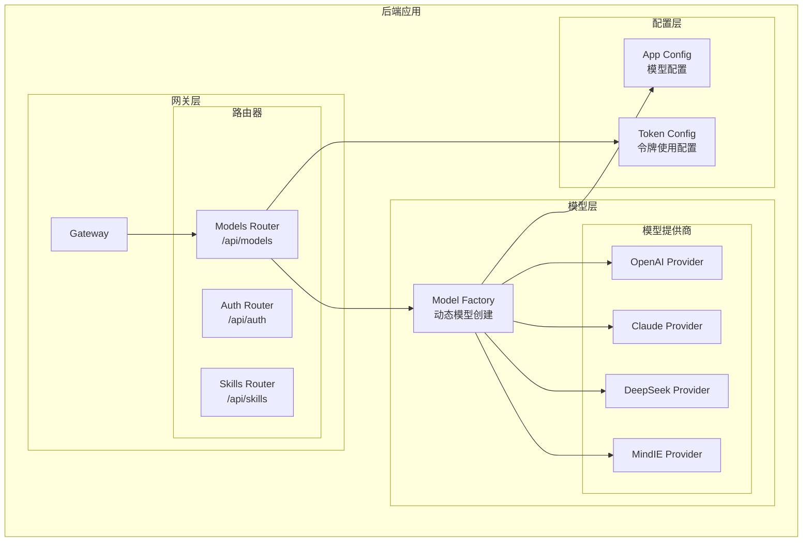
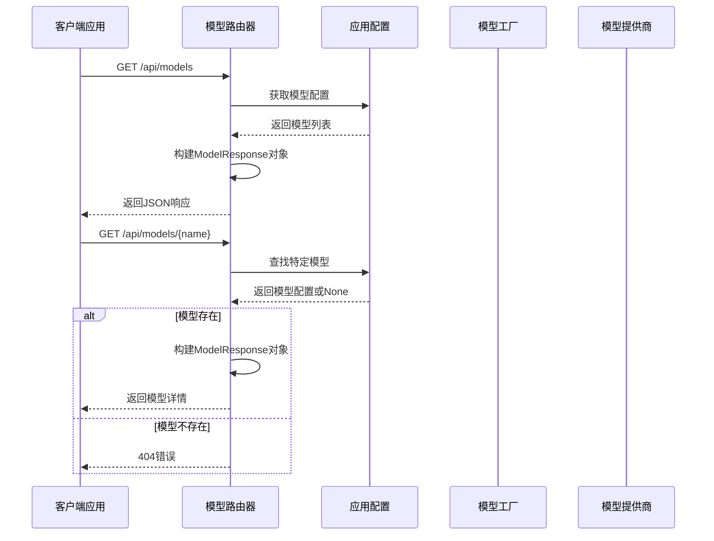
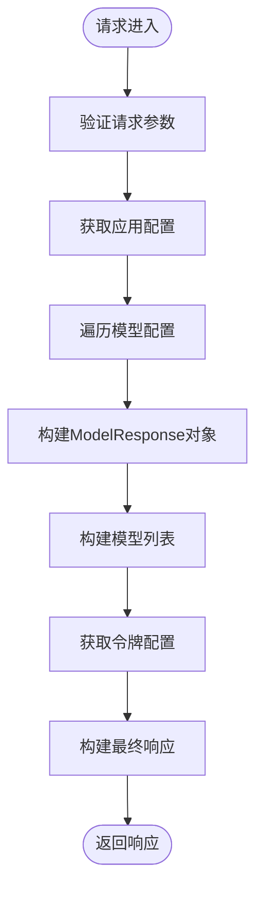
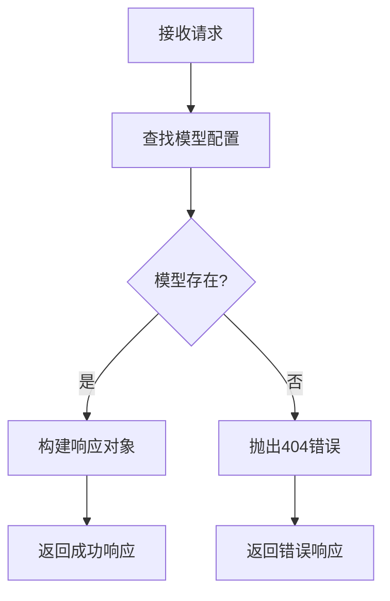
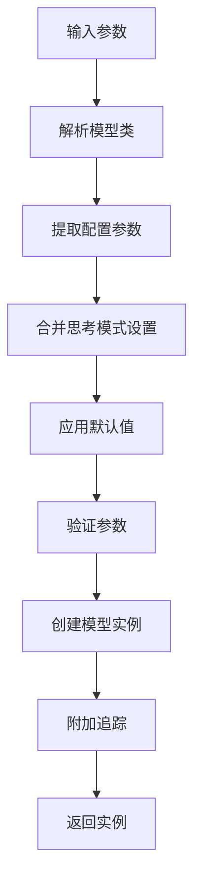
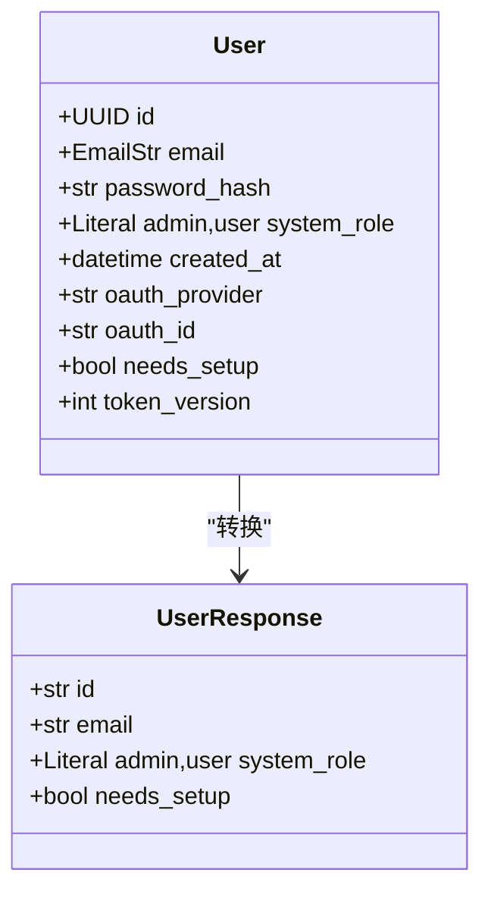
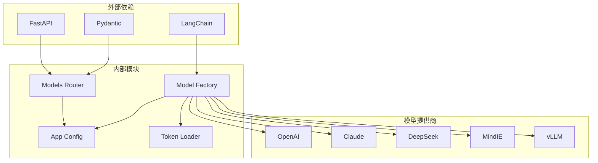

# 模型管理路由

<cite>
**本文档引用的文件**
- [models.py](file://backend/app/gateway/routers/models.py)
- [factory.py](file://backend/packages/harness/deerflow/models/factory.py)
- [__init__.py](file://backend/packages/harness/deerflow/models/__init__.py)
- [models.py](file://backend/app/gateway/auth/models.py)
</cite>

## 目录
1. [简介](#简介)
2. [项目结构](#项目结构)
3. [核心组件](#核心组件)
4. [架构概览](#架构概览)
5. [详细组件分析](#详细组件分析)
6. [依赖分析](#依赖分析)
7. [性能考虑](#性能考虑)
8. [故障排除指南](#故障排除指南)
9. [结论](#结论)

## 简介

DeerFlow模型管理路由是系统中负责AI模型配置和可用性查询的核心组件。该路由提供了完整的REST API端点，支持模型列表查询、模型详情获取以及模型配置管理功能。系统采用工厂模式实现动态模型加载，支持多种AI提供商集成，包括OpenAI、Anthropic Claude、DeepSeek等主流模型服务。

该组件不仅提供基础的模型信息查询功能，还集成了认证配置、性能参数设置、模型缓存策略、负载均衡和故障转移机制，为前端应用提供了完整的模型管理解决方案。

## 项目结构

模型管理路由在项目中的组织结构如下：

**图表来源**
- [models.py:1-133](file://backend/app/gateway/routers/models.py#L1-L133)
- [factory.py:1-205](file://backend/packages/harness/deerflow/models/factory.py#L1-L205)

**章节来源**
- [models.py:1-133](file://backend/app/gateway/routers/models.py#L1-L133)
- [factory.py:1-205](file://backend/packages/harness/deerflow/models/factory.py#L1-L205)

## 核心组件

### 模型管理路由器

模型管理路由器位于`/api`路径下，提供两个主要的REST API端点：

1. **模型列表查询** (`GET /api/models`)
   - 返回系统中所有已配置的AI模型信息
   - 包含模型元数据、功能支持状态和令牌使用配置

2. **模型详情查询** (`GET /api/models/{model_name}`)
   - 根据模型名称返回特定模型的详细信息
   - 支持404错误处理和模型不存在的情况

### 数据模型定义

系统定义了三个核心数据模型：

1. **ModelResponse** - 模型基本信息响应
   - 唯一标识符：`name`
   - 实际提供商模型标识：`model`
   - 可选显示名称：`display_name`
   - 描述信息：`description`
   - 功能支持标志：`supports_thinking`、`supports_reasoning_effort`

2. **TokenUsageResponse** - 令牌使用显示配置
   - 启用状态：`enabled`

3. **ModelsListResponse** - 模型列表响应
   - 模型数组：`models`
   - 令牌使用配置：`token_usage`

**章节来源**
- [models.py:10-32](file://backend/app/gateway/routers/models.py#L10-L32)

## 架构概览

模型管理路由采用分层架构设计，实现了清晰的关注点分离：

**图表来源**
- [models.py:34-133](file://backend/app/gateway/routers/models.py#L34-L133)

### 工厂模式实现

系统采用工厂模式实现动态模型加载，核心优势包括：

1. **动态类解析**：通过`resolve_class`函数动态解析模型类
2. **配置驱动**：基于配置文件动态创建模型实例
3. **参数验证**：自动验证和合并模型配置参数
4. **错误处理**：统一的异常处理和错误报告机制

**章节来源**
- [factory.py:82-205](file://backend/packages/harness/deerflow/models/factory.py#L82-L205)

## 详细组件分析

### 模型路由器实现

模型路由器使用FastAPI框架构建，具有以下特点：

#### 路由器配置
- **前缀**：`/api`
- **标签**：`models`
- **认证**：依赖注入方式获取配置

#### 列表查询端点

**图表来源**
- [models.py:34-90](file://backend/app/gateway/routers/models.py#L34-L90)

#### 单个模型查询端点
该端点实现了完整的错误处理机制：

**图表来源**
- [models.py:93-133](file://backend/app/gateway/routers/models.py#L93-L133)

**章节来源**
- [models.py:34-133](file://backend/app/gateway/routers/models.py#L34-L133)

### 模型工厂模式

模型工厂实现了复杂的动态模型创建逻辑：

#### 参数处理流程

**图表来源**
- [factory.py:82-205](file://backend/packages/harness/deerflow/models/factory.py#L82-L205)

#### 思考模式处理
工厂模式支持智能的思考模式切换：

1. **启用思考模式**：自动合并`when_thinking_enabled`配置
2. **禁用思考模式**：根据不同提供商类型应用相应的禁用策略
3. **参数验证**：确保模型支持指定的功能特性

#### 性能优化参数
工厂模式内置了多项性能优化参数：

1. **流式使用统计**：默认启用`stream_usage`以跟踪令牌使用情况
2. **流块超时时间**：为推理模型设置合理的超时时间（默认240秒）
3. **重试机制**：为特定提供商设置保守的重试策略

**章节来源**
- [factory.py:13-205](file://backend/packages/harness/deerflow/models/factory.py#L13-L205)

### 认证配置集成

系统集成了完整的用户认证模型：

#### 用户模型定义

**图表来源**
- [models.py:15-42](file://backend/app/gateway/auth/models.py#L15-L42)

**章节来源**
- [models.py:15-42](file://backend/app/gateway/auth/models.py#L15-L42)

## 依赖分析

### 组件间依赖关系

**图表来源**
- [models.py:1-7](file://backend/app/gateway/routers/models.py#L1-L7)
- [factory.py:1-10](file://backend/packages/harness/deerflow/models/factory.py#L1-L10)

### 关键依赖关系

1. **FastAPI依赖**：提供Web框架和路由功能
2. **LangChain依赖**：提供聊天模型基类和接口
3. **Pydantic依赖**：提供数据验证和序列化
4. **应用配置依赖**：提供模型配置管理和访问

**章节来源**
- [models.py:1-7](file://backend/app/gateway/routers/models.py#L1-L7)
- [factory.py:1-10](file://backend/packages/harness/deerflow/models/factory.py#L1-L10)

## 性能考虑

### 缓存策略

系统实现了多层次的缓存机制：

1. **配置缓存**：应用配置在启动时加载并缓存
2. **模型实例缓存**：模型实例按需创建并可重复使用
3. **令牌使用缓存**：令牌使用统计数据实时更新

### 流式处理优化

针对长推理时间的优化措施：

- **延长流块超时**：默认240秒，适应深度思考模型
- **智能重试机制**：在真实停滞情况下进行有限重试
- **流式使用统计**：确保令牌使用数据的准确性

### 并发处理

系统支持高并发请求处理：

- **异步路由处理**：使用FastAPI的异步特性
- **连接池管理**：合理管理外部API连接
- **资源清理**：自动清理临时资源和连接

## 故障排除指南

### 常见问题及解决方案

#### 模型配置错误
**症状**：`ValueError: Model {name} not found in config`
**原因**：模型名称在配置文件中不存在
**解决**：检查配置文件中的模型定义，确保名称匹配

#### 思考模式不支持
**症状**：`ValueError: Model {name} does not support thinking`
**原因**：模型配置中未启用思考模式支持
**解决**：在配置文件中设置`supports_thinking: true`

#### 认证失败
**症状**：401未授权错误
**原因**：缺少有效的认证凭据
**解决**：检查JWT令牌或API密钥的有效性

#### 超时错误
**症状**：StreamChunkTimeoutError
**原因**：推理模型响应时间过长
**解决**：调整`stream_chunk_timeout`配置参数

**章节来源**
- [factory.py:134-135](file://backend/packages/harness/deerflow/models/factory.py#L134-L135)
- [models.py:122-123](file://backend/app/gateway/routers/models.py#L122-L123)

## 结论

DeerFlow模型管理路由是一个功能完整、架构清晰的系统组件。它通过REST API端点提供了模型配置和可用性查询的完整解决方案，结合工厂模式实现了动态模型加载和智能参数处理。

系统的主要优势包括：

1. **模块化设计**：清晰的分层架构便于维护和扩展
2. **配置驱动**：灵活的配置管理支持多提供商集成
3. **性能优化**：内置的性能参数和缓存策略
4. **错误处理**：完善的异常处理和故障恢复机制
5. **安全集成**：完整的认证和授权机制

该组件为DeerFlow系统的AI模型管理提供了坚实的基础，支持未来的功能扩展和技术演进。