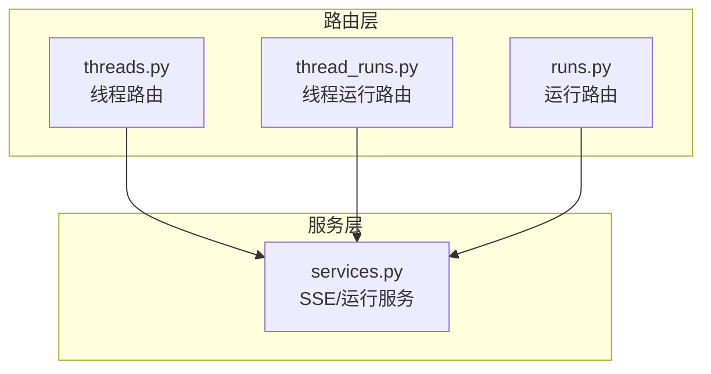
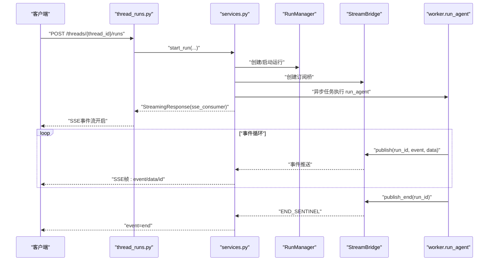
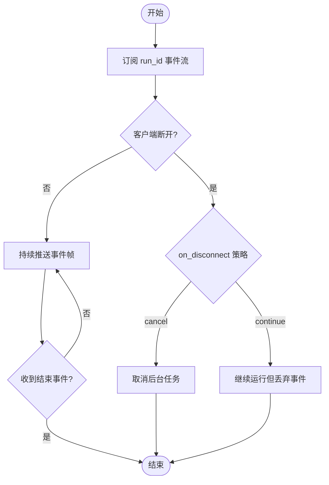
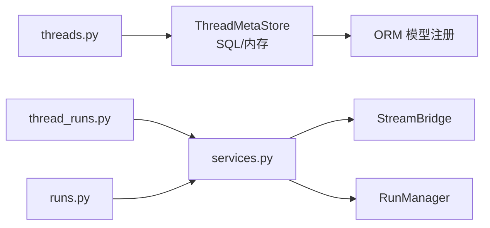

# 线程管理路由

<cite>
**本文引用的文件**
- [threads.py](file://backend/app/gateway/routers/threads.py)
- [thread_runs.py](file://backend/app/gateway/routers/thread_runs.py)
- [runs.py](file://backend/app/gateway/routers/runs.py)
- [services.py](file://backend/app/gateway/services.py)
- [AUTH_DESIGN.md](file://backend/docs/AUTH_DESIGN.md)
- [STREAMING.md](file://backend/docs/STREAMING.md)
- [test_threads_router.py](file://backend/tests/test_threads_router.py)
- [memory.py](file://backend/packages/harness/deerflow/persistence/thread_meta/memory.py)
- [__init__.py](file://backend/packages/harness/deerflow/persistence/thread_meta/__init__.py)
- [models_init.py](file://backend/packages/harness/deerflow/persistence/models/__init__.py)
- [test_persistence_timezone.py](file://backend/tests/test_persistence_timezone.py)
- [test_run_repository.py](file://backend/tests/test_run_repository.py)
- [test_runtime_lifecycle_e2e.py](file://backend/tests/test_runtime_lifecycle_e2e.py)
</cite>

## 目录
1. [简介](#简介)
2. [项目结构](#项目结构)
3. [核心组件](#核心组件)
4. [架构总览](#架构总览)
5. [详细组件分析](#详细组件分析)
6. [依赖分析](#依赖分析)
7. [性能考虑](#性能考虑)
8. [故障排查指南](#故障排查指南)
9. [结论](#结论)
10. [附录](#附录)

## 简介
本技术文档聚焦于DeerFlow的“线程管理路由”，系统性阐述线程的创建、查询、更新与删除REST API设计，覆盖线程状态管理、消息历史记录与运行上下文维护；深入解析线程与运行（runs）的关系，以及线程运行历史的SSE流式传输实现；提供HTTP请求/响应示例、错误处理策略、权限控制机制与并发访问处理策略。

## 项目结构
围绕线程管理的关键模块与文件如下：
- 路由层
  - 线程路由：backend/app/gateway/routers/threads.py
  - 线程运行路由：backend/app/gateway/routers/thread_runs.py
  - 运行路由：backend/app/gateway/routers/runs.py
- 服务层（SSE与运行生命周期）
  - services.py：封装SSE帧格式化、订阅消费、断连处理与运行完成等待
- 文档与测试
  - AUTH_DESIGN.md：权限与CSRF设计
  - STREAMING.md：SSE流式传输架构说明
  - 多个测试文件：验证线程路由行为、SSE断连语义、时区一致性等

图表来源
- [threads.py](file://backend/app/gateway/routers/threads.py)
- [thread_runs.py](file://backend/app/gateway/routers/thread_runs.py)
- [runs.py](file://backend/app/gateway/routers/runs.py)
- [services.py](file://backend/app/gateway/services.py)

章节来源
- [threads.py](file://backend/app/gateway/routers/threads.py)
- [thread_runs.py](file://backend/app/gateway/routers/thread_runs.py)
- [runs.py](file://backend/app/gateway/routers/runs.py)
- [services.py](file://backend/app/gateway/services.py)

## 核心组件
- 线程元数据存储
  - 支持SQL与内存两种实现，通过工厂函数按可用后端自动选择
  - 提供创建、读取、更新、搜索、删除等操作，并内置用户隔离与时间戳规范化
- 运行生命周期与SSE
  - 统一的SSE事件格式化与订阅消费流程
  - 断连处理策略（取消/继续），心跳帧与结束事件
- 权限与CSRF
  - 路由级owner检查与写/删操作的现有资源校验
  - CSRF双提交令牌策略（Cookie + X-CSRF-Token）

章节来源
- [memory.py](file://backend/packages/harness/deerflow/persistence/thread_meta/memory.py)
- [__init__.py](file://backend/packages/harness/deerflow/persistence/thread_meta/__init__.py)
- [AUTH_DESIGN.md](file://backend/docs/AUTH_DESIGN.md)
- [services.py](file://backend/app/gateway/services.py)

## 架构总览
下图展示线程与运行交互的整体架构，重点体现SSE事件流、运行管理器与桥接队列的角色。

图表来源
- [thread_runs.py](file://backend/app/gateway/routers/thread_runs.py)
- [services.py](file://backend/app/gateway/services.py)
- [STREAMING.md](file://backend/docs/STREAMING.md)

## 详细组件分析

### 线程路由（threads.py）
- 主要端点
  - GET /api/threads：列出当前用户线程，支持按状态、元数据过滤与分页
  - GET /api/threads/{thread_id}：读取单一线程元数据
  - PATCH /api/threads/{thread_id}：合并更新线程元数据（仅允许部分字段）
  - DELETE /api/threads/{thread_id}：删除线程本地数据（清理工作目录）
- 关键行为
  - 创建时剥离客户端传入的user_id/owner_id，以当前用户上下文为准
  - 搜索默认仅返回当前用户线程，避免资源存在性泄露
  - 写/删操作启用“require_existing=True”与“owner_check=True”，防止越权与资源缺失导致的误判
  - 删除线程时清理用户隔离目录，失败时抛出HTTP异常并记录日志
- 数据模型要点
  - 返回包含thread_id、status、created_at、updated_at、metadata、values(title)、interrupts等字段
  - 时间戳通过统一的ISO规范化工具处理，兼容历史Unix秒值

章节来源
- [threads.py](file://backend/app/gateway/routers/threads.py)
- [AUTH_DESIGN.md](file://backend/docs/AUTH_DESIGN.md)
- [test_threads_router.py](file://backend/tests/test_threads_router.py)

### 线程运行路由（thread_runs.py）
- 主要端点
  - POST /api/threads/{thread_id}/runs：为指定线程启动一次运行（可带配置与输入）
  - GET /api/threads/{thread_id}/runs：列出该线程的历史运行（分页）
  - GET /api/threads/{thread_id}/runs/{run_id}：读取某次运行详情
  - GET /api/threads/{thread_id}/runs/{run_id}/messages：读取运行消息历史（分页）
  - GET /api/threads/{thread_id}/runs/{run_id}/stream：SSE流式输出运行事件
- 关键行为
  - SSE流式传输基于StreamBridge订阅，支持Last-Event-ID断连重连、心跳帧与结束事件
  - 断连处理策略由on_disconnect配置决定（取消/继续），并在finally中清理
  - 运行状态变更与事件持久化由运行管理器与事件存储配合完成

章节来源
- [thread_runs.py](file://backend/app/gateway/routers/thread_runs.py)
- [services.py](file://backend/app/gateway/services.py)
- [STREAMING.md](file://backend/docs/STREAMING.md)

### 运行路由（runs.py）
- 主要端点
  - GET /api/runs：全局运行列表（通常受用户隔离限制）
  - GET /api/runs/{run_id}：读取运行详情
  - GET /api/runs/{run_id}/messages：读取运行消息历史（分页）
  - GET /api/runs/{run_id}/stream：SSE流式输出运行事件
- 关键行为
  - 与线程运行路由共享SSE服务层，确保一致的事件格式与断连语义
  - 支持按运行维度独立查看历史与实时流

章节来源
- [runs.py](file://backend/app/gateway/routers/runs.py)
- [services.py](file://backend/app/gateway/services.py)

### 线程状态与检查点（thread state）
- 状态更新
  - 通过检查点写入接口为线程插入新检查点，确保每次更新生成新的checkpoint_id
  - 写入配置包含thread_id与checkpoint_ns，保证持久化键控正确
- 错误处理
  - 写入失败时记录异常并返回500，避免状态不一致

章节来源
- [threads.py](file://backend/app/gateway/routers/threads.py)

### 线程与运行的关系
- 一对多关系
  - 单一线程可拥有多个运行历史，每次启动运行即产生一条运行记录
- 数据关联
  - 运行记录包含thread_id，便于按线程聚合查询
  - 消息历史按运行维度存储，支持分页读取
- 生命周期
  - 运行状态由运行管理器维护，SSE事件流反映实时状态变化

章节来源
- [thread_runs.py](file://backend/app/gateway/routers/thread_runs.py)
- [runs.py](file://backend/app/gateway/routers/runs.py)
- [test_run_repository.py](file://backend/tests/test_run_repository.py)

### SSE流式传输实现
- 事件格式
  - 使用统一的SSE帧格式化函数，支持事件名、数据与事件ID
- 订阅与消费
  - 通过StreamBridge订阅指定run_id的事件流，支持心跳帧与结束事件
- 断连处理
  - 客户端断开时根据on_disconnect策略决定是否取消后台任务
- 心跳与结束
  - 心跳帧用于保持连接活性；结束事件标识运行完成

图表来源
- [services.py](file://backend/app/gateway/services.py)
- [STREAMING.md](file://backend/docs/STREAMING.md)
- [test_runtime_lifecycle_e2e.py](file://backend/tests/test_runtime_lifecycle_e2e.py)

## 依赖分析
- 存储层
  - 线程元数据：SQL或LangGraph内存实现，统一抽象接口
  - 运行与事件：SQL ORM模型注册，支持时区一致的时间戳
- 路由层
  - 线程路由负责元数据与状态更新
  - 线程运行路由负责运行生命周期与SSE
  - 运行路由负责全局运行与消息历史
- 服务层
  - SSE格式化、订阅消费、断连策略与运行完成等待

图表来源
- [threads.py](file://backend/app/gateway/routers/threads.py)
- [thread_runs.py](file://backend/app/gateway/routers/thread_runs.py)
- [runs.py](file://backend/app/gateway/routers/runs.py)
- [services.py](file://backend/app/gateway/services.py)
- [models_init.py](file://backend/packages/harness/deerflow/persistence/models/__init__.py)

章节来源
- [memory.py](file://backend/packages/harness/deerflow/persistence/thread_meta/memory.py)
- [__init__.py](file://backend/packages/harness/deerflow/persistence/thread_meta/__init__.py)
- [models_init.py](file://backend/packages/harness/deerflow/persistence/models/__init__.py)

## 性能考虑
- SSE与事件桥接
  - StreamBridge作为异步队列解耦生产者与消费者，支持多订阅者与断连缓冲
  - 心跳帧降低空闲连接的网络中断风险
- 时间戳与时区
  - 线程与运行的创建/更新时间均采用时区感知ISO格式，避免跨时区歧义
- 并发与隔离
  - 用户隔离字段user_id确保资源可见性与操作边界
  - 写/删操作的现有资源校验减少竞态条件

章节来源
- [STREAMING.md](file://backend/docs/STREAMING.md)
- [test_persistence_timezone.py](file://backend/tests/test_persistence_timezone.py)
- [AUTH_DESIGN.md](file://backend/docs/AUTH_DESIGN.md)

## 故障排查指南
- 删除线程本地数据失败
  - 现象：删除接口返回500，日志记录异常
  - 排查：确认线程ID合法性、用户隔离目录存在性、磁盘权限与路径安全
- SSE断连未触发取消
  - 现象：客户端断开后运行仍在后台执行
  - 排查：检查on_disconnect配置、request.is_disconnected检测、finally块清理逻辑
- 搜索过滤报错
  - 现象：400错误，提示无效元数据过滤
  - 排查：核对metadata过滤键值类型与格式

章节来源
- [test_threads_router.py](file://backend/tests/test_threads_router.py)
- [services.py](file://backend/app/gateway/services.py)
- [test_runtime_lifecycle_e2e.py](file://backend/tests/test_runtime_lifecycle_e2e.py)

## 结论
DeerFlow的线程管理路由以清晰的REST设计与强隔离策略为基础，结合统一的SSE事件流与运行生命周期服务，实现了线程状态、消息历史与运行上下文的完整闭环。通过严格的权限控制、CSRF防护与断连语义，系统在保证安全性的同时提供了良好的可观测性与可扩展性。

## 附录

### HTTP请求/响应示例（路径与语义）
- 列出线程
  - 方法与路径：GET /api/threads
  - 查询参数：status、metadata（JSON对象）、limit、offset
  - 成功响应：数组，元素包含thread_id、status、created_at、updated_at、metadata、values、interrupts
- 读取线程
  - 方法与路径：GET /api/threads/{thread_id}
  - 成功响应：单个线程对象（同上字段）
- 更新线程元数据
  - 方法与路径：PATCH /api/threads/{thread_id}
  - 请求体：部分字段的合并更新（如metadata）
  - 成功响应：更新后的线程对象
- 删除线程
  - 方法与路径：DELETE /api/threads/{thread_id}
  - 成功响应：{"success": true, "message": "..."}
- 启动线程运行
  - 方法与路径：POST /api/threads/{thread_id}/runs
  - 请求体：运行配置与输入（具体字段见路由定义）
  - 成功响应：运行对象（含run_id、status等）
- 读取运行历史
  - 方法与路径：GET /api/threads/{thread_id}/runs
  - 成功响应：运行对象数组
- 读取运行详情
  - 方法与路径：GET /api/threads/{thread_id}/runs/{run_id}
  - 成功响应：运行对象
- 读取消息历史
  - 方法与路径：GET /api/threads/{thread_id}/runs/{run_id}/messages
  - 查询参数：limit、offset
  - 成功响应：消息数组（分页）
- SSE流式传输
  - 方法与路径：GET /api/threads/{thread_id}/runs/{run_id}/stream
  - 请求头：可选Last-Event-ID
  - 响应：SSE事件流，事件名包括但不限于"metadata"、"end"，心跳帧为":"开头的空行

章节来源
- [threads.py](file://backend/app/gateway/routers/threads.py)
- [thread_runs.py](file://backend/app/gateway/routers/thread_runs.py)
- [runs.py](file://backend/app/gateway/routers/runs.py)
- [services.py](file://backend/app/gateway/services.py)

### 权限控制与并发策略
- 权限
  - 读类请求允许旧版未追踪线程兼容读取
  - 写/删类请求启用require_existing与owner_check，避免越权与资源缺失误判
- CSRF
  - 双提交令牌：服务端设置csrf_token Cookie，前端发送X-CSRF-Token，服务端以常量时间比较
  - 需要CSRF的方法：POST/PUT/PATCH/DELETE
- 并发
  - 用户隔离字段user_id确保资源边界
  - 写/删操作的现有资源校验降低竞态

章节来源
- [AUTH_DESIGN.md](file://backend/docs/AUTH_DESIGN.md)