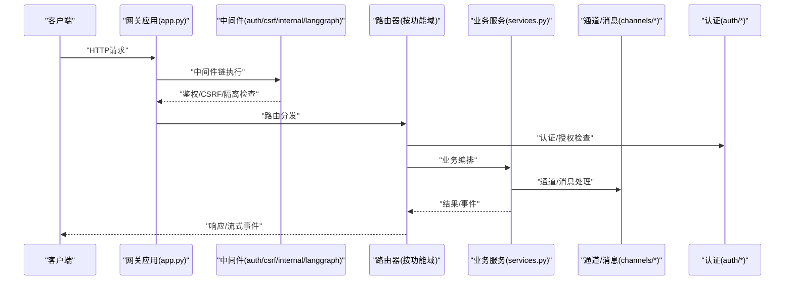
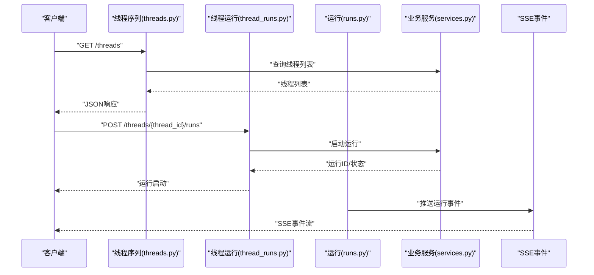
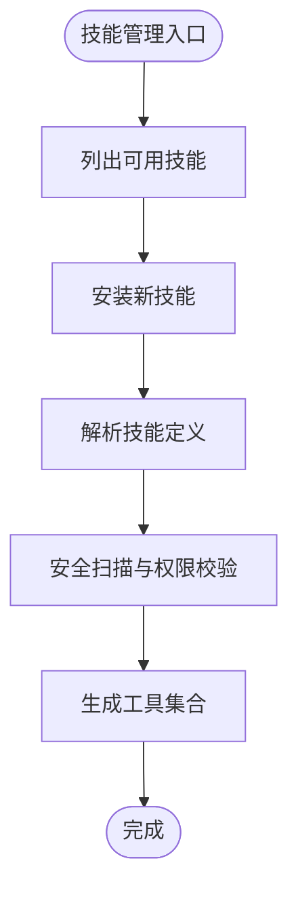
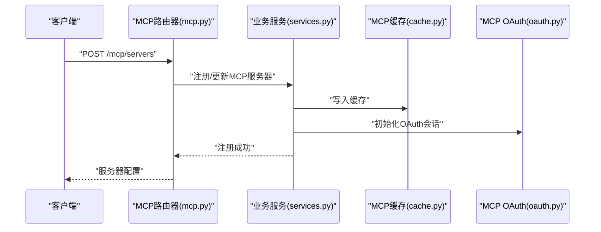
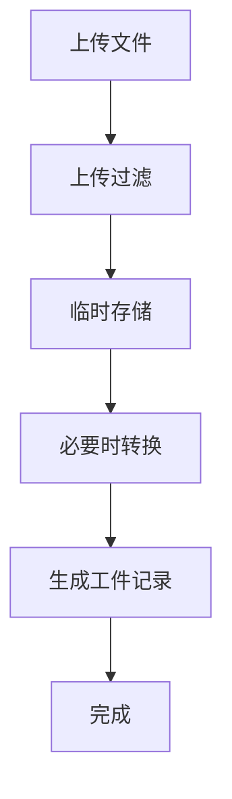
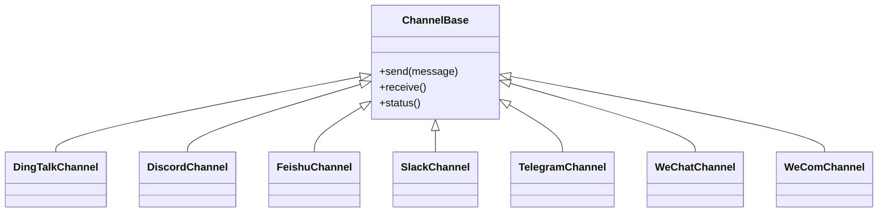
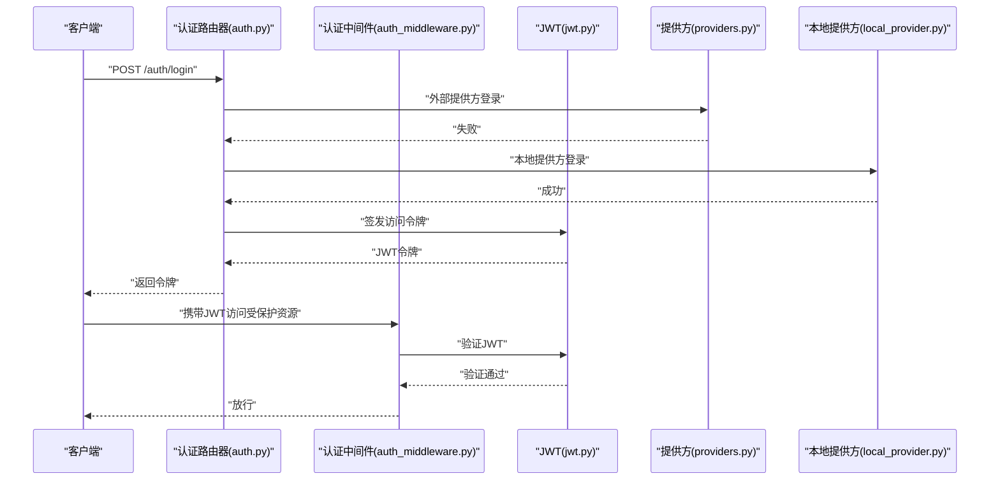
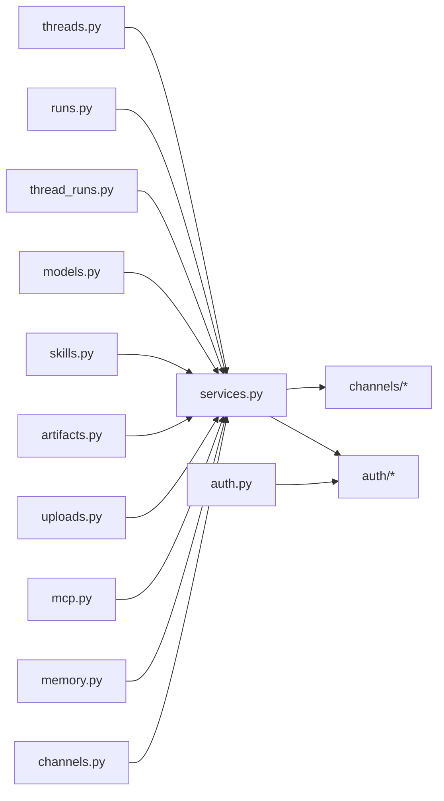

# 网关API

<cite>
**本文引用的文件**
- [app.py](file://backend/app/gateway/app.py)
- [auth_middleware.py](file://backend/app/gateway/auth_middleware.py)
- [csrf_middleware.py](file://backend/app/gateway/csrf_middleware.py)
- [deps.py](file://backend/app/gateway/deps.py)
- [config.py](file://backend/app/gateway/config.py)
- [routers/__init__.py](file://backend/app/gateway/routers/__init__.py)
- [routers/agents.py](file://backend/app/gateway/routers/agents.py)
- [routers/artifacts.py](file://backend/app/gateway/routers/artifacts.py)
- [routers/assistants_compat.py](file://backend/app/gateway/routers/assistants_compat.py)
- [routers/auth.py](file://backend/app/gateway/routers/auth.py)
- [routers/channels.py](file://backend/app/gateway/routers/channels.py)
- [routers/feedback.py](file://backend/app/gateway/routers/feedback.py)
- [routers/mcp.py](file://backend/app/gateway/routers/mcp.py)
- [routers/memory.py](file://backend/app/gateway/routers/memory.py)
- [routers/models.py](file://backend/app/gateway/routers/models.py)
- [routers/runs.py](file://backend/app/gateway/routers/runs.py)
- [routers/skills.py](file://backend/app/gateway/routers/skills.py)
- [routers/suggestions.py](file://backend/app/gateway/routers/suggestions.py)
- [routers/thread_runs.py](file://backend/app/gateway/routers/thread_runs.py)
- [routers/threads.py](file://backend/app/gateway/routers/threads.py)
- [routers/uploads.py](file://backend/app/gateway/routers/uploads.py)
- [channels/manager.py](file://backend/app/channels/manager.py)
- [channels/service.py](file://backend/app/channels/service.py)
- [channels/message_bus.py](file://backend/app/channels/message_bus.py)
- [channels/store.py](file://backend/app/channels/store.py)
- [channels/base.py](file://backend/app/channels/base.py)
- [channels/commands.py](file://backend/app/channels/commands.py)
- [channels/dingtalk.py](file://backend/app/channels/dingtalk.py)
- [channels/discord.py](file://backend/app/channels/discord.py)
- [channels/feishu.py](file://backend/app/channels/feishu.py)
- [channels/slack.py](file://backend/app/channels/slack.py)
- [channels/telegram.py](file://backend/app/channels/telegram.py)
- [channels/wechat.py](file://backend/app/channels/wechat.py)
- [channels/wecom.py](file://backend/app/channels/wecom.py)
- [auth/jwt.py](file://backend/app/gateway/auth/jwt.py)
- [auth/providers.py](file://backend/app/gateway/auth/providers.py)
- [auth/local_provider.py](file://backend/app/gateway/auth/local_provider.py)
- [auth/password.py](file://backend/app/gateway/auth/password.py)
- [auth/credential_file.py](file://backend/app/gateway/auth/credential_file.py)
- [auth/reset_admin.py](file://backend/app/gateway/auth/reset_admin.py)
- [auth/errors.py](file://backend/app/gateway/auth/errors.py)
- [auth/models.py](file://backend/app/gateway/auth/models.py)
- [auth/config.py](file://backend/app/gateway/auth/config.py)
- [services.py](file://backend/app/gateway/services.py)
- [utils.py](file://backend/app/gateway/utils.py)
- [path_utils.py](file://backend/app/gateway/path_utils.py)
- [pagination.py](file://backend/app/gateway/pagination.py)
- [internal_auth.py](file://backend/app/gateway/internal_auth.py)
- [langgraph_auth.py](file://backend/app/gateway/langgraph_auth.py)
- [auth_disabled.py](file://backend/app/gateway/auth_disabled.py)
- [docs/API.md](file://backend/docs/API.md)
- [docs/STREAMING.md](file://backend/docs/STREAMING.md)
- [docs/MCP_SERVER.md](file://backend/docs/MCP_SERVER.md)
- [docs/FILE_UPLOAD.md](file://backend/docs/FILE_UPLOAD.md)
- [docs/AUTH_DESIGN.md](file://backend/docs/AUTH_DESIGN.md)
- [docs/middleware-execution-flow.md](file://backend/docs/middleware-execution-flow.md)
</cite>

## 目录
1. [简介](#简介)
2. [项目结构](#项目结构)
3. [核心组件](#核心组件)
4. [架构总览](#架构总览)
5. [详细组件分析](#详细组件分析)
6. [依赖关系分析](#依赖关系分析)
7. [性能考虑](#性能考虑)
8. [故障排查指南](#故障排查指南)
9. [结论](#结论)
10. [附录](#附录)

## 简介
本技术文档面向DeerFlow网关API，系统性阐述基于FastAPI的应用架构与路由组织，重点覆盖以下方面：
- LangGraph兼容的运行时路由：如何通过线程与运行管理实现Agent生命周期控制
- REST API端点设计：各路由器的职责边界与接口规范
- SSE（Server-Sent Events）流式传输：事件推送与客户端连接管理
- 关键路由器功能：线程管理、运行控制、模型配置、技能管理、MCP服务器配置、文件上传与工件服务
- HTTP请求响应示例：URL模式、请求参数、响应格式与错误处理
- 前后端交互：网关与前端及后端组件的协作方式
- 安全认证与中间件：JWT、CSRF、内部认证与LangGraph认证集成

## 项目结构
后端采用FastAPI应用入口集中于gateway模块，路由按功能域拆分到独立文件，通道与消息总线用于多渠道集成，认证体系支持本地与外部提供方。

```mermaid
graph TB
subgraph "网关应用"
APP["app.py<br/>FastAPI应用入口"]
CFG["config.py<br/>应用配置"]
DEPS["deps.py<br/>依赖注入"]
MW["中间件<br/>auth_middleware.py / csrf_middleware.py / internal_auth.py / langgraph_auth.py"]
SRV["services.py<br/>业务服务"]
UTIL["utils.py / path_utils.py / pagination.py"]
end
subgraph "路由模块"
RAG["routers/agents.py"]
RUN["routers/runs.py"]
THR["routers/threads.py"]
TRR["routers/thread_runs.py"]
MOD["routers/models.py"]
SKL["routers/skills.py"]
ART["routers/artifacts.py"]
UPL["routers/uploads.py"]
MCP["routers/mcp.py"]
MEM["routers/memory.py"]
CHN["routers/channels.py"]
AUT["routers/auth.py"]
ASS["routers/assistants_compat.py"]
SUG["routers/suggestions.py"]
FDB["routers/feedback.py"]
end
subgraph "通道与消息"
CM["channels/manager.py"]
CS["channels/service.py"]
MB["channels/message_bus.py"]
ST["channels/store.py"]
CB["channels/base.py"]
CMD["channels/commands.py"]
DING["channels/dingtalk.py"]
DISC["channels/discord.py"]
FEI["channels/feishu.py"]
SLK["channels/slack.py"]
TEL["channels/telegram.py"]
WEC["channels/wechat.py"]
WCOM["channels/wecom.py"]
end
subgraph "认证"
JWT["auth/jwt.py"]
PRV["auth/providers.py"]
LOC["auth/local_provider.py"]
PWD["auth/password.py"]
CRD["auth/credential_file.py"]
RST["auth/reset_admin.py"]
ERR["auth/errors.py"]
MDF["auth/models.py"]
AC["auth/config.py"]
end
APP --> MW
APP --> RAG
APP --> RUN
APP --> THR
APP --> TRR
APP --> MOD
APP --> SKL
APP --> ART
APP --> UPL
APP --> MCP
APP --> MEM
APP --> CHN
APP --> AUT
APP --> ASS
APP --> SUG
APP --> FDB
CHN --> CM
CHN --> CS
CHN --> MB
CHN --> ST
CHN --> CB
CHN --> CMD
CHN --> DING
CHN --> DISC
CHN --> FEI
CHN --> SLK
CHN --> TEL
CHN --> WEC
CHN --> WCOM
AUT --> JWT
AUT --> PRV
AUT --> LOC
AUT --> PWD
AUT --> CRD
AUT --> RST
AUT --> ERR
AUT --> MDF
AUT --> AC
```

**图表来源**
- [app.py](file://backend/app/gateway/app.py)
- [routers/__init__.py](file://backend/app/gateway/routers/__init__.py)
- [channels/manager.py](file://backend/app/channels/manager.py)
- [channels/service.py](file://backend/app/channels/service.py)
- [channels/message_bus.py](file://backend/app/channels/message_bus.py)
- [channels/store.py](file://backend/app/channels/store.py)
- [channels/base.py](file://backend/app/channels/base.py)
- [channels/commands.py](file://backend/app/channels/commands.py)
- [channels/dingtalk.py](file://backend/app/channels/dingtalk.py)
- [channels/discord.py](file://backend/app/channels/discord.py)
- [channels/feishu.py](file://backend/app/channels/feishu.py)
- [channels/slack.py](file://backend/app/channels/slack.py)
- [channels/telegram.py](file://backend/app/channels/telegram.py)
- [channels/wechat.py](file://backend/app/channels/wechat.py)
- [channels/wecom.py](file://backend/app/channels/wecom.py)
- [auth/jwt.py](file://backend/app/gateway/auth/jwt.py)
- [auth/providers.py](file://backend/app/gateway/auth/providers.py)
- [auth/local_provider.py](file://backend/app/gateway/auth/local_provider.py)
- [auth/password.py](file://backend/app/gateway/auth/password.py)
- [auth/credential_file.py](file://backend/app/gateway/auth/credential_file.py)
- [auth/reset_admin.py](file://backend/app/gateway/auth/reset_admin.py)
- [auth/errors.py](file://backend/app/gateway/auth/errors.py)
- [auth/models.py](file://backend/app/gateway/auth/models.py)
- [auth/config.py](file://backend/app/gateway/auth/config.py)

**章节来源**
- [app.py](file://backend/app/gateway/app.py)
- [routers/__init__.py](file://backend/app/gateway/routers/__init__.py)

## 核心组件
- 应用入口与配置
  - 应用入口集中于网关模块，负责注册中间件、依赖注入、路由挂载与生命周期管理
  - 配置模块提供运行时参数加载与环境变量扩展
- 中间件体系
  - 认证中间件：JWT鉴权、LangGraph认证、内部认证
  - CSRF防护中间件：跨站请求伪造防护
  - 执行顺序与拦截策略在中间件执行流程文档中有详细说明
- 路由器模块
  - 按功能域划分：代理、运行、线程、模型、技能、工件、上传、MCP、内存、通道、认证、兼容助手等
  - 每个路由器负责特定资源的CRUD与业务编排
- 通道与消息总线
  - 支持钉钉、飞书、Slack、Discord、Telegram、微信、企业微信等多渠道
  - 提供消息总线、存储与命令处理能力
- 认证与授权
  - 支持本地提供方与外部提供方，密码与凭据文件管理，管理员重置与错误处理
  - JWT签发与校验、权限模型与配置

**章节来源**
- [app.py](file://backend/app/gateway/app.py)
- [config.py](file://backend/app/gateway/config.py)
- [auth_middleware.py](file://backend/app/gateway/auth_middleware.py)
- [csrf_middleware.py](file://backend/app/gateway/csrf_middleware.py)
- [deps.py](file://backend/app/gateway/deps.py)
- [routers/__init__.py](file://backend/app/gateway/routers/__init__.py)

## 架构总览
下图展示从客户端到后端服务的整体调用链路，包括认证、中间件处理、路由分发与业务服务调用。

**图表来源**
- [app.py](file://backend/app/gateway/app.py)
- [auth_middleware.py](file://backend/app/gateway/auth_middleware.py)
- [csrf_middleware.py](file://backend/app/gateway/csrf_middleware.py)
- [internal_auth.py](file://backend/app/gateway/internal_auth.py)
- [langgraph_auth.py](file://backend/app/gateway/langgraph_auth.py)
- [services.py](file://backend/app/gateway/services.py)
- [channels/manager.py](file://backend/app/channels/manager.py)

## 详细组件分析

### 路由器：线程与运行管理
- 线程管理（threads.py）
  - 功能：创建、查询、更新线程元数据；与记忆体、工件、运行关联
  - 关键端点：线程列表、详情、更新、删除；线程消息分页
  - 交互：与记忆体路由器、运行路由器协同
- 运行控制（runs.py、thread_runs.py）
  - 功能：启动、取消、查询运行；LangGraph兼容的运行状态与事件
  - 关键端点：运行列表、详情、取消；线程内运行分页
  - 流式：支持SSE事件推送，事件类型包含数据流与完成信号
- 兼容助手（assistants_compat.py）
  - 功能：提供与OpenAI Assistants API兼容的端点，便于迁移
  - 关键端点：兼容的代理、线程、运行接口

**图表来源**
- [routers/threads.py](file://backend/app/gateway/routers/threads.py)
- [routers/thread_runs.py](file://backend/app/gateway/routers/thread_runs.py)
- [routers/runs.py](file://backend/app/gateway/routers/runs.py)
- [services.py](file://backend/app/gateway/services.py)

**章节来源**
- [routers/threads.py](file://backend/app/gateway/routers/threads.py)
- [routers/thread_runs.py](file://backend/app/gateway/routers/thread_runs.py)
- [routers/runs.py](file://backend/app/gateway/routers/runs.py)
- [docs/STREAMING.md](file://backend/docs/STREAMING.md)

### 路由器：模型配置与技能管理
- 模型配置（models.py）
  - 功能：模型列表、默认模型设置、供应商适配
  - 关键端点：模型列表、默认模型、供应商配置
- 技能管理（skills.py）
  - 功能：技能安装、解析、权限与安全扫描、工具策略
  - 关键端点：技能列表、安装、解析、权限配置
  - 与工具：技能解析后生成工具集合，参与运行时工具调度

**图表来源**
- [routers/skills.py](file://backend/app/gateway/routers/skills.py)
- [routers/models.py](file://backend/app/gateway/routers/models.py)

**章节来源**
- [routers/skills.py](file://backend/app/gateway/routers/skills.py)
- [routers/models.py](file://backend/app/gateway/routers/models.py)

### 路由器：MCP服务器配置
- MCP（mcp.py）
  - 功能：MCP服务器注册、会话池、OAuth、缓存与工具桥接
  - 关键端点：MCP服务器列表、配置、同步、会话管理
  - 文档：MCP服务器配置与使用说明详见相关文档

**图表来源**
- [routers/mcp.py](file://backend/app/gateway/routers/mcp.py)
- [services.py](file://backend/app/gateway/services.py)
- [docs/MCP_SERVER.md](file://backend/docs/MCP_SERVER.md)

**章节来源**
- [routers/mcp.py](file://backend/app/gateway/routers/mcp.py)
- [docs/MCP_SERVER.md](file://backend/docs/MCP_SERVER.md)

### 路由器：文件上传与工件服务
- 文件上传（uploads.py）
  - 功能：文件上传、临时存储、过滤与转换
  - 关键端点：上传、预览、清理
- 工件服务（artifacts.py）
  - 功能：工件创建、查询、下载、版本管理
  - 关键端点：工件列表、详情、下载、删除

**图表来源**
- [routers/uploads.py](file://backend/app/gateway/routers/uploads.py)
- [routers/artifacts.py](file://backend/app/gateway/routers/artifacts.py)
- [docs/FILE_UPLOAD.md](file://backend/docs/FILE_UPLOAD.md)

**章节来源**
- [routers/uploads.py](file://backend/app/gateway/routers/uploads.py)
- [routers/artifacts.py](file://backend/app/gateway/routers/artifacts.py)
- [docs/FILE_UPLOAD.md](file://backend/docs/FILE_UPLOAD.md)

### 路由器：通道与消息总线
- 通道管理（channels/manager.py、service.py）
  - 功能：通道实例化、消息转发、状态管理
- 消息总线（message_bus.py）
  - 功能：事件发布订阅、广播与路由
- 存储（store.py）
  - 功能：消息持久化、查询与清理
- 基类与命令（base.py、commands.py）
  - 功能：通道抽象基类、命令协议与执行
- 多渠道适配（dingtalk.py、discord.py、feishu.py、slack.py、telegram.py、wechat.py、wecom.py）
  - 功能：各平台消息适配与回调处理

**图表来源**
- [channels/base.py](file://backend/app/channels/base.py)
- [channels/dingtalk.py](file://backend/app/channels/dingtalk.py)
- [channels/discord.py](file://backend/app/channels/discord.py)
- [channels/feishu.py](file://backend/app/channels/feishu.py)
- [channels/slack.py](file://backend/app/channels/slack.py)
- [channels/telegram.py](file://backend/app/channels/telegram.py)
- [channels/wechat.py](file://backend/app/channels/wechat.py)
- [channels/wecom.py](file://backend/app/channels/wecom.py)

**章节来源**
- [channels/manager.py](file://backend/app/channels/manager.py)
- [channels/service.py](file://backend/app/channels/service.py)
- [channels/message_bus.py](file://backend/app/channels/message_bus.py)
- [channels/store.py](file://backend/app/channels/store.py)
- [channels/base.py](file://backend/app/channels/base.py)
- [channels/commands.py](file://backend/app/channels/commands.py)
- [channels/dingtalk.py](file://backend/app/channels/dingtalk.py)
- [channels/discord.py](file://backend/app/channels/discord.py)
- [channels/feishu.py](file://backend/app/channels/feishu.py)
- [channels/slack.py](file://backend/app/channels/slack.py)
- [channels/telegram.py](file://backend/app/channels/telegram.py)
- [channels/wechat.py](file://backend/app/channels/wechat.py)
- [channels/wecom.py](file://backend/app/channels/wecom.py)

### 路由器：认证与授权
- 认证（auth.py）
  - 功能：登录、登出、令牌刷新、管理员重置
  - 关键端点：登录、注册、令牌刷新、管理员重置
- 认证中间件（auth_middleware.py）
  - 功能：JWT校验、用户上下文注入、权限拦截
- 提供方与密码（providers.py、local_provider.py、password.py）
  - 功能：外部提供方对接、本地提供方、密码哈希与校验
- 凭据文件与错误处理（credential_file.py、errors.py）
  - 功能：凭据文件读取、认证错误统一处理
- JWT与模型（jwt.py、models.py）
  - 功能：JWT签发与验证、认证模型定义
- 配置（auth/config.py）

**图表来源**
- [routers/auth.py](file://backend/app/gateway/routers/auth.py)
- [auth_middleware.py](file://backend/app/gateway/auth_middleware.py)
- [auth/jwt.py](file://backend/app/gateway/auth/jwt.py)
- [auth/providers.py](file://backend/app/gateway/auth/providers.py)
- [auth/local_provider.py](file://backend/app/gateway/auth/local_provider.py)
- [auth/password.py](file://backend/app/gateway/auth/password.py)

**章节来源**
- [routers/auth.py](file://backend/app/gateway/routers/auth.py)
- [auth_middleware.py](file://backend/app/gateway/auth_middleware.py)
- [auth/jwt.py](file://backend/app/gateway/auth/jwt.py)
- [auth/providers.py](file://backend/app/gateway/auth/providers.py)
- [auth/local_provider.py](file://backend/app/gateway/auth/local_provider.py)
- [auth/password.py](file://backend/app/gateway/auth/password.py)
- [auth/credential_file.py](file://backend/app/gateway/auth/credential_file.py)
- [auth/errors.py](file://backend/app/gateway/auth/errors.py)
- [auth/models.py](file://backend/app/gateway/auth/models.py)
- [auth/config.py](file://backend/app/gateway/auth/config.py)
- [docs/AUTH_DESIGN.md](file://backend/docs/AUTH_DESIGN.md)

### 路由器：建议与反馈
- 建议（suggestions.py）
  - 功能：生成建议、建议列表与管理
- 反馈（feedback.py）
  - 功能：运行反馈收集、评分与归档

**章节来源**
- [routers/suggestions.py](file://backend/app/gateway/routers/suggestions.py)
- [routers/feedback.py](file://backend/app/gateway/routers/feedback.py)

### 路由器：内存与代理
- 内存（memory.py）
  - 功能：线程记忆体查询、更新、隔离与队列管理
- 代理（agents.py）
  - 功能：代理配置、模板与运行编排

**章节来源**
- [routers/memory.py](file://backend/app/gateway/routers/memory.py)
- [routers/agents.py](file://backend/app/gateway/routers/agents.py)

## 依赖关系分析
- 组件耦合
  - 路由器对业务服务存在直接依赖，业务服务再依赖通道与认证模块
  - 中间件对认证模块有强依赖，确保全局鉴权一致性
- 外部依赖
  - MCP服务器、通道提供方、模型供应商
- 循环依赖
  - 路由器之间避免直接循环导入，通过服务层解耦

**图表来源**
- [routers/threads.py](file://backend/app/gateway/routers/threads.py)
- [routers/runs.py](file://backend/app/gateway/routers/runs.py)
- [routers/thread_runs.py](file://backend/app/gateway/routers/thread_runs.py)
- [routers/models.py](file://backend/app/gateway/routers/models.py)
- [routers/skills.py](file://backend/app/gateway/routers/skills.py)
- [routers/artifacts.py](file://backend/app/gateway/routers/artifacts.py)
- [routers/uploads.py](file://backend/app/gateway/routers/uploads.py)
- [routers/mcp.py](file://backend/app/gateway/routers/mcp.py)
- [routers/memory.py](file://backend/app/gateway/routers/memory.py)
- [routers/channels.py](file://backend/app/gateway/routers/channels.py)
- [routers/auth.py](file://backend/app/gateway/routers/auth.py)
- [services.py](file://backend/app/gateway/services.py)
- [auth/jwt.py](file://backend/app/gateway/auth/jwt.py)

**章节来源**
- [services.py](file://backend/app/gateway/services.py)
- [auth/jwt.py](file://backend/app/gateway/auth/jwt.py)

## 性能考虑
- 异步与并发
  - 使用异步IO处理SSE与长连接，避免阻塞主线程
- 缓存策略
  - MCP会话池与JWT缓存减少重复建立连接与校验开销
- 事件流优化
  - SSE事件批量化与心跳机制降低网络压力
- 上传与工件
  - 上传过滤与转换在服务层进行，避免前端重复处理

## 故障排查指南
- 认证失败
  - 检查JWT是否过期或签名无效；确认提供方配置正确
- CSRF错误
  - 确认请求头包含CSRF令牌且与会话匹配
- 上传失败
  - 检查文件大小限制、类型过滤与磁盘空间
- SSE断连
  - 检查客户端网络与超时设置；服务端心跳与事件缓冲
- MCP连接异常
  - 检查MCP服务器可达性、OAuth配置与会话池状态

**章节来源**
- [auth_middleware.py](file://backend/app/gateway/auth_middleware.py)
- [csrf_middleware.py](file://backend/app/gateway/csrf_middleware.py)
- [auth/errors.py](file://backend/app/gateway/auth/errors.py)
- [docs/STREAMING.md](file://backend/docs/STREAMING.md)
- [docs/FILE_UPLOAD.md](file://backend/docs/FILE_UPLOAD.md)
- [docs/MCP_SERVER.md](file://backend/docs/MCP_SERVER.md)

## 结论
本网关API以FastAPI为核心，通过清晰的路由器分层与中间件体系，实现了LangGraph兼容的运行时管理、丰富的REST端点与稳定的SSE流式传输。认证与授权模块完善，通道与消息总线支持多渠道集成，MCP与技能体系提供可扩展的工具生态。整体架构具备良好的可维护性与扩展性，适合在复杂场景中部署与演进。

## 附录
- HTTP请求响应示例（示例性描述）
  - 登录
    - 方法与路径：POST /gateway/api/v1/auth/login
    - 请求体字段：用户名、密码或外部提供方令牌
    - 成功响应：返回访问令牌与用户信息
    - 错误响应：认证失败、账户锁定、参数缺失
  - 创建线程
    - 方法与路径：POST /gateway/api/v1/threads
    - 请求体字段：元数据（如标签、描述）
    - 成功响应：返回线程ID与初始状态
    - 错误响应：参数校验失败、配额限制
  - 启动运行
    - 方法与路径：POST /gateway/api/v1/threads/{thread_id}/runs
    - 请求体字段：模型配置、工具选择、输入内容
    - 成功响应：返回运行ID与初始状态
    - 错误响应：模型不可用、工具缺失、并发限制
  - SSE事件流
    - 路径：GET /gateway/api/v1/streams/runs/{run_id}/events
    - 协议：SSE，事件类型包含数据块与完成标记
    - 客户端：保持连接，接收事件直至完成或断开
  - 上传文件
    - 方法与路径：POST /gateway/api/v1/uploads
    - 请求体：multipart/form-data
    - 成功响应：返回临时文件标识与预览链接
    - 错误响应：文件过大、类型不支持、磁盘不足
  - 工件下载
    - 方法与路径：GET /gateway/api/v1/artifacts/{artifact_id}/download
    - 成功响应：二进制流或重定向至预签名URL
    - 错误响应：权限不足、工件不存在、签名过期
- 安全与中间件
  - 中间件执行顺序：CSRF → 认证 → 内部认证 → LangGraph认证 → 业务处理
  - JWT：签发与验证、过期时间与刷新策略
  - CSRF：令牌生成与校验、同源策略与跨域处理
- 文档参考
  - API规范：见API文档
  - 流式传输：见流式传输文档
  - MCP服务器：见MCP服务器文档
  - 文件上传：见文件上传文档
  - 认证设计：见认证设计文档
  - 中间件执行流程：见中间件执行流程文档

**章节来源**
- [docs/API.md](file://backend/docs/API.md)
- [docs/STREAMING.md](file://backend/docs/STREAMING.md)
- [docs/MCP_SERVER.md](file://backend/docs/MCP_SERVER.md)
- [docs/FILE_UPLOAD.md](file://backend/docs/FILE_UPLOAD.md)
- [docs/AUTH_DESIGN.md](file://backend/docs/AUTH_DESIGN.md)
- [docs/middleware-execution-flow.md](file://backend/docs/middleware-execution-flow.md)