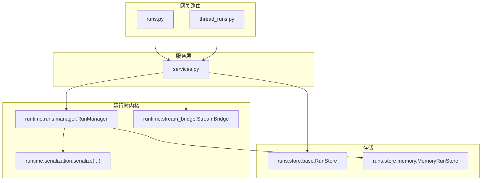
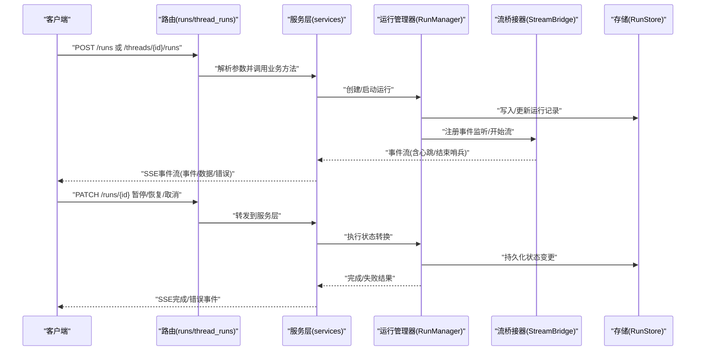
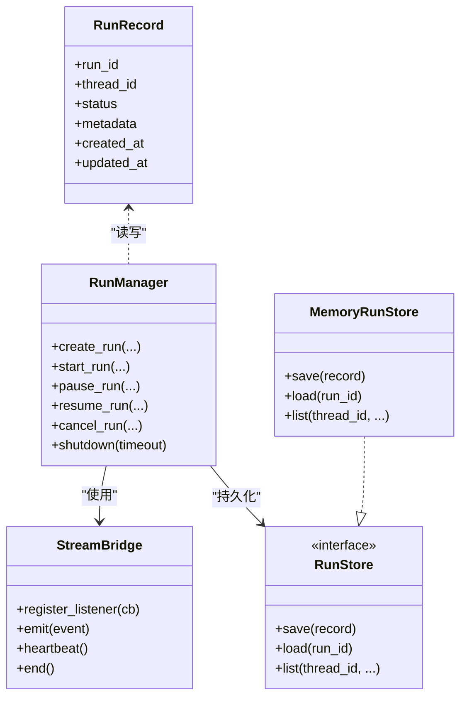
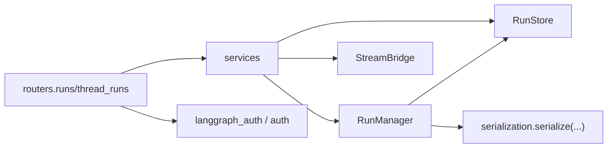

# 运行控制路由

<cite>
**本文引用的文件**
- [runs.py](file://backend/app/gateway/routers/runs.py)
- [thread_runs.py](file://backend/app/gateway/routers/thread_runs.py)
- [services.py](file://backend/app/gateway/services.py)
- [deps.py](file://backend/app/gateway/deps.py)
- [__init__.py](file://backend/packages/harness/deerflow/runtime/__init__.py)
- [manager.py](file://backend/packages/harness/deerflow/runtime/runs/manager.py)
- [schemas.py](file://backend/packages/harness/deerflow/runtime/runs/schemas.py)
- [naming.py](file://backend/packages/harness/deerflow/runtime/runs/naming.py)
- [base.py](file://backend/packages/harness/deerflow/runtime/runs/store/base.py)
- [memory.py](file://backend/packages/harness/deerflow/runtime/runs/store/memory.py)
- [worker.py](file://backend/packages/harness/deerflow/runtime/runs/worker.py)
- [stream_bridge.py](file://backend/packages/harness/deerflow/runtime/stream_bridge.py)
- [serialization.py](file://backend/packages/harness/deerflow/runtime/serialization.py)
- [langgraph_auth.py](file://backend/app/gateway/langgraph_auth.py)
- [auth.py](file://backend/app/gateway/routers/auth.py)
- [utils.py](file://backend/app/gateway/utils.py)
- [API.md](file://backend/docs/API.md)
- [STREAMING.md](file://backend/docs/STREAMING.md)
- [test_runs_api_endpoints.py](file://backend/tests/test_runs_api_endpoints.py)
- [test_runtime_lifecycle_e2e.py](file://backend/tests/test_runtime_lifecycle_e2e.py)
- [test_cancel_run_idempotent.py](file://backend/tests/test_cancel_run_idempotent.py)
</cite>

## 目录
1. [简介](#简介)
2. [项目结构](#项目结构)
3. [核心组件](#核心组件)
4. [架构总览](#架构总览)
5. [详细组件分析](#详细组件分析)
6. [依赖关系分析](#依赖关系分析)
7. [性能考虑](#性能考虑)
8. [故障排查指南](#故障排查指南)
9. [结论](#结论)
10. [附录](#附录)

## 简介
本文件面向DeerFlow运行控制路由（runs与thread_runs）的技术文档，聚焦LangGraph兼容的运行生命周期管理REST API，覆盖运行创建、启动、暂停、恢复、取消与完成等状态转换；详述流式响应（SSE）处理、事件序列管理与错误恢复机制；提供HTTP请求/响应示例（URL模式、请求参数、SSE事件格式与错误处理）；解释运行状态跟踪、进度报告与资源管理策略。

## 项目结构
- 后端网关路由位于 backend/app/gateway/routers，包含 runs.py 与 thread_runs.py。
- 路由调用的服务层位于 backend/app/gateway/services.py，封装运行生命周期业务逻辑与SSE帧格式化。
- 运行时内核与LangGraph兼容实现位于 backend/packages/harness/deerflow/runtime，包含 runs、stream_bridge、serialization 等模块。
- 运行存储后端位于 deerflow.runtime.runs.store（内存与基础接口）。
- 文档与测试分别在 backend/docs 与 backend/tests。

图表来源
- [runs.py](file://backend/app/gateway/routers/runs.py)
- [thread_runs.py](file://backend/app/gateway/routers/thread_runs.py)
- [services.py](file://backend/app/gateway/services.py)
- [manager.py](file://backend/packages/harness/deerflow/runtime/runs/manager.py)
- [stream_bridge.py](file://backend/packages/harness/deerflow/runtime/stream_bridge.py)
- [base.py](file://backend/packages/harness/deerflow/runtime/runs/store/base.py)
- [memory.py](file://backend/packages/harness/deerflow/runtime/runs/store/memory.py)
- [serialization.py](file://backend/packages/harness/deerflow/runtime/serialization.py)

章节来源
- [runs.py](file://backend/app/gateway/routers/runs.py)
- [thread_runs.py](file://backend/app/gateway/routers/thread_runs.py)
- [services.py](file://backend/app/gateway/services.py)

## 核心组件
- 路由层：runs.py 与 thread_runs.py 提供REST端点，负责请求解析、鉴权与参数校验，并委托服务层执行。
- 服务层：services.py 将路由薄层逻辑下沉至运行管理器与流桥接器，统一SSE帧格式化与事件消费。
- 运行管理器：runtime.runs.manager.RunManager 提供运行状态机与生命周期操作（创建、启动、暂停、恢复、取消、完成）。
- 流桥接器：runtime.stream_bridge.StreamBridge 提供事件流桥接与心跳/结束哨兵事件。
- 存储层：runs.store.base.RunStore 与 runs.store.memory.MemoryRunStore 提供运行记录持久化与内存实现。
- 序列化：runtime.serialization.serialize 提供消息与对象的序列化以适配SSE传输。

章节来源
- [__init__.py](file://backend/packages/harness/deerflow/runtime/__init__.py)
- [manager.py](file://backend/packages/harness/deerflow/runtime/runs/manager.py)
- [schemas.py](file://backend/packages/harness/deerflow/runtime/runs/schemas.py)
- [stream_bridge.py](file://backend/packages/harness/deerflow/runtime/stream_bridge.py)
- [base.py](file://backend/packages/harness/deerflow/runtime/runs/store/base.py)
- [memory.py](file://backend/packages/harness/deerflow/runtime/runs/store/memory.py)
- [serialization.py](file://backend/packages/harness/deerflow/runtime/serialization.py)

## 架构总览
运行控制路由采用“路由薄层 + 服务层 + 运行时内核 + 存储”的分层设计。LangGraph兼容的运行执行模型通过RunManager驱动状态机，通过StreamBridge产生事件流，服务层将事件序列格式化为SSE帧返回客户端。

图表来源
- [runs.py](file://backend/app/gateway/routers/runs.py)
- [thread_runs.py](file://backend/app/gateway/routers/thread_runs.py)
- [services.py](file://backend/app/gateway/services.py)
- [manager.py](file://backend/packages/harness/deerflow/runtime/runs/manager.py)
- [stream_bridge.py](file://backend/packages/harness/deerflow/runtime/stream_bridge.py)
- [base.py](file://backend/packages/harness/deerflow/runtime/runs/store/base.py)

## 详细组件分析

### 路由端点与HTTP语义
- 运行创建
  - URL: POST /runs（或 /threads/{id}/runs）
  - 请求体字段（示例，具体以API定义为准）：thread_id、agent_id、input、config、metadata、stream（布尔）
  - 响应：201 Created 返回运行记录（含运行ID、初始状态、创建时间）
- 运行启动
  - URL: POST /runs/{id}/start
  - 请求体：空或可选配置
  - 响应：200 OK 开始流式事件
- 运行暂停
  - URL: PATCH /runs/{id}/pause
  - 请求体：空
  - 响应：200 OK 返回暂停确认
- 运行恢复
  - URL: PATCH /runs/{id}/resume
  - 请求体：空
  - 响应：200 OK 返回恢复确认
- 运行取消
  - URL: PATCH /runs/{id}/cancel
  - 请求体：空
  - 响应：200 OK 返回取消确认
- 运行完成
  - URL: GET /runs/{id}
  - 响应：200 OK 返回最终状态与结果

章节来源
- [runs.py](file://backend/app/gateway/routers/runs.py)
- [thread_runs.py](file://backend/app/gateway/routers/thread_runs.py)
- [API.md](file://backend/docs/API.md)

### LangGraph兼容运行执行模型
- 状态机与生命周期
  - 初始状态：created
  - 可达状态：running、paused、canceling、failed、stopped、complete
  - 终止状态：failed、stopped、complete
- 事件序列
  - 事件类型：动作开始/结束、消息生成、工具调用、流式输出等
  - 心跳与结束哨兵：通过 HEARTBEAT_SENTINEL 与 END_SENTINEL 标识流状态
- 错误恢复
  - 支持幂等取消（测试覆盖）
  - 断连重连：通过断点续跑与检查点恢复
  - 失败回滚：根据中间状态回退并上报错误

章节来源
- [__init__.py](file://backend/packages/harness/deerflow/runtime/__init__.py)
- [manager.py](file://backend/packages/harness/deerflow/runtime/runs/manager.py)
- [schemas.py](file://backend/packages/harness/deerflow/runtime/runs/schemas.py)
- [stream_bridge.py](file://backend/packages/harness/deerflow/runtime/stream_bridge.py)
- [test_cancel_run_idempotent.py](file://backend/tests/test_cancel_run_idempotent.py)

### 流式响应与SSE事件格式
- SSE事件格式
  - 事件名：如 message、data、error、done
  - 数据：JSON序列化后的事件载荷
  - ID：事件ID（可选）
- 事件序列
  - 心跳事件：保持连接活跃
  - 数据事件：流式输出片段
  - 结束事件：END_SENTINEL 标识流结束
- 服务层SSE格式化
  - format_sse 函数用于将事件与数据打包为SSE帧

章节来源
- [services.py](file://backend/app/gateway/services.py)
- [STREAMING.md](file://backend/docs/STREAMING.md)
- [stream_bridge.py](file://backend/packages/harness/deerflow/runtime/stream_bridge.py)

### 运行状态跟踪、进度报告与资源管理
- 状态跟踪
  - RunRecord 记录运行元信息与状态
  - RunManager 维护状态机与转换日志
- 进度报告
  - 通过事件序列中的阶段性事件进行进度反馈
  - 支持增量输出与最终聚合
- 资源管理
  - 流桥接器生命周期与资源释放
  - 存储层按需清理与持久化
  - 运行回收与重启时的上下文重建

章节来源
- [schemas.py](file://backend/packages/harness/deerflow/runtime/runs/schemas.py)
- [manager.py](file://backend/packages/harness/deerflow/runtime/runs/manager.py)
- [base.py](file://backend/packages/harness/deerflow/runtime/runs/store/base.py)
- [memory.py](file://backend/packages/harness/deerflow/runtime/runs/store/memory.py)

### 类与关系图（代码级）

图表来源
- [manager.py](file://backend/packages/harness/deerflow/runtime/runs/manager.py)
- [stream_bridge.py](file://backend/packages/harness/deerflow/runtime/stream_bridge.py)
- [base.py](file://backend/packages/harness/deerflow/runtime/runs/store/base.py)
- [memory.py](file://backend/packages/harness/deerflow/runtime/runs/store/memory.py)
- [schemas.py](file://backend/packages/harness/deerflow/runtime/runs/schemas.py)

## 依赖关系分析
- 路由依赖服务层，服务层依赖运行管理器与流桥接器，运行管理器依赖存储与序列化。
- 鉴权与内部认证通过网关中间件与langgraph_auth集成。
- 运行命名与根运行名称解析由命名模块提供。

图表来源
- [runs.py](file://backend/app/gateway/routers/runs.py)
- [thread_runs.py](file://backend/app/gateway/routers/thread_runs.py)
- [services.py](file://backend/app/gateway/services.py)
- [langgraph_auth.py](file://backend/app/gateway/langgraph_auth.py)
- [auth.py](file://backend/app/gateway/routers/auth.py)
- [serialization.py](file://backend/packages/harness/deerflow/runtime/serialization.py)

章节来源
- [deps.py](file://backend/app/gateway/deps.py)
- [utils.py](file://backend/app/gateway/utils.py)

## 性能考虑
- 流式传输
  - 使用SSE减少轮询开销，心跳事件维持连接活性
- 并发与背压
  - 事件监听与SSE发送解耦，避免阻塞运行主循环
- 序列化成本
  - 对大消息采用增量序列化与分片传输
- 存储与索引
  - 内存存储适合短生命周期运行；长生命周期建议自定义持久化实现

## 故障排查指南
- 常见错误与处理
  - 409 冲突：运行状态不支持当前操作（如在非created状态再次启动）
  - 404 未找到：运行ID不存在
  - 400 参数错误：请求体字段缺失或类型不符
  - 500 服务器错误：运行异常终止，检查运行日志与事件存储
- 幂等取消
  - 取消请求可重复调用而不改变最终状态
- 断连与重连
  - 客户端可基于事件ID恢复订阅，确保不丢失事件
- 日志与追踪
  - 使用网关日志与运行管理器日志定位问题

章节来源
- [services.py](file://backend/app/gateway/services.py)
- [test_runs_api_endpoints.py](file://backend/tests/test_runs_api_endpoints.py)
- [test_runtime_lifecycle_e2e.py](file://backend/tests/test_runtime_lifecycle_e2e.py)
- [test_cancel_run_idempotent.py](file://backend/tests/test_cancel_run_idempotent.py)

## 结论
运行控制路由通过LangGraph兼容的运行时内核，提供了完整的运行生命周期管理与流式事件输出能力。路由层薄而清晰，服务层集中处理业务与SSE格式化，运行管理器与流桥接器保证事件一致性与可靠性。结合存储与序列化模块，系统实现了高可用、可观测且可扩展的运行控制平台。

## 附录
- 示例请求/响应（概念性）
  - 创建运行
    - 请求: POST /runs
    - 请求体: { "thread_id": "...", "agent_id": "...", "input": {}, "stream": true }
    - 响应: 201, { "run_id": "...", "status": "created", "created_at": "..." }
  - 启动运行
    - 请求: POST /runs/{id}/start
    - 响应: 200, SSE流（事件: message/data/error/done）
  - 暂停/恢复/取消
    - 请求: PATCH /runs/{id}/pause | resume | cancel
    - 响应: 200, 确认事件
  - 查询运行
    - 请求: GET /runs/{id}
    - 响应: 200, { "status": "...", "final_result": {} }
- SSE事件格式
  - 事件: "message" | "data" | "error" | "done"
  - 数据: JSON字符串
  - ID: 可选事件标识