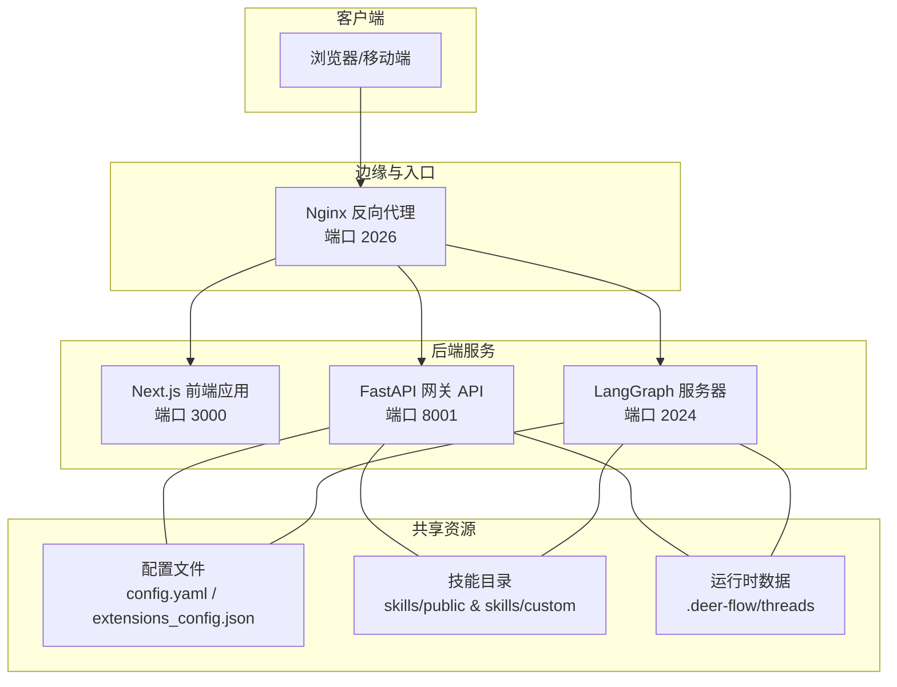
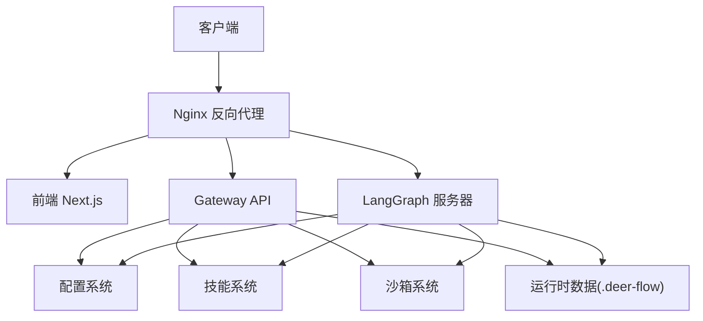
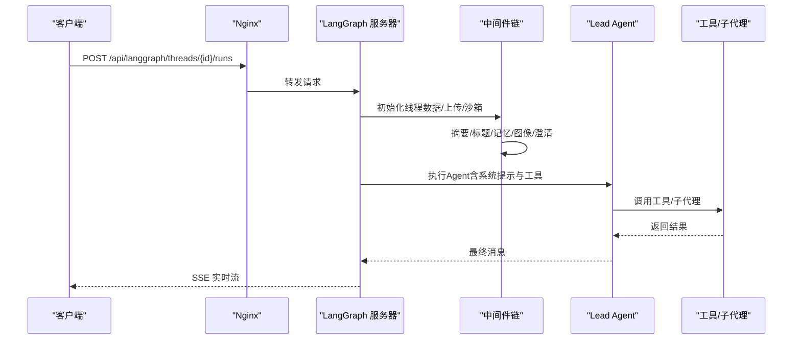
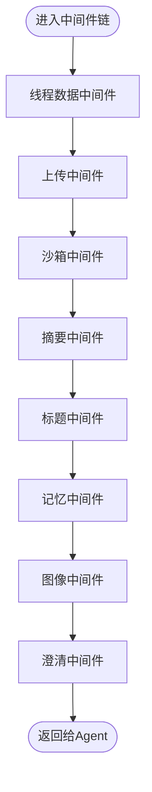
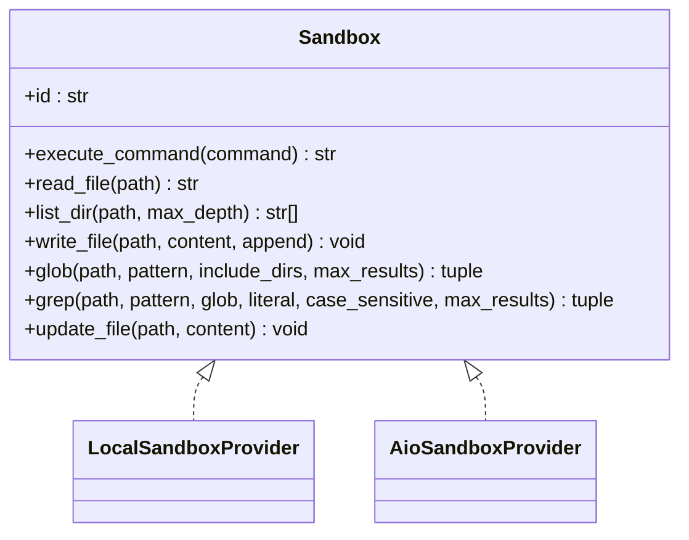
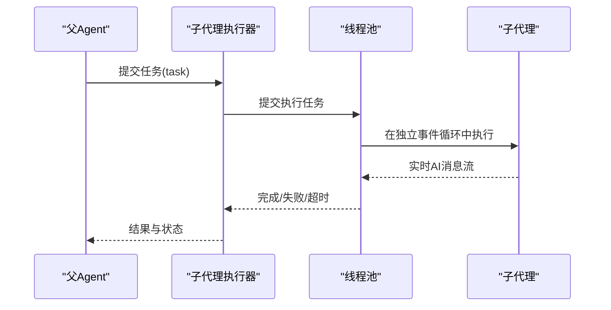
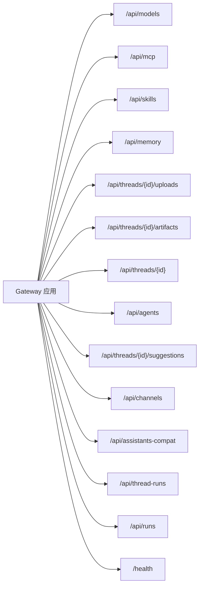
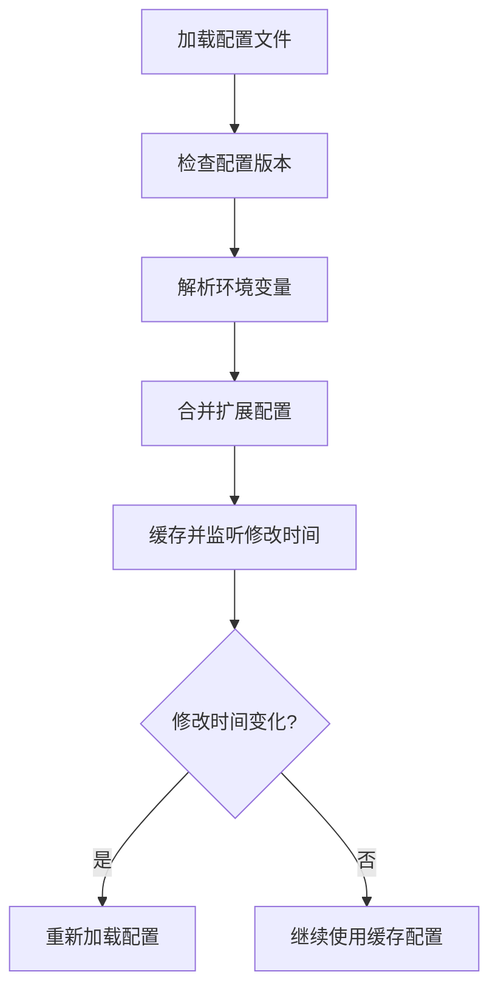
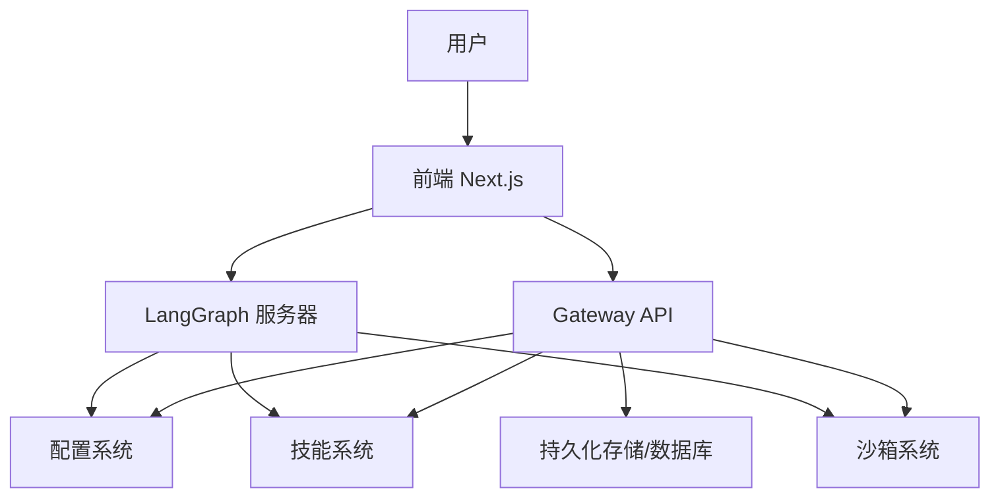

# 架构设计

<cite>
**本文引用的文件**
- [backend/README.md](file://backend/README.md)
- [frontend/README.md](file://frontend/README.md)
- [backend/docs/ARCHITECTURE.md](file://backend/docs/ARCHITECTURE.md)
- [backend/pyproject.toml](file://backend/pyproject.toml)
- [frontend/package.json](file://frontend/package.json)
- [backend/app/gateway/app.py](file://backend/app/gateway/app.py)
- [backend/packages/harness/deerflow/agents/lead_agent/agent.py](file://backend/packages/harness/deerflow/agents/lead_agent/agent.py)
- [backend/packages/harness/deerflow/sandbox/sandbox.py](file://backend/packages/harness/deerflow/sandbox/sandbox.py)
- [backend/packages/harness/deerflow/subagents/executor.py](file://backend/packages/harness/deerflow/subagents/executor.py)
- [backend/packages/harness/deerflow/agents/middlewares/tool_error_handling_middleware.py](file://backend/packages/harness/deerflow/agents/middlewares/tool_error_handling_middleware.py)
- [backend/packages/harness/deerflow/tools/__init__.py](file://backend/packages/harness/deerflow/tools/__init__.py)
- [backend/packages/harness/deerflow/config/app_config.py](file://backend/packages/harness/deerflow/config/app_config.py)
- [backend/langgraph.json](file://backend/langgraph.json)
- [docker/docker-compose.yaml](file://docker/docker-compose.yaml)
</cite>

## 目录
1. [引言](#引言)
2. [项目结构](#项目结构)
3. [核心组件](#核心组件)
4. [架构总览](#架构总览)
5. [详细组件分析](#详细组件分析)
6. [依赖分析](#依赖分析)
7. [性能考量](#性能考量)
8. [故障排查指南](#故障排查指南)
9. [结论](#结论)
10. [附录](#附录)

## 引言
本文件面向DeerFlow的架构设计与实现，聚焦其基于LangGraph的多代理编排、前后端分离与微服务化部署。文档从系统边界、组件交互、数据流、集成模式出发，解释技术选型、权衡与约束，并给出基础设施要求、可扩展性与部署拓扑建议。同时覆盖安全、可观测性（LangSmith/Langfuse）与灾难恢复等横切关注点，以及技术栈、第三方依赖与版本兼容性。

## 项目结构
DeerFlow采用前后端分离与微服务化架构：前端使用Next.js，后端由LangGraph服务器与FastAPI网关组成，通过Nginx统一反向代理对外提供服务；容器化部署通过docker-compose编排，支持Docker-in-Docker沙箱与可选的Kubernetes沙箱供应器。

图表来源
- [backend/docs/ARCHITECTURE.md](file://backend/docs/ARCHITECTURE.md)
- [docker/docker-compose.yaml](file://docker/docker-compose.yaml)

章节来源
- [backend/docs/ARCHITECTURE.md](file://backend/docs/ARCHITECTURE.md)
- [docker/docker-compose.yaml](file://docker/docker-compose.yaml)

## 核心组件
- LangGraph 服务器：多代理编排与运行时，负责线程状态管理、中间件链执行、工具调用与SSE实时流式响应。
- 网关 API（FastAPI）：提供模型、MCP、技能、内存、上传、工件与线程清理等REST接口，补充LangGraph未覆盖的非代理能力。
- Lead Agent：主代理工厂，构建带中间件链的Agent，注入系统提示、工具集与子代理能力。
- 中间件链：跨领域关注点（线程隔离、上传处理、沙箱获取、摘要、标题生成、记忆、图像注入、澄清请求拦截等）按序执行。
- 沙箱系统：抽象执行环境接口，支持本地直连与Docker隔离两种提供者，虚拟路径映射到线程私有工作区。
- 子代理系统：并发任务委派与异步执行，支持超时、取消与结果轮询。
- 工具生态：内置工具、社区工具（搜索/抓取）、MCP工具与技能注入。
- 配置系统：集中式配置加载与热重载，支持环境变量解析与版本检查。

章节来源
- [backend/README.md](file://backend/README.md)
- [backend/docs/ARCHITECTURE.md](file://backend/docs/ARCHITECTURE.md)
- [backend/packages/harness/deerflow/agents/lead_agent/agent.py](file://backend/packages/harness/deerflow/agents/lead_agent/agent.py)
- [backend/packages/harness/deerflow/sandbox/sandbox.py](file://backend/packages/harness/deerflow/sandbox/sandbox.py)
- [backend/packages/harness/deerflow/subagents/executor.py](file://backend/packages/harness/deerflow/subagents/executor.py)
- [backend/packages/harness/deerflow/agents/middlewares/tool_error_handling_middleware.py](file://backend/packages/harness/deerflow/agents/middlewares/tool_error_handling_middleware.py)
- [backend/packages/harness/deerflow/config/app_config.py](file://backend/packages/harness/deerflow/config/app_config.py)

## 架构总览
系统采用“统一入口 + 多服务协同”的微服务架构。Nginx作为单一入口，将API路由分流至LangGraph或Gateway；前端Next.js提供用户界面与AI元素展示；后端LangGraph负责智能体编排与实时流；Gateway提供非Agent类业务能力与文件/工件管理。

图表来源
- [backend/docs/ARCHITECTURE.md](file://backend/docs/ARCHITECTURE.md)
- [backend/langgraph.json](file://backend/langgraph.json)

章节来源
- [backend/docs/ARCHITECTURE.md](file://backend/docs/ARCHITECTURE.md)
- [backend/langgraph.json](file://backend/langgraph.json)

## 详细组件分析

### LangGraph 服务器与 Lead Agent
Lead Agent是LangGraph运行时入口，负责：
- 动态模型选择（思考/推理/视觉支持）
- 中间件链装配（严格顺序）
- 工具系统整合（沙箱/MCP/社区/内置/技能）
- 子代理委派与并发执行
- 系统提示注入（技能、记忆、工作目录）

图表来源
- [backend/README.md](file://backend/README.md)
- [backend/packages/harness/deerflow/agents/lead_agent/agent.py](file://backend/packages/harness/deerflow/agents/lead_agent/agent.py)

章节来源
- [backend/README.md](file://backend/README.md)
- [backend/packages/harness/deerflow/agents/lead_agent/agent.py](file://backend/packages/harness/deerflow/agents/lead_agent/agent.py)

### 中间件链与职责
中间件链严格顺序执行，确保横切关注点在正确时机生效：
1) 线程数据中间件：初始化线程私有工作区
2) 上传中间件：注入新上传文件到上下文
3) 沙箱中间件：获取隔离执行环境
4) 摘要中间件：接近令牌上限时压缩上下文
5) 标题中间件：首次交换后自动生成对话标题
6) 记忆中间件：异步提取并注入记忆
7) 图像中间件：为具备视觉能力的模型注入图像数据
8) 澄清中间件：拦截澄清请求，优先于其他中间件

图表来源
- [backend/README.md](file://backend/README.md)
- [backend/packages/harness/deerflow/agents/middlewares/tool_error_handling_middleware.py](file://backend/packages/harness/deerflow/agents/middlewares/tool_error_handling_middleware.py)

章节来源
- [backend/README.md](file://backend/README.md)
- [backend/packages/harness/deerflow/agents/middlewares/tool_error_handling_middleware.py](file://backend/packages/harness/deerflow/agents/middlewares/tool_error_handling_middleware.py)

### 沙箱系统与虚拟路径
沙箱抽象定义了命令执行、文件读写、目录遍历、二进制更新与搜索能力；提供本地直连与Docker隔离两种提供者；通过虚拟路径映射到线程私有目录，确保并发安全与隔离。

图表来源
- [backend/packages/harness/deerflow/sandbox/sandbox.py](file://backend/packages/harness/deerflow/sandbox/sandbox.py)

章节来源
- [backend/packages/harness/deerflow/sandbox/sandbox.py](file://backend/packages/harness/deerflow/sandbox/sandbox.py)

### 子代理执行引擎
子代理支持并发委派、异步执行、超时与取消；通过线程池调度与事件循环隔离避免阻塞；结果以状态跟踪与SSE事件形式回传。

图表来源
- [backend/packages/harness/deerflow/subagents/executor.py](file://backend/packages/harness/deerflow/subagents/executor.py)

章节来源
- [backend/packages/harness/deerflow/subagents/executor.py](file://backend/packages/harness/deerflow/subagents/executor.py)

### 网关 API 与路由
网关提供REST接口，挂载模型、MCP、技能、内存、工件、上传、线程清理、代理管理、建议、通道与运行生命周期等路由；健康检查端点用于运维监控。

图表来源
- [backend/app/gateway/app.py](file://backend/app/gateway/app.py)

章节来源
- [backend/app/gateway/app.py](file://backend/app/gateway/app.py)

### 配置系统与热重载
配置系统集中管理模型、工具、沙箱、摘要、记忆、子代理、守卫护栏、电路保护、检查点与流桥等；支持环境变量解析与配置版本检查；文件变更触发自动重载，保障运行时一致性。

图表来源
- [backend/packages/harness/deerflow/config/app_config.py](file://backend/packages/harness/deerflow/config/app_config.py)

章节来源
- [backend/packages/harness/deerflow/config/app_config.py](file://backend/packages/harness/deerflow/config/app_config.py)

## 依赖分析
- 技术栈与版本
  - 后端：LangGraph 1.0.6+、LangChain 1.2.3+、FastAPI 0.115.0+、langchain-mcp-adapters、agent-sandbox、markitdown、tavily-python/firecrawl-py 等
  - 前端：Next.js 16、React 19、Tailwind CSS 4、Shadcn UI、MagicUI、React Bits
- 第三方协议与工具：MCP（模型上下文协议）、Web搜索/抓取（Tavily/Firecrawl）、IM通道（飞书/Slack/Telegram）
- 运行时依赖：Nginx、Uvicorn、SSE-Starlette、SQLAlchemy/PyODBC（数据库访问）

章节来源
- [backend/pyproject.toml](file://backend/pyproject.toml)
- [frontend/package.json](file://frontend/package.json)
- [backend/README.md](file://backend/README.md)

## 性能考量
- 缓存策略：MCP工具基于文件mtime失效；配置一次性加载并在变更时重载；技能解析启动时缓存
- 流式传输：SSE实现实时响应，降低首token延迟，提升长任务可见性
- 上下文管理：摘要中间件在接近令牌限制时压缩历史，保留近期消息
- 并发与隔离：子代理线程池与事件循环隔离，避免阻塞；沙箱提供并发安全的读改写序列化

章节来源
- [backend/docs/ARCHITECTURE.md](file://backend/docs/ARCHITECTURE.md)
- [backend/packages/harness/deerflow/subagents/executor.py](file://backend/packages/harness/deerflow/subagents/executor.py)

## 故障排查指南
- LangGraph 与 Gateway 启停：通过Nginx统一入口；LangGraph使用langgraph dev，Gateway使用uvicorn
- 配置问题：检查config.yaml与extensions_config.json路径与权限；确认环境变量已解析
- 沙箱问题：确认DooD（Docker-outside-Docker）socket挂载；生产推荐使用Docker隔离提供者
- 观测性：启用LangSmith/Langfuse追踪，定位工具调用、中间件与模型调用瓶颈
- 健康检查：使用/health端点验证服务可用性

章节来源
- [backend/README.md](file://backend/README.md)
- [docker/docker-compose.yaml](file://docker/docker-compose.yaml)

## 结论
DeerFlow以LangGraph为核心，结合中间件链与工具生态，实现了可扩展的多代理编排；通过前后端分离与微服务化部署，配合Nginx统一入口与容器编排，满足开发与生产的多样化需求。配置系统与热重载机制保证运行时灵活性；沙箱与子代理并发执行提供强大的任务委派与隔离能力；可观测性与安全加固（路径校验、进程隔离、环境变量解析）确保系统稳定与可控。

## 附录

### 系统上下文图（概念）

[此图为概念示意，不直接映射具体源码文件]

### 部署拓扑与端口
- Nginx：端口2026（反向代理）
- 前端：Next.js（默认3000，容器内通过Nginx暴露）
- Gateway：FastAPI（8001）
- LangGraph：langgraph dev（2024）
- 可选：Provisioner（Kubernetes模式沙箱供应器，8002健康检查）

章节来源
- [docker/docker-compose.yaml](file://docker/docker-compose.yaml)