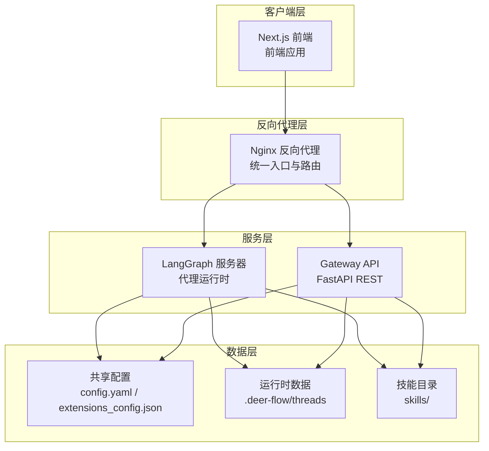
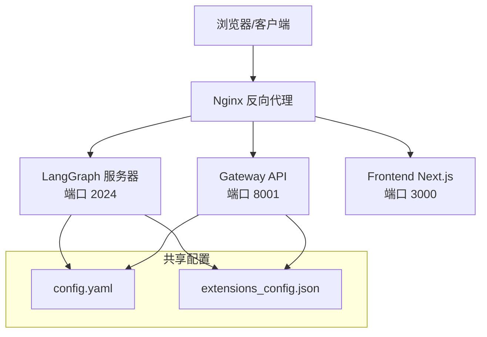
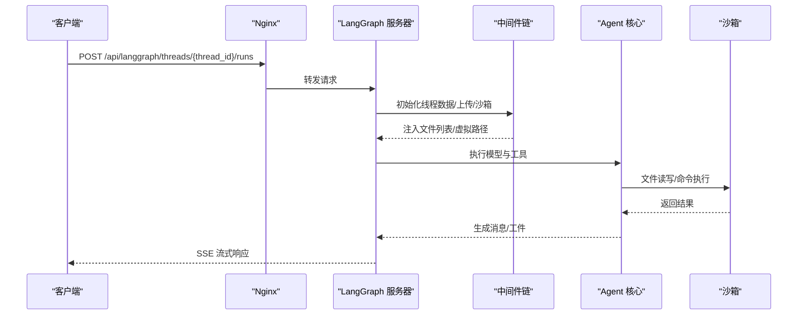
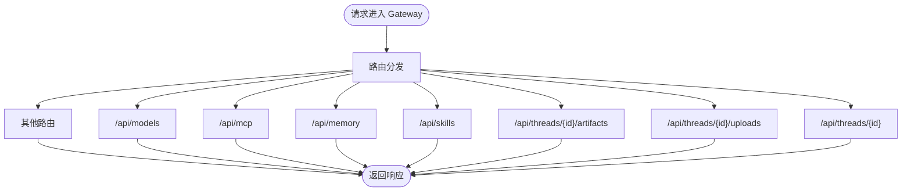
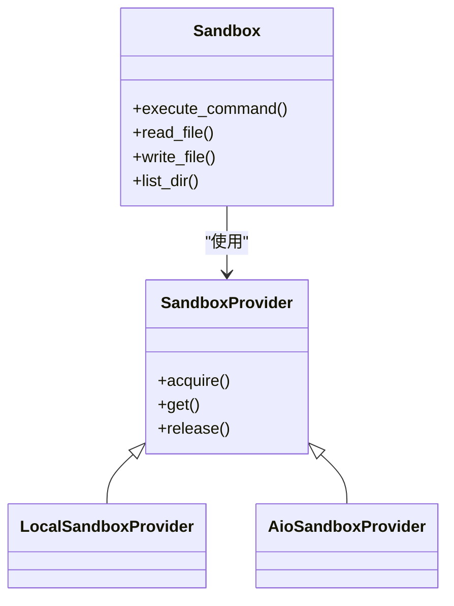
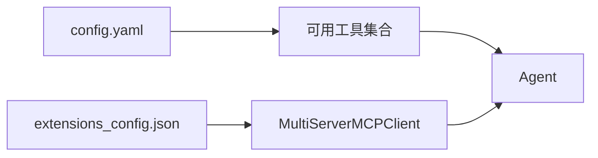
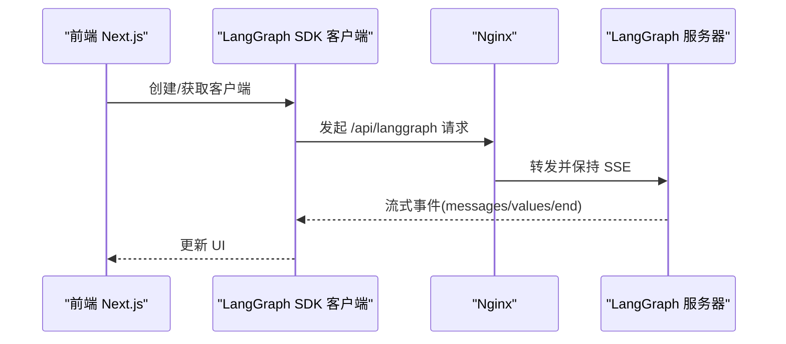
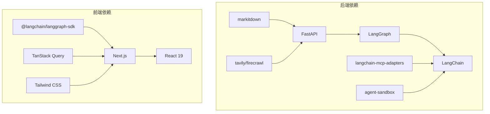

# 系统概览

<cite>
**本文引用的文件**
- [backend/README.md](file://backend/README.md)
- [frontend/README.md](file://frontend/README.md)
- [backend/docs/ARCHITECTURE.md](file://backend/docs/ARCHITECTURE.md)
- [backend/pyproject.toml](file://backend/pyproject.toml)
- [frontend/package.json](file://frontend/package.json)
- [docker/docker-compose.yaml](file://docker/docker-compose.yaml)
- [docker/nginx/nginx.conf](file://docker/nginx/nginx.conf)
- [backend/app/gateway/app.py](file://backend/app/gateway/app.py)
- [backend/packages/harness/deerflow/client.py](file://backend/packages/harness/deerflow/client.py)
- [frontend/src/core/api/api-client.ts](file://frontend/src/core/api/api-client.ts)
- [config.example.yaml](file://config.example.yaml)
- [extensions_config.example.json](file://extensions_config.example.json)
- [backend/langgraph.json](file://backend/langgraph.json)
</cite>

## 目录
1. [简介](#简介)
2. [项目结构](#项目结构)
3. [核心组件](#核心组件)
4. [架构总览](#架构总览)
5. [详细组件分析](#详细组件分析)
6. [依赖分析](#依赖分析)
7. [性能考量](#性能考量)
8. [故障排查指南](#故障排查指南)
9. [结论](#结论)
10. [附录](#附录)

## 简介
DeerFlow 是一个基于 LangGraph 的 AI 超级代理系统，具备沙箱执行、持久化记忆与可扩展工具集成能力。系统采用前后端分离与微服务架构，通过反向代理统一入口路由到 LangGraph 服务器与网关 API（Gateway），前端使用 Next.js 提供现代化 Web 界面，后端以 FastAPI 提供 REST 接口，并通过 MCP 协议与第三方工具/服务集成。

系统设计理念强调：
- 分层清晰：客户端层、反向代理层、服务层、数据层
- 微服务解耦：LangGraph 专注代理运行时，Gateway 负责非代理类业务接口
- LangGraph 多代理编排：Lead Agent 为核心，中间件链处理横切关注点，子代理并发执行任务
- 安全隔离：沙箱执行、路径安全校验、线程隔离
- 可观测性：内置 LangSmith/Langfuse 追踪支持

## 项目结构
仓库采用多模块组织方式：
- backend：后端核心，包含 LangGraph 代理运行时、Gateway API、沙箱、工具、模型工厂、MCP 集成等
- frontend：Next.js 前端应用，提供聊天界面、工作区、设置等功能
- docker：生产级容器编排，含 Nginx 反向代理、LangGraph、Gateway、Frontend、可选的 Sandbox Provisioner
- docs：架构与配置文档
- skills：技能目录，支持公共与自定义技能注入
- mcp_servers：示例 MCP 服务器脚本
- scripts：安装、部署、健康检查等辅助脚本

图表来源
- [docker/docker-compose.yaml:24-203](file://docker/docker-compose.yaml#L24-L203)
- [docker/nginx/nginx.conf:38-235](file://docker/nginx/nginx.conf#L38-L235)
- [backend/docs/ARCHITECTURE.md:5-51](file://backend/docs/ARCHITECTURE.md#L5-L51)

章节来源
- [backend/README.md:1-419](file://backend/README.md#L1-L419)
- [frontend/README.md:1-153](file://frontend/README.md#L1-L153)
- [backend/docs/ARCHITECTURE.md:1-485](file://backend/docs/ARCHITECTURE.md#L1-L485)

## 核心组件
- LangGraph 服务器：代理运行时，负责线程管理、中间件链、工具调用、SSE 流式响应
- Gateway API：FastAPI 应用，提供模型、MCP、技能、上传、线程清理、工件等 REST 接口
- 沙箱系统：提供隔离执行环境，支持本地与容器两种 Provider
- 工具生态：内置工具、社区工具、MCP 工具、技能注入
- 中间件链：线程数据、上传处理、沙箱获取、摘要、标题生成、任务跟踪、图像注入、澄清处理
- 子代理系统：并发委托与后台执行，支持超时与状态跟踪
- 记忆系统：LLM 驱动的持久化上下文，支持去抖更新与提示注入
- 前端 Next.js：Web 界面与交互，通过 LangGraph SDK 与后端通信

章节来源
- [backend/README.md:44-138](file://backend/README.md#L44-L138)
- [backend/docs/ARCHITECTURE.md:55-127](file://backend/docs/ARCHITECTURE.md#L55-L127)

## 架构总览
系统采用“统一反向代理 + 多服务”的微服务架构：
- Nginx 作为统一入口，按路径将请求路由至 LangGraph 或 Gateway
- LangGraph 专注于代理运行时与流式输出
- Gateway 提供非代理类业务接口（模型、MCP、技能、上传、工件、线程清理）
- 前端 Next.js 通过 LangGraph SDK 与 LangGraph 交互，同时调用 Gateway 获取静态资源与配置

图表来源
- [backend/docs/ARCHITECTURE.md:7-51](file://backend/docs/ARCHITECTURE.md#L7-L51)
- [docker/docker-compose.yaml:24-203](file://docker/docker-compose.yaml#L24-L203)
- [docker/nginx/nginx.conf:38-235](file://docker/nginx/nginx.conf#L38-L235)

章节来源
- [backend/docs/ARCHITECTURE.md:1-485](file://backend/docs/ARCHITECTURE.md#L1-L485)

## 详细组件分析

### LangGraph 服务器
- 入口与职责：通过 langgraph.json 指定代理工厂函数，负责线程状态、中间件链、工具执行、SSE 流式输出
- 中间件链顺序严格，覆盖线程隔离、上传注入、沙箱获取、摘要、标题、任务跟踪、图像、澄清处理
- 线程状态扩展：在 AgentState 基础上增加沙箱、工件、工作区路径、标题、任务列表、已查看图像等字段

图表来源
- [backend/docs/ARCHITECTURE.md:344-380](file://backend/docs/ARCHITECTURE.md#L344-L380)
- [backend/langgraph.json:1-15](file://backend/langgraph.json#L1-L15)

章节来源
- [backend/docs/ARCHITECTURE.md:55-127](file://backend/docs/ARCHITECTURE.md#L55-L127)

### Gateway API
- 路由模块：models、mcp、memory、skills、artifacts、uploads、threads、agents、suggestions、channels、runs、thread_runs 等
- 生命周期：启动时加载配置、初始化 LangGraph 运行时组件；关闭时优雅停止 IM 渠道服务
- 健康检查：提供 /health 端点

图表来源
- [backend/app/gateway/app.py:182-231](file://backend/app/gateway/app.py#L182-L231)

章节来源
- [backend/app/gateway/app.py:1-236](file://backend/app/gateway/app.py#L1-L236)

### 沙箱系统
- 抽象接口：execute_command/read_file/write_file/list_dir
- Provider：LocalSandboxProvider（开发）与 AioSandboxProvider（容器/生产）
- 虚拟路径映射：/mnt/user-data/{workspace,uploads,outputs} → 线程私有物理目录；/mnt/skills → skills/
- 安全与并发：文件写入采用按 (sandbox.id, path) 的串行化策略，避免并发冲突

图表来源
- [backend/docs/ARCHITECTURE.md:147-180](file://backend/docs/ARCHITECTURE.md#L147-L180)

章节来源
- [backend/docs/ARCHITECTURE.md:147-190](file://backend/docs/ARCHITECTURE.md#L147-L190)

### 工具与 MCP 集成
- 工具来源：内置工具、配置化工具、MCP 工具
- MCP 支持：多服务器客户端，支持 stdio、SSE、HTTP 传输
- 配置热更新：extensions_config.json 修改后，MCP 管理器检测 mtime 并重新初始化

图表来源
- [backend/docs/ARCHITECTURE.md:191-218](file://backend/docs/ARCHITECTURE.md#L191-L218)
- [backend/docs/ARCHITECTURE.md:267-303](file://backend/docs/ARCHITECTURE.md#L267-L303)

章节来源
- [backend/docs/ARCHITECTURE.md:191-303](file://backend/docs/ARCHITECTURE.md#L191-L303)

### 前端与 SDK 集成
- 前端技术栈：Next.js App Router、React 19、Tailwind CSS 4、Shadcn UI、MagicUI
- API 客户端：通过 LangGraph SDK 客户端封装，兼容流式选项，提供单例缓存
- 环境变量：支持覆盖后端 API 地址，默认通过 Nginx 代理

图表来源
- [frontend/src/core/api/api-client.ts:1-45](file://frontend/src/core/api/api-client.ts#L1-L45)
- [frontend/README.md:1-153](file://frontend/README.md#L1-L153)
- [docker/nginx/nginx.conf:63-87](file://docker/nginx/nginx.conf#L63-L87)

章节来源
- [frontend/src/core/api/api-client.ts:1-45](file://frontend/src/core/api/api-client.ts#L1-L45)
- [frontend/README.md:1-153](file://frontend/README.md#L1-L153)

### 配置与扩展
- 主配置 config.yaml：模型、工具、沙箱、摘要、子代理、记忆、标题生成等
- 扩展配置 extensions_config.json：MCP 服务器与技能状态
- 环境变量：DEER_FLOW_CONFIG_PATH、DEER_FLOW_EXTENSIONS_CONFIG_PATH、各提供商密钥

章节来源
- [config.example.yaml:1-800](file://config.example.yaml#L1-L800)
- [extensions_config.example.json:1-45](file://extensions_config.example.json#L1-L45)

## 依赖分析
- 后端技术栈：LangGraph、LangChain、FastAPI、langchain-mcp-adapters、agent-sandbox、markitdown、tavily/firecrawl 等
- 前端技术栈：Next.js 16、React 19、@langchain/langgraph-sdk、TanStack Query、Tailwind CSS 等
- 反向代理：Nginx，支持 CORS、SSE、长连接与大文件上传
- 容器编排：docker-compose，包含 nginx、frontend、gateway、langgraph、可选 provisioner

图表来源
- [backend/pyproject.toml:1-37](file://backend/pyproject.toml#L1-L37)
- [frontend/package.json:1-119](file://frontend/package.json#L1-L119)

章节来源
- [backend/pyproject.toml:1-37](file://backend/pyproject.toml#L1-L37)
- [frontend/package.json:1-119](file://frontend/package.json#L1-L119)

## 性能考量
- 缓存策略：MCP 工具基于文件 mtime 缓存；配置按需重载；技能解析一次性缓存
- 流式传输：SSE 减少首 token 时间，提升长操作的进度可见性
- 上下文管理：摘要中间件在接近 token 限制时进行压缩，保留最近消息
- 沙箱并发：容器沙箱支持并发容器，受限于副本数与资源；本地沙箱适合开发场景
- 前端优化：LangGraph SDK 客户端单例缓存，减少重复初始化开销

章节来源
- [backend/docs/ARCHITECTURE.md:466-485](file://backend/docs/ARCHITECTURE.md#L466-L485)

## 故障排查指南
- 配置问题：检查 config.yaml 与 extensions_config.json 路径与权限，确认环境变量是否正确
- 网络与代理：确认 Nginx 路由规则、上游服务可达性、SSE 与大文件上传配置
- LangGraph/Gateway：查看日志与健康检查端点，确认配置加载与 LangGraph 运行时初始化
- 沙箱执行：验证沙箱 Provider 类型、Docker Socket 权限、容器镜像与端口映射
- 前端调试：确认 API 基础地址、LangGraph SDK 客户端实例、流式事件处理

章节来源
- [backend/app/gateway/app.py:42-89](file://backend/app/gateway/app.py#L42-L89)
- [docker/docker-compose.yaml:1-203](file://docker/docker-compose.yaml#L1-L203)
- [docker/nginx/nginx.conf:1-237](file://docker/nginx/nginx.conf#L1-L237)

## 结论
DeerFlow 通过前后端分离与微服务架构实现了高内聚低耦合的系统设计。LangGraph 服务器聚焦代理运行时与流式交互，Gateway 提供丰富的非代理类业务接口，Nginx 统一入口与路由，前端以 Next.js 提供现代化体验。系统在安全性、可观测性、可扩展性与部署灵活性方面均具备良好基础，适合从开发到生产的多种场景。

## 附录
- 系统边界与外部依赖：Nginx、LangGraph、FastAPI、Docker/AIO Sandbox、MCP 服务器、前端 Next.js
- 集成点：LangGraph SDK、MCP 协议、文件上传与转换、工件存储、内存数据
- 部署灵活性：docker-compose 支持多环境与多 Provider；Nginx 可切换上游与重写规则；LangSmith/Langfuse 可插拔追踪