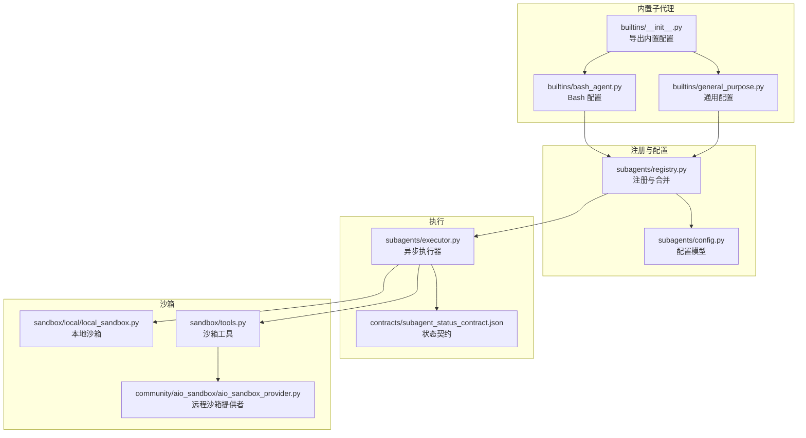
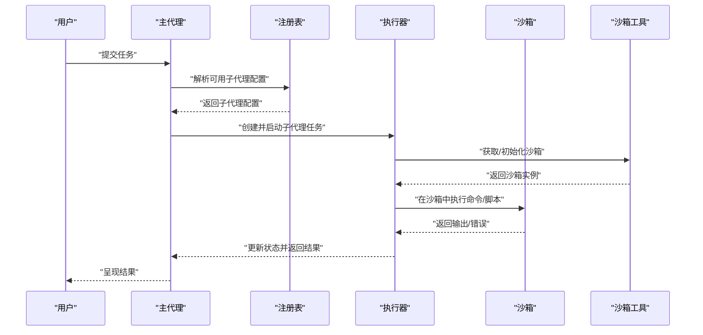
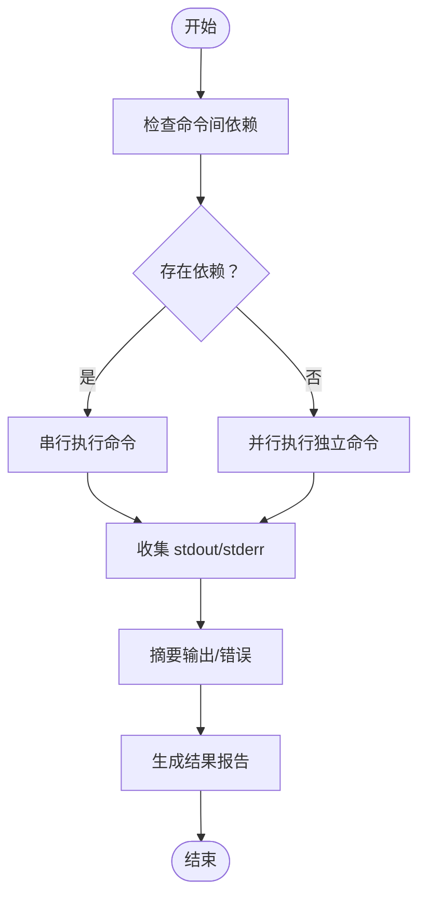
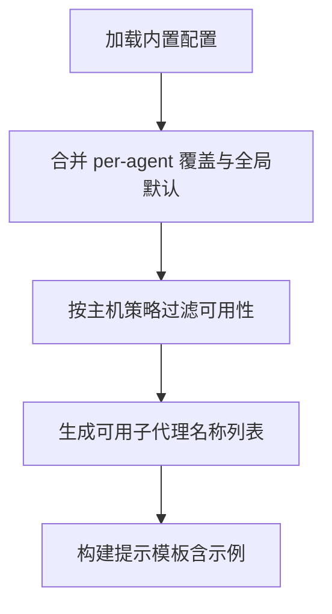
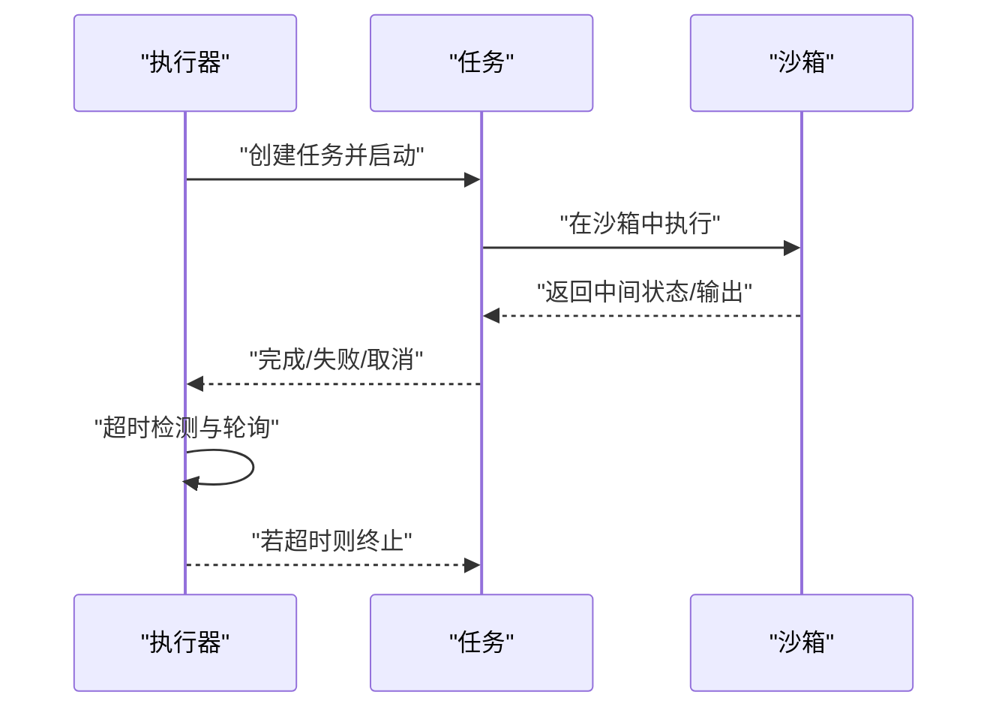
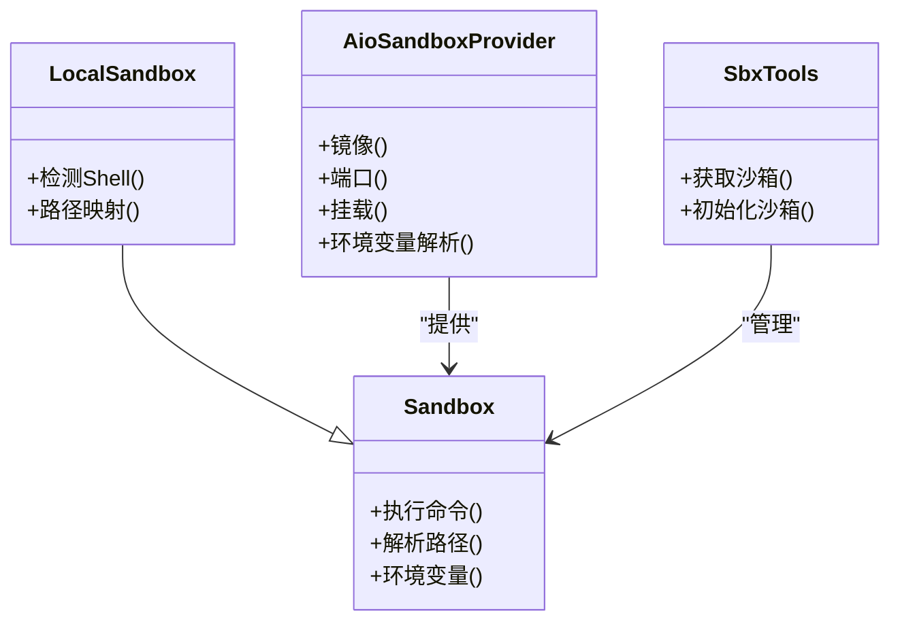
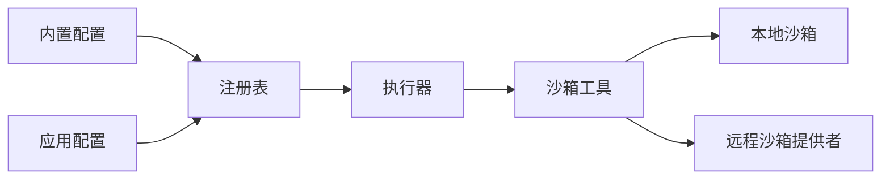

# 内置子代理

<cite>
**本文引用的文件**
- [backend/packages/harness/deerflow/subagents/builtins/__init__.py](file://backend/packages/harness/deerflow/subagents/builtins/__init__.py)
- [backend/packages/harness/deerflow/subagents/builtins/bash_agent.py](file://backend/packages/harness/deerflow/subagents/builtins/bash_agent.py)
- [backend/packages/harness/deerflow/subagents/builtins/general_purpose.py](file://backend/packages/harness/deerflow/subagents/builtins/general_purpose.py)
- [backend/packages/harness/deerflow/subagents/config.py](file://backend/packages/harness/deerflow/subagents/config.py)
- [backend/packages/harness/deerflow/subagents/registry.py](file://backend/packages/harness/deerflow/subagents/registry.py)
- [backend/packages/harness/deerflow/subagents/executor.py](file://backend/packages/harness/deerflow/subagents/executor.py)
- [backend/packages/harness/deerflow/sandbox/local/local_sandbox.py](file://backend/packages/harness/deerflow/sandbox/local/local_sandbox.py)
- [backend/packages/harness/deerflow/sandbox/tools.py](file://backend/packages/harness/deerflow/sandbox/tools.py)
- [backend/packages/harness/deerflow/community/aio_sandbox/aio_sandbox_provider.py](file://backend/packages/harness/deerflow/community/aio_sandbox/aio_sandbox_provider.py)
- [backend/tests/test_subagent_prompt_security.py](file://backend/tests/test_subagent_prompt_security.py)
- [backend/tests/test_subagent_timeout_config.py](file://backend/tests/test_subagent_timeout_config.py)
- [backend/tests/test_subagent_executor.py](file://backend/tests/test_subagent_executor.py)
- [contracts/subagent_status_contract.json](file://contracts/subagent_status_contract.json)
</cite>

## 目录
1. [简介](#简介)
2. [项目结构](#项目结构)
3. [核心组件](#核心组件)
4. [架构总览](#架构总览)
5. [详细组件分析](#详细组件分析)
6. [依赖关系分析](#依赖关系分析)
7. [性能考量](#性能考量)
8. [故障排查指南](#故障排查指南)
9. [结论](#结论)
10. [附录](#附录)

## 简介
本文件系统性阐述 Deer Flow 中“内置子代理”的设计与实现，重点覆盖以下方面：
- Bash 子代理：命令执行、脚本支持、环境变量管理、输出处理等能力
- 通用子代理：灵活的任务处理、多模态输入支持、智能决策等特性
- 配置选项与使用场景：参数设置、权限控制、资源限制
- 使用示例与最佳实践：任务规划、结果分析、错误处理
- 扩展方法与自定义开发指南：如何新增内置子代理
- 与系统其他组件的集成方式与接口规范

## 项目结构
内置子代理位于后端 harness 包下的 subagents 模块中，采用“内置配置 + 注册表 + 执行器”的分层设计：
- builtins：内置子代理配置（如 bash、general-purpose）
- config：子代理配置模型与解析
- registry：内置与自定义子代理注册、可用性过滤、运行时合并
- executor：异步执行、超时控制、状态管理
- sandbox：沙箱提供者与本地/远程沙箱工具封装
- tests：针对可用性、超时、执行器行为的测试

**图表来源**
- [backend/packages/harness/deerflow/subagents/builtins/__init__.py:1-15](file://backend/packages/harness/deerflow/subagents/builtins/__init__.py#L1-L15)
- [backend/packages/harness/deerflow/subagents/builtins/bash_agent.py:1-34](file://backend/packages/harness/deerflow/subagents/builtins/bash_agent.py#L1-L34)
- [backend/packages/harness/deerflow/subagents/builtins/general_purpose.py](file://backend/packages/harness/deerflow/subagents/builtins/general_purpose.py)
- [backend/packages/harness/deerflow/subagents/config.py](file://backend/packages/harness/deerflow/subagents/config.py)
- [backend/packages/harness/deerflow/subagents/registry.py:72-90](file://backend/packages/harness/deerflow/subagents/registry.py#L72-L90)
- [backend/packages/harness/deerflow/subagents/executor.py](file://backend/packages/harness/deerflow/subagents/executor.py)
- [contracts/subagent_status_contract.json](file://contracts/subagent_status_contract.json)

**章节来源**
- [backend/packages/harness/deerflow/subagents/builtins/__init__.py:1-15](file://backend/packages/harness/deerflow/subagents/builtins/__init__.py#L1-L15)
- [backend/packages/harness/deerflow/subagents/builtins/bash_agent.py:1-34](file://backend/packages/harness/deerflow/subagents/builtins/bash_agent.py#L1-L34)
- [backend/packages/harness/deerflow/subagents/builtins/general_purpose.py](file://backend/packages/harness/deerflow/subagents/builtins/general_purpose.py)
- [backend/packages/harness/deerflow/subagents/config.py](file://backend/packages/harness/deerflow/subagents/config.py)
- [backend/packages/harness/deerflow/subagents/registry.py:72-90](file://backend/packages/harness/deerflow/subagents/registry.py#L72-L90)
- [backend/packages/harness/deerflow/subagents/executor.py](file://backend/packages/harness/deerflow/subagents/executor.py)
- [contracts/subagent_status_contract.json](file://contracts/subagent_status_contract.json)

## 核心组件
- 内置子代理配置
  - Bash 子代理：面向命令执行与构建/部署流水线，强调按依赖顺序串行执行、独立命令并行执行、输出与错误清晰报告、路径策略（工作区相对路径优先）。
  - 通用子代理：面向灵活任务处理，支持多模态输入与智能决策，作为默认兜底角色。
- 注册与可用性控制
  - 注册表聚合内置与自定义子代理，支持 per-agent 覆盖与全局默认合并；根据主机 Bash 可用性动态隐藏/显示 Bash 子代理。
- 执行器
  - 异步执行、轮询超时、取消与完成状态管理；确保超时不覆盖已取消状态。
- 沙箱
  - 提供本地/远程沙箱抽象，统一路径映射、环境变量解析、容器/镜像配置与挂载。

**章节来源**
- [backend/packages/harness/deerflow/subagents/builtins/bash_agent.py:1-34](file://backend/packages/harness/deerflow/subagents/builtins/bash_agent.py#L1-L34)
- [backend/packages/harness/deerflow/subagents/builtins/general_purpose.py](file://backend/packages/harness/deerflow/subagents/builtins/general_purpose.py)
- [backend/packages/harness/deerflow/subagents/registry.py:72-90](file://backend/packages/harness/deerflow/subagents/registry.py#L72-L90)
- [backend/tests/test_subagent_prompt_security.py:1-33](file://backend/tests/test_subagent_prompt_security.py#L1-L33)
- [backend/packages/harness/deerflow/subagents/executor.py](file://backend/packages/harness/deerflow/subagents/executor.py)
- [backend/packages/harness/deerflow/sandbox/local/local_sandbox.py:261-290](file://backend/packages/harness/deerflow/sandbox/local/local_sandbox.py#L261-L290)
- [backend/packages/harness/deerflow/sandbox/tools.py:1086-1118](file://backend/packages/harness/deerflow/sandbox/tools.py#L1086-L1118)
- [backend/packages/harness/deerflow/community/aio_sandbox/aio_sandbox_provider.py:204-229](file://backend/packages/harness/deerflow/community/aio_sandbox/aio_sandbox_provider.py#L204-L229)

## 架构总览
内置子代理的运行链路如下：
- 用户选择或由主代理推荐子代理
- 注册表加载对应配置并应用 per-agent 覆盖
- 执行器创建任务，绑定沙箱上下文
- 沙箱执行命令/脚本，收集输出与错误
- 执行器更新状态并返回结果

**图表来源**
- [backend/packages/harness/deerflow/subagents/registry.py:72-90](file://backend/packages/harness/deerflow/subagents/registry.py#L72-L90)
- [backend/packages/harness/deerflow/subagents/executor.py](file://backend/packages/harness/deerflow/subagents/executor.py)
- [backend/packages/harness/deerflow/sandbox/tools.py:1086-1118](file://backend/packages/harness/deerflow/sandbox/tools.py#L1086-L1118)
- [backend/packages/harness/deerflow/sandbox/local/local_sandbox.py:261-290](file://backend/packages/harness/deerflow/sandbox/local/local_sandbox.py#L261-L290)

## 详细组件分析

### Bash 子代理
- 功能特性
  - 命令执行：支持串行（有依赖）与并行（无依赖）两种模式；逐条执行并汇总 stdout/stderr。
  - 脚本支持：适合构建、测试、部署等流水线任务；对冗长输出进行摘要汇报。
  - 环境变量管理：遵循工作区相对路径优先，必要时使用绝对路径；对破坏性操作保持谨慎。
  - 输出处理：每步输出包含“执行内容、结果、相关输出、错误/警告”四要素。
- 使用场景
  - Git/NPM/Docker 等终端操作
  - 大量命令串联的构建/测试/部署流程
  - 不适合单条简单命令（应直接使用 Bash 工具）

**图表来源**
- [backend/packages/harness/deerflow/subagents/builtins/bash_agent.py:16-34](file://backend/packages/harness/deerflow/subagents/builtins/bash_agent.py#L16-L34)

**章节来源**
- [backend/packages/harness/deerflow/subagents/builtins/bash_agent.py:1-34](file://backend/packages/harness/deerflow/subagents/builtins/bash_agent.py#L1-L34)

### 通用子代理
- 设计理念
  - 灵活的任务处理：适配多类型任务，不局限于命令执行
  - 多模态输入支持：可接收文本、文件、链接等多种输入
  - 智能决策：在复杂任务中进行推理与规划
- 适用场景
  - 默认兜底角色，当具体工具/子代理不明确时使用
  - 需要跨模块协调与综合分析的任务

**章节来源**
- [backend/packages/harness/deerflow/subagents/builtins/general_purpose.py](file://backend/packages/harness/deerflow/subagents/builtins/general_purpose.py)

### 注册与可用性控制
- 注册表职责
  - 合并内置与自定义子代理配置
  - 应用 per-agent 覆盖与全局默认值
  - 根据主机 Bash 可用性动态过滤可用子代理列表
- 安全与可见性
  - 当主机禁用 Bash 时，Bash 子代理从可用列表与提示模板中隐藏

**图表来源**
- [backend/packages/harness/deerflow/subagents/registry.py:72-90](file://backend/packages/harness/deerflow/subagents/registry.py#L72-L90)
- [backend/tests/test_subagent_prompt_security.py:1-33](file://backend/tests/test_subagent_prompt_security.py#L1-L33)

**章节来源**
- [backend/packages/harness/deerflow/subagents/registry.py:72-90](file://backend/packages/harness/deerflow/subagents/registry.py#L72-L90)
- [backend/tests/test_subagent_prompt_security.py:1-33](file://backend/tests/test_subagent_prompt_security.py#L1-L33)

### 执行器与状态管理
- 关键能力
  - 异步执行与轮询超时
  - 取消与完成状态管理，避免超时覆盖已取消状态
  - 与沙箱工具链协同，确保上下文一致性
- 超时与轮询
  - 基于超时计算最大轮询次数，保证轮询窗口大于执行超时

**图表来源**
- [backend/packages/harness/deerflow/subagents/executor.py](file://backend/packages/harness/deerflow/subagents/executor.py)
- [backend/tests/test_subagent_executor.py:1805-1833](file://backend/tests/test_subagent_executor.py#L1805-L1833)
- [backend/tests/test_subagent_timeout_config.py:538-572](file://backend/tests/test_subagent_timeout_config.py#L538-L572)

**章节来源**
- [backend/packages/harness/deerflow/subagents/executor.py](file://backend/packages/harness/deerflow/subagents/executor.py)
- [backend/tests/test_subagent_executor.py:1805-1833](file://backend/tests/test_subagent_executor.py#L1805-L1833)
- [backend/tests/test_subagent_timeout_config.py:538-572](file://backend/tests/test_subagent_timeout_config.py#L538-L572)

### 沙箱与环境变量
- 本地沙箱
  - 路径映射与容器路径解析，统一为正斜杠格式，避免转义问题
  - 自动检测可用 Shell（优先 zsh/bash/sh），提供回退
- 远程沙箱提供者
  - 支持镜像、端口、容器前缀、空闲超时、副本数、挂载与环境变量
  - 环境变量值以 $ 开头时，从宿主环境解析
- 沙箱工具
  - 获取/初始化沙箱，校验运行时状态与沙箱 ID

**图表来源**
- [backend/packages/harness/deerflow/sandbox/local/local_sandbox.py:261-290](file://backend/packages/harness/deerflow/sandbox/local/local_sandbox.py#L261-L290)
- [backend/packages/harness/deerflow/community/aio_sandbox/aio_sandbox_provider.py:204-229](file://backend/packages/harness/deerflow/community/aio_sandbox/aio_sandbox_provider.py#L204-L229)
- [backend/packages/harness/deerflow/sandbox/tools.py:1086-1118](file://backend/packages/harness/deerflow/sandbox/tools.py#L1086-L1118)

**章节来源**
- [backend/packages/harness/deerflow/sandbox/local/local_sandbox.py:261-290](file://backend/packages/harness/deerflow/sandbox/local/local_sandbox.py#L261-L290)
- [backend/packages/harness/deerflow/community/aio_sandbox/aio_sandbox_provider.py:204-229](file://backend/packages/harness/deerflow/community/aio_sandbox/aio_sandbox_provider.py#L204-L229)
- [backend/packages/harness/deerflow/sandbox/tools.py:1086-1118](file://backend/packages/harness/deerflow/sandbox/tools.py#L1086-L1118)

## 依赖关系分析
- 组件耦合
  - 注册表依赖内置配置与应用配置，负责合并与过滤
  - 执行器依赖注册表提供的配置与沙箱工具
  - 沙箱工具依赖提供者（本地/远程），并解析环境变量
- 外部依赖
  - 测试覆盖了可用性、超时与执行器行为，确保稳定性

**图表来源**
- [backend/packages/harness/deerflow/subagents/builtins/__init__.py:11-15](file://backend/packages/harness/deerflow/subagents/builtins/__init__.py#L11-L15)
- [backend/packages/harness/deerflow/subagents/registry.py:72-90](file://backend/packages/harness/deerflow/subagents/registry.py#L72-L90)
- [backend/packages/harness/deerflow/subagents/executor.py](file://backend/packages/harness/deerflow/subagents/executor.py)
- [backend/packages/harness/deerflow/sandbox/tools.py:1086-1118](file://backend/packages/harness/deerflow/sandbox/tools.py#L1086-L1118)

**章节来源**
- [backend/packages/harness/deerflow/subagents/builtins/__init__.py:11-15](file://backend/packages/harness/deerflow/subagents/builtins/__init__.py#L11-L15)
- [backend/packages/harness/deerflow/subagents/registry.py:72-90](file://backend/packages/harness/deerflow/subagents/registry.py#L72-L90)
- [backend/packages/harness/deerflow/subagents/executor.py](file://backend/packages/harness/deerflow/subagents/executor.py)
- [backend/packages/harness/deerflow/sandbox/tools.py:1086-1118](file://backend/packages/harness/deerflow/sandbox/tools.py#L1086-L1118)

## 性能考量
- 超时与轮询
  - 轮询上限公式确保轮询窗口大于执行超时，避免误判
  - per-agent 覆盖优先于全局默认，避免 Bash 子代理被过度放宽
- 并行与串行
  - Bash 子代理在独立命令间并行，在有依赖时串行，提升吞吐同时保证正确性
- 路径解析
  - 本地沙箱统一路径格式，减少解析成本与错误

**章节来源**
- [backend/tests/test_subagent_timeout_config.py:538-572](file://backend/tests/test_subagent_timeout_config.py#L538-L572)
- [backend/packages/harness/deerflow/subagents/builtins/bash_agent.py:16-34](file://backend/packages/harness/deerflow/subagents/builtins/bash_agent.py#L16-L34)
- [backend/packages/harness/deerflow/sandbox/local/local_sandbox.py:261-290](file://backend/packages/harness/deerflow/sandbox/local/local_sandbox.py#L261-L290)

## 故障排查指南
- Bash 子代理不可用
  - 检查主机 Bash 是否允许；若禁用，注册表会隐藏 Bash 子代理
  - 对照提示模板确认是否出现 Bash 示例
- 执行超时或状态异常
  - 确认 per-agent 超时配置是否合理
  - 观察执行器是否正确处理取消状态（超时不覆盖取消）
- 沙箱初始化失败
  - 校验运行时状态与沙箱 ID 是否存在
  - 确认远程沙箱提供者的镜像、端口、挂载与环境变量配置

**章节来源**
- [backend/tests/test_subagent_prompt_security.py:1-33](file://backend/tests/test_subagent_prompt_security.py#L1-L33)
- [backend/tests/test_subagent_executor.py:1805-1833](file://backend/tests/test_subagent_executor.py#L1805-L1833)
- [backend/packages/harness/deerflow/sandbox/tools.py:1086-1118](file://backend/packages/harness/deerflow/sandbox/tools.py#L1086-L1118)

## 结论
内置子代理通过“配置 + 注册 + 执行 + 沙箱”的分层架构，实现了对 Bash 命令执行与通用任务处理的统一抽象。其特性包括：
- Bash 子代理专注于构建/部署等流水线任务，强调输出与错误的清晰报告
- 通用子代理提供灵活兜底，适配多模态输入与复杂决策
- 注册表与测试保障可用性与安全性，执行器与沙箱工具确保稳定与可扩展

## 附录

### 配置选项与使用场景
- 参数设置
  - 全局默认：timeout_seconds、max_turns
  - per-agent 覆盖：针对特定子代理调整超时与回合数
- 权限控制
  - 主机 Bash 可用性控制子代理可见性
- 资源限制
  - 远程沙箱提供者支持镜像、副本数、空闲超时与挂载

**章节来源**
- [backend/packages/harness/deerflow/subagents/registry.py:72-90](file://backend/packages/harness/deerflow/subagents/registry.py#L72-L90)
- [backend/tests/test_subagent_prompt_security.py:1-33](file://backend/tests/test_subagent_prompt_security.py#L1-L33)
- [backend/packages/harness/deerflow/community/aio_sandbox/aio_sandbox_provider.py:204-229](file://backend/packages/harness/deerflow/community/aio_sandbox/aio_sandbox_provider.py#L204-L229)

### 使用示例与最佳实践
- 任务规划
  - 将 Bash 子代理用于构建/测试/部署流水线；对单条命令优先使用 Bash 工具
- 结果分析
  - 依据输出格式要求，逐项记录执行内容、结果、相关输出与错误/警告
- 错误处理
  - 在执行器层面区分超时与取消；在沙箱工具层面校验运行时状态

**章节来源**
- [backend/packages/harness/deerflow/subagents/builtins/bash_agent.py:16-34](file://backend/packages/harness/deerflow/subagents/builtins/bash_agent.py#L16-L34)
- [backend/tests/test_subagent_executor.py:1805-1833](file://backend/tests/test_subagent_executor.py#L1805-L1833)
- [backend/packages/harness/deerflow/sandbox/tools.py:1086-1118](file://backend/packages/harness/deerflow/sandbox/tools.py#L1086-L1118)

### 扩展方法与自定义开发指南
- 新增内置子代理
  - 在 builtins 下新增配置文件，导出 SubagentConfig 实例
  - 在 builtins/__init__.py 中注册到 BUILTIN_SUBAGENTS
  - 在 registry 中确保可被发现与合并
- 接口规范
  - 遵循状态契约（见状态合约文件）
  - 明确系统提示、输出格式与路径策略

**章节来源**
- [backend/packages/harness/deerflow/subagents/builtins/__init__.py:1-15](file://backend/packages/harness/deerflow/subagents/builtins/__init__.py#L1-L15)
- [contracts/subagent_status_contract.json](file://contracts/subagent_status_contract.json)