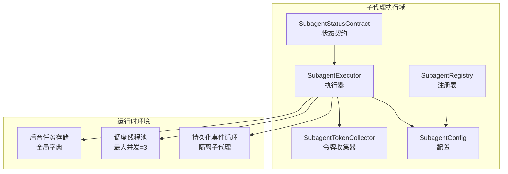
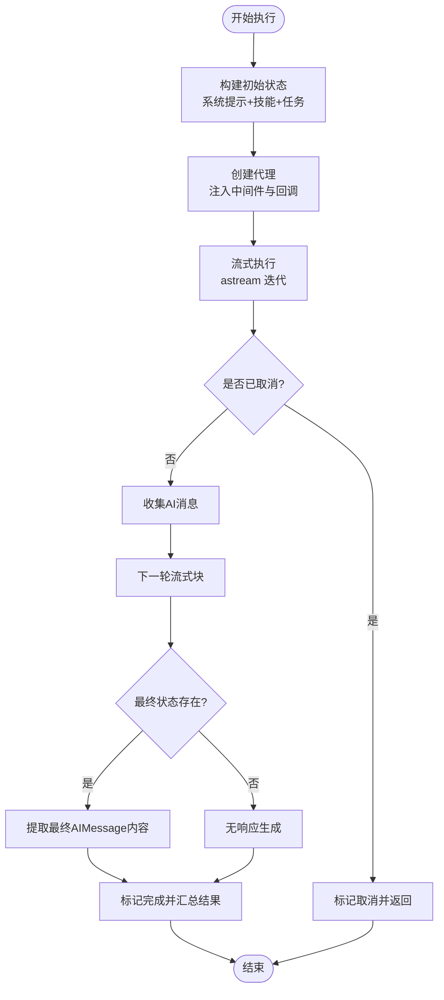
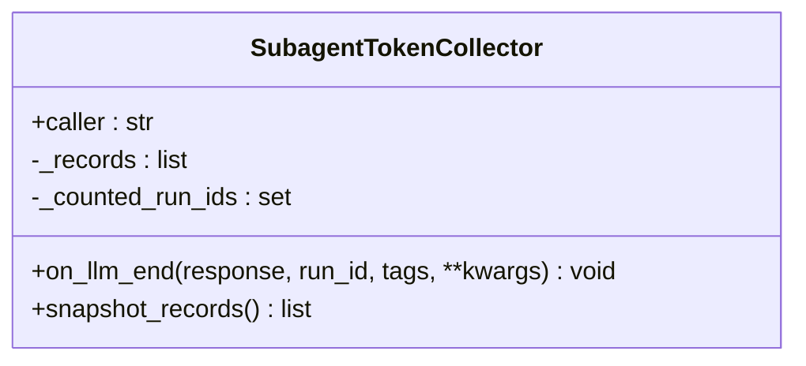
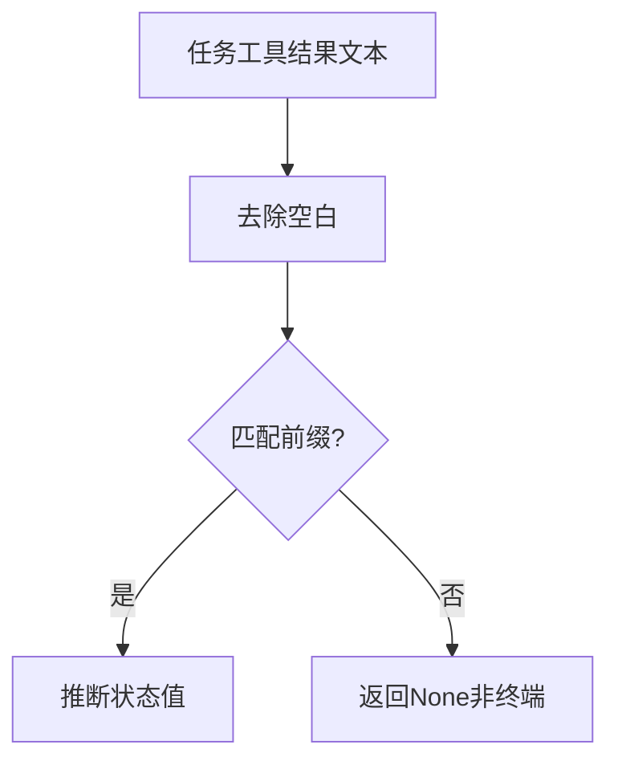
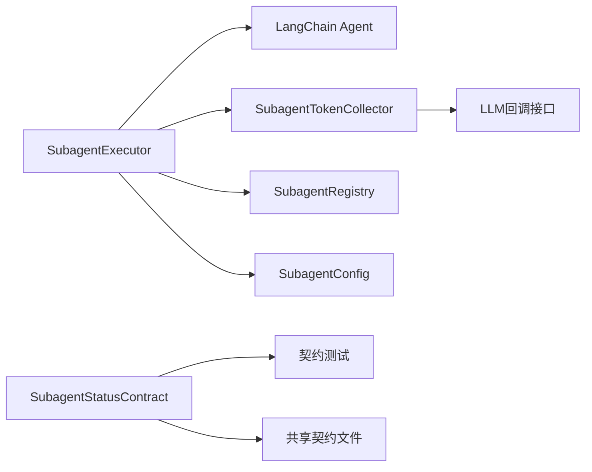

# 子代理执行器

<cite>
**本文档引用的文件**
- [executor.py](file://backend/packages/harness/deerflow/subagents/executor.py)
- [token_collector.py](file://backend/packages/harness/deerflow/subagents/token_collector.py)
- [status_contract.py](file://backend/packages/harness/deerflow/subagents/status_contract.py)
- [config.py](file://backend/packages/harness/deerflow/subagents/config.py)
- [registry.py](file://backend/packages/harness/deerflow/subagents/registry.py)
- [test_subagent_executor.py](file://backend/tests/test_subagent_executor.py)
- [test_subagent_token_collector.py](file://backend/tests/test_subagent_token_collector.py)
- [test_subagent_status_contract.py](file://backend/tests/test_subagent_status_contract.py)
- [subagent_status_contract.json](file://contracts/subagent_status_contract.json)
</cite>

## 目录
1. [简介](#简介)
2. [项目结构](#项目结构)
3. [核心组件](#核心组件)
4. [架构总览](#架构总览)
5. [详细组件分析](#详细组件分析)
6. [依赖关系分析](#依赖关系分析)
7. [性能考量](#性能考量)
8. [故障排查指南](#故障排查指南)
9. [结论](#结论)
10. [附录](#附录)

## 简介
本文件系统性阐述子代理执行器的设计与实现，覆盖任务接收、执行调度、状态监控与结果汇总；详解令牌收集器的统计、消耗监控与预算控制；说明并发处理（线程池、事件循环隔离）与错误处理/恢复策略；并提供配置与优化实践及与主代理的通信协议与数据交换格式。

## 项目结构
子代理执行器位于后端 harness 包中，围绕执行器、令牌收集器、状态契约与配置/注册表模块协同工作，测试用例覆盖异步/同步路径、工具策略、消息收集、令牌统计与状态契约一致性。



**图表来源**
- [executor.py:276-895](file://backend/packages/harness/deerflow/subagents/executor.py#L276-L895)
- [config.py:10-57](file://backend/packages/harness/deerflow/subagents/config.py#L10-L57)
- [registry.py:14-166](file://backend/packages/harness/deerflow/subagents/registry.py#L14-L166)
- [token_collector.py:15-64](file://backend/packages/harness/deerflow/subagents/token_collector.py#L15-L64)
- [status_contract.py:22-103](file://backend/packages/harness/deerflow/subagents/status_contract.py#L22-L103)

**章节来源**
- [executor.py:1-895](file://backend/packages/harness/deerflow/subagents/executor.py#L1-L895)
- [config.py:1-57](file://backend/packages/harness/deerflow/subagents/config.py#L1-L57)
- [registry.py:1-166](file://backend/packages/harness/deerflow/subagents/registry.py#L1-L166)
- [token_collector.py:1-64](file://backend/packages/harness/deerflow/subagents/token_collector.py#L1-L64)
- [status_contract.py:1-103](file://backend/packages/harness/deerflow/subagents/status_contract.py#L1-L103)

## 核心组件
- 执行器（SubagentExecutor）
  - 负责构建初始状态、创建代理、流式执行、AI消息收集、令牌统计、取消与超时处理、同步/异步路径选择。
- 令牌收集器（SubagentTokenCollector）
  - 基于回调在 LLM 结束时采集输入/输出/总计令牌，去重记录并快照导出。
- 状态契约（SubagentStatusContract）
  - 定义结构化状态键值与从任务文本提取状态的映射，确保前后端一致。
- 配置与注册表
  - SubagentConfig 提供模型/工具/技能/超时/轮次等配置；registry 统一解析内置/自定义/覆盖配置。

**章节来源**
- [executor.py:276-895](file://backend/packages/harness/deerflow/subagents/executor.py#L276-L895)
- [token_collector.py:15-64](file://backend/packages/harness/deerflow/subagents/token_collector.py#L15-L64)
- [status_contract.py:22-103](file://backend/packages/harness/deerflow/subagents/status_contract.py#L22-L103)
- [config.py:10-57](file://backend/packages/harness/deerflow/subagents/config.py#L10-L57)
- [registry.py:14-166](file://backend/packages/harness/deerflow/subagents/registry.py#L14-L166)

## 架构总览
子代理执行器通过“持久化事件循环 + 调度线程池”的组合，既保证异步工具（如 MCP 工具）的可用性，又避免每执行一次就创建/销毁事件循环带来的资源开销。执行器支持同步与异步两种入口，异步路径使用流式迭代以实时收集 AI 消息；令牌收集器作为回调注入到运行配置中，统一统计子代理调用的 LLM 消耗。

```mermaid
sequenceDiagram
participant Caller as "调用方"
participant Exec as "SubagentExecutor"
participant Loop as "持久化事件循环"
participant Agent as "LangChain代理"
participant Collector as "令牌收集器"
Caller->>Exec : execute()/execute_async()
alt 同步入口
Exec->>Loop : 在隔离循环中提交协程
Loop-->>Exec : 返回Future
Exec->>Exec : 等待Future或超时
else 异步入口
Exec->>Exec : _aexecute(task)
end
Exec->>Agent : astream(初始状态, 回调=Collector)
Agent-->>Exec : 流式返回中间状态
Exec->>Exec : 收集AI消息/检查取消/更新状态
Agent-->>Exec : 最终状态
Exec->>Exec : 设置完成/失败/超时
Exec-->>Caller : SubagentResult
```

**图表来源**
- [executor.py:482-895](file://backend/packages/harness/deerflow/subagents/executor.py#L482-L895)
- [token_collector.py:24-64](file://backend/packages/harness/deerflow/subagents/token_collector.py#L24-L64)

## 详细组件分析

### 执行器：任务接收、执行调度、状态监控与结果汇总
- 任务接收与初始状态
  - 通过 _build_initial_state 将系统提示、技能内容与任务合并为一条 SystemMessage + 一条 HumanMessage，避免多条 SystemMessage 的兼容性问题。
  - 支持延迟加载 MCP 工具（tool_search），在策略过滤后再注入，确保不会暴露被策略拒绝的工具。
- 执行调度
  - 同步路径：若检测到已有运行中的事件循环，则直接提交到“持久化事件循环”；否则使用 asyncio.run 创建新循环。
  - 异步路径：execute_async 将任务提交至调度线程池，后台任务在持久化事件循环中执行，避免循环冲突。
  - 并发上限：MAX_CONCURRENT_SUBAGENTS=3，限制同时运行的子代理数量。
- 状态监控与结果汇总
  - 使用 SubagentResult 记录状态、开始/结束时间、AI消息列表、令牌使用记录、取消事件等。
  - 流式迭代期间持续检查取消事件；最终从最后一条 AIMessage 提取结果，支持字符串与列表内容的拼接。
  - 错误处理：捕获异常并标记为 FAILED；超时则标记为 TIMED_OUT，并触发取消事件。
- 取消与超时
  - request_cancel_background_task 通过设置 cancel_event 实现协作式取消；超时通过线程池 Future 超时与循环内等待共同保障。



**图表来源**
- [executor.py:418-675](file://backend/packages/harness/deerflow/subagents/executor.py#L418-L675)

**章节来源**
- [executor.py:276-895](file://backend/packages/harness/deerflow/subagents/executor.py#L276-L895)

### 令牌收集器：统计、消耗监控与预算控制
- 统计维度
  - 输入令牌、输出令牌、总计令牌；当总计缺失时自动以输入+输出计算。
- 去重与快照
  - 基于 run_id 去重，防止重复记录；snapshot_records 返回副本，避免外部修改影响内部状态。
- 预算控制
  - 通过收集的总计令牌进行消费监控，结合上层运行日志与中间件可实现预算告警与限额控制（需在上层集成）。



**图表来源**
- [token_collector.py:15-64](file://backend/packages/harness/deerflow/subagents/token_collector.py#L15-L64)

**章节来源**
- [token_collector.py:1-64](file://backend/packages/harness/deerflow/subagents/token_collector.py#L1-L64)
- [test_subagent_token_collector.py:40-162](file://backend/tests/test_subagent_token_collector.py#L40-L162)

### 状态契约：前后端一致的状态传递
- 结构化字段
  - subagent_status：枚举值集合与共享契约保持一致。
  - subagent_error：可选的人类可读错误信息。
- 文本到状态映射
  - 通过前缀匹配从任务工具结果文本推断状态，覆盖正常完成、超时、取消、失败与中间流式片段。
- 前端契约文件
  - 共享契约文件作为单源真相，测试确保前后端对齐。



**图表来源**
- [status_contract.py:65-78](file://backend/packages/harness/deerflow/subagents/status_contract.py#L65-L78)

**章节来源**
- [status_contract.py:1-103](file://backend/packages/harness/deerflow/subagents/status_contract.py#L1-L103)
- [test_subagent_status_contract.py:41-79](file://backend/tests/test_subagent_status_contract.py#L41-L79)
- [subagent_status_contract.json](file://contracts/subagent_status_contract.json)

### 配置与注册表：模型/工具/技能/超时/轮次
- SubagentConfig
  - name/description/system_prompt/tools/disallowed_tools/skills/model/max_turns/timeout_seconds。
- 注册表解析顺序
  - 内置子代理 → 自定义 agents → 逐 agent 覆盖（超时/轮次/模型/技能），内置默认不覆盖自定义默认。
- 沙箱安全
  - 根据沙箱配置决定是否暴露 bash 子代理。

**章节来源**
- [config.py:10-57](file://backend/packages/harness/deerflow/subagents/config.py#L10-L57)
- [registry.py:50-166](file://backend/packages/harness/deerflow/subagents/registry.py#L50-L166)

## 依赖关系分析
- 执行器依赖
  - LangChain 代理创建与流式执行；上下文变量与事件循环隔离；令牌收集器回调；技能存储与工具策略。
- 令牌收集器依赖
  - LLM 回调接口，从响应 generations 中提取 usage_metadata。
- 状态契约依赖
  - 共享契约文件与测试用例确保映射稳定。



**图表来源**
- [executor.py:329-530](file://backend/packages/harness/deerflow/subagents/executor.py#L329-L530)
- [token_collector.py:24-64](file://backend/packages/harness/deerflow/subagents/token_collector.py#L24-L64)
- [status_contract.py:22-103](file://backend/packages/harness/deerflow/subagents/status_contract.py#L22-L103)

**章节来源**
- [executor.py:276-895](file://backend/packages/harness/deerflow/subagents/executor.py#L276-L895)
- [token_collector.py:15-64](file://backend/packages/harness/deerflow/subagents/token_collector.py#L15-L64)
- [status_contract.py:1-103](file://backend/packages/harness/deerflow/subagents/status_contract.py#L1-L103)

## 性能考量
- 事件循环隔离
  - 复用一个长期运行的事件循环，避免频繁创建/关闭导致的资源抖动与客户端连接失效。
- 线程池并发
  - MAX_CONCURRENT_SUBAGENTS=3，限制后台并发，平衡吞吐与资源占用。
- 流式执行
  - 使用 astream 获取实时 AI 消息，降低首字节延迟，提升可观测性。
- 去重与快照
  - 令牌记录去重与快照复制减少重复计算与竞态风险。

[本节为通用指导，无需特定文件来源]

## 故障排查指南
- 执行失败
  - 检查异常栈与 FAILED 状态；确认工具策略是否正确过滤；核对系统提示与技能内容合并是否合理。
- 超时与取消
  - 确认 timeout_seconds 是否过短；检查 cancel_event 是否被设置；在异步路径中注意 Future 超时与循环等待的配合。
- 令牌统计异常
  - 确认回调是否触发；usage_metadata 是否存在；run_id 是否重复；必要时检查 LLM Provider 输出。
- 状态不一致
  - 对照共享契约文件与测试用例，确保文本前缀映射正确；避免在前端依赖文本解析而非结构化字段。

**章节来源**
- [executor.py:667-755](file://backend/packages/harness/deerflow/subagents/executor.py#L667-L755)
- [test_subagent_executor.py:670-800](file://backend/tests/test_subagent_executor.py#L670-L800)
- [test_subagent_token_collector.py:40-162](file://backend/tests/test_subagent_token_collector.py#L40-L162)
- [test_subagent_status_contract.py:41-79](file://backend/tests/test_subagent_status_contract.py#L41-L79)

## 结论
子代理执行器通过“持久化事件循环 + 调度线程池 + 结构化状态 + 令牌回调”的设计，在保证异步工具兼容性的同时，提供了高可靠的任务执行、可观测的令牌统计与稳定的前后端状态契约。配合灵活的配置与注册表，能够满足多场景下的子代理编排需求。

[本节为总结，无需特定文件来源]

## 附录

### 与主代理的通信协议与数据交换格式
- 任务工具结果文本
  - 后端通过特定前缀标识终端状态（完成/失败/取消/超时/轮询超时），前端据此更新卡片状态。
- 结构化状态字段
  - ToolMessage.additional_kwargs 中包含 subagent_status 与 subagent_error（仅在有错误时携带）。
- 共享契约
  - 通过 contracts/subagent_status_contract.json 统一映射，测试确保前后端一致。

**章节来源**
- [status_contract.py:22-103](file://backend/packages/harness/deerflow/subagents/status_contract.py#L22-L103)
- [test_subagent_status_contract.py:41-79](file://backend/tests/test_subagent_status_contract.py#L41-L79)
- [subagent_status_contract.json](file://contracts/subagent_status_contract.json)

### 配置与优化实践
- 并发度设置
  - MAX_CONCURRENT_SUBAGENTS=3，可根据 CPU/IO 与 LLM 吞吐调整；避免过高并发导致资源争用。
- 超时参数
  - timeout_seconds 建议根据任务复杂度与工具调用时长设定；长任务优先考虑异步路径与协作取消。
- 监控指标
  - 关注 AI 消息数量、最终结果长度、令牌使用总量与平均耗时；结合令牌统计进行成本控制。
- 工具与技能
  - 使用 skills 与 tools/disallowed_tools 精准控制可用能力；延迟工具仅在策略允许后注入。

**章节来源**
- [executor.py:821-895](file://backend/packages/harness/deerflow/subagents/executor.py#L821-L895)
- [config.py:10-57](file://backend/packages/harness/deerflow/subagents/config.py#L10-L57)
- [registry.py:50-166](file://backend/packages/harness/deerflow/subagents/registry.py#L50-L166)