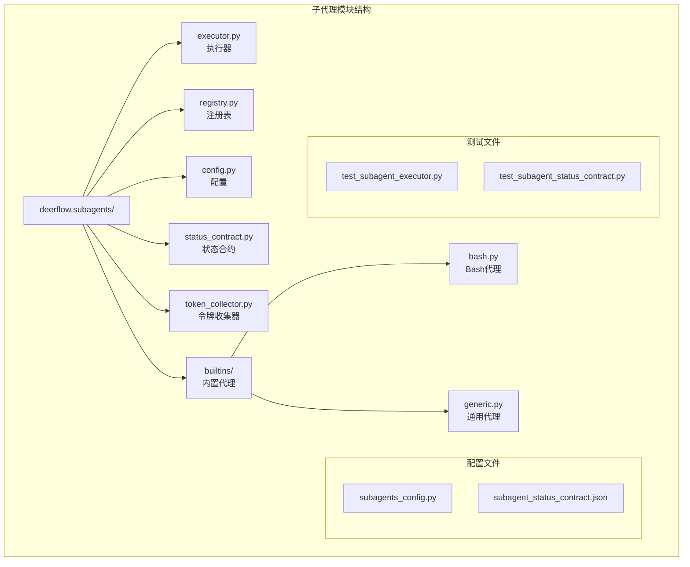
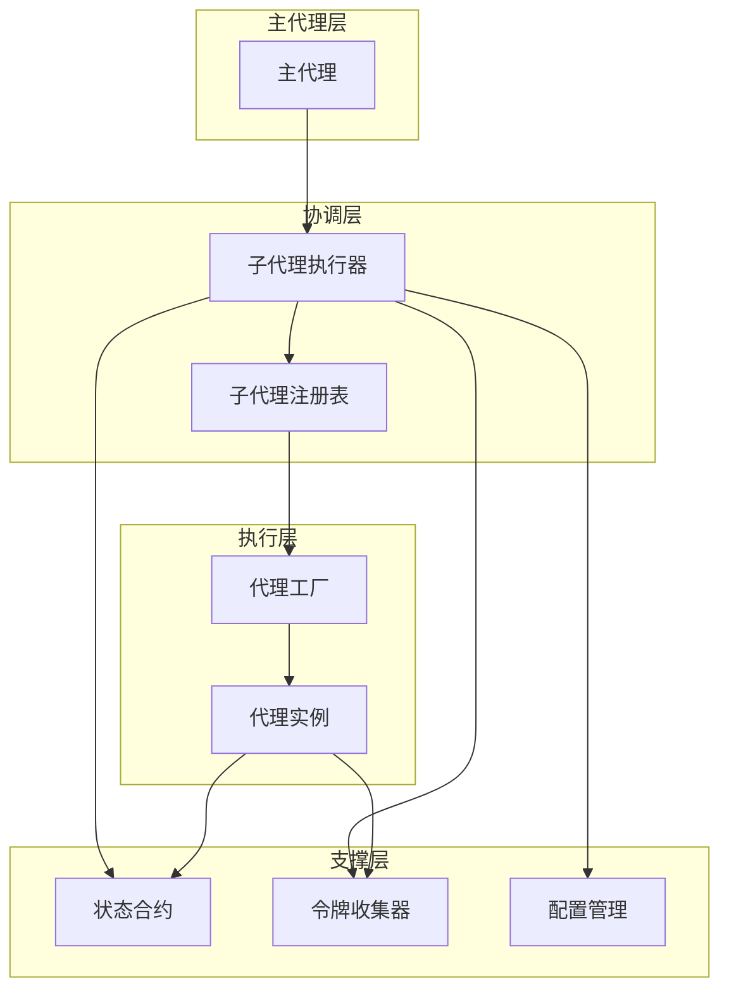
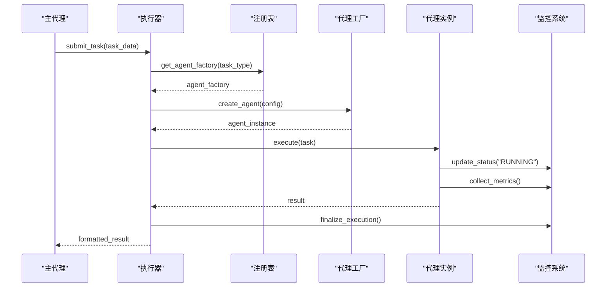
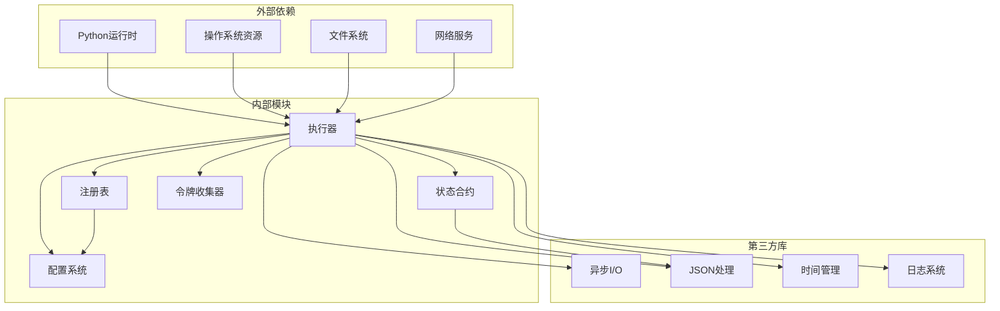

# 子代理机制

<cite>
**本文档引用的文件**
- [executor.py](file://backend/packages/harness/deerflow/subagents/executor.py)
- [registry.py](file://backend/packages/harness/deerflow/subagents/registry.py)
- [config.py](file://backend/packages/harness/deerflow/subagents/config.py)
- [status_contract.py](file://backend/packages/harness/deerflow/subagents/status_contract.py)
- [token_collector.py](file://backend/packages/harness/deerflow/subagents/token_collector.py)
- [subagents_config.py](file://backend/packages/harness/deerflow/config/subagents_config.py)
- [test_subagent_executor.py](file://backend/tests/test_subagent_executor.py)
- [test_subagent_status_contract.py](file://backend/tests/test_subagent_status_contract.py)
- [subagent_status_contract.json](file://contracts/subagent_status_contract.json)
</cite>

## 目录
1. [简介](#简介)
2. [项目结构](#项目结构)
3. [核心组件](#核心组件)
4. [架构概览](#架构概览)
5. [详细组件分析](#详细组件分析)
6. [依赖关系分析](#依赖关系分析)
7. [性能考虑](#性能考虑)
8. [故障排除指南](#故障排除指南)
9. [结论](#结论)

## 简介

子代理机制是deer-flow平台中的重要组成部分，它允许主代理创建和管理多个子代理实例来执行特定任务。该机制提供了任务分解、并行执行、状态跟踪和结果聚合等功能，是实现复杂工作流处理的核心基础设施。

子代理系统采用模块化设计，包含执行器、注册表、配置管理、状态合约和令牌收集等核心组件，为开发者提供了灵活且可扩展的代理管理框架。

## 项目结构

子代理机制主要位于后端包的`deerflow.subagents`模块中，包含以下关键文件：

**图表来源**
- [executor.py](file://backend/packages/harness/deerflow/subagents/executor.py)
- [registry.py](file://backend/packages/harness/deerflow/subagents/registry.py)
- [config.py](file://backend/packages/harness/deerflow/subagents/config.py)
- [status_contract.py](file://backend/packages/harness/deerflow/subagents/status_contract.py)
- [token_collector.py](file://backend/packages/harness/deerflow/subagents/token_collector.py)
- [subagents_config.py](file://backend/packages/harness/deerflow/config/subagents_config.py)

**章节来源**
- [executor.py](file://backend/packages/harness/deerflow/subagents/executor.py)
- [registry.py](file://backend/packages/harness/deerflow/subagents/registry.py)
- [config.py](file://backend/packages/harness/deerflow/subagents/config.py)

## 核心组件

子代理系统由以下核心组件构成：

### 执行器（SubagentExecutor）
负责协调子代理的创建、执行和结果收集，提供统一的任务管理接口。

### 注册表（SubagentRegistry）
管理可用的子代理工厂，支持动态注册和发现机制。

### 配置系统（SubagentConfig）
定义子代理的运行参数，包括超时设置、重试策略和资源限制。

### 状态合约（StatusContract）
确保前后端状态信息的一致性，提供标准化的状态转换机制。

### 令牌收集器（TokenCollector）
跟踪和统计子代理执行过程中的资源使用情况。

**章节来源**
- [executor.py](file://backend/packages/harness/deerflow/subagents/executor.py)
- [registry.py](file://backend/packages/harness/deerflow/subagents/registry.py)
- [config.py](file://backend/packages/harness/deerflow/subagents/config.py)
- [status_contract.py](file://backend/packages/harness/deerflow/subagents/status_contract.py)
- [token_collector.py](file://backend/packages/harness/deerflow/subagents/token_collector.py)

## 架构概览

子代理机制采用分层架构设计，各组件之间通过清晰的接口进行交互：

**图表来源**
- [executor.py](file://backend/packages/harness/deerflow/subagents/executor.py)
- [registry.py](file://backend/packages/harness/deerflow/subagents/registry.py)
- [status_contract.py](file://backend/packages/harness/deerflow/subagents/status_contract.py)
- [token_collector.py](file://backend/packages/harness/deerflow/subagents/token_collector.py)

系统的核心执行流程遵循以下模式：主代理提交任务 → 执行器协调 → 注册表查找代理 → 工厂创建实例 → 执行器监控状态 → 结果收集和返回。

## 详细组件分析

### 子代理执行器

子代理执行器是整个系统的核心协调者，负责管理子代理的完整生命周期：

#### 核心功能特性

**任务分配机制**
- 接收主代理的任务请求
- 解析任务参数和配置
- 分配适当的代理工厂
- 处理并发执行场景

**状态跟踪系统**
- 实时监控子代理执行状态
- 维护执行历史记录
- 处理异常和错误恢复
- 提供进度报告机制

**结果收集与聚合**
- 统一结果格式化
- 错误信息提取
- 性能指标收集
- 最终结果输出

#### 执行流程

**图表来源**
- [executor.py](file://backend/packages/harness/deerflow/subagents/executor.py)

**章节来源**
- [executor.py](file://backend/packages/harness/deerflow/subagents/executor.py)

### 子代理注册表

注册表负责管理所有可用的子代理工厂，提供动态发现和生命周期管理：

#### 注册机制

**代理注册**
- 动态注册新的代理类型
- 验证代理工厂接口兼容性
- 维护代理元数据信息
- 支持条件注册和延迟加载

**代理发现**
- 基于名称的快速查找
- 类型匹配和过滤
- 版本兼容性检查
- 依赖关系解析

**生命周期管理**
- 代理实例的创建和销毁
- 资源池管理和复用
- 内存和资源监控
- 异常清理和恢复

#### 数据结构设计

注册表采用字典结构存储代理工厂，键为代理名称，值为工厂对象。支持嵌套命名空间和版本控制。

**章节来源**
- [registry.py](file://backend/packages/harness/deerflow/subagents/registry.py)

### 配置管理系统

配置系统为子代理提供灵活的参数定制能力：

#### 核心配置项

**执行参数**
- `timeout`: 任务执行超时时间
- `max_retries`: 最大重试次数
- `retry_delay`: 重试间隔时间
- `parallelism`: 并发执行限制

**资源限制**
- `token_budget`: 令牌使用预算
- `memory_limit`: 内存使用限制
- `cpu_quota`: CPU配额限制
- `disk_space`: 磁盘空间限制

**行为控制**
- `auto_retry`: 自动重试策略
- `result_format`: 结果格式化选项
- `log_level`: 日志详细程度
- `monitoring`: 监控启用状态

#### 配置继承和覆盖

支持多级配置继承，从全局配置到具体代理实例的逐级覆盖机制。

**章节来源**
- [config.py](file://backend/packages/harness/deerflow/subagents/config.py)
- [subagents_config.py](file://backend/packages/harness/deerflow/config/subagents_config.py)

### 状态合约机制

状态合约确保前后端对子代理状态的理解保持一致：

#### 状态定义

**标准状态值**
- `PENDING`: 任务等待执行
- `RUNNING`: 任务正在执行
- `COMPLETED`: 任务成功完成
- `FAILED`: 任务执行失败
- `CANCELLED`: 任务被取消
- `TIMED_OUT`: 任务超时

**状态转换规则**
- PENDING → RUNNING → COMPLETED/FINISHED/FAILED
- PENDING → RUNNING → CANCELLED/TIMED_OUT
- 所有状态必须通过合约验证

#### 合约验证

状态合约通过JSON文件定义，确保跨语言和跨平台的一致性。前端和后端共享同一份状态映射定义。

**章节来源**
- [status_contract.py](file://backend/packages/harness/deerflow/subagents/status_contract.py)
- [test_subagent_status_contract.py](file://backend/tests/test_subagent_status_contract.py)
- [subagent_status_contract.json](file://contracts/subagent_status_contract.json)

### 令牌收集器

令牌收集器负责跟踪子代理执行过程中的资源使用情况：

#### 收集维度

**计算资源**
- 输入令牌数统计
- 输出令牌数统计
- 总令牌消耗计算
- 令牌使用效率分析

**时间指标**
- 执行时间测量
- 等待时间统计
- 响应时间分析
- 性能瓶颈识别

**内存使用**
- 内存峰值监控
- 内存泄漏检测
- 缓存命中率
- 资源回收效率

#### 统计功能

提供实时统计和历史趋势分析，支持性能优化和成本控制。

**章节来源**
- [token_collector.py](file://backend/packages/harness/deerflow/subagents/token_collector.py)

### 内置子代理

系统提供两种主要的内置子代理类型：

#### Bash代理

**功能特性**
- 直接执行shell命令
- 支持管道和重定向操作
- 文件系统访问权限控制
- 环境变量传递和隔离

**使用场景**
- 系统维护脚本执行
- 文件操作和批量处理
- 外部工具调用
- 环境探测和诊断

**安全机制**
- 命令白名单验证
- 参数转义和清理
- 超时强制终止
- 输出长度限制

#### 通用代理

**功能特性**
- 通用任务执行框架
- 插件化架构设计
- 动态代码加载
- 多语言支持

**使用场景**
- 自定义业务逻辑执行
- 第三方服务集成
- 数据处理和转换
- API调用和响应处理

**扩展机制**
- 插件接口规范
- 生命周期钩子
- 配置热更新
- 动态卸载支持

**章节来源**
- [executor.py](file://backend/packages/harness/deerflow/subagents/executor.py)

## 依赖关系分析

子代理系统的依赖关系呈现清晰的层次结构：

**图表来源**
- [executor.py](file://backend/packages/harness/deerflow/subagents/executor.py)
- [registry.py](file://backend/packages/harness/deerflow/subagents/registry.py)
- [config.py](file://backend/packages/harness/deerflow/subagents/config.py)

### 循环依赖检测

系统设计避免了循环依赖，各模块间通过接口抽象实现松耦合。

### 外部接口契约

- 与主代理的调用接口
- 与状态合约的数据交换
- 与配置系统的参数传递
- 与令牌收集器的统计上报

**章节来源**
- [executor.py](file://backend/packages/harness/deerflow/subagents/executor.py)
- [registry.py](file://backend/packages/harness/deerflow/subagents/registry.py)

## 性能考虑

子代理机制在设计时充分考虑了性能优化：

### 并发执行优化

**线程池管理**
- 动态调整线程数量
- 任务队列优先级排序
- 空闲线程回收机制
- 资源使用监控

**异步I/O支持**
- 非阻塞网络调用
- 流式数据处理
- 超时控制机制
- 错误快速传播

### 内存管理

**对象池技术**
- 代理实例复用
- 字符串和缓冲区池化
- 垃圾回收优化
- 内存泄漏防护

**资源限制**
- 内存使用上限
- 文件句柄数量限制
- 进程数量控制
- 网络连接池管理

### 缓存策略

**状态缓存**
- 频繁查询结果缓存
- 配置信息缓存
- 元数据索引缓存
- 统计数据聚合缓存

**性能监控**
- 关键指标追踪
- 性能基准测试
- 趋势分析报告
- 优化建议生成

## 故障排除指南

### 常见问题诊断

**执行器问题**
- 任务长时间无响应：检查超时配置和资源限制
- 结果格式不正确：验证状态合约和序列化设置
- 内存泄漏：监控令牌收集器和对象池使用情况

**注册表问题**
- 代理找不到：确认代理名称和命名空间
- 工厂创建失败：检查依赖库和权限设置
- 类型冲突：验证代理接口实现

**配置问题**
- 参数无效：检查配置文件语法和值范围
- 权限不足：验证用户权限和环境变量
- 资源限制过严：调整配额和预算设置

### 调试工具

**日志分析**
- 详细日志级别配置
- 关键事件标记和追踪
- 性能指标监控
- 错误堆栈分析

**监控仪表板**
- 实时状态显示
- 历史趋势图表
- 异常告警通知
- 性能基线对比

**章节来源**
- [test_subagent_executor.py](file://backend/tests/test_subagent_executor.py)
- [test_subagent_status_contract.py](file://backend/tests/test_subagent_status_contract.py)

## 结论

子代理机制为deer-flow平台提供了强大而灵活的代理管理能力。通过模块化的架构设计、完善的配置系统和严格的状态管理，该机制能够有效支持复杂的分布式任务执行场景。

系统的关键优势包括：
- **高扩展性**：支持动态代理注册和插件化架构
- **强一致性**：通过状态合约确保前后端状态同步
- **高性能**：优化的并发执行和资源管理
- **易维护**：清晰的接口设计和完善的监控体系

未来的发展方向包括增强机器学习代理支持、优化大规模集群部署、改进资源调度算法和加强安全防护机制。