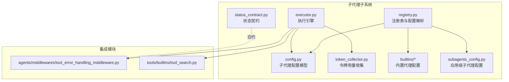
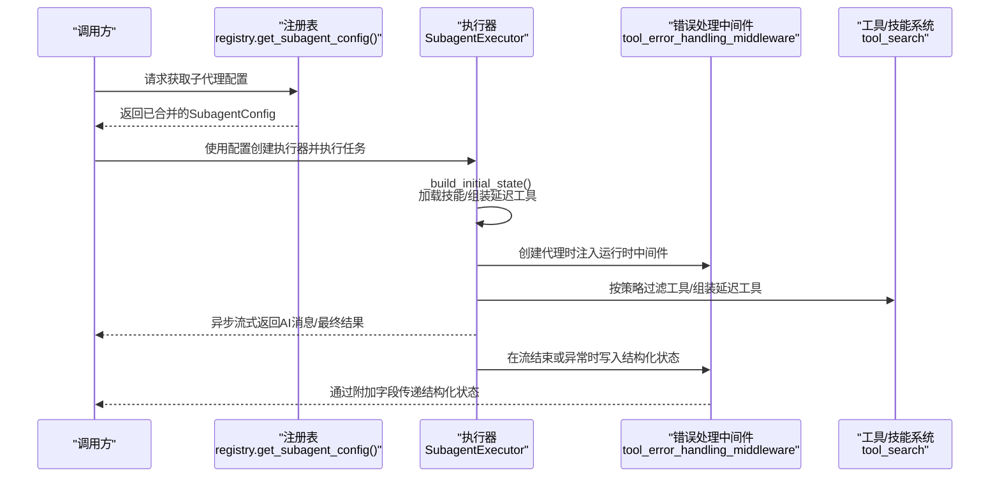
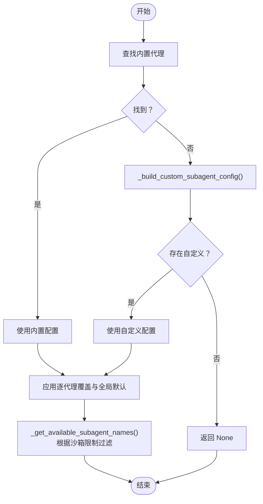
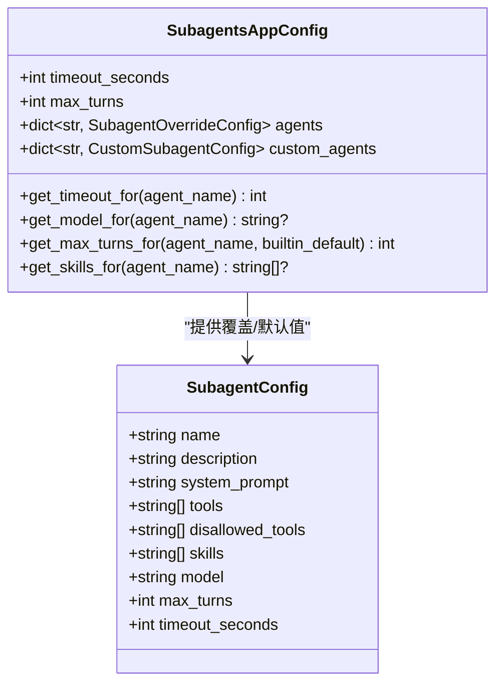
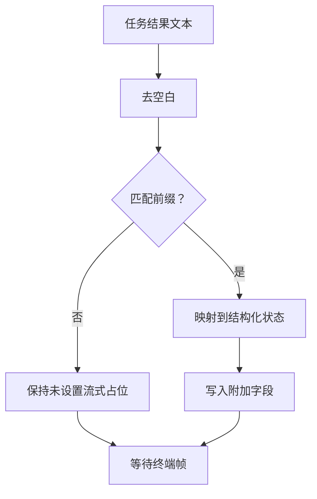
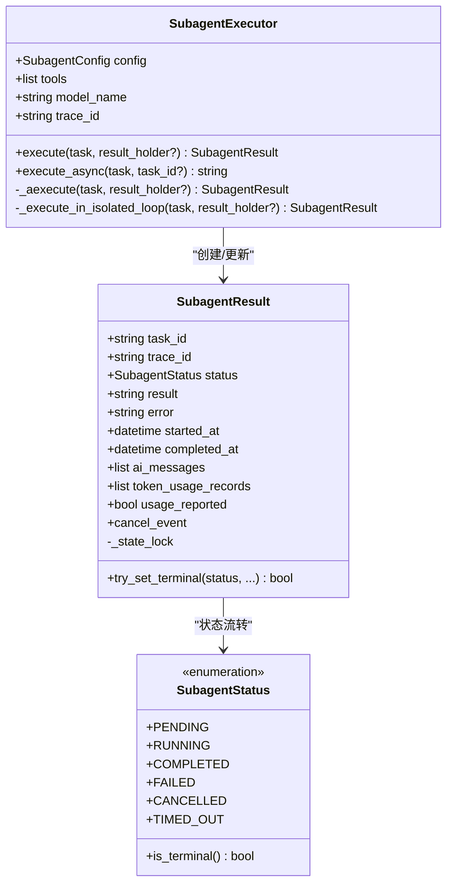
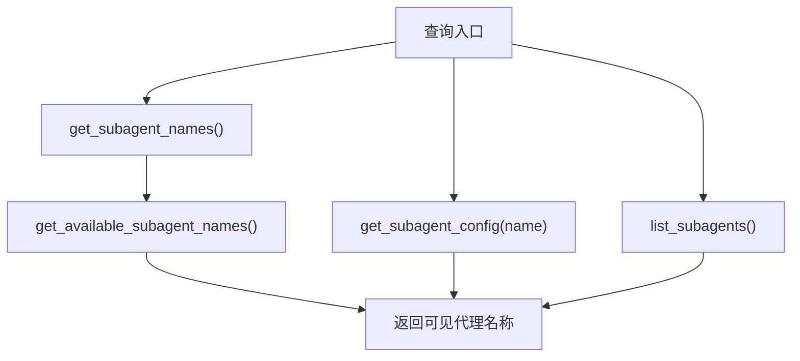
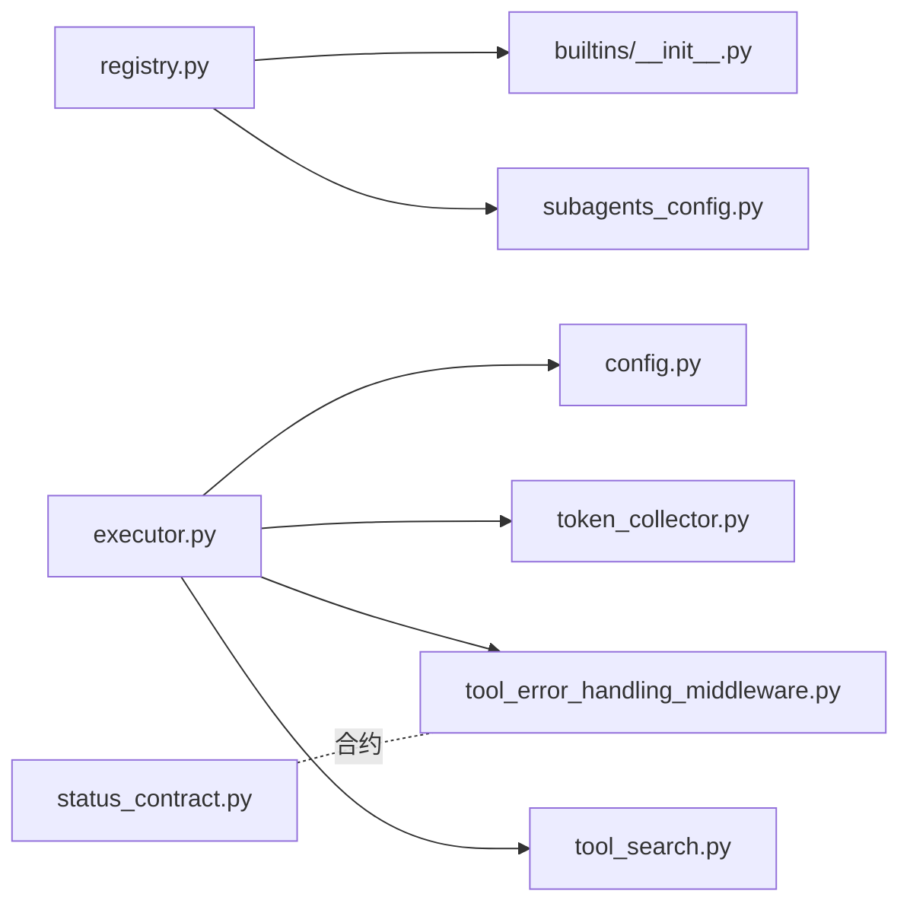

# 子代理注册表

<cite>
**本文引用的文件**
- [registry.py](file://backend/packages/harness/deerflow/subagents/registry.py)
- [status_contract.py](file://backend/packages/harness/deerflow/subagents/status_contract.py)
- [config.py](file://backend/packages/harness/deerflow/subagents/config.py)
- [executor.py](file://backend/packages/harness/deerflow/subagents/executor.py)
- [token_collector.py](file://backend/packages/harness/deerflow/subagents/token_collector.py)
- [builtins/__init__.py](file://backend/packages/harness/deerflow/subagents/builtins/__init__.py)
- [general_purpose.py](file://backend/packages/harness/deerflow/subagents/builtins/general_purpose.py)
- [bash_agent.py](file://backend/packages/harness/deerflow/subagents/builtins/bash_agent.py)
- [subagents_config.py](file://backend/packages/harness/deerflow/config/subagents_config.py)
- [tool_error_handling_middleware.py](file://backend/packages/harness/deerflow/agents/middlewares/tool_error_handling_middleware.py)
- [tool_search.py](file://backend/packages/harness/deerflow/tools/builtins/tool_search.py)
- [test_subagent_status_contract.py](file://backend/tests/test_subagent_status_contract.py)
- [test_subagent_executor.py](file://backend/tests/test_subagent_executor.py)
- [subagent_status_contract.json](file://contracts/subagent_status_contract.json)
</cite>

## 目录
1. [简介](#简介)
2. [项目结构](#项目结构)
3. [核心组件](#核心组件)
4. [架构总览](#架构总览)
5. [详细组件分析](#详细组件分析)
6. [依赖关系分析](#依赖关系分析)
7. [性能考量](#性能考量)
8. [故障排查指南](#故障排查指南)
9. [结论](#结论)
10. [附录](#附录)

## 简介
本文件系统性阐述子代理注册表的设计与实现，覆盖以下主题：
- 注册表的管理职责：子代理的注册、发现、状态维护与生命周期管理
- 状态契约设计与实现：状态定义、变更通知、一致性保障机制
- 配置系统对子代理行为的影响：超时设置、资源限制、执行策略等
- 查询与检索能力：按类型、状态、性能等条件筛选代理
- 扩展与定制指南：自定义代理类型、状态字段、过滤规则
- 注册表与执行器的协同机制与数据同步策略

## 项目结构
子代理相关代码主要位于后端包 deerflow 的 subagents 子模块中，并通过配置系统与中间件、工具系统集成。

**图表来源**
- [registry.py:1-166](file://backend/packages/harness/deerflow/subagents/registry.py#L1-L166)
- [config.py:1-57](file://backend/packages/harness/deerflow/subagents/config.py#L1-L57)
- [status_contract.py:1-103](file://backend/packages/harness/deerflow/subagents/status_contract.py#L1-L103)
- [executor.py:1-895](file://backend/packages/harness/deerflow/subagents/executor.py#L1-L895)
- [token_collector.py:1-64](file://backend/packages/harness/deerflow/subagents/token_collector.py#L1-L64)
- [builtins/__init__.py:1-16](file://backend/packages/harness/deerflow/subagents/builtins/__init__.py#L1-L16)
- [subagents_config.py:1-182](file://backend/packages/harness/deerflow/config/subagents_config.py#L1-L182)
- [tool_error_handling_middleware.py](file://backend/packages/harness/deerflow/agents/middlewares/tool_error_handling_middleware.py)
- [tool_search.py](file://backend/packages/harness/deerflow/tools/builtins/tool_search.py)

**章节来源**
- [registry.py:1-166](file://backend/packages/harness/deerflow/subagents/registry.py#L1-L166)
- [config.py:1-57](file://backend/packages/harness/deerflow/subagents/config.py#L1-L57)
- [subagents_config.py:1-182](file://backend/packages/harness/deerflow/config/subagents_config.py#L1-L182)

## 核心组件
- 注册表与配置解析：负责内置与自定义子代理的发现、合并与覆盖解析，输出最终生效的配置。
- 子代理配置模型：定义子代理的属性（如工具白名单、技能、模型继承、最大轮次、超时）。
- 状态契约：在前后端之间建立稳定的结构化状态传递契约，避免文本匹配脆弱性。
- 执行引擎：封装异步/同步执行路径、事件循环复用、并发调度、取消与超时、AI消息收集与令牌用量统计。
- 令牌用量收集：为子代理调用的 LLM 请求记录输入/输出/总计令牌数，便于统一上报。
- 内置代理配置：提供通用与 Bash 两类内置代理的默认配置。
- 应用级子代理配置：从配置文件加载全局默认值与逐代理覆盖项。

**章节来源**
- [registry.py:50-116](file://backend/packages/harness/deerflow/subagents/registry.py#L50-L116)
- [config.py:10-57](file://backend/packages/harness/deerflow/subagents/config.py#L10-L57)
- [status_contract.py:27-103](file://backend/packages/harness/deerflow/subagents/status_contract.py#L27-L103)
- [executor.py:276-800](file://backend/packages/harness/deerflow/subagents/executor.py#L276-L800)
- [token_collector.py:15-64](file://backend/packages/harness/deerflow/subagents/token_collector.py#L15-L64)
- [builtins/__init__.py:11-16](file://backend/packages/harness/deerflow/subagents/builtins/__init__.py#L11-L16)
- [subagents_config.py:71-143](file://backend/packages/harness/deerflow/config/subagents_config.py#L71-L143)

## 架构总览
子代理注册表与执行器的交互流程如下：

**图表来源**
- [registry.py:50-116](file://backend/packages/harness/deerflow/subagents/registry.py#L50-L116)
- [executor.py:329-480](file://backend/packages/harness/deerflow/subagents/executor.py#L329-L480)
- [tool_error_handling_middleware.py](file://backend/packages/harness/deerflow/agents/middlewares/tool_error_handling_middleware.py)
- [tool_search.py](file://backend/packages/harness/deerflow/tools/builtins/tool_search.py)

## 详细组件分析

### 注册表与配置解析
- 解析顺序：内置代理 → 自定义代理 → 逐代理覆盖 → 全局默认
- 覆盖规则：
  - 超时：逐代理覆盖优先；内置代理可受全局默认影响；自定义代理不被全局默认覆盖
  - 最大轮次：逐代理覆盖优先；内置代理可受全局默认影响；自定义代理不被全局默认覆盖
  - 模型：仅支持逐代理覆盖（无全局默认）
  - 技能：仅支持逐代理覆盖（无全局默认）
- 可见性过滤：根据沙箱环境决定是否暴露 Bash 代理

**图表来源**
- [registry.py:50-166](file://backend/packages/harness/deerflow/subagents/registry.py#L50-L166)

**章节来源**
- [registry.py:14-166](file://backend/packages/harness/deerflow/subagents/registry.py#L14-L166)
- [subagents_config.py:93-143](file://backend/packages/harness/deerflow/config/subagents_config.py#L93-L143)
- [builtins/__init__.py:11-16](file://backend/packages/harness/deerflow/subagents/builtins/__init__.py#L11-L16)

### 子代理配置模型
- 关键字段：名称、描述、系统提示、工具白名单/黑名单、技能列表、模型继承策略、最大轮次、超时秒数
- 模型解析：支持显式指定或继承父模型；当两者都不可得时回退到应用配置中的默认模型名

**图表来源**
- [config.py:10-57](file://backend/packages/harness/deerflow/subagents/config.py#L10-L57)
- [subagents_config.py:71-143](file://backend/packages/harness/deerflow/config/subagents_config.py#L71-L143)

**章节来源**
- [config.py:10-57](file://backend/packages/harness/deerflow/subagents/config.py#L10-L57)
- [subagents_config.py:10-143](file://backend/packages/harness/deerflow/config/subagents_config.py#L10-L143)

### 状态契约与一致性保障
- 结构化字段：后端在工具消息附加字段中写入结构化状态与错误信息，前端据此更新卡片状态
- 契约文件：前后端共享的状态值集合与前缀映射由合约文件统一约束
- 提取与构造：提供从任务结果文本提取状态的函数与构造附加字段的函数，后者对非法状态抛出异常

**图表来源**
- [status_contract.py:65-103](file://backend/packages/harness/deerflow/subagents/status_contract.py#L65-L103)
- [test_subagent_status_contract.py:47-79](file://backend/tests/test_subagent_status_contract.py#L47-L79)
- [subagent_status_contract.json](file://contracts/subagent_status_contract.json)

**章节来源**
- [status_contract.py:27-103](file://backend/packages/harness/deerflow/subagents/status_contract.py#L27-L103)
- [test_subagent_status_contract.py:41-79](file://backend/tests/test_subagent_status_contract.py#L41-L79)

### 执行引擎与生命周期管理
- 状态枚举：PENDING/RUNNING/COMPLETED/FAILED/CANCELLED/TIMED_OUT，包含终止态判定
- 终止一致性：通过锁与单次设置确保同一结果对象只允许一次终止态写入
- 并发与事件循环：持久化隔离事件循环，避免每执行一次就创建/关闭短生命周期循环；线程池调度后台任务
- 取消与超时：支持协作式取消（轮询中断点）与超时（Future超时），失败时写入失败状态
- 实时更新：异步流式收集 AI 消息，避免重复消息；支持列表型内容拼接
- 令牌用量：回调收集每次 LLM 调用的令牌用量，完成后统一上报

**图表来源**
- [executor.py:47-134](file://backend/packages/harness/deerflow/subagents/executor.py#L47-L134)
- [executor.py:276-800](file://backend/packages/harness/deerflow/subagents/executor.py#L276-L800)
- [token_collector.py:15-64](file://backend/packages/harness/deerflow/subagents/token_collector.py#L15-L64)

**章节来源**
- [executor.py:47-134](file://backend/packages/harness/deerflow/subagents/executor.py#L47-L134)
- [executor.py:276-800](file://backend/packages/harness/deerflow/subagents/executor.py#L276-L800)
- [token_collector.py:15-64](file://backend/packages/harness/deerflow/subagents/token_collector.py#L15-L64)

### 查询与检索功能
- 名称查询：列出所有内置与自定义代理名称，支持可见性过滤（基于沙箱能力）
- 配置查询：按名称获取最终生效的配置（含覆盖与默认）
- 列表查询：返回所有可用配置（已应用覆盖）

**图表来源**
- [registry.py:119-166](file://backend/packages/harness/deerflow/subagents/registry.py#L119-L166)

**章节来源**
- [registry.py:119-166](file://backend/packages/harness/deerflow/subagents/registry.py#L119-L166)

### 扩展与定制指南
- 自定义代理类型：在配置中声明 custom_agents，定义描述、系统提示、工具白/黑名单、技能白名单、模型与超时等
- 自定义状态字段：通过状态契约扩展附加字段（需前后端一致约定与合约校验）
- 过滤规则：利用工具白/黑名单与技能策略控制代理能力边界；延迟工具仅在策略允许下注入

**章节来源**
- [subagents_config.py:34-91](file://backend/packages/harness/deerflow/config/subagents_config.py#L34-L91)
- [status_contract.py:27-103](file://backend/packages/harness/deerflow/subagents/status_contract.py#L27-L103)
- [executor.py:246-274](file://backend/packages/harness/deerflow/subagents/executor.py#L246-L274)

## 依赖关系分析
- 注册表依赖内置代理字典、应用配置与自定义代理定义
- 执行器依赖配置模型、令牌用量收集器、中间件与工具系统
- 状态契约通过合约文件与中间件共同保障前后端一致性

**图表来源**
- [registry.py:1-166](file://backend/packages/harness/deerflow/subagents/registry.py#L1-L166)
- [config.py:1-57](file://backend/packages/harness/deerflow/subagents/config.py#L1-L57)
- [status_contract.py:1-103](file://backend/packages/harness/deerflow/subagents/status_contract.py#L1-L103)
- [executor.py:1-895](file://backend/packages/harness/deerflow/subagents/executor.py#L1-L895)
- [token_collector.py:1-64](file://backend/packages/harness/deerflow/subagents/token_collector.py#L1-L64)
- [builtins/__init__.py:1-16](file://backend/packages/harness/deerflow/subagents/builtins/__init__.py#L1-L16)
- [subagents_config.py:1-182](file://backend/packages/harness/deerflow/config/subagents_config.py#L1-L182)
- [tool_error_handling_middleware.py](file://backend/packages/harness/deerflow/agents/middlewares/tool_error_handling_middleware.py)
- [tool_search.py](file://backend/packages/harness/deerflow/tools/builtins/tool_search.py)

**章节来源**
- [registry.py:1-166](file://backend/packages/harness/deerflow/subagents/registry.py#L1-L166)
- [executor.py:1-895](file://backend/packages/harness/deerflow/subagents/executor.py#L1-L895)

## 性能考量
- 事件循环复用：持久化隔离事件循环减少频繁创建/销毁带来的开销
- 线程池调度：后台任务提交至固定大小线程池，避免阻塞主线程
- 流式处理：异步流式收集 AI 消息，降低内存峰值
- 工具与技能加载：异步线程化读取技能文件，避免阻塞事件循环
- 令牌用量统计：轻量回调收集，避免额外网络请求

[本节为通用指导，无需特定文件分析]

## 故障排查指南
- 状态契约不一致：检查合约文件与前后端实现是否一致，确认状态值集合与前缀映射
- 执行失败：查看执行器异常捕获与状态设置，关注令牌用量记录与错误信息
- 取消与超时：确认协作式取消点位置与超时阈值设置
- 工具/技能策略：核对工具白/黑名单与技能策略是否导致工具缺失或延迟工具未注入

**章节来源**
- [test_subagent_status_contract.py:41-79](file://backend/tests/test_subagent_status_contract.py#L41-L79)
- [test_subagent_executor.py:670-800](file://backend/tests/test_subagent_executor.py#L670-L800)
- [executor.py:667-755](file://backend/packages/harness/deerflow/subagents/executor.py#L667-L755)

## 结论
子代理注册表通过清晰的配置解析与覆盖机制，结合结构化状态契约与执行引擎的生命周期管理，实现了稳定、可扩展且可观察的子代理体系。内置代理与自定义代理共存，配合应用级配置与沙箱可见性控制，满足多场景下的代理编排需求。

## 附录
- 内置代理示例：通用代理与 Bash 代理的系统提示与工作目录约束
- 中间件与工具：错误处理中间件与延迟工具搜索的集成方式

**章节来源**
- [general_purpose.py:5-62](file://backend/packages/harness/deerflow/subagents/builtins/general_purpose.py#L5-L62)
- [bash_agent.py:5-51](file://backend/packages/harness/deerflow/subagents/builtins/bash_agent.py#L5-L51)
- [tool_error_handling_middleware.py](file://backend/packages/harness/deerflow/agents/middlewares/tool_error_handling_middleware.py)
- [tool_search.py](file://backend/packages/harness/deerflow/tools/builtins/tool_search.py)