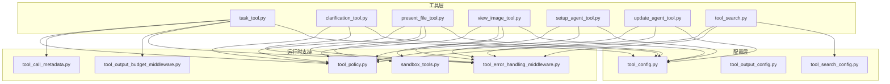
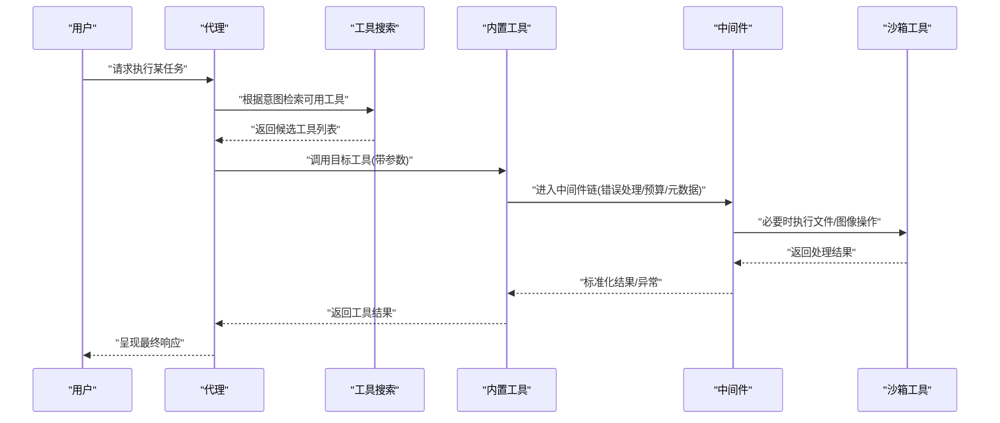
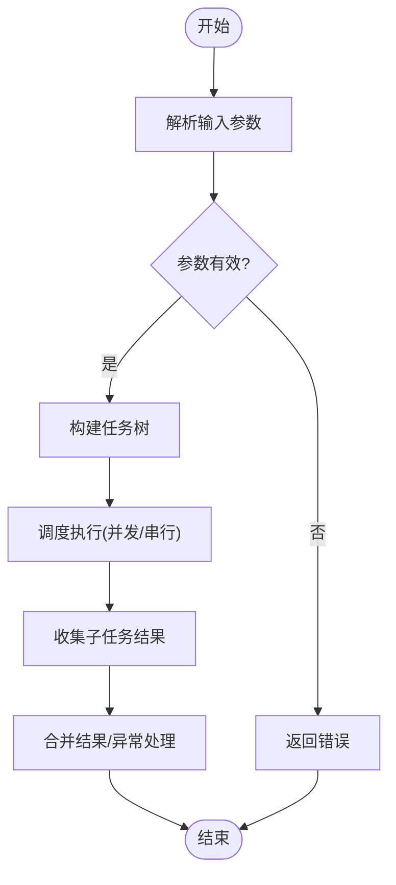
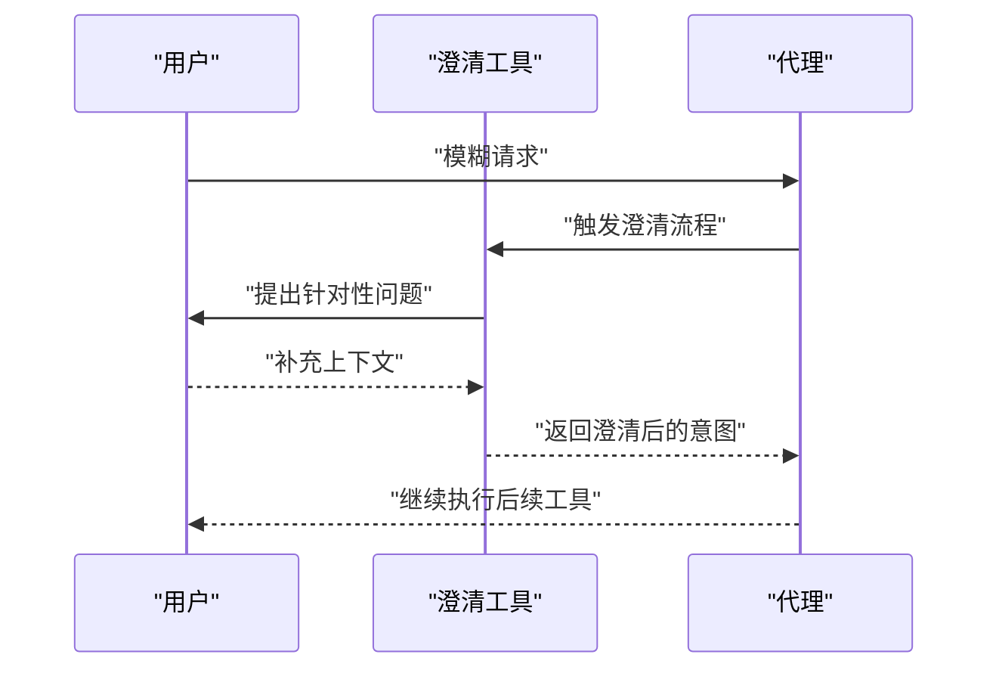
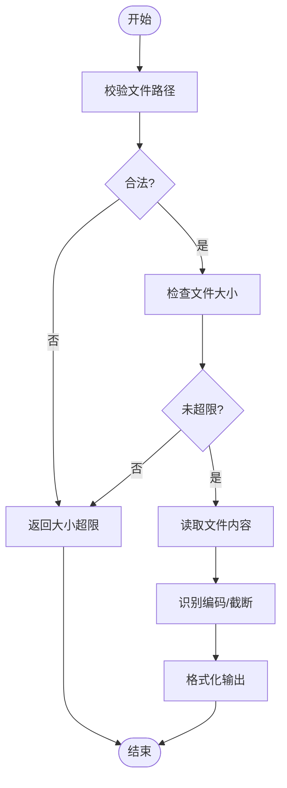
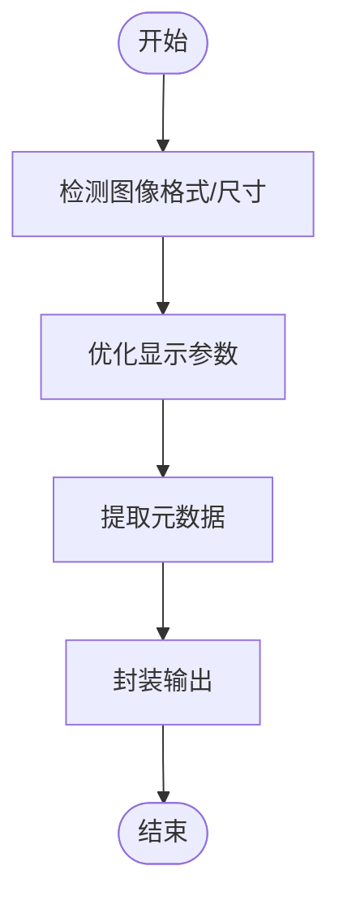
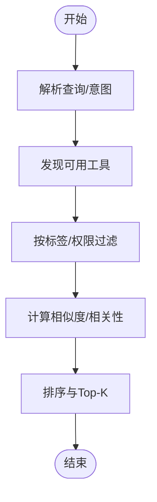
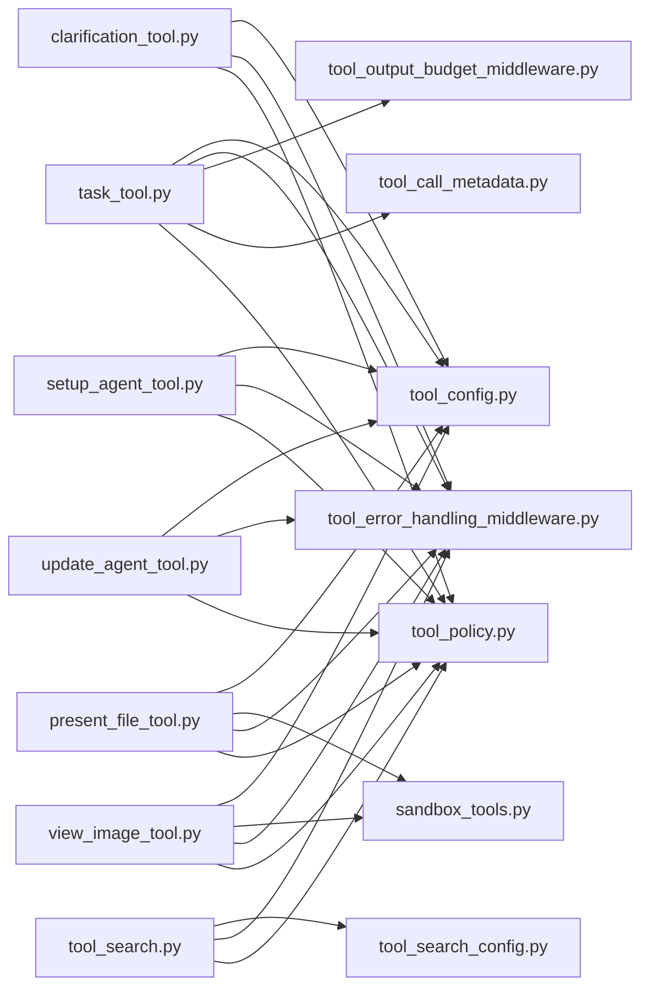

# 内置工具

<cite>
**本文引用的文件**
- [task_tool.py](file://backend/packages/harness/deerflow/tools/builtins/task_tool.py)
- [clarification_tool.py](file://backend/packages/harness/deerflow/tools/builtins/clarification_tool.py)
- [present_file_tool.py](file://backend/packages/harness/deerflow/tools/builtins/present_file_tool.py)
- [view_image_tool.py](file://backend/packages/harness/deerflow/tools/builtins/view_image_tool.py)
- [setup_agent_tool.py](file://backend/packages/harness/deerflow/tools/builtins/setup_agent_tool.py)
- [update_agent_tool.py](file://backend/packages/harness/deerflow/tools/builtins/update_agent_tool.py)
- [tool_search.py](file://backend/packages/harness/deerflow/tools/builtins/tool_search.py)
- [tools.py](file://backend/packages/harness/deerflow/tools/__init__.py)
- [tool_config.py](file://backend/packages/harness/deerflow/config/tool_config.py)
- [tool_output_config.py](file://backend/packages/harness/deerflow/config/tool_output_config.py)
- [tool_search_config.py](file://backend/packages/harness/deerflow/config/tool_search_config.py)
- [sandbox_tools.py](file://backend/packages/harness/deerflow/sandbox/tools.py)
- [tool_error_handling_middleware.py](file://backend/packages/harness/deerflow/agents/middlewares/tool_error_handling_middleware.py)
- [tool_output_budget_middleware.py](file://backend/packages/harness/deerflow/agents/middlewares/tool_output_budget_middleware.py)
- [tool_call_metadata.py](file://backend/packages/harness/deerflow/agents/middlewares/tool_call_metadata.py)
- [tool_policy.py](file://backend/packages/harness/deerflow/skills/tool_policy.py)
- [test_task_tool_core_logic.py](file://backend/tests/test_task_tool_core_logic.py)
- [test_view_image_tool.py](file://backend/tests/test_view_image_tool.py)
- [test_tool_search.py](file://backend/tests/test_tool_search.py)
- [test_tool_error_handling_middleware.py](file://backend/tests/test_tool_error_handling_middleware.py)
- [test_tool_output_budget_middleware.py](file://backend/tests/test_tool_output_budget_middleware.py)
- [test_present_file_tool_core_logic.py](file://backend/tests/test_present_file_tool_core_logic.py)
</cite>

## 目录
1. [简介](#简介)
2. [项目结构](#项目结构)
3. [核心组件](#核心组件)
4. [架构总览](#架构总览)
5. [详细组件分析](#详细组件分析)
6. [依赖关系分析](#依赖关系分析)
7. [性能考量](#性能考量)
8. [故障排查指南](#故障排查指南)
9. [结论](#结论)
10. [附录](#附录)

## 简介
本文件系统性梳理 deer-flow 的内置工具体系，覆盖任务工具、澄清工具、文件查看工具（含图像）、代理设置与更新工具，以及工具搜索系统。文档重点阐述：
- 工具的功能特性与使用场景
- 工具发现、匹配与推荐机制
- 参数验证、错误处理与结果格式化
- 工具组合使用、参数传递与结果处理的最佳实践
- 安全限制与访问控制

## 项目结构
内置工具主要位于后端 harness 包中，按职责划分为：
- tools/builtins：内置工具实现（任务、澄清、文件查看、图像查看、代理设置/更新、工具搜索）
- config：工具相关配置（工具配置、输出配置、搜索配置）
- sandbox：沙箱工具封装
- agents/middlewares：工具调用中间件（错误处理、输出预算、元数据）
- skills：技能策略与权限控制
- tests：对应工具的单元测试

图表来源
- [tools.py](file://backend/packages/harness/deerflow/tools/__init__.py)
- [tool_config.py](file://backend/packages/harness/deerflow/config/tool_config.py)
- [tool_output_config.py](file://backend/packages/harness/deerflow/config/tool_output_config.py)
- [tool_search_config.py](file://backend/packages/harness/deerflow/config/tool_search_config.py)
- [sandbox_tools.py](file://backend/packages/harness/deerflow/sandbox/tools.py)
- [tool_error_handling_middleware.py](file://backend/packages/harness/deerflow/agents/middlewares/tool_error_handling_middleware.py)
- [tool_output_budget_middleware.py](file://backend/packages/harness/deerflow/agents/middlewares/tool_output_budget_middleware.py)
- [tool_call_metadata.py](file://backend/packages/harness/deerflow/agents/middlewares/tool_call_metadata.py)
- [tool_policy.py](file://backend/packages/harness/deerflow/skills/tool_policy.py)

章节来源
- [tools.py](file://backend/packages/harness/deerflow/tools/__init__.py)

## 核心组件
- 任务工具：负责任务分解与执行，支持子任务派生、状态跟踪与结果聚合。
- 澄清工具：在对话中引导用户提供更明确的意图或上下文，提升后续工具调用质量。
- 文件查看工具：读取并呈现文件内容，支持大小限制与编码处理，结合沙箱安全策略。
- 图像查看工具：对图像进行预处理与展示，支持格式转换与尺寸控制。
- 代理设置/更新工具：用于初始化与更新代理配置，确保运行时一致性。
- 工具搜索：基于名称、描述、标签与相似度进行工具发现、匹配与推荐。

章节来源
- [task_tool.py](file://backend/packages/harness/deerflow/tools/builtins/task_tool.py)
- [clarification_tool.py](file://backend/packages/harness/deerflow/tools/builtins/clarification_tool.py)
- [present_file_tool.py](file://backend/packages/harness/deerflow/tools/builtins/present_file_tool.py)
- [view_image_tool.py](file://backend/packages/harness/deerflow/tools/builtins/view_image_tool.py)
- [setup_agent_tool.py](file://backend/packages/harness/deerflow/tools/builtins/setup_agent_tool.py)
- [update_agent_tool.py](file://backend/packages/harness/deerflow/tools/builtins/update_agent_tool.py)
- [tool_search.py](file://backend/packages/harness/deerflow/tools/builtins/tool_search.py)

## 架构总览
内置工具通过统一的注册与调用接口暴露，运行时由中间件提供错误处理、输出预算与元数据支持；配置模块为工具提供参数约束与行为开关；沙箱工具封装底层文件/图像操作以保障安全；技能策略与权限控制贯穿工具生命周期。

图表来源
- [tool_search.py](file://backend/packages/harness/deerflow/tools/builtins/tool_search.py)
- [tool_error_handling_middleware.py](file://backend/packages/harness/deerflow/agents/middlewares/tool_error_handling_middleware.py)
- [tool_output_budget_middleware.py](file://backend/packages/harness/deerflow/agents/middlewares/tool_output_budget_middleware.py)
- [tool_call_metadata.py](file://backend/packages/harness/deerflow/agents/middlewares/tool_call_metadata.py)
- [sandbox_tools.py](file://backend/packages/harness/deerflow/sandbox/tools.py)

## 详细组件分析

### 任务工具（Task Tool）
- 功能特性
  - 将复杂任务拆解为可执行的子任务，支持层级递归与依赖关系建模
  - 维护任务状态与进度，聚合子任务结果
  - 支持超时、重试与失败降级策略
- 使用场景
  - 复杂研究型任务分解
  - 多步骤工程任务编排
  - 数据采集与预处理流水线
- 关键流程
  - 输入解析与参数校验
  - 任务树构建与优先级排序
  - 子任务并发/串行调度
  - 结果合并与异常传播

图表来源
- [task_tool.py](file://backend/packages/harness/deerflow/tools/builtins/task_tool.py)

章节来源
- [task_tool.py](file://backend/packages/harness/deerflow/tools/builtins/task_tool.py)
- [test_task_tool_core_logic.py](file://backend/tests/test_task_tool_core_logic.py)

### 澄清工具（Clarification Tool）
- 功能特性
  - 在用户意图模糊或信息不足时，引导用户提供更精确的上下文
  - 通过多轮对话逐步收敛问题边界
- 使用场景
  - 搜索类任务前的意图澄清
  - 复杂分析任务的前置确认
- 关键流程
  - 分析用户输入的歧义点
  - 生成引导式问题序列
  - 记录澄清历史与上下文

图表来源
- [clarification_tool.py](file://backend/packages/harness/deerflow/tools/builtins/clarification_tool.py)

章节来源
- [clarification_tool.py](file://backend/packages/harness/deerflow/tools/builtins/clarification_tool.py)

### 文件查看工具（Present File Tool）
- 功能特性
  - 读取指定文件内容并进行安全呈现
  - 支持大小限制与编码检测，避免内存与字符集问题
  - 与沙箱工具配合，确保文件操作在受控环境中执行
- 使用场景
  - 文档内容提取与摘要
  - 日志与配置文件分析
- 关键流程
  - 路径合法性与权限校验
  - 文件大小与类型检查
  - 编码识别与内容截断
  - 结果格式化与安全脱敏

图表来源
- [present_file_tool.py](file://backend/packages/harness/deerflow/tools/builtins/present_file_tool.py)
- [sandbox_tools.py](file://backend/packages/harness/deerflow/sandbox/tools.py)

章节来源
- [present_file_tool.py](file://backend/packages/harness/deerflow/tools/builtins/present_file_tool.py)
- [test_present_file_tool_core_logic.py](file://backend/tests/test_present_file_tool_core_logic.py)

### 图像查看工具（View Image Tool）
- 功能特性
  - 对图像进行预处理（如格式转换、尺寸调整），以便在前端展示
  - 提供图像元数据与基础统计信息
- 使用场景
  - 可视化报告中的图像插入
  - 图像质量与合规性检查
- 关键流程
  - 图像格式识别与兼容性检查
  - 尺寸与分辨率优化
  - 元数据提取与结果封装

图表来源
- [view_image_tool.py](file://backend/packages/harness/deerflow/tools/builtins/view_image_tool.py)

章节来源
- [view_image_tool.py](file://backend/packages/harness/deerflow/tools/builtins/view_image_tool.py)
- [test_view_image_tool.py](file://backend/tests/test_view_image_tool.py)

### 代理设置与更新工具（Setup/Update Agent Tool）
- 功能特性
  - 初始化代理配置（模型、提示词、工具集合等）
  - 更新现有代理的运行参数与策略
- 使用场景
  - 新环境部署后的代理初始化
  - 运行时策略调整与热更新
- 关键流程
  - 参数解析与默认值填充
  - 配置合法性校验
  - 应用变更并回滚保护

章节来源
- [setup_agent_tool.py](file://backend/packages/harness/deerflow/tools/builtins/setup_agent_tool.py)
- [update_agent_tool.py](file://backend/packages/harness/deerflow/tools/builtins/update_agent_tool.py)

### 工具搜索系统（Tool Search）
- 实现原理
  - 工具发现：从注册表加载所有可用工具，提取名称、描述、标签与签名
  - 工具匹配：基于关键词、意图向量与标签集合计算相似度
  - 工具推荐：结合历史使用、上下文相关性与策略权重排序
- 关键流程
  - 输入解析与意图抽取
  - 工具候选生成与过滤
  - 相似度评分与Top-K选择
  - 结果去重与排序

图表来源
- [tool_search.py](file://backend/packages/harness/deerflow/tools/builtins/tool_search.py)
- [tool_search_config.py](file://backend/packages/harness/deerflow/config/tool_search_config.py)

章节来源
- [tool_search.py](file://backend/packages/harness/deerflow/tools/builtins/tool_search.py)
- [test_tool_search.py](file://backend/tests/test_tool_search.py)

## 依赖关系分析
- 工具到配置：各工具通过配置模块读取参数约束与行为开关
- 工具到沙箱：文件/图像相关工具依赖沙箱工具进行安全执行
- 工具到中间件：统一经由错误处理、输出预算与元数据中间件
- 工具到策略：技能策略与权限控制贯穿工具生命周期，决定可见性与可调用性

图表来源
- [task_tool.py](file://backend/packages/harness/deerflow/tools/builtins/task_tool.py)
- [clarification_tool.py](file://backend/packages/harness/deerflow/tools/builtins/clarification_tool.py)
- [present_file_tool.py](file://backend/packages/harness/deerflow/tools/builtins/present_file_tool.py)
- [view_image_tool.py](file://backend/packages/harness/deerflow/tools/builtins/view_image_tool.py)
- [setup_agent_tool.py](file://backend/packages/harness/deerflow/tools/builtins/setup_agent_tool.py)
- [update_agent_tool.py](file://backend/packages/harness/deerflow/tools/builtins/update_agent_tool.py)
- [tool_search.py](file://backend/packages/harness/deerflow/tools/builtins/tool_search.py)
- [tool_config.py](file://backend/packages/harness/deerflow/config/tool_config.py)
- [tool_search_config.py](file://backend/packages/harness/deerflow/config/tool_search_config.py)
- [sandbox_tools.py](file://backend/packages/harness/deerflow/sandbox/tools.py)
- [tool_error_handling_middleware.py](file://backend/packages/harness/deerflow/agents/middlewares/tool_error_handling_middleware.py)
- [tool_output_budget_middleware.py](file://backend/packages/harness/deerflow/agents/middlewares/tool_output_budget_middleware.py)
- [tool_call_metadata.py](file://backend/packages/harness/deerflow/agents/middlewares/tool_call_metadata.py)
- [tool_policy.py](file://backend/packages/harness/deerflow/skills/tool_policy.py)

## 性能考量
- 工具搜索
  - 候选数量与相似度计算复杂度成正比，建议启用标签过滤与缓存
  - 向量检索可采用近似最近邻索引降低延迟
- 文件/图像处理
  - 控制最大读取字节数与图像分辨率，避免内存峰值
  - 异步I/O与流式处理减少阻塞
- 中间件开销
  - 错误处理与输出预算中间件应尽量轻量化，避免重复序列化
- 并发调度
  - 任务工具的并发度需与资源配额匹配，防止饥饿与过载

## 故障排查指南
- 参数验证失败
  - 检查工具配置与输入参数是否符合约束
  - 查看工具调用元数据定位具体字段
- 执行异常
  - 通过工具错误处理中间件捕获与记录异常栈
  - 结合输出预算中间件判断是否因长度限制导致截断
- 文件/图像访问失败
  - 确认沙箱权限与路径合法性
  - 检查编码与格式兼容性
- 工具不可见或不可用
  - 核对技能策略与权限控制规则
  - 确认工具注册与搜索配置正确

章节来源
- [tool_error_handling_middleware.py](file://backend/packages/harness/deerflow/agents/middlewares/tool_error_handling_middleware.py)
- [tool_output_budget_middleware.py](file://backend/packages/harness/deerflow/agents/middlewares/tool_output_budget_middleware.py)
- [tool_call_metadata.py](file://backend/packages/harness/deerflow/agents/middlewares/tool_call_metadata.py)
- [tool_policy.py](file://backend/packages/harness/deerflow/skills/tool_policy.py)
- [test_tool_error_handling_middleware.py](file://backend/tests/test_tool_error_handling_middleware.py)
- [test_tool_output_budget_middleware.py](file://backend/tests/test_tool_output_budget_middleware.py)

## 结论
deer-flow 的内置工具体系以“可发现、可治理、可扩展”为目标，通过统一的工具搜索、严格的中间件与配置管理、以及完善的权限与安全策略，实现了从任务分解到结果呈现的闭环。建议在生产环境中结合缓存、异步与限流策略，持续优化工具搜索与执行性能。

## 附录
- 最佳实践
  - 工具组合：先用澄清工具明确需求，再用工具搜索定位合适工具，最后以任务工具编排执行
  - 参数传递：遵循工具配置约束，优先使用结构化参数，避免字符串拼接
  - 结果处理：利用输出预算中间件控制长度，结合格式化配置保证一致性
- 安全限制
  - 文件/图像操作必须通过沙箱工具执行
  - 技能策略与权限控制决定工具可见性与调用范围
  - 中间件链路提供统一的错误捕获与审计