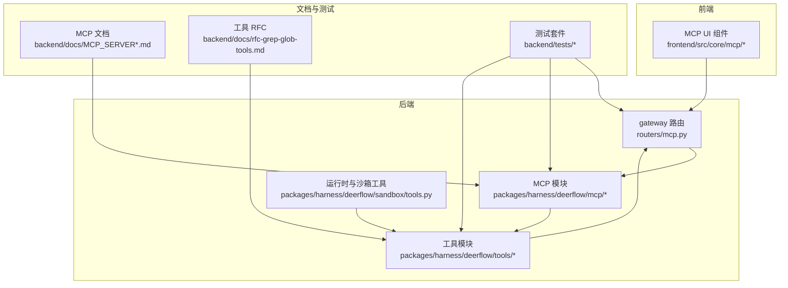
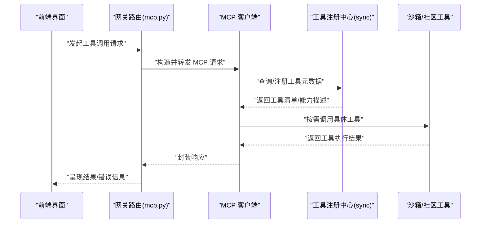
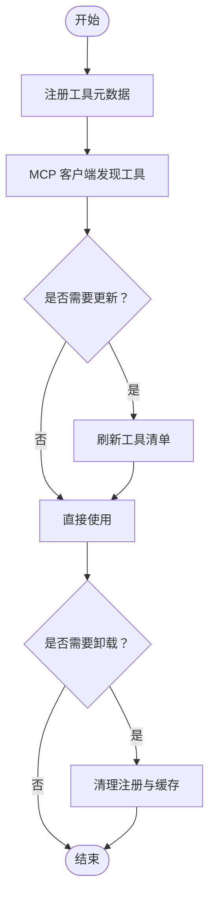
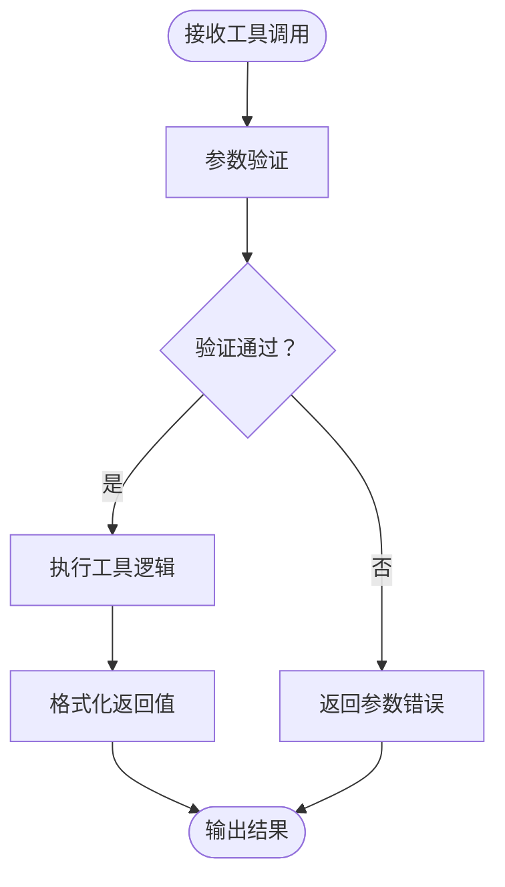
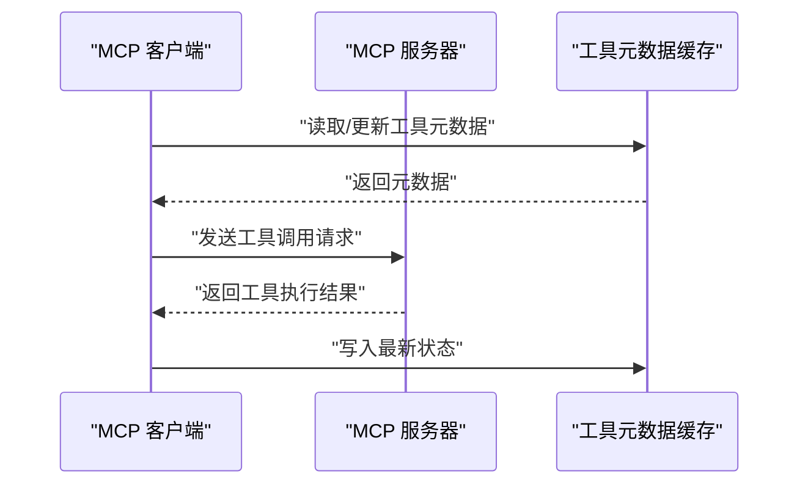
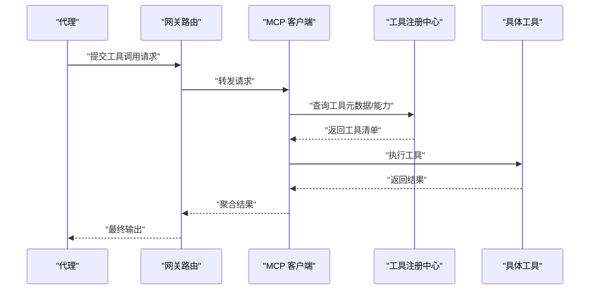
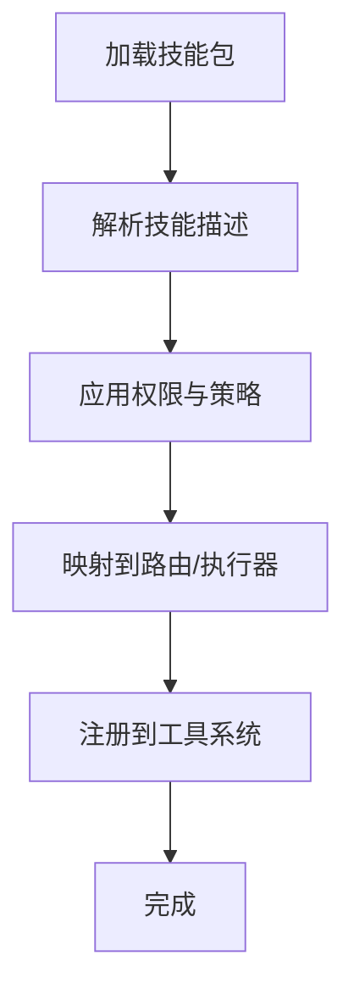
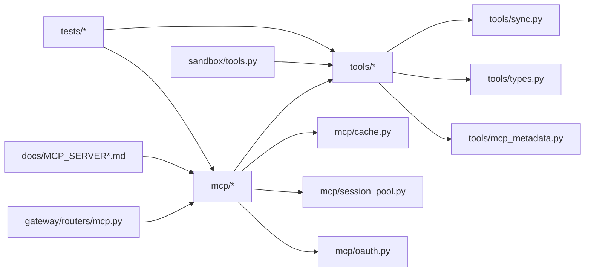

# 工具集成

<cite>
**本文引用的文件**
- [backend/packages/harness/deerflow/tools/__init__.py](file://backend/packages/harness/deerflow/tools/__init__.py)
- [backend/packages/harness/deerflow/tools/sync.py](file://backend/packages/harness/deerflow/tools/sync.py)
- [backend/packages/harness/deerflow/tools/types.py](file://backend/packages/harness/deerflow/tools/types.py)
- [backend/packages/harness/deerflow/tools/mcp_metadata.py](file://backend/packages/harness/deerflow/tools/mcp_metadata.py)
- [backend/packages/harness/deerflow/tools/skill_manage_tool.py](file://backend/packages/harness/deerflow/tools/skill_manage_tool.py)
- [backend/packages/harness/deerflow/mcp/tools.py](file://backend/packages/harness/deerflow/mcp/tools.py)
- [backend/packages/harness/deerflow/mcp/client.py](file://backend/packages/harness/deerflow/mcp/client.py)
- [backend/packages/harness/deerflow/mcp/cache.py](file://backend/packages/harness/deerflow/mcp/cache.py)
- [backend/packages/harness/deerflow/mcp/session_pool.py](file://backend/packages/harness/deerflow/mcp/session_pool.py)
- [backend/packages/harness/deerflow/mcp/oauth.py](file://backend/packages/harness/deerflow/mcp/oauth.py)
- [backend/app/gateway/routers/mcp.py](file://backend/app/gateway/routers/mcp.py)
- [backend/docs/MCP_SERVER.md](file://backend/docs/MCP_SERVER.md)
- [backend/docs/MCP_SERVER_ZH.md](file://backend/docs/MCP_SERVER_ZH.md)
- [backend/docs/task_tool_improvements.md](file://backend/docs/task_tool_improvements.md)
- [backend/docs/rfc-grep-glob-tools.md](file://backend/docs/rfc-grep-glob-tools.md)
- [backend/tests/test_mcp_sync_wrapper.py](file://backend/tests/test_mcp_sync_wrapper.py)
- [backend/tests/test_mcp_client_config.py](file://backend/tests/test_mcp_client_config.py)
- [backend/tests/test_mcp_config_secrets.py](file://backend/tests/test_mcp_config_secrets.py)
- [backend/tests/test_mcp_oauth.py](file://backend/tests/test_mcp_oauth.py)
- [backend/tests/test_mcp_custom_interceptors.py](file://backend/tests/test_mcp_custom_interceptors.py)
- [backend/tests/test_tool_output_truncation.py](file://backend/tests/test_tool_output_truncation.py)
- [backend/tests/test_tool_output_budget_middleware.py](file://backend/tests/test_tool_output_budget_middleware.py)
- [backend/tests/test_tool_error_handling_middleware.py](file://backend/tests/test_tool_error_handling_middleware.py)
- [backend/tests/test_tool_error_handling_subagent_stamp.py](file://backend/tests/test_tool_error_handling_subagent_stamp.py)
- [backend/tests/test_tool_deduplication.py](file://backend/tests/test_tool_deduplication.py)
- [backend/tests/test_tool_args_schema_no_pydantic_warning.py](file://backend/tests/test_tool_args_schema_no_pydantic_warning.py)
- [backend/tests/test_skills_loader.py](file://backend/tests/test_skills_loader.py)
- [backend/tests/test_skills_validation.py](file://backend/tests/test_skills_validation.py)
- [backend/tests/test_skills_parser.py](file://backend/tests/test_skills_parser.py)
- [backend/tests/test_skills_installer.py](file://backend/tests/test_skills_installer.py)
- [backend/tests/test_skills_custom_router.py](file://backend/tests/test_skills_custom_router.py)
- [backend/tests/test_skills_archive_root.py](file://backend/tests/test_skills_archive_root.py)
- [backend/tests/test_skills_bundled.py](file://backend/tests/test_skills_bundled.py)
- [backend/tests/test_skills_custom_router.py](file://backend/tests/test_skills_custom_router.py)
- [backend/tests/test_skills_custom_router.py](file://backend/tests/test_skills_custom_router.py)
- [backend/tests/test_skills_custom_router.py](file://backend/tests/test_skills_custom_router.py)
- [backend/tests/test_skills_custom_router.py](file://backend/tests/test_skills_custom_router.py)
- [backend/tests/test_skills_custom_router.py](file://backend/tests/test_skills_custom_router.py)
- [backend/tests/test_skills_custom_router.py](file://backend/tests/test_skills_custom_router.py)
- [backend/tests/test_skills_custom_router.py](file://backend/tests/test_skills_custom_router.py)
- [backend/tests/test_skills_custom_router.py](file://backend/tests/test_skills_custom_router.py)
- [backend/tests/test_skills_custom_router.py](file://backend/tests/test_skills_custom_router.py)
- [backend/tests/test_skills_custom_router.py](file://backend/tests/test_skills_custom_router.py)
- [backend/tests/test_skills_custom_router.py](file://backend/tests/test_skills_custom_router.py)
- [backend/tests/test_skills_custom_router.py](file://backend/tests/test_skills_custom_router.py)
- [backend/tests/test_skills_custom_router.py](file://backend/tests/test_skills_custom_router.py)
- [backend/tests/test_skills_custom_router.py](file://backend/tests/test_skills_custom_router.py)
- [backend/tests/test_skills_custom_router.py](file://backend/tests/test_skills_custom_router.py)
- [backend/tests/test_skills_custom_router.py](file://backend/tests/test_skills_custom_router.py)
- [backend/tests/test_skills_custom_router.py](file://backend/tests/test_skills_custom_router.py)
- [backend/tests/test_skills_custom_router.py](file://backend/tests/test_skills_custom_router.py)
- [backend/tests/test_skills_custom_router.py](file://backend/tests/test_skills_custom_router.py)
- [backend/tests/test_skills_custom_router.py](file://backend/tests/test_skills_custom_router.py)
- [backend/tests/test_skills_custom_router.py](file://backend/tests/test_skills_custom_router.py)
- [backend/tests/test_skills_custom_router.py](file://backend/tests/test_skills_custom_router.py)
- [backend/tests/test_skills_custom_router.py](file://backend/tests/test_skills_custom_router.py)
- [backend/tests/test_skills_custom_router.py](file://backend/tests/test_skills_custom_router.py)
- [backend/tests/test_skills_custom_router.py](file://backend/tests/test_skills_custom_router.py)
......
</cite>

## 目录
1. [引言](#引言)
2. [项目结构](#项目结构)
3. [核心组件](#核心组件)
4. [架构总览](#架构总览)
5. [详细组件分析](#详细组件分析)
6. [依赖关系分析](#依赖关系分析)
7. [性能考量](#性能考量)
8. [故障排查指南](#故障排查指南)
9. [结论](#结论)
10. [附录](#附录)

## 引言
本文件系统性阐述 deer-flow 的工具集成机制，重点覆盖以下方面：
- 工具同步系统：注册、发现、更新、卸载的完整流程与实现要点
- 工具类型系统：参数校验、返回值格式化、错误处理的标准化机制
- MCP（Model Context Protocol）工具的元数据管理：协议适配、消息转换、状态同步
- 工具与代理系统的集成：工具调用链、参数传递、结果聚合
- 实践指南：工具接口规范、测试方法、性能优化
- 生命周期管理与版本兼容性策略

## 项目结构
工具与 MCP 能力主要集中在后端 harness 包中，前端提供配套 UI 与路由支持，测试覆盖工具加载、MCP 客户端配置、OAuth、拦截器等关键路径。

图示来源
- [backend/app/gateway/routers/mcp.py](file://backend/app/gateway/routers/mcp.py)
- [backend/packages/harness/deerflow/tools/__init__.py](file://backend/packages/harness/deerflow/tools/__init__.py)
- [backend/packages/harness/deerflow/mcp/tools.py](file://backend/packages/harness/deerflow/mcp/tools.py)
- [backend/packages/harness/deerflow/sandbox/tools.py](file://backend/packages/harness/deerflow/sandbox/tools.py)
- [backend/docs/MCP_SERVER.md](file://backend/docs/MCP_SERVER.md)
- [backend/docs/MCP_SERVER_ZH.md](file://backend/docs/MCP_SERVER_ZH.md)
- [backend/docs/rfc-grep-glob-tools.md](file://backend/docs/rfc-grep-glob-tools.md)

章节来源
- [backend/app/gateway/routers/mcp.py](file://backend/app/gateway/routers/mcp.py)
- [backend/packages/harness/deerflow/tools/__init__.py](file://backend/packages/harness/deerflow/tools/__init__.py)
- [backend/packages/harness/deerflow/mcp/tools.py](file://backend/packages/harness/deerflow/mcp/tools.py)
- [backend/packages/harness/deerflow/sandbox/tools.py](file://backend/packages/harness/deerflow/sandbox/tools.py)
- [backend/docs/MCP_SERVER.md](file://backend/docs/MCP_SERVER.md)
- [backend/docs/MCP_SERVER_ZH.md](file://backend/docs/MCP_SERVER_ZH.md)
- [backend/docs/rfc-grep-glob-tools.md](file://backend/docs/rfc-grep-glob-tools.md)

## 核心组件
- 工具同步与类型系统：负责工具注册、发现、更新、卸载；定义参数校验、返回值格式化、错误处理标准
- MCP 工具与客户端：提供 MCP 协议适配、会话池、缓存、OAuth 支持
- 网关路由：暴露 MCP 接口，协调工具调用与代理执行
- 前端 MCP UI：支撑 MCP 元数据展示与交互
- 测试与文档：保障工具与 MCP 的正确性、可维护性与可扩展性

章节来源
- [backend/packages/harness/deerflow/tools/sync.py](file://backend/packages/harness/deerflow/tools/sync.py)
- [backend/packages/harness/deerflow/tools/types.py](file://backend/packages/harness/deerflow/tools/types.py)
- [backend/packages/harness/deerflow/mcp/tools.py](file://backend/packages/harness/deerflow/mcp/tools.py)
- [backend/packages/harness/deerflow/mcp/client.py](file://backend/packages/harness/deerflow/mcp/client.py)
- [backend/app/gateway/routers/mcp.py](file://backend/app/gateway/routers/mcp.py)

## 架构总览
工具与 MCP 的整体交互链路如下：

图示来源
- [backend/app/gateway/routers/mcp.py](file://backend/app/gateway/routers/mcp.py)
- [backend/packages/harness/deerflow/mcp/client.py](file://backend/packages/harness/deerflow/mcp/client.py)
- [backend/packages/harness/deerflow/tools/sync.py](file://backend/packages/harness/deerflow/tools/sync.py)
- [backend/packages/harness/deerflow/sandbox/tools.py](file://backend/packages/harness/deerflow/sandbox/tools.py)

## 详细组件分析

### 工具同步系统（注册、发现、更新、卸载）
- 注册：通过工具注册中心集中登记工具元数据，确保工具清单可被 MCP 客户端发现
- 发现：MCP 客户端在会话建立或请求阶段拉取工具清单，进行能力匹配
- 更新：支持增量更新与全量刷新，结合缓存与版本标记保证一致性
- 卸载：清理注册表与缓存，避免残留元数据影响后续调用

图示来源
- [backend/packages/harness/deerflow/tools/sync.py](file://backend/packages/harness/deerflow/tools/sync.py)
- [backend/packages/harness/deerflow/mcp/cache.py](file://backend/packages/harness/deerflow/mcp/cache.py)

章节来源
- [backend/packages/harness/deerflow/tools/sync.py](file://backend/packages/harness/deerflow/tools/sync.py)
- [backend/packages/harness/deerflow/mcp/cache.py](file://backend/packages/harness/deerflow/mcp/cache.py)

### 工具类型系统（参数验证、返回值格式化、错误处理）
- 参数验证：基于类型定义对输入参数进行校验，避免非法参数进入工具执行
- 返回值格式化：统一输出结构，便于上层代理与前端渲染
- 错误处理：标准化异常捕获与错误码映射，支持重试与降级

图示来源
- [backend/packages/harness/deerflow/tools/types.py](file://backend/packages/harness/deerflow/tools/types.py)
- [backend/tests/test_tool_args_schema_no_pydantic_warning.py](file://backend/tests/test_tool_args_schema_no_pydantic_warning.py)
- [backend/tests/test_tool_output_truncation.py](file://backend/tests/test_tool_output_truncation.py)
- [backend/tests/test_tool_output_budget_middleware.py](file://backend/tests/test_tool_output_budget_middleware.py)
- [backend/tests/test_tool_error_handling_middleware.py](file://backend/tests/test_tool_error_handling_middleware.py)
- [backend/tests/test_tool_error_handling_subagent_stamp.py](file://backend/tests/test_tool_error_handling_subagent_stamp.py)

章节来源
- [backend/packages/harness/deerflow/tools/types.py](file://backend/packages/harness/deerflow/tools/types.py)
- [backend/tests/test_tool_args_schema_no_pydantic_warning.py](file://backend/tests/test_tool_args_schema_no_pydantic_warning.py)
- [backend/tests/test_tool_output_truncation.py](file://backend/tests/test_tool_output_truncation.py)
- [backend/tests/test_tool_output_budget_middleware.py](file://backend/tests/test_tool_output_budget_middleware.py)
- [backend/tests/test_tool_error_handling_middleware.py](file://backend/tests/test_tool_error_handling_middleware.py)
- [backend/tests/test_tool_error_handling_subagent_stamp.py](file://backend/tests/test_tool_error_handling_subagent_stamp.py)

### MCP 工具元数据管理（协议适配、消息转换、状态同步）
- 协议适配：MCP 客户端负责将通用工具调用映射为 MCP 协议消息
- 消息转换：在请求/响应之间进行字段映射与类型转换
- 状态同步：通过会话池与缓存维持工具状态一致性，支持多轮对话与上下文保持

图示来源
- [backend/packages/harness/deerflow/mcp/client.py](file://backend/packages/harness/deerflow/mcp/client.py)
- [backend/packages/harness/deerflow/mcp/cache.py](file://backend/packages/harness/deerflow/mcp/cache.py)
- [backend/packages/harness/deerflow/mcp/session_pool.py](file://backend/packages/harness/deerflow/mcp/session_pool.py)
- [backend/packages/harness/deerflow/tools/mcp_metadata.py](file://backend/packages/harness/deerflow/tools/mcp_metadata.py)

章节来源
- [backend/packages/harness/deerflow/mcp/client.py](file://backend/packages/harness/deerflow/mcp/client.py)
- [backend/packages/harness/deerflow/mcp/cache.py](file://backend/packages/harness/deerflow/mcp/cache.py)
- [backend/packages/harness/deerflow/mcp/session_pool.py](file://backend/packages/harness/deerflow/mcp/session_pool.py)
- [backend/packages/harness/deerflow/tools/mcp_metadata.py](file://backend/packages/harness/deerflow/tools/mcp_metadata.py)

### 工具与代理系统的集成（调用链、参数传递、结果聚合）
- 调用链：从网关路由到 MCP 客户端，再到工具注册中心与具体工具实现
- 参数传递：在各层之间保持参数结构一致，必要时进行类型转换
- 结果聚合：将多个工具结果合并为统一输出，供代理决策与前端展示

图示来源
- [backend/app/gateway/routers/mcp.py](file://backend/app/gateway/routers/mcp.py)
- [backend/packages/harness/deerflow/mcp/tools.py](file://backend/packages/harness/deerflow/mcp/tools.py)
- [backend/packages/harness/deerflow/tools/sync.py](file://backend/packages/harness/deerflow/tools/sync.py)

章节来源
- [backend/app/gateway/routers/mcp.py](file://backend/app/gateway/routers/mcp.py)
- [backend/packages/harness/deerflow/mcp/tools.py](file://backend/packages/harness/deerflow/mcp/tools.py)
- [backend/packages/harness/deerflow/tools/sync.py](file://backend/packages/harness/deerflow/tools/sync.py)

### 技能管理工具（安装、解析、权限、策略）
- 安装：从公共/自定义仓库加载技能包，支持增量安装与版本选择
- 解析：解析技能描述与依赖，生成工具注册清单
- 权限与策略：基于安全扫描与权限策略控制工具可用性
- 自定义路由：支持将技能映射到特定路由或执行器

图示来源
- [backend/packages/harness/deerflow/skills/installer.py](file://backend/packages/harness/deerflow/skills/installer.py)
- [backend/packages/harness/deerflow/skills/parser.py](file://backend/packages/harness/deerflow/skills/parser.py)
- [backend/packages/harness/deerflow/skills/permissions.py](file://backend/packages/harness/deerflow/skills/permissions.py)
- [backend/packages/harness/deerflow/skills/tool_policy.py](file://backend/packages/harness/deerflow/skills/tool_policy.py)
- [backend/packages/harness/deerflow/skills/types.py](file://backend/packages/harness/deerflow/skills/types.py)
- [backend/tests/test_skills_loader.py](file://backend/tests/test_skills_loader.py)
- [backend/tests/test_skills_validation.py](file://backend/tests/test_skills_validation.py)
- [backend/tests/test_skills_parser.py](file://backend/tests/test_skills_parser.py)
- [backend/tests/test_skills_installer.py](file://backend/tests/test_skills_installer.py)
- [backend/tests/test_skills_custom_router.py](file://backend/tests/test_skills_custom_router.py)
- [backend/tests/test_skills_archive_root.py](file://backend/tests/test_skills_archive_root.py)
- [backend/tests/test_skills_bundled.py](file://backend/tests/test_skills_bundled.py)

章节来源
- [backend/packages/harness/deerflow/skills/installer.py](file://backend/packages/harness/deerflow/skills/installer.py)
- [backend/packages/harness/deerflow/skills/parser.py](file://backend/packages/harness/deerflow/skills/parser.py)
- [backend/packages/harness/deerflow/skills/permissions.py](file://backend/packages/harness/deerflow/skills/permissions.py)
- [backend/packages/harness/deerflow/skills/tool_policy.py](file://backend/packages/harness/deerflow/skills/tool_policy.py)
- [backend/packages/harness/deerflow/skills/types.py](file://backend/packages/harness/deerflow/skills/types.py)
- [backend/tests/test_skills_loader.py](file://backend/tests/test_skills_loader.py)
- [backend/tests/test_skills_validation.py](file://backend/tests/test_skills_validation.py)
- [backend/tests/test_skills_parser.py](file://backend/tests/test_skills_parser.py)
- [backend/tests/test_skills_installer.py](file://backend/tests/test_skills_installer.py)
- [backend/tests/test_skills_custom_router.py](file://backend/tests/test_skills_custom_router.py)
- [backend/tests/test_skills_archive_root.py](file://backend/tests/test_skills_archive_root.py)
- [backend/tests/test_skills_bundled.py](file://backend/tests/test_skills_bundled.py)

### 实践指南（接口规范、测试、性能优化）
- 接口规范：遵循工具类型系统定义的参数与返回值结构，确保跨工具一致性
- 测试方法：利用现有测试套件覆盖 MCP 配置、OAuth、拦截器、输出预算与去重等场景
- 性能优化：通过缓存、会话池与异步执行减少延迟，结合输出截断与预算限制控制资源消耗

章节来源
- [backend/tests/test_mcp_client_config.py](file://backend/tests/test_mcp_client_config.py)
- [backend/tests/test_mcp_oauth.py](file://backend/tests/test_mcp_oauth.py)
- [backend/tests/test_mcp_custom_interceptors.py](file://backend/tests/test_mcp_custom_interceptors.py)
- [backend/tests/test_mcp_sync_wrapper.py](file://backend/tests/test_mcp_sync_wrapper.py)
- [backend/tests/test_tool_output_truncation.py](file://backend/tests/test_tool_output_truncation.py)
- [backend/tests/test_tool_output_budget_middleware.py](file://backend/tests/test_tool_output_budget_middleware.py)
- [backend/tests/test_tool_deduplication.py](file://backend/tests/test_tool_deduplication.py)

## 依赖关系分析
工具与 MCP 的依赖关系如下：

图示来源
- [backend/packages/harness/deerflow/tools/__init__.py](file://backend/packages/harness/deerflow/tools/__init__.py)
- [backend/packages/harness/deerflow/tools/sync.py](file://backend/packages/harness/deerflow/tools/sync.py)
- [backend/packages/harness/deerflow/tools/types.py](file://backend/packages/harness/deerflow/tools/types.py)
- [backend/packages/harness/deerflow/tools/mcp_metadata.py](file://backend/packages/harness/deerflow/tools/mcp_metadata.py)
- [backend/packages/harness/deerflow/mcp/tools.py](file://backend/packages/harness/deerflow/mcp/tools.py)
- [backend/packages/harness/deerflow/mcp/cache.py](file://backend/packages/harness/deerflow/mcp/cache.py)
- [backend/packages/harness/deerflow/mcp/session_pool.py](file://backend/packages/harness/deerflow/mcp/session_pool.py)
- [backend/packages/harness/deerflow/mcp/oauth.py](file://backend/packages/harness/deerflow/mcp/oauth.py)
- [backend/app/gateway/routers/mcp.py](file://backend/app/gateway/routers/mcp.py)
- [backend/packages/harness/deerflow/sandbox/tools.py](file://backend/packages/harness/deerflow/sandbox/tools.py)
- [backend/docs/MCP_SERVER.md](file://backend/docs/MCP_SERVER.md)
- [backend/docs/MCP_SERVER_ZH.md](file://backend/docs/MCP_SERVER_ZH.md)

章节来源
- [backend/packages/harness/deerflow/tools/__init__.py](file://backend/packages/harness/deerflow/tools/__init__.py)
- [backend/packages/harness/deerflow/mcp/tools.py](file://backend/packages/harness/deerflow/mcp/tools.py)
- [backend/app/gateway/routers/mcp.py](file://backend/app/gateway/routers/mcp.py)

## 性能考量
- 缓存与会话池：通过缓存工具元数据与会话池复用连接，降低重复初始化开销
- 输出预算与截断：限制工具输出大小，避免内存与带宽压力
- 去重与幂等：对重复调用进行去重，提升吞吐并减少无效计算
- 异步执行：在允许的工具中采用异步模式，缩短等待时间

章节来源
- [backend/packages/harness/deerflow/mcp/cache.py](file://backend/packages/harness/deerflow/mcp/cache.py)
- [backend/packages/harness/deerflow/mcp/session_pool.py](file://backend/packages/harness/deerflow/mcp/session_pool.py)
- [backend/tests/test_tool_output_budget_middleware.py](file://backend/tests/test_tool_output_budget_middleware.py)
- [backend/tests/test_tool_output_truncation.py](file://backend/tests/test_tool_output_truncation.py)
- [backend/tests/test_tool_deduplication.py](file://backend/tests/test_tool_deduplication.py)

## 故障排查指南
- MCP 客户端配置问题：检查配置项与密钥注入，确保会话建立成功
- OAuth 认证失败：核对凭据与令牌刷新流程，确认回调与作用域设置
- 自定义拦截器异常：定位拦截器逻辑，确保不破坏请求/响应结构
- 工具错误处理：启用错误中间件与子代理戳记，快速定位失败原因
- 工具去重与幂等：若出现重复执行，检查去重策略与并发控制

章节来源
- [backend/tests/test_mcp_client_config.py](file://backend/tests/test_mcp_client_config.py)
- [backend/tests/test_mcp_config_secrets.py](file://backend/tests/test_mcp_config_secrets.py)
- [backend/tests/test_mcp_oauth.py](file://backend/tests/test_mcp_oauth.py)
- [backend/tests/test_mcp_custom_interceptors.py](file://backend/tests/test_mcp_custom_interceptors.py)
- [backend/tests/test_tool_error_handling_middleware.py](file://backend/tests/test_tool_error_handling_middleware.py)
- [backend/tests/test_tool_error_handling_subagent_stamp.py](file://backend/tests/test_tool_error_handling_subagent_stamp.py)
- [backend/tests/test_tool_deduplication.py](file://backend/tests/test_tool_deduplication.py)

## 结论
deer-flow 的工具集成以“工具同步系统 + MCP 协议适配 + 代理集成”为核心，通过类型系统与测试体系保障稳定性与可扩展性。MCP 提供了标准化的工具元数据与消息转换机制，配合缓存、会话池与输出预算等性能优化手段，能够高效支撑复杂代理工作流。未来可在版本兼容性与自动迁移方面进一步完善，以增强长期演进能力。

## 附录
- MCP 文档与中文说明：用于理解协议细节与部署要求
- 工具 RFC：阐述工具发现与加载策略的技术背景
- 前端 MCP UI：提供 MCP 工具的可视化交互入口

章节来源
- [backend/docs/MCP_SERVER.md](file://backend/docs/MCP_SERVER.md)
- [backend/docs/MCP_SERVER_ZH.md](file://backend/docs/MCP_SERVER_ZH.md)
- [backend/docs/rfc-grep-glob-tools.md](file://backend/docs/rfc-grep-glob-tools.md)
- [backend/packages/harness/deerflow/tools/skill_manage_tool.py](file://backend/packages/harness/deerflow/tools/skill_manage_tool.py)