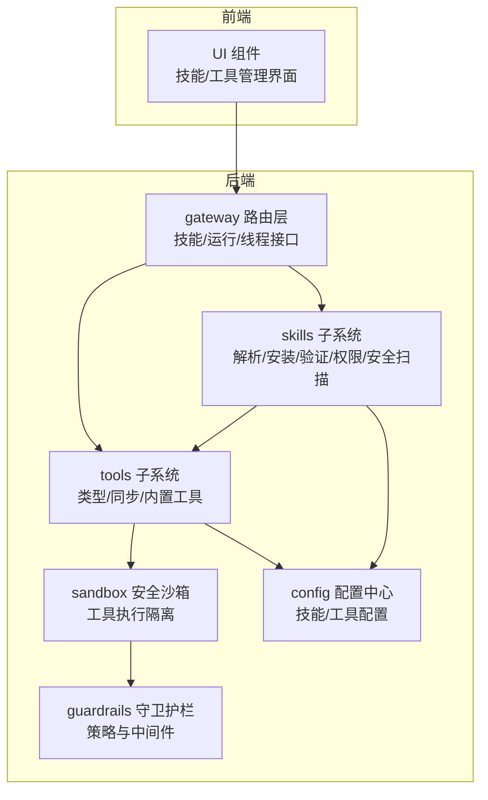
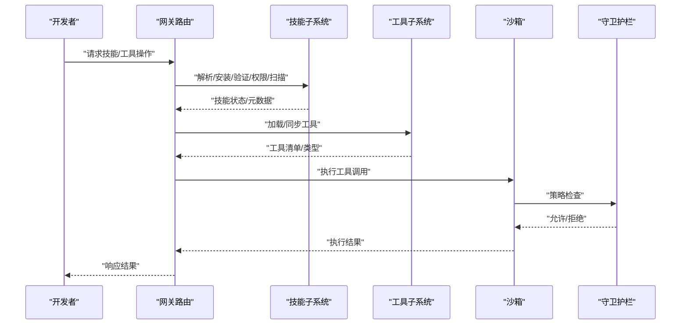
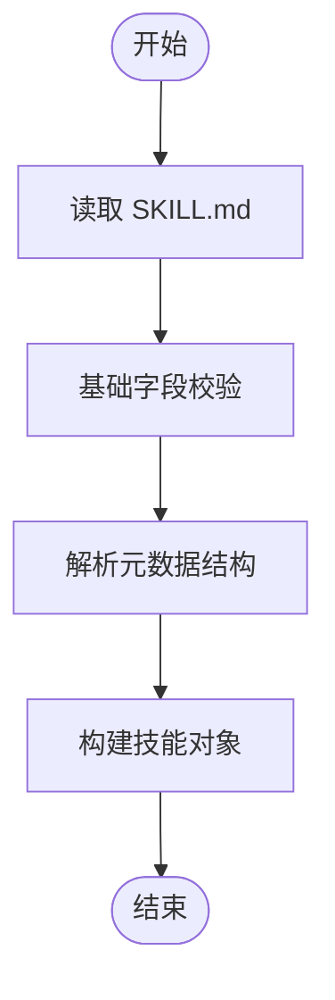
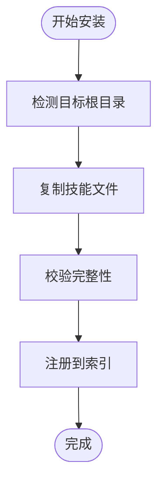
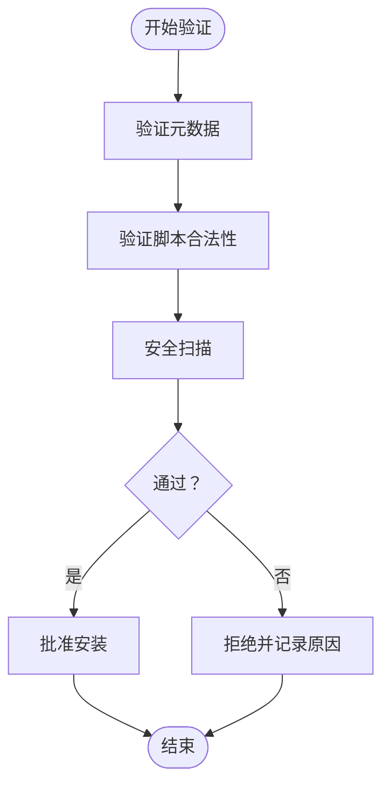
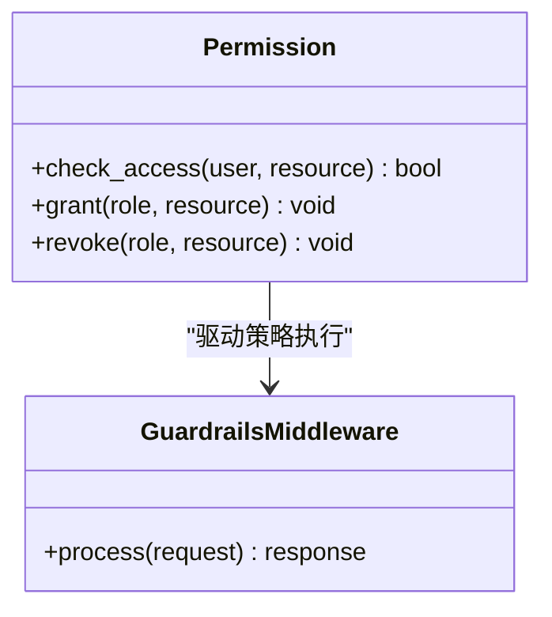
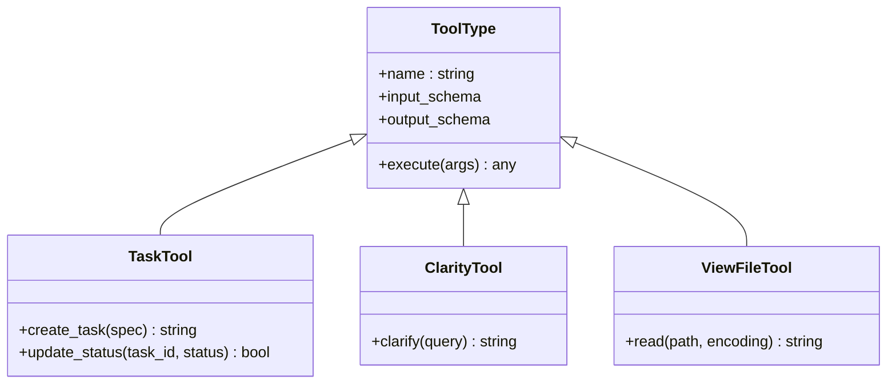
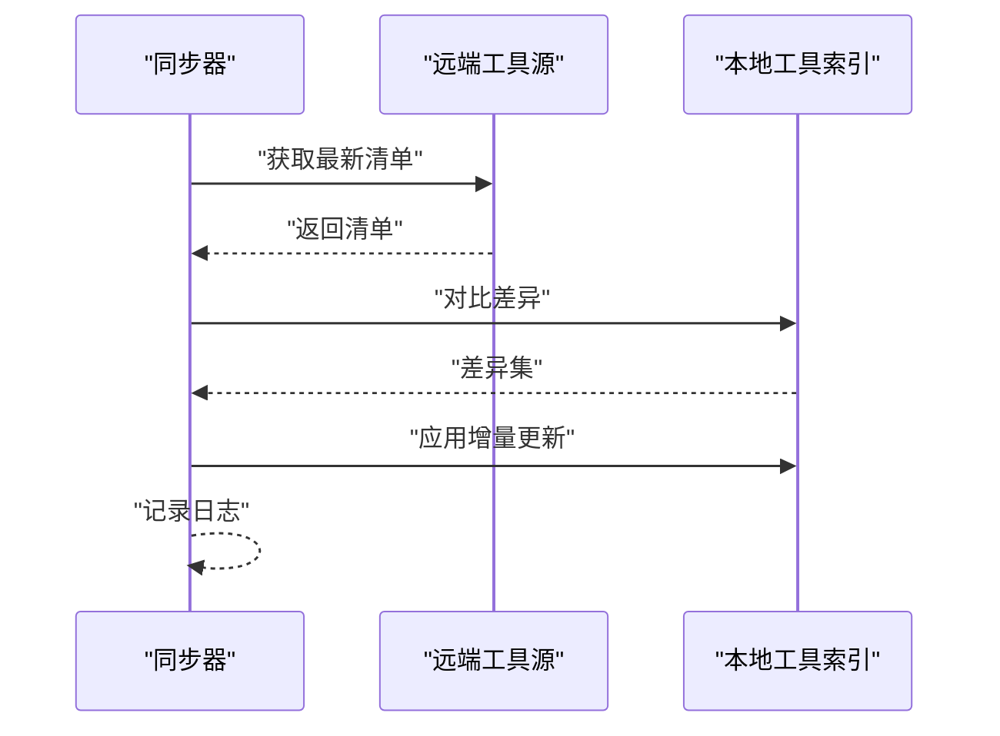
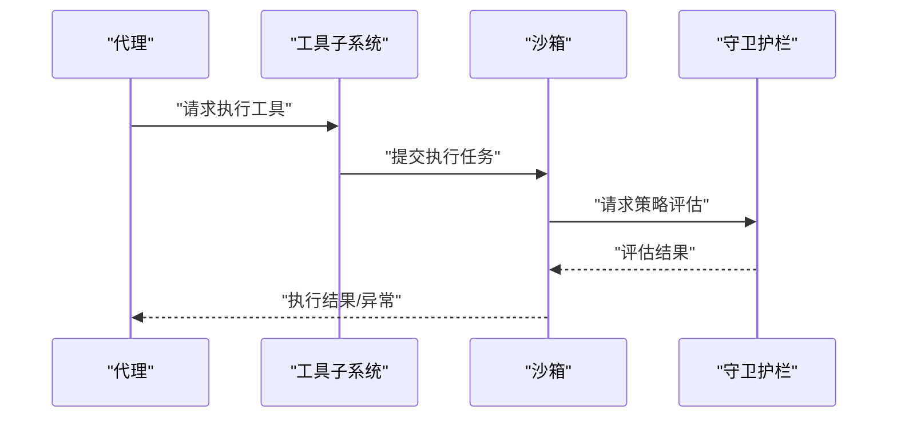
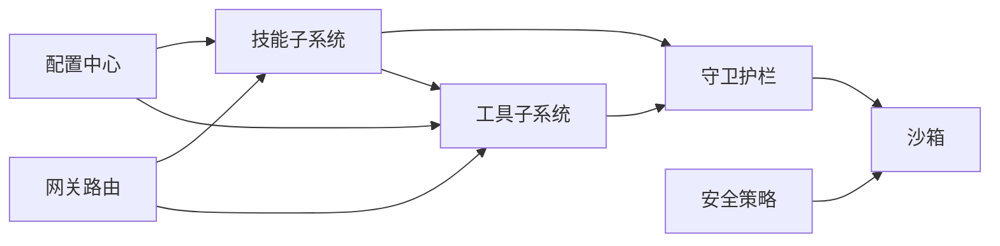

# 技能与工具系统

<cite>
**本文引用的文件**
- [backend/packages/harness/deerflow/skills/parser.py](file://backend/packages/harness/deerflow/skills/parser.py)
- [backend/packages/harness/deerflow/skills/installer.py](file://backend/packages/harness/deerflow/skills/installer.py)
- [backend/packages/harness/deerflow/skills/validation.py](file://backend/packages/harness/deerflow/skills/validation.py)
- [backend/packages/harness/deerflow/skills/security_scanner.py](file://backend/packages/harness/deerflow/skills/security_scanner.py)
- [backend/packages/harness/deerflow/skills/permissions.py](file://backend/packages/harness/deerflow/skills/permissions.py)
- [backend/packages/harness/deerflow/skills/types.py](file://backend/packages/harness/deerflow/skills/types.py)
- [backend/packages/harness/deerflow/tools/types.py](file://backend/packages/harness/deerflow/tools/types.py)
- [backend/packages/harness/deerflow/tools/sync.py](file://backend/packages/harness/deerflow/tools/sync.py)
- [backend/packages/harness/deerflow/tools/tools.py](file://backend/packages/harness/deerflow/tools/tools.py)
- [backend/packages/harness/deerflow/tools/builtins/__init__.py](file://backend/packages/harness/deerflow/tools/builtins/__init__.py)
- [backend/packages/harness/deerflow/tools/builtins/task_tool.py](file://backend/packages/harness/deerflow/tools/builtins/task_tool.py)
- [backend/packages/harness/deerflow/tools/builtins/view_file_tool.py](file://backend/packages/harness/deerflow/tools/builtins/view_file_tool.py)
- [backend/packages/harness/deerflow/tools/builtins/clarity_tool.py](file://backend/packages/harness/deerflow/tools/builtins/clarity_tool.py)
- [backend/packages/harness/deerflow/sandbox/tools.py](file://backend/packages/harness/deerflow/sandbox/tools.py)
- [backend/packages/harness/deerflow/sandbox/security.py](file://backend/packages/harness/deerflow/sandbox/security.py)
- [backend/packages/harness/deerflow/guardrails/middleware.py](file://backend/packages/harness/deerflow/guardrails/middleware.py)
- [backend/packages/harness/deerflow/guardrails/provider.py](file://backend/packages/harness/deerflow/guardrails/provider.py)
- [backend/packages/harness/deerflow/config/skills_config.py](file://backend/packages/harness/deerflow/config/skills_config.py)
- [backend/packages/harness/deerflow/config/tool_config.py](file://backend/packages/harness/deerflow/config/tool_config.py)
- [backend/app/gateway/routers/skills.py](file://backend/app/gateway/routers/skills.py)
- [backend/app/gateway/routers/runs.py](file://backend/app/gateway/routers/runs.py)
- [backend/app/gateway/routers/threads.py](file://backend/app/gateway/routers/threads.py)
- [backend/docs/GUARDRAILS.md](file://backend/docs/GUARDRAILS.md)
- [backend/docs/MCP_SERVER.md](file://backend/docs/MCP_SERVER.md)
- [backend/docs/MCP_SERVER_ZH.md](file://backend/docs/MCP_SERVER_ZH.md)
- [backend/docs/CONFIGURATION.md](file://backend/docs/CONFIGURATION.md)
- [backend/docs/AUTH_DESIGN.md](file://backend/docs/AUTH_DESIGN.md)
- [backend/docs/README.md](file://backend/docs/README.md)
- [skills/.agent/skills/smoke-test/SKILL.md](file://skills/.agent/skills/smoke-test/SKILL.md)
- [skills/public/skill-creator/SKILL.md](file://skills/public/skill-creator/SKILL.md)
- [skills/public/bootstrap/SKILL.md](file://skills/public/bootstrap/SKILL.md)
- [skills/public/chart-visualization/SKILL.md](file://skills/public/chart-visualization/SKILL.md)
- [skills/public/code-documentation/SKILL.md](file://skills/public/code-documentation/SKILL.md)
- [skills/public/deep-research/SKILL.md](file://skills/public/deep-research/SKILL.md)
- [skills/public/systematic-literature-review/SKILL.md](file://skills/public/systematic-literature-review/SKILL.md)
- [skills/public/video-generation/SKILL.md](file://skills/public/video-generation/SKILL.md)
- [skills/public/music-generation/SKILL.md](file://skills/public/music-generation/SKILL.md)
- [skills/public/podcast-generation/SKILL.md](file://skills/public/podcast-generation/SKILL.md)
- [skills/public/image-generation/SKILL.md](file://skills/public/image-generation/SKILL.md)
- [skills/public/newsletter-generation/SKILL.md](file://skills/public/newsletter-generation/SKILL.md)
- [skills/public/ppt-generation/SKILL.md](file://skills/public/ppt-generation/SKILL.md)
- [skills/public/web-design-guidelines/SKILL.md](file://skills/public/web-design-guidelines/SKILL.md)
- [skills/public/vercel-deploy-claimable/SKILL.md](file://skills/public/vercel-deploy-claimable/SKILL.md)
- [skills/public/github-deep-research/SKILL.md](file://skills/public/github-deep-research/SKILL.md)
- [skills/public/claude-to-deerflow/SKILL.md](file://skills/public/claude-to-deerflow/SKILL.md)
- [skills/public/find-skills/SKILL.md](file://skills/public/find-skills/SKILL.md)
- [skills/public/academic-paper-review/SKILL.md](file://skills/public/academic-paper-review/SKILL.md)
- [skills/public/consulting-analysis/SKILL.md](file://skills/public/consulting-analysis/SKILL.md)
- [skills/public/surprise-me/SKILL.md](file://skills/public/surprise-me/SKILL.md)
- [skills/public/frontend-design/SKILL.md](file://skills/public/frontend-design/SKILL.md)
- [skills/public/data-analysis/SKILL.md](file://skills/public/data-analysis/SKILL.md)
- [skills/public/vercel-deploy-claimable/scripts/deploy.sh](file://skills/public/vercel-deploy-claimable/scripts/deploy.sh)
- [skills/public/vercel-deploy-claimable/scripts/health_check.sh](file://skills/public/vercel-deploy-claimable/scripts/health_check.sh)
- [skills/public/vercel-deploy-claimable/scripts/pull_code.sh](file://skills/public/vercel-deploy-claimable/scripts/pull_code.sh)
- [skills/public/vercel-deploy-claimable/scripts/check_docker.sh](file://skills/public/vercel-deploy-1/scripts/check_docker.sh)
- [skills/public/vercel-deploy-claimable/scripts/check_local_env.sh](file://skills/public/vercel-deploy-claimable/scripts/check_local_env.sh)
- [skills/public/vercel-deploy-claimable/scripts/deploy_docker.sh](file://skills/public/vercel-deploy-claimable/scripts/deploy_docker.sh)
- [skills/public/vercel-deploy-claimable/scripts/deploy_local.sh](file://skills/public/vercel-deploy-claimable/scripts/deploy_local.sh)
- [skills/public/vercel-deploy-claimable/scripts/frontend_check.sh](file://skills/public/vercel-deploy-claimable/scripts/frontend_check.sh)
- [skills/public/vercel-deploy-claimable/scripts/health_check.sh](file://skills/public/vercel-deploy-claimable/scripts/health_check.sh)
- [skills/public/vercel-deploy-claimable/scripts/pull_code.sh](file://skills/public/vercel-deploy-claimable/scripts/pull_code.sh)
- [skills/public/vercel-deploy-claimable/templates/report.local.template.md](file://skills/public/vercel-deploy-claimable/templates/report.local.template.md)
- [skills/public/vercel-deploy-claimable/templates/report.docker.template.md](file://skills/public/vercel-deploy-claimable/templates/report.docker.template.md)
- [skills/public/bootstrap/references/SOP.md](file://skills/public/bootstrap/references/SOP.md)
- [skills/public/bootstrap/references/troubleshooting.md](file://skills/public/bootstrap/references/troubleshooting.md)
- [skills/public/bootstrap/templates/report.local.template.md](file://skills/public/bootstrap/templates/report.local.template.md)
- [skills/public/bootstrap/templates/report.docker.template.md](file://skills/public/bootstrap/templates/report.docker.template.md)
- [skills/public/bootstrap/scripts/check_docker.sh](file://skills/public/bootstrap/scripts/check_docker.sh)
- [skills/public/bootstrap/scripts/check_local_env.sh](file://skills/public/bootstrap/scripts/check_local_env.sh)
- [skills/public/bootstrap/scripts/deploy_docker.sh](file://skills/public/bootstrap/scripts/deploy_docker.sh)
- [skills/public/bootstrap/scripts/deploy_local.sh](file://skills/public/bootstrap/scripts/deploy_local.sh)
- [skills/public/bootstrap/scripts/frontend_check.sh](file://skills/public/bootstrap/scripts/frontend_check.sh)
- [skills/public/bootstrap/scripts/health_check.sh](file://skills/public/bootstrap/scripts/health_check.sh)
- [skills/public/bootstrap/scripts/pull_code.sh](file://skills/public/bootstrap/scripts/pull_code.sh)
- [skills/public/bootstrap/templates/report.local.template.md](file://skills/public/bootstrap/templates/report.local.template.md)
- [skills/public/bootstrap/templates/report.docker.template.md](file://skills/public/bootstrap/templates/report.docker.template.md)
- [skills/public/bootstrap/references/SOP.md](file://skills/public/bootstrap/references/SOP.md)
- [skills/public/bootstrap/references/troubleshooting.md](file://skills/public/bootstrap/references/troubleshooting.md)
- [skills/public/bootstrap/scripts/check_docker.sh](file://skills/public/bootstrap/scripts/check_docker.sh)
- [skills/public/bootstrap/scripts/check_local_env.sh](file://skills/public/bootstrap/scripts/check_local_env.sh)
- [skills/public/bootstrap/scripts/deploy_docker.sh](file://skills/public/bootstrap/scripts/deploy_docker.sh)
- [skills/public/bootstrap/scripts/deploy_local.sh](file://skills/public/bootstrap/scripts/deploy_local.sh)
- [skills/public/bootstrap/scripts/frontend_check.sh](file://skills/public/bootstrap/scripts/frontend_check.sh)
- [skills/public/bootstrap/scripts/health_check.sh](file://skills/public/bootstrap/scripts/health_check.sh)
- [skills/public/bootstrap/scripts/pull_code.sh](file://skills/public/bootstrap/scripts/pull_code.sh)
- [skills/public/bootstrap/templates/report.local.template.md](file://skills/public/bootstrap/templates/report.local.template.md)
- [skills/public/bootstrap/templates/report.docker.template.md](file://skills/public/bootstrap/templates/report.docker.template.md)
- [skills/public/bootstrap/references/SOP.md](file://skills/public/bootstrap/references/SOP.md)
- [skills/public/bootstrap/references/troubleshooting.md](file://skills/public/bootstrap/references/troubleshooting.md)
- [skills/public/bootstrap/scripts/check_docker.sh](file://skills/public/bootstrap/scripts/check_docker.sh)
- [skills/public/bootstrap/scripts/check_local_env.sh](file://skills/public/bootstrap/scripts/check_local_env.sh)
- [skills/public/bootstrap/scripts/deploy_docker.sh](file://skills/public/bootstrap/scripts/deploy_docker.sh)
- [skills/public/bootstrap/scripts/deploy_local.sh](file://skills/public/bootstrap/scripts/deploy_local.sh)
- [skills/public/bootstrap/scripts/frontend_check.sh](file://skills/public/bootstrap/scripts/frontend_check.sh)
- [skills/public/bootstrap/scripts/health_check.sh](file://skills/public/bootstrap/scripts/health_check.sh)
- [skills/public/bootstrap/scripts/pull_code.sh](file://skills/public/bootstrap/scripts/pull_code.sh)
- [skills/public/bootstrap/templates/report.local.template.md](file://skills/public/bootstrap/templates/report.local.template.md)
- [skills/public/bootstrap/templates/report.docker.template.md](file://skills/public/bootstrap/templates/report.docker.template.md)
- [skills/public/bootstrap/references/SOP.md](file://skills/public/bootstrap/references/SOP.md)
- [skills/public/bootstrap/references/troubleshooting.md](file://skills/public/bootstrap/references/troubleshooting.md)
- [skills/public/bootstrap/scripts/check_docker.sh](file://skills/public/bootstrap/scripts/check_docker.sh)
- [skills/public/bootstrap/scripts/check_local_env.sh](file://skills/public/bootstrap/scripts/check_local_env.sh)
- [skills/public/bootstrap/scripts/deploy_docker.sh](file://skills/public/bootstrap/scripts/deploy_docker.sh)
- [skills/public/bootstrap/scripts/deploy_local.sh](file://skills/public/bootstrap/scripts/deploy_local.sh)
- [skills/public/bootstrap/scripts/frontend_check.sh](file://skills/public/bootstrap/scripts/frontend_check.sh)
- [skills/public/bootstrap/scripts/health_check.sh](file://skills/public/bootstrap/scripts/health_check.sh)
- [skills/public/bootstrap/scripts/pull_code.sh](file://skills/public/bootstrap/scripts/pull_code.sh)
- [skills/public/bootstrap/templates/report.local.template.md](file://skills/public/bootstrap/templates/report.local.template.md)
- [skills/public/bootstrap/templates/report.docker.template.md](file://skills/public/bootstrap/templates/report.docker.template.md)
- [skills/public/bootstrap/references/SOP.md](file://skills/public/bootstrap/references/SOP.md)
- [skills/public/bootstrap/references/troubleshooting.md](file://skills/public/bootstrap/references/troubleshooting.md)
- [skills/public/bootstrap/scripts/check_docker.sh](file://skills/public/bootstrap/scripts/check_docker.sh)
- [skills/public/bootstrap/scripts/check_local_env.sh](file://skills/public/bootstrap/scripts/check_local_env.sh)
- [skills/public/bootstrap/scripts/deploy_docker.sh](file://skills/public/bootstrap/scripts/deploy_docker.sh)
- [skills/public/bootstrap/scripts/deploy_local.sh](file://skills/public/bootstrap/scripts/deploy_local.sh)
- [skills/public/bootstrap/scripts/frontend_check.sh](file://skills/public/bootstrap/scripts/frontend_check.sh)
- [skills/public/bootstrap/scripts/health_check.sh](file://skills/public/bootstrap/scripts/health_check.sh)
- [skills/public/bootstrap/scripts/pull_code.sh](file://skills/public/bootstrap/scripts/pull_code.sh)
- [skills/public/bootstrap/templates/report.local.template.md](file://skills/public/bootstrap/templates/report.local.template.md)
- [skills/public/bootstrap/templates/report.docker.template.md](file://skills/public/bootstrap/templates/report.docker.template.md)
- [skills/public/bootstrap/references/SOP.md](file://skills/public/bootstrap/references/SOP.md)
- [skills/public/bootstrap/references/troubleshooting.md](file://skills/public/bootstrap/references/troubleshooting.md)
- [skills/public/bootstrap/scripts/check_docker.sh](file://skills/public/bootstrap/scripts/check_docker.sh)
- [skills/public/bootstrap/scripts/check_local_env.sh](file://skills/public/bootstrap/scripts/check_local_env.sh)
- [skills/public/bootstrap/scripts/deploy_docker.sh](file://skills/public/bootstrap/scripts/deploy_docker.sh)
- [skills/public/bootstrap/scripts/deploy_local.sh](file://skills/public/bootstrap/scripts/deploy_local.sh)
- [skills/public/bootstrap/scripts/frontend_check.sh](file://skills/public/bootstrap/scripts/frontend_check.sh)
- [skills/public/bootstrap/scripts/health_check.sh](file://skills/public/bootstrap/scripts/health_check.sh)
- [skills/public/bootstrap/scripts/pull_code.sh](file://skills/public/bootstrap/scripts/pull_code.sh)
- [skills/public/bootstrap/templates/report.local.template.md](file://skills/public/bootstrap/templates/report.local.template.md)
- [skills/public/bootstrap/templates/report.docker.template.md](file://skills/public/bootstrap/templates/report.docker.template.md)
- [skills/public/bootstrap/references/SOP.md](file://skills/public/bootstrap/references/SOP.md)
- [skills/public/bootstrap/references/troubleshooting.md](file://skills/public/bootstrap/references/troubleshooting.md)
- [skills/public/bootstrap/scripts/check_docker.sh](file://skills/public/bootstrap/scripts/check_docker.sh)
- [skills/public/bootstrap/scripts/check_local_env.sh](file://skills/public/bootstrap/scripts/check_local_env.sh)
- [skills/public/bootstrap/scripts/deploy_docker.sh](file://skills/public/bootstrap/scripts/deploy_docker.sh)
- [skills/public/bootstrap/scripts/deploy_local.sh](file://skills/public/bootstrap/scripts/deploy_local.sh)
- [skills/public/bootstrap/scripts/frontend_check.sh](file://skills/public/bootstrap/scripts/frontend_check.sh)
- [skills/public/bootstrap/scripts/health_check.sh](file://skills/public/bootstrap/scripts/health_check.sh)
- [skills/public/bootstrap/scripts/pull_code.sh](file://skills/public/bootstrap/scripts/pull_code.sh)
-......
</cite>

## 目录
1. [引言](#引言)
2. [项目结构](#项目结构)
3. [核心组件](#核心组件)
4. [架构总览](#架构总览)
5. [详细组件分析](#详细组件分析)
6. [依赖关系分析](#依赖关系分析)
7. [性能考量](#性能考量)
8. [故障排查指南](#故障排查指南)
9. [结论](#结论)
10. [附录](#附录)

## 引言
本文件系统性阐述 deer-flow 的“技能与工具”体系：从技能的定义、安装、验证与存储，到技能解析器的工作原理、权限控制与安全扫描；从内置工具的分类与同步机制，到工具类型系统与最佳实践。文档同时提供可操作的集成步骤与安全边界说明，帮助开发者快速上手并安全地扩展代理能力。

## 项目结构
技能与工具系统主要分布在后端 harness 包与前端 UI 中：
- 后端核心模块位于 backend/packages/harness/deerflow 下，涵盖 skills、tools、sandbox、guardrails、config 等子系统
- 前端位于 frontend/src，提供技能与工具的可视化与交互入口
- 公共技能模板与脚本位于 skills/public 与 skills/.agent/skills

图示来源
- [backend/packages/harness/deerflow/skills/parser.py](file://backend/packages/harness/deerflow/skills/parser.py)
- [backend/packages/harness/deerflow/tools/types.py](file://backend/packages/harness/deerflow/tools/types.py)
- [backend/packages/harness/deerflow/sandbox/tools.py](file://backend/packages/harness/deerflow/sandbox/tools.py)
- [backend/packages/harness/deerflow/guardrails/middleware.py](file://backend/packages/harness/deerflow/guardrails/middleware.py)
- [backend/packages/harness/deerflow/config/skills_config.py](file://backend/packages/harness/deerflow/config/skills_config.py)
- [backend/app/gateway/routers/skills.py](file://backend/app/gateway/routers/skills.py)

章节来源
- [backend/docs/README.md](file://backend/docs/README.md)
- [backend/docs/CONFIGURATION.md](file://backend/docs/CONFIGURATION.md)

## 核心组件
- 技能子系统：负责技能元数据解析、安装、验证、权限与安全扫描
- 工具子系统：负责工具类型定义、同步机制与内置工具集合
- 沙箱子系统：提供受限执行环境，确保工具调用安全
- 守卫护栏：统一接入策略与中间件，实现访问控制与内容过滤
- 配置中心：集中管理技能与工具的启用、路径、策略等配置
- 网关路由：对外暴露技能与工具相关的 API 接口

章节来源
- [backend/packages/harness/deerflow/skills/parser.py](file://backend/packages/harness/deerflow/skills/parser.py)
- [backend/packages/harness/deerflow/skills/installer.py](file://backend/packages/harness/deerflow/skills/installer.py)
- [backend/packages/harness/deerflow/skills/validation.py](file://backend/packages/harness/deerflow/skills/validation.py)
- [backend/packages/harness/deerflow/skills/security_scanner.py](file://backend/packages/harness/deerflow/skills/security_scanner.py)
- [backend/packages/harness/deerflow/skills/permissions.py](file://backend/packages/harness/deerflow/skills/permissions.py)
- [backend/packages/harness/deerflow/tools/types.py](file://backend/packages/harness/deerflow/tools/types.py)
- [backend/packages/harness/deerflow/tools/sync.py](file://backend/packages/harness/deerflow/tools/sync.py)
- [backend/packages/harness/deerflow/tools/tools.py](file://backend/packages/harness/deerflow/tools/tools.py)
- [backend/packages/harness/deerflow/sandbox/tools.py](file://backend/packages/harness/deerflow/sandbox/tools.py)
- [backend/packages/harness/deerflow/guardrails/middleware.py](file://backend/packages/harness/deerflow/guardrails/middleware.py)
- [backend/packages/harness/deerflow/config/skills_config.py](file://backend/packages/harness/deerflow/config/skills_config.py)
- [backend/packages/harness/deerflow/config/tool_config.py](file://backend/packages/harness/deerflow/config/tool_config.py)
- [backend/app/gateway/routers/skills.py](file://backend/app/gateway/routers/skills.py)

## 架构总览
技能与工具的生命周期从“定义与模板”开始，经“安装与验证”，再到“权限与安全扫描”，最终进入“运行时执行”。执行过程中通过沙箱与守卫护栏进行安全隔离与策略控制，网关路由提供统一的外部接口。

图示来源
- [backend/app/gateway/routers/skills.py](file://backend/app/gateway/routers/skills.py)
- [backend/app/gateway/routers/runs.py](file://backend/app/gateway/routers/runs.py)
- [backend/packages/harness/deerflow/skills/parser.py](file://backend/packages/harness/deerflow/skills/parser.py)
- [backend/packages/harness/deerflow/skills/installer.py](file://backend/packages/harness/deerflow/skills/installer.py)
- [backend/packages/harness/deerflow/skills/security_scanner.py](file://backend/packages/harness/deerflow/skills/security_scanner.py)
- [backend/packages/harness/deerflow/sandbox/tools.py](file://backend/packages/harness/deerflow/sandbox/tools.py)
- [backend/packages/harness/deerflow/guardrails/middleware.py](file://backend/packages/harness/deerflow/guardrails/middleware.py)

## 详细组件分析

### 技能定义与解析
- 技能元数据通常以 SKILL.md 为入口，包含技能名称、描述、兼容性、脚本与模板等信息
- 解析器负责读取并校验 SKILL.md 的结构与字段，生成标准化的技能对象
- 支持相对路径解析与根目录约束，防止路径穿越

图示来源
- [backend/packages/harness/deerflow/skills/parser.py](file://backend/packages/harness/deerflow/skills/parser.py)
- [skills/public/bootstrap/SKILL.md](file://skills/public/bootstrap/SKILL.md)
- [skills/public/skill-creator/SKILL.md](file://skills/public/skill-creator/SKILL.md)

章节来源
- [backend/packages/harness/deerflow/skills/parser.py](file://backend/packages/harness/deerflow/skills/parser.py)
- [skills/public/bootstrap/SKILL.md](file://skills/public/bootstrap/SKILL.md)
- [skills/public/skill-creator/SKILL.md](file://skills/public/skill-creator/SKILL.md)

### 技能安装与存储
- 安装器负责将技能从源位置复制或移动到受控的技能存储根目录
- 存储机制遵循“只读/受控写入”的原则，避免直接修改已安装技能
- 支持批量安装与冲突检测，保证技能树一致性

图示来源
- [backend/packages/harness/deerflow/skills/installer.py](file://backend/packages/harness/deerflow/skills/installer.py)
- [backend/packages/harness/deerflow/config/skills_config.py](file://backend/packages/harness/deerflow/config/skills_config.py)

章节来源
- [backend/packages/harness/deerflow/skills/installer.py](file://backend/packages/harness/deerflow/skills/installer.py)
- [backend/packages/harness/deerflow/config/skills_config.py](file://backend/packages/harness/deerflow/config/skills_config.py)

### 技能验证与安全扫描
- 验证阶段对技能元数据与脚本进行格式与范围检查
- 安全扫描对脚本与模板进行静态分析，识别潜在风险（如不安全命令、路径注入等）
- 扫描结果决定是否允许安装与启用

图示来源
- [backend/packages/harness/deerflow/skills/validation.py](file://backend/packages/harness/deerflow/skills/validation.py)
- [backend/packages/harness/deerflow/skills/security_scanner.py](file://backend/packages/harness/deerflow/skills/security_scanner.py)

章节来源
- [backend/packages/harness/deerflow/skills/validation.py](file://backend/packages/harness/deerflow/skills/validation.py)
- [backend/packages/harness/deerflow/skills/security_scanner.py](file://backend/packages/harness/deerflow/skills/security_scanner.py)

### 技能权限控制
- 权限模型基于“最小权限”原则，按技能与工具粒度分配访问范围
- 支持用户/角色维度的授权矩阵，结合守卫护栏中间件在运行时强制执行
- 提供权限变更审计与回滚机制

图示来源
- [backend/packages/harness/deerflow/skills/permissions.py](file://backend/packages/harness/deerflow/skills/permissions.py)
- [backend/packages/harness/deerflow/guardrails/middleware.py](file://backend/packages/harness/deerflow/guardrails/middleware.py)

章节来源
- [backend/packages/harness/deerflow/skills/permissions.py](file://backend/packages/harness/deerflow/skills/permissions.py)
- [backend/packages/harness/deerflow/guardrails/middleware.py](file://backend/packages/harness/deerflow/guardrails/middleware.py)

### 工具类型系统与内置工具
- 工具类型系统定义了工具的输入输出模式、参数校验规则与执行语义
- 内置工具覆盖任务工具、澄清工具、文件查看工具等场景
- 工具同步机制确保本地与远端工具清单一致，支持增量更新

图示来源
- [backend/packages/harness/deerflow/tools/types.py](file://backend/packages/harness/deerflow/tools/types.py)
- [backend/packages/harness/deerflow/tools/builtins/task_tool.py](file://backend/packages/harness/deerflow/tools/builtins/task_tool.py)
- [backend/packages/harness/deerflow/tools/builtins/clarity_tool.py](file://backend/packages/harness/deerflow/tools/builtins/clarity_tool.py)
- [backend/packages/harness/deerflow/tools/builtins/view_file_tool.py](file://backend/packages/harness/deerflow/tools/builtins/view_file_tool.py)
- [backend/packages/harness/deerflow/tools/sync.py](file://backend/packages/harness/deerflow/tools/sync.py)

章节来源
- [backend/packages/harness/deerflow/tools/types.py](file://backend/packages/harness/deerflow/tools/types.py)
- [backend/packages/harness/deerflow/tools/builtins/__init__.py](file://backend/packages/harness/deerflow/tools/builtins/__init__.py)
- [backend/packages/harness/deerflow/tools/builtins/task_tool.py](file://backend/packages/harness/deerflow/tools/builtins/task_tool.py)
- [backend/packages/harness/deerflow/tools/builtins/clarity_tool.py](file://backend/packages/harness/deerflow/tools/builtins/clarity_tool.py)
- [backend/packages/harness/deerflow/tools/builtins/view_file_tool.py](file://backend/packages/harness/deerflow/tools/builtins/view_file_tool.py)
- [backend/packages/harness/deerflow/tools/sync.py](file://backend/packages/harness/deerflow/tools/sync.py)

### 工具同步机制
- 同步器定期拉取远端工具清单，计算差异并应用增量更新
- 支持并发同步与冲突解决策略，保证一致性与可用性
- 记录同步日志，便于问题定位与审计

图示来源
- [backend/packages/harness/deerflow/tools/sync.py](file://backend/packages/harness/deerflow/tools/sync.py)
- [backend/packages/harness/deerflow/tools/tools.py](file://backend/packages/harness/deerflow/tools/tools.py)

章节来源
- [backend/packages/harness/deerflow/tools/sync.py](file://backend/packages/harness/deerflow/tools/sync.py)
- [backend/packages/harness/deerflow/tools/tools.py](file://backend/packages/harness/deerflow/tools/tools.py)

### 运行时执行与安全边界
- 工具执行在沙箱中进行，限制文件系统、网络与进程能力
- 守卫护栏中间件拦截并评估每次工具调用，依据策略决定放行或阻断
- 提供超时、资源配额与输出截断等保护措施

图示来源
- [backend/packages/harness/deerflow/sandbox/tools.py](file://backend/packages/harness/deerflow/sandbox/tools.py)
- [backend/packages/harness/deerflow/sandbox/security.py](file://backend/packages/harness/deerflow/sandbox/security.py)
- [backend/packages/harness/deerflow/guardrails/middleware.py](file://backend/packages/harness/deerflow/guardrails/middleware.py)

章节来源
- [backend/packages/harness/deerflow/sandbox/tools.py](file://backend/packages/harness/deerflow/sandbox/tools.py)
- [backend/packages/harness/deerflow/sandbox/security.py](file://backend/packages/harness/deerflow/sandbox/security.py)
- [backend/packages/harness/deerflow/guardrails/middleware.py](file://backend/packages/harness/deerflow/guardrails/middleware.py)

### 技能开发最佳实践
- 使用标准模板：参考 bootstrap 与 skill-creator 提供的 SKILL.md 模板
- 参数验证：在工具类型中定义严格的输入/输出模式，利用验证器进行预检
- 错误处理：为每个工具提供明确的错误码与可读消息，便于前端与用户理解
- 安全优先：编写脚本时避免直接拼接命令与路径，使用白名单与转义
- 可观测性：为关键步骤添加日志与指标，便于排障与性能优化

章节来源
- [skills/public/bootstrap/SKILL.md](file://skills/public/bootstrap/SKILL.md)
- [skills/public/skill-creator/SKILL.md](file://skills/public/skill-creator/SKILL.md)
- [backend/packages/harness/deerflow/tools/types.py](file://backend/packages/harness/deerflow/tools/types.py)

### 在代理中集成与使用技能/工具
- 通过网关路由调用技能与工具接口，传递必要的认证与上下文信息
- 在运行时根据权限矩阵动态启用/禁用工具，避免越权调用
- 利用内置工具快速实现常见能力，必要时扩展自定义工具

章节来源
- [backend/app/gateway/routers/skills.py](file://backend/app/gateway/routers/skills.py)
- [backend/app/gateway/routers/runs.py](file://backend/app/gateway/routers/runs.py)
- [backend/app/gateway/routers/threads.py](file://backend/app/gateway/routers/threads.py)

## 依赖关系分析
技能与工具系统内部耦合度较低，通过清晰的接口与配置中心进行解耦：
- skills 依赖 config 与 guardrails
- tools 依赖 config 与 sandbox
- sandbox 依赖 guardrails 与 security
- 网关路由依赖 skills 与 tools

图示来源
- [backend/packages/harness/deerflow/config/skills_config.py](file://backend/packages/harness/deerflow/config/skills_config.py)
- [backend/packages/harness/deerflow/config/tool_config.py](file://backend/packages/harness/deerflow/config/tool_config.py)
- [backend/packages/harness/deerflow/skills/security_scanner.py](file://backend/packages/harness/deerflow/skills/security_scanner.py)
- [backend/packages/harness/deerflow/sandbox/security.py](file://backend/packages/harness/deerflow/sandbox/security.py)
- [backend/app/gateway/routers/skills.py](file://backend/app/gateway/routers/skills.py)

章节来源
- [backend/packages/harness/deerflow/config/skills_config.py](file://backend/packages/harness/deerflow/config/skills_config.py)
- [backend/packages/harness/deerflow/config/tool_config.py](file://backend/packages/harness/deerflow/config/tool_config.py)
- [backend/packages/harness/deerflow/skills/security_scanner.py](file://backend/packages/harness/deerflow/skills/security_scanner.py)
- [backend/packages/harness/deerflow/sandbox/security.py](file://backend/packages/harness/deerflow/sandbox/security.py)
- [backend/app/gateway/routers/skills.py](file://backend/app/gateway/routers/skills.py)

## 性能考量
- 技能与工具的解析与验证应尽量异步化，避免阻塞主线程
- 同步器采用增量更新策略，减少网络与磁盘 IO
- 沙箱执行设置合理的超时与资源上限，防止长耗时任务影响整体吞吐
- 对频繁调用的工具引入缓存与去重机制

## 故障排查指南
- 技能安装失败：检查 SKILL.md 结构与脚本合法性，确认安全扫描未触发阻断
- 工具执行异常：查看沙箱日志与守卫护栏策略，核对权限矩阵与资源配额
- 权限不足：确认用户角色与授权矩阵，必要时调整策略或申请更高权限
- 同步不一致：检查远端源可达性与同步日志，手动触发一次全量同步

章节来源
- [backend/packages/harness/deerflow/skills/validation.py](file://backend/packages/harness/deerflow/skills/validation.py)
- [backend/packages/harness/deerflow/skills/security_scanner.py](file://backend/packages/harness/deerflow/skills/security_scanner.py)
- [backend/packages/harness/deerflow/sandbox/tools.py](file://backend/packages/harness/deerflow/sandbox/tools.py)
- [backend/packages/harness/deerflow/guardrails/middleware.py](file://backend/packages/harness/deerflow/guardrails/middleware.py)

## 结论
deer-flow 的技能与工具系统通过“定义—安装—验证—权限—安全扫描—执行—监控”的完整闭环，实现了可扩展、可审计、可治理的能力平台。借助沙箱与守卫护栏，系统在开放的同时保持了强安全边界；通过配置中心与网关路由，实现了统一的接入与运维体验。建议在扩展新技能与工具时严格遵循模板与最佳实践，确保质量与安全双达标。

## 附录
- 参考文档
  - [GUARDRAILS.md](file://backend/docs/GUARDRAILS.md)
  - [MCP_SERVER.md](file://backend/docs/MCP_SERVER.md)
  - [MCP_SERVER_ZH.md](file://backend/docs/MCP_SERVER_ZH.md)
  - [AUTH_DESIGN.md](file://backend/docs/AUTH_DESIGN.md)
  - [CONFIGURATION.md](file://backend/docs/CONFIGURATION.md)