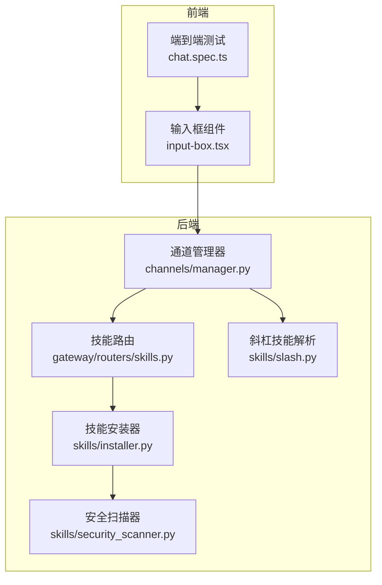
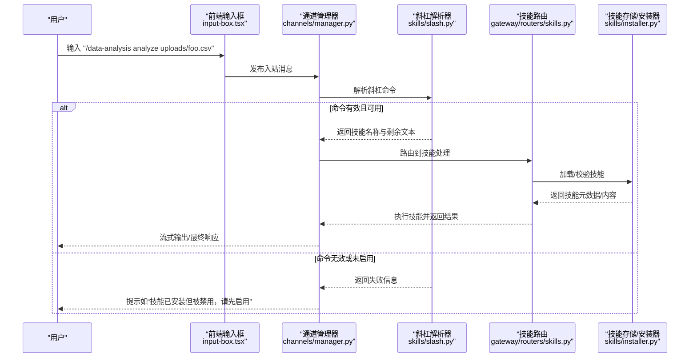
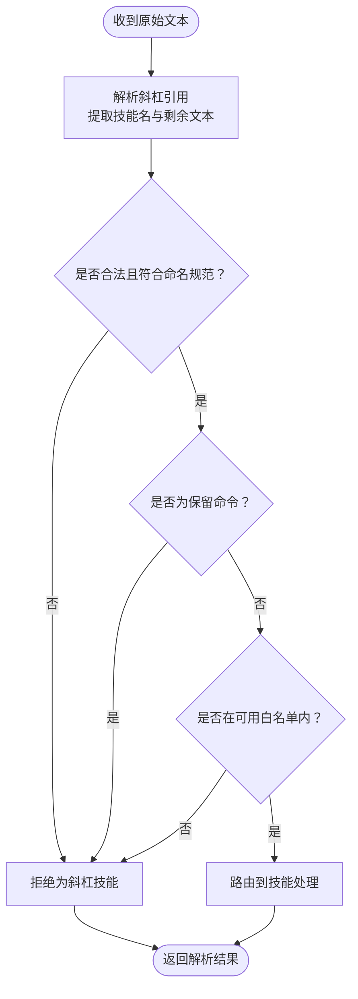
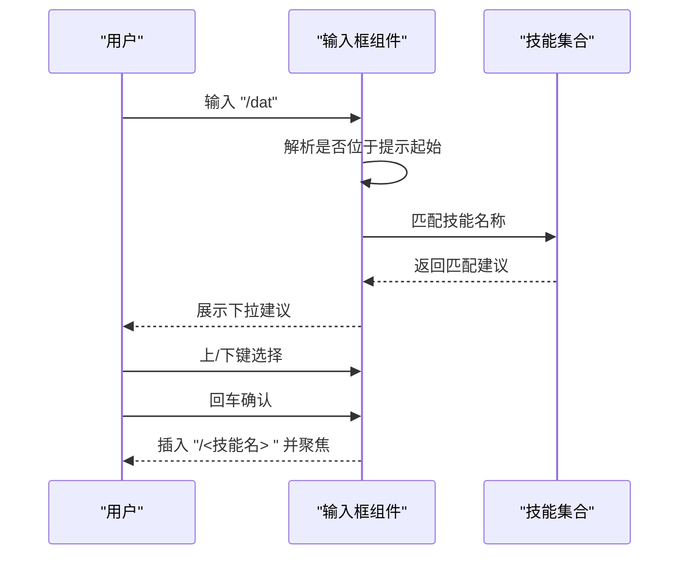
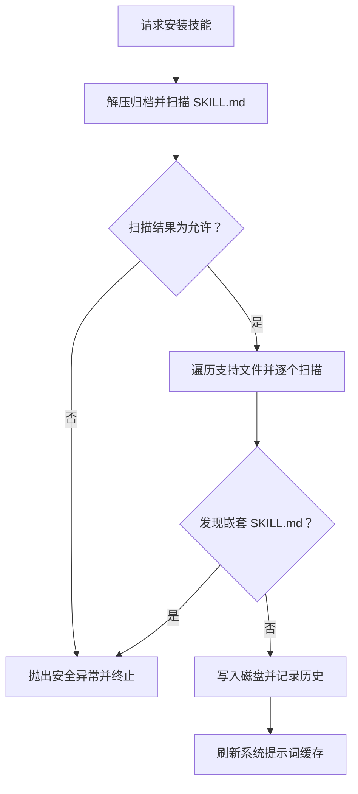
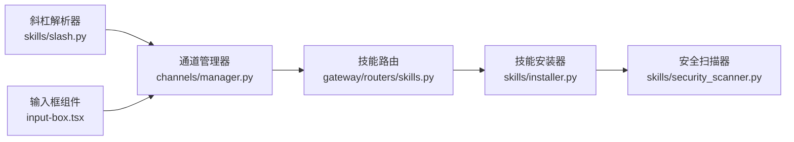

# 斜杠技能

<cite>
**本文引用的文件**
- [backend/packages/harness/deerflow/skills/slash.py](file://backend/packages/harness/deerflow/skills/slash.py)
- [backend/packages/harness/deerflow/skills/installer.py](file://backend/packages/harness/deerflow/skills/installer.py)
- [backend/packages/harness/deerflow/skills/security_scanner.py](file://backend/packages/harness/deerflow/skills/security_scanner.py)
- [backend/app/gateway/routers/skills.py](file://backend/app/gateway/routers/skills.py)
- [backend/tests/test_slash_skills.py](file://backend/tests/test_slash_skills.py)
- [backend/tests/test_skills_installer.py](file://backend/tests/test_skills_installer.py)
- [backend/tests/test_skills_custom_router.py](file://backend/tests/test_skills_custom_router.py)
- [backend/tests/test_local_skill_storage_write.py](file://backend/tests/test_local_skill_storage_write.py)
- [backend/app/channels/manager.py](file://backend/app/channels/manager.py)
- [frontend/src/components/workspace/input-box.tsx](file://frontend/src/components/workspace/input-box.tsx)
- [frontend/tests/e2e/chat.spec.ts](file://frontend/tests/e2e/chat.spec.ts)
- [skills/public/academic-paper-review/SKILL.md](file://skills/public/academic-paper-review/SKILL.md)
- [skills/public/bootstrap/SKILL.md](file://skills/public/bootstrap/SKILL.md)
- [skills/public/data-analysis/SKILL.md](file://skills/public/data-analysis/SKILL.md)
- [skills/public/find-skills/SKILL.md](file://skills/public/find-skills/SKILL.md)
- [skills/public/podcast-generation/SKILL.md](file://skills/public/podcast-generation/SKILL.md)
- [skills/public/ppt-generation/SKILL.md](file://skills/public/ppt-generation/SKILL.md)
- [skills/public/systematic-literature-review/SKILL.md](file://skills/public/systematic-literature-review/SKILL.md)
- [skills/public/video-generation/SKILL.md](file://skills/public/video-generation/SKILL.md)
- [skills/public/web-design-guidelines/SKILL.md](file://skills/public/web-design-guidelines/SKILL.md)
- [skills/public/skill-creator/SKILL.md](file://skills/public/skill-creator/SKILL.md)
- [skills/public/chart-visualization/SKILL.md](file://skills/public/chart-visualization/SKILL.md)
- [skills/public/code-documentation/SKILL.md](file://skills/public/code-documentation/SKILL.md)
- [skills/public/consulting-analysis/SKILL.md](file://skills/public/consulting-analysis/SKILL.md)
- [.agent/skills/smoke-test/SKILL.md](file://.agent/skills/smoke-test/SKILL.md)
</cite>

## 目录
1. [简介](#简介)
2. [项目结构](#项目结构)
3. [核心组件](#核心组件)
4. [架构总览](#架构总览)
5. [详细组件分析](#详细组件分析)
6. [依赖关系分析](#依赖关系分析)
7. [性能考虑](#性能考虑)
8. [故障排除指南](#故障排除指南)
9. [结论](#结论)
10. [附录](#附录)

## 简介
本文件系统性阐述 DeerFlow 的“斜杠技能”（/slash skills）体系：从概念与工作机制出发，覆盖快捷命令定义、自动补全与智能提示、技能管理工具（查询、安装、卸载、更新）、公共技能与自定义技能的差异与管理方式，以及安全机制与权限控制。文档同时提供使用示例、最佳实践与常见问题排查建议，帮助开发者与使用者高效、安全地扩展与使用技能。

## 项目结构
斜杠技能系统由三部分协同构成：
- 后端技能解析与路由：负责斜杠命令识别、解析、路由到对应技能或内置通道命令。
- 技能存储与安装器：负责技能的安装、扫描、安全校验、版本化与历史记录。
- 前端输入与提示：负责在聊天输入框中提供斜杠命令的自动补全与交互体验。

图表来源
- [backend/app/channels/manager.py:1347-1363](file://backend/app/channels/manager.py#L1347-L1363)
- [backend/app/gateway/routers/skills.py:138-216](file://backend/app/gateway/routers/skills.py#L138-L216)
- [backend/packages/harness/deerflow/skills/slash.py](file://backend/packages/harness/deerflow/skills/slash.py)
- [backend/packages/harness/deerflow/skills/installer.py:160-206](file://backend/packages/harness/deerflow/skills/installer.py#L160-L206)
- [backend/packages/harness/deerflow/skills/security_scanner.py:70-80](file://backend/packages/harness/deerflow/skills/security_scanner.py#L70-L80)
- [frontend/src/components/workspace/input-box.tsx:401-461](file://frontend/src/components/workspace/input-box.tsx#L401-L461)
- [frontend/tests/e2e/chat.spec.ts:42-92](file://frontend/tests/e2e/chat.spec.ts#L42-L92)

章节来源
- [backend/app/channels/manager.py:1347-1363](file://backend/app/channels/manager.py#L1347-L1363)
- [backend/app/gateway/routers/skills.py:138-216](file://backend/app/gateway/routers/skills.py#L138-L216)
- [frontend/src/components/workspace/input-box.tsx:401-461](file://frontend/src/components/workspace/input-box.tsx#L401-L461)

## 核心组件
- 斜杠技能解析器：负责识别以“/”开头的命令、提取技能名与剩余参数、过滤保留命令、按可用白名单匹配。
- 通道管理器：在收到消息时触发斜杠解析流程，若解析失败则返回可理解的错误提示；若命中已安装但禁用的技能，给出启用指引。
- 技能存储与安装器：负责技能归档扫描、安全检查、写入磁盘、历史记录与回滚。
- 安全扫描器：对技能内容（含脚本）进行分类评估，决定允许、警告或阻断。
- 技能管理路由：提供自定义技能的查询、编辑、删除、历史与回滚接口。
- 前端输入框：提供斜杠命令自动补全、上下键导航、确认插入与发送。

章节来源
- [backend/packages/harness/deerflow/skills/slash.py](file://backend/packages/harness/deerflow/skills/slash.py)
- [backend/app/channels/manager.py:1347-1363](file://backend/app/channels/manager.py#L1347-L1363)
- [backend/packages/harness/deerflow/skills/installer.py:160-206](file://backend/packages/harness/deerflow/skills/installer.py#L160-L206)
- [backend/packages/harness/deerflow/skills/security_scanner.py:70-80](file://backend/packages/harness/deerflow/skills/security_scanner.py#L70-L80)
- [backend/app/gateway/routers/skills.py:138-216](file://backend/app/gateway/routers/skills.py#L138-L216)
- [frontend/src/components/workspace/input-box.tsx:401-461](file://frontend/src/components/workspace/input-box.tsx#L401-L461)

## 架构总览
斜杠技能从用户输入到执行的关键流程如下：

图表来源
- [backend/app/channels/manager.py:1347-1363](file://backend/app/channels/manager.py#L1347-L1363)
- [backend/packages/harness/deerflow/skills/slash.py](file://backend/packages/harness/deerflow/skills/slash.py)
- [backend/app/gateway/routers/skills.py:138-216](file://backend/app/gateway/routers/skills.py#L138-L216)
- [backend/packages/harness/deerflow/skills/installer.py:160-206](file://backend/packages/harness/deerflow/skills/installer.py#L160-L206)

## 详细组件分析

### 斜杠命令解析与路由
- 命令格式与合法性：仅接受以“/”开头、技能名采用连字符命名法的命令，拒绝非英文字符与非法前缀。
- 保留命令过滤：斜杠技能名不得与已知通道命令冲突（例如 bootstrap、help、memory、models、new、status），避免与内置功能混淆。
- 可用性白名单：仅在技能处于可用白名单内时才进行解析与路由，防止越权调用。
- 失败反馈：当技能已安装但被禁用时，返回明确提示引导用户启用；未安装或未知命令保持“未知命令”语义不变。

图表来源
- [backend/tests/test_slash_skills.py:62-89](file://backend/tests/test_slash_skills.py#L62-L89)

章节来源
- [backend/tests/test_slash_skills.py:62-89](file://backend/tests/test_slash_skills.py#L62-L89)
- [backend/app/channels/manager.py:1347-1363](file://backend/app/channels/manager.py#L1347-L1363)

### 自动补全与智能提示（前端）
- 触发条件：仅当输入位于提示起始位置且以“/”开头时显示技能建议。
- 建议来源：基于当前可用技能集合进行匹配，支持上下方向键导航与确认插入。
- 行为细节：Shift+Enter 保持换行并隐藏建议；非起始位置的“/dat”不触发建议；确认后将光标置于合适位置以便继续输入。

图表来源
- [frontend/src/components/workspace/input-box.tsx:401-461](file://frontend/src/components/workspace/input-box.tsx#L401-L461)
- [frontend/tests/e2e/chat.spec.ts:42-92](file://frontend/tests/e2e/chat.spec.ts#L42-L92)

章节来源
- [frontend/src/components/workspace/input-box.tsx:401-461](file://frontend/src/components/workspace/input-box.tsx#L401-L461)
- [frontend/tests/e2e/chat.spec.ts:42-92](file://frontend/tests/e2e/chat.spec.ts#L42-L92)

### 技能管理工具（查询、安装、卸载、更新）
- 查询：列出所有已加载技能（包含公共与自定义），支持按名称检索与过滤。
- 安装：从归档包安装技能，安装前执行内容扫描与安全评估，拒绝高风险内容。
- 卸载：删除自定义技能目录及其历史记录，刷新系统提示词缓存。
- 更新：通过编辑 SKILL.md 或支持文件实现增量更新，支持历史记录与回滚。

图表来源
- [backend/packages/harness/deerflow/skills/installer.py:160-206](file://backend/packages/harness/deerflow/skills/installer.py#L160-L206)
- [backend/tests/test_skills_installer.py:221-320](file://backend/tests/test_skills_installer.py#L221-L320)

章节来源
- [backend/app/gateway/routers/skills.py:138-216](file://backend/app/gateway/routers/skills.py#L138-L216)
- [backend/tests/test_skills_custom_router.py:231-260](file://backend/tests/test_skills_custom_router.py#L231-L260)
- [backend/tests/test_skills_installer.py:221-320](file://backend/tests/test_skills_installer.py#L221-L320)

### 公共技能与自定义技能
- 公共技能：位于公共仓库目录，遵循统一模板与规范，适合复用与分享。
- 自定义技能：位于自定义仓库，允许用户自由编辑与维护，具备历史记录与回滚能力。
- 版本与依赖：通过归档安装与扫描机制保障内容一致性；依赖管理通过技能内部脚本与模板实现，外部依赖需在安全扫描通过后方可生效。

章节来源
- [skills/public/academic-paper-review/SKILL.md](file://skills/public/academic-paper-review/SKILL.md)
- [skills/public/bootstrap/SKILL.md](file://skills/public/bootstrap/SKILL.md)
- [skills/public/data-analysis/SKILL.md](file://skills/public/data-analysis/SKILL.md)
- [skills/public/find-skills/SKILL.md](file://skills/public/find-skills/SKILL.md)
- [skills/public/podcast-generation/SKILL.md](file://skills/public/podcast-generation/SKILL.md)
- [skills/public/ppt-generation/SKILL.md](file://skills/public/ppt-generation/SKILL.md)
- [skills/public/systematic-literature-review/SKILL.md](file://skills/public/systematic-literature-review/SKILL.md)
- [skills/public/video-generation/SKILL.md](file://skills/public/video-generation/SKILL.md)
- [skills/public/web-design-guidelines/SKILL.md](file://skills/public/web-design-guidelines/SKILL.md)
- [skills/public/skill-creator/SKILL.md](file://skills/public/skill-creator/SKILL.md)
- [skills/public/chart-visualization/SKILL.md](file://skills/public/chart-visualization/SKILL.md)
- [skills/public/code-documentation/SKILL.md](file://skills/public/code-documentation/SKILL.md)
- [skills/public/consulting-analysis/SKILL.md](file://skills/public/consulting-analysis/SKILL.md)
- [.agent/skills/smoke-test/SKILL.md](file://.agent/skills/smoke-test/SKILL.md)

### 使用示例与最佳实践
- 常用命令示例：以“/data-analysis analyze uploads/foo.csv”为例，系统会解析技能名为“data-analysis”，并将“analyze uploads/foo.csv”作为任务参数传递给该技能。
- 技能组合技巧：先通过“/find-skills”查找可用技能，再结合“/bootstrap”初始化环境，最后使用“/ppt-generation”或“/video-generation”生成演示材料。
- 个性化配置：通过编辑自定义技能的 SKILL.md 与支持文件实现参数化与模板化，确保每次调用都能获得一致的输出质量。

章节来源
- [backend/tests/test_channels.py:1772-1806](file://backend/tests/test_channels.py#L1772-L1806)
- [skills/public/find-skills/SKILL.md](file://skills/public/find-skills/SKILL.md)
- [skills/public/bootstrap/SKILL.md](file://skills/public/bootstrap/SKILL.md)
- [skills/public/ppt-generation/SKILL.md](file://skills/public/ppt-generation/SKILL.md)
- [skills/public/video-generation/SKILL.md](file://skills/public/video-generation/SKILL.md)

### 安全机制与权限控制
- 内容扫描：对 SKILL.md 与支持文件进行安全扫描，拒绝包含提示注入、系统角色覆盖、特权提升、数据外泄或不安全可执行代码的内容。
- 可执行文件策略：对脚本类文件采取更严格策略，仅在明确允许时才可安装；警告类内容需人工复核。
- 文件系统约束：写入自定义技能时强制路径安全检查，拒绝绝对路径与越界写入；确保目录与文件权限最小化。
- 路由与白名单：斜杠技能解析严格遵循可用白名单，避免未授权调用；保留命令与内置通道命令互斥，防止冲突。

章节来源
- [backend/packages/harness/deerflow/skills/security_scanner.py:70-80](file://backend/packages/harness/deerflow/skills/security_scanner.py#L70-L80)
- [backend/packages/harness/deerflow/skills/installer.py:160-206](file://backend/packages/harness/deerflow/skills/installer.py#L160-L206)
- [backend/tests/test_skills_installer.py:221-320](file://backend/tests/test_skills_installer.py#L221-L320)
- [backend/tests/test_local_skill_storage_write.py:47-82](file://backend/tests/test_local_skill_storage_write.py#L47-L82)

## 依赖关系分析
斜杠技能系统的核心依赖链路如下：

图表来源
- [backend/packages/harness/deerflow/skills/slash.py](file://backend/packages/harness/deerflow/skills/slash.py)
- [backend/app/channels/manager.py:1347-1363](file://backend/app/channels/manager.py#L1347-L1363)
- [backend/app/gateway/routers/skills.py:138-216](file://backend/app/gateway/routers/skills.py#L138-L216)
- [backend/packages/harness/deerflow/skills/installer.py:160-206](file://backend/packages/harness/deerflow/skills/installer.py#L160-L206)
- [backend/packages/harness/deerflow/skills/security_scanner.py:70-80](file://backend/packages/harness/deerflow/skills/security_scanner.py#L70-L80)
- [frontend/src/components/workspace/input-box.tsx:401-461](file://frontend/src/components/workspace/input-box.tsx#L401-L461)

章节来源
- [backend/app/channels/manager.py:1347-1363](file://backend/app/channels/manager.py#L1347-L1363)
- [backend/app/gateway/routers/skills.py:138-216](file://backend/app/gateway/routers/skills.py#L138-L216)
- [backend/packages/harness/deerflow/skills/installer.py:160-206](file://backend/packages/harness/deerflow/skills/installer.py#L160-L206)
- [backend/packages/harness/deerflow/skills/security_scanner.py:70-80](file://backend/packages/harness/deerflow/skills/security_scanner.py#L70-L80)
- [frontend/src/components/workspace/input-box.tsx:401-461](file://frontend/src/components/workspace/input-box.tsx#L401-L461)

## 性能考虑
- 异步扫描与安装：安装流程采用异步扫描与线程池运行，避免阻塞主线程。
- 缓存与白名单：通过可用白名单减少不必要的解析与路由开销。
- 前端渲染优化：建议在输入框组件中对建议列表进行虚拟滚动与节流，降低高频输入场景下的重绘压力。

## 故障排除指南
- “技能已安装但被禁用”：请在技能管理界面启用对应技能后再试。
- “未知命令”：确认命令是否以“/”开头且技能名符合连字符命名法；检查是否与保留命令冲突。
- 安装失败：查看安全扫描日志，修正内容后重新提交；注意避免嵌套 SKILL.md 与不安全脚本。
- 文件写入异常：检查路径是否为相对路径且位于技能目录内，避免绝对路径与越界写入。

章节来源
- [backend/tests/test_channels.py:1772-1806](file://backend/tests/test_channels.py#L1772-L1806)
- [backend/tests/test_skills_installer.py:221-320](file://backend/tests/test_skills_installer.py#L221-L320)
- [backend/tests/test_local_skill_storage_write.py:47-82](file://backend/tests/test_local_skill_storage_write.py#L47-L82)

## 结论
斜杠技能系统通过严格的命令解析、安全扫描与权限控制，实现了从输入到执行的完整闭环。前端提供直观的自动补全体验，后端提供可审计、可回滚的技能管理能力。遵循本文的最佳实践与安全准则，可在保证安全的前提下高效扩展与使用各类技能。

## 附录
- 常用公共技能参考：学术论文评审、Bootstrap 初始化、数据分析、查找技能、播客生成、PPT 生成、系统综述、视频生成、网页设计规范、技能创建器、图表可视化、代码文档、咨询分析等。
- 自定义技能建议：优先使用模板化 SKILL.md，配合脚本与模板文件实现参数化与可复用性；定期审查与回滚，确保变更可追踪。