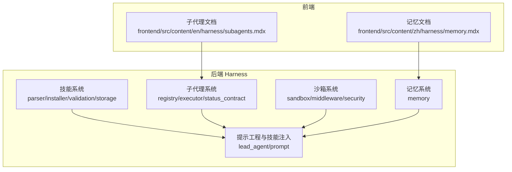
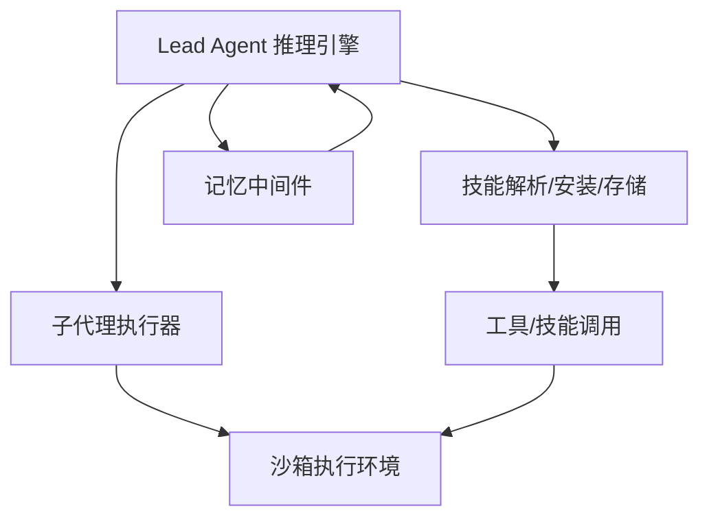
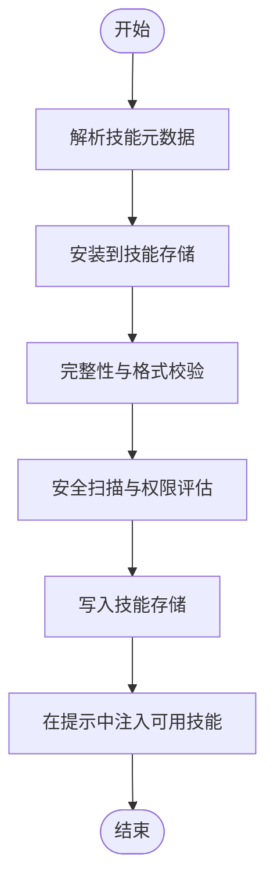
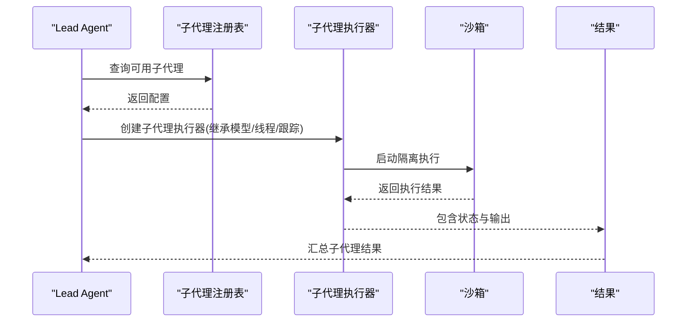
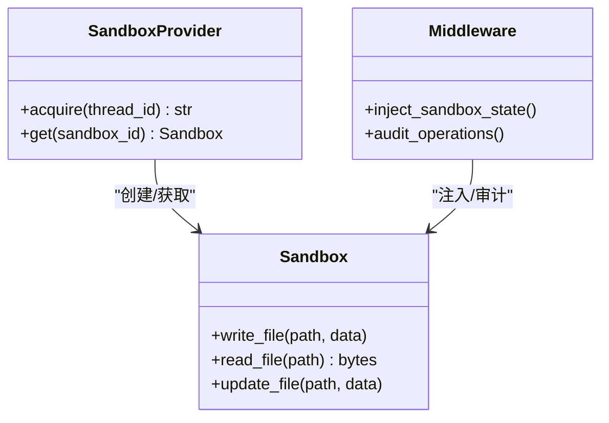
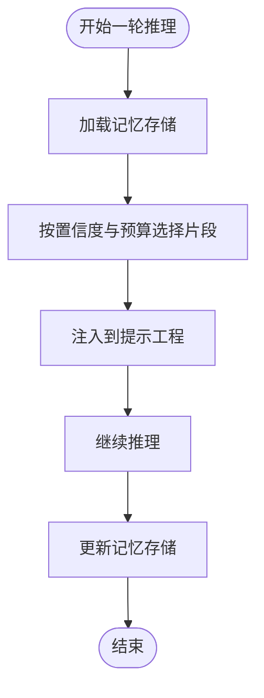
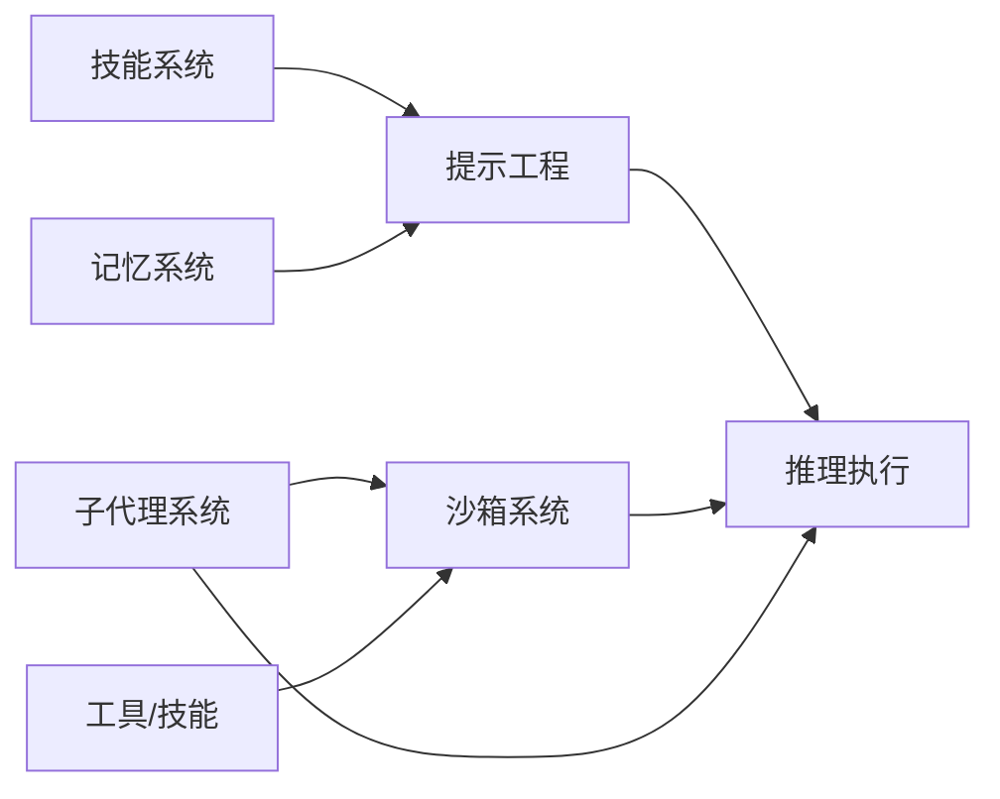

# 核心功能

<cite>
**本文引用的文件**
- [backend/packages/harness/deerflow/agents/lead_agent/prompt.py](file://backend/packages/harness/deerflow/agents/lead_agent/prompt.py)
- [backend/packages/harness/deerflow/subagents/executor.py](file://backend/packages/harness/deerflow/subagents/executor.py)
- [backend/packages/harness/deerflow/subagents/__init__.py](file://backend/packages/harness/deerflow/subagents/__init__.py)
- [backend/packages/harness/deerflow/sandbox/sandbox.py](file://backend/packages/harness/deerflow/sandbox/sandbox.py)
- [backend/packages/harness/deerflow/sandbox/middleware.py](file://backend/packages/harness/deerflow/sandbox/middleware.py)
- [backend/packages/harness/deerflow/sandbox/security.py](file://backend/packages/harness/deerflow/sandbox/security.py)
- [backend/packages/harness/deerflow/skills/parser.py](file://backend/packages/harness/deerflow/skills/parser.py)
- [backend/packages/harness/deerflow/skills/installer.py](file://backend/packages/harness/deerflow/skills/installer.py)
- [backend/packages/harness/deerflow/skills/validation.py](file://backend/packages/harness/deerflow/skills/validation.py)
- [backend/packages/harness/deerflow/skills/storage/__init__.py](file://backend/packages/harness/deerflow/skills/storage/__init__.py)
- [backend/packages/harness/deerflow/memory/__init__.py](file://backend/packages/harness/deerflow/memory/__init__.py)
- [backend/docs/MEMORY_IMPROVEMENTS.md](file://backend/docs/MEMORY_IMPROVEMENTS.md)
- [backend/docs/MEMORY_SETTINGS_REVIEW.md](file://backend/docs/MEMORY_SETTINGS_REVIEW.md)
- [frontend/src/content/en/harness/subagents.mdx](file://frontend/src/content/en/harness/subagents.mdx)
- [frontend/src/content/zh/harness/memory.mdx](file://frontend/src/content/zh/harness/memory.mdx)
- [backend/tests/test_local_sandbox_virtual_path_contract.py](file://backend/tests/test_local_sandbox_virtual_path_contract.py)
- [backend/tests/test_memory_prompt_injection.py](file://backend/tests/test_memory_prompt_injection.py)
</cite>

## 目录
1. [引言](#引言)
2. [项目结构](#项目结构)
3. [核心组件](#核心组件)
4. [架构总览](#架构总览)
5. [详细组件分析](#详细组件分析)
6. [依赖分析](#依赖分析)
7. [性能考虑](#性能考虑)
8. [故障排除指南](#故障排除指南)
9. [结论](#结论)
10. [附录](#附录)

## 引言
本文件系统性梳理 DeerFlow 的四大核心能力：技能与工具系统、子代理机制、沙箱与文件系统、长期记忆管理。文档面向初学者提供概念解释，同时为高级用户提供深入的技术细节与最佳实践，帮助理解各能力的设计原理、实现细节与集成关系。

## 项目结构
DeerFlow 的核心能力主要集中在后端 harness 包中，前端提供文档与交互入口。核心模块包括：
- 技能与工具系统：技能解析、安装、权限与安全扫描、存储与加载
- 子代理机制：子代理注册、执行器、状态契约与并发控制
- 沙箱与文件系统：本地/远程沙箱提供者、中间件、安全策略与路径隔离
- 长期记忆管理：记忆注入、存储与改进验证

**图表来源**
- [backend/packages/harness/deerflow/skills/parser.py](file://backend/packages/harness/deerflow/skills/parser.py)
- [backend/packages/harness/deerflow/subagents/executor.py](file://backend/packages/harness/deerflow/subagents/executor.py)
- [backend/packages/harness/deerflow/sandbox/sandbox.py](file://backend/packages/harness/deerflow/sandbox/sandbox.py)
- [backend/packages/harness/deerflow/memory/__init__.py](file://backend/packages/harness/deerflow/memory/__init__.py)
- [backend/packages/harness/deerflow/agents/lead_agent/prompt.py](file://backend/packages/harness/deerflow/agents/lead_agent/prompt.py)
- [frontend/src/content/en/harness/subagents.mdx](file://frontend/src/content/en/harness/subagents.mdx)
- [frontend/src/content/zh/harness/memory.mdx](file://frontend/src/content/zh/harness/memory.mdx)

**章节来源**
- [backend/packages/harness/deerflow/skills/parser.py](file://backend/packages/harness/deerflow/skills/parser.py)
- [backend/packages/harness/deerflow/subagents/executor.py](file://backend/packages/harness/deerflow/subagents/executor.py)
- [backend/packages/harness/deerflow/sandbox/sandbox.py](file://backend/packages/harness/deerflow/sandbox/sandbox.py)
- [backend/packages/harness/deerflow/memory/__init__.py](file://backend/packages/harness/deerflow/memory/__init__.py)
- [backend/packages/harness/deerflow/agents/lead_agent/prompt.py](file://backend/packages/harness/deerflow/agents/lead_agent/prompt.py)
- [frontend/src/content/en/harness/subagents.mdx](file://frontend/src/content/en/harness/subagents.mdx)
- [frontend/src/content/zh/harness/memory.mdx](file://frontend/src/content/zh/harness/memory.mdx)

## 核心组件
- 技能与工具系统：负责技能元数据解析、安装部署、权限校验、安全扫描与存储；支持按需加载与引用资源，遵循“渐进式加载”模式
- 子代理机制：在长流程中进行任务拆分与并行执行，提供上下文隔离与并发控制，内置通用子代理类型
- 沙箱与文件系统：提供执行环境隔离，确保文件操作的线程/会话隔离与路径虚拟化映射
- 长期记忆管理：在多轮对话中持久化结构化事实与上下文摘要，通过中间件在推理前注入提示

**章节来源**
- [backend/packages/harness/deerflow/skills/parser.py](file://backend/packages/harness/deerflow/skills/parser.py)
- [backend/packages/harness/deerflow/skills/installer.py](file://backend/packages/harness/deerflow/skills/installer.py)
- [backend/packages/harness/deerflow/skills/validation.py](file://backend/packages/harness/deerflow/skills/validation.py)
- [backend/packages/harness/deerflow/skills/storage/__init__.py](file://backend/packages/harness/deerflow/skills/storage/__init__.py)
- [backend/packages/harness/deerflow/subagents/executor.py](file://backend/packages/harness/deerflow/subagents/executor.py)
- [backend/packages/harness/deerflow/sandbox/sandbox.py](file://backend/packages/harness/deerflow/sandbox/sandbox.py)
- [backend/packages/harness/deerflow/sandbox/middleware.py](file://backend/packages/harness/deerflow/sandbox/middleware.py)
- [backend/packages/harness/deerflow/sandbox/security.py](file://backend/packages/harness/deerflow/sandbox/security.py)
- [backend/packages/harness/deerflow/memory/__init__.py](file://backend/packages/harness/deerflow/memory/__init__.py)
- [backend/packages/harness/deerflow/agents/lead_agent/prompt.py](file://backend/packages/harness/deerflow/agents/lead_agent/prompt.py)

## 架构总览
下图展示核心能力在推理链中的交互关系：Lead Agent 通过提示工程整合技能、子代理与记忆；沙箱提供执行隔离；工具与技能通过权限与安全策略受控调用。

**图表来源**
- [backend/packages/harness/deerflow/agents/lead_agent/prompt.py](file://backend/packages/harness/deerflow/agents/lead_agent/prompt.py)
- [backend/packages/harness/deerflow/subagents/executor.py](file://backend/packages/harness/deerflow/subagents/executor.py)
- [backend/packages/harness/deerflow/sandbox/sandbox.py](file://backend/packages/harness/deerflow/sandbox/sandbox.py)
- [backend/packages/harness/deerflow/memory/__init__.py](file://backend/packages/harness/deerflow/memory/__init__.py)

## 详细组件分析

### 技能与工具系统
- 设计原理
  - 技能以“可复用工作流”的形式存在，包含最佳实践、框架与外部资源引用
  - 渐进式加载：先读取技能主文件，再按需加载引用资源，避免一次性加载造成开销
- 实现要点
  - 解析：从技能目录读取元数据与脚本模板，生成技能签名与可用技能列表
  - 安装：将技能部署到受控存储根目录，支持自定义与公共技能源
  - 校验：对技能元数据、脚本与模板进行格式与完整性校验
  - 安全：扫描潜在风险，限制危险命令与路径写入
  - 存储：统一的技能存储接口，支持启用/禁用与版本化管理
- 使用模式
  - 前端通过查询与变更技能列表，后端在提示中注入可用技能清单，并在执行阶段按需调用工具

**图表来源**
- [backend/packages/harness/deerflow/skills/parser.py](file://backend/packages/harness/deerflow/skills/parser.py)
- [backend/packages/harness/deerflow/skills/installer.py](file://backend/packages/harness/deerflow/skills/installer.py)
- [backend/packages/harness/deerflow/skills/validation.py](file://backend/packages/harness/deerflow/skills/validation.py)
- [backend/packages/harness/deerflow/skills/storage/__init__.py](file://backend/packages/harness/deerflow/skills/storage/__init__.py)

**章节来源**
- [backend/packages/harness/deerflow/skills/parser.py](file://backend/packages/harness/deerflow/skills/parser.py)
- [backend/packages/harness/deerflow/skills/installer.py](file://backend/packages/harness/deerflow/skills/installer.py)
- [backend/packages/harness/deerflow/skills/validation.py](file://backend/packages/harness/deerflow/skills/validation.py)
- [backend/packages/harness/deerflow/skills/storage/__init__.py](file://backend/packages/harness/deerflow/skills/storage/__init__.py)
- [backend/packages/harness/deerflow/agents/lead_agent/prompt.py](file://backend/packages/harness/deerflow/agents/lead_agent/prompt.py)

### 子代理机制
- 设计原理
  - 当任务过于宽泛或可并行时，Lead Agent 将子任务委派给子代理，实现上下文隔离与并行处理
  - 内置通用子代理类型，支持模型继承、线程数据与跟踪 ID 继承
- 实现要点
  - 注册表：列出可用子代理及其配置
  - 执行器：封装子代理生命周期，过滤可用工具，继承父代理模型/线程/跟踪信息
  - 状态契约：定义子代理结果与状态流转，便于可观测与回溯
- 使用模式
  - 前端文档说明子代理的作用与内置类型；后端在推理过程中根据任务特征选择并启动子代理

**图表来源**
- [backend/packages/harness/deerflow/subagents/executor.py](file://backend/packages/harness/deerflow/subagents/executor.py)
- [backend/packages/harness/deerflow/subagents/__init__.py](file://backend/packages/harness/deerflow/subagents/__init__.py)
- [frontend/src/content/en/harness/subagents.mdx](file://frontend/src/content/en/harness/subagents.mdx)

**章节来源**
- [backend/packages/harness/deerflow/subagents/executor.py](file://backend/packages/harness/deerflow/subagents/executor.py)
- [backend/packages/harness/deerflow/subagents/__init__.py](file://backend/packages/harness/deerflow/subagents/__init__.py)
- [frontend/src/content/en/harness/subagents.mdx](file://frontend/src/content/en/harness/subagents.mdx)

### 沙箱与文件系统
- 设计原理
  - 提供执行环境隔离，确保文件操作在线程/会话间不泄漏；支持虚拟路径到宿主路径的映射
- 实现要点
  - 提供者：抽象本地/远程沙箱后端，统一 acquire/get 接口
  - 中间件：在请求处理链路中注入沙箱状态，保障工具调用的安全性
  - 安全：限制危险操作，校验路径合法性，防止越权访问
  - 路径隔离：同一虚拟路径在不同线程解析到不同宿主路径，避免交叉污染
- 使用模式
  - 工具调用前通过中间件注入沙箱状态；子代理与技能执行均在隔离环境中进行

**图表来源**
- [backend/packages/harness/deerflow/sandbox/sandbox.py](file://backend/packages/harness/deerflow/sandbox/sandbox.py)
- [backend/packages/harness/deerflow/sandbox/middleware.py](file://backend/packages/harness/deerflow/sandbox/middleware.py)
- [backend/packages/harness/deerflow/sandbox/security.py](file://backend/packages/harness/deerflow/sandbox/security.py)

**章节来源**
- [backend/packages/harness/deerflow/sandbox/sandbox.py](file://backend/packages/harness/deerflow/sandbox/sandbox.py)
- [backend/packages/harness/deerflow/sandbox/middleware.py](file://backend/packages/harness/deerflow/sandbox/middleware.py)
- [backend/packages/harness/deerflow/sandbox/security.py](file://backend/packages/harness/deerflow/sandbox/security.py)
- [backend/tests/test_local_sandbox_virtual_path_contract.py](file://backend/tests/test_local_sandbox_virtual_path_contract.py)

### 长期记忆管理
- 设计原理
  - 记忆是跨会话持久化的结构化事实与上下文摘要，用于在后续对话中影响 Agent 行为
  - 通过中间件在推理前将记忆注入提示，提升上下文相关性与一致性
- 实现要点
  - 存储：结构化事实、工作上下文、个人上下文、近期关注与历史
  - 注入：在每轮推理前，按置信度与预算选择性注入记忆片段
  - 改进：持续优化记忆检索与注入策略，确保回归覆盖与质量
- 使用模式
  - 前端文档说明记忆的内容与工作原理；后端测试覆盖记忆注入的正确性与预算限制

**图表来源**
- [backend/packages/harness/deerflow/memory/__init__.py](file://backend/packages/harness/deerflow/memory/__init__.py)
- [backend/docs/MEMORY_IMPROVEMENTS.md](file://backend/docs/MEMORY_IMPROVEMENTS.md)
- [backend/docs/MEMORY_SETTINGS_REVIEW.md](file://backend/docs/MEMORY_SETTINGS_REVIEW.md)
- [frontend/src/content/zh/harness/memory.mdx](file://frontend/src/content/zh/harness/memory.mdx)

**章节来源**
- [backend/packages/harness/deerflow/memory/__init__.py](file://backend/packages/harness/deerflow/memory/__init__.py)
- [backend/docs/MEMORY_IMPROVEMENTS.md](file://backend/docs/MEMORY_IMPROVEMENTS.md)
- [backend/docs/MEMORY_SETTINGS_REVIEW.md](file://backend/docs/MEMORY_SETTINGS_REVIEW.md)
- [frontend/src/content/zh/harness/memory.mdx](file://frontend/src/content/zh/harness/memory.mdx)
- [backend/tests/test_memory_prompt_injection.py](file://backend/tests/test_memory_prompt_injection.py)

## 依赖分析
- 技能系统依赖提示工程模块，将可用技能注入到推理提示中
- 子代理执行器依赖沙箱提供者与工具集合，确保执行隔离与工具可用性
- 沙箱中间件贯穿工具调用链，保证所有文件操作在受控环境中进行
- 记忆中间件在推理前注入结构化事实，提升上下文质量

**图表来源**
- [backend/packages/harness/deerflow/agents/lead_agent/prompt.py](file://backend/packages/harness/deerflow/agents/lead_agent/prompt.py)
- [backend/packages/harness/deerflow/subagents/executor.py](file://backend/packages/harness/deerflow/subagents/executor.py)
- [backend/packages/harness/deerflow/sandbox/sandbox.py](file://backend/packages/harness/deerflow/sandbox/sandbox.py)
- [backend/packages/harness/deerflow/memory/__init__.py](file://backend/packages/harness/deerflow/memory/__init__.py)

**章节来源**
- [backend/packages/harness/deerflow/agents/lead_agent/prompt.py](file://backend/packages/harness/deerflow/agents/lead_agent/prompt.py)
- [backend/packages/harness/deerflow/subagents/executor.py](file://backend/packages/harness/deerflow/subagents/executor.py)
- [backend/packages/harness/deerflow/sandbox/sandbox.py](file://backend/packages/harness/deerflow/sandbox/sandbox.py)
- [backend/packages/harness/deerflow/memory/__init__.py](file://backend/packages/harness/deerflow/memory/__init__.py)

## 性能考虑
- 技能加载采用“渐进式加载”，仅在需要时读取引用资源，降低初始开销
- 子代理并发执行提升长流程吞吐，但需注意工具与内存预算
- 沙箱路径隔离与中间件审计可能带来额外开销，建议在高负载场景启用缓存与批量操作
- 记忆注入应结合预算限制，避免过度上下文导致延迟增加

## 故障排除指南
- 沙箱路径问题
  - 症状：同一虚拟路径在不同线程可见或不可见
  - 处理：确认虚拟路径到宿主路径映射是否正确，检查 per-thread 隔离逻辑
  - 参考测试：[backend/tests/test_local_sandbox_virtual_path_contract.py](file://backend/tests/test_local_sandbox_virtual_path_contract.py)
- 记忆注入异常
  - 症状：记忆片段缺失或顺序错误
  - 处理：验证记忆存储与注入策略，确保回归测试覆盖
  - 参考测试：[backend/tests/test_memory_prompt_injection.py](file://backend/tests/test_memory_prompt_injection.py)
- 子代理执行失败
  - 症状：子代理状态异常或结果丢失
  - 处理：检查状态契约与执行器配置，确认模型/线程/跟踪继承是否正确
  - 参考文档：[frontend/src/content/en/harness/subagents.mdx](file://frontend/src/content/en/harness/subagents.mdx)

**章节来源**
- [backend/tests/test_local_sandbox_virtual_path_contract.py](file://backend/tests/test_local_sandbox_virtual_path_contract.py)
- [backend/tests/test_memory_prompt_injection.py](file://backend/tests/test_memory_prompt_injection.py)
- [frontend/src/content/en/harness/subagents.mdx](file://frontend/src/content/en/harness/subagents.mdx)

## 结论
DeerFlow 的核心能力围绕“可复用工作流（技能）、可扩展协作（子代理）、安全执行（沙箱）、长期上下文（记忆）”构建。通过渐进式加载、上下文隔离与并行执行、路径虚拟化与中间件审计、以及结构化记忆注入，系统在复杂任务中实现了可控、可扩展与可维护的智能体协作模式。建议在生产环境中结合预算与并发策略，持续优化技能与记忆的质量与性能。

## 附录
- 最佳实践
  - 技能：优先使用公共技能，自定义技能遵循最小权限与安全扫描
  - 子代理：长流程优先拆分并行子任务，合理设置超时与令牌预算
  - 沙箱：严格限制写入路径与命令，启用中间件审计
  - 记忆：定期清理过期片段，按置信度与预算注入，避免上下文污染