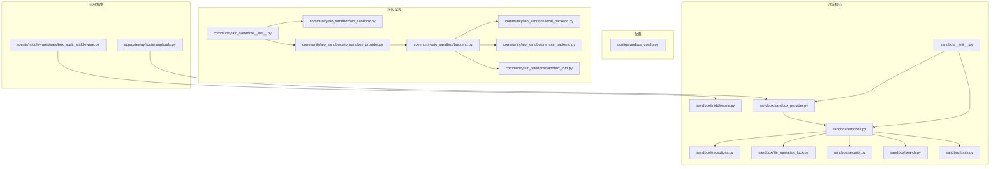
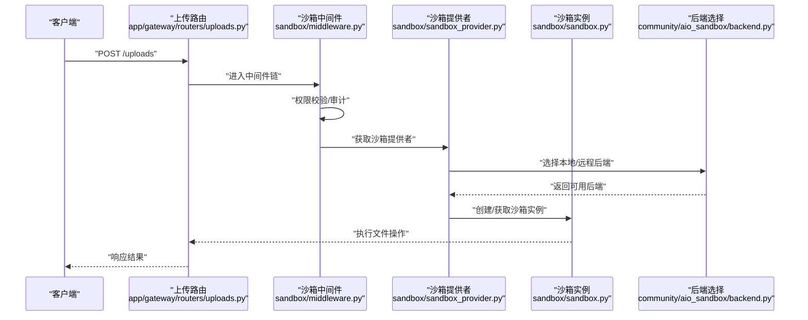
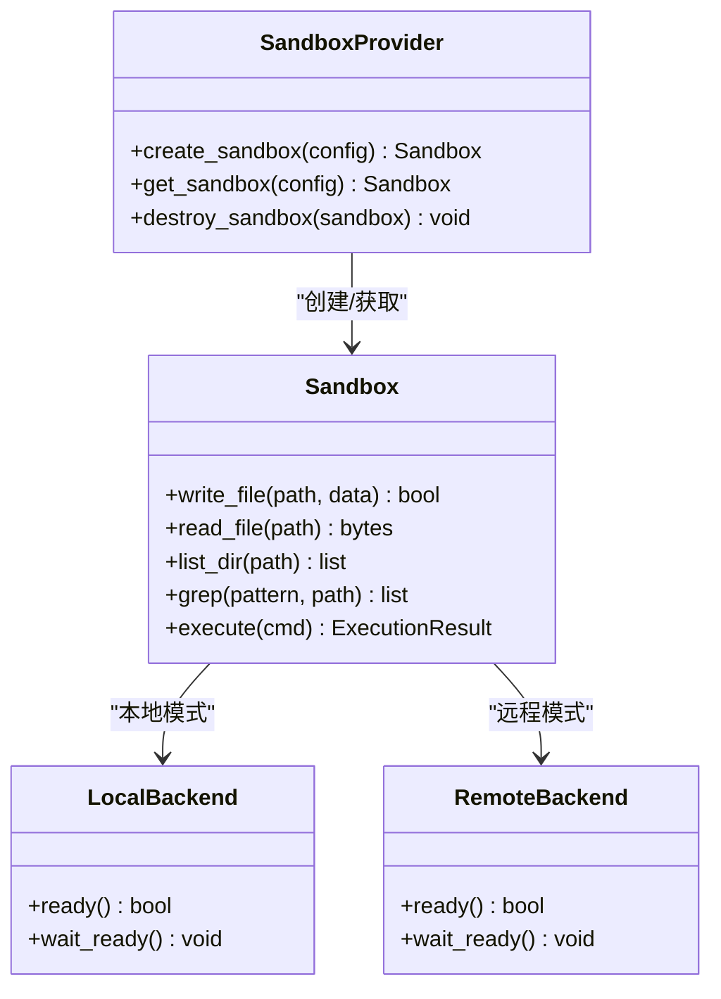
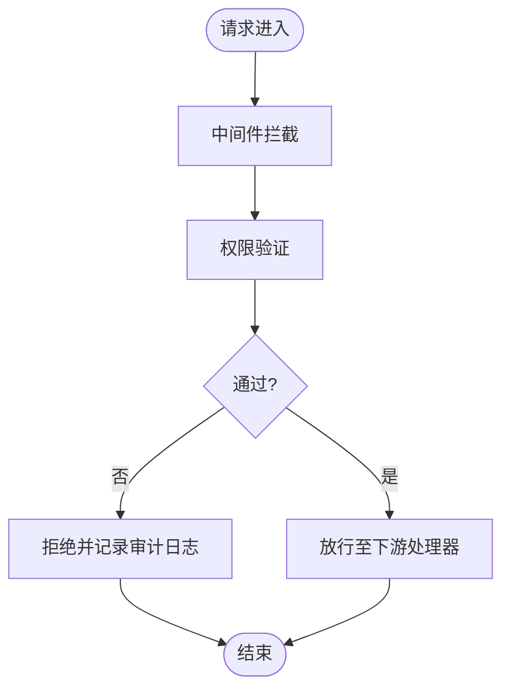
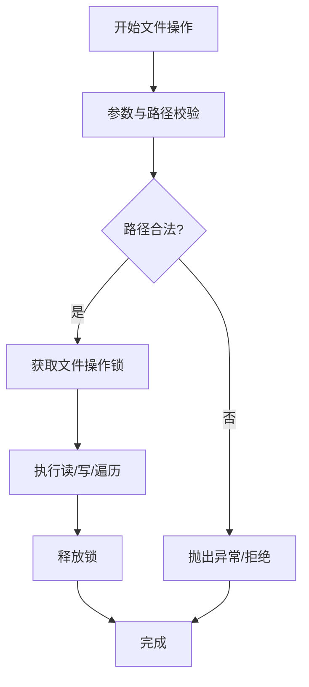
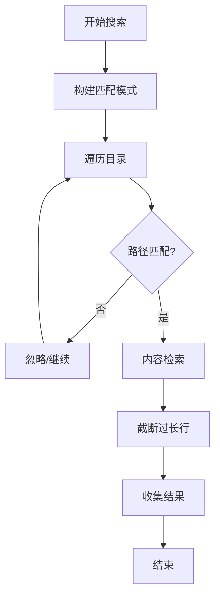
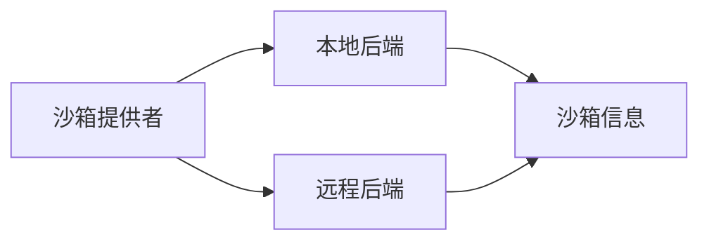
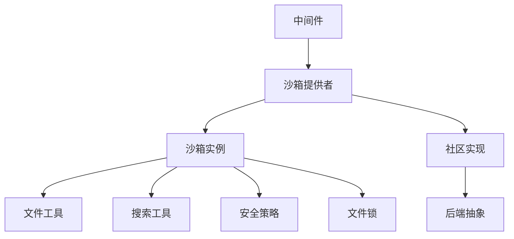

# 沙箱与文件系统

<cite>
**本文引用的文件**
- [sandbox/__init__.py](file://backend/packages/harness/deerflow/sandbox/__init__.py)
- [sandbox/sandbox.py](file://backend/packages/harness/deerflow/sandbox/sandbox.py)
- [sandbox/sandbox_provider.py](file://backend/packages/harness/deerflow/sandbox/sandbox_provider.py)
- [sandbox/middleware.py](file://backend/packages/harness/deerflow/sandbox/middleware.py)
- [sandbox/search.py](file://backend/packages/harness/deerflow/sandbox/search.py)
- [sandbox/security.py](file://backend/packages/harness/deerflow/sandbox/security.py)
- [sandbox/file_operation_lock.py](file://backend/packages/harness/deerflow/sandbox/file_operation_lock.py)
- [sandbox/tools.py](file://backend/packages/harness/deerflow/sandbox/tools.py)
- [sandbox/exceptions.py](file://backend/packages/harness/deerflow/sandbox/exceptions.py)
- [config/sandbox_config.py](file://backend/packages/harness/deerflow/config/sandbox_config.py)
- [community/aio_sandbox/__init__.py](file://backend/packages/harness/deerflow/community/aio_sandbox/__init__.py)
- [community/aio_sandbox/aio_sandbox.py](file://backend/packages/harness/deerflow/community/aio_sandbox/aio_sandbox.py)
- [community/aio_sandbox/aio_sandbox_provider.py](file://backend/packages/harness/deerflow/community/aio_sandbox/aio_sandbox_provider.py)
- [community/aio_sandbox/backend.py](file://backend/packages/harness/deerflow/community/aio_sandbox/backend.py)
- [community/aio_sandbox/local_backend.py](file://backend/packages/harness/deerflow/community/aio_sandbox/local_backend.py)
- [community/aio_sandbox/remote_backend.py](file://backend/packages/harness/deerflow/community/aio_sandbox/remote_backend.py)
- [community/aio_sandbox/sandbox_info.py](file://backend/packages/harness/deerflow/community/aio_sandbox/sandbox_info.py)
- [agents/middlewares/sandbox_audit_middleware.py](file://backend/packages/harness/deerflow/agents/middlewares/sandbox_audit_middleware.py)
- [app/gateway/routers/uploads.py](file://backend/app/gateway/routers/uploads.py)
- [tests/test_aio_sandbox.py](file://backend/tests/test_aio_sandbox.py)
- [tests/test_aio_sandbox_provider.py](file://backend/tests/test_aio_sandbox_provider.py)
- [tests/test_sandbox_middleware.py](file://backend/tests/test_sandbox_middleware.py)
- [tests/test_sandbox_search_tools.py](file://backend/tests/test_sandbox_search_tools.py)
- [tests/test_sandbox_tools_security.py](file://backend/tests/test_sandbox_tools_security.py)
- [docs/SANDBOX_MEMORY_PROFILING.md](file://backend/docs/SANDBOX_MEMORY_PROFILING.md)
- [docs/middleware-execution-flow.md](file://backend/docs/middleware-execution-flow.md)
</cite>

## 目录
1. [简介](#简介)
2. [项目结构](#项目结构)
3. [核心组件](#核心组件)
4. [架构总览](#架构总览)
5. [详细组件分析](#详细组件分析)
6. [依赖关系分析](#依赖关系分析)
7. [性能考虑](#性能考虑)
8. [故障排查指南](#故障排查指南)
9. [结论](#结论)
10. [附录](#附录)

## 简介
本文件围绕沙箱与文件系统的实现进行全面技术文档化，重点覆盖以下方面：
- 沙箱安全隔离机制：进程隔离、网络限制、文件系统保护等
- 沙箱提供者实现：本地沙箱与远程沙箱的差异、资源管理、状态同步
- 沙箱中间件：请求拦截、权限验证、资源审计
- 文件操作工具：文件读写、目录遍历、权限控制
- 沙箱搜索功能：文件查找、内容检索、索引管理
- 沙箱配置与安全策略：权限设置、资源限制、监控告警
- 沙箱与代理系统的集成与最佳实践

## 项目结构
沙箱相关代码主要位于后端包 deerflow 的 sandbox 子模块，并配套 aio_sandbox 社区实现与测试用例。整体组织采用按功能域划分（sandbox、community/aio_sandbox、config）与按层次划分（middleware、tools、security）相结合的方式。

图表来源
- [sandbox/__init__.py:1-8](file://backend/packages/harness/deerflow/sandbox/__init__.py#L1-L8)
- [sandbox/sandbox_provider.py](file://backend/packages/harness/deerflow/sandbox/sandbox_provider.py)
- [sandbox/sandbox.py](file://backend/packages/harness/deerflow/sandbox/sandbox.py)
- [community/aio_sandbox/__init__.py:0-5](file://backend/packages/harness/deerflow/community/aio_sandbox/__init__.py#L0-L5)
- [community/aio_sandbox/aio_sandbox_provider.py:32-39](file://backend/packages/harness/deerflow/community/aio_sandbox/aio_sandbox_provider.py#L32-L39)
- [community/aio_sandbox/backend.py:12-42](file://backend/packages/harness/deerflow/community/aio_sandbox/backend.py#L12-L42)
- [agents/middlewares/sandbox_audit_middleware.py](file://backend/packages/harness/deerflow/agents/middlewares/sandbox_audit_middleware.py)
- [app/gateway/routers/uploads.py](file://backend/app/gateway/routers/uploads.py#L14)

章节来源
- [sandbox/__init__.py:1-8](file://backend/packages/harness/deerflow/sandbox/__init__.py#L1-L8)
- [config/sandbox_config.py](file://backend/packages/harness/deerflow/config/sandbox_config.py)

## 核心组件
- 沙箱提供者与实例：负责创建、管理与销毁沙箱实例，支持本地与远程后端，提供统一接口以供上层调用。
- 沙箱中间件：在请求处理链中进行拦截、鉴权与审计，确保对沙箱操作的合规性与可追溯性。
- 文件操作工具：封装文件读写、目录遍历、权限控制等能力，保障文件系统访问的安全与一致性。
- 搜索功能：提供基于路径匹配与内容检索的能力，支持忽略规则与结果截断。
- 安全与锁：提供安全策略与文件操作并发控制，防止竞态与越权访问。
- 配置：集中管理沙箱运行参数，如资源限制、路径白名单、超时等。

章节来源
- [sandbox/sandbox_provider.py](file://backend/packages/harness/deerflow/sandbox/sandbox_provider.py)
- [sandbox/sandbox.py](file://backend/packages/harness/deerflow/sandbox/sandbox.py)
- [sandbox/middleware.py](file://backend/packages/harness/deerflow/sandbox/middleware.py)
- [sandbox/tools.py](file://backend/packages/harness/deerflow/sandbox/tools.py)
- [sandbox/search.py](file://backend/packages/harness/deerflow/sandbox/search.py)
- [sandbox/security.py](file://backend/packages/harness/deerflow/sandbox/security.py)
- [sandbox/file_operation_lock.py](file://backend/packages/harness/deerflow/sandbox/file_operation_lock.py)
- [config/sandbox_config.py](file://backend/packages/harness/deerflow/config/sandbox_config.py)

## 架构总览
下图展示了从应用路由到沙箱提供者与具体后端的调用链路，以及中间件在其中的拦截位置。

图表来源
- [app/gateway/routers/uploads.py](file://backend/app/gateway/routers/uploads.py#L14)
- [sandbox/middleware.py](file://backend/packages/harness/deerflow/sandbox/middleware.py)
- [sandbox/sandbox_provider.py](file://backend/packages/harness/deerflow/sandbox/sandbox_provider.py)
- [community/aio_sandbox/backend.py:12-42](file://backend/packages/harness/deerflow/community/aio_sandbox/backend.py#L12-L42)

## 详细组件分析

### 沙箱提供者与实例
- 职责与接口
  - 提供统一的沙箱生命周期管理：创建、初始化、执行、销毁
  - 支持本地与远程两种后端模式，通过后端抽象屏蔽差异
  - 对外暴露一致的文件操作与搜索接口
- 关键点
  - 通过工厂函数或类方法对外导出，便于上层直接调用
  - 在提供者内部协调后端选择与状态同步

图表来源
- [sandbox/sandbox_provider.py](file://backend/packages/harness/deerflow/sandbox/sandbox_provider.py)
- [sandbox/sandbox.py](file://backend/packages/harness/deerflow/sandbox/sandbox.py)
- [community/aio_sandbox/local_backend.py](file://backend/packages/harness/deerflow/community/aio_sandbox/local_backend.py)
- [community/aio_sandbox/remote_backend.py](file://backend/packages/harness/deerflow/community/aio_sandbox/remote_backend.py)

章节来源
- [sandbox/sandbox_provider.py](file://backend/packages/harness/deerflow/sandbox/sandbox_provider.py)
- [sandbox/sandbox.py](file://backend/packages/harness/deerflow/sandbox/sandbox.py)

### 沙箱中间件
- 作用
  - 请求拦截：在进入业务逻辑前对请求进行拦截
  - 权限验证：校验调用方是否具备执行沙箱操作的权限
  - 资源审计：记录操作行为，便于追踪与合规
- 执行流程
  - 中间件在网关层生效，结合认证与授权模块共同完成安全控制
  - 可与审计中间件配合，形成完整的安全闭环

图表来源
- [sandbox/middleware.py](file://backend/packages/harness/deerflow/sandbox/middleware.py)
- [agents/middlewares/sandbox_audit_middleware.py](file://backend/packages/harness/deerflow/agents/middlewares/sandbox_audit_middleware.py)

章节来源
- [sandbox/middleware.py](file://backend/packages/harness/deerflow/sandbox/middleware.py)
- [agents/middlewares/sandbox_audit_middleware.py](file://backend/packages/harness/deerflow/agents/middlewares/sandbox_audit_middleware.py)

### 文件操作工具
- 功能范围
  - 文件读写：提供安全的读写接口，避免越界访问
  - 目录遍历：支持递归与过滤，限制访问范围
  - 权限控制：基于安全策略与用户上下文进行权限判定
- 并发与一致性
  - 通过文件操作锁保证并发场景下的数据一致性
  - 结合安全策略与路径白名单，降低越权风险

图表来源
- [sandbox/tools.py](file://backend/packages/harness/deerflow/sandbox/tools.py)
- [sandbox/file_operation_lock.py](file://backend/packages/harness/deerflow/sandbox/file_operation_lock.py)
- [sandbox/security.py](file://backend/packages/harness/deerflow/sandbox/security.py)

章节来源
- [sandbox/tools.py](file://backend/packages/harness/deerflow/sandbox/tools.py)
- [sandbox/file_operation_lock.py](file://backend/packages/harness/deerflow/sandbox/file_operation_lock.py)
- [sandbox/security.py](file://backend/packages/harness/deerflow/sandbox/security.py)

### 沙箱搜索功能
- 能力概述
  - 文件查找：基于路径匹配与忽略规则
  - 内容检索：支持正则/关键词匹配，结果可截断
  - 索引管理：通过索引提升检索效率（由具体实现决定）
- 实现要点
  - 提供匹配函数与过滤器，支持大小写敏感/不敏感与通配符
  - 截断长行，避免输出膨胀
  - 忽略规则用于排除临时文件、隐藏文件等

图表来源
- [sandbox/search.py](file://backend/packages/harness/deerflow/sandbox/search.py)

章节来源
- [sandbox/search.py](file://backend/packages/harness/deerflow/sandbox/search.py)

### 配置与安全策略
- 配置项
  - 资源限制：CPU/内存/磁盘配额
  - 路径白名单/黑名单：限定可访问路径范围
  - 超时与重试：控制执行时间与失败重试策略
  - 日志与审计：开启详细审计与调试日志
- 安全策略
  - 进程隔离：限制可执行命令与环境变量
  - 网络限制：禁用或仅允许特定出站连接
  - 文件系统保护：只读挂载、受限写入、沙箱根目录约束

章节来源
- [config/sandbox_config.py](file://backend/packages/harness/deerflow/config/sandbox_config.py)
- [sandbox/security.py](file://backend/packages/harness/deerflow/sandbox/security.py)

### 本地与远程沙箱差异
- 后端抽象
  - 本地后端：直接在宿主机上运行，延迟低但隔离性有限
  - 远程后端：通过网络访问远端沙箱服务，隔离性强但存在网络开销
- 状态同步
  - 提供者负责在不同后端之间保持状态一致性
  - 通过信息对象（如沙箱信息）传递后端元数据

图表来源
- [community/aio_sandbox/aio_sandbox_provider.py:32-39](file://backend/packages/harness/deerflow/community/aio_sandbox/aio_sandbox_provider.py#L32-L39)
- [community/aio_sandbox/backend.py:12-42](file://backend/packages/harness/deerflow/community/aio_sandbox/backend.py#L12-L42)
- [community/aio_sandbox/sandbox_info.py](file://backend/packages/harness/deerflow/community/aio_sandbox/sandbox_info.py)

章节来源
- [community/aio_sandbox/aio_sandbox_provider.py:32-39](file://backend/packages/harness/deerflow/community/aio_sandbox/aio_sandbox_provider.py#L32-L39)
- [community/aio_sandbox/backend.py:12-42](file://backend/packages/harness/deerflow/community/aio_sandbox/backend.py#L12-L42)
- [community/aio_sandbox/local_backend.py](file://backend/packages/harness/deerflow/community/aio_sandbox/local_backend.py)
- [community/aio_sandbox/remote_backend.py](file://backend/packages/harness/deerflow/community/aio_sandbox/remote_backend.py)

### 与代理系统的集成
- 集成方式
  - 通过沙箱提供者作为统一入口，代理系统只需关注权限与调度
  - 在网关层接入中间件，确保所有请求均经过安全检查
- 最佳实践
  - 将沙箱操作纳入统一的错误处理与重试机制
  - 使用审计中间件记录关键操作，便于合规与溯源
  - 对上传等高风险操作使用严格的路径与内容校验

章节来源
- [app/gateway/routers/uploads.py](file://backend/app/gateway/routers/uploads.py#L14)
- [agents/middlewares/sandbox_audit_middleware.py](file://backend/packages/harness/deerflow/agents/middlewares/sandbox_audit_middleware.py)
- [sandbox/middleware.py](file://backend/packages/harness/deerflow/sandbox/middleware.py)

## 依赖关系分析
- 组件耦合
  - 提供者与实例：强耦合，提供者负责实例生命周期
  - 中间件与提供者：弱耦合，通过接口约定进行交互
  - 工具与安全：工具依赖安全策略与锁机制
- 外部依赖
  - 社区实现依赖外部沙箱客户端库
  - 后端抽象屏蔽具体实现差异

图表来源
- [sandbox/middleware.py](file://backend/packages/harness/deerflow/sandbox/middleware.py)
- [sandbox/sandbox_provider.py](file://backend/packages/harness/deerflow/sandbox/sandbox_provider.py)
- [sandbox/sandbox.py](file://backend/packages/harness/deerflow/sandbox/sandbox.py)
- [sandbox/tools.py](file://backend/packages/harness/deerflow/sandbox/tools.py)
- [sandbox/search.py](file://backend/packages/harness/deerflow/sandbox/search.py)
- [sandbox/security.py](file://backend/packages/harness/deerflow/sandbox/security.py)
- [sandbox/file_operation_lock.py](file://backend/packages/harness/deerflow/sandbox/file_operation_lock.py)
- [community/aio_sandbox/aio_sandbox_provider.py:32-39](file://backend/packages/harness/deerflow/community/aio_sandbox/aio_sandbox_provider.py#L32-L39)
- [community/aio_sandbox/backend.py:12-42](file://backend/packages/harness/deerflow/community/aio_sandbox/backend.py#L12-L42)

章节来源
- [sandbox/sandbox_provider.py](file://backend/packages/harness/deerflow/sandbox/sandbox_provider.py)
- [sandbox/sandbox.py](file://backend/packages/harness/deerflow/sandbox/sandbox.py)
- [community/aio_sandbox/aio_sandbox_provider.py:32-39](file://backend/packages/harness/deerflow/community/aio_sandbox/aio_sandbox_provider.py#L32-L39)

## 性能考虑
- 资源限制与配额：通过配置文件设置 CPU/内存/磁盘上限，避免资源滥用
- 检索优化：合理使用忽略规则与索引，减少无效扫描
- 并发控制：利用文件操作锁避免竞争条件，提高稳定性
- 内存与日志：参考内存剖析文档，识别热点与泄漏点，优化内存占用

章节来源
- [config/sandbox_config.py](file://backend/packages/harness/deerflow/config/sandbox_config.py)
- [sandbox/file_operation_lock.py](file://backend/packages/harness/deerflow/sandbox/file_operation_lock.py)
- [docs/SANDBOX_MEMORY_PROFILING.md](file://backend/docs/SANDBOX_MEMORY_PROFILING.md)

## 故障排查指南
- 常见问题
  - 沙箱不可用：检查后端就绪状态与等待逻辑
  - 权限不足：确认中间件与安全策略配置
  - 文件操作失败：核查路径合法性与锁竞争
- 排查步骤
  - 查看中间件执行顺序与审计日志
  - 校验提供者与后端状态
  - 使用测试用例定位问题边界

章节来源
- [tests/test_aio_sandbox.py](file://backend/tests/test_aio_sandbox.py)
- [tests/test_aio_sandbox_provider.py](file://backend/tests/test_aio_sandbox_provider.py)
- [tests/test_sandbox_middleware.py](file://backend/tests/test_sandbox_middleware.py)
- [sandbox/exceptions.py](file://backend/packages/harness/deerflow/sandbox/exceptions.py)

## 结论
该沙箱系统通过提供者抽象与中间件安全控制，实现了对文件系统与搜索能力的安全隔离与可控访问。本地与远程后端的统一接口设计，使得系统在隔离性与性能之间取得平衡。配合完善的配置与审计机制，能够满足生产环境下的安全与合规要求。

## 附录
- 测试参考
  - 沙箱与提供者：[test_aio_sandbox.py](file://backend/tests/test_aio_sandbox.py)，[test_aio_sandbox_provider.py](file://backend/tests/test_aio_sandbox_provider.py)
  - 中间件与安全：[test_sandbox_middleware.py](file://backend/tests/test_sandbox_middleware.py)，[test_sandbox_tools_security.py](file://backend/tests/test_sandbox_tools_security.py)
  - 搜索工具：[test_sandbox_search_tools.py](file://backend/tests/test_sandbox_search_tools.py)
- 文档参考
  - 中间件执行流程：[middleware-execution-flow.md](file://backend/docs/middleware-execution-flow.md)
  - 沙箱内存剖析：[SANDBOX_MEMORY_PROFILING.md](file://backend/docs/SANDBOX_MEMORY_PROFILING.md)