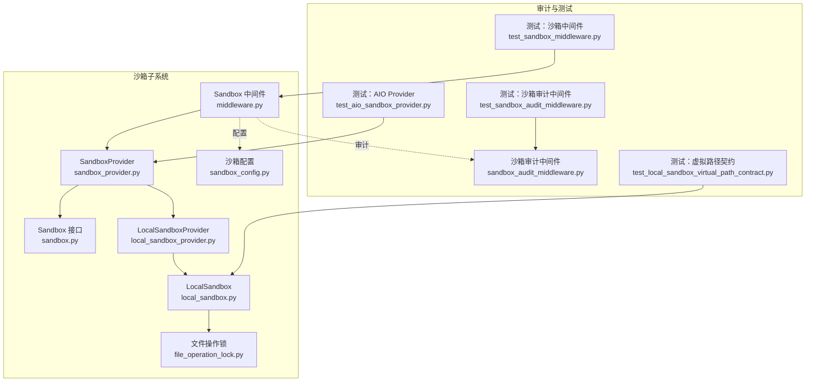
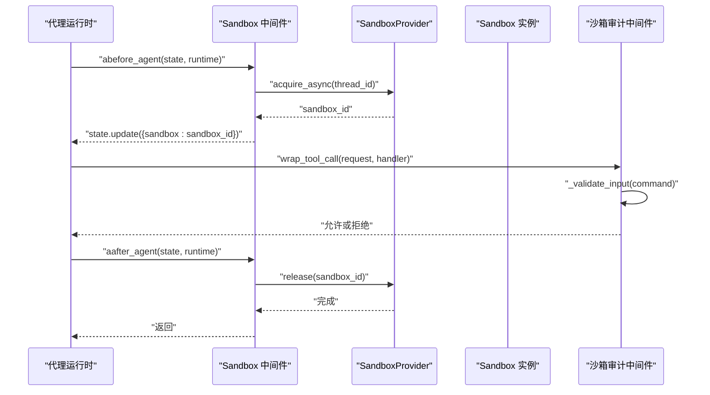
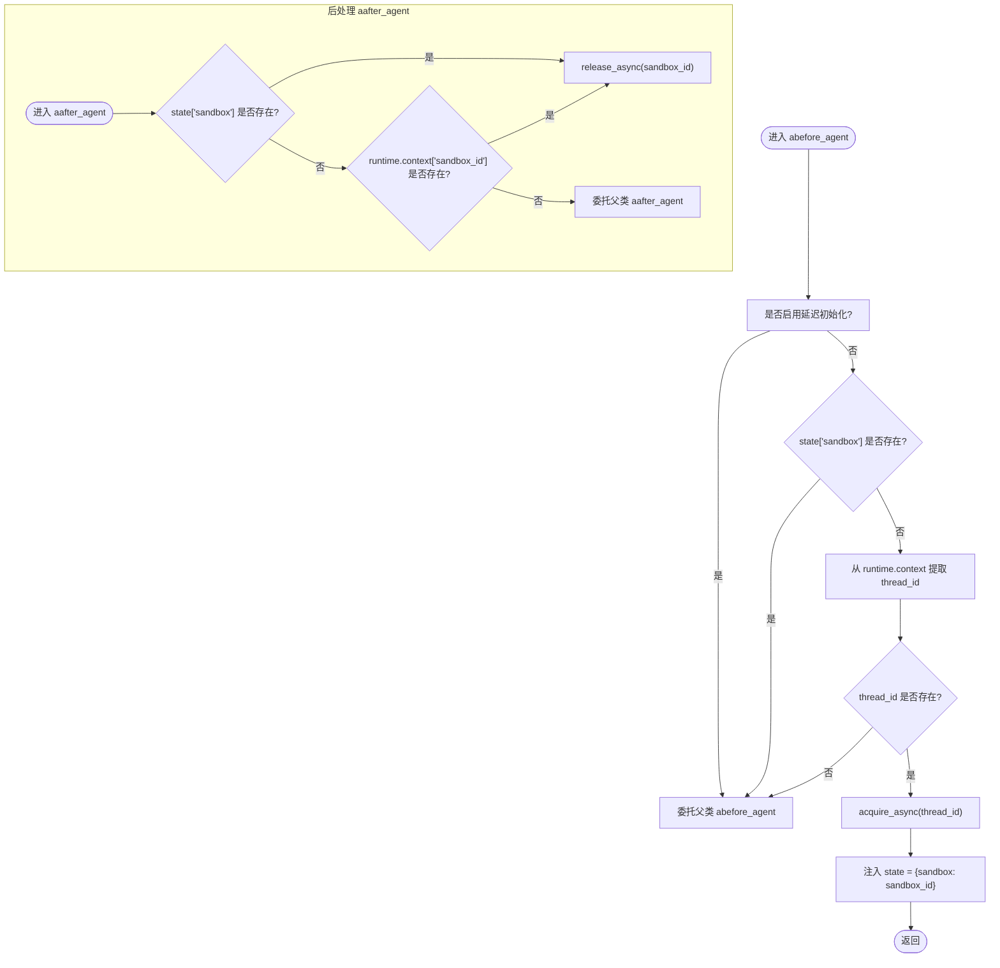
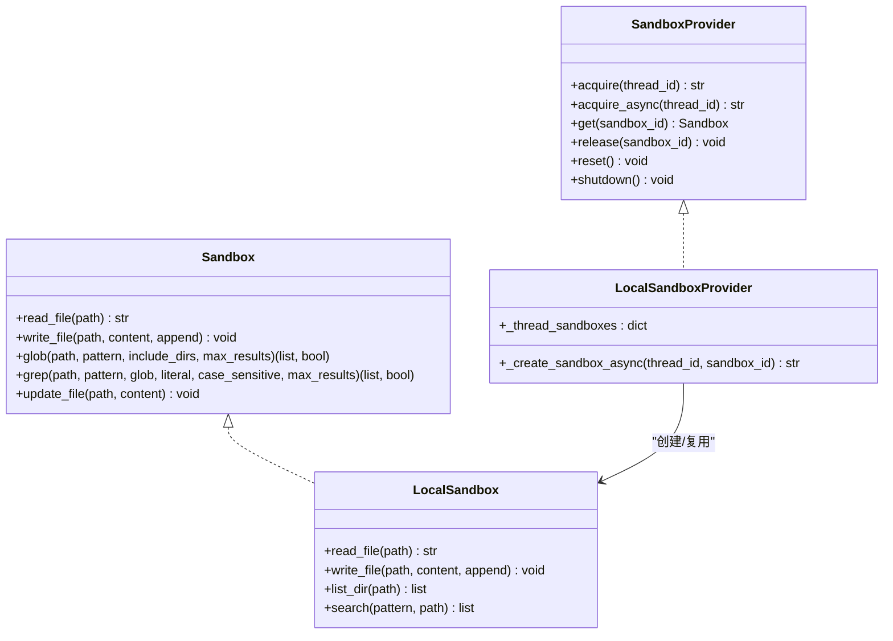
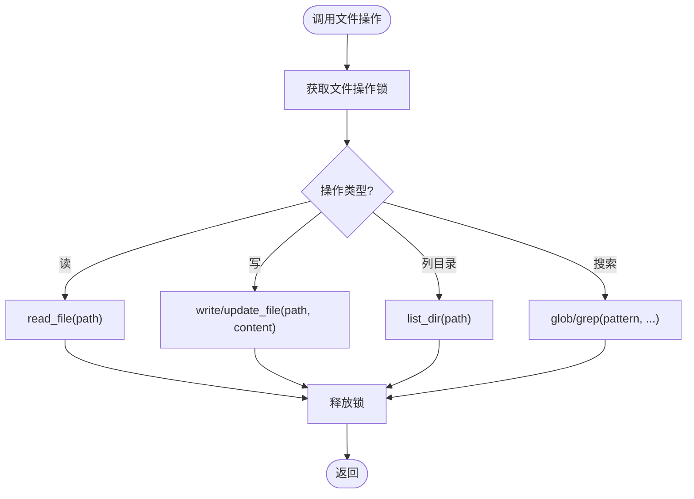
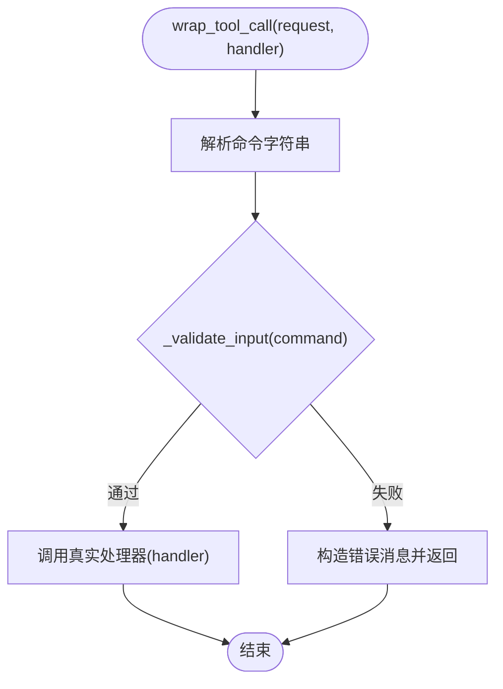
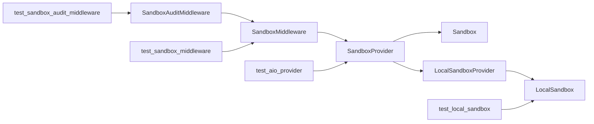

# 沙箱中间件

<cite>
**本文引用的文件**
- [middleware.py](file://backend/packages/harness/deerflow/sandbox/middleware.py)
- [sandbox_provider.py](file://backend/packages/harness/deerflow/sandbox/sandbox_provider.py)
- [sandbox.py](file://backend/packages/harness/deerflow/sandbox/sandbox.py)
- [local_sandbox_provider.py](file://backend/packages/harness/deerflow/sandbox/local/local_sandbox_provider.py)
- [local_sandbox.py](file://backend/packages/harness/deerflow/sandbox/local/local_sandbox.py)
- [file_operation_lock.py](file://backend/packages/harness/deerflow/sandbox/file_operation_lock.py)
- [sandbox_config.py](file://backend/packages/harness/deerflow/config/sandbox_config.py)
- [sandbox_audit_middleware.py](file://backend/packages/harness/deerflow/agents/middlewares/sandbox_audit_middleware.py)
- [test_sandbox_middleware.py](file://backend/tests/test_sandbox_middleware.py)
- [test_sandbox_audit_middleware.py](file://backend/tests/test_sandbox_audit_middleware.py)
- [test_local_sandbox_virtual_path_contract.py](file://backend/tests/test_local_sandbox_virtual_path_contract.py)
- [test_aio_sandbox_provider.py](file://backend/tests/test_aio_sandbox_provider.py)
</cite>

## 目录
1. [简介](#简介)
2. [项目结构](#项目结构)
3. [核心组件](#核心组件)
4. [架构总览](#架构总览)
5. [详细组件分析](#详细组件分析)
6. [依赖关系分析](#依赖关系分析)
7. [性能考量](#性能考量)
8. [故障排查指南](#故障排查指南)
9. [结论](#结论)
10. [附录](#附录)

## 简介
本文件围绕“沙箱中间件”展开，系统性阐述其在代理运行时中的作用与实现原理，覆盖请求拦截、参数验证、权限检查、资源审计等核心能力；详解中间件执行流程（请求预处理、沙箱调用、响应后处理）；说明文件操作工具（读写、目录管理、权限控制）的实现；并给出配置选项、扩展机制（插件系统、钩子函数、事件处理）以及开发与集成实践指南，包括编写规范、调试方法与性能优化策略，并总结与代理系统的集成方式与最佳实践。

## 项目结构
沙箱中间件位于后端包 deerflow 的 sandbox 子模块中，配合沙箱提供者、本地沙箱、文件锁与审计中间件共同构成完整的沙箱运行时体系。测试用例覆盖了中间件的生命周期、异步初始化、释放策略、输入校验与安全审计等关键行为。

**图表来源**
- [middleware.py](file://backend/packages/harness/deerflow/sandbox/middleware.py)
- [sandbox_provider.py](file://backend/packages/harness/deerflow/sandbox/sandbox_provider.py)
- [sandbox.py](file://backend/packages/harness/deerflow/sandbox/sandbox.py)
- [local_sandbox_provider.py](file://backend/packages/harness/deerflow/sandbox/local/local_sandbox_provider.py)
- [local_sandbox.py](file://backend/packages/harness/deerflow/sandbox/local/local_sandbox.py)
- [file_operation_lock.py](file://backend/packages/harness/deerflow/sandbox/file_operation_lock.py)
- [sandbox_config.py](file://backend/packages/harness/deerflow/config/sandbox_config.py)
- [sandbox_audit_middleware.py](file://backend/packages/harness/deerflow/agents/middlewares/sandbox_audit_middleware.py)
- [test_sandbox_middleware.py](file://backend/tests/test_sandbox_middleware.py)
- [test_sandbox_audit_middleware.py](file://backend/tests/test_sandbox_audit_middleware.py)
- [test_local_sandbox_virtual_path_contract.py](file://backend/tests/test_local_sandbox_virtual_path_contract.py)
- [test_aio_sandbox_provider.py](file://backend/tests/test_aio_sandbox_provider.py)

**章节来源**
- [middleware.py](file://backend/packages/harness/deerflow/sandbox/middleware.py)
- [sandbox_provider.py](file://backend/packages/harness/deerflow/sandbox/sandbox_provider.py)
- [sandbox.py](file://backend/packages/harness/deerflow/sandbox/sandbox.py)
- [local_sandbox_provider.py](file://backend/packages/harness/deerflow/sandbox/local/local_sandbox_provider.py)
- [local_sandbox.py](file://backend/packages/harness/deerflow/sandbox/local/local_sandbox.py)
- [file_operation_lock.py](file://backend/packages/harness/deerflow/sandbox/file_operation_lock.py)
- [sandbox_config.py](file://backend/packages/harness/deerflow/config/sandbox_config.py)
- [sandbox_audit_middleware.py](file://backend/packages/harness/deerflow/agents/middlewares/sandbox_audit_middleware.py)
- [test_sandbox_middleware.py](file://backend/tests/test_sandbox_middleware.py)
- [test_sandbox_audit_middleware.py](file://backend/tests/test_sandbox_audit_middleware.py)
- [test_local_sandbox_virtual_path_contract.py](file://backend/tests/test_local_sandbox_virtual_path_contract.py)
- [test_aio_sandbox_provider.py](file://backend/tests/test_aio_sandbox_provider.py)

## 核心组件
- 沙箱中间件：负责在代理生命周期内进行沙箱分配、释放与异步初始化，确保线程隔离与资源回收。
- 沙箱提供者：抽象出沙箱生命周期管理（创建、获取、释放），支持同步/异步两种模式。
- 本地沙箱与提供者：实现基于本地后端的沙箱实例化与文件操作。
- 文件操作锁：保障并发场景下的文件读写一致性。
- 沙箱配置：集中定义沙箱运行所需的路径、挂载、超时等参数。
- 沙箱审计中间件：对工具调用输入进行安全校验与阻断，防止恶意命令注入。

**章节来源**
- [middleware.py](file://backend/packages/harness/deerflow/sandbox/middleware.py)
- [sandbox_provider.py](file://backend/packages/harness/deerflow/sandbox/sandbox_provider.py)
- [local_sandbox_provider.py](file://backend/packages/harness/deerflow/sandbox/local/local_sandbox_provider.py)
- [local_sandbox.py](file://backend/packages/harness/deerflow/sandbox/local/local_sandbox.py)
- [file_operation_lock.py](file://backend/packages/harness/deerflow/sandbox/file_operation_lock.py)
- [sandbox_config.py](file://backend/packages/harness/deerflow/config/sandbox_config.py)
- [sandbox_audit_middleware.py](file://backend/packages/harness/deerflow/agents/middlewares/sandbox_audit_middleware.py)

## 架构总览
下图展示沙箱中间件在代理运行时中的位置与交互关系，包括与沙箱提供者、本地沙箱、审计中间件及测试用例的映射。

**图表来源**
- [middleware.py](file://backend/packages/harness/deerflow/sandbox/middleware.py)
- [sandbox_provider.py](file://backend/packages/harness/deerflow/sandbox/sandbox_provider.py)
- [sandbox_audit_middleware.py](file://backend/packages/harness/deerflow/agents/middlewares/sandbox_audit_middleware.py)
- [test_sandbox_middleware.py](file://backend/tests/test_sandbox_middleware.py)

## 详细组件分析

### 沙箱中间件（SandboxMiddleware）
职责与流程
- 请求预处理：根据配置决定是否“延迟初始化”，若启用则仅在需要时获取沙箱；否则在进入代理前为当前线程分配沙箱。
- 沙箱调用：通过沙箱提供者获取实例，将沙箱标识注入运行状态，供后续工具调用使用。
- 响应后处理：在代理结束后释放沙箱，避免资源泄漏；支持从状态或上下文提取沙箱 ID 进行释放。

关键特性
- 线程隔离：按 thread_id 分配独立沙箱，避免跨线程状态污染。
- 异步初始化：利用异步 acquire_async 将阻塞操作移出事件循环，提升吞吐。
- 释放策略：优先从状态中读取 sandbox_id，其次从 runtime.context 获取；若均无则委托父类处理。

**图表来源**
- [middleware.py](file://backend/packages/harness/deerflow/sandbox/middleware.py)
- [test_sandbox_middleware.py](file://backend/tests/test_sandbox_middleware.py)

**章节来源**
- [middleware.py](file://backend/packages/harness/deerflow/sandbox/middleware.py)
- [test_sandbox_middleware.py](file://backend/tests/test_sandbox_middleware.py)

### 沙箱提供者与沙箱接口
- 抽象接口：定义沙箱生命周期方法（acquire/acquire_async、get、release），并提供默认单例管理与重置/关闭能力。
- 默认提供者：全局持有默认 SandboxProvider 实例，支持重置与优雅关闭，避免配置变更不生效或孤儿沙箱。
- 本地实现：LocalSandboxProvider 负责本地后端的沙箱实例化与缓存；LocalSandbox 提供文件读写、目录遍历、搜索等能力，并通过文件操作锁保证并发安全。

**图表来源**
- [sandbox_provider.py](file://backend/packages/harness/deerflow/sandbox/sandbox_provider.py)
- [sandbox.py](file://backend/packages/harness/deerflow/sandbox/sandbox.py)
- [local_sandbox_provider.py](file://backend/packages/harness/deerflow/sandbox/local/local_sandbox_provider.py)
- [local_sandbox.py](file://backend/packages/harness/deerflow/sandbox/local/local_sandbox.py)

**章节来源**
- [sandbox_provider.py](file://backend/packages/harness/deerflow/sandbox/sandbox_provider.py)
- [sandbox.py](file://backend/packages/harness/deerflow/sandbox/sandbox.py)
- [local_sandbox_provider.py](file://backend/packages/harness/deerflow/sandbox/local/local_sandbox_provider.py)
- [local_sandbox.py](file://backend/packages/harness/deerflow/sandbox/local/local_sandbox.py)

### 文件操作工具与权限控制
- 文件读写：支持文本与二进制写入、追加写入；提供更新文件能力。
- 目录管理：列出目录内容，支持虚拟路径映射，确保宿主路径与沙箱内路径一致。
- 搜索能力：支持通配符匹配与正则检索，限制最大结果数以避免性能问题。
- 并发安全：通过文件操作锁协调多线程/多协程的文件访问，避免竞态条件。
- 虚拟路径契约：本地沙箱正确解析虚拟路径，避免将原始虚拟路径当作宿主绝对路径写入。

**图表来源**
- [local_sandbox.py](file://backend/packages/harness/deerflow/sandbox/local/local_sandbox.py)
- [file_operation_lock.py](file://backend/packages/harness/deerflow/sandbox/file_operation_lock.py)
- [test_local_sandbox_virtual_path_contract.py](file://backend/tests/test_local_sandbox_virtual_path_contract.py)

**章节来源**
- [local_sandbox.py](file://backend/packages/harness/deerflow/sandbox/local/local_sandbox.py)
- [file_operation_lock.py](file://backend/packages/harness/deerflow/sandbox/file_operation_lock.py)
- [test_local_sandbox_virtual_path_contract.py](file://backend/tests/test_local_sandbox_virtual_path_contract.py)

### 沙箱审计中间件（输入验证与阻断）
- 输入校验：检测空命令、纯空白、超长命令、包含空字节等异常输入，统一返回拒绝原因。
- 工具调用拦截：在 wrap_tool_call 中前置校验，若发现风险直接返回错误消息而不调用真实处理器。
- 安全策略：通过最小权限原则与白名单式校验，降低命令注入与越权风险。

**图表来源**
- [sandbox_audit_middleware.py](file://backend/packages/harness/deerflow/agents/middlewares/sandbox_audit_middleware.py)
- [test_sandbox_audit_middleware.py](file://backend/tests/test_sandbox_audit_middleware.py)

**章节来源**
- [sandbox_audit_middleware.py](file://backend/packages/harness/deerflow/agents/middlewares/sandbox_audit_middleware.py)
- [test_sandbox_audit_middleware.py](file://backend/tests/test_sandbox_audit_middleware.py)

## 依赖关系分析
- 组件耦合：SandboxMiddleware 依赖 SandboxProvider；LocalSandboxProvider 依赖 LocalSandbox；审计中间件与工具调用链路解耦，仅在输入阶段介入。
- 外部依赖：异步初始化依赖事件循环外的阻塞等待；文件操作依赖宿主文件系统与锁机制。
- 循环依赖：未见直接循环导入；全局提供者单例通过函数接口管理，避免循环引用。

**图表来源**
- [middleware.py](file://backend/packages/harness/deerflow/sandbox/middleware.py)
- [sandbox_provider.py](file://backend/packages/harness/deerflow/sandbox/sandbox_provider.py)
- [local_sandbox_provider.py](file://backend/packages/harness/deerflow/sandbox/local/local_sandbox_provider.py)
- [local_sandbox.py](file://backend/packages/harness/deerflow/sandbox/local/local_sandbox.py)
- [sandbox_audit_middleware.py](file://backend/packages/harness/deerflow/agents/middlewares/sandbox_audit_middleware.py)
- [test_sandbox_middleware.py](file://backend/tests/test_sandbox_middleware.py)
- [test_sandbox_audit_middleware.py](file://backend/tests/test_sandbox_audit_middleware.py)
- [test_local_sandbox_virtual_path_contract.py](file://backend/tests/test_local_sandbox_virtual_path_contract.py)
- [test_aio_sandbox_provider.py](file://backend/tests/test_aio_sandbox_provider.py)

**章节来源**
- [middleware.py](file://backend/packages/harness/deerflow/sandbox/middleware.py)
- [sandbox_provider.py](file://backend/packages/harness/deerflow/sandbox/sandbox_provider.py)
- [local_sandbox_provider.py](file://backend/packages/harness/deerflow/sandbox/local/local_sandbox_provider.py)
- [local_sandbox.py](file://backend/packages/harness/deerflow/sandbox/local/local_sandbox.py)
- [sandbox_audit_middleware.py](file://backend/packages/harness/deerflow/agents/middlewares/sandbox_audit_middleware.py)
- [test_sandbox_middleware.py](file://backend/tests/test_sandbox_middleware.py)
- [test_sandbox_audit_middleware.py](file://backend/tests/test_sandbox_audit_middleware.py)
- [test_local_sandbox_virtual_path_contract.py](file://backend/tests/test_local_sandbox_virtual_path_contract.py)
- [test_aio_sandbox_provider.py](file://backend/tests/test_aio_sandbox_provider.py)

## 性能考量
- 异步初始化：通过异步 acquire_async 将阻塞的沙箱就绪等待移出事件循环，减少主线程阻塞。
- 线程隔离：按线程分配沙箱，避免共享状态竞争；同时注意避免过度创建导致内存压力。
- 文件操作锁：在高并发场景下，锁争用可能成为瓶颈；建议合理设置最大结果数与超时阈值。
- 资源释放：严格在代理结束后释放沙箱，防止孤儿进程与句柄泄露；必要时使用优雅关闭接口。

[本节为通用性能建议，无需特定文件引用]

## 故障排查指南
常见问题与定位要点
- 沙箱未分配：确认 runtime.context 是否包含 thread_id；检查延迟初始化配置；查看测试用例中对委托父类的断言。
- 沙箱释放失败：核对 state 与 runtime.context 中的 sandbox_id；确认异步释放是否在事件循环外执行。
- 文件写入失败：检查虚拟路径映射是否正确；确认宿主路径可写且无权限限制。
- 审计拦截误报：核对输入长度、空字节与空白字符；调整审计规则或白名单策略。

参考测试用例
- 沙箱中间件生命周期与释放：[test_sandbox_middleware.py](file://backend/tests/test_sandbox_middleware.py)
- 审计中间件输入校验：[test_sandbox_audit_middleware.py](file://backend/tests/test_sandbox_audit_middleware.py)
- 虚拟路径契约：[test_local_sandbox_virtual_path_contract.py](file://backend/tests/test_local_sandbox_virtual_path_contract.py)
- AIO Provider 异步就绪：[test_aio_sandbox_provider.py](file://backend/tests/test_aio_sandbox_provider.py)

**章节来源**
- [test_sandbox_middleware.py](file://backend/tests/test_sandbox_middleware.py)
- [test_sandbox_audit_middleware.py](file://backend/tests/test_sandbox_audit_middleware.py)
- [test_local_sandbox_virtual_path_contract.py](file://backend/tests/test_local_sandbox_virtual_path_contract.py)
- [test_aio_sandbox_provider.py](file://backend/tests/test_aio_sandbox_provider.py)

## 结论
沙箱中间件通过“延迟/异步初始化 + 线程隔离 + 明确释放”的设计，在保证安全性的同时兼顾性能与可维护性。结合审计中间件的输入校验与本地沙箱的文件操作能力，形成从入口到执行再到收尾的完整闭环。建议在生产环境启用延迟初始化与异步就绪，严格遵循资源释放与权限控制策略，并通过测试用例持续验证关键行为。

[本节为总结性内容，无需特定文件引用]

## 附录

### 配置选项与扩展机制
- 配置项：通过沙箱配置集中管理路径、挂载、超时等参数，便于在不同环境中切换。
- 扩展点：可通过自定义 SandboxProvider 注入测试或生产后端；支持重置与优雅关闭，便于热更新与运维。

**章节来源**
- [sandbox_config.py](file://backend/packages/harness/deerflow/config/sandbox_config.py)
- [sandbox_provider.py](file://backend/packages/harness/deerflow/sandbox/sandbox_provider.py)

### 开发与集成实践指南
- 编写规范：中间件需明确 before/after 与 abefore/aafter 的职责边界；状态注入与上下文读取保持幂等。
- 调试方法：利用测试用例模拟不同线程与上下文；通过 Mock 提供者验证释放与异步行为。
- 性能优化：优先采用异步初始化与释放；限制搜索结果数量与超时；避免在事件循环中执行阻塞 IO。

**章节来源**
- [middleware.py](file://backend/packages/harness/deerflow/sandbox/middleware.py)
- [test_sandbox_middleware.py](file://backend/tests/test_sandbox_middleware.py)

### 与代理系统的集成方式与最佳实践
- 集成方式：在代理运行时注册 SandboxMiddleware，确保在工具调用前完成沙箱分配，在代理结束后完成释放。
- 最佳实践：启用延迟初始化以降低冷启动成本；为每个线程绑定独立沙箱；在工具链上叠加审计中间件；定期清理孤儿沙箱。

**章节来源**
- [middleware.py](file://backend/packages/harness/deerflow/sandbox/middleware.py)
- [sandbox_audit_middleware.py](file://backend/packages/harness/deerflow/agents/middlewares/sandbox_audit_middleware.py)