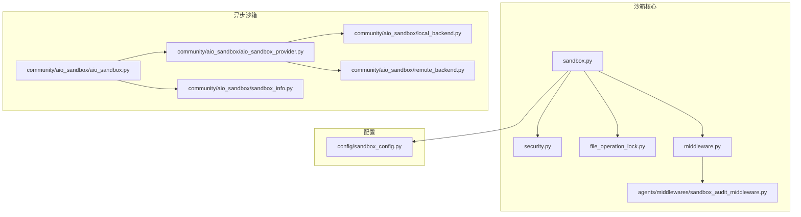
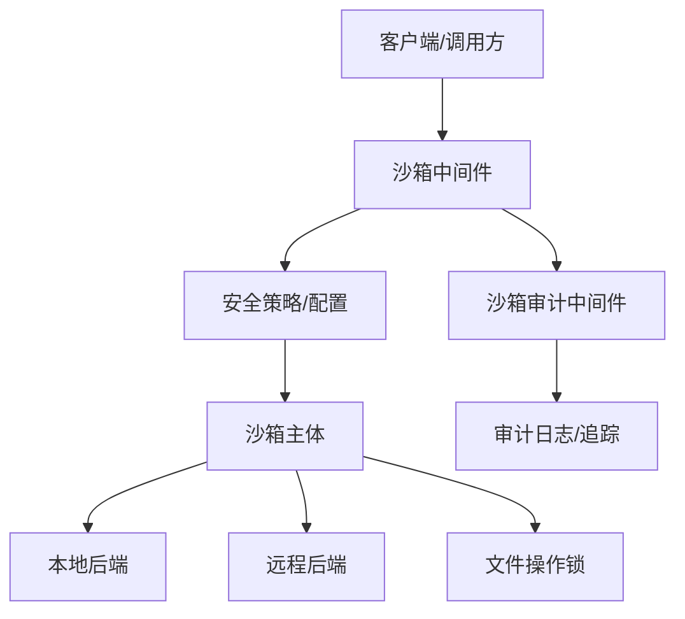
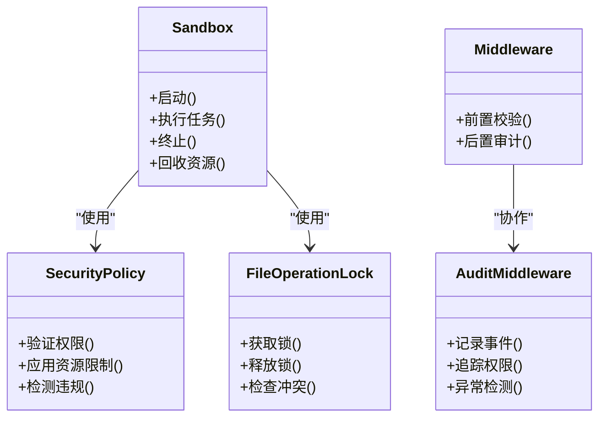
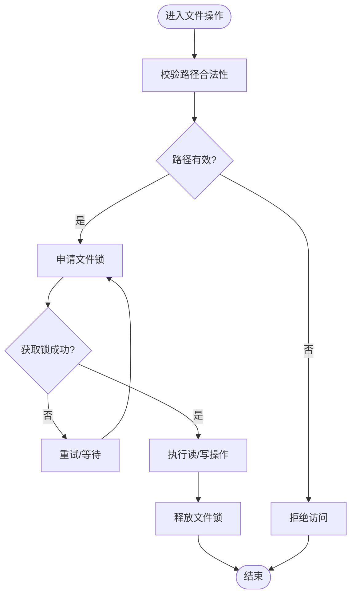
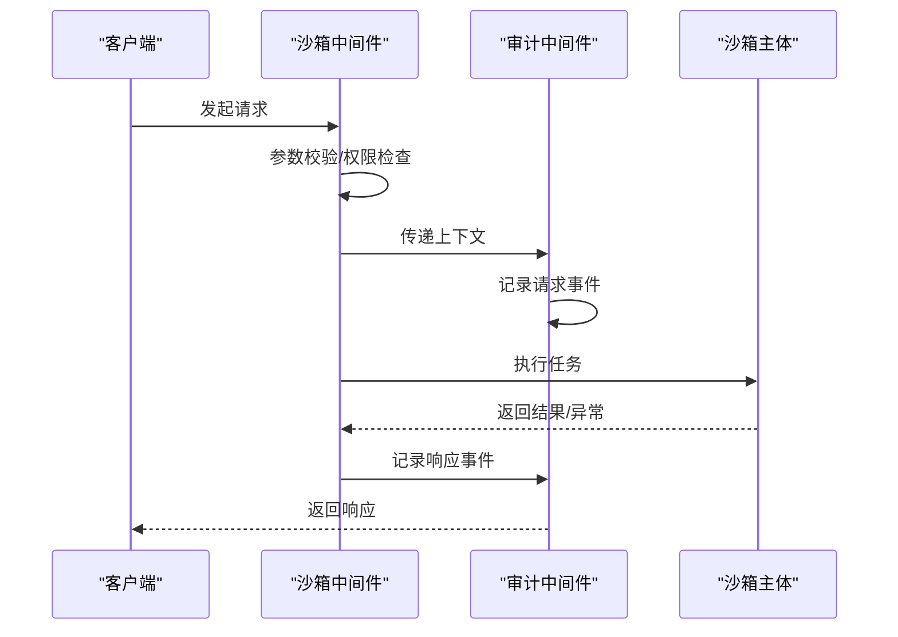
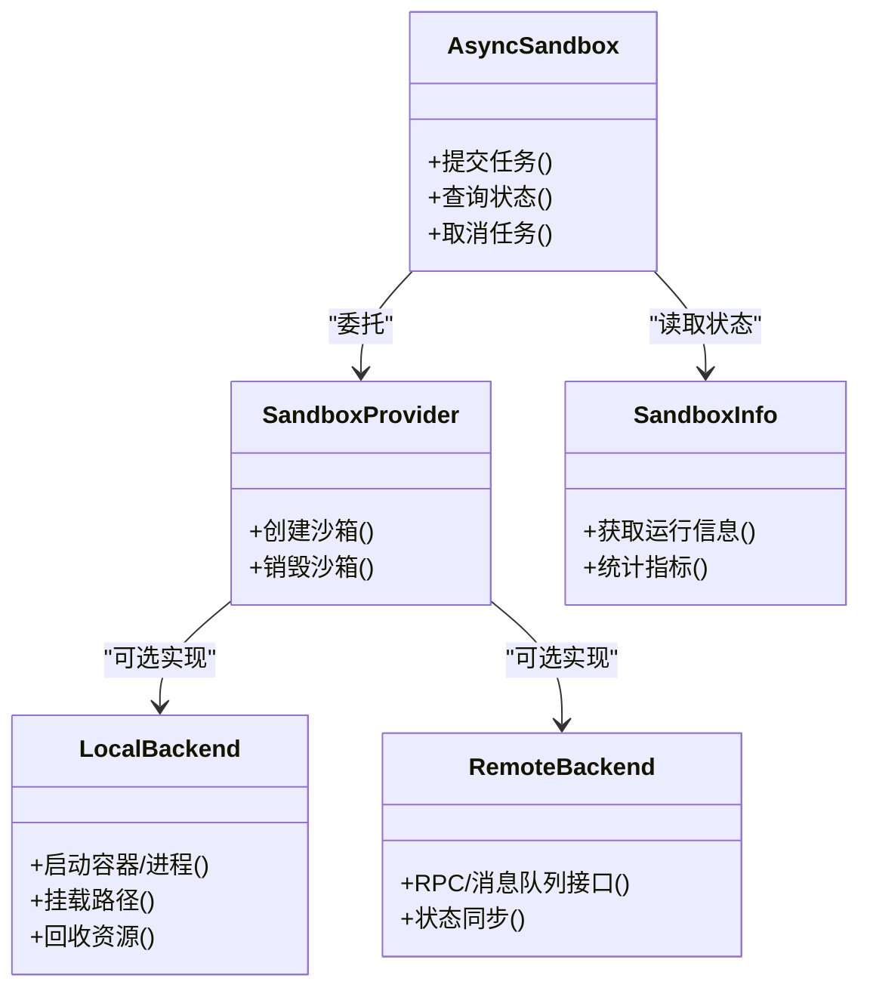
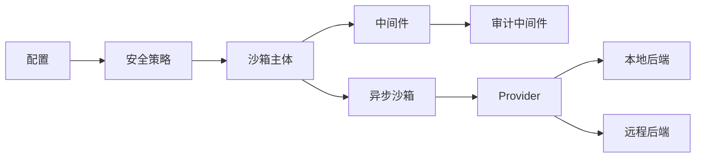

# 沙箱安全机制

<cite>
**本文引用的文件**
- [sandbox.py](file://backend/packages/harness/deerflow/sandbox/sandbox.py)
- [security.py](file://backend/packages/harness/deerflow/sandbox/security.py)
- [file_operation_lock.py](file://backend/packages/harness/deerflow/sandbox/file_operation_lock.py)
- [middleware.py](file://backend/packages/harness/deerflow/sandbox/middleware.py)
- [sandbox_audit_middleware.py](file://backend/packages/harness/deerflow/agents/middlewares/sandbox_audit_middleware.py)
- [sandbox_config.py](file://backend/packages/harness/deerflow/config/sandbox_config.py)
- [aio_sandbox.py](file://backend/packages/harness/deerflow/community/aio_sandbox/aio_sandbox.py)
- [aio_sandbox_provider.py](file://backend/packages/harness/deerflow/community/aio_sandbox/aio_sandbox_provider.py)
- [local_backend.py](file://backend/packages/harness/deerflow/community/aio_sandbox/local_backend.py)
- [remote_backend.py](file://backend/packages/harness/deerflow/community/aio_sandbox/remote_backend.py)
- [sandbox_info.py](file://backend/packages/harness/deerflow/community/aio_sandbox/sandbox_info.py)
- [test_sandbox_middleware.py](file://backend/tests/test_sandbox_middleware.py)
- [test_sandbox_audit_middleware.py](file://backend/tests/test_sandbox_audit_middleware.py)
- [test_sandbox_tools_security.py](file://backend/tests/test_sandbox_tools_security.py)
- [test_docker_sandbox_mode_detection.py](file://backend/tests/test_docker_sandbox_mode_detection.py)
- [test_local_sandbox_provider_mounts.py](file://backend/tests/test_local_sandbox_provider_mounts.py)
- [test_local_sandbox_virtual_path_contract.py](file://backend/tests/test_local_sandbox_virtual_path_contract.py)
- [test_sandbox_search_tools.py](file://backend/tests/test_sandbox_search_tools.py)
- [test_sandbox_memory_profile_script.py](file://backend/tests/test_sandbox_memory_profile_script.py)
- [GUARDRAILS.md](file://backend/docs/GUARDRAILS.md)
- [SANDBOX_MEMORY_PROFILING.md](file://backend/docs/SANDBOX_MEMORY_PROFILING.md)
</cite>

## 目录
1. [引言](#引言)
2. [项目结构](#项目结构)
3. [核心组件](#核心组件)
4. [架构总览](#架构总览)
5. [详细组件分析](#详细组件分析)
6. [依赖关系分析](#依赖关系分析)
7. [性能考虑](#性能考虑)
8. [故障排除指南](#故障排除指南)
9. [结论](#结论)
10. [附录](#附录)

## 引言
本文件系统性阐述 deer-flow 项目中的沙箱安全机制，覆盖操作系统级隔离、资源限制、权限控制等核心技术；详述安全策略在文件操作锁定、网络访问控制、进程间通信限制等方面的实施；解释异常处理与错误恢复（安全违规检测、异常捕获、系统恢复）；说明安全审计与监控（操作日志记录、权限追踪、异常行为检测）；并提供安全配置与策略制定的实践指南（最小权限原则、纵深防御、合规要求），以及性能影响与优化策略。

## 项目结构
沙箱安全机制主要分布在以下模块：
- 核心沙箱实现：sandbox 包含沙箱主体、安全策略、文件操作锁、中间件等
- 配置管理：sandbox_config 提供沙箱运行参数与策略配置
- 异步沙箱社区实现：aio_sandbox 提供异步沙箱与后端抽象
- 审计中间件：agents 中的沙箱审计中间件负责运行期审计
- 测试用例：覆盖沙箱中间件、工具安全、内存分析、Docker 模式检测等

**图表来源**
- [sandbox.py](file://backend/packages/harness/deerflow/sandbox/sandbox.py)
- [security.py](file://backend/packages/harness/deerflow/sandbox/security.py)
- [file_operation_lock.py](file://backend/packages/harness/deerflow/sandbox/file_operation_lock.py)
- [middleware.py](file://backend/packages/harness/deerflow/sandbox/middleware.py)
- [sandbox_audit_middleware.py](file://backend/packages/harness/deerflow/agents/middlewares/sandbox_audit_middleware.py)
- [sandbox_config.py](file://backend/packages/harness/deerflow/config/sandbox_config.py)
- [aio_sandbox.py](file://backend/packages/harness/deerflow/community/aio_sandbox/aio_sandbox.py)
- [aio_sandbox_provider.py](file://backend/packages/harness/deerflow/community/aio_sandbox/aio_sandbox_provider.py)
- [local_backend.py](file://backend/packages/harness/deerflow/community/aio_sandbox/local_backend.py)
- [remote_backend.py](file://backend/packages/harness/deerflow/community/aio_sandbox/remote_backend.py)
- [sandbox_info.py](file://backend/packages/harness/deerflow/community/aio_sandbox/sandbox_info.py)

**章节来源**
- [sandbox.py](file://backend/packages/harness/deerflow/sandbox/sandbox.py)
- [sandbox_config.py](file://backend/packages/harness/deerflow/config/sandbox_config.py)
- [aio_sandbox.py](file://backend/packages/harness/deerflow/community/aio_sandbox/aio_sandbox.py)

## 核心组件
- 沙箱主体与安全策略：定义沙箱生命周期、隔离边界、资源配额与安全规则
- 文件操作锁：防止并发写冲突与越权访问，确保文件操作原子性与一致性
- 中间件：拦截请求，执行安全前置校验与后置审计
- 审计中间件：记录沙箱运行期关键事件，支持权限追踪与异常行为检测
- 异步沙箱与后端：提供本地/远程后端抽象，统一异步执行模型
- 配置：集中管理沙箱模式、资源上限、网络与文件访问策略

**章节来源**
- [sandbox.py](file://backend/packages/harness/deerflow/sandbox/sandbox.py)
- [security.py](file://backend/packages/harness/deerflow/sandbox/security.py)
- [file_operation_lock.py](file://backend/packages/harness/deerflow/sandbox/file_operation_lock.py)
- [middleware.py](file://backend/packages/harness/deerflow/sandbox/middleware.py)
- [sandbox_audit_middleware.py](file://backend/packages/harness/deerflow/agents/middlewares/sandbox_audit_middleware.py)
- [aio_sandbox.py](file://backend/packages/harness/deerflow/community/aio_sandbox/aio_sandbox.py)
- [aio_sandbox_provider.py](file://backend/packages/harness/deerflow/community/aio_sandbox/aio_sandbox_provider.py)
- [local_backend.py](file://backend/packages/harness/deerflow/community/aio_sandbox/local_backend.py)
- [remote_backend.py](file://backend/packages/harness/deerflow/community/aio_sandbox/remote_backend.py)
- [sandbox_info.py](file://backend/packages/harness/deerflow/community/aio_sandbox/sandbox_info.py)
- [sandbox_config.py](file://backend/packages/harness/deerflow/config/sandbox_config.py)

## 架构总览
沙箱安全架构由“策略层—执行层—审计层”构成：
- 策略层：安全策略与配置驱动，定义资源限制、访问控制与违规判定
- 执行层：沙箱主体与后端（本地/远程），负责隔离执行与资源调度
- 审计层：中间件与审计组件，负责事件记录与异常检测

**图表来源**
- [middleware.py](file://backend/packages/harness/deerflow/sandbox/middleware.py)
- [sandbox_audit_middleware.py](file://backend/packages/harness/deerflow/agents/middlewares/sandbox_audit_middleware.py)
- [security.py](file://backend/packages/harness/deerflow/sandbox/security.py)
- [sandbox.py](file://backend/packages/harness/deerflow/sandbox/sandbox.py)
- [local_backend.py](file://backend/packages/harness/deerflow/community/aio_sandbox/local_backend.py)
- [remote_backend.py](file://backend/packages/harness/deerflow/community/aio_sandbox/remote_backend.py)
- [file_operation_lock.py](file://backend/packages/harness/deerflow/sandbox/file_operation_lock.py)

## 详细组件分析

### 沙箱主体与安全策略
- 安全隔离原理
  - 操作系统级隔离：通过容器或进程隔离实现资源与命名空间分离
  - 资源限制：CPU、内存、文件句柄、网络带宽等配额控制
  - 权限控制：最小权限原则，仅授予执行所需能力
- 安全策略实施
  - 文件操作锁定：避免并发写冲突与越权访问
  - 网络访问控制：白名单/黑名单、出站端口限制、DNS/代理策略
  - 进程间通信限制：禁用共享内存、Unix 域套接字等高风险 IPC
- 异常处理与恢复
  - 安全违规检测：超时、资源越限、非法系统调用
  - 异常捕获：统一异常包装与分类
  - 系统恢复：自动重启、回滚状态、清理残留资源

**图表来源**
- [sandbox.py](file://backend/packages/harness/deerflow/sandbox/sandbox.py)
- [security.py](file://backend/packages/harness/deerflow/sandbox/security.py)
- [file_operation_lock.py](file://backend/packages/harness/deerflow/sandbox/file_operation_lock.py)
- [middleware.py](file://backend/packages/harness/deerflow/sandbox/middleware.py)
- [sandbox_audit_middleware.py](file://backend/packages/harness/deerflow/agents/middlewares/sandbox_audit_middleware.py)

**章节来源**
- [sandbox.py](file://backend/packages/harness/deerflow/sandbox/sandbox.py)
- [security.py](file://backend/packages/harness/deerflow/sandbox/security.py)
- [file_operation_lock.py](file://backend/packages/harness/deerflow/sandbox/file_operation_lock.py)
- [middleware.py](file://backend/packages/harness/deerflow/sandbox/middleware.py)
- [sandbox_audit_middleware.py](file://backend/packages/harness/deerflow/agents/middlewares/sandbox_audit_middleware.py)

### 文件操作锁机制
- 设计目标：保证文件读写的一致性与安全性，防止竞态条件与越权访问
- 关键特性：互斥锁、超时控制、死锁检测、跨进程可见性
- 实施要点：统一文件路径虚拟化、访问前缀白名单、写入权限校验

**图表来源**
- [file_operation_lock.py](file://backend/packages/harness/deerflow/sandbox/file_operation_lock.py)

**章节来源**
- [file_operation_lock.py](file://backend/packages/harness/deerflow/sandbox/file_operation_lock.py)

### 沙箱中间件与审计中间件
- 中间件职责
  - 前置校验：参数校验、权限认证、资源可用性检查
  - 后置审计：记录执行结果、异常信息、资源消耗
- 审计中间件功能
  - 操作日志：时间戳、用户标识、沙箱 ID、命令/脚本摘要
  - 权限追踪：谁在何时对何对象执行了何种操作
  - 异常行为检测：超时、资源越限、可疑路径访问

**图表来源**
- [middleware.py](file://backend/packages/harness/deerflow/sandbox/middleware.py)
- [sandbox_audit_middleware.py](file://backend/packages/harness/deerflow/agents/middlewares/sandbox_audit_middleware.py)

**章节来源**
- [middleware.py](file://backend/packages/harness/deerflow/sandbox/middleware.py)
- [sandbox_audit_middleware.py](file://backend/packages/harness/deerflow/agents/middlewares/sandbox_audit_middleware.py)

### 异步沙箱与后端抽象
- 异步沙箱：提供非阻塞执行模型，适配高并发场景
- 后端抽象：统一本地与远程执行环境，屏蔽差异
- 本地后端：基于容器或进程隔离，支持挂载点与路径映射
- 远程后端：通过 RPC 或消息队列与远端执行器交互

**图表来源**
- [aio_sandbox.py](file://backend/packages/harness/deerflow/community/aio_sandbox/aio_sandbox.py)
- [aio_sandbox_provider.py](file://backend/packages/harness/deerflow/community/aio_sandbox/aio_sandbox_provider.py)
- [local_backend.py](file://backend/packages/harness/deerflow/community/aio_sandbox/local_backend.py)
- [remote_backend.py](file://backend/packages/harness/deerflow/community/aio_sandbox/remote_backend.py)
- [sandbox_info.py](file://backend/packages/harness/deerflow/community/aio_sandbox/sandbox_info.py)

**章节来源**
- [aio_sandbox.py](file://backend/packages/harness/deerflow/community/aio_sandbox/aio_sandbox.py)
- [aio_sandbox_provider.py](file://backend/packages/harness/deerflow/community/aio_sandbox/aio_sandbox_provider.py)
- [local_backend.py](file://backend/packages/harness/deerflow/community/aio_sandbox/local_backend.py)
- [remote_backend.py](file://backend/packages/harness/deerflow/community/aio_sandbox/remote_backend.py)
- [sandbox_info.py](file://backend/packages/harness/deerflow/community/aio_sandbox/sandbox_info.py)

### 安全配置与策略制定
- 最小权限原则：仅授予执行所需文件、网络、进程能力
- 纵深防御：多层策略叠加（路径白名单、资源限制、超时控制）
- 合规要求：审计日志留存、异常行为告警、定期安全评估
- 配置示例要点：资源上限、网络白名单、文件根路径、挂载策略

**章节来源**
- [sandbox_config.py](file://backend/packages/harness/deerflow/config/sandbox_config.py)
- [GUARDRAILS.md](file://backend/docs/GUARDRAILS.md)

## 依赖关系分析
- 组件耦合与内聚
  - 沙箱主体与安全策略强耦合，确保执行期策略生效
  - 中间件与审计中间件弱耦合，通过上下文传递实现扩展
  - 异步沙箱与后端通过 Provider 抽象解耦
- 外部依赖与集成点
  - 容器/进程运行时（如 Docker/Podman）
  - 网络与 DNS 服务
  - 存储与挂载点（本地/远程）

**图表来源**
- [sandbox_config.py](file://backend/packages/harness/deerflow/config/sandbox_config.py)
- [security.py](file://backend/packages/harness/deerflow/sandbox/security.py)
- [sandbox.py](file://backend/packages/harness/deerflow/sandbox/sandbox.py)
- [middleware.py](file://backend/packages/harness/deerflow/sandbox/middleware.py)
- [sandbox_audit_middleware.py](file://backend/packages/harness/deerflow/agents/middlewares/sandbox_audit_middleware.py)
- [aio_sandbox.py](file://backend/packages/harness/deerflow/community/aio_sandbox/aio_sandbox.py)
- [aio_sandbox_provider.py](file://backend/packages/harness/deerflow/community/aio_sandbox/aio_sandbox_provider.py)
- [local_backend.py](file://backend/packages/harness/deerflow/community/aio_sandbox/local_backend.py)
- [remote_backend.py](file://backend/packages/harness/deerflow/community/aio_sandbox/remote_backend.py)

**章节来源**
- [sandbox_config.py](file://backend/packages/harness/deerflow/config/sandbox_config.py)
- [security.py](file://backend/packages/harness/deerflow/sandbox/security.py)
- [sandbox.py](file://backend/packages/harness/deerflow/sandbox/sandbox.py)
- [middleware.py](file://backend/packages/harness/deerflow/sandbox/middleware.py)
- [sandbox_audit_middleware.py](file://backend/packages/harness/deerflow/agents/middlewares/sandbox_audit_middleware.py)
- [aio_sandbox.py](file://backend/packages/harness/deerflow/community/aio_sandbox/aio_sandbox.py)
- [aio_sandbox_provider.py](file://backend/packages/harness/deerflow/community/aio_sandbox/aio_sandbox_provider.py)
- [local_backend.py](file://backend/packages/harness/deerflow/community/aio_sandbox/local_backend.py)
- [remote_backend.py](file://backend/packages/harness/deerflow/community/aio_sandbox/remote_backend.py)

## 性能考虑
- 资源配额与隔离成本：容器/进程隔离带来额外开销，需平衡安全与性能
- 并发与锁竞争：文件操作锁可能导致排队，应优化热点路径与批量操作
- 异步执行优势：异步沙箱减少阻塞，提升吞吐量
- 内存与 I/O 分析：通过内存剖析脚本识别瓶颈，持续优化

**章节来源**
- [SANDBOX_MEMORY_PROFILING.md](file://backend/docs/SANDBOX_MEMORY_PROFILING.md)
- [test_sandbox_memory_profile_script.py](file://backend/tests/test_sandbox_memory_profile_script.py)

## 故障排除指南
- 常见问题
  - Docker 沙箱模式检测失败：确认容器运行时可用与权限配置
  - 本地沙箱挂载异常：检查挂载点路径与权限映射
  - 虚拟路径契约不满足：核对路径转换与白名单规则
  - 工具安全违规：审查工具参数与输出大小限制
- 排查步骤
  - 查看沙箱中间件与审计中间件日志
  - 使用内存剖析脚本定位资源占用
  - 对比测试用例中各场景的预期行为

**章节来源**
- [test_docker_sandbox_mode_detection.py](file://backend/tests/test_docker_sandbox_mode_detection.py)
- [test_local_sandbox_provider_mounts.py](file://backend/tests/test_local_sandbox_provider_mounts.py)
- [test_local_sandbox_virtual_path_contract.py](file://backend/tests/test_local_sandbox_virtual_path_contract.py)
- [test_sandbox_tools_security.py](file://backend/tests/test_sandbox_tools_security.py)
- [test_sandbox_middleware.py](file://backend/tests/test_sandbox_middleware.py)
- [test_sandbox_audit_middleware.py](file://backend/tests/test_sandbox_audit_middleware.py)

## 结论
本项目通过“策略—执行—审计”的三层架构实现了全面的沙箱安全机制。核心在于严格的资源限制、最小权限原则与完善的审计追踪。配合异步执行与内存剖析工具，可在保障安全的同时兼顾性能与可观测性。建议在生产环境中结合合规要求与风险评估，持续完善策略与监控体系。

## 附录
- 相关文档与规范
  - 守卫栏与安全策略设计文档
  - 沙箱内存剖析与性能优化指南
- 测试参考
  - 沙箱中间件与审计中间件测试
  - 工具安全与搜索工具测试
  - Docker 沙箱模式与本地挂载测试

**章节来源**
- [GUARDRAILS.md](file://backend/docs/GUARDRAILS.md)
- [SANDBOX_MEMORY_PROFILING.md](file://backend/docs/SANDBOX_MEMORY_PROFILING.md)
- [test_sandbox_middleware.py](file://backend/tests/test_sandbox_middleware.py)
- [test_sandbox_audit_middleware.py](file://backend/tests/test_sandbox_audit_middleware.py)
- [test_sandbox_tools_security.py](file://backend/tests/test_sandbox_tools_security.py)
- [test_docker_sandbox_mode_detection.py](file://backend/tests/test_docker_sandbox_mode_detection.py)
- [test_local_sandbox_provider_mounts.py](file://backend/tests/test_local_sandbox_provider_mounts.py)
- [test_local_sandbox_virtual_path_contract.py](file://backend/tests/test_local_sandbox_virtual_path_contract.py)
- [test_sandbox_search_tools.py](file://backend/tests/test_sandbox_search_tools.py)
- [test_sandbox_memory_profile_script.py](file://backend/tests/test_sandbox_memory_profile_script.py)