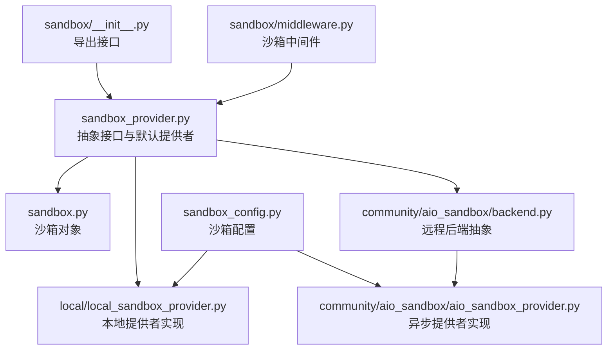
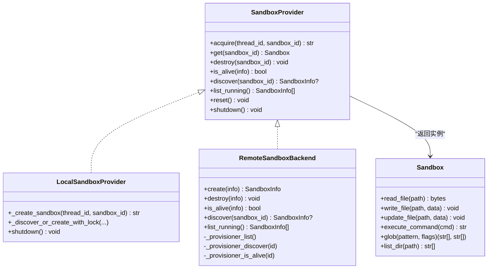
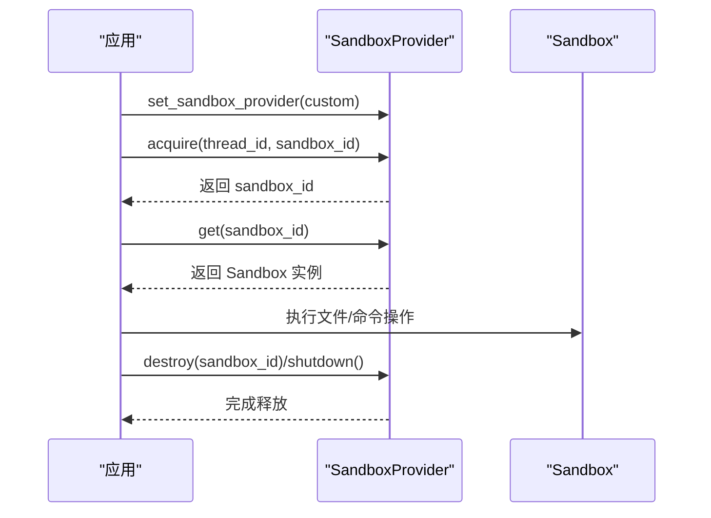
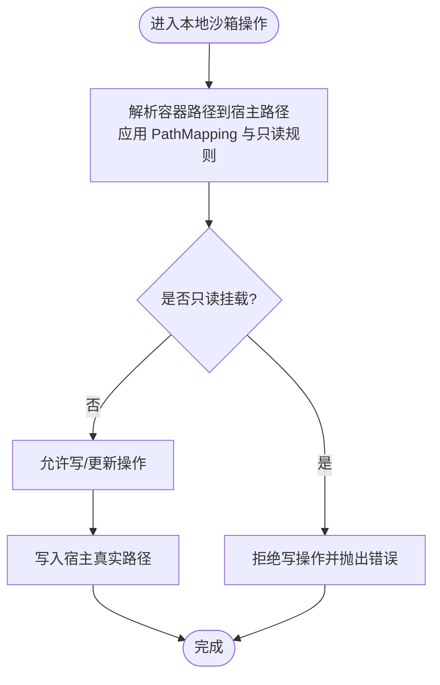
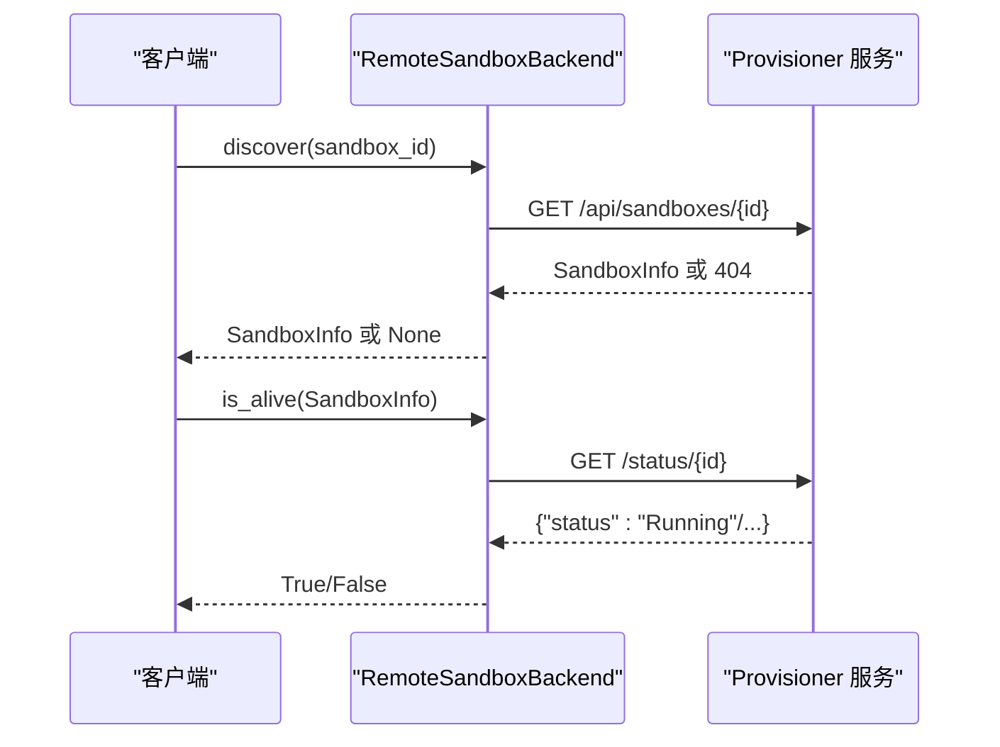
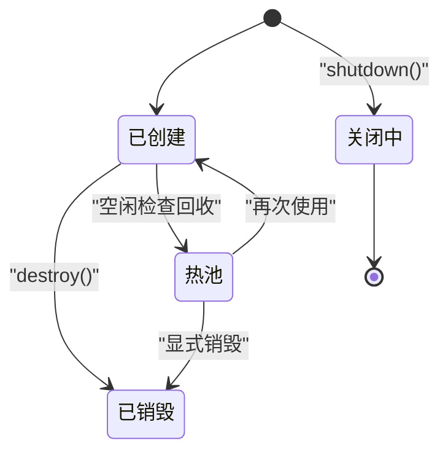
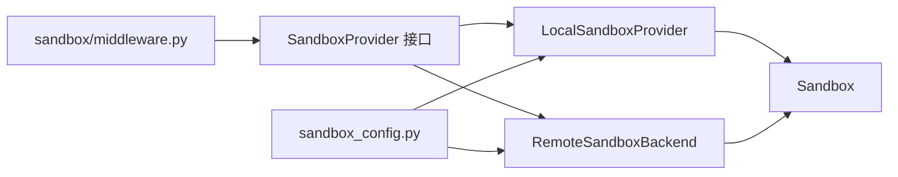

# 沙箱提供者

<cite>
**本文引用的文件**
- [sandbox_provider.py](file://backend/packages/harness/deerflow/sandbox/sandbox_provider.py)
- [sandbox.py](file://backend/packages/harness/deerflow/sandbox/sandbox.py)
- [__init__.py](file://backend/packages/harness/deerflow/sandbox/__init__.py)
- [local_sandbox_provider.py](file://backend/packages/harness/deerflow/sandbox/local/local_sandbox_provider.py)
- [backend.py](file://backend/packages/harness/deerflow/community/aio_sandbox/backend.py)
- [aio_sandbox_provider.py](file://backend/packages/harness/deerflow/community/aio_sandbox/aio_sandbox_provider.py)
- [test_local_sandbox_virtual_path_contract.py](file://backend/tests/test_local_sandbox_virtual_path_contract.py)
- [test_local_sandbox_provider_mounts.py](file://backend/tests/test_local_sandbox_provider_mounts.py)
- [test_remote_sandbox_backend.py](file://backend/tests/test_remote_sandbox_backend.py)
- [sandbox_config.py](file://backend/packages/harness/deerflow/config/sandbox_config.py)
- [middleware.py](file://backend/packages/harness/deerflow/sandbox/middleware.py)
</cite>

## 目录
1. [简介](#简介)
2. [项目结构](#项目结构)
3. [核心组件](#核心组件)
4. [架构总览](#架构总览)
5. [详细组件分析](#详细组件分析)
6. [依赖关系分析](#依赖关系分析)
7. [性能考量](#性能考量)
8. [故障排查指南](#故障排查指南)
9. [结论](#结论)
10. [附录](#附录)

## 简介
本文件围绕“沙箱提供者”的设计与实现进行系统化说明，覆盖抽象接口、实现策略、资源管理、生命周期、配置与部署、以及与中间件的集成与性能优化。重点包含：
- 抽象接口与默认提供者管理（全局单例、重置、关闭）
- 本地沙箱提供者：Docker 容器管理、文件系统挂载策略、虚拟路径契约
- 远程沙箱提供者：后端抽象、服务发现、健康检查、跨进程恢复
- 沙箱实例生命周期：创建、启动、停止、销毁
- 配置与部署：环境准备、参数设置、故障排除
- 中间件集成与性能优化策略

## 项目结构
沙箱相关代码主要位于后端 harness 包中，核心模块如下：
- 抽象与默认提供者：sandbox_provider.py
- 沙箱对象定义：sandbox.py
- 导出入口：sandbox/__init__.py
- 本地提供者：sandbox/local/local_sandbox_provider.py
- 远程后端抽象：community/aio_sandbox/backend.py
- 异步提供者实现：community/aio_sandbox/aio_sandbox_provider.py
- 测试用例：tests 下多条与本地/远程沙箱相关的测试
- 配置：config/sandbox_config.py
- 中间件：sandbox/middleware.py

图表来源
- [__init__.py:1-8](file://backend/packages/harness/deerflow/sandbox/__init__.py#L1-L8)
- [sandbox_provider.py:1-121](file://backend/packages/harness/deerflow/sandbox/sandbox_provider.py#L1-L121)
- [sandbox.py:1-200](file://backend/packages/harness/deerflow/sandbox/sandbox.py#L1-L200)
- [local_sandbox_provider.py:1-200](file://backend/packages/harness/deerflow/sandbox/local/local_sandbox_provider.py#L1-L200)
- [backend.py:80-140](file://backend/packages/harness/deerflow/community/aio_sandbox/backend.py#L80-L140)
- [aio_sandbox_provider.py:632-899](file://backend/packages/harness/deerflow/community/aio_sandbox/aio_sandbox_provider.py#L632-L899)
- [sandbox_config.py:1-200](file://backend/packages/harness/deerflow/config/sandbox_config.py#L1-L200)
- [middleware.py:1-200](file://backend/packages/harness/deerflow/sandbox/middleware.py#L1-L200)

章节来源
- [__init__.py:1-8](file://backend/packages/harness/deerflow/sandbox/__init__.py#L1-L8)
- [sandbox_provider.py:1-121](file://backend/packages/harness/deerflow/sandbox/sandbox_provider.py#L1-L121)

## 核心组件
- 抽象接口与默认提供者
  - 提供统一的 acquire/get/destroy/is_alive/discover/list_running/reset/shutdown/set_sandbox_provider 等方法签名
  - 默认提供者为全局单例，支持 reset 以刷新配置/挂载缓存；shutdown 用于安全释放所有沙箱
- 沙箱对象
  - 封装对容器内文件系统、命令执行、glob 搜索等能力的访问，并处理虚拟路径解析与权限控制
- 本地提供者
  - 基于容器运行时（如 Docker）管理沙箱生命周期，支持路径映射、只读/可写控制、隔离策略
- 远程提供者
  - 通过后端抽象对接外部沙箱集群，支持服务发现、健康检查、跨进程恢复
- 中间件
  - 在请求链路中注入沙箱上下文，确保工具调用与安全策略一致

章节来源
- [sandbox_provider.py:1-121](file://backend/packages/harness/deerflow/sandbox/sandbox_provider.py#L1-L121)
- [sandbox.py:1-200](file://backend/packages/harness/deerflow/sandbox/sandbox.py#L1-L200)
- [middleware.py:1-200](file://backend/packages/harness/deerflow/sandbox/middleware.py#L1-L200)

## 架构总览
沙箱提供者采用“抽象接口 + 多实现”的分层设计：
- 接口层：SandboxProvider 抽象
- 实现层：LocalSandboxProvider（本地）、RemoteSandboxBackend 及其异步实现
- 资源层：容器/进程/网络/存储由具体后端负责
- 生命周期层：acquire → get → 使用 → destroy 或 warm pool 管理
- 安全与隔离：虚拟路径契约、只读挂载、跨线程/进程锁

图表来源
- [sandbox_provider.py:1-121](file://backend/packages/harness/deerflow/sandbox/sandbox_provider.py#L1-L121)
- [sandbox.py:1-200](file://backend/packages/harness/deerflow/sandbox/sandbox.py#L1-L200)
- [local_sandbox_provider.py:1-200](file://backend/packages/harness/deerflow/sandbox/local/local_sandbox_provider.py#L1-L200)
- [backend.py:80-140](file://backend/packages/harness/deerflow/community/aio_sandbox/backend.py#L80-L140)

## 详细组件分析

### 抽象接口与默认提供者管理
- 默认提供者单例与替换
  - set_sandbox_provider 可注入自定义或测试用提供者
  - reset 会清理模块级缓存（例如本地提供者的单例缓存），使配置变更生效
  - shutdown 会逐个销毁活跃沙箱与热池中的沙箱，停止空闲检查线程
- 生命周期钩子
  - reset：在不终止应用的情况下刷新配置/挂载
  - shutdown：优雅释放资源，避免孤儿沙箱

图表来源
- [sandbox_provider.py:84-121](file://backend/packages/harness/deerflow/sandbox/sandbox_provider.py#L84-L121)

章节来源
- [sandbox_provider.py:84-121](file://backend/packages/harness/deerflow/sandbox/sandbox_provider.py#L84-L121)

### 本地沙箱提供者
- 容器管理与隔离
  - 通过容器运行时创建/销毁沙箱，支持跨进程文件锁保证同一 thread_id 的并发安全
  - 支持热池（warm pool）减少频繁创建开销
- 文件系统挂载与虚拟路径契约
  - 通过 PathMapping 控制容器内路径到宿主路径的映射，支持只读/可写组合
  - 虚拟路径契约要求：对外暴露的路径前缀（如 /mnt/user-data）应被解析回宿主真实路径，避免直接写入宿主真实路径
  - glob/list_dir/read_file/write_file/update_file 等操作均需遵循路径映射与只读约束
- 测试验证
  - 虚拟路径契约：写入 /mnt/user-data/uploads 并能正确读取
  - 路径映射一致性：download_file 与 read_file 的路径解析一致
  - 只读挂载与嵌套挂载：父级只读、子级可写的行为符合预期

图表来源
- [test_local_sandbox_virtual_path_contract.py:88-167](file://backend/tests/test_local_sandbox_virtual_path_contract.py#L88-L167)
- [test_local_sandbox_provider_mounts.py:342-476](file://backend/tests/test_local_sandbox_provider_mounts.py#L342-L476)

章节来源
- [test_local_sandbox_virtual_path_contract.py:88-167](file://backend/tests/test_local_sandbox_virtual_path_contract.py#L88-L167)
- [test_local_sandbox_provider_mounts.py:342-476](file://backend/tests/test_local_sandbox_provider_mounts.py#L342-L476)

### 远程沙箱提供者
- 后端抽象
  - 定义 create/destroy/is_alive/discover/list_running 等方法，便于对接不同集群或服务编排系统
- 服务发现与健康检查
  - 通过 provisioner 列表与发现接口枚举/定位沙箱
  - is_alive 仅做轻量检查（如状态码/运行态判断），避免昂贵的全量健康检查
- 跨进程恢复
  - discover 通过确定性 sandbox_id 查找已存在的沙箱连接信息，支持跨进程恢复

图表来源
- [backend.py:86-131](file://backend/packages/harness/deerflow/community/aio_sandbox/backend.py#L86-L131)
- [test_remote_sandbox_backend.py:49-317](file://backend/tests/test_remote_sandbox_backend.py#L49-L317)

章节来源
- [backend.py:86-131](file://backend/packages/harness/deerflow/community/aio_sandbox/backend.py#L86-L131)
- [test_remote_sandbox_backend.py:49-317](file://backend/tests/test_remote_sandbox_backend.py#L49-L317)

### 沙箱实例生命周期
- 创建与获取
  - acquire：根据 thread_id 与 sandbox_id 获取或创建沙箱，必要时加锁防止冲突
  - get：返回对应 Sandbox 实例
- 使用
  - 通过 Sandbox 对象执行文件读写、命令执行、glob 搜索、目录列举等
- 销毁与回收
  - destroy：销毁指定沙箱并释放资源
  - shutdown：销毁所有活跃与热池中的沙箱，停止空闲检查线程
- 热池与空闲检查
  - 异步提供者维护热池，空闲检查线程定期回收长时间未使用的沙箱

图表来源
- [aio_sandbox_provider.py:870-899](file://backend/packages/harness/deerflow/community/aio_sandbox/aio_sandbox_provider.py#L870-L899)

章节来源
- [aio_sandbox_provider.py:632-899](file://backend/packages/harness/deerflow/community/aio_sandbox/aio_sandbox_provider.py#L632-L899)

### 配置与部署指南
- 环境准备
  - 本地提供者：需要可用的容器运行时（如 Docker），具备拉起容器与挂载卷的能力
  - 远程提供者：需要可访问的 provisioner 服务与沙箱集群
- 参数设置
  - 通过 sandbox_config.py 配置沙箱行为（如挂载策略、超时、热池大小等）
  - 本地提供者：PathMapping、只读/可写、隔离策略
  - 远程提供者：provisioner 地址、健康检查间隔、发现策略
- 故障排除
  - 本地：检查容器运行状态、挂载权限、路径映射是否冲突
  - 远程：检查 provisioner 列表/发现接口、网络连通性、沙箱状态码

章节来源
- [sandbox_config.py:1-200](file://backend/packages/harness/deerflow/config/sandbox_config.py#L1-L200)

### 与中间件的集成与性能优化
- 中间件集成
  - 通过 sandbox/middleware.py 在请求链路中注入沙箱上下文，确保工具调用与安全策略一致
- 性能优化策略
  - 热池复用：减少频繁创建销毁的开销
  - 轻量健康检查：is_alive 仅做快速判断，避免阻塞
  - 虚拟路径解析缓存：减少重复映射计算
  - 跨进程文件锁：避免并发创建冲突导致的失败重试

章节来源
- [middleware.py:1-200](file://backend/packages/harness/deerflow/sandbox/middleware.py#L1-L200)

## 依赖关系分析
- 组件耦合
  - SandboxProvider 与 Sandbox 解耦，便于替换实现
  - 本地/远程提供者均实现同一接口，降低上层调用复杂度
- 外部依赖
  - 本地提供者依赖容器运行时与文件系统权限
  - 远程提供者依赖 provisioner 服务与网络连通性
- 循环依赖
  - 当前结构无明显循环依赖，接口层清晰

图表来源
- [sandbox_provider.py:1-121](file://backend/packages/harness/deerflow/sandbox/sandbox_provider.py#L1-L121)
- [local_sandbox_provider.py:1-200](file://backend/packages/harness/deerflow/sandbox/local/local_sandbox_provider.py#L1-L200)
- [backend.py:80-140](file://backend/packages/harness/deerflow/community/aio_sandbox/backend.py#L80-L140)
- [sandbox_config.py:1-200](file://backend/packages/harness/deerflow/config/sandbox_config.py#L1-L200)
- [middleware.py:1-200](file://backend/packages/harness/deerflow/sandbox/middleware.py#L1-L200)

## 性能考量
- 热池与空闲检查
  - 通过热池减少创建销毁成本，空闲检查线程定期回收闲置沙箱
- 轻量健康检查
  - is_alive 仅做状态查询，避免昂贵的全量校验
- 虚拟路径解析
  - 保持路径映射一致性，减少 IO 错误与重试
- 并发控制
  - 跨进程文件锁避免竞争，提升稳定性

## 故障排查指南
- 本地沙箱
  - 写入失败：检查只读挂载与路径映射，确认虚拟路径契约
  - 文件不存在：确认 glob/list_dir 的模式与容器内真实路径
- 远程沙箱
  - 发现失败：检查 provisioner 列表接口与沙箱状态
  - 健康检查异常：确认网络连通性与状态码
- 默认提供者问题
  - 配置不生效：调用 reset 或 shutdown 后重新初始化
  - 资源泄漏：确保在应用退出时调用 shutdown

章节来源
- [test_local_sandbox_virtual_path_contract.py:88-167](file://backend/tests/test_local_sandbox_virtual_path_contract.py#L88-L167)
- [test_local_sandbox_provider_mounts.py:342-476](file://backend/tests/test_local_sandbox_provider_mounts.py#L342-L476)
- [test_remote_sandbox_backend.py:49-317](file://backend/tests/test_remote_sandbox_backend.py#L49-L317)
- [sandbox_provider.py:84-121](file://backend/packages/harness/deerflow/sandbox/sandbox_provider.py#L84-L121)

## 结论
沙箱提供者通过抽象接口与多实现策略，实现了本地与远程两种运行模式的统一接入。本地提供者强调容器与文件系统挂载的安全与隔离，远程提供者强调服务发现与健康检查的可靠性。配合热池、轻量健康检查与虚拟路径契约，整体在易用性、安全性与性能之间取得平衡。

## 附录
- 相关测试用例可作为行为参考与回归保障
- 配置项建议结合实际环境调整，优先保证路径映射与只读策略满足业务需求