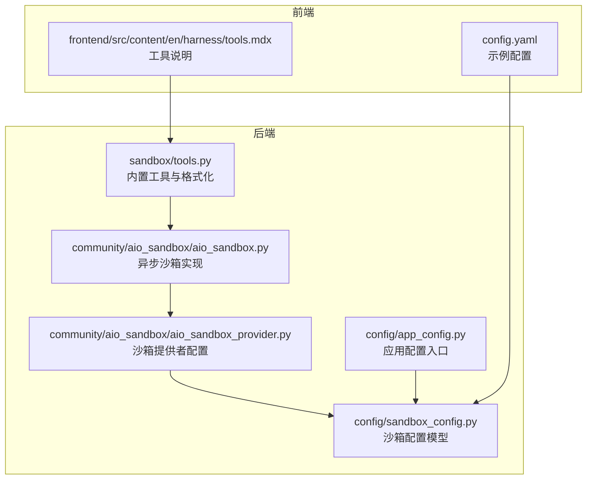
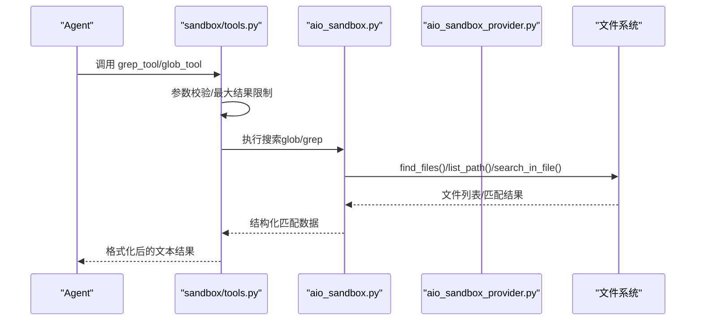
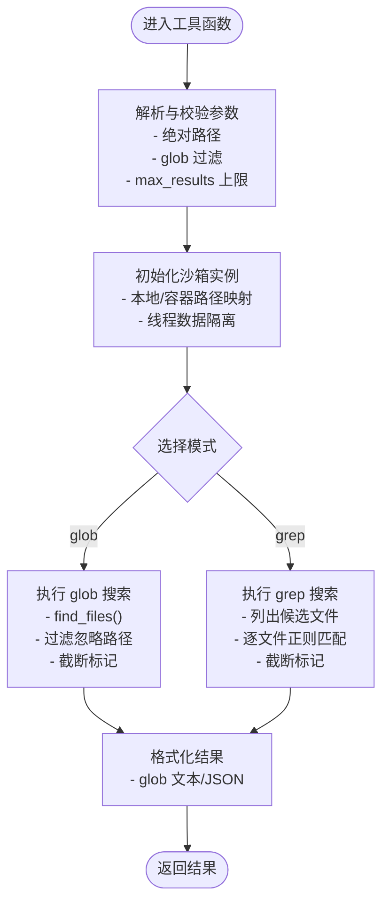
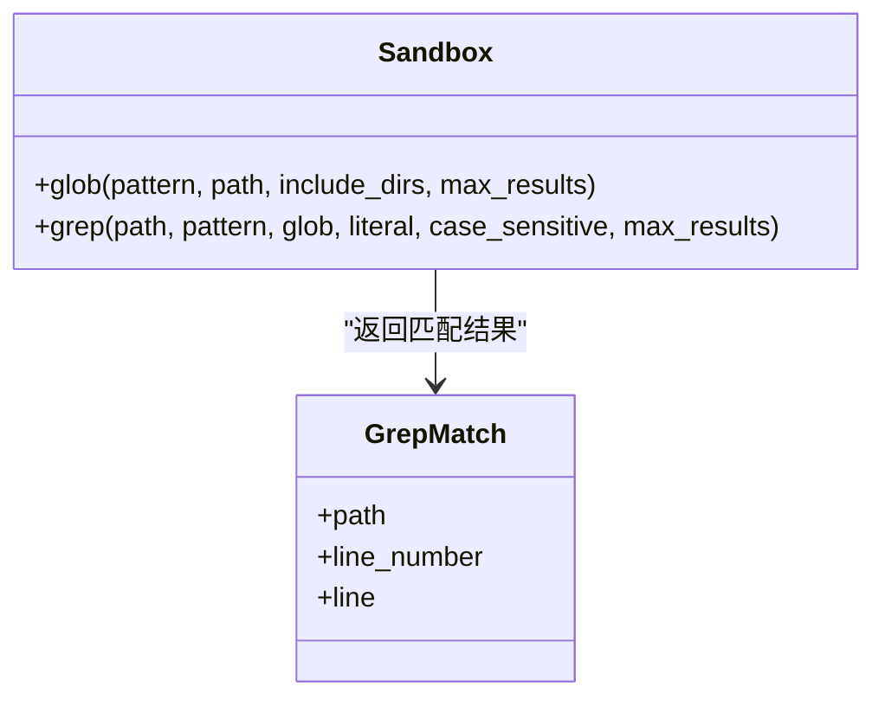
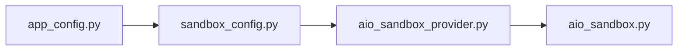
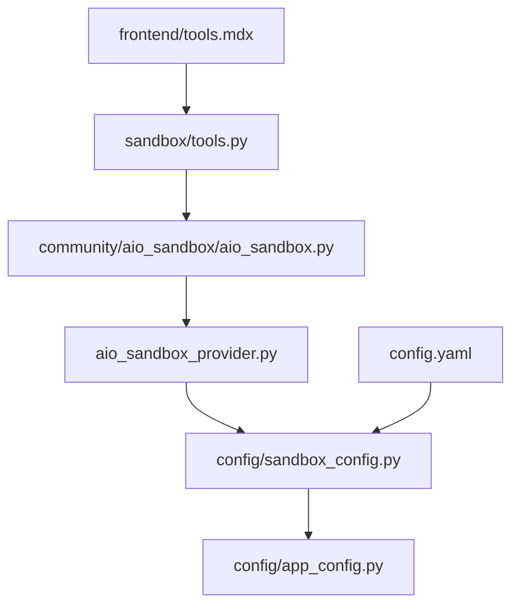

# 沙箱搜索功能

<cite>
**本文引用的文件**
- [tools.py](file://backend/packages/harness/deerflow/sandbox/tools.py)
- [aio_sandbox.py](file://backend/packages/harness/deerflow/community/aio_sandbox/aio_sandbox.py)
- [aio_sandbox_provider.py](file://backend/packages/harness/deerflow/community/aio_sandbox/aio_sandbox_provider.py)
- [sandbox_config.py](file://backend/packages/harness/deerflow/config/sandbox_config.py)
- [app_config.py](file://backend/packages/harness/deerflow/config/app_config.py)
- [rfc-grep-glob-tools.md](file://backend/docs/rfc-grep-grep-glob-tools.md)
- [tools.mdx](file://frontend/src/content/en/harness/tools.mdx)
- [config.yaml](file://config.yaml)
</cite>

## 目录
1. [简介](#简介)
2. [项目结构](#项目结构)
3. [核心组件](#核心组件)
4. [架构总览](#架构总览)
5. [详细组件分析](#详细组件分析)
6. [依赖关系分析](#依赖关系分析)
7. [性能考量](#性能考量)
8. [故障排查指南](#故障排查指南)
9. [结论](#结论)
10. [附录](#附录)

## 简介
本文件系统性阐述 DeerFlow 沙箱搜索功能的实现原理与使用方法，覆盖文件查找算法、内容检索机制、索引管理（概念性）、搜索接口设计（查询语法、过滤条件、排序规则）、性能优化策略（缓存、并发、资源限制）、结果处理与展示（高亮、分页、格式化），以及与文件系统的集成方式与最佳实践。该功能通过内置的 glob/grep 工具，提供安全可控的路径与内容搜索能力，减少对外部 shell 工具的依赖，提升跨环境一致性与安全性。

## 项目结构
沙箱搜索功能主要分布在以下模块：
- 后端沙箱工具层：提供 glob/grep/read_file 等工具函数与异常处理
- 异步沙箱实现：封装底层文件系统访问与搜索逻辑
- 配置层：定义沙箱提供者与挂载点、输出预算等运行时参数
- 前端文档：描述可用工具与配置示例

图表来源
- [tools.py](file://backend/packages/harness/deerflow/sandbox/tools.py)
- [aio_sandbox.py](file://backend/packages/harness/deerflow/community/aio_sandbox/aio_sandbox.py)
- [aio_sandbox_provider.py](file://backend/packages/harness/deerflow/community/aio_sandbox/aio_sandbox_provider.py)
- [sandbox_config.py](file://backend/packages/harness/deerflow/config/sandbox_config.py)
- [app_config.py](file://backend/packages/harness/deerflow/config/app_config.py)
- [tools.mdx](file://frontend/src/content/en/harness/tools.mdx)
- [config.yaml](file://config.yaml)

章节来源
- [tools.py](file://backend/packages/harness/deerflow/sandbox/tools.py)
- [aio_sandbox.py](file://backend/packages/harness/deerflow/community/aio_sandbox/aio_sandbox.py)
- [aio_sandbox_provider.py](file://backend/packages/harness/deerflow/community/aio_sandbox/aio_sandbox_provider.py)
- [sandbox_config.py](file://backend/packages/harness/deerflow/config/sandbox_config.py)
- [app_config.py](file://backend/packages/harness/deerflow/config/app_config.py)
- [tools.mdx](file://frontend/src/content/en/harness/tools.mdx)
- [config.yaml](file://config.yaml)

## 核心组件
- 沙箱工具层（glob/grep/read_file）
  - 提供统一的工具接口，负责参数校验、最大结果数限制、错误处理与结果格式化
  - 支持同步与异步两种调用形态
- 异步沙箱实现
  - 封装底层文件系统访问，包含 glob 与 grep 的具体实现
  - 提供路径过滤、忽略规则、结果截断等能力
- 沙箱提供者与配置
  - 定义容器/本地沙箱的启动参数、挂载点、环境变量等
  - 与应用配置集成，确保运行时一致性
- 前端工具文档
  - 描述工具用途、参数与配置示例，便于用户理解与使用

章节来源
- [tools.py](file://backend/packages/harness/deerflow/sandbox/tools.py)
- [aio_sandbox.py](file://backend/packages/harness/deerflow/community/aio_sandbox/aio_sandbox.py)
- [aio_sandbox_provider.py](file://backend/packages/harness/deerflow/community/aio_sandbox/aio_sandbox_provider.py)
- [sandbox_config.py](file://backend/packages/harness/deerflow/config/sandbox_config.py)
- [tools.mdx](file://frontend/src/content/en/harness/tools.mdx)

## 架构总览
下图展示了从工具调用到文件系统访问的整体流程，以及与配置层的交互：

图表来源
- [tools.py](file://backend/packages/harness/deerflow/sandbox/tools.py)
- [aio_sandbox.py](file://backend/packages/harness/deerflow/community/aio_sandbox/aio_sandbox.py)
- [aio_sandbox_provider.py](file://backend/packages/harness/deerflow/community/aio_sandbox/aio_sandbox_provider.py)

## 详细组件分析

### 组件A：工具层（glob/grep/read_file）
- 功能职责
  - glob：按 glob 模式在指定根路径下查找文件，支持包含目录、结果上限与截断标记
  - grep：在指定根路径下按模式搜索文件内容，支持正则/字面量、大小写敏感、glob 过滤、最大结果数
  - read_file：读取文件内容，支持行区间裁剪
- 关键实现要点
  - 参数解析与校验：路径必须为绝对路径；glob 过滤用于缩小候选集；max_results 控制输出规模
  - 错误处理：捕获并格式化多种异常（如权限不足、路径不存在、正则非法等）
  - 结果格式化：glob 返回路径列表；grep 返回“路径:行号:命中行摘要”列表
  - 异步适配：提供 coroutine 形态，确保在异步沙箱初始化后执行同步逻辑
- 复杂度与性能
  - glob：时间复杂度近似 O(N)，N 为候选文件数量；空间复杂度 O(M)，M 为匹配结果数
  - grep：时间复杂度近似 O(N×L)，N 为候选文件数，L 为平均文件行数；空间复杂度 O(M)

图表来源
- [tools.py](file://backend/packages/harness/deerflow/sandbox/tools.py)

章节来源
- [tools.py](file://backend/packages/harness/deerflow/sandbox/tools.py)

### 组件B：异步沙箱实现（glob/grep）
- 功能职责
  - glob：调用底层 find_files 接口，过滤忽略路径，支持 include_dirs 与 max_results
  - grep：根据 glob 或递归列出候选文件，逐文件执行 search_in_file，聚合匹配结果并截断
- 关键实现要点
  - 路径过滤：统一忽略规则，避免与 ls/glob 行为不一致
  - 结果聚合：按文件路径与行号排序，保证输出稳定性
  - 截断策略：达到 max_results 后立即停止，返回 truncated 标记
  - 本地路径掩蔽：在本地沙箱中对输出路径进行掩蔽，保护宿主真实路径
- 数据结构
  - GrepMatch：包含 path、line_number、line 三个字段，用于承载单条匹配记录

图表来源
- [aio_sandbox.py](file://backend/packages/harness/deerflow/community/aio_sandbox/aio_sandbox.py)

章节来源
- [aio_sandbox.py](file://backend/packages/harness/deerflow/community/aio_sandbox/aio_sandbox.py)

### 组件C：沙箱提供者与配置
- 功能职责
  - 定义沙箱提供者（本地/容器）的启动参数、镜像、端口、挂载点、环境变量等
  - 与应用配置集成，确保运行时参数的一致性
- 关键实现要点
  - 配置加载：从 app_config 读取 sandbox 配置并传递给提供者
  - 挂载点：支持将宿主目录挂载到沙箱内，确保工具可访问目标路径
  - 环境变量：支持动态解析与注入，满足不同运行环境需求

图表来源
- [app_config.py](file://backend/packages/harness/deerflow/config/app_config.py)
- [sandbox_config.py](file://backend/packages/harness/deerflow/config/sandbox_config.py)
- [aio_sandbox_provider.py](file://backend/packages/harness/deerflow/community/aio_sandbox/aio_sandbox_provider.py)

章节来源
- [app_config.py](file://backend/packages/harness/deerflow/config/app_config.py)
- [sandbox_config.py](file://backend/packages/harness/deerflow/config/sandbox_config.py)
- [aio_sandbox_provider.py](file://backend/packages/harness/deerflow/community/aio_sandbox/aio_sandbox_provider.py)

### 组件D：搜索接口设计与规范
- 查询语法与过滤条件
  - glob：支持标准 glob 模式，如 **/*.py、src/**/test_*.ts 等
  - grep：支持正则或字面量匹配，大小写可配置；可通过 glob 缩小候选文件集合
- 排序规则
  - 建议按文件路径与行号排序，保证输出稳定
- 返回格式
  - glob：返回路径列表，支持包含目录与不包含目录两种模式
  - grep：返回“路径:行号:命中行摘要”列表，避免返回整段文件内容
- 最大结果数
  - 通过 max_results 控制输出规模，防止上下文溢出

章节来源
- [rfc-grep-glob-tools.md](file://backend/docs/rfc-grep-glob-tools.md)
- [tools.py](file://backend/packages/harness/deerflow/sandbox/tools.py)

### 组件E：结果处理与展示
- 高亮显示
  - 建议在前端对命中关键词进行高亮，提升可读性
- 分页机制
  - 建议在前端对长列表进行分页展示，结合 max_results 控制单页规模
- 格式化输出
  - grep 返回“路径:行号:命中行摘要”，便于后续调用 read_file 获取上下文

章节来源
- [rfc-grep-glob-tools.md](file://backend/docs/rfc-grep-glob-tools.md)
- [tools.py](file://backend/packages/harness/deerflow/sandbox/tools.py)

## 依赖关系分析
- 组件耦合
  - 工具层依赖异步沙箱实现；异步沙箱实现依赖沙箱提供者与配置
  - 前端文档与配置示例为用户提供使用指引
- 外部依赖
  - 文件系统访问通过沙箱抽象屏蔽底层差异
  - 正则表达式引擎来自 Python 标准库，保证跨平台一致性

图表来源
- [tools.py](file://backend/packages/harness/deerflow/sandbox/tools.py)
- [aio_sandbox.py](file://backend/packages/harness/deerflow/community/aio_sandbox/aio_sandbox.py)
- [aio_sandbox_provider.py](file://backend/packages/harness/deerflow/community/aio_sandbox/aio_sandbox_provider.py)
- [sandbox_config.py](file://backend/packages/harness/deerflow/config/sandbox_config.py)
- [app_config.py](file://backend/packages/harness/deerflow/config/app_config.py)
- [tools.mdx](file://frontend/src/content/en/harness/tools.mdx)
- [config.yaml](file://config.yaml)

章节来源
- [tools.py](file://backend/packages/harness/deerflow/sandbox/tools.py)
- [aio_sandbox.py](file://backend/packages/harness/deerflow/community/aio_sandbox/aio_sandbox.py)
- [aio_sandbox_provider.py](file://backend/packages/harness/deerflow/community/aio_sandbox/aio_sandbox_provider.py)
- [sandbox_config.py](file://backend/packages/harness/deerflow/config/sandbox_config.py)
- [app_config.py](file://backend/packages/harness/deerflow/config/app_config.py)
- [tools.mdx](file://frontend/src/content/en/harness/tools.mdx)
- [config.yaml](file://config.yaml)

## 性能考量
- 缓存机制
  - 建议在工具层对近期相同查询结果进行短期缓存，降低重复扫描成本
- 并发处理
  - grep 采用逐文件扫描，建议在候选文件较多时启用并发扫描（需注意线程/进程池大小与 I/O 抖动）
- 资源限制
  - 严格设置 max_results 与文件大小上限，避免大文件与超大仓库拖慢整体性能
  - 通过 glob 过滤候选集，减少不必要的扫描
- 输出预算
  - 结合工具输出预算中间件，控制单次工具调用的输出长度，避免超出上下文限制

章节来源
- [rfc-grep-glob-tools.md](file://backend/docs/rfc-grep-glob-tools.md)
- [tools.py](file://backend/packages/harness/deerflow/sandbox/tools.py)

## 故障排查指南
- 常见错误与处理
  - 权限不足：检查沙箱挂载点与路径权限，确认工具组具备 file:read 权限
  - 路径不存在：确认传入绝对路径且位于授权范围内
  - 正则非法：检查正则表达式语法，或切换为 literal=True
  - 结果过多：调整 max_results 或添加更严格的 glob 过滤
- 日志与调试
  - 工具层对异常进行格式化输出，便于定位问题
  - 建议开启沙箱提供者的日志级别，观察底层文件系统访问情况

章节来源
- [tools.py](file://backend/packages/harness/deerflow/sandbox/tools.py)

## 结论
沙箱搜索功能通过内置的 glob/grep 工具，提供了安全、可控、跨环境一致的文件查找与内容检索能力。其设计遵循最小可用原则，强调结构化输出与结果上限控制，既满足模型高效探索的需求，又避免了对外部 shell 工具的强依赖。配合合理的配置与性能优化策略，可在大型仓库场景下保持良好的响应速度与稳定性。

## 附录

### 配置与定制指南
- 工具启用
  - 在配置中启用 deerflow.sandbox.tools 下的 glob/grep 工具
- 沙箱挂载
  - 通过 sandbox.mounts 将宿主目录挂载到沙箱内，确保工具可访问目标路径
- 输出预算
  - 结合工具输出预算中间件，合理设置单次调用的最大输出长度
- 查询优化
  - 优先使用 glob 缩小候选集，再用 grep 精确匹配
  - 对于大文件，建议先用 grep 获取关键行，再用 read_file 获取上下文

章节来源
- [tools.mdx](file://frontend/src/content/en/harness/tools.mdx)
- [config.yaml](file://config.yaml)
- [aio_sandbox_provider.py](file://backend/packages/harness/deerflow/community/aio_sandbox/aio_sandbox_provider.py)