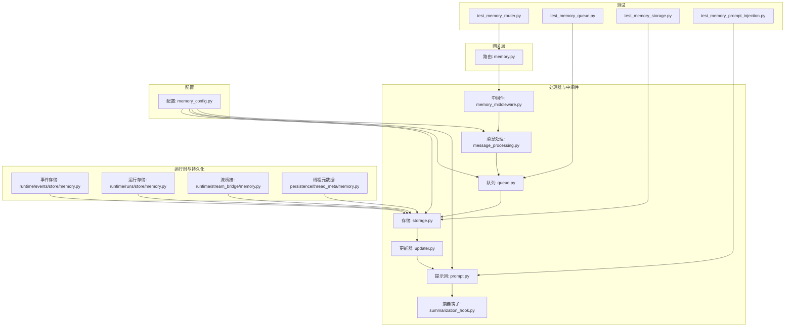
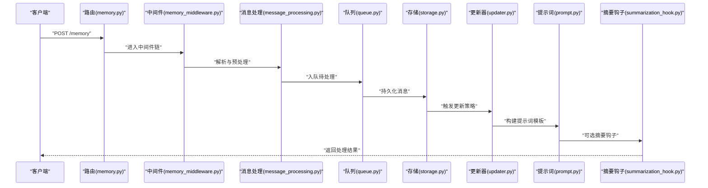
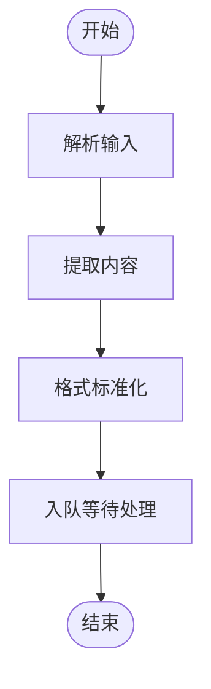
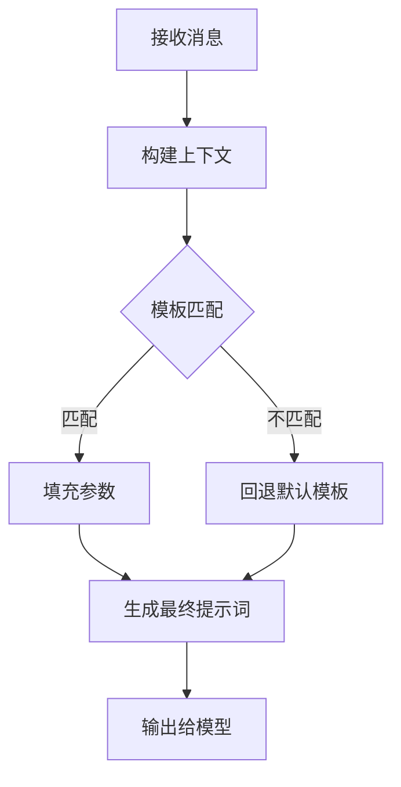
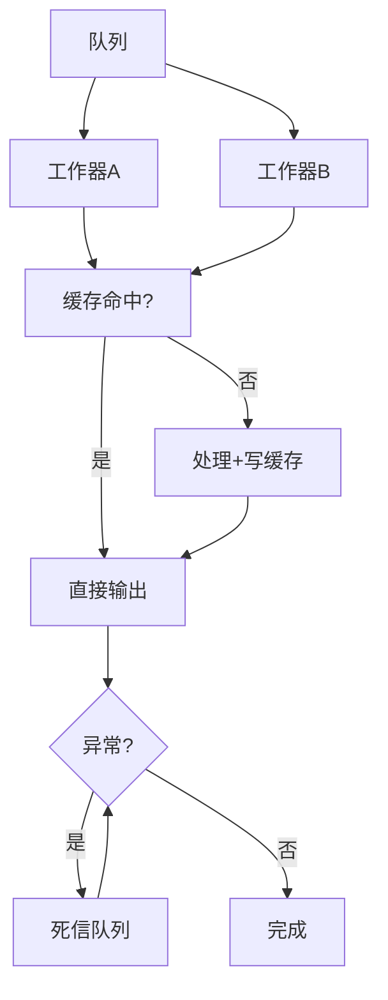
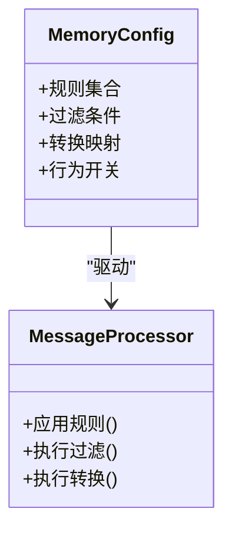
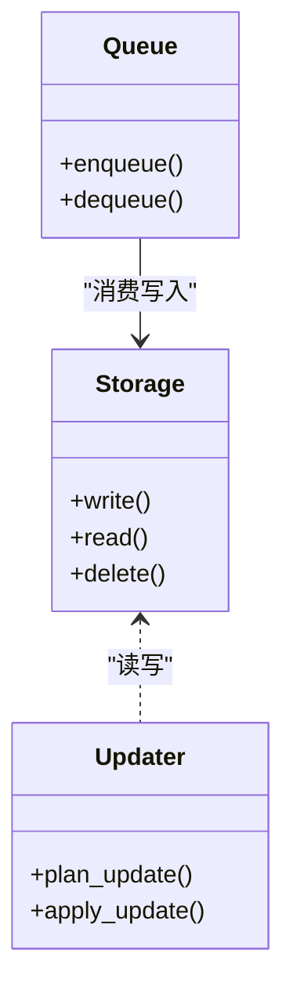
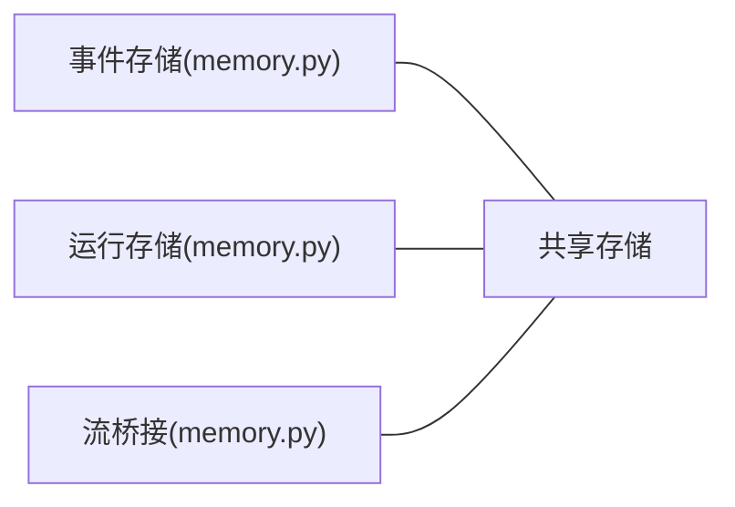
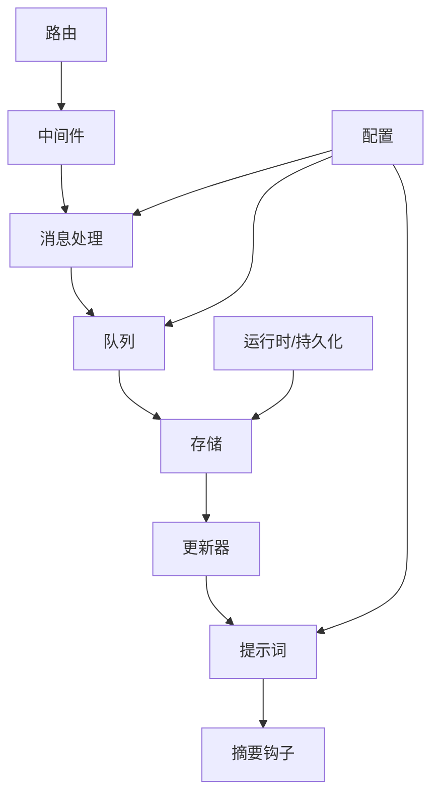

# 记忆处理

<cite>
**本文引用的文件**
- [memory.py](file://backend/app/gateway/routers/memory.py)
- [message_processing.py](file://backend/packages/harness/deerflow/agents/memory/message_processing.py)
- [prompt.py](file://backend/packages/harness/deerflow/agents/memory/prompt.py)
- [queue.py](file://backend/packages/harness/deerflow/agents/memory/queue.py)
- [storage.py](file://backend/packages/harness/deerflow/agents/memory/storage.py)
- [summarization_hook.py](file://backend/packages/harness/deerflow/agents/memory/summarization_hook.py)
- [updater.py](file://backend/packages/harness/deerflow/agents/memory/updater.py)
- [memory_middleware.py](file://backend/packages/harness/deerflow/agents/middlewares/memory_middleware.py)
- [memory_config.py](file://backend/packages/harness/deerflow/config/memory_config.py)
- [memory.py](file://backend/packages/harness/deerflow/persistence/thread_meta/memory.py)
- [memory.py](file://backend/packages/harness/deerflow/runtime/events/store/memory.py)
- [memory.py](file://backend/packages/harness/deerflow/runtime/runs/store/memory.py)
- [memory.py](file://backend/packages/harness/deerflow/runtime/stream_bridge/memory.py)
- [test_memory_prompt_injection.py](file://backend/tests/test_memory_prompt_injection.py)
- [test_memory_queue.py](file://backend/tests/test_memory_queue.py)
- [test_memory_queue_user_isolation.py](file://backend/tests/test_memory_queue_user_isolation.py)
- [test_memory_router.py](file://backend/tests/test_memory_router.py)
- [test_memory_storage.py](file://backend/tests/test_memory_storage.py)
- [test_memory_storage_user_isolation.py](file://backend/tests/test_memory_storage_user_isolation.py)
</cite>

## 目录
1. [引言](#引言)
2. [项目结构](#项目结构)
3. [核心组件](#核心组件)
4. [架构总览](#架构总览)
5. [详细组件分析](#详细组件分析)
6. [依赖关系分析](#依赖关系分析)
7. [性能考虑](#性能考虑)
8. [故障排查指南](#故障排查指南)
9. [结论](#结论)
10. [附录](#附录)

## 引言
本文件系统性阐述 deer-flow 记忆处理子系统的设计与实现，覆盖消息处理流水线（解析、内容提取、格式标准化）、提示词生成机制（模板系统、上下文构建、动态参数注入）、处理流程优化（并行处理、缓存机制、错误恢复）、处理策略配置（规则、过滤条件、转换映射），以及监控与调试方法和扩展性设计。目标是帮助开发者与运维人员快速理解并高效使用该系统。

## 项目结构
记忆处理相关代码主要分布在以下模块：
- 网关路由：对外暴露记忆相关的 API 接口
- 处理器与中间件：负责消息解析、队列、存储、更新与提示词生成
- 配置：集中管理记忆处理策略与行为参数
- 运行时与持久化：事件、运行记录、流桥接等内存存储实现
- 测试：验证提示词注入、队列、存储及隔离性等关键行为

**图表来源**
- [memory.py](file://backend/app/gateway/routers/memory.py)
- [memory_middleware.py](file://backend/packages/harness/deerflow/agents/middlewares/memory_middleware.py)
- [message_processing.py](file://backend/packages/harness/deerflow/agents/memory/message_processing.py)
- [queue.py](file://backend/packages/harness/deerflow/agents/memory/queue.py)
- [storage.py](file://backend/packages/harness/deerflow/agents/memory/storage.py)
- [updater.py](file://backend/packages/harness/deerflow/agents/memory/updater.py)
- [prompt.py](file://backend/packages/harness/deerflow/agents/memory/prompt.py)
- [summarization_hook.py](file://backend/packages/harness/deerflow/agents/memory/summarization_hook.py)
- [memory_config.py](file://backend/packages/harness/deerflow/config/memory_config.py)
- [memory.py](file://backend/packages/harness/deerflow/runtime/events/store/memory.py)
- [memory.py](file://backend/packages/harness/deerflow/runtime/runs/store/memory.py)
- [memory.py](file://backend/packages/harness/deerflow/runtime/stream_bridge/memory.py)
- [memory.py](file://backend/packages/harness/deerflow/persistence/thread_meta/memory.py)
- [test_memory_router.py](file://backend/tests/test_memory_router.py)
- [test_memory_queue.py](file://backend/tests/test_memory_queue.py)
- [test_memory_storage.py](file://backend/tests/test_memory_storage.py)
- [test_memory_prompt_injection.py](file://backend/tests/test_memory_prompt_injection.py)

**章节来源**
- [memory.py](file://backend/app/gateway/routers/memory.py)
- [memory_middleware.py](file://backend/packages/harness/deerflow/agents/middlewares/memory_middleware.py)
- [memory_config.py](file://backend/packages/harness/deerflow/config/memory_config.py)

## 核心组件
- 消息处理流水线：从原始消息输入到标准化输出，包含解析、内容提取与格式标准化
- 提示词生成：基于模板与上下文动态注入参数，支持多轮对话与摘要
- 队列与存储：异步处理与持久化，支持用户隔离与并发安全
- 更新器：根据策略对记忆进行增量更新
- 中间件：在请求链路中注入记忆上下文与执行预处理/后处理
- 配置：集中定义处理规则、过滤条件、转换映射与行为开关

**章节来源**
- [message_processing.py](file://backend/packages/harness/deerflow/agents/memory/message_processing.py)
- [prompt.py](file://backend/packages/harness/deerflow/agents/memory/prompt.py)
- [queue.py](file://backend/packages/harness/deerflow/agents/memory/queue.py)
- [storage.py](file://backend/packages/harness/deerflow/agents/memory/storage.py)
- [updater.py](file://backend/packages/harness/deerflow/agents/memory/updater.py)
- [memory_middleware.py](file://backend/packages/harness/deerflow/agents/middlewares/memory_middleware.py)
- [memory_config.py](file://backend/packages/harness/deerflow/config/memory_config.py)

## 架构总览
记忆处理采用“路由 -> 中间件 -> 处理器 -> 队列 -> 存储 -> 更新器 -> 提示词 -> 摘要钩子”的流水线式架构。配置模块贯穿各环节，统一控制处理策略与行为。运行时与持久化模块为存储提供内存实现，测试模块覆盖关键路径的行为验证。

**图表来源**
- [memory.py](file://backend/app/gateway/routers/memory.py)
- [memory_middleware.py](file://backend/packages/harness/deerflow/agents/middlewares/memory_middleware.py)
- [message_processing.py](file://backend/packages/harness/deerflow/agents/memory/message_processing.py)
- [queue.py](file://backend/packages/harness/deerflow/agents/memory/queue.py)
- [storage.py](file://backend/packages/harness/deerflow/agents/memory/storage.py)
- [updater.py](file://backend/packages/harness/deerflow/agents/memory/updater.py)
- [prompt.py](file://backend/packages/harness/deerflow/agents/memory/prompt.py)
- [summarization_hook.py](file://backend/packages/harness/deerflow/agents/memory/summarization_hook.py)

## 详细组件分析

### 消息处理流水线
- 解析阶段：从输入中抽取结构化字段，识别消息类型与来源渠道
- 内容提取：剥离无关信息，提取关键文本、附件、元数据
- 格式标准化：统一时间戳、编码、字段命名与数据类型，确保后续处理一致性

**图表来源**
- [message_processing.py](file://backend/packages/harness/deerflow/agents/memory/message_processing.py)
- [queue.py](file://backend/packages/harness/deerflow/agents/memory/queue.py)

**章节来源**
- [message_processing.py](file://backend/packages/harness/deerflow/agents/memory/message_processing.py)
- [queue.py](file://backend/packages/harness/deerflow/agents/memory/queue.py)

### 提示词生成机制
- 模板系统：定义可复用的提示词模板，支持占位符与条件分支
- 上下文构建：聚合历史消息、摘要、用户信息与外部知识
- 动态参数注入：根据当前消息与上下文动态替换模板参数，保证个性化与实时性

**图表来源**
- [prompt.py](file://backend/packages/harness/deerflow/agents/memory/prompt.py)
- [memory_middleware.py](file://backend/packages/harness/deerflow/agents/middlewares/memory_middleware.py)

**章节来源**
- [prompt.py](file://backend/packages/harness/deerflow/agents/memory/prompt.py)
- [memory_middleware.py](file://backend/packages/harness/deerflow/agents/middlewares/memory_middleware.py)

### 处理流程优化
- 并行处理：队列与工作器并行消费，提升吞吐；注意幂等与去重
- 缓存机制：热点上下文与模板结果缓存，降低重复计算
- 错误恢复：失败重试、死信队列、降级策略与可观测性告警

**图表来源**
- [queue.py](file://backend/packages/harness/deerflow/agents/memory/queue.py)
- [storage.py](file://backend/packages/harness/deerflow/agents/memory/storage.py)

**章节来源**
- [queue.py](file://backend/packages/harness/deerflow/agents/memory/queue.py)
- [storage.py](file://backend/packages/harness/deerflow/agents/memory/storage.py)

### 处理策略配置
- 处理规则：消息类型白名单/黑名单、长度限制、编码规范
- 过滤条件：关键词过滤、敏感信息屏蔽、重复检测
- 转换映射：字段映射、类型转换、默认值填充
- 行为开关：是否启用摘要、是否缓存、是否并行

**图表来源**
- [memory_config.py](file://backend/packages/harness/deerflow/config/memory_config.py)
- [message_processing.py](file://backend/packages/harness/deerflow/agents/memory/message_processing.py)

**章节来源**
- [memory_config.py](file://backend/packages/harness/deerflow/config/memory_config.py)
- [message_processing.py](file://backend/packages/harness/deerflow/agents/memory/message_processing.py)

### 存储与更新
- 存储接口：抽象消息与元数据的读写，支持多种后端
- 更新策略：按时间窗口、令牌预算或事件触发进行增量更新
- 用户隔离：按用户维度隔离存储，避免交叉污染

**图表来源**
- [storage.py](file://backend/packages/harness/deerflow/agents/memory/storage.py)
- [updater.py](file://backend/packages/harness/deerflow/agents/memory/updater.py)
- [queue.py](file://backend/packages/harness/deerflow/agents/memory/queue.py)

**章节来源**
- [storage.py](file://backend/packages/harness/deerflow/agents/memory/storage.py)
- [updater.py](file://backend/packages/harness/deerflow/agents/memory/updater.py)
- [queue.py](file://backend/packages/harness/deerflow/agents/memory/queue.py)

### 运行时与持久化
- 事件存储：内存实现用于事件流的临时存储与回放
- 运行存储：内存实现用于运行状态与进度的持久化
- 流桥接：内存实现用于流式传输的桥接与缓冲

**图表来源**
- [memory.py](file://backend/packages/harness/deerflow/runtime/events/store/memory.py)
- [memory.py](file://backend/packages/harness/deerflow/runtime/runs/store/memory.py)
- [memory.py](file://backend/packages/harness/deerflow/runtime/stream_bridge/memory.py)

**章节来源**
- [memory.py](file://backend/packages/harness/deerflow/runtime/events/store/memory.py)
- [memory.py](file://backend/packages/harness/deerflow/runtime/runs/store/memory.py)
- [memory.py](file://backend/packages/harness/deerflow/runtime/stream_bridge/memory.py)

## 依赖关系分析
- 路由依赖中间件与处理器；中间件依赖消息处理与提示词模块
- 队列与存储相互解耦，通过接口交互；更新器依赖存储与提示词
- 配置模块被多处读取，形成集中式控制点
- 运行时与持久化模块为存储提供内存实现，便于测试与演示

**图表来源**
- [memory.py](file://backend/app/gateway/routers/memory.py)
- [memory_middleware.py](file://backend/packages/harness/deerflow/agents/middlewares/memory_middleware.py)
- [message_processing.py](file://backend/packages/harness/deerflow/agents/memory/message_processing.py)
- [queue.py](file://backend/packages/harness/deerflow/agents/memory/queue.py)
- [storage.py](file://backend/packages/harness/deerflow/agents/memory/storage.py)
- [updater.py](file://backend/packages/harness/deerflow/agents/memory/updater.py)
- [prompt.py](file://backend/packages/harness/deerflow/agents/memory/prompt.py)
- [summarization_hook.py](file://backend/packages/harness/deerflow/agents/memory/summarization_hook.py)
- [memory_config.py](file://backend/packages/harness/deerflow/config/memory_config.py)
- [memory.py](file://backend/packages/harness/deerflow/runtime/events/store/memory.py)
- [memory.py](file://backend/packages/harness/deerflow/runtime/runs/store/memory.py)
- [memory.py](file://backend/packages/harness/deerflow/runtime/stream_bridge/memory.py)

**章节来源**
- [memory.py](file://backend/app/gateway/routers/memory.py)
- [memory_middleware.py](file://backend/packages/harness/deerflow/agents/middlewares/memory_middleware.py)
- [memory_config.py](file://backend/packages/harness/deerflow/config/memory_config.py)

## 性能考虑
- 并发与背压：队列容量与工作器数量需与下游存储能力匹配，避免阻塞
- 缓存策略：热点上下文与模板结果缓存，减少重复计算；注意缓存失效策略
- 序列化与压缩：消息体序列化与网络传输优化，降低带宽占用
- 资源隔离：用户维度隔离存储与队列，防止资源争用
- 监控与告警：关键指标（延迟、吞吐、错误率、队列长度）可视化与阈值告警

[本节为通用性能指导，无需引用具体文件]

## 故障排查指南
- 提示词注入失败：检查模板是否存在、参数是否缺失、上下文是否为空
- 队列积压：查看队列长度、工作器处理速率与存储写入性能
- 存储异常：确认存储可用性、权限与容量；核对事务与幂等性
- 用户隔离问题：验证用户标识与隔离键，确保数据未交叉
- 回放与重试：利用事件存储与运行存储进行回放定位问题

**章节来源**
- [test_memory_prompt_injection.py](file://backend/tests/test_memory_prompt_injection.py)
- [test_memory_queue.py](file://backend/tests/test_memory_queue.py)
- [test_memory_queue_user_isolation.py](file://backend/tests/test_memory_queue_user_isolation.py)
- [test_memory_router.py](file://backend/tests/test_memory_router.py)
- [test_memory_storage.py](file://backend/tests/test_memory_storage.py)
- [test_memory_storage_user_isolation.py](file://backend/tests/test_memory_storage_user_isolation.py)

## 结论
记忆处理系统以清晰的流水线与模块化设计实现了从消息解析到提示词生成的完整闭环。通过集中式配置与运行时持久化，系统具备良好的可维护性与可扩展性。结合并行处理、缓存与错误恢复机制，能够在高并发场景下保持稳定与高性能。建议在生产环境中完善监控体系与自动化测试，持续优化处理策略与性能指标。

## 附录
- 扩展性：新增消息类型只需扩展解析器与模板；新增存储后端只需实现存储接口
- 定制化：通过配置文件与环境变量灵活调整处理规则与行为开关
- 最佳实践：优先保证幂等与一致性，合理设置缓存与重试策略，持续监控关键指标

[本节为总结性内容，无需引用具体文件]