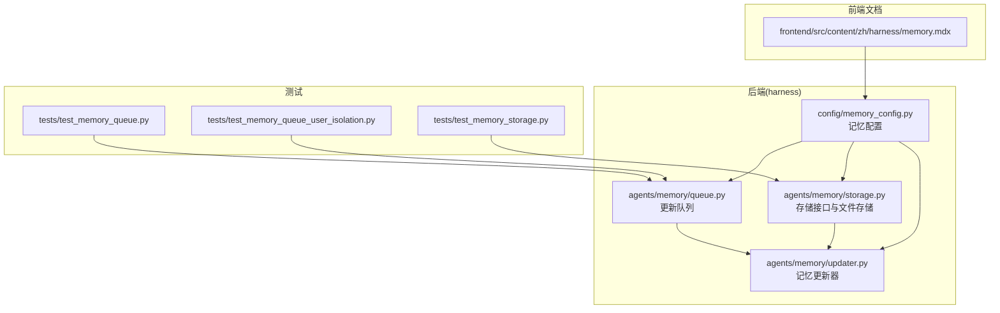
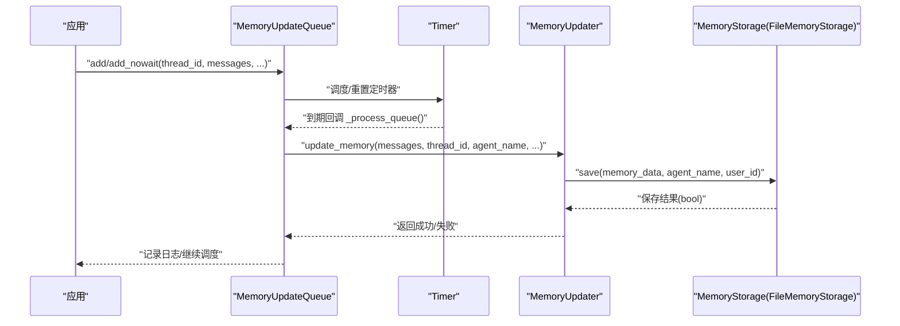
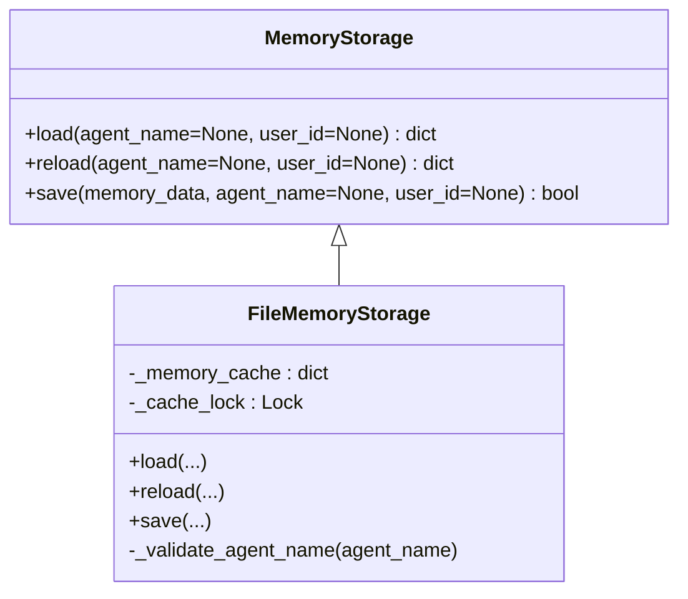
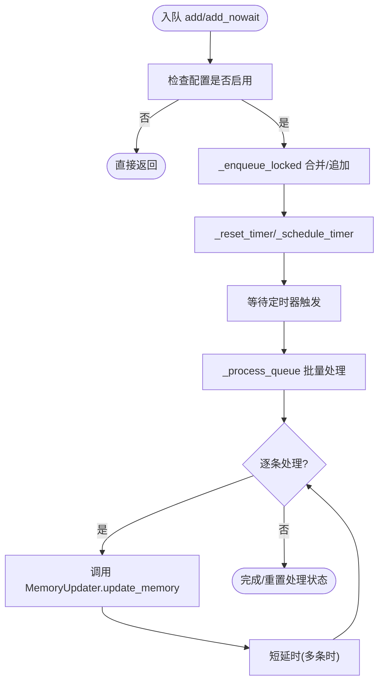
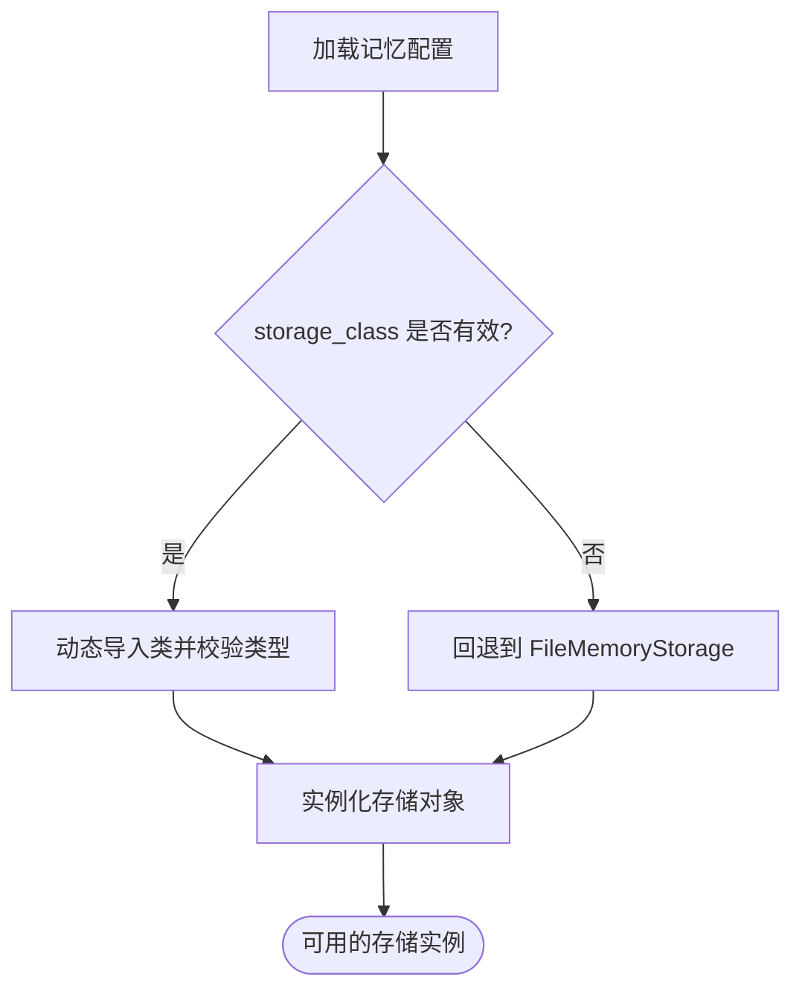
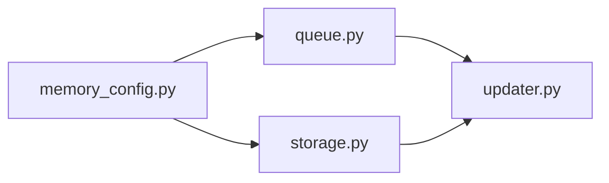

# 记忆存储

<cite>
**本文引用的文件**
- [queue.py](file://backend/packages/harness/deerflow/agents/memory/queue.py)
- [storage.py](file://backend/packages/harness/deerflow/agents/memory/storage.py)
- [updater.py](file://backend/packages/harness/deerflow/agents/memory/updater.py)
- [memory_config.py](file://backend/packages/harness/deerflow/config/memory_config.py)
- [test_memory_queue.py](file://backend/tests/test_memory_queue.py)
- [test_memory_queue_user_isolation.py](file://backend/tests/test_memory_queue_user_isolation.py)
- [test_memory_storage.py](file://backend/tests/test_memory_storage.py)
- [memory.mdx](file://frontend/src/content/zh/harness/memory.mdx)
</cite>

## 目录
1. [简介](#简介)
2. [项目结构](#项目结构)
3. [核心组件](#核心组件)
4. [架构总览](#架构总览)
5. [详细组件分析](#详细组件分析)
6. [依赖关系分析](#依赖关系分析)
7. [性能考量](#性能考量)
8. [故障排查指南](#故障排查指南)
9. [结论](#结论)
10. [附录](#附录)

## 简介
本文件围绕“记忆存储”主题，系统阐述其数据结构设计、消息队列实现原理、存储格式与索引机制、存储引擎选择与配置（内存/持久化/缓存策略）、队列管理（入队/出队/优先级/批量处理）、性能优化（读写/内存/并发）以及配置与调优实践（容量规划/清理/备份/扩展性与可维护性）。文档以仓库中实际代码为依据，结合测试用例与前端文档，帮助读者从实现细节到工程实践全面理解记忆存储子系统。

## 项目结构
记忆存储相关代码主要位于后端 harness 包下的 agents/memory 子模块，并通过配置模块进行统一管理；前端文档提供了配置示例与禁用记忆的说明。

**图表来源**
- [queue.py:1-287](file://backend/packages/harness/deerflow/agents/memory/queue.py#L1-L287)
- [storage.py:1-231](file://backend/packages/harness/deerflow/agents/memory/storage.py#L1-L231)
- [updater.py:1-617](file://backend/packages/harness/deerflow/agents/memory/updater.py#L1-L617)
- [memory_config.py:1-200](file://backend/packages/harness/deerflow/config/memory_config.py#L1-L200)
- [test_memory_queue.py:1-201](file://backend/tests/test_memory_queue.py#L1-L201)
- [test_memory_queue_user_isolation.py:1-79](file://backend/tests/test_memory_queue_user_isolation.py#L1-L79)
- [test_memory_storage.py:143-173](file://backend/tests/test_memory_storage.py#L143-L173)
- [memory.mdx:100-122](file://frontend/src/content/zh/harness/memory.mdx#L100-L122)

**章节来源**
- [queue.py:1-287](file://backend/packages/harness/deerflow/agents/memory/queue.py#L1-L287)
- [storage.py:1-231](file://backend/packages/harness/deerflow/agents/memory/storage.py#L1-L231)
- [updater.py:1-617](file://backend/packages/harness/deerflow/agents/memory/updater.py#L1-L617)
- [memory_config.py:1-200](file://backend/packages/harness/deerflow/config/memory_config.py#L1-L200)
- [test_memory_queue.py:1-201](file://backend/tests/test_memory_queue.py#L1-L201)
- [test_memory_queue_user_isolation.py:1-79](file://backend/tests/test_memory_queue_user_isolation.py#L1-L79)
- [test_memory_storage.py:143-173](file://backend/tests/test_memory_storage.py#L143-L173)
- [memory.mdx:100-122](file://frontend/src/content/zh/harness/memory.mdx#L100-L122)

## 核心组件
- 记忆存储接口与实现：定义抽象存储接口与文件存储实现，支持按用户/代理维度缓存与持久化。
- 记忆更新器：负责将对话消息转换为可持久化的记忆数据并应用更新。
- 更新队列：对记忆更新请求进行去重、合并、定时调度与批量处理，保证吞吐与一致性。
- 配置模块：集中管理存储类、启用开关、注入开关等配置项。

**章节来源**
- [storage.py:43-74](file://backend/packages/harness/deerflow/agents/memory/storage.py#L43-L74)
- [storage.py:62-74](file://backend/packages/harness/deerflow/agents/memory/storage.py#L62-L74)
- [updater.py:575-617](file://backend/packages/harness/deerflow/agents/memory/updater.py#L575-L617)
- [queue.py:43-115](file://backend/packages/harness/deerflow/agents/memory/queue.py#L43-L115)
- [memory_config.py:1-200](file://backend/packages/harness/deerflow/config/memory_config.py#L1-L200)

## 架构总览
记忆存储的运行时流程：应用在对话产生新消息后，将更新请求加入队列；队列在定时器触发或立即调度时取出待处理项，交由更新器生成记忆数据并写入存储；存储层根据配置选择具体实现（默认文件存储），并维护缓存以提升读性能。

**图表来源**
- [queue.py:77-115](file://backend/packages/harness/deerflow/agents/memory/queue.py#L77-L115)
- [queue.py:185-215](file://backend/packages/harness/deerflow/agents/memory/queue.py#L185-L215)
- [updater.py:575-617](file://backend/packages/harness/deerflow/agents/memory/updater.py#L575-L617)
- [storage.py:172-190](file://backend/packages/harness/deerflow/agents/memory/storage.py#L172-L190)

## 详细组件分析

### 数据结构与存储格式
- 抽象存储接口
  - 提供 load、reload、save 三个核心方法，约定按代理名与用户维度进行数据隔离与持久化。
- 文件存储实现
  - 使用 JSON 文件作为底层存储介质，采用原子写入（临时文件+替换）避免部分写入导致损坏。
  - 维护内存缓存，键为(user_id, agent_name)，值为(数据, 文件修改时间)，用于快速读取与变更检测。
  - 写入成功后更新缓存；写入失败则保持缓存不变，确保一致性。
- 缓存与并发
  - 通过线程锁保护缓存访问，避免并发读写竞争。
  - 支持并发 load/reload 不会竞态损坏缓存状态。

**图表来源**
- [storage.py:43-74](file://backend/packages/harness/deerflow/agents/memory/storage.py#L43-L74)
- [storage.py:62-74](file://backend/packages/harness/deerflow/agents/memory/storage.py#L62-L74)

**章节来源**
- [storage.py:43-74](file://backend/packages/harness/deerflow/agents/memory/storage.py#L43-L74)
- [storage.py:62-74](file://backend/packages/harness/deerflow/agents/memory/storage.py#L62-L74)
- [storage.py:172-190](file://backend/packages/harness/deerflow/agents/memory/storage.py#L172-L190)
- [test_memory_storage.py:143-173](file://backend/tests/test_memory_storage.py#L143-L173)

### 消息队列与索引机制
- 去重与合并
  - 队列键由(thread_id, user_id, agent_name)构成，相同键的更新会被合并，保留最新消息与信号位（如 correction/reinforcement）。
- 定时调度
  - 默认通过定时器延迟批量处理；add_nowait 可立即调度，flush/flush_nowait 支持强制处理或后台非阻塞处理。
- 线程安全
  - 使用锁保护队列与处理状态，避免并发冲突；定时器为守护线程，适合最佳-effort场景。
- 用户隔离
  - 测试覆盖不同用户在同一线程/代理下的更新隔离与同用户多次更新的合并行为。

**图表来源**
- [queue.py:43-115](file://backend/packages/harness/deerflow/agents/memory/queue.py#L43-L115)
- [queue.py:117-144](file://backend/packages/harness/deerflow/agents/memory/queue.py#L117-L144)
- [queue.py:185-215](file://backend/packages/harness/deerflow/agents/memory/queue.py#L185-L215)

**章节来源**
- [queue.py:43-115](file://backend/packages/harness/deerflow/agents/memory/queue.py#L43-L115)
- [queue.py:117-144](file://backend/packages/harness/deerflow/agents/memory/queue.py#L117-L144)
- [queue.py:185-215](file://backend/packages/harness/deerflow/agents/memory/queue.py#L185-L215)
- [test_memory_queue.py:120-201](file://backend/tests/test_memory_queue.py#L120-L201)
- [test_memory_queue_user_isolation.py:38-79](file://backend/tests/test_memory_queue_user_isolation.py#L38-L79)

### 存储引擎选择与配置
- 引擎选择
  - 通过配置项指定存储类，默认回退到文件存储实现；若配置类不可用则记录错误并回退。
- 配置项
  - enabled/injection_enabled 控制是否启用记忆与是否注入到提示词；storage_class 指定存储实现类。
- 前端文档示例
  - 提供完全禁用与仅禁用注入的配置样例，便于快速落地。

**图表来源**
- [storage.py:196-231](file://backend/packages/harness/deerflow/agents/memory/storage.py#L196-L231)
- [memory.mdx:100-122](file://frontend/src/content/zh/harness/memory.mdx#L100-L122)

**章节来源**
- [storage.py:196-231](file://backend/packages/harness/deerflow/agents/memory/storage.py#L196-L231)
- [memory.mdx:100-122](file://frontend/src/content/zh/harness/memory.mdx#L100-L122)

### 队列管理机制
- 入队/出队
  - add 支持延迟处理并自动调度；add_nowait 立即调度；flush/flush_nowait 支持强制处理。
- 优先级与批量
  - 当前实现未显式支持优先级队列；通过合并键实现“最近更新优先”，减少重复处理。
- 批量处理
  - 处理循环中对多条更新施加短延时，避免外部服务限流；异常不影响其他条目的处理。
- 清理与状态
  - clear 可清空队列且取消定时器；pending_count/is_processing 提供可观测性。

**章节来源**
- [queue.py:216-258](file://backend/packages/harness/deerflow/agents/memory/queue.py#L216-L258)
- [queue.py:185-215](file://backend/packages/harness/deerflow/agents/memory/queue.py#L185-L215)

### 记忆更新器与数据应用
- 更新流程
  - 将对话消息转换为记忆数据，应用更新策略（如去重、合并、时间戳等），最终写入存储。
- 同步/异步执行
  - 在有事件循环运行时，通过线程池异步提交更新，避免阻塞；否则同步执行。
- 错误处理
  - 异常被记录并返回失败，不影响后续处理。

**章节来源**
- [updater.py:575-617](file://backend/packages/harness/deerflow/agents/memory/updater.py#L575-L617)

## 依赖关系分析
- 组件耦合
  - 队列依赖配置模块决定是否启用；更新器依赖存储接口；存储实现依赖配置与路径工具。
- 外部依赖
  - 动态导入存储类，降低硬编码耦合；文件存储依赖标准库文件操作。
- 循环依赖
  - 未见直接循环依赖；全局单例通过函数获取，避免初始化顺序问题。

**图表来源**
- [memory_config.py:1-200](file://backend/packages/harness/deerflow/config/memory_config.py#L1-L200)
- [queue.py:1-287](file://backend/packages/harness/deerflow/agents/memory/queue.py#L1-L287)
- [storage.py:1-231](file://backend/packages/harness/deerflow/agents/memory/storage.py#L1-L231)
- [updater.py:1-617](file://backend/packages/harness/deerflow/agents/memory/updater.py#L1-L617)

**章节来源**
- [memory_config.py:1-200](file://backend/packages/harness/deerflow/config/memory_config.py#L1-L200)
- [queue.py:1-287](file://backend/packages/harness/deerflow/agents/memory/queue.py#L1-L287)
- [storage.py:1-231](file://backend/packages/harness/deerflow/agents/memory/storage.py#L1-L231)
- [updater.py:1-617](file://backend/packages/harness/deerflow/agents/memory/updater.py#L1-L617)

## 性能考量
- 读写优化
  - 文件存储采用原子写入，避免部分写入；缓存命中时跳过磁盘读取，显著降低延迟。
- 内存管理
  - 缓存按用户/代理维度组织，避免全局共享导致的热点竞争；缓存大小受可用内存限制。
- 并发控制
  - 队列与缓存均使用锁保护；队列处理过程串行化，避免并发写入冲突。
- 调度与批处理
  - 定时器批量处理减少频繁 IO；多条更新间短延时缓解外部服务限流。
- 可观测性
  - 提供 pending_count 与 is_processing 属性，便于监控队列积压与处理状态。

**章节来源**
- [storage.py:62-74](file://backend/packages/harness/deerflow/agents/memory/storage.py#L62-L74)
- [storage.py:172-190](file://backend/packages/harness/deerflow/agents/memory/storage.py#L172-L190)
- [queue.py:247-258](file://backend/packages/harness/deerflow/agents/memory/queue.py#L247-L258)
- [queue.py:185-215](file://backend/packages/harness/deerflow/agents/memory/queue.py#L185-L215)

## 故障排查指南
- 写入失败与缓存一致性
  - 若写入抛出异常，缓存不会被污染，仍保留原始数据；可重新尝试或检查磁盘空间/权限。
- 队列卡住或未处理
  - 检查配置是否启用；确认定时器是否被取消；必要时调用 flush 或 flush_nowait 触发处理。
- 用户隔离问题
  - 确认 user_id 是否正确传递；测试覆盖了同一上下文下不同用户的更新隔离与合并行为。
- 存储类加载失败
  - 检查配置中的 storage_class 是否可导入且继承自 MemoryStorage；系统会回退到默认实现。

**章节来源**
- [test_memory_storage.py:143-173](file://backend/tests/test_memory_storage.py#L143-L173)
- [test_memory_queue.py:120-201](file://backend/tests/test_memory_queue.py#L120-L201)
- [test_memory_queue_user_isolation.py:38-79](file://backend/tests/test_memory_queue_user_isolation.py#L38-L79)
- [storage.py:196-231](file://backend/packages/harness/deerflow/agents/memory/storage.py#L196-L231)

## 结论
记忆存储通过“抽象接口 + 文件实现 + 队列调度 + 更新器应用”的组合，实现了高可用、可扩展的记忆持久化能力。其设计强调：
- 一致性：原子写入与缓存一致性保障
- 可靠性：失败回退与可观测性
- 可扩展性：可插拔存储实现与配置驱动
在工程实践中，应结合业务规模合理设置队列延迟、缓存容量与存储路径，并建立定期备份与容量预警机制。

## 附录
- 配置参考
  - enabled/injection_enabled：控制启用与注入
  - storage_class：指定存储实现类
  - storage_path：文件存储路径（测试中可见）
- 前端配置示例
  - 禁用记忆与仅禁用注入的 YAML 示例

**章节来源**
- [memory.mdx:100-122](file://frontend/src/content/zh/harness/memory.mdx#L100-L122)
- [test_memory_storage.py:143-173](file://backend/tests/test_memory_storage.py#L143-L173)