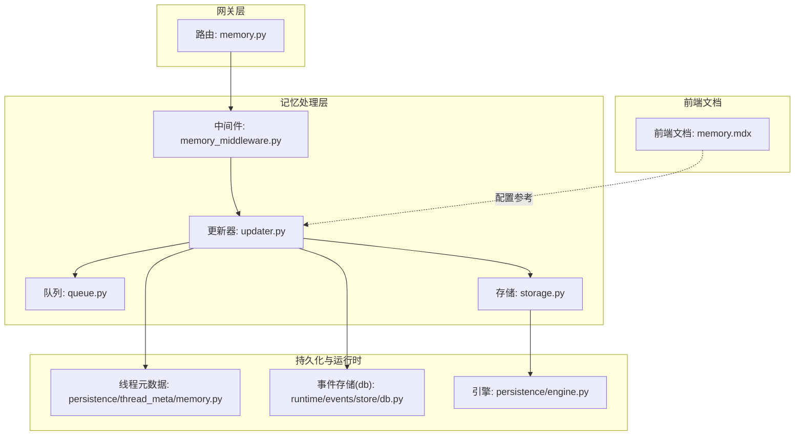
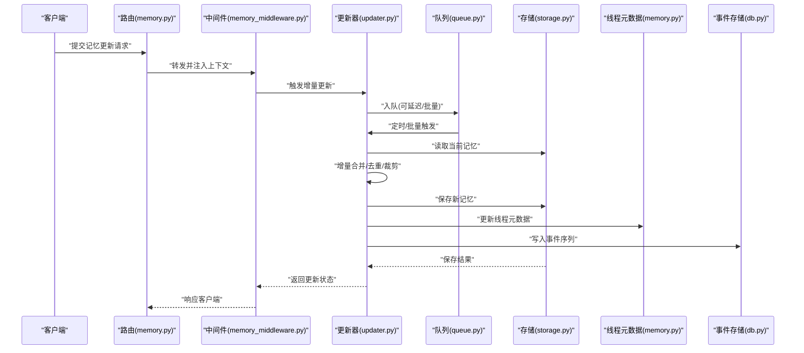
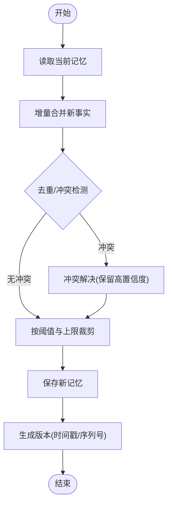
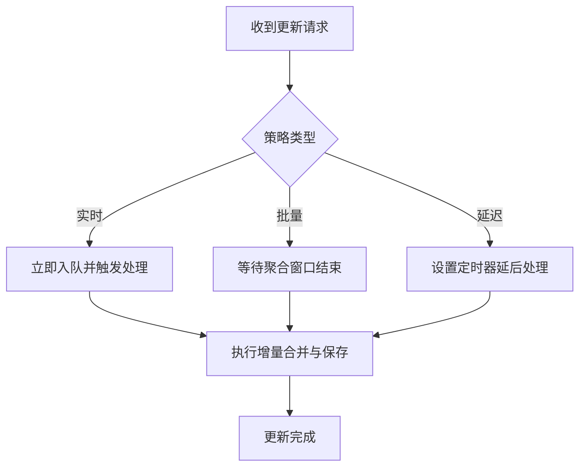
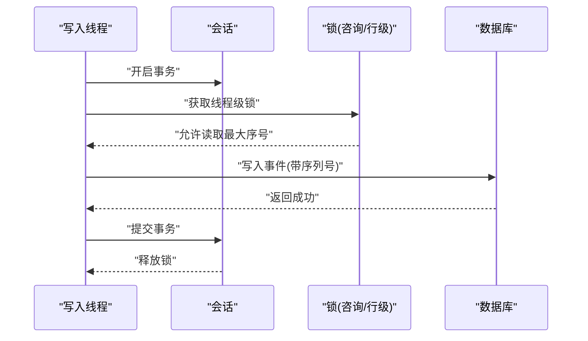
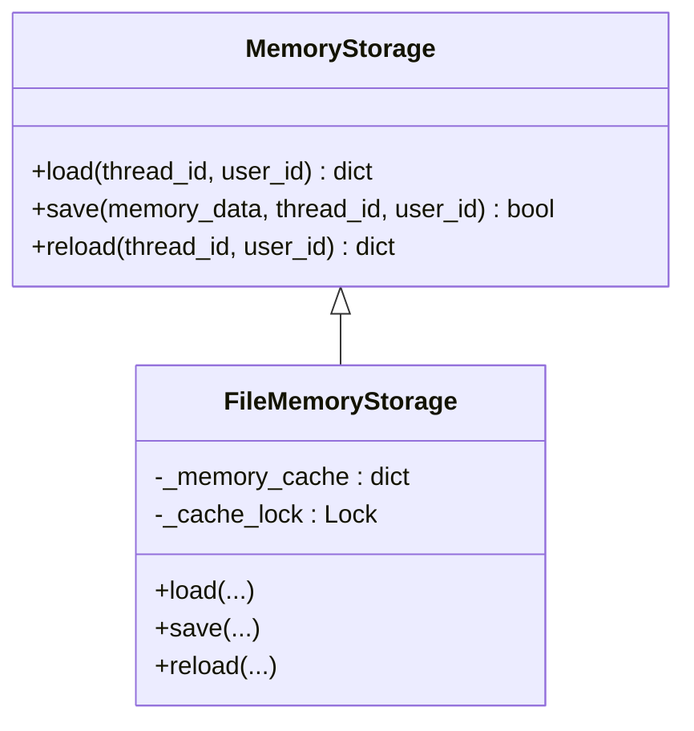
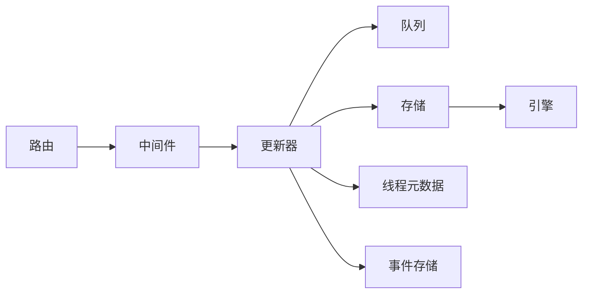

# 记忆更新器

<cite>
**本文引用的文件**
- [memory.py](file://backend/app/gateway/routers/memory.py)
- [updater.py](file://backend/packages/harness/deerflow/agents/memory/updater.py)
- [queue.py](file://backend/packages/harness/deerflow/agents/memory/queue.py)
- [storage.py](file://backend/packages/harness/deerflow/agents/memory/storage.py)
- [memory_config.py](file://backend/packages/harness/deerflow/config/memory_config.py)
- [memory_middleware.py](file://backend/packages/harness/deerflow/agents/middlewares/memory_middleware.py)
- [memory.py](file://backend/packages/harness/deerflow/persistence/thread_meta/memory.py)
- [db.py](file://backend/packages/harness/deerflow/runtime/events/store/db.py)
- [engine.py](file://backend/packages/harness/deerflow/persistence/engine.py)
- [test_memory_updater.py](file://backend/tests/test_memory_updater.py)
- [test_memory_queue.py](file://backend/tests/test_memory_queue.py)
- [test_memory_queue_user_isolation.py](file://backend/tests/test_memory_queue_user_isolation.py)
- [test_memory_storage.py](file://backend/tests/test_memory_storage.py)
- [test_memory_storage_user_isolation.py](file://backend/tests/test_memory_storage_user_isolation.py)
- [memory.mdx](file://frontend/src/content/zh/harness/memory.mdx)
</cite>

## 目录
1. [简介](#简介)
2. [项目结构](#项目结构)
3. [核心组件](#核心组件)
4. [架构总览](#架构总览)
5. [详细组件分析](#详细组件分析)
6. [依赖关系分析](#依赖关系分析)
7. [性能考量](#性能考量)
8. [故障排查指南](#故障排查指南)
9. [结论](#结论)
10. [附录](#附录)

## 简介
本文件围绕“记忆更新器”展开，系统性阐述其核心算法（增量更新、冲突检测、版本管理）、更新策略（实时/批量/延迟）、更新过程协调（事务、锁、并发控制）、性能优化（索引/批量/内存）以及配置与监控（频率、冲突处理、错误恢复）。同时覆盖与存储系统的集成与最佳实践。

## 项目结构
记忆更新器位于后端 harness 包中，涉及路由、更新器、队列、存储、配置与中间件等多个模块；测试覆盖了更新器行为、队列隔离、存储隔离等关键场景。

**图表来源**
- [memory.py](file://backend/app/gateway/routers/memory.py)
- [memory_middleware.py](file://backend/packages/harness/deerflow/agents/middlewares/memory_middleware.py)
- [updater.py](file://backend/packages/harness/deerflow/agents/memory/updater.py)
- [queue.py](file://backend/packages/harness/deerflow/agents/memory/queue.py)
- [storage.py](file://backend/packages/harness/deerflow/agents/memory/storage.py)
- [memory_config.py](file://backend/packages/harness/deerflow/config/memory_config.py)
- [memory.py](file://backend/packages/harness/deerflow/persistence/thread_meta/memory.py)
- [db.py](file://backend/packages/harness/deerflow/runtime/events/store/db.py)
- [engine.py](file://backend/packages/harness/deerflow/persistence/engine.py)
- [memory.mdx](file://frontend/src/content/zh/harness/memory.mdx)

**章节来源**
- [memory.py](file://backend/app/gateway/routers/memory.py)
- [memory_middleware.py](file://backend/packages/harness/deerflow/agents/middlewares/memory_middleware.py)
- [updater.py](file://backend/packages/harness/deerflow/agents/memory/updater.py)
- [queue.py](file://backend/packages/harness/deerflow/agents/memory/queue.py)
- [storage.py](file://backend/packages/harness/deerflow/agents/memory/storage.py)
- [memory_config.py](file://backend/packages/harness/deerflow/config/memory_config.py)
- [memory.py](file://backend/packages/harness/deerflow/persistence/thread_meta/memory.py)
- [db.py](file://backend/packages/harness/deerflow/runtime/events/store/db.py)
- [engine.py](file://backend/packages/harness/deerflow/persistence/engine.py)
- [memory.mdx](file://frontend/src/content/zh/harness/memory.mdx)

## 核心组件
- 路由与入口：提供对外的记忆接口，接收更新请求并交由中间件与更新器处理。
- 中间件：负责在调用链中注入/提取上下文、触发更新流程。
- 更新器：核心算法执行者，负责增量合并、去重、阈值裁剪、冲突检测与版本管理。
- 队列：异步调度与批处理，支持实时/延迟更新策略。
- 存储：抽象的持久化接口，支持文件/自定义存储后端。
- 配置：集中管理启用开关、存储类、阈值、最大条目数等参数。
- 运行时与持久化：线程元数据、事件序列、数据库引擎与会话工厂。

**章节来源**
- [memory.py](file://backend/app/gateway/routers/memory.py)
- [memory_middleware.py](file://backend/packages/harness/deerflow/agents/middlewares/memory_middleware.py)
- [updater.py](file://backend/packages/harness/deerflow/agents/memory/updater.py)
- [queue.py](file://backend/packages/harness/deerflow/agents/memory/queue.py)
- [storage.py](file://backend/packages/harness/deerflow/agents/memory/storage.py)
- [memory_config.py](file://backend/packages/harness/deerflow/config/memory_config.py)
- [memory.py](file://backend/packages/harness/deerflow/persistence/thread_meta/memory.py)
- [db.py](file://backend/packages/harness/deerflow/runtime/events/store/db.py)
- [engine.py](file://backend/packages/harness/deerflow/persistence/engine.py)

## 架构总览
记忆更新器采用“请求驱动 + 异步队列 + 增量合并 + 版本化存储”的架构。请求经路由进入，中间件解析上下文，更新器按配置进行增量合并与裁剪，队列负责调度与批处理，最终写入存储并维护线程元数据与事件序列。

**图表来源**
- [memory.py](file://backend/app/gateway/routers/memory.py)
- [memory_middleware.py](file://backend/packages/harness/deerflow/agents/middlewares/memory_middleware.py)
- [updater.py](file://backend/packages/harness/deerflow/agents/memory/updater.py)
- [queue.py](file://backend/packages/harness/deerflow/agents/memory/queue.py)
- [storage.py](file://backend/packages/harness/deerflow/agents/memory/storage.py)
- [memory.py](file://backend/packages/harness/deerflow/persistence/thread_meta/memory.py)
- [db.py](file://backend/packages/harness/deerflow/runtime/events/store/db.py)

## 详细组件分析

### 更新器核心算法
- 增量更新：基于现有记忆与新事实进行合并，保留高置信度与符合类别的事实。
- 冲突检测：通过事实ID与内容指纹识别重复或冲突，避免冗余与覆盖。
- 版本管理：以时间戳与序列号作为版本依据，保证并发写入的有序性与可追溯性。
- 裁剪策略：按置信度阈值与最大条目数限制，移除低质量或过期事实。
- 去重与删除：支持显式删除ID列表，确保删除意图被正确执行。

**图表来源**
- [updater.py](file://backend/packages/harness/deerflow/agents/memory/updater.py)
- [test_memory_updater.py](file://backend/tests/test_memory_updater.py)

**章节来源**
- [updater.py](file://backend/packages/harness/deerflow/agents/memory/updater.py)
- [test_memory_updater.py](file://backend/tests/test_memory_updater.py)

### 更新策略实现
- 实时更新：立即入队并尽快处理，适合对时效性要求高的场景。
- 批量更新：在队列中聚合多个更新请求，统一处理，降低写放大。
- 延迟更新：设置定时器延迟处理，平滑突发流量，减少数据库压力。

**图表来源**
- [queue.py](file://backend/packages/harness/deerflow/agents/memory/queue.py)
- [test_memory_queue.py](file://backend/tests/test_memory_queue.py)

**章节来源**
- [queue.py](file://backend/packages/harness/deerflow/agents/memory/queue.py)
- [test_memory_queue.py](file://backend/tests/test_memory_queue.py)

### 更新过程协调（事务、锁、并发）
- 事务处理：写入事件序列时使用事务，确保一致性。
- 锁机制：针对线程维度的写入串行化，PostgreSQL 使用事务级咨询锁，其他方言使用行级锁。
- 并发控制：队列加锁保护内部状态，用户隔离保障不同用户更新互不干扰。

**图表来源**
- [db.py](file://backend/packages/harness/deerflow/runtime/events/store/db.py)

**章节来源**
- [db.py](file://backend/packages/harness/deerflow/runtime/events/store/db.py)
- [test_run_event_store.py](file://backend/tests/test_run_event_store.py)
- [test_memory_queue_user_isolation.py](file://backend/tests/test_memory_queue_user_isolation.py)

### 性能优化
- 索引维护：事件表按 thread_id、seq 建立索引，加速查询与排序。
- 批量操作：队列聚合写入，减少事务次数与IO开销。
- 内存管理：缓存最近一次读取的记忆，失败时深拷贝避免缓存污染；文件存储采用临时文件写入与原子替换，降低部分写风险。

**图表来源**
- [storage.py](file://backend/packages/harness/deerflow/agents/memory/storage.py)

**章节来源**
- [storage.py](file://backend/packages/harness/deerflow/agents/memory/storage.py)
- [test_memory_storage.py](file://backend/tests/test_memory_storage.py)
- [test_memory_storage_user_isolation.py](file://backend/tests/test_memory_storage_user_isolation.py)

### 配置与监控
- 启用/禁用：通过配置项控制是否启用记忆与是否注入到提示词。
- 自定义存储：支持指定 storage_class 替换默认文件存储，加载失败自动回退。
- 关键参数：最大事实数、置信度阈值、更新频率、批处理窗口、延迟时长等。
- 监控指标：队列长度、处理耗时、保存成功率、冲突率、缓存命中率等。

**章节来源**
- [memory_config.py](file://backend/packages/harness/deerflow/config/memory_config.py)
- [memory_mdx](file://frontend/src/content/zh/harness/memory.mdx)
- [memory_mdx](file://frontend/src/content/en/harness/memory.mdx)

### 与存储系统的集成与最佳实践
- 存储抽象：统一 load/save/reload 接口，便于替换为 Redis、数据库或其他后端。
- 用户隔离：按 user_id 与 thread_id 组合缓存，避免跨用户污染。
- 失败恢复：保存失败时深拷贝隔离缓存，防止后续读取到半写对象。
- 最佳实践：优先使用批量/延迟策略应对高并发；合理设置阈值与上限；定期清理低置信度事实；监控队列积压与写入延迟。

**章节来源**
- [storage.py](file://backend/packages/harness/deerflow/agents/memory/storage.py)
- [engine.py](file://backend/packages/harness/deerflow/persistence/engine.py)
- [memory.py](file://backend/packages/harness/deerflow/persistence/thread_meta/memory.py)

## 依赖关系分析
- 路由依赖中间件与更新器；中间件依赖配置与上下文；更新器依赖队列、存储与运行时元数据。
- 存储依赖持久化引擎；事件存储依赖数据库引擎与会话工厂。
- 测试覆盖更新器行为、队列隔离、存储隔离，验证配置与回退逻辑。

**图表来源**
- [memory.py](file://backend/app/gateway/routers/memory.py)
- [memory_middleware.py](file://backend/packages/harness/deerflow/agents/middlewares/memory_middleware.py)
- [updater.py](file://backend/packages/harness/deerflow/agents/memory/updater.py)
- [queue.py](file://backend/packages/harness/deerflow/agents/memory/queue.py)
- [storage.py](file://backend/packages/harness/deerflow/agents/memory/storage.py)
- [memory.py](file://backend/packages/harness/deerflow/persistence/thread_meta/memory.py)
- [db.py](file://backend/packages/harness/deerflow/runtime/events/store/db.py)
- [engine.py](file://backend/packages/harness/deerflow/persistence/engine.py)

**章节来源**
- [memory.py](file://backend/app/gateway/routers/memory.py)
- [memory_middleware.py](file://backend/packages/harness/deerflow/agents/middlewares/memory_middleware.py)
- [updater.py](file://backend/packages/harness/deerflow/agents/memory/updater.py)
- [queue.py](file://backend/packages/harness/deerflow/agents/memory/queue.py)
- [storage.py](file://backend/packages/harness/deerflow/agents/memory/storage.py)
- [memory.py](file://backend/packages/harness/deerflow/persistence/thread_meta/memory.py)
- [db.py](file://backend/packages/harness/deerflow/runtime/events/store/db.py)
- [engine.py](file://backend/packages/harness/deerflow/persistence/engine.py)

## 性能考量
- 队列聚合：通过批量/延迟策略降低写放大与事务开销。
- 缓存与原子写：文件存储采用临时文件与原子替换，避免部分写与竞争条件。
- 线程级串行化：事件写入按线程串行化，避免乱序与死锁。
- 阈值与裁剪：及时剔除低质量事实，保持存储规模可控。

[本节为通用指导，无需特定文件引用]

## 故障排查指南
- 保存失败：检查存储后端权限与磁盘空间；确认深拷贝隔离是否生效；查看日志错误码。
- 队列积压：检查批量窗口与延迟时长配置；观察处理器吞吐；必要时增加资源。
- 冲突与重复：核对去重策略与置信度阈值；审查事实ID与内容指纹规则。
- 用户隔离问题：确认 user_id 注入与缓存键组合；验证多用户并发场景下的隔离性。

**章节来源**
- [test_memory_updater.py](file://backend/tests/test_memory_updater.py)
- [test_memory_queue_user_isolation.py](file://backend/tests/test_memory_queue_user_isolation.py)
- [test_memory_storage_user_isolation.py](file://backend/tests/test_memory_storage_user_isolation.py)

## 结论
记忆更新器通过“增量合并 + 版本化 + 队列调度 + 存储抽象”的设计，在保证一致性与可扩展性的前提下，提供了灵活的更新策略与完善的性能优化手段。结合合理的配置与监控，可在高并发场景下稳定运行并持续演进。

[本节为总结，无需特定文件引用]

## 附录
- 配置示例与禁用选项可参考前端文档中的配置卡片与示例片段。
- 运行时持久化引擎初始化与关闭流程，确保数据库连接池与会话工厂正确管理。

**章节来源**
- [memory.mdx](file://frontend/src/content/zh/harness/memory.mdx)
- [engine.py](file://backend/packages/harness/deerflow/persistence/engine.py)