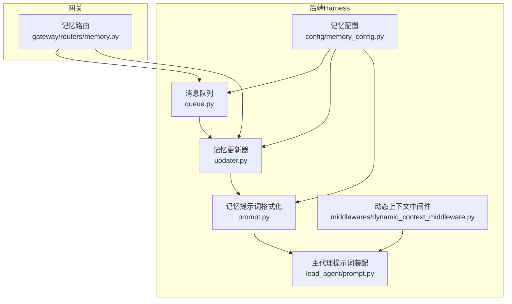
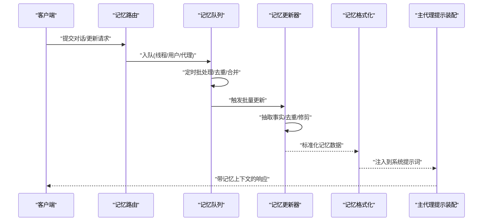
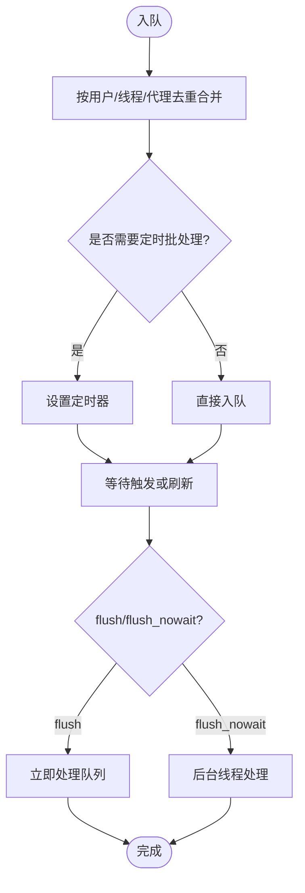
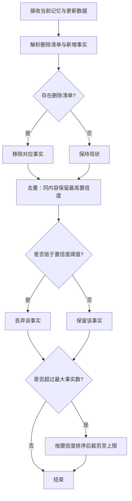
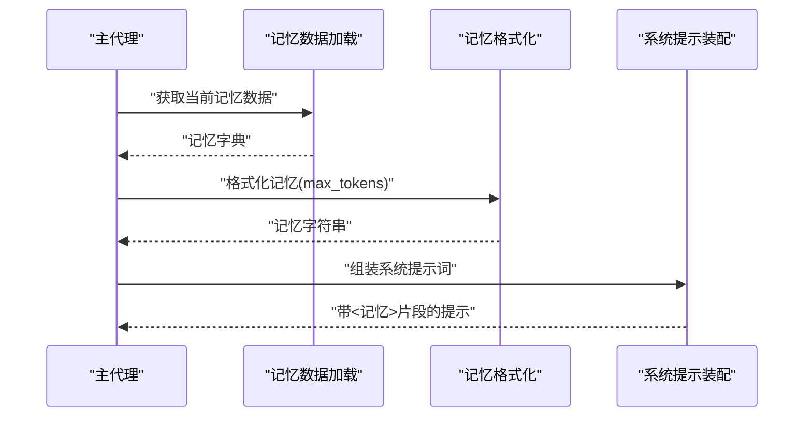
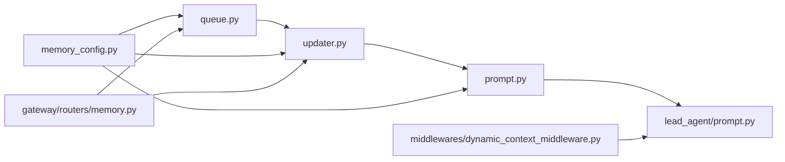

# 记忆系统

<cite>
**本文引用的文件**
- [queue.py](file://backend/packages/harness/deerflow/agents/memory/queue.py)
- [updater.py](file://backend/packages/harness/deerflow/agents/memory/updater.py)
- [prompt.py](file://backend/packages/harness/deerflow/agents/memory/prompt.py)
- [prompt.py（主代理）](file://backend/packages/harness/deerflow/agents/lead_agent/prompt.py)
- [dynamic_context_middleware.py](file://backend/packages/harness/deerflow/agents/middlewares/dynamic_context_middleware.py)
- [memory_config.py](file://backend/packages/harness/deerflow/config/memory_config.py)
- [memory.py（后端路由）](file://backend/app/gateway/routers/memory.py)
- [MEMORY_IMPROVEMENTS.md](file://backend/docs/MEMORY_IMPROVEMENTS.md)
- [MEMORY_IMPROVEMENTS_SUMMARY.md](file://backend/docs/MEMORY_IMPROVEMENTS_SUMMARY.md)
- [test_memory_queue.py](file://backend/tests/test_memory_queue.py)
- [test_memory_queue_user_isolation.py](file://backend/tests/test_memory_queue_user_isolation.py)
- [test_memory_updater.py](file://backend/tests/test_memory_updater.py)
- [test_memory_prompt_injection.py](file://backend/tests/test_memory_prompt_injection.py)
- [test_lead_agent_prompt.py](file://backend/tests/test_lead_agent_prompt.py)
- [load_memory_sample.py](file://scripts/load_memory_sample.py)
- [MEMORY_SETTINGS_REVIEW.md](file://backend/docs/MEMORY_SETTINGS_REVIEW.md)
</cite>

## 目录
1. [引言](#引言)
2. [项目结构](#项目结构)
3. [核心组件](#核心组件)
4. [架构总览](#架构总览)
5. [详细组件分析](#详细组件分析)
6. [依赖关系分析](#依赖关系分析)
7. [性能考量](#性能考量)
8. [故障排查指南](#故障排查指南)
9. [结论](#结论)
10. [附录](#附录)

## 引言
本文件系统性梳理记忆系统的实现与使用，覆盖以下方面：
- 存储机制：消息队列、存储引擎、数据结构
- 处理流程：消息预处理、内容提取、格式转换
- 更新器：增量更新、批量处理、冲突解决
- 提示词系统：模板生成、上下文构建、动态注入
- 配置与优化：容量、清理、性能调优
- 使用示例与最佳实践：导入导出、备份恢复、迁移升级
- 与其他组件的集成与扩展

## 项目结构
记忆系统主要分布在后端 harness 包中，围绕“消息队列 → 更新器 → 提示词注入”的链路组织；同时在网关层提供对外接口，并有配套测试与文档。

图表来源
- [queue.py:216-287](file://backend/packages/harness/deerflow/agents/memory/queue.py#L216-L287)
- [updater.py:420-449](file://backend/packages/harness/deerflow/agents/memory/updater.py#L420-L449)
- [prompt.py:254-297](file://backend/packages/harness/deerflow/agents/memory/prompt.py#L254-L297)
- [prompt.py（主代理）:563-600](file://backend/packages/harness/deerflow/agents/lead_agent/prompt.py#L563-L600)
- [dynamic_context_middleware.py:69-96](file://backend/packages/harness/deerflow/agents/middlewares/dynamic_context_middleware.py#L69-L96)
- [memory_config.py](file://backend/packages/harness/deerflow/config/memory_config.py)

章节来源
- [queue.py:216-287](file://backend/packages/harness/deerflow/agents/memory/queue.py#L216-L287)
- [updater.py:420-449](file://backend/packages/harness/deerflow/agents/memory/updater.py#L420-L449)
- [prompt.py:254-297](file://backend/packages/harness/deerflow/agents/memory/prompt.py#L254-L297)
- [prompt.py（主代理）:563-600](file://backend/packages/harness/deerflow/agents/lead_agent/prompt.py#L563-L600)
- [dynamic_context_middleware.py:69-96](file://backend/packages/harness/deerflow/agents/middlewares/dynamic_context_middleware.py#L69-L96)
- [memory_config.py](file://backend/packages/harness/deerflow/config/memory_config.py)

## 核心组件
- 消息队列：负责聚合用户/线程/代理维度的更新请求，支持去重、定时批处理、后台刷新与清空。
- 记忆更新器：从对话中抽取事实，应用去重、阈值过滤、最大数量限制与删除标记，输出标准化记忆数据。
- 提示词系统：将记忆按用户上下文、历史摘要、事实列表等结构化拼装为可注入系统提示词。
- 动态上下文中间件：在首轮人类消息前注入“记忆+日期”的系统提醒，后续复用缓存。
- 配置模块：集中管理记忆开关、注入开关、最大注入令牌数、事实上限、置信度阈值等。

章节来源
- [queue.py:216-287](file://backend/packages/harness/deerflow/agents/memory/queue.py#L216-L287)
- [updater.py:420-449](file://backend/packages/harness/deerflow/agents/memory/updater.py#L420-L449)
- [prompt.py:254-297](file://backend/packages/harness/deerflow/agents/memory/prompt.py#L254-L297)
- [dynamic_context_middleware.py:69-96](file://backend/packages/harness/deerflow/agents/middlewares/dynamic_context_middleware.py#L69-L96)
- [memory_config.py](file://backend/packages/harness/deerflow/config/memory_config.py)

## 架构总览
记忆系统的关键交互如下：

图表来源
- [queue.py:216-287](file://backend/packages/harness/deerflow/agents/memory/queue.py#L216-L287)
- [updater.py:420-449](file://backend/packages/harness/deerflow/agents/memory/updater.py#L420-L449)
- [prompt.py:254-297](file://backend/packages/harness/deerflow/agents/memory/prompt.py#L254-L297)
- [prompt.py（主代理）:563-600](file://backend/packages/harness/deerflow/agents/lead_agent/prompt.py#L563-L600)

## 详细组件分析

### 消息队列（MemoryUpdateQueue）
- 职责
  - 聚合来自不同线程/用户的记忆更新请求，按用户+线程+代理维度去重合并。
  - 支持定时批处理、立即刷新、后台无阻塞刷新、清空队列等能力。
- 关键行为
  - 去重：相同用户/线程/代理的多次更新会被合并为一次最新消息。
  - 批处理：通过定时器触发批量处理，避免高频写入。
  - 线程安全：内部使用锁保护队列状态与计时器生命周期。
  - 单例：全局唯一实例，便于跨模块共享。
- 测试验证
  - 用户隔离：不同用户更新不会互相干扰。
  - 同用户同线程合并：多次更新被合并为一次。
  - 立即处理：add_nowait 会取消旧计时器并启动新的后台线程处理。
  - 正在处理时重调度：避免并发处理同一批次。

图表来源
- [queue.py:216-287](file://backend/packages/harness/deerflow/agents/memory/queue.py#L216-L287)
- [test_memory_queue.py:120-157](file://backend/tests/test_memory_queue.py#L120-L157)
- [test_memory_queue_user_isolation.py:38-65](file://backend/tests/test_memory_queue_user_isolation.py#L38-L65)

章节来源
- [queue.py:216-287](file://backend/packages/harness/deerflow/agents/memory/queue.py#L216-L287)
- [test_memory_queue.py:120-157](file://backend/tests/test_memory_queue.py#L120-L157)
- [test_memory_queue_user_isolation.py:38-65](file://backend/tests/test_memory_queue_user_isolation.py#L38-L65)

### 记忆更新器（MemoryUpdater）
- 职责
  - 将对话消息转换为结构化的记忆事实，执行去重、删除标记、阈值过滤与数量修剪。
  - 生成用于模型调用的更新提示，包含当前记忆、对话文本与修正/强化提示。
- 关键机制
  - 去重策略：对同一批次内的重复内容进行去重，保留更高置信度的事实。
  - 删除策略：支持显式删除指定 id 的事实，确保历史事实可移除。
  - 阈值与修剪：基于置信度阈值与最大事实数限制，保留高质量记忆。
  - 提示构造：将当前记忆与对话文本拼装为 JSON 字符串，结合修正/强化提示，形成最终提示。
- 测试验证
  - 重复事实跳过：同一内容在同一批次内仅保留一次。
  - 删除保留：删除标记的事实不会出现在结果中。
  - 阈值与修剪：超过阈值与数量限制的事实被裁剪。
  - 非 ASCII 文本：中文等非 ASCII 内容正确保留，不出现转义字符问题。

图表来源
- [updater.py:420-449](file://backend/packages/harness/deerflow/agents/memory/updater.py#L420-L449)
- [test_memory_updater.py:42-175](file://backend/tests/test_memory_updater.py#L42-L175)

章节来源
- [updater.py:420-449](file://backend/packages/harness/deerflow/agents/memory/updater.py#L420-L449)
- [test_memory_updater.py:42-175](file://backend/tests/test_memory_updater.py#L42-L175)

### 提示词系统（记忆注入）
- 组件
  - 记忆格式化：将用户上下文、历史摘要、事实列表等结构化为可注入字符串。
  - 主代理提示装配：在系统提示词中插入记忆片段，受配置控制。
  - 动态上下文中间件：在首轮人类消息前注入“记忆+日期”的系统提醒，后续复用。
- 行为特性
  - 结构化注入：用户上下文、历史摘要、事实列表分别组织，提升可读性。
  - 令牌预算：使用准确的令牌计数（优先 tiktoken），在预算范围内注入最多事实。
  - 非 ASCII 安全：中文等文本正确编码，避免转义序列。
  - 可选注入：当配置关闭或无可用内容时，返回空字符串，不影响流程。

图表来源
- [prompt.py:254-297](file://backend/packages/harness/deerflow/agents/memory/prompt.py#L254-L297)
- [prompt.py（主代理）:563-600](file://backend/packages/harness/deerflow/agents/lead_agent/prompt.py#L563-L600)
- [test_memory_prompt_injection.py](file://backend/tests/test_memory_prompt_injection.py)

章节来源
- [prompt.py:254-297](file://backend/packages/harness/deerflow/agents/memory/prompt.py#L254-L297)
- [prompt.py（主代理）:563-600](file://backend/packages/harness/deerflow/agents/lead_agent/prompt.py#L563-L600)
- [test_memory_prompt_injection.py](file://backend/tests/test_memory_prompt_injection.py)

### 动态上下文中间件
- 职责
  - 在首轮人类消息前注入“记忆+日期”的系统提醒，作为 <system-reminder>。
  - 识别已注入提醒的消息，避免重复注入。
  - 对首轮消息进行冻结，后续轮次复用缓存，减少重复计算。
- 行为细节
  - 逆序扫描消息，定位最近一次注入的提醒及其日期。
  - 判断目标消息是否为可注入的人类消息且非摘要消息。
  - 通过额外参数标志而非内容匹配，避免误判。

章节来源
- [dynamic_context_middleware.py:69-96](file://backend/packages/harness/deerflow/agents/middlewares/dynamic_context_middleware.py#L69-L96)

### 配置与优化
- 关键配置项
  - enabled：是否启用记忆功能。
  - injection_enabled：是否允许将记忆注入到系统提示词。
  - max_injection_tokens：记忆注入的最大令牌预算。
  - max_facts：记忆事实的最大数量。
  - fact_confidence_threshold：事实置信度阈值。
- 优化策略
  - 令牌预算：合理设置 max_injection_tokens，平衡上下文长度与模型成本。
  - 事实修剪：通过 max_facts 与阈值控制记忆规模，避免冗余。
  - 批处理：利用队列的定时批处理降低写入频率，提高吞吐。
  - 非 ASCII：确保文本正确编码，避免转义导致的提示词异常。

章节来源
- [memory_config.py](file://backend/packages/harness/deerflow/config/memory_config.py)
- [MEMORY_IMPROVEMENTS.md:1-55](file://backend/docs/MEMORY_IMPROVEMENTS.md#L1-L55)
- [MEMORY_IMPROVEMENTS_SUMMARY.md:1-39](file://backend/docs/MEMORY_IMPROVEMENTS_SUMMARY.md#L1-L39)

## 依赖关系分析

图表来源
- [queue.py:216-287](file://backend/packages/harness/deerflow/agents/memory/queue.py#L216-L287)
- [updater.py:420-449](file://backend/packages/harness/deerflow/agents/memory/updater.py#L420-L449)
- [prompt.py:254-297](file://backend/packages/harness/deerflow/agents/memory/prompt.py#L254-L297)
- [prompt.py（主代理）:563-600](file://backend/packages/harness/deerflow/agents/lead_agent/prompt.py#L563-L600)
- [dynamic_context_middleware.py:69-96](file://backend/packages/harness/deerflow/agents/middlewares/dynamic_context_middleware.py#L69-L96)
- [memory_config.py](file://backend/packages/harness/deerflow/config/memory_config.py)
- [memory.py（后端路由）](file://backend/app/gateway/routers/memory.py)

章节来源
- [memory.py（后端路由）](file://backend/app/gateway/routers/memory.py)

## 性能考量
- 令牌计数准确性：优先使用 tiktoken 进行精确计数，若不可用则回退估算，确保注入不超预算。
- 批量处理与去重：队列合并同类更新，减少重复写入与模型调用。
- 缓存与复用：动态上下文中间件对首轮消息冻结并复用，降低重复计算。
- 配置调优：根据模型上下文长度与成本，调整 max_injection_tokens、max_facts 与阈值，达到质量与性能的平衡。

## 故障排查指南
- 注入为空
  - 检查配置 enabled 与 injection_enabled 是否开启。
  - 确认记忆数据是否存在可用内容。
  - 参考：[MEMORY_IMPROVEMENTS.md:19-35](file://backend/docs/MEMORY_IMPROVEMENTS.md#L19-L35)
- 中文乱码或转义
  - 确保格式化过程使用非转义编码，避免出现 Unicode 转义序列。
  - 参考：[test_memory_updater.py:81-113](file://backend/tests/test_memory_updater.py#L81-L113)
- 事实未生效或被裁剪
  - 检查置信度是否低于阈值，或是否超过最大事实数。
  - 参考：[test_memory_updater.py:116-175](file://backend/tests/test_memory_updater.py#L116-L175)
- 队列未处理或丢失
  - 使用 flush 或 flush_nowait 触发处理；注意后台线程可能在进程退出时丢失。
  - 参考：[queue.py:216-287](file://backend/packages/harness/deerflow/agents/memory/queue.py#L216-L287)、[test_memory_queue.py:147-157](file://backend/tests/test_memory_queue.py#L147-L157)

章节来源
- [MEMORY_IMPROVEMENTS.md:19-35](file://backend/docs/MEMORY_IMPROVEMENTS.md#L19-L35)
- [test_memory_updater.py:81-113](file://backend/tests/test_memory_updater.py#L81-L113)
- [test_memory_updater.py:116-175](file://backend/tests/test_memory_updater.py#L116-L175)
- [queue.py:216-287](file://backend/packages/harness/deerflow/agents/memory/queue.py#L216-L287)
- [test_memory_queue.py:147-157](file://backend/tests/test_memory_queue.py#L147-L157)

## 结论
记忆系统通过“队列聚合 → 更新器标准化 → 提示词注入”的流水线，实现了高吞吐、低冗余的记忆管理。配合动态上下文中间件与严格的令牌预算控制，既保证了上下文质量，又兼顾了性能与成本。未来计划引入基于 TF-IDF 的上下文感知检索与加权评分，进一步提升事实选择的准确性。

## 附录

### 使用示例与最佳实践
- 数据导入/导出
  - 使用样例脚本进行初始数据填充与验证。
  - 参考：[load_memory_sample.py](file://scripts/load_memory_sample.py)
- 备份与恢复
  - 导入前自动创建时间戳备份，防止覆盖风险。
  - 参考：[MEMORY_SETTINGS_REVIEW.md:63-64](file://backend/docs/MEMORY_SETTINGS_REVIEW.md#L63-L64)
- 迁移与升级
  - 升级前检查记忆配置项与注入行为变更，确保兼容性。
  - 参考：[MEMORY_IMPROVEMENTS_SUMMARY.md:1-39](file://backend/docs/MEMORY_IMPROVEMENTS_SUMMARY.md#L1-L39)

章节来源
- [load_memory_sample.py](file://scripts/load_memory_sample.py)
- [MEMORY_SETTINGS_REVIEW.md:63-64](file://backend/docs/MEMORY_SETTINGS_REVIEW.md#L63-L64)
- [MEMORY_IMPROVEMENTS_SUMMARY.md:1-39](file://backend/docs/MEMORY_IMPROVEMENTS_SUMMARY.md#L1-L39)