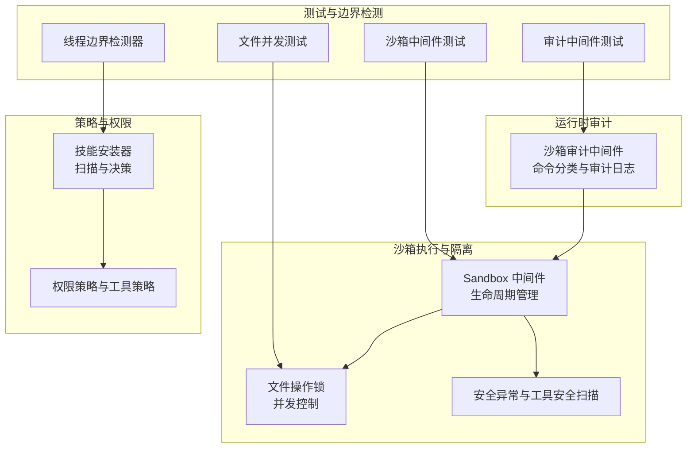
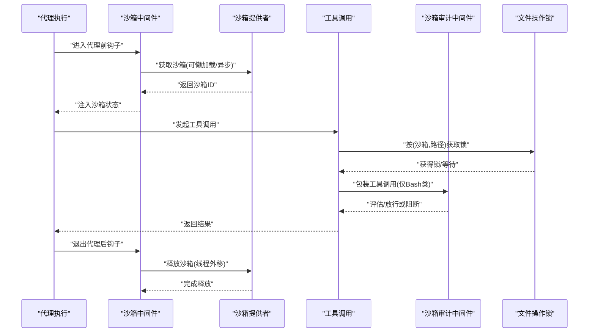
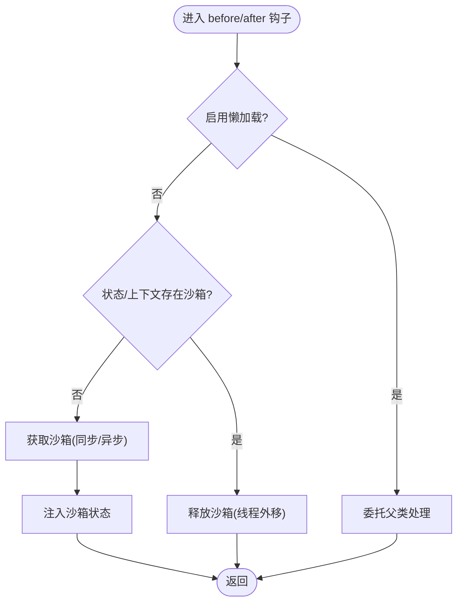
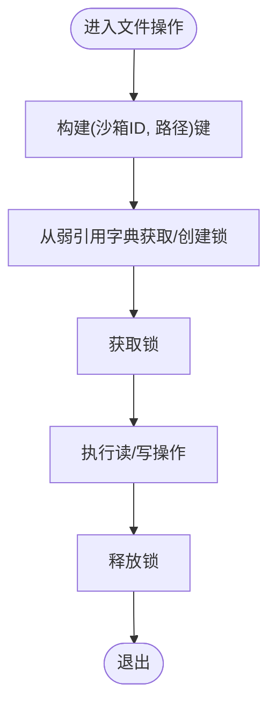
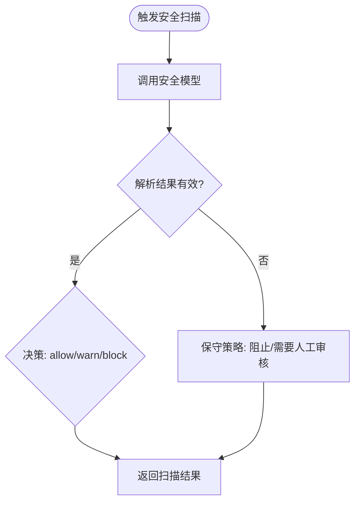
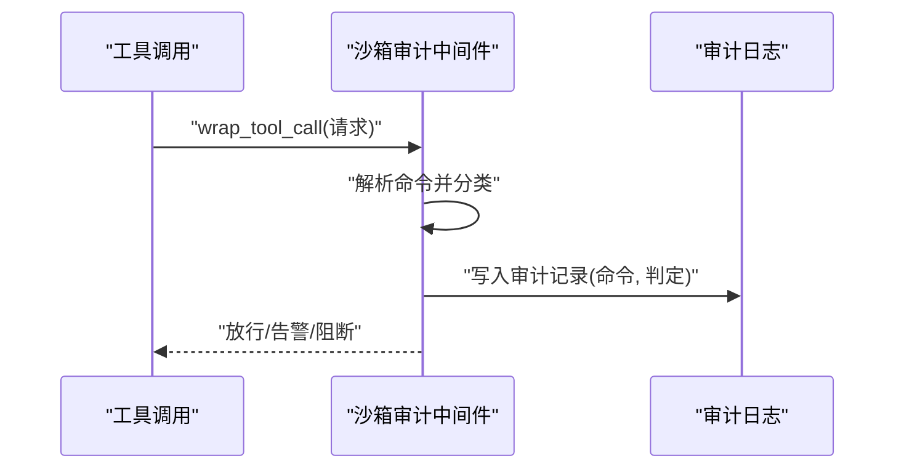
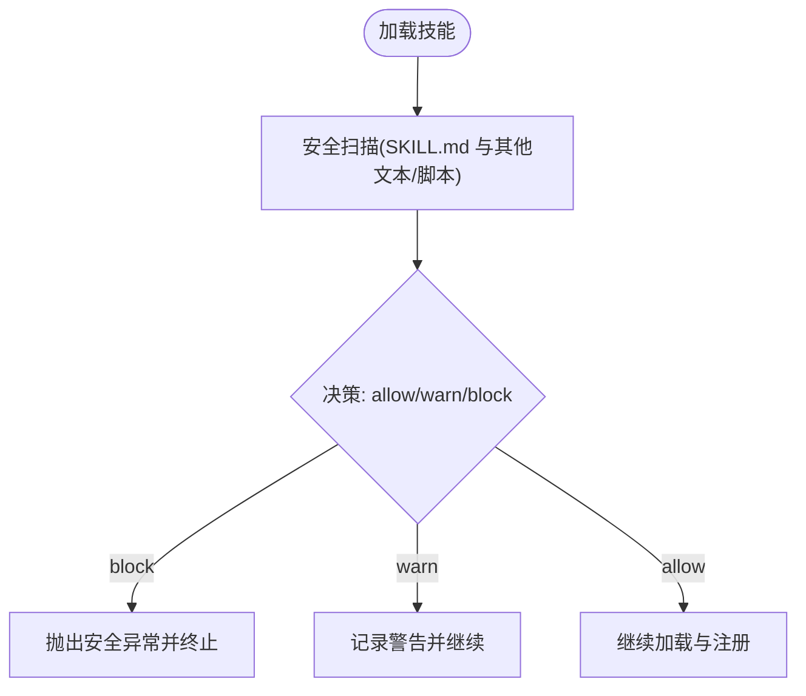
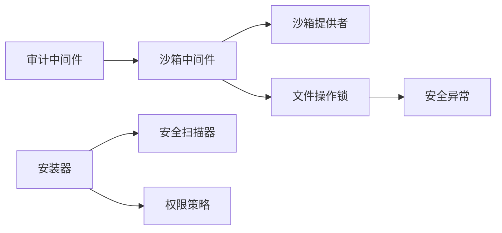

# 安全策略与隔离

<cite>
**本文引用的文件**
- [middleware.py](file://backend/packages/harness/deerflow/sandbox/middleware.py)
- [file_operation_lock.py](file://backend/packages/harness/deerflow/sandbox/file_operation_lock.py)
- [security.py](file://backend/packages/harness/deerflow/sandbox/security.py)
- [exceptions.py](file://backend/packages/harness/deerflow/sandbox/exceptions.py)
- [sandbox_audit_middleware.py](file://backend/packages/harness/deerflow/agents/middlewares/sandbox_audit_middleware.py)
- [security_scanner.py](file://backend/packages/harness/deerflow/skills/security_scanner.py)
- [installer.py](file://backend/packages/harness/deerflow/skills/installer.py)
- [permissions.py](file://backend/packages/harness/deerflow/skills/permissions.py)
- [tool_policy.py](file://backend/packages/harness/deerflow/skills/tool_policy.py)
- [test_sandbox_middleware.py](file://backend/tests/test_sandbox_middleware.py)
- [test_sandbox_tools_security.py](file://backend/tests/test_sandbox_tools_security.py)
- [test_sandbox_audit_middleware.py](file://backend/tests/test_sandbox_audit_middleware.py)
- [test_sandbox_tools_security.py](file://backend/tests/test_sandbox_tools_security.py)
- [test_sandbox_audit_middleware.py](file://backend/tests/test_sandbox_audit_middleware.py)
- [权限控制.md](file://docs/权限控制.md)
- [test_detect_thread_boundaries.py](file://backend/tests/support/detectors/thread_boundaries.py)
- [thread_boundaries.py](file://backend/tests/support/detectors/thread_boundaries.py)
</cite>

## 目录
1. [引言](#引言)
2. [项目结构](#项目结构)
3. [核心组件](#核心组件)
4. [架构总览](#架构总览)
5. [详细组件分析](#详细组件分析)
6. [依赖关系分析](#依赖关系分析)
7. [性能考量](#性能考量)
8. [故障排查指南](#故障排查指南)
9. [结论](#结论)
10. [附录](#附录)

## 引言
本文件聚焦于执行环境的安全边界与访问控制，系统性阐述沙箱安全策略与隔离机制的设计与实现。内容涵盖安全中间件的工作原理、权限检查与资源限制、异常处理与错误隔离、安全审计、文件操作锁与并发控制、资源清理、安全配置指南、威胁模型与防护措施，以及安全测试方法、漏洞检测与应急响应流程。

## 项目结构
围绕“沙箱安全与隔离”，后端关键模块分布如下：
- 执行期隔离与生命周期管理：sandbox 中间件负责沙箱获取、释放与异步线程外移；文件操作锁保障并发一致性；安全异常定义与工具安全扫描器用于策略执行与风险阻断。
- 运行时审计与合规：沙箱审计中间件对工具调用进行分类评估并写入审计日志。
- 策略与权限：技能安装器结合安全扫描器与权限策略，确保技能加载与执行符合安全基线。
- 测试与边界检测：单元测试覆盖沙箱中间件生命周期、文件并发写入、审计中间件行为；支持工具边界检测器帮助识别潜在的同步/异步混用问题。

**图表来源**
- [middleware.py:33-128](file://backend/packages/harness/deerflow/sandbox/middleware.py#L33-L128)
- [file_operation_lock.py:1-27](file://backend/packages/harness/deerflow/sandbox/file_operation_lock.py#L1-L27)
- [security.py](file://backend/packages/harness/deerflow/sandbox/security.py)
- [exceptions.py](file://backend/packages/harness/deerflow/sandbox/exceptions.py)
- [sandbox_audit_middleware.py](file://backend/packages/harness/deerflow/agents/middlewares/sandbox_audit_middleware.py)
- [security_scanner.py:82-109](file://backend/packages/harness/deerflow/skills/security_scanner.py#L82-L109)
- [installer.py:160-184](file://backend/packages/harness/deerflow/skills/installer.py#L160-L184)
- [permissions.py](file://backend/packages/harness/deerflow/skills/permissions.py)
- [tool_policy.py](file://backend/packages/harness/deerflow/skills/tool_policy.py)
- [test_sandbox_middleware.py:119-225](file://backend/tests/test_sandbox_middleware.py#L119-L225)
- [test_sandbox_tools_security.py:188-228](file://backend/tests/test_sandbox_tools_security.py#L188-L228)
- [test_sandbox_audit_middleware.py:417-493](file://backend/tests/test_sandbox_audit_middleware.py#L417-L493)
- [thread_boundaries.py:425-507](file://backend/tests/support/detectors/thread_boundaries.py#L425-L507)

**章节来源**
- [middleware.py:33-128](file://backend/packages/harness/deerflow/sandbox/middleware.py#L33-L128)
- [file_operation_lock.py:1-27](file://backend/packages/harness/deerflow/sandbox/file_operation_lock.py#L1-L27)
- [sandbox_audit_middleware.py](file://backend/packages/harness/deerflow/agents/middlewares/sandbox_audit_middleware.py)
- [security_scanner.py:82-109](file://backend/packages/harness/deerflow/skills/security_scanner.py#L82-L109)
- [installer.py:160-184](file://backend/packages/harness/deerflow/skills/installer.py#L160-L184)
- [permissions.py](file://backend/packages/harness/deerflow/skills/permissions.py)
- [tool_policy.py](file://backend/packages/harness/deerflow/skills/tool_policy.py)
- [test_sandbox_middleware.py:119-225](file://backend/tests/test_sandbox_middleware.py#L119-L225)
- [test_sandbox_tools_security.py:188-228](file://backend/tests/test_sandbox_tools_security.py#L188-L228)
- [test_sandbox_audit_middleware.py:417-493](file://backend/tests/test_sandbox_audit_middleware.py#L417-L493)
- [thread_boundaries.py:425-507](file://backend/tests/support/detectors/thread_boundaries.py#L425-L507)

## 核心组件
- 沙箱中间件：负责在代理执行前后获取/释放沙箱实例，支持懒加载与异步初始化，避免阻塞事件循环；提供状态注入与上下文回退释放。
- 文件操作锁：基于弱引用字典缓存的细粒度锁，按“沙箱+路径”维度隔离并发文件操作，防止竞态与数据丢失。
- 安全异常与工具安全扫描：统一的安全异常类型与扫描器，提供“允许/警告/阻止”的三态决策，并在不可解析或不可用时采用保守策略。
- 沙箱审计中间件：对 Bash 类工具调用进行风险分类（高危/中危/低危），记录审计日志并决定是否放行。
- 技能安装与权限策略：安装阶段对技能内容进行扫描与决策，结合权限与工具策略，确保仅加载符合安全基线的内容。

**章节来源**
- [middleware.py:33-128](file://backend/packages/harness/deerflow/sandbox/middleware.py#L33-L128)
- [file_operation_lock.py:1-27](file://backend/packages/harness/deerflow/sandbox/file_operation_lock.py#L1-L27)
- [security.py](file://backend/packages/harness/deerflow/sandbox/security.py)
- [exceptions.py](file://backend/packages/harness/deerflow/sandbox/exceptions.py)
- [sandbox_audit_middleware.py](file://backend/packages/harness/deerflow/agents/middlewares/sandbox_audit_middleware.py)
- [security_scanner.py:82-109](file://backend/packages/harness/deerflow/skills/security_scanner.py#L82-L109)
- [installer.py:160-184](file://backend/packages/harness/deerflow/skills/installer.py#L160-L184)
- [permissions.py](file://backend/packages/harness/deerflow/skills/permissions.py)
- [tool_policy.py](file://backend/packages/harness/deerflow/skills/tool_policy.py)

## 架构总览
下图展示从代理执行到沙箱隔离、权限与审计的整体流程，包括异常与资源清理的关键节点。

**图表来源**
- [middleware.py:61-128](file://backend/packages/harness/deerflow/sandbox/middleware.py#L61-L128)
- [file_operation_lock.py:13-27](file://backend/packages/harness/deerflow/sandbox/file_operation_lock.py#L13-L27)
- [sandbox_audit_middleware.py](file://backend/packages/harness/deerflow/agents/middlewares/sandbox_audit_middleware.py)
- [test_sandbox_middleware.py:119-225](file://backend/tests/test_sandbox_middleware.py#L119-L225)

## 详细组件分析

### 沙箱中间件：生命周期与隔离
- 懒加载与异步初始化：支持延迟获取沙箱以提升性能；异步模式使用线程外移避免阻塞事件循环。
- 状态注入与上下文回退：优先从状态中读取沙箱，其次从运行时上下文中读取，最后委托父类处理。
- 释放策略：在代理结束后释放沙箱，若未获取则委托父类；异步版本通过线程池调用释放，保证非阻塞。

**图表来源**
- [middleware.py:61-128](file://backend/packages/harness/deerflow/sandbox/middleware.py#L61-L128)

**章节来源**
- [middleware.py:33-128](file://backend/packages/harness/deerflow/sandbox/middleware.py#L33-L128)
- [test_sandbox_middleware.py:119-225](file://backend/tests/test_sandbox_middleware.py#L119-L225)

### 文件操作锁：并发控制与内存清理
- 细粒度并发：按“沙箱实例+文件路径”生成键，为每个键维护独立锁，避免跨路径干扰。
- 内存安全：使用弱引用字典缓存锁，当对象不再被引用时自动清理，防止长期运行下的内存泄漏。
- 并发验证：测试覆盖并行写入场景，确保追加写入不会丢失数据。

**图表来源**
- [file_operation_lock.py:13-27](file://backend/packages/harness/deerflow/sandbox/file_operation_lock.py#L13-L27)
- [test_sandbox_tools_security.py:188-228](file://backend/tests/test_sandbox_tools_security.py#L188-L228)
- [test_sandbox_tools_security.py:1308-1341](file://backend/tests/test_sandbox_tools_security.py#L1308-L1341)

**章节来源**
- [file_operation_lock.py:1-27](file://backend/packages/harness/deerflow/sandbox/file_operation_lock.py#L1-L27)
- [test_sandbox_tools_security.py:188-228](file://backend/tests/test_sandbox_tools_security.py#L188-L228)
- [test_sandbox_tools_security.py:1308-1341](file://backend/tests/test_sandbox_tools_security.py#L1308-L1341)

### 安全异常与工具安全扫描
- 统一异常：定义沙箱相关异常类型，便于上层捕获与分级处理。
- 扫描器：调用模型进行内容安全判定，输出“允许/警告/阻止”，在模型不可用或输出不可解析时采用保守策略（阻止）。

**图表来源**
- [security.py](file://backend/packages/harness/deerflow/sandbox/security.py)
- [exceptions.py](file://backend/packages/harness/deerflow/sandbox/exceptions.py)
- [security_scanner.py:82-109](file://backend/packages/harness/deerflow/skills/security_scanner.py#L82-L109)

**章节来源**
- [security.py](file://backend/packages/harness/deerflow/sandbox/security.py)
- [exceptions.py](file://backend/packages/harness/deerflow/sandbox/exceptions.py)
- [security_scanner.py:82-109](file://backend/packages/harness/deerflow/skills/security_scanner.py#L82-L109)

### 沙箱审计中间件：命令分类与审计日志
- 命令分类：对 Bash 类工具调用进行风险评估（高危/中危/低危），决定放行、告警或阻断。
- 审计日志：每次调用均写入审计日志，包含命令与判定结果，便于追溯与合规审查。
- 异步集成：提供异步包装方法，保证在异步环境中同样生效。

**图表来源**
- [sandbox_audit_middleware.py](file://backend/packages/harness/deerflow/agents/middlewares/sandbox_audit_middleware.py)
- [test_sandbox_audit_middleware.py:417-493](file://backend/tests/test_sandbox_audit_middleware.py#L417-L493)

**章节来源**
- [sandbox_audit_middleware.py](file://backend/packages/harness/deerflow/agents/middlewares/sandbox_audit_middleware.py)
- [test_sandbox_audit_middleware.py:417-493](file://backend/tests/test_sandbox_audit_middleware.py#L417-L493)

### 技能安装与权限策略：加载期安全
- 安装扫描：对技能内容进行扫描，根据决策阻断或警告，确保仅加载符合安全基线的内容。
- 权限与工具策略：结合权限与工具策略，限制工具可用范围与调用方式，降低攻击面。

**图表来源**
- [installer.py:160-184](file://backend/packages/harness/deerflow/skills/installer.py#L160-L184)
- [security_scanner.py:82-109](file://backend/packages/harness/deerflow/skills/security_scanner.py#L82-L109)
- [permissions.py](file://backend/packages/harness/deerflow/skills/permissions.py)
- [tool_policy.py](file://backend/packages/harness/deerflow/skills/tool_policy.py)

**章节来源**
- [installer.py:160-184](file://backend/packages/harness/deerflow/skills/installer.py#L160-L184)
- [security_scanner.py:82-109](file://backend/packages/harness/deerflow/skills/security_scanner.py#L82-L109)
- [permissions.py](file://backend/packages/harness/deerflow/skills/permissions.py)
- [tool_policy.py](file://backend/packages/harness/deerflow/skills/tool_policy.py)

## 依赖关系分析
- 沙箱中间件依赖沙箱提供者接口，负责生命周期管理；在异步场景中通过线程外移释放，避免阻塞。
- 文件操作锁依赖沙箱实例与路径键，使用弱引用字典避免内存泄漏。
- 审计中间件依赖工具调用上下文，对 Bash 类调用进行分类与日志记录。
- 安装器依赖扫描器与权限策略，形成加载期安全防线。

**图表来源**
- [middleware.py:46-128](file://backend/packages/harness/deerflow/sandbox/middleware.py#L46-L128)
- [file_operation_lock.py:13-27](file://backend/packages/harness/deerflow/sandbox/file_operation_lock.py#L13-L27)
- [sandbox_audit_middleware.py](file://backend/packages/harness/deerflow/agents/middlewares/sandbox_audit_middleware.py)
- [installer.py:160-184](file://backend/packages/harness/deerflow/skills/installer.py#L160-L184)
- [security_scanner.py:82-109](file://backend/packages/harness/deerflow/skills/security_scanner.py#L82-L109)
- [permissions.py](file://backend/packages/harness/deerflow/skills/permissions.py)

**章节来源**
- [middleware.py:46-128](file://backend/packages/harness/deerflow/sandbox/middleware.py#L46-L128)
- [file_operation_lock.py:13-27](file://backend/packages/harness/deerflow/sandbox/file_operation_lock.py#L13-L27)
- [sandbox_audit_middleware.py](file://backend/packages/harness/deerflow/agents/middlewares/sandbox_audit_middleware.py)
- [installer.py:160-184](file://backend/packages/harness/deerflow/skills/installer.py#L160-L184)
- [security_scanner.py:82-109](file://backend/packages/harness/deerflow/skills/security_scanner.py#L82-L109)
- [permissions.py](file://backend/packages/harness/deerflow/skills/permissions.py)

## 性能考量
- 懒加载与异步初始化：减少不必要的沙箱占用，避免阻塞事件循环。
- 线程外移释放：将阻塞型释放操作移至线程池，降低对主事件循环的影响。
- 弱引用锁：避免长生命周期进程中的锁对象泄漏，保持内存稳定。
- 并发写入优化：通过细粒度锁与原子追加写入，减少冲突与重试成本。

[本节为通用性能讨论，无需具体文件分析]

## 故障排查指南
- 沙箱中间件生命周期
  - 症状：沙箱未释放或重复获取
  - 排查：确认懒加载开关、状态注入与上下文回退逻辑；检查异步释放是否在线程外执行
  - 参考测试：生命周期委托与释放行为验证
- 文件并发写入
  - 症状：并发写入丢失或数据竞争
  - 排查：确认按(沙箱,路径)获取锁；验证弱引用字典清理是否生效
  - 参考测试：并行写入与内存清理验证
- 审计中间件
  - 症状：审计日志缺失或判定不一致
  - 排查：确认 Bash 类工具被正确包装；检查分类规则与日志落盘
  - 参考测试：安全/阻断/告警命令的审计日志验证
- 线程边界与阻塞调用
  - 症状：异步阻塞或线程滥用
  - 排查：使用边界检测器定位潜在问题；遵循“异步/同步”边界规范
  - 参考工具：线程边界检测器

**章节来源**
- [test_sandbox_middleware.py:119-225](file://backend/tests/test_sandbox_middleware.py#L119-L225)
- [test_sandbox_tools_security.py:188-228](file://backend/tests/test_sandbox_tools_security.py#L188-L228)
- [test_sandbox_tools_security.py:1308-1341](file://backend/tests/test_sandbox_tools_security.py#L1308-L1341)
- [test_sandbox_audit_middleware.py:417-493](file://backend/tests/test_sandbox_audit_middleware.py#L417-L493)
- [thread_boundaries.py:425-507](file://backend/tests/support/detectors/thread_boundaries.py#L425-L507)

## 结论
本方案通过“执行期隔离（沙箱中间件）+ 并发控制（文件操作锁）+ 运行时审计（审计中间件）+ 加载期安全（安装器与扫描器）+ 权限与策略（权限/工具策略）”构建了多层安全边界。配合严格的异常处理、资源清理与测试验证，能够有效降低执行风险、提升系统稳定性与可审计性。

[本节为总结，无需具体文件分析]

## 附录

### 安全配置指南
- 沙箱中间件
  - 启用懒加载以优化性能；在需要严格隔离时关闭懒加载
  - 在异步环境中使用异步获取/释放，确保线程外移
- 文件操作锁
  - 使用弱引用字典缓存锁，避免内存泄漏
  - 对热点路径进行监控，必要时引入更细粒度的锁策略
- 审计中间件
  - 明确命令分类规则与阈值；确保审计日志完整落盘
  - 对高危命令设置阻断策略，中危命令设置告警策略
- 技能安装
  - 严格启用安全扫描；对不可解析或不可用场景采用保守策略
  - 结合权限与工具策略，限制工具可用范围

**章节来源**
- [middleware.py:33-128](file://backend/packages/harness/deerflow/sandbox/middleware.py#L33-L128)
- [file_operation_lock.py:1-27](file://backend/packages/harness/deerflow/sandbox/file_operation_lock.py#L1-L27)
- [sandbox_audit_middleware.py](file://backend/packages/harness/deerflow/agents/middlewares/sandbox_audit_middleware.py)
- [installer.py:160-184](file://backend/packages/harness/deerflow/skills/installer.py#L160-L184)
- [security_scanner.py:82-109](file://backend/packages/harness/deerflow/skills/security_scanner.py#L82-L109)

### 威胁模型与防护措施
- 威胁模型
  - 恶意技能：通过扫描器与权限策略阻断
  - 命令注入与高危操作：通过审计中间件阻断
  - 并发写入破坏：通过文件操作锁与原子写入保护
  - 资源泄漏：通过弱引用锁与生命周期管理控制
- 防护措施
  - 加载期：扫描与策略
  - 运行期：隔离、审计、并发控制
  - 回收期：线程外移释放与弱引用清理

**章节来源**
- [installer.py:160-184](file://backend/packages/harness/deerflow/skills/installer.py#L160-L184)
- [security_scanner.py:82-109](file://backend/packages/harness/deerflow/skills/security_scanner.py#L82-L109)
- [sandbox_audit_middleware.py](file://backend/packages/harness/deerflow/agents/middlewares/sandbox_audit_middleware.py)
- [file_operation_lock.py:1-27](file://backend/packages/harness/deerflow/sandbox/file_operation_lock.py#L1-L27)
- [middleware.py:58-128](file://backend/packages/harness/deerflow/sandbox/middleware.py#L58-L128)

### 安全测试方法与应急响应
- 安全测试
  - 沙箱中间件：验证懒加载、异步初始化、释放委托与线程外移
  - 文件并发：验证并行写入不丢失、弱引用锁清理
  - 审计中间件：验证安全/阻断/告警命令的审计日志
  - 线程边界：使用检测器识别潜在的同步/异步混用问题
- 应急响应
  - 发现阻断：检查策略与日志，确认误判或真实风险
  - 发现告警：评估风险等级，必要时临时收紧策略
  - 发现泄漏：核查弱引用清理与释放逻辑

**章节来源**
- [test_sandbox_middleware.py:119-225](file://backend/tests/test_sandbox_middleware.py#L119-L225)
- [test_sandbox_tools_security.py:188-228](file://backend/tests/test_sandbox_tools_security.py#L188-L228)
- [test_sandbox_tools_security.py:1308-1341](file://backend/tests/test_sandbox_tools_security.py#L1308-L1341)
- [test_sandbox_audit_middleware.py:417-493](file://backend/tests/test_sandbox_audit_middleware.py#L417-L493)
- [thread_boundaries.py:425-507](file://backend/tests/support/detectors/thread_boundaries.py#L425-L507)