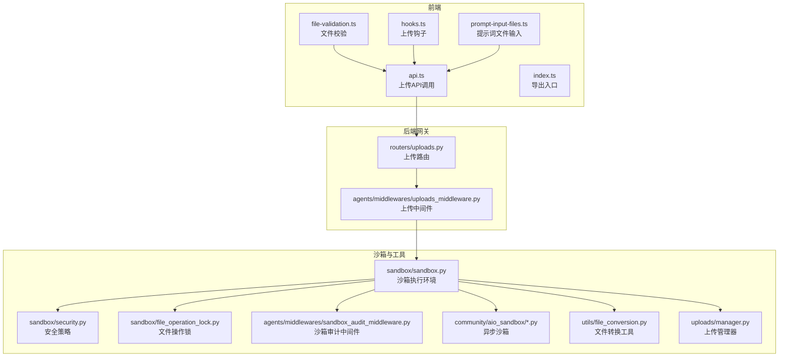
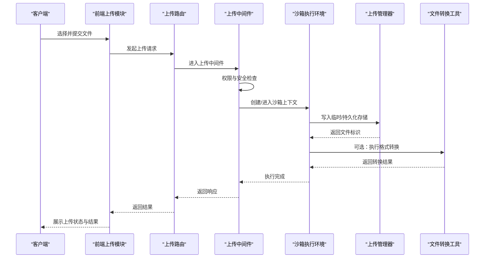
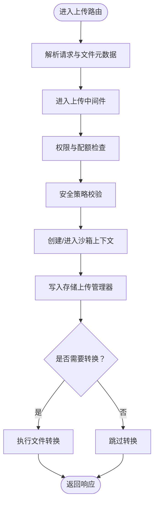
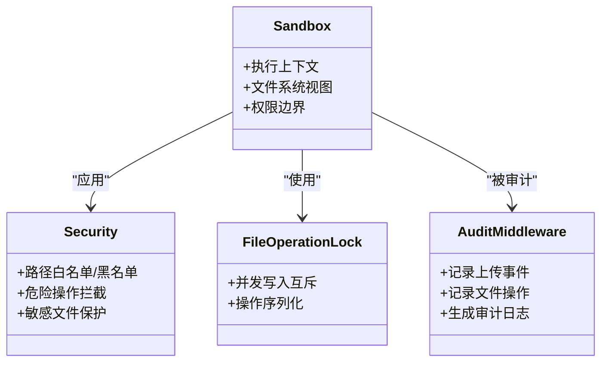
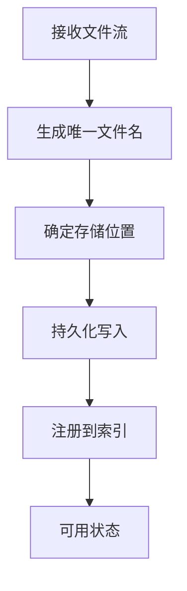
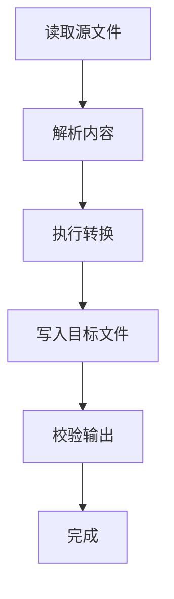
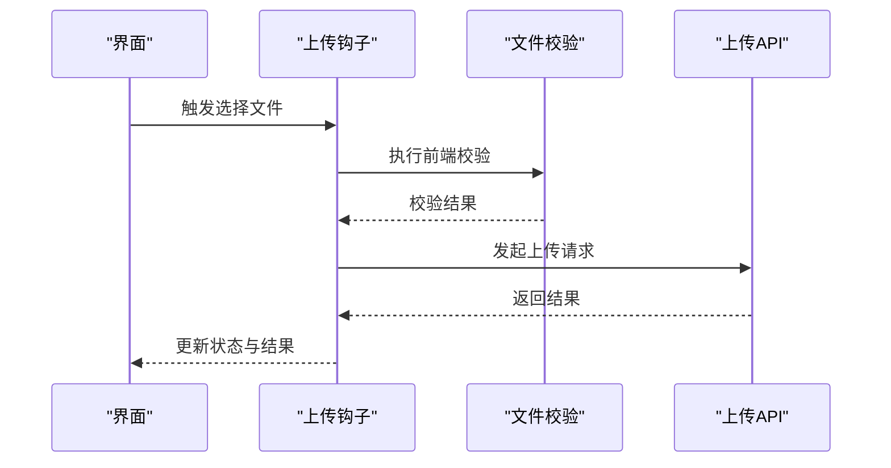
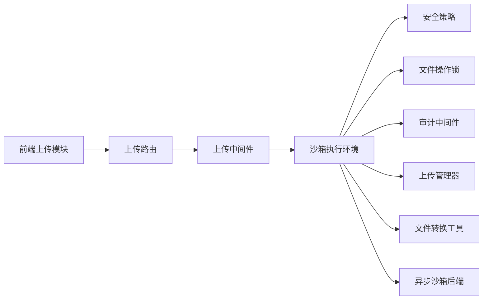

# 文件操作与管理

<cite>
**本文引用的文件**
- [FILE_UPLOAD.md](file://backend/docs/FILE_UPLOAD.md)
- [uploads.py](file://backend/app/gateway/routers/uploads.py)
- [uploads_middleware.py](file://backend/packages/harness/deerflow/agents/middlewares/uploads_middleware.py)
- [manager.py](file://backend/packages/harness/deerflow/uploads/manager.py)
- [file_conversion.py](file://backend/packages/harness/deerflow/utils/file_conversion.py)
- [sandbox.py](file://backend/packages/harness/deerflow/sandbox/sandbox.py)
- [security.py](file://backend/packages/harness/deerflow/sandbox/security.py)
- [file_operation_lock.py](file://backend/packages/harness/deerflow/sandbox/file_operation_lock.py)
- [sandbox_audit_middleware.py](file://backend/packages/harness/deerflow/agents/middlewares/sandbox_audit_middleware.py)
- [aio_sandbox.py](file://backend/packages/harness/deerflow/community/aio_sandbox/aio_sandbox.py)
- [aio_sandbox_provider.py](file://backend/packages/harness/deerflow/community/aio_sandbox/aio_sandbox_provider.py)
- [local_backend.py](file://backend/packages/harness/deerflow/community/aio_sandbox/local_backend.py)
- [remote_backend.py](file://backend/packages/harness/deerflow/community/aio_sandbox/remote_backend.py)
- [sandbox_info.py](file://backend/packages/harness/deerflow/community/aio_sandbox/sandbox_info.py)
- [sandbox_config.py](file://backend/packages/harness/deerflow/config/sandbox_config.py)
- [api.ts](file://frontend/src/core/uploads/api.ts)
- [file-validation.ts](file://frontend/src/core/uploads/file-validation.ts)
- [hooks.ts](file://frontend/src/core/uploads/hooks.ts)
- [index.ts](file://frontend/src/core/uploads/index.ts)
- [prompt-input-files.ts](file://frontend/src/core/uploads/prompt-input-files.ts)
- [test_uploads_manager.py](file://backend/tests/test_uploads_manager.py)
- [test_uploads_middleware_core_logic.py](file://backend/tests/test_uploads_middleware_core_logic.py)
- [test_file_conversion.py](file://backend/tests/test_file_conversion.py)
- [test_write_file_tool_size_guard.py](file://backend/tests/test_write_file_tool_size_guard.py)
- [test_memory_upload_filtering.py](file://backend/tests/test_memory_upload_filtering.py)
</cite>

## 目录
1. [引言](#引言)
2. [项目结构](#项目结构)
3. [核心组件](#核心组件)
4. [架构总览](#架构总览)
5. [详细组件分析](#详细组件分析)
6. [依赖关系分析](#依赖关系分析)
7. [性能考量](#性能考量)
8. [故障排查指南](#故障排查指南)
9. [结论](#结论)
10. [附录](#附录)

## 引言
本文件围绕沙箱中的文件读写、上传下载与转换功能，系统梳理后端与前端的实现与交互方式，重点覆盖以下方面：
- 文件工具的 API 接口、权限控制与安全检查机制
- 上传管理器的工作原理、文件验证规则与存储策略
- 文件转换工具的格式支持、转换流程与性能考虑
- 文件操作的最佳实践、错误处理与调试方法
- 实际使用示例与常见问题解决方案

## 项目结构
本项目在后端通过网关路由暴露上传接口，在沙箱执行环境中提供文件读写能力，并通过中间件进行权限与审计控制；前端提供上传校验与交互逻辑。

图示来源
- [uploads.py](file://backend/app/gateway/routers/uploads.py)
- [uploads_middleware.py](file://backend/packages/harness/deerflow/agents/middlewares/uploads_middleware.py)
- [sandbox.py](file://backend/packages/harness/deerflow/sandbox/sandbox.py)
- [security.py](file://backend/packages/harness/deerflow/sandbox/security.py)
- [file_operation_lock.py](file://backend/packages/harness/deerflow/sandbox/file_operation_lock.py)
- [sandbox_audit_middleware.py](file://backend/packages/harness/deerflow/agents/middlewares/sandbox_audit_middleware.py)
- [aio_sandbox.py](file://backend/packages/harness/deerflow/community/aio_sandbox/aio_sandbox.py)
- [file_conversion.py](file://backend/packages/harness/deerflow/utils/file_conversion.py)
- [manager.py](file://backend/packages/harness/deerflow/uploads/manager.py)
- [api.ts](file://frontend/src/core/uploads/api.ts)
- [file-validation.ts](file://frontend/src/core/uploads/file-validation.ts)
- [hooks.ts](file://frontend/src/core/uploads/hooks.ts)
- [index.ts](file://frontend/src/core/uploads/index.ts)
- [prompt-input-files.ts](file://frontend/src/core/uploads/prompt-input-files.ts)

章节来源
- [uploads.py](file://backend/app/gateway/routers/uploads.py)
- [uploads_middleware.py](file://backend/packages/harness/deerflow/agents/middlewares/uploads_middleware.py)
- [sandbox.py](file://backend/packages/harness/deerflow/sandbox/sandbox.py)
- [security.py](file://backend/packages/harness/deerflow/sandbox/security.py)
- [file_operation_lock.py](file://backend/packages/harness/deerflow/sandbox/file_operation_lock.py)
- [sandbox_audit_middleware.py](file://backend/packages/harness/deerflow/agents/middlewares/sandbox_audit_middleware.py)
- [aio_sandbox.py](file://backend/packages/harness/deerflow/community/aio_sandbox/aio_sandbox.py)
- [file_conversion.py](file://backend/packages/harness/deerflow/utils/file_conversion.py)
- [manager.py](file://backend/packages/harness/deerflow/uploads/manager.py)
- [api.ts](file://frontend/src/core/uploads/api.ts)
- [file-validation.ts](file://frontend/src/core/uploads/file-validation.ts)
- [hooks.ts](file://frontend/src/core/uploads/hooks.ts)
- [index.ts](file://frontend/src/core/uploads/index.ts)
- [prompt-input-files.ts](file://frontend/src/core/uploads/prompt-input-files.ts)

## 核心组件
- 上传路由与中间件：负责接收上传请求、执行权限与安全检查、协调沙箱执行与落盘。
- 沙箱执行环境：提供受限文件系统视图与操作能力，结合安全策略与审计日志。
- 上传管理器：统一管理上传文件的生命周期、命名与存储位置。
- 文件转换工具：支持多格式转换，保障输出质量与性能。
- 前端上传模块：提供文件校验、交互与上传调用封装。

章节来源
- [uploads.py](file://backend/app/gateway/routers/uploads.py)
- [uploads_middleware.py](file://backend/packages/harness/deerflow/agents/middlewares/uploads_middleware.py)
- [manager.py](file://backend/packages/harness/deerflow/uploads/manager.py)
- [file_conversion.py](file://backend/packages/harness/deerflow/utils/file_conversion.py)
- [api.ts](file://frontend/src/core/uploads/api.ts)
- [file-validation.ts](file://frontend/src/core/uploads/file-validation.ts)

## 架构总览
下图展示从用户触发上传到沙箱执行文件操作的整体流程，包括权限校验、安全策略、文件落盘与转换等环节。

图示来源
- [uploads.py](file://backend/app/gateway/routers/uploads.py)
- [uploads_middleware.py](file://backend/packages/harness/deerflow/agents/middlewares/uploads_middleware.py)
- [sandbox.py](file://backend/packages/harness/deerflow/sandbox/sandbox.py)
- [manager.py](file://backend/packages/harness/deerflow/uploads/manager.py)
- [file_conversion.py](file://backend/packages/harness/deerflow/utils/file_conversion.py)
- [api.ts](file://frontend/src/core/uploads/api.ts)

## 详细组件分析

### 上传路由与中间件
- 路由职责：接收前端上传请求，解析文件流与元数据，调用中间件进行前置处理。
- 中间件职责：执行权限校验、大小限制、类型过滤、沙箱上下文初始化与审计记录。
- 审计与安全：中间件记录上传事件，结合安全策略限制危险路径与操作。

图示来源
- [uploads.py](file://backend/app/gateway/routers/uploads.py)
- [uploads_middleware.py](file://backend/packages/harness/deerflow/agents/middlewares/uploads_middleware.py)
- [manager.py](file://backend/packages/harness/deerflow/uploads/manager.py)
- [file_conversion.py](file://backend/packages/harness/deerflow/utils/file_conversion.py)

章节来源
- [uploads.py](file://backend/app/gateway/routers/uploads.py)
- [uploads_middleware.py](file://backend/packages/harness/deerflow/agents/middlewares/uploads_middleware.py)

### 沙箱执行环境与安全
- 沙箱执行：提供隔离的文件系统视图，限制可访问路径与操作集合。
- 安全策略：禁止越权路径、危险操作与敏感文件访问。
- 文件操作锁：避免并发写冲突，保证一致性。
- 审计中间件：记录上传与文件操作行为，便于追踪与合规。

图示来源
- [sandbox.py](file://backend/packages/harness/deerflow/sandbox/sandbox.py)
- [security.py](file://backend/packages/harness/deerflow/sandbox/security.py)
- [file_operation_lock.py](file://backend/packages/harness/deerflow/sandbox/file_operation_lock.py)
- [sandbox_audit_middleware.py](file://backend/packages/harness/deerflow/agents/middlewares/sandbox_audit_middleware.py)

章节来源
- [sandbox.py](file://backend/packages/harness/deerflow/sandbox/sandbox.py)
- [security.py](file://backend/packages/harness/deerflow/sandbox/security.py)
- [file_operation_lock.py](file://backend/packages/harness/deerflow/sandbox/file_operation_lock.py)
- [sandbox_audit_middleware.py](file://backend/packages/harness/deerflow/agents/middlewares/sandbox_audit_middleware.py)

### 上传管理器
- 统一管理上传文件的命名、存储位置与生命周期。
- 支持临时文件与持久化文件的区分与迁移。
- 提供查询、清理与回滚能力，确保资源可控。

图示来源
- [manager.py](file://backend/packages/harness/deerflow/uploads/manager.py)

章节来源
- [manager.py](file://backend/packages/harness/deerflow/uploads/manager.py)

### 文件转换工具
- 格式支持：根据配置与依赖支持多种输入/输出格式的转换。
- 流程：读取源文件 → 解析内容 → 转换为目标格式 → 写入目标位置。
- 性能：缓存常用转换、限制并发、超时保护与内存上限控制。

图示来源
- [file_conversion.py](file://backend/packages/harness/deerflow/utils/file_conversion.py)

章节来源
- [file_conversion.py](file://backend/packages/harness/deerflow/utils/file_conversion.py)

### 前端上传模块
- 文件校验：在前端侧进行类型、大小与内容预检，减少无效请求。
- 交互钩子：封装上传进度、错误处理与结果回调。
- 导出入口：统一对外暴露上传能力，便于业务集成。

图示来源
- [api.ts](file://frontend/src/core/uploads/api.ts)
- [file-validation.ts](file://frontend/src/core/uploads/file-validation.ts)
- [hooks.ts](file://frontend/src/core/uploads/hooks.ts)
- [index.ts](file://frontend/src/core/uploads/index.ts)
- [prompt-input-files.ts](file://frontend/src/core/uploads/prompt-input-files.ts)

章节来源
- [api.ts](file://frontend/src/core/uploads/api.ts)
- [file-validation.ts](file://frontend/src/core/uploads/file-validation.ts)
- [hooks.ts](file://frontend/src/core/uploads/hooks.ts)
- [index.ts](file://frontend/src/core/uploads/index.ts)
- [prompt-input-files.ts](file://frontend/src/core/uploads/prompt-input-files.ts)

## 依赖关系分析
- 后端组件耦合：路由依赖中间件，中间件依赖沙箱与安全策略，沙箱依赖上传管理器与转换工具。
- 前后端交互：前端通过 API 调用后端上传路由，中间件与沙箱在服务端完成安全与执行。
- 外部依赖：异步沙箱提供本地与远程后端实现，配置文件定义沙箱参数。

图示来源
- [uploads.py](file://backend/app/gateway/routers/uploads.py)
- [uploads_middleware.py](file://backend/packages/harness/deerflow/agents/middlewares/uploads_middleware.py)
- [sandbox.py](file://backend/packages/harness/deerflow/sandbox/sandbox.py)
- [security.py](file://backend/packages/harness/deerflow/sandbox/security.py)
- [file_operation_lock.py](file://backend/packages/harness/deerflow/sandbox/file_operation_lock.py)
- [sandbox_audit_middleware.py](file://backend/packages/harness/deerflow/agents/middlewares/sandbox_audit_middleware.py)
- [manager.py](file://backend/packages/harness/deerflow/uploads/manager.py)
- [file_conversion.py](file://backend/packages/harness/deerflow/utils/file_conversion.py)
- [aio_sandbox.py](file://backend/packages/harness/deerflow/community/aio_sandbox/aio_sandbox.py)

章节来源
- [uploads.py](file://backend/app/gateway/routers/uploads.py)
- [uploads_middleware.py](file://backend/packages/harness/deerflow/agents/middlewares/uploads_middleware.py)
- [sandbox.py](file://backend/packages/harness/deerflow/sandbox/sandbox.py)
- [security.py](file://backend/packages/harness/deerflow/sandbox/security.py)
- [file_operation_lock.py](file://backend/packages/harness/deerflow/sandbox/file_operation_lock.py)
- [sandbox_audit_middleware.py](file://backend/packages/harness/deerflow/agents/middlewares/sandbox_audit_middleware.py)
- [manager.py](file://backend/packages/harness/deerflow/uploads/manager.py)
- [file_conversion.py](file://backend/packages/harness/deerflow/utils/file_conversion.py)
- [aio_sandbox.py](file://backend/packages/harness/deerflow/community/aio_sandbox/aio_sandbox.py)

## 性能考量
- 并发控制：文件操作锁避免竞态，上传中间件限制并发以防止资源争用。
- 存储策略：优先使用内存缓冲与临时目录，必要时落盘，减少磁盘抖动。
- 转换优化：缓存转换结果、限制并发数、设置超时与内存上限，避免长耗时阻塞。
- 网络与I/O：前端分片上传与断点续传可降低失败重试成本；后端采用异步沙箱提升吞吐。

## 故障排查指南
- 上传失败
  - 检查前端校验是否通过，确认文件类型与大小限制。
  - 查看上传中间件日志，定位权限或安全策略拦截原因。
  - 在沙箱审计日志中核对文件写入与转换阶段的异常。
- 转换异常
  - 确认源文件格式受支持，检查转换工具依赖是否完整。
  - 关注超时与内存限制，适当调整并发与超时阈值。
- 并发冲突
  - 检查文件操作锁是否生效，避免重复写入同一文件。
  - 评估并发策略，必要时降低同时上传任务数量。
- 资源泄露
  - 使用上传管理器的清理与回滚能力，定期扫描未使用文件。
  - 结合审计日志追踪异常文件，及时回收。

章节来源
- [test_uploads_manager.py](file://backend/tests/test_uploads_manager.py)
- [test_uploads_middleware_core_logic.py](file://backend/tests/test_uploads_middleware_core_logic.py)
- [test_file_conversion.py](file://backend/tests/test_file_conversion.py)
- [test_write_file_tool_size_guard.py](file://backend/tests/test_write_file_tool_size_guard.py)
- [test_memory_upload_filtering.py](file://backend/tests/test_memory_upload_filtering.py)

## 结论
本方案通过“前端校验 + 后端路由与中间件 + 沙箱执行 + 安全与审计”的分层设计，实现了安全、可控且高性能的文件上传与转换能力。上传管理器与文件转换工具提供了清晰的扩展点，配合异步沙箱与严格的权限控制，满足生产环境对稳定性与合规性的要求。

## 附录
- 使用示例（步骤）
  - 前端：调用上传 API，执行文件校验，监听上传进度与结果。
  - 后端：路由接收请求，中间件执行权限与安全检查，沙箱写入存储，按需转换格式。
  - 审计：中间件与沙箱审计日志记录关键事件，便于追溯。
- 常见问题
  - 文件过大：前端限制与后端配额共同控制，必要时启用分片上传。
  - 类型不支持：前端校验先行，后端安全策略二次拦截。
  - 转换失败：检查依赖与格式支持，调整并发与超时参数。