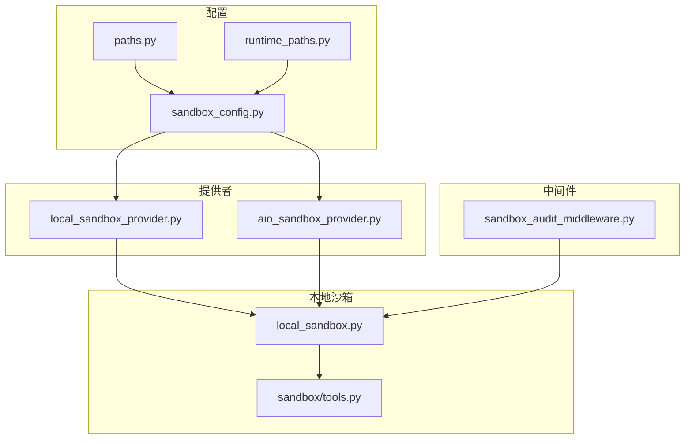
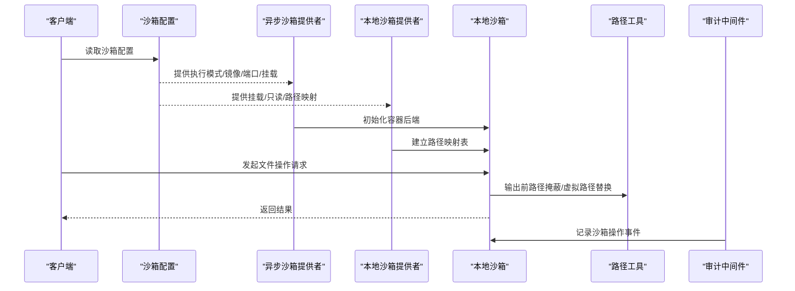
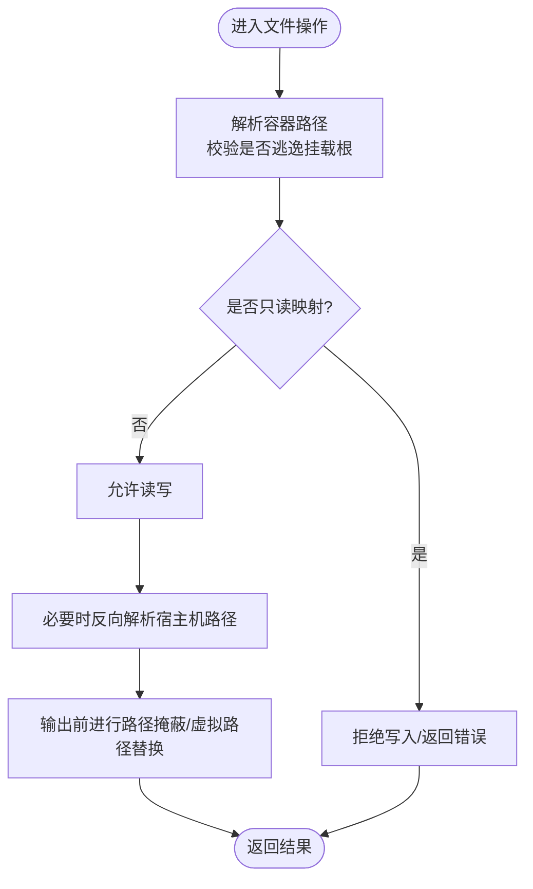
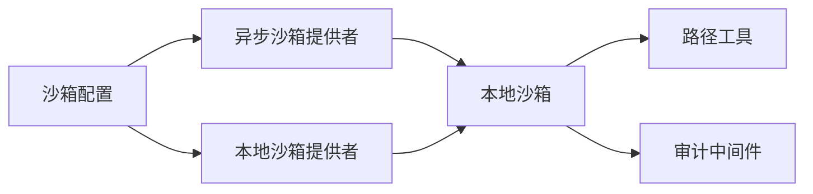

# 沙箱与文件系统

<cite>
**本文引用的文件**
- [sandbox_config.py](file://backend/packages/harness/deerflow/config/sandbox_config.py)
- [aio_sandbox_provider.py](file://backend/packages/harness/deerflow/community/aio_sandbox/aio_sandbox_provider.py)
- [local_sandbox_provider.py](file://backend/packages/harness/deerflow/sandbox/local/local_sandbox_provider.py)
- [local_sandbox.py](file://backend/packages/harness/deerflow/sandbox/local/local_sandbox.py)
- [tools.py](file://backend/packages/harness/deerflow/sandbox/tools.py)
- [sandbox_audit_middleware.py](file://backend/packages/harness/deerflow/agents/middlewares/sandbox_audit_middleware.py)
- [paths.py](file://backend/packages/harness/deerflow/config/paths.py)
- [runtime_paths.py](file://backend/packages/harness/deerflow/config/runtime_paths.py)
- [test_sandbox_tools_security.py](file://backend/tests/test_sandbox_tools_security.py)
- [test_docker_sandbox_mode_detection.py](file://backend/tests/test_docker_sandbox_mode_detection.py)
- [test_local_sandbox_provider_mounts.py](file://backend/tests/test_local_sandbox_provider_mounts.py)
- [test_local_sandbox_virtual_path_contract.py](file://backend/tests/test_local_sandbox_virtual_path_contract.py)
- [test_local_skill_storage_write.py](file://backend/tests/test_local_skill_storage_write.py)
- [FILE_UPLOAD.md](file://backend/docs/FILE_UPLOAD.md)
- [PATH_EXAMPLES.md](file://backend/docs/PATH_EXAMPLES.md)
- [SANDBOX_MEMORY_PROFILING.md](file://backend/docs/SANDBOX_MEMORY_PROFILING.md)
- [docker-compose.yaml](file://docker/docker-compose.yaml)
- [dev-entrypoint.sh](file://docker/dev-entrypoint.sh)
- [setup-sandbox.sh](file://scripts/setup-sandbox.sh)
- [doctor.py](file://scripts/doctor.py)
</cite>

## 目录
1. [简介](#简介)
2. [项目结构](#项目结构)
3. [核心组件](#核心组件)
4. [架构总览](#架构总览)
5. [详细组件分析](#详细组件分析)
6. [依赖关系分析](#依赖关系分析)
7. [性能考虑](#性能考虑)
8. [故障排查指南](#故障排查指南)
9. [结论](#结论)
10. [附录](#附录)

## 简介
本文件系统性阐述 Deer Flow 的沙箱与文件系统设计：包括执行环境隔离机制、文件系统映射规则、多模式沙箱（本地执行、容器/Docker 执行、Kubernetes 执行）的配置与使用场景、文件操作工具与上传下载机制、数据持久化策略、安全配置与审计、性能优化与故障诊断等。文档面向开发者与运维人员，既提供高层概览也包含代码级细节与图示。

## 项目结构
围绕沙箱与文件系统的关键模块分布于后端 harness 包中，并通过配置与中间件贯穿运行时生命周期：
- 配置层：沙箱配置、路径配置、运行时路径
- 提供者层：本地沙箱提供者、异步沙箱提供者（含容器后端）
- 工具层：路径映射与虚拟路径替换、审计中间件
- 测试层：覆盖路径映射契约、Docker 模式检测、挂载与写入行为
- 文档与脚本：上传文档、路径示例、内存剖析、Docker 编排与初始化脚本

图表来源
- [sandbox_config.py](file://backend/packages/harness/deerflow/config/sandbox_config.py)
- [local_sandbox_provider.py](file://backend/packages/harness/deerflow/sandbox/local/local_sandbox_provider.py)
- [aio_sandbox_provider.py](file://backend/packages/harness/deerflow/community/aio_sandbox/aio_sandbox_provider.py)
- [local_sandbox.py](file://backend/packages/harness/deerflow/sandbox/local/local_sandbox.py)
- [tools.py](file://backend/packages/harness/deerflow/sandbox/tools.py)
- [sandbox_audit_middleware.py](file://backend/packages/harness/deerflow/agents/middlewares/sandbox_audit_middleware.py)
- [paths.py](file://backend/packages/harness/deerflow/config/paths.py)
- [runtime_paths.py](file://backend/packages/harness/deerflow/config/runtime_paths.py)

章节来源
- [sandbox_config.py](file://backend/packages/harness/deerflow/config/sandbox_config.py)
- [paths.py](file://backend/packages/harness/deerflow/config/paths.py)
- [runtime_paths.py](file://backend/packages/harness/deerflow/config/runtime_paths.py)

## 核心组件
- 沙箱配置（sandbox_config.py）：定义沙箱执行模式、超时、副本数、镜像、端口、容器前缀、挂载与环境变量等参数，作为提供者与运行时的统一输入。
- 本地沙箱提供者（local_sandbox_provider.py）：负责解析挂载配置、校验宿主机路径存在性、建立容器路径到宿主机路径的映射表，并在 Docker 部署中确保网关容器可见宿主机路径。
- 异步沙箱提供者（aio_sandbox_provider.py）：根据应用配置选择本地容器后端或远程后端，支持容器镜像、端口、挂载与环境变量传递。
- 本地沙箱实现（local_sandbox.py）：提供路径解析、只读判定、反向解析（宿主机路径转容器路径）、访问控制与权限检查。
- 路径工具（sandbox/tools.py）：对输出中的真实路径进行掩蔽与虚拟路径替换，保证用户输出不泄露宿主机真实路径。
- 审计中间件（sandbox_audit_middleware.py）：在运行过程中记录与沙箱相关的操作事件，便于审计与问题定位。
- 路径配置（paths.py、runtime_paths.py）：定义线程隔离下的工作区、上传区、输出区等虚拟路径根，以及运行时路径解析策略。

章节来源
- [sandbox_config.py](file://backend/packages/harness/deerflow/config/sandbox_config.py)
- [local_sandbox_provider.py](file://backend/packages/harness/deerflow/sandbox/local/local_sandbox_provider.py)
- [aio_sandbox_provider.py](file://backend/packages/harness/deerflow/community/aio_sandbox/aio_sandbox_provider.py)
- [local_sandbox.py](file://backend/packages/harness/deerflow/sandbox/local/local_sandbox.py)
- [tools.py](file://backend/packages/harness/deerflow/sandbox/tools.py)
- [sandbox_audit_middleware.py](file://backend/packages/harness/deerflow/agents/middlewares/sandbox_audit_middleware.py)
- [paths.py](file://backend/packages/harness/deerflow/config/paths.py)
- [runtime_paths.py](file://backend/packages/harness/deerflow/config/runtime_paths.py)

## 架构总览
下图展示从配置到提供者、再到本地沙箱与工具的调用链路，以及与审计中间件的集成：

图表来源
- [aio_sandbox_provider.py](file://backend/packages/harness/deerflow/community/aio_sandbox/aio_sandbox_provider.py)
- [local_sandbox_provider.py](file://backend/packages/harness/deerflow/sandbox/local/local_sandbox_provider.py)
- [local_sandbox.py](file://backend/packages/harness/deerflow/sandbox/local/local_sandbox.py)
- [tools.py](file://backend/packages/harness/deerflow/sandbox/tools.py)
- [sandbox_audit_middleware.py](file://backend/packages/harness/deerflow/agents/middlewares/sandbox_audit_middleware.py)

## 详细组件分析

### 沙箱配置与多模式执行
- 配置项要点：执行模式（本地/容器/Kubernetes）、空闲超时、副本数、容器镜像、基础端口、容器前缀、挂载列表、环境变量。
- 模式选择依据：
  - 本地执行：适合开发与单机测试，无需容器编排，路径直接映射宿主机。
  - 容器执行：适合集成测试与生产预发，通过容器后端隔离进程与网络。
  - Kubernetes 执行：适合高可用与弹性扩缩容场景，由提供者对接集群资源。
- Docker 模式检测：测试用例验证在 Docker 环境下可正确识别执行模式，避免误判导致的路径与挂载问题。

章节来源
- [sandbox_config.py](file://backend/packages/harness/deerflow/config/sandbox_config.py)
- [aio_sandbox_provider.py](file://backend/packages/harness/deerflow/community/aio_sandbox/aio_sandbox_provider.py)
- [test_docker_sandbox_mode_detection.py](file://backend/tests/test_docker_sandbox_mode_detection.py)

### 文件系统结构与路径映射
- 虚拟路径根：每个线程隔离的工作区、上传区、输出区等以虚拟路径根组织，对外呈现统一的“/mnt/user-data”风格路径。
- 映射规则：
  - 容器内路径到宿主机路径：提供者在启动时建立映射表，确保路径解析与访问控制一致。
  - 反向解析：宿主机路径回退到容器路径，用于日志与错误信息的可读性。
  - 只读判定：基于映射表与路径白名单判断是否允许写入。
- 路径掩蔽与替换：工具对输出中的真实宿主机路径进行掩蔽与虚拟路径替换，防止敏感信息泄露。

图表来源
- [local_sandbox.py](file://backend/packages/harness/deerflow/sandbox/local/local_sandbox.py)
- [tools.py](file://backend/packages/harness/deerflow/sandbox/tools.py)

章节来源
- [local_sandbox.py](file://backend/packages/harness/deerflow/sandbox/local/local_sandbox.py)
- [tools.py](file://backend/packages/harness/deerflow/sandbox/tools.py)
- [test_local_sandbox_virtual_path_contract.py](file://backend/tests/test_local_sandbox_virtual_path_contract.py)
- [test_local_sandbox_provider_mounts.py](file://backend/tests/test_local_sandbox_provider_mounts.py)

### 上传下载机制与数据持久化
- 上传流程：前端上传文件至网关，网关将文件写入线程隔离的上传区；随后可通过沙箱工具读取或移动到工作区。
- 下载流程：输出文件位于线程隔离的输出区，通过网关路由安全地提供下载。
- 持久化策略：上传与输出区采用线程隔离的虚拟路径根，结合只读映射与访问控制，确保跨线程隔离与最小权限原则。
- 文档参考：上传接口与存储策略详见上传文档。

章节来源
- [FILE_UPLOAD.md](file://backend/docs/FILE_UPLOAD.md)
- [paths.py](file://backend/packages/harness/deerflow/config/paths.py)
- [runtime_paths.py](file://backend/packages/harness/deerflow/config/runtime_paths.py)

### 安全边界与审计
- 访问控制：路径解析严格限制在挂载根内，逃逸检测触发权限错误；只读映射阻止意外写入。
- 路径掩蔽：输出中的宿主机路径被替换为虚拟路径，降低信息泄露风险。
- 审计：中间件记录沙箱操作事件，便于追踪与合规审查。
- 测试保障：针对虚拟路径替换保留尾斜杠、Windows 风格路径分隔符等边界条件进行回归测试。

章节来源
- [local_sandbox.py](file://backend/packages/harness/deerflow/sandbox/local/local_sandbox.py)
- [tools.py](file://backend/packages/harness/deerflow/sandbox/tools.py)
- [sandbox_audit_middleware.py](file://backend/packages/harness/deerflow/agents/middlewares/sandbox_audit_middleware.py)
- [test_sandbox_tools_security.py](file://backend/tests/test_sandbox_tools_security.py)

### 实际配置示例与使用场景
- 本地开发：启用本地执行模式，挂载本地工作目录为只读，避免误改宿主机文件；设置较短空闲超时以节省资源。
- 集成测试：启用容器后端，按需挂载测试数据目录，使用随机端口避免冲突；开启审计以便问题复盘。
- 生产预发/生产：启用 Kubernetes 执行模式，按需配置 PVC 与节点亲和；通过只读映射保护关键系统路径。
- Docker 编排：使用 docker-compose 启动服务，入口脚本完成环境准备；在容器内暴露宿主机路径以满足挂载需求。
- 初始化脚本：通过沙箱初始化脚本完成环境探测与配置生成，辅助 doctor 检查沙箱配置有效性。

章节来源
- [docker-compose.yaml](file://docker/docker-compose.yaml)
- [dev-entrypoint.sh](file://docker/dev-entrypoint.sh)
- [setup-sandbox.sh](file://scripts/setup-sandbox.sh)
- [doctor.py](file://scripts/doctor.py)

## 依赖关系分析
- 配置到提供者：沙箱配置驱动提供者选择后端与参数传递。
- 提供者到沙箱：提供者负责建立映射表与路径解析策略。
- 沙箱到工具：工具负责输出掩蔽与虚拟路径替换。
- 中间件到沙箱：中间件在运行期记录事件，不改变执行逻辑但增强可观测性。

图表来源
- [sandbox_config.py](file://backend/packages/harness/deerflow/config/sandbox_config.py)
- [aio_sandbox_provider.py](file://backend/packages/harness/deerflow/community/aio_sandbox/aio_sandbox_provider.py)
- [local_sandbox_provider.py](file://backend/packages/harness/deerflow/sandbox/local/local_sandbox_provider.py)
- [local_sandbox.py](file://backend/packages/harness/deerflow/sandbox/local/local_sandbox.py)
- [tools.py](file://backend/packages/harness/deerflow/sandbox/tools.py)
- [sandbox_audit_middleware.py](file://backend/packages/harness/deerflow/agents/middlewares/sandbox_audit_middleware.py)

章节来源
- [sandbox_config.py](file://backend/packages/harness/deerflow/config/sandbox_config.py)
- [aio_sandbox_provider.py](file://backend/packages/harness/deerflow/community/aio_sandbox/aio_sandbox_provider.py)
- [local_sandbox_provider.py](file://backend/packages/harness/deerflow/sandbox/local/local_sandbox_provider.py)
- [local_sandbox.py](file://backend/packages/harness/deerflow/sandbox/local/local_sandbox.py)
- [tools.py](file://backend/packages/harness/deerflow/sandbox/tools.py)
- [sandbox_audit_middleware.py](file://backend/packages/harness/deerflow/agents/middlewares/sandbox_audit_middleware.py)

## 性能考虑
- 内存剖析：通过沙箱内存剖析文档了解运行时内存占用与热点，指导调优。
- 超时与副本：合理设置空闲超时与副本数，平衡资源占用与响应延迟。
- I/O 隔离：将频繁读写的临时文件置于内存或高速磁盘，减少慢盘影响。
- 路径解析缓存：在允许的范围内缓存常用路径映射，降低重复解析开销。

章节来源
- [SANDBOX_MEMORY_PROFILING.md](file://backend/docs/SANDBOX_MEMORY_PROFILING.md)
- [sandbox_config.py](file://backend/packages/harness/deerflow/config/sandbox_config.py)

## 故障排查指南
- 路径逃逸与权限错误：检查挂载根与路径解析逻辑，确认未越界访问宿主机任意位置。
- Docker 挂载不可见：在容器部署中确保网关容器可见宿主机路径，否则提供者会忽略无效挂载。
- 输出路径泄露：确认路径掩蔽与虚拟路径替换生效，避免真实宿主机路径出现在日志或输出中。
- 审计缺失：检查审计中间件是否启用，确保关键操作可追溯。
- Doctor 检查：使用 doctor 脚本检查沙箱配置有效性，自动提示修复建议。

章节来源
- [local_sandbox_provider.py](file://backend/packages/harness/deerflow/sandbox/local/local_sandbox_provider.py)
- [tools.py](file://backend/packages/harness/deerflow/sandbox/tools.py)
- [sandbox_audit_middleware.py](file://backend/packages/harness/deerflow/agents/middlewares/sandbox_audit_middleware.py)
- [doctor.py](file://scripts/doctor.py)

## 结论
该沙箱与文件系统方案通过“配置驱动 + 提供者 + 本地沙箱 + 工具 + 审计”的分层设计，在多执行模式下实现了强隔离与可控的文件访问。路径映射与虚拟路径替换确保了安全边界与可观测性；上传下载与持久化策略满足多线程隔离与最小权限原则；配合性能剖析与故障排查工具，可支撑从开发到生产的全生命周期使用。

## 附录
- 路径示例与最佳实践：参考路径示例文档，明确虚拟路径根与挂载规范。
- 上传接口与路由：参考上传文档，掌握上传/下载与存储策略。
- Docker 编排与入口：参考 docker-compose 与入口脚本，快速搭建容器环境。
- 初始化与健康检查：参考沙箱初始化脚本与 doctor 检查，确保环境就绪。

章节来源
- [PATH_EXAMPLES.md](file://backend/docs/PATH_EXAMPLES.md)
- [FILE_UPLOAD.md](file://backend/docs/FILE_UPLOAD.md)
- [docker-compose.yaml](file://docker/docker-compose.yaml)
- [dev-entrypoint.sh](file://docker/dev-entrypoint.sh)
- [setup-sandbox.sh](file://scripts/setup-sandbox.sh)