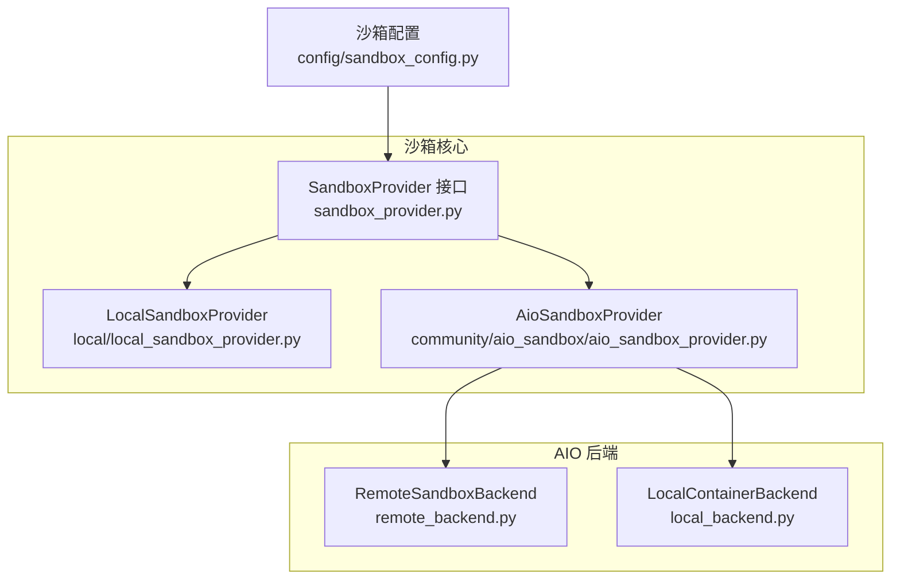
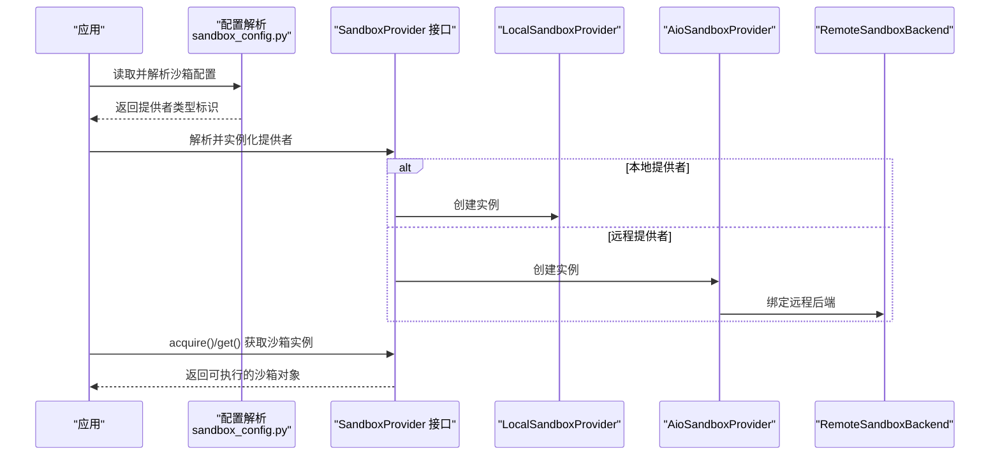
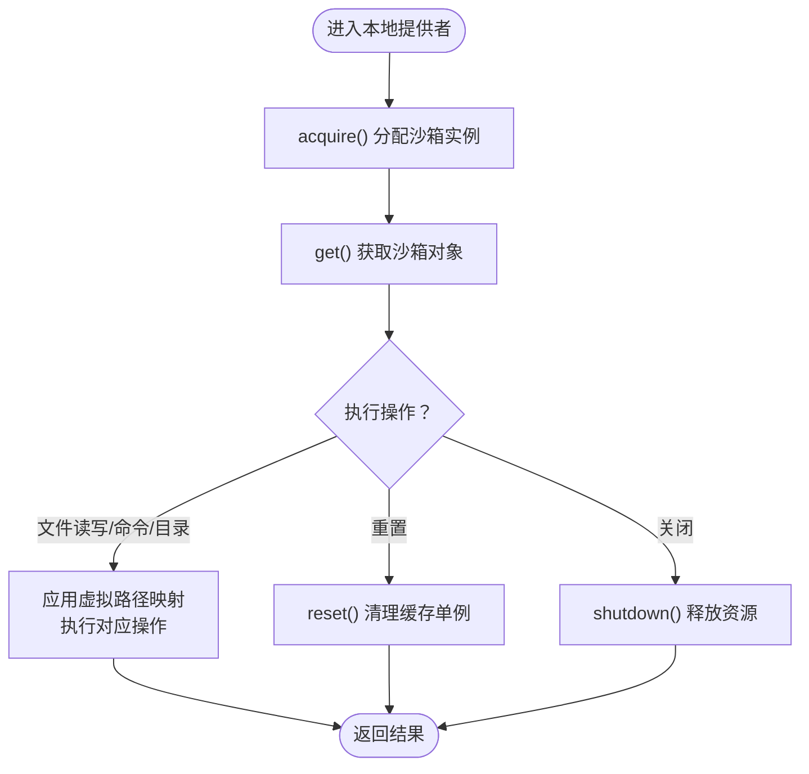
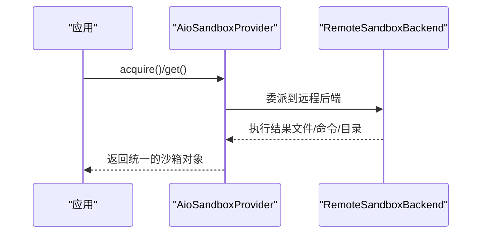
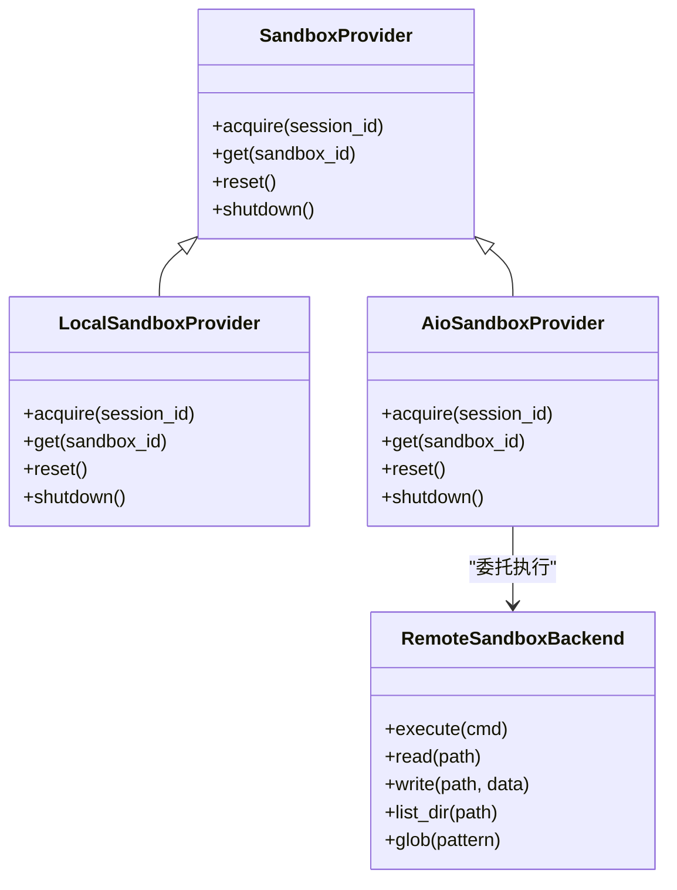
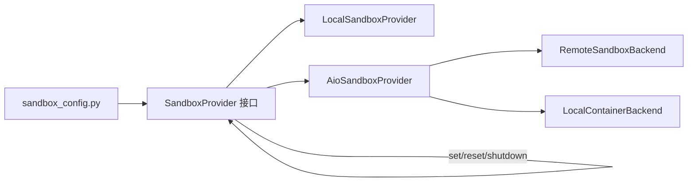

# 沙箱提供者

<cite>
**本文引用的文件**
- [sandbox_provider.py](file://backend/packages/harness/deerflow/sandbox/sandbox_provider.py)
- [local_sandbox_provider.py](file://backend/packages/harness/deerflow/sandbox/local/local_sandbox_provider.py)
- [aio_sandbox_provider.py](file://backend/packages/harness/deerflow/community/aio_sandbox/aio_sandbox_provider.py)
- [remote_backend.py](file://backend/packages/harness/deerflow/community/aio_sandbox/remote_backend.py)
- [local_backend.py](file://backend/packages/harness/deerflow/community/aio_sandbox/local_backend.py)
- [sandbox_config.py](file://backend/packages/harness/deerflow/config/sandbox_config.py)
- [__init__.py（沙箱包）](file://backend/packages/harness/deerflow/sandbox/__init__.py)
- [__init__.py（AIO沙箱包）](file://backend/packages/harness/deerflow/community/aio_sandbox/__init__.py)
- [test_local_sandbox_provider_mounts.py](file://backend/tests/test_local_sandbox_provider_mounts.py)
- [test_remote_sandbox_backend.py](file://backend/tests/test_remote_sandbox_backend.py)
- [test_sandbox_middleware.py](file://backend/tests/test_sandbox_middleware.py)
</cite>

## 目录
1. [引言](#引言)
2. [项目结构](#项目结构)
3. [核心组件](#核心组件)
4. [架构总览](#架构总览)
5. [详细组件分析](#详细组件分析)
6. [依赖关系分析](#依赖关系分析)
7. [性能考量](#性能考量)
8. [故障排查指南](#故障排查指南)
9. [结论](#结论)
10. [附录：配置与最佳实践](#附录配置与最佳实践)

## 引言
本文件面向“沙箱提供者”的技术文档，系统阐述以下内容：
- 通用接口 SandboxProvider 的设计与职责
- LocalSandboxProvider 的本地执行机制与挂载策略
- AioSandboxProvider 及其后端 RemoteSandboxBackend 的远程执行模式
- 提供者选择策略、性能特征与适用场景
- 初始化流程、配置参数、错误处理与最佳实践

## 项目结构
围绕沙箱提供者的关键模块分布如下：
- 核心接口与默认提供者管理：sandbox_provider.py
- 本地提供者实现：sandbox/local/local_sandbox_provider.py
- AIO 提供者与后端：community/aio_sandbox/aio_sandbox_provider.py、remote_backend.py、local_backend.py
- 配置入口：config/sandbox_config.py
- 包导出：sandbox/__init__.py、community/aio_sandbox/__init__.py
- 测试覆盖：涉及本地挂载、远程后端、中间件适配等测试用例

图表来源
- [sandbox_provider.py:1-121](file://backend/packages/harness/deerflow/sandbox/sandbox_provider.py#L1-L121)
- [local_sandbox_provider.py:1-220](file://backend/packages/harness/deerflow/sandbox/local/local_sandbox_provider.py#L1-L220)
- [aio_sandbox_provider.py:100-140](file://backend/packages/harness/deerflow/community/aio_sandbox/aio_sandbox_provider.py#L100-L140)
- [remote_backend.py](file://backend/packages/harness/deerflow/community/aio_sandbox/remote_backend.py)
- [local_backend.py](file://backend/packages/harness/deerflow/community/aio_sandbox/local_backend.py)
- [sandbox_config.py](file://backend/packages/harness/deerflow/config/sandbox_config.py)

章节来源
- [sandbox_provider.py:1-121](file://backend/packages/harness/deerflow/sandbox/sandbox_provider.py#L1-L121)
- [local_sandbox_provider.py:1-220](file://backend/packages/harness/deerflow/sandbox/local/local_sandbox_provider.py#L1-L220)
- [aio_sandbox_provider.py:100-140](file://backend/packages/harness/deerflow/community/aio_sandbox/aio_sandbox_provider.py#L100-L140)
- [remote_backend.py](file://backend/packages/harness/deerflow/community/aio_sandbox/remote_backend.py)
- [local_backend.py](file://backend/packages/harness/deerflow/community/aio_sandbox/local_backend.py)
- [sandbox_config.py](file://backend/packages/harness/deerflow/config/sandbox_config.py)

## 核心组件
- SandboxProvider 抽象接口：定义沙箱生命周期管理与实例获取的统一契约，支持重置与关闭，便于在运行时切换或清理。
- LocalSandboxProvider：基于本地文件系统的沙箱提供者，负责将用户工作区、上传、输出等路径映射到容器或隔离环境，确保虚拟路径与宿主路径的一致性。
- AioSandboxProvider：异步沙箱提供者，封装了远程与本地容器两种后端，通过统一接口对外暴露沙箱能力，适合高并发与分布式场景。
- RemoteSandboxBackend：远程后端实现，用于在远端节点上执行沙箱命令与文件操作，适用于跨主机隔离与资源池化。
- 配置入口：sandbox_config.py 提供沙箱使用方式的解析与选择。

章节来源
- [sandbox_provider.py:1-121](file://backend/packages/harness/deerflow/sandbox/sandbox_provider.py#L1-L121)
- [local_sandbox_provider.py:1-220](file://backend/packages/harness/deerflow/sandbox/local/local_sandbox_provider.py#L1-L220)
- [aio_sandbox_provider.py:100-140](file://backend/packages/harness/deerflow/community/aio_sandbox/aio_sandbox_provider.py#L100-L140)
- [remote_backend.py](file://backend/packages/harness/deerflow/community/aio_sandbox/remote_backend.py)
- [sandbox_config.py](file://backend/packages/harness/deerflow/config/sandbox_config.py)

## 架构总览
下图展示了从配置到具体提供者与后端的调用链路，以及默认提供者的管理与重置流程。

图表来源
- [sandbox_provider.py:71-90](file://backend/packages/harness/deerflow/sandbox/sandbox_provider.py#L71-L90)
- [aio_sandbox_provider.py:100-140](file://backend/packages/harness/deerflow/community/aio_sandbox/aio_sandbox_provider.py#L100-L140)
- [remote_backend.py](file://backend/packages/harness/deerflow/community/aio_sandbox/remote_backend.py)
- [sandbox_config.py](file://backend/packages/harness/deerflow/config/sandbox_config.py)

## 详细组件分析

### SandboxProvider 接口与默认提供者管理
- 职责：抽象沙箱生命周期管理，包括实例获取、重置与关闭；提供全局默认提供者的设置、重置与关闭函数，确保在配置变更或应用退出时正确释放资源。
- 关键点：
  - reset()：允许提供者清除跨实例的缓存状态（如本地提供者的单例缓存），避免配置变更不生效。
  - shutdown_sandbox_provider()：在应用退出或需要完全重置时，先调用提供者的 shutdown（若存在）再清空全局实例。
  - set_sandbox_provider()：注入自定义或测试用提供者，便于单元测试与集成测试。

章节来源
- [sandbox_provider.py:1-121](file://backend/packages/harness/deerflow/sandbox/sandbox_provider.py#L1-L121)

### LocalSandboxProvider（本地执行机制）
- 设计要点：
  - 将用户工作区、上传、输出等虚拟路径映射到宿主文件系统，保证虚拟路径与实际路径一致，便于工具链与脚本按预期访问。
  - 支持对挂载路径的校验与一致性检查，确保在多租户或多会话场景下的隔离与安全。
- 典型行为：
  - acquire()：根据会话标识获取沙箱实例。
  - get()：返回已分配的沙箱对象，支持文件读写、命令执行、目录遍历与通配符匹配等。
  - 重置与关闭：通过 reset() 清除缓存的单例，shutdown() 释放所有资源。
- 虚拟路径契约：
  - 测试覆盖了虚拟路径写入、读取、目录列举与通配符匹配的行为，确保虚拟路径在公共 API 下被正确反解析与呈现。

图表来源
- [local_sandbox_provider.py:1-220](file://backend/packages/harness/deerflow/sandbox/local/local_sandbox_provider.py#L1-L220)
- [test_local_sandbox_provider_mounts.py:543-779](file://backend/tests/test_local_sandbox_provider_mounts.py#L543-L779)
- [test_local_sandbox_virtual_path_contract.py:88-115](file://backend/tests/test_local_sandbox_virtual_path_contract.py#L88-L115)

章节来源
- [local_sandbox_provider.py:1-220](file://backend/packages/harness/deerflow/sandbox/local/local_sandbox_provider.py#L1-L220)
- [test_local_sandbox_provider_mounts.py:543-779](file://backend/tests/test_local_sandbox_provider_mounts.py#L543-L779)
- [test_local_sandbox_virtual_path_contract.py:88-115](file://backend/tests/test_local_sandbox_virtual_path_contract.py#L88-L115)

### AioSandboxProvider 与 RemoteSandboxBackend（远程执行模式）
- 设计要点：
  - AioSandboxProvider 作为统一入口，内部可绑定 LocalContainerBackend 或 RemoteSandboxBackend。
  - RemoteSandboxBackend 在远端节点执行沙箱操作，适合跨主机隔离、资源池化与弹性扩展。
- 关键流程：
  - 通过配置解析确定使用哪种后端。
  - 提供者实例化后，对外暴露与本地提供者一致的沙箱 API，屏蔽后端差异。
- 测试验证：
  - 对远程后端的可用性与行为进行测试，确保在不同网络与权限环境下稳定运行。

图表来源
- [aio_sandbox_provider.py:100-140](file://backend/packages/harness/deerflow/community/aio_sandbox/aio_sandbox_provider.py#L100-L140)
- [remote_backend.py](file://backend/packages/harness/deerflow/community/aio_sandbox/remote_backend.py)
- [test_remote_sandbox_backend.py](file://backend/tests/test_remote_sandbox_backend.py)

章节来源
- [aio_sandbox_provider.py:100-140](file://backend/packages/harness/deerflow/community/aio_sandbox/aio_sandbox_provider.py#L100-L140)
- [remote_backend.py](file://backend/packages/harness/deerflow/community/aio_sandbox/remote_backend.py)
- [test_remote_sandbox_backend.py](file://backend/tests/test_remote_sandbox_backend.py)

### 类关系与依赖（代码级）

图表来源
- [sandbox_provider.py:1-121](file://backend/packages/harness/deerflow/sandbox/sandbox_provider.py#L1-L121)
- [local_sandbox_provider.py:1-220](file://backend/packages/harness/deerflow/sandbox/local/local_sandbox_provider.py#L1-L220)
- [aio_sandbox_provider.py:100-140](file://backend/packages/harness/deerflow/community/aio_sandbox/aio_sandbox_provider.py#L100-L140)
- [remote_backend.py](file://backend/packages/harness/deerflow/community/aio_sandbox/remote_backend.py)

## 依赖关系分析
- 配置驱动：sandbox_config.py 负责解析沙箱使用方式（如 use 字段），并由 SandboxProvider 实例化具体提供者。
- 默认提供者管理：sandbox_provider.py 提供 set/reset/shutdown 等全局函数，确保提供者生命周期可控。
- AIO 提供者与后端：aio_sandbox_provider.py 与 remote_backend.py/local_backend.py 形成松耦合，通过统一接口对外暴露能力。
- 包导出：__init__.py 文件将关键类暴露给上层模块，便于按需导入。

图表来源
- [sandbox_config.py](file://backend/packages/harness/deerflow/config/sandbox_config.py)
- [sandbox_provider.py:1-121](file://backend/packages/harness/deerflow/sandbox/sandbox_provider.py#L1-L121)
- [aio_sandbox_provider.py:100-140](file://backend/packages/harness/deerflow/community/aio_sandbox/aio_sandbox_provider.py#L100-L140)
- [remote_backend.py](file://backend/packages/harness/deerflow/community/aio_sandbox/remote_backend.py)
- [local_backend.py](file://backend/packages/harness/deerflow/community/aio_sandbox/local_backend.py)

章节来源
- [sandbox_config.py](file://backend/packages/harness/deerflow/config/sandbox_config.py)
- [sandbox_provider.py:1-121](file://backend/packages/harness/deerflow/sandbox/sandbox_provider.py#L1-L121)
- [aio_sandbox_provider.py:100-140](file://backend/packages/harness/deerflow/community/aio_sandbox/aio_sandbox_provider.py#L100-L140)
- [remote_backend.py](file://backend/packages/harness/deerflow/community/aio_sandbox/remote_backend.py)
- [local_backend.py](file://backend/packages/harness/deerflow/community/aio_sandbox/local_backend.py)

## 性能考量
- 本地提供者（LocalSandboxProvider）
  - 优势：低延迟、无网络开销，适合开发调试与小规模任务。
  - 注意：I/O 密集场景下需关注宿主磁盘性能与并发限制。
- 远程提供者（AioSandboxProvider + RemoteSandboxBackend）
  - 优势：可横向扩展、资源池化、跨主机隔离，适合高并发与生产环境。
  - 注意：网络延迟与带宽可能成为瓶颈，需合理规划数据传输与命令粒度。
- 中间件适配
  - 测试中包含同步与异步提供者的适配示例，表明在不同中间件栈下可灵活替换提供者以满足性能与一致性需求。

章节来源
- [test_sandbox_middleware.py:16-66](file://backend/tests/test_sandbox_middleware.py#L16-L66)

## 故障排查指南
- 提供者重置与关闭
  - 若修改了挂载配置或需要强制刷新缓存，应调用 reset()；在应用退出前调用 shutdown_sandbox_provider() 以确保资源释放。
- 虚拟路径问题
  - 若发现虚拟路径无法访问或列出异常，检查挂载映射与路径契约是否符合预期；参考本地挂载与虚拟路径契约的测试用例定位问题。
- 远程后端连通性
  - 若远程执行失败，优先检查网络连通性、认证凭据与目标节点权限；结合远程后端测试用例逐步缩小范围。

章节来源
- [sandbox_provider.py:84-121](file://backend/packages/harness/deerflow/sandbox/sandbox_provider.py#L84-L121)
- [test_local_sandbox_provider_mounts.py:543-779](file://backend/tests/test_local_sandbox_provider_mounts.py#L543-L779)
- [test_remote_sandbox_backend.py](file://backend/tests/test_remote_sandbox_backend.py)

## 结论
- SandboxProvider 提供统一抽象，屏蔽本地与远程差异，便于在不同部署形态间切换。
- LocalSandboxProvider 适合本地开发与小规模任务，强调路径映射与一致性。
- AioSandboxProvider 与 RemoteSandboxBackend 适合高并发与分布式场景，强调可扩展性与隔离性。
- 通过配置解析与默认提供者管理，系统可在启动阶段完成提供者装配，并在运行期与退出期进行可控的重置与关闭。

## 附录：配置与最佳实践
- 配置入口
  - 使用 sandbox_config.py 解析沙箱配置，指定具体提供者类型与后端参数。
- 初始化流程
  - 应用启动时读取配置，解析提供者类型并实例化；在需要时通过 set_sandbox_provider 注入自定义提供者。
- 错误处理
  - 在配置变更后调用 reset() 刷新缓存；在应用退出前调用 shutdown_sandbox_provider() 完全释放资源。
- 最佳实践
  - 开发阶段优先使用本地提供者，便于快速迭代；生产环境优先考虑远程提供者以获得更好的隔离与弹性。
  - 明确虚拟路径契约，确保工具链与脚本在不同提供者间保持一致行为。
  - 对远程后端进行容量与网络优化，避免大文件频繁传输与长耗时命令阻塞。

章节来源
- [sandbox_config.py](file://backend/packages/harness/deerflow/config/sandbox_config.py)
- [sandbox_provider.py:71-121](file://backend/packages/harness/deerflow/sandbox/sandbox_provider.py#L71-L121)
- [test_local_sandbox_provider_mounts.py:543-779](file://backend/tests/test_local_sandbox_provider_mounts.py#L543-L779)
- [test_remote_sandbox_backend.py](file://backend/tests/test_remote_sandbox_backend.py)