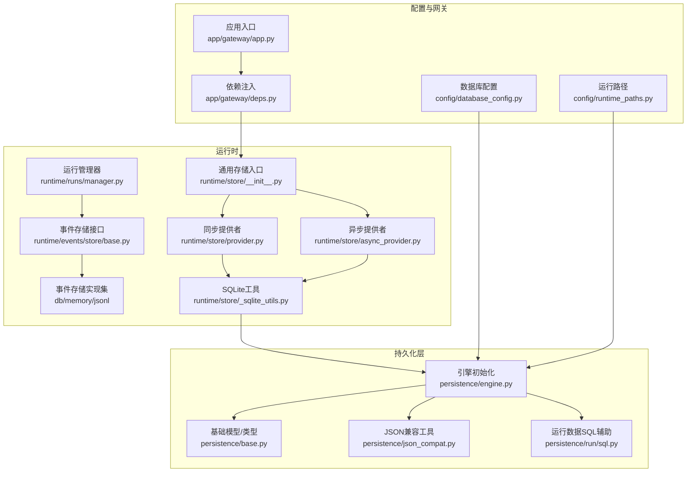
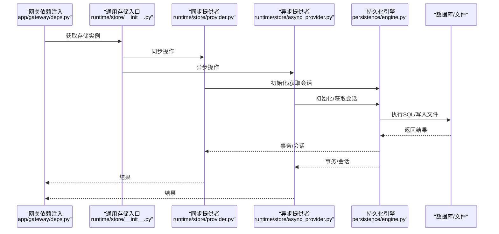
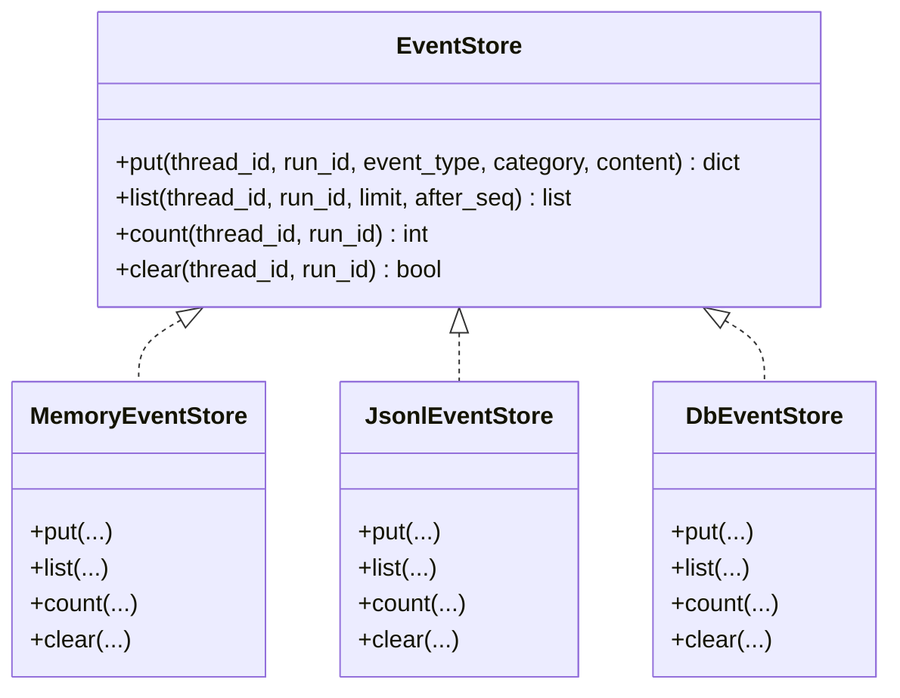
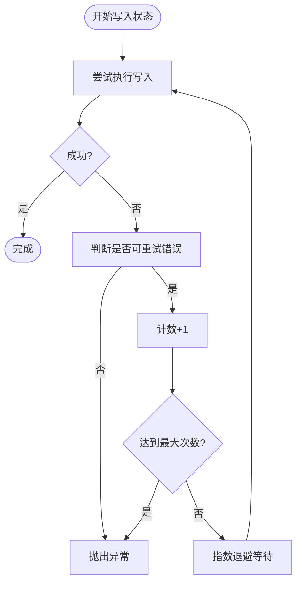
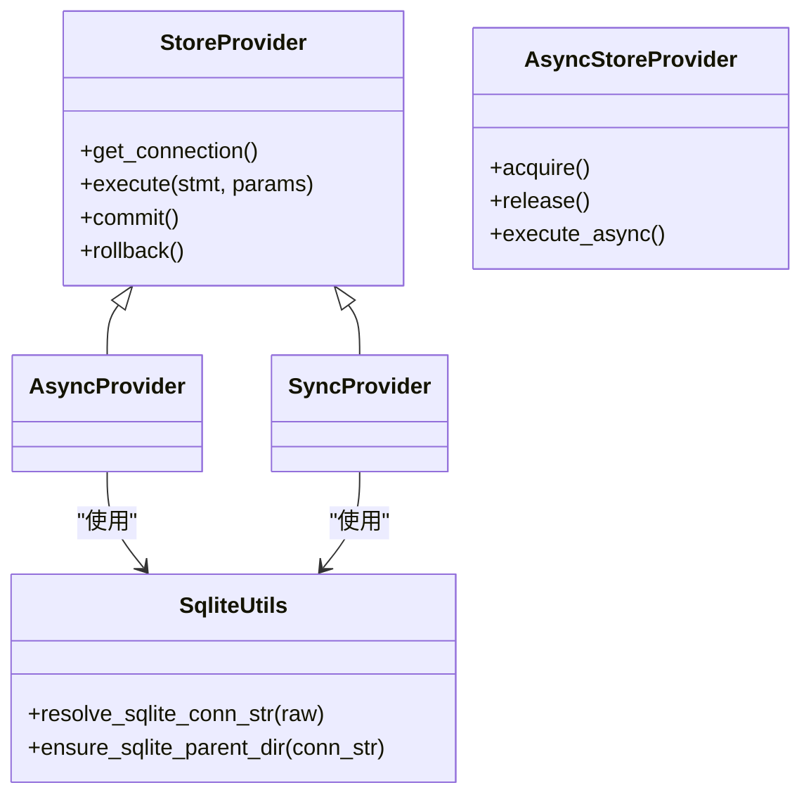
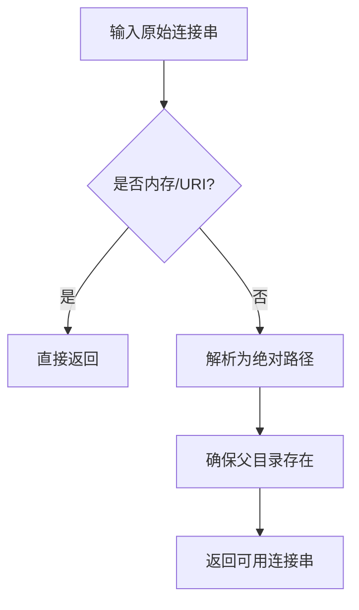
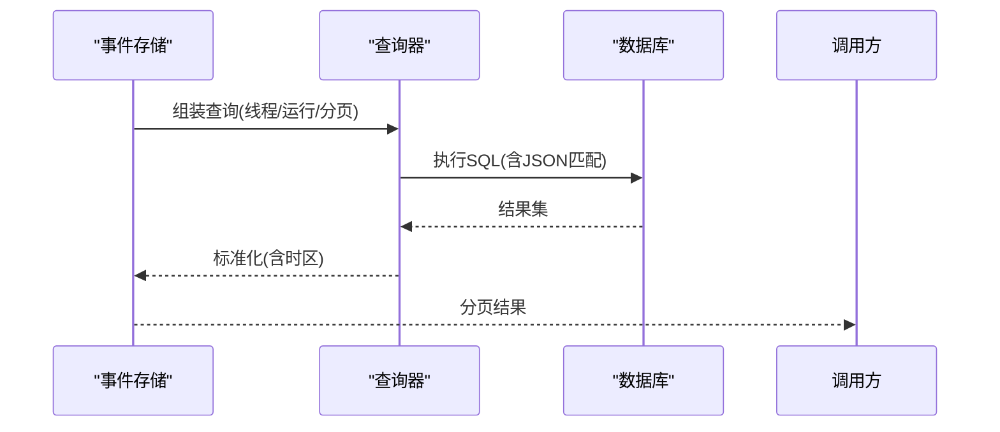
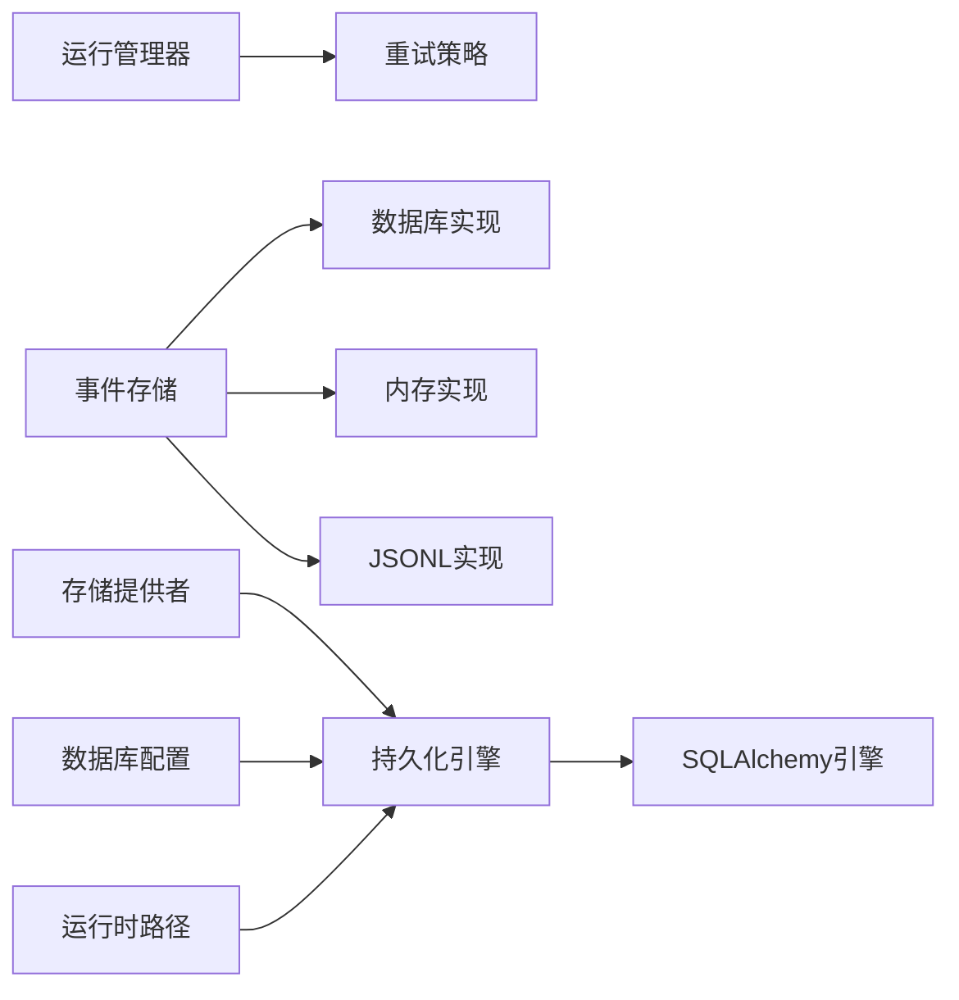

# 运行时存储

<cite>
**本文引用的文件**
- [runtime/manager.py](file://backend/packages/harness/deerflow/runtime/manager.py)
- [runtime/runs/manager.py](file://backend/packages/harness/deerflow/runtime/runs/manager.py)
- [runtime/store/__init__.py](file://backend/packages/harness/deerflow/runtime/store/__init__.py)
- [runtime/store/provider.py](file://backend/packages/harness/deerflow/runtime/store/provider.py)
- [runtime/store/async_provider.py](file://backend/packages/harness/deerflow/runtime/store/async_provider.py)
- [runtime/store/_sqlite_utils.py](file://backend/packages/harness/deerflow/runtime/store/_sqlite_utils.py)
- [runtime/events/store/base.py](file://backend/packages/harness/deerflow/runtime/events/store/base.py)
- [runtime/events/store/db.py](file://backend/packages/harness/deerflow/runtime/events/store/db.py)
- [runtime/events/store/memory.py](file://backend/packages/harness/deerflow/runtime/events/store/memory.py)
- [runtime/events/store/jsonl.py](file://backend/packages/harness/deerflow/runtime/events/store/jsonl.py)
- [runtime/serialization.py](file://backend/packages/harness/deerflow/runtime/serialization.py)
- [persistence/engine.py](file://backend/packages/harness/deerflow/persistence/engine.py)
- [persistence/base.py](file://backend/packages/harness/deerflow/persistence/base.py)
- [persistence/json_compat.py](file://backend/packages/harness/deerflow/persistence/json_compat.py)
- [persistence/run/sql.py](file://backend/packages/harness/deerflow/persistence/run/sql.py)
- [config/database_config.py](file://backend/packages/harness/deerflow/config/database_config.py)
- [config/runtime_paths.py](file://backend/packages/harness/deerflow/config/runtime_paths.py)
- [app/gateway/deps.py](file://backend/app/gateway/deps.py)
- [app/gateway/app.py](file://backend/app/gateway/app.py)
- [tests/test_persistence_scaffold.py](file://backend/tests/test_persistence_scaffold.py)
- [tests/test_persistence_timezone.py](file://backend/tests/test_persistence_timezone.py)
- [tests/test_run_event_store.py](file://backend/tests/test_run_event_store.py)
- [tests/test_run_manager.py](file://backend/tests/test_run_manager.py)
</cite>

## 目录
1. [引言](#引言)
2. [项目结构](#项目结构)
3. [核心组件](#核心组件)
4. [架构总览](#架构总览)
5. [详细组件分析](#详细组件分析)
6. [依赖关系分析](#依赖关系分析)
7. [性能考量](#性能考量)
8. [故障排查指南](#故障排查指南)
9. [结论](#结论)
10. [附录](#附录)

## 引言
本文件面向“运行时存储”主题，聚焦沙箱执行过程中数据持久化与状态管理机制。内容覆盖：
- 同步与异步存储提供者实现差异、性能特征与适用场景
- SQLite 工具函数、连接管理与事务处理
- 存储接口设计原则、数据序列化与查询优化
- 存储配置选项、容量规划与备份恢复策略
- 性能调优建议与故障排查方法

## 项目结构
运行时存储体系由“事件存储（运行事件）”“运行记录存储（运行状态）”“通用持久化引擎”三部分构成，并通过配置与依赖注入在运行时装配。

图表来源
- [runtime/runs/manager.py:1-167](file://backend/packages/harness/deerflow/runtime/runs/manager.py#L1-L167)
- [runtime/events/store/base.py](file://backend/packages/harness/deerflow/runtime/events/store/base.py)
- [runtime/events/store/db.py](file://backend/packages/harness/deerflow/runtime/events/store/db.py)
- [runtime/events/store/memory.py](file://backend/packages/harness/deerflow/runtime/events/store/memory.py)
- [runtime/events/store/jsonl.py](file://backend/packages/harness/deerflow/runtime/events/store/jsonl.py)
- [runtime/store/__init__.py](file://backend/packages/harness/deerflow/runtime/store/__init__.py)
- [runtime/store/provider.py](file://backend/packages/harness/deerflow/runtime/store/provider.py)
- [runtime/store/async_provider.py](file://backend/packages/harness/deerflow/runtime/store/async_provider.py)
- [runtime/store/_sqlite_utils.py:1-28](file://backend/packages/harness/deerflow/runtime/store/_sqlite_utils.py#L1-L28)
- [persistence/engine.py:57-133](file://backend/packages/harness/deerflow/persistence/engine.py#L57-L133)
- [persistence/base.py](file://backend/packages/harness/deerflow/persistence/base.py)
- [persistence/json_compat.py](file://backend/packages/harness/deerflow/persistence/json_compat.py)
- [persistence/run/sql.py:39-64](file://backend/packages/harness/deerflow/persistence/run/sql.py#L39-L64)
- [config/database_config.py](file://backend/packages/harness/deerflow/config/database_config.py)
- [config/runtime_paths.py](file://backend/packages/harness/deerflow/config/runtime_paths.py)
- [app/gateway/deps.py:169-269](file://backend/app/gateway/deps.py#L169-L269)
- [app/gateway/app.py:123-143](file://backend/app/gateway/app.py#L123-L143)

章节来源
- [runtime/runs/manager.py:1-167](file://backend/packages/harness/deerflow/runtime/runs/manager.py#L1-L167)
- [runtime/events/store/base.py](file://backend/packages/harness/deerflow/runtime/events/store/base.py)
- [runtime/store/__init__.py](file://backend/packages/harness/deerflow/runtime/store/__init__.py)
- [persistence/engine.py:57-133](file://backend/packages/harness/deerflow/persistence/engine.py#L57-L133)
- [config/database_config.py](file://backend/packages/harness/deerflow/config/database_config.py)

## 核心组件
- 运行管理器：负责运行状态写入的重试策略、锁竞争处理与最终落盘可靠性。
- 事件存储：统一事件写入/读取接口，支持内存、JSONL、数据库三种后端。
- 通用存储提供者：同步与异步两类，封装 SQLite/文件/数据库等后端细节。
- 持久化引擎：统一初始化 SQLite/PostgreSQL 引擎、连接池、WAL/PRAGMA 设置与表自动迁移。
- 序列化工具：对 LangChain/LangGraph 对象进行稳定可重复的 JSON 序列化。
- 配置与路径：集中管理数据库后端、SQLite 文件路径、运行时目录等。

章节来源
- [runtime/runs/manager.py:64-167](file://backend/packages/harness/deerflow/runtime/runs/manager.py#L64-L167)
- [runtime/events/store/base.py](file://backend/packages/harness/deerflow/runtime/events/store/base.py)
- [runtime/store/provider.py](file://backend/packages/harness/deerflow/runtime/store/provider.py)
- [runtime/store/async_provider.py](file://backend/packages/harness/deerflow/runtime/store/async_provider.py)
- [persistence/engine.py:57-133](file://backend/packages/harness/deerflow/persistence/engine.py#L57-L133)
- [runtime/serialization.py:16-78](file://backend/packages/harness/deerflow/runtime/serialization.py#L16-L78)
- [config/database_config.py](file://backend/packages/harness/deerflow/config/database_config.py)

## 架构总览
运行时存储在“事件层”和“运行状态层”分别提供一致的抽象与多后端实现；通过依赖注入在网关层装配；持久化引擎负责底层连接与事务生命周期。

图表来源
- [app/gateway/deps.py:169-269](file://backend/app/gateway/deps.py#L169-L269)
- [runtime/store/__init__.py](file://backend/packages/harness/deerflow/runtime/store/__init__.py)
- [runtime/store/provider.py](file://backend/packages/harness/deerflow/runtime/store/provider.py)
- [runtime/store/async_provider.py](file://backend/packages/harness/deerflow/runtime/store/async_provider.py)
- [persistence/engine.py:57-133](file://backend/packages/harness/deerflow/persistence/engine.py#L57-L133)

## 详细组件分析

### 事件存储：接口与多后端实现
- 接口设计：统一定义事件写入、读取、分页与清理能力，便于替换后端。
- 内存实现：适合测试与低延迟场景，无外部依赖。
- JSONL 实现：适合日志型事件追加与离线分析，具备顺序一致性。
- 数据库实现：支持复杂查询、事务与并发写入，适合生产环境。

图表来源
- [runtime/events/store/base.py](file://backend/packages/harness/deerflow/runtime/events/store/base.py)
- [runtime/events/store/memory.py](file://backend/packages/harness/deerflow/runtime/events/store/memory.py)
- [runtime/events/store/jsonl.py](file://backend/packages/harness/deerflow/runtime/events/store/jsonl.py)
- [runtime/events/store/db.py](file://backend/packages/harness/deerflow/runtime/events/store/db.py)

章节来源
- [runtime/events/store/base.py](file://backend/packages/harness/deerflow/runtime/events/store/base.py)
- [runtime/events/store/memory.py](file://backend/packages/harness/deerflow/runtime/events/store/memory.py)
- [runtime/events/store/jsonl.py](file://backend/packages/harness/deerflow/runtime/events/store/jsonl.py)
- [runtime/events/store/db.py](file://backend/packages/harness/deerflow/runtime/events/store/db.py)
- [tests/test_run_event_store.py:304-316](file://backend/tests/test_run_event_store.py#L304-L316)

### 运行状态存储：重试策略与锁竞争处理
- 可重试错误识别：针对 SQLite 的“database is locked/busy”等瞬时错误进行判定。
- 退避重试：指数退避与上限控制，避免雪崩式重试。
- 状态写入幂等性：结合唯一键与条件更新，保证最终一致性。

图表来源
- [runtime/runs/manager.py:34-167](file://backend/packages/harness/deerflow/runtime/runs/manager.py#L34-L167)

章节来源
- [runtime/runs/manager.py:34-167](file://backend/packages/harness/deerflow/runtime/runs/manager.py#L34-L167)
- [tests/test_run_manager.py:24-45](file://backend/tests/test_run_manager.py#L24-L45)

### 通用存储提供者：同步与异步差异
- 同步提供者：面向阻塞式调用，适合轻量任务或内部批处理。
- 异步提供者：面向高并发与长连接，适合实时事件流与多租户场景。
- 共享 SQLite 工具：统一解析连接字符串、确保父目录存在，避免路径歧义。

图表来源
- [runtime/store/provider.py](file://backend/packages/harness/deerflow/runtime/store/provider.py)
- [runtime/store/async_provider.py](file://backend/packages/harness/deerflow/runtime/store/async_provider.py)
- [runtime/store/_sqlite_utils.py:10-28](file://backend/packages/harness/deerflow/runtime/store/_sqlite_utils.py#L10-L28)

章节来源
- [runtime/store/provider.py](file://backend/packages/harness/deerflow/runtime/store/provider.py)
- [runtime/store/async_provider.py](file://backend/packages/harness/deerflow/runtime/store/async_provider.py)
- [runtime/store/_sqlite_utils.py:10-28](file://backend/packages/harness/deerflow/runtime/store/_sqlite_utils.py#L10-L28)

### SQLite 工具函数与连接管理
- 连接字符串解析：区分内存数据库与文件 URI，普通路径转绝对路径。
- 目录保障：非内存/URI 路径确保父目录存在，避免运行时失败。
- 引擎初始化：自动设置 WAL、synchronous、foreign_keys 等 PRAGMA；PostgreSQL 使用连接池与 pre_ping。

图表来源
- [runtime/store/_sqlite_utils.py:10-28](file://backend/packages/harness/deerflow/runtime/store/_sqlite_utils.py#L10-L28)
- [persistence/engine.py:115-123](file://backend/packages/harness/deerflow/persistence/engine.py#L115-L123)

章节来源
- [runtime/store/_sqlite_utils.py:10-28](file://backend/packages/harness/deerflow/runtime/store/_sqlite_utils.py#L10-L28)
- [persistence/engine.py:115-123](file://backend/packages/harness/deerflow/persistence/engine.py#L115-L123)

### 事务处理与查询优化
- 事务边界：事件写入采用短事务，减少锁持有时间；运行状态写入使用重试策略。
- 查询优化：事件存储按线程/运行维度分页与计数；JSON 匹配使用安全编译器与键校验。
- 时间戳规范化：SQLite 返回值经时区归一化，确保前端解析一致。

图表来源
- [runtime/events/store/db.py](file://backend/packages/harness/deerflow/runtime/events/store/db.py)
- [persistence/json_compat.py](file://backend/packages/harness/deerflow/persistence/json_compat.py)
- [tests/test_persistence_timezone.py:25-61](file://backend/tests/test_persistence_timezone.py#L25-L61)

章节来源
- [runtime/events/store/db.py](file://backend/packages/harness/deerflow/runtime/events/store/db.py)
- [persistence/json_compat.py](file://backend/packages/harness/deerflow/persistence/json_compat.py)
- [tests/test_persistence_timezone.py:25-61](file://backend/tests/test_persistence_timezone.py#L25-L61)

### 数据序列化与接口设计原则
- 序列化策略：优先 model_dump/dict，其次 str/repr，确保对象图稳定输出。
- 接口设计：最小暴露面、明确的错误语义、幂等写入与可回滚事务。
- 沙箱集成：通过依赖注入在网关层装配存储实例，避免全局状态耦合。

章节来源
- [runtime/serialization.py:16-78](file://backend/packages/harness/deerflow/runtime/serialization.py#L16-L78)
- [app/gateway/deps.py:169-269](file://backend/app/gateway/deps.py#L169-L269)

## 依赖关系分析
- 组件内聚：事件存储与运行状态存储各自独立演进，通过统一的持久化引擎与配置解耦。
- 外部依赖：SQLAlchemy 异步引擎、aiosqlite、PostgreSQL 驱动；SQLite PRAGMA 控制一致性与性能。
- 循环依赖：未见直接循环导入；提供者与引擎通过工厂/依赖注入间接交互。

图表来源
- [runtime/runs/manager.py:64-167](file://backend/packages/harness/deerflow/runtime/runs/manager.py#L64-L167)
- [runtime/events/store/db.py](file://backend/packages/harness/deerflow/runtime/events/store/db.py)
- [runtime/store/provider.py](file://backend/packages/harness/deerflow/runtime/store/provider.py)
- [persistence/engine.py:57-133](file://backend/packages/harness/deerflow/persistence/engine.py#L57-L133)
- [config/database_config.py](file://backend/packages/harness/deerflow/config/database_config.py)
- [config/runtime_paths.py](file://backend/packages/harness/deerflow/config/runtime_paths.py)

章节来源
- [runtime/runs/manager.py:64-167](file://backend/packages/harness/deerflow/runtime/runs/manager.py#L64-L167)
- [runtime/events/store/db.py](file://backend/packages/harness/deerflow/runtime/events/store/db.py)
- [runtime/store/provider.py](file://backend/packages/harness/deerflow/runtime/store/provider.py)
- [persistence/engine.py:57-133](file://backend/packages/harness/deerflow/persistence/engine.py#L57-L133)
- [config/database_config.py](file://backend/packages/harness/deerflow/config/database_config.py)
- [config/runtime_paths.py](file://backend/packages/harness/deerflow/config/runtime_paths.py)

## 性能考量
- SQLite 生产建议
  - 使用 WAL 模式与 NORMAL 同步，提升并发读写吞吐。
  - 避免长时间事务，事件写入尽量短事务。
  - 合理设置 busy_timeout（驱动默认约 5s），配合退避重试。
- 异步提供者
  - 利用连接池与长连接降低握手开销；注意资源释放与超时。
  - 将高并发写入拆分为批量提交，减少锁竞争。
- 事件存储选择
  - 开发/测试：内存实现。
  - 离线分析：JSONL 实现。
  - 生产：数据库实现，启用索引与分区（如需）。
- 序列化成本
  - 复杂对象序列化应避免频繁触发；缓存稳定结构可降低 CPU 占用。

## 故障排查指南
- 常见错误与处理
  - “database is locked/busy”：确认 WAL 模式已启用；检查是否存在长事务；增加退避重试上限。
  - PostgreSQL 连接失败：核对连接 URL、池大小与网络连通性；开启 pre_ping。
  - 时区不一致：确保读取路径使用时区归一化工具，避免前端误解析。
- 定位手段
  - 启用 SQL 日志（echo）观察慢查询与锁等待。
  - 在事件存储与运行状态写入处添加采样日志，统计重试次数与耗时。
  - 使用测试用例验证 JSON 匹配与键校验行为。
- 恢复策略
  - SQLite：启动时扫描活跃运行并进行一致性修复；必要时重建 WAL/回滚未提交事务。
  - PostgreSQL：利用连接池健康检查与自动重连；定期备份并验证恢复流程。

章节来源
- [runtime/runs/manager.py:22-61](file://backend/packages/harness/deerflow/runtime/runs/manager.py#L22-L61)
- [persistence/engine.py:115-131](file://backend/packages/harness/deerflow/persistence/engine.py#L115-L131)
- [tests/test_persistence_timezone.py:20-23](file://backend/tests/test_persistence_timezone.py#L20-L23)
- [tests/test_run_event_store.py:283-303](file://backend/tests/test_run_event_store.py#L283-L303)

## 结论
运行时存储以“事件存储 + 运行状态存储 + 通用提供者 + 持久化引擎”的分层架构实现沙箱执行期间的数据持久化与状态管理。通过可插拔后端、标准化序列化与健壮的重试/事务机制，系统在开发、测试与生产环境中均具备良好可维护性与扩展性。

## 附录

### 存储配置选项与最佳实践
- 数据库后端
  - memory：仅用于测试与快速原型。
  - sqlite：单机/小规模部署首选，启用 WAL 与 NORMAL 同步。
  - postgres：高并发/多实例部署首选，合理设置连接池与索引。
- SQLite 路径
  - 使用统一的 SQLite 目录，确保父目录存在；避免相对路径歧义。
- 运行时路径
  - 通过运行时路径模块集中管理沙箱与数据目录，避免硬编码。

章节来源
- [config/database_config.py](file://backend/packages/harness/deerflow/config/database_config.py)
- [config/runtime_paths.py](file://backend/packages/harness/deerflow/config/runtime_paths.py)
- [tests/test_persistence_scaffold.py:23-41](file://backend/tests/test_persistence_scaffold.py#L23-L41)

### 容量规划与备份恢复
- 容量规划
  - 事件存储：按日均事件量与保留周期估算磁盘；JSONL 适合长期归档。
  - 运行状态：按并发运行数与状态变更频率评估数据库大小。
- 备份恢复
  - SQLite：文件级备份；恢复时确保 WAL/SHM 文件一致性。
  - PostgreSQL：逻辑/物理备份结合；验证恢复后的时区与时序一致性。

### 关键测试参考
- 持久化脚手架：验证数据库配置派生、内存/SQLite 生命周期与 Postgres 缺失依赖提示。
- 时区一致性：SQLite 返回值经归一化处理，确保 API 输出带时区。
- 事件存储 CRUD：验证锁与事务行为、序列号生成与并发写入。

章节来源
- [tests/test_persistence_scaffold.py:1-41](file://backend/tests/test_persistence_scaffold.py#L1-L41)
- [tests/test_persistence_timezone.py:25-61](file://backend/tests/test_persistence_timezone.py#L25-L61)
- [tests/test_run_event_store.py:304-316](file://backend/tests/test_run_event_store.py#L304-L316)