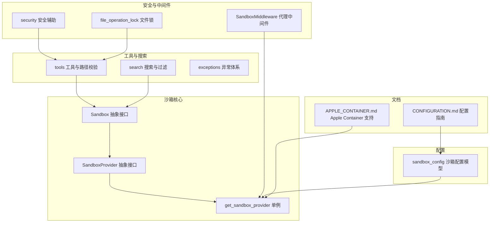
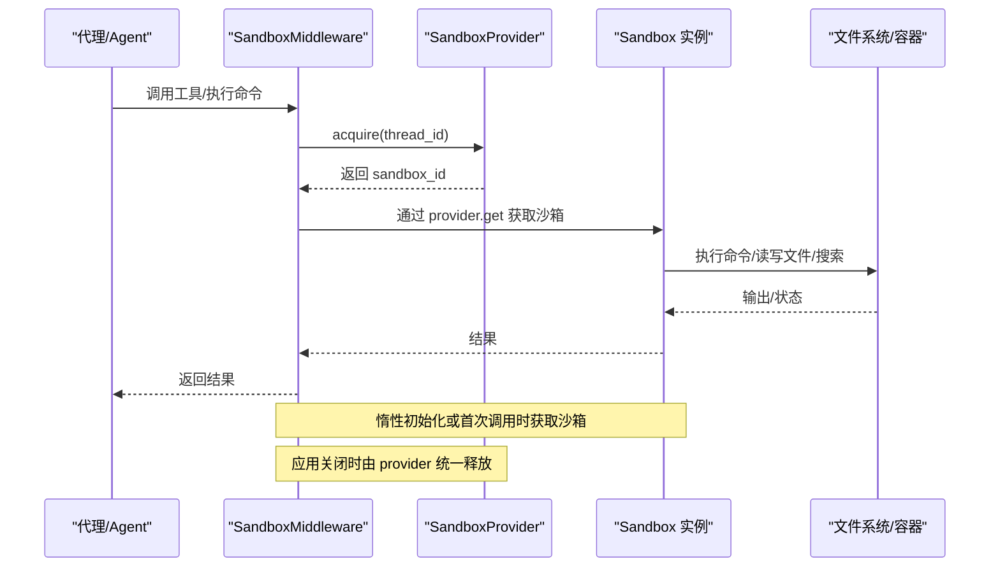
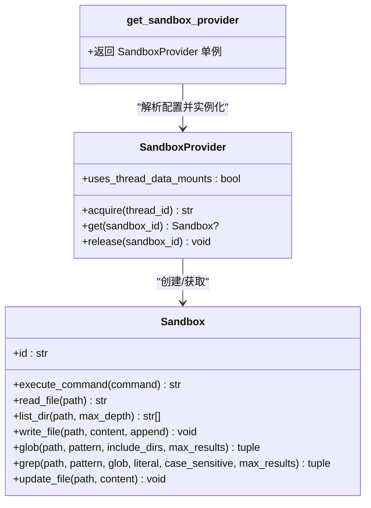
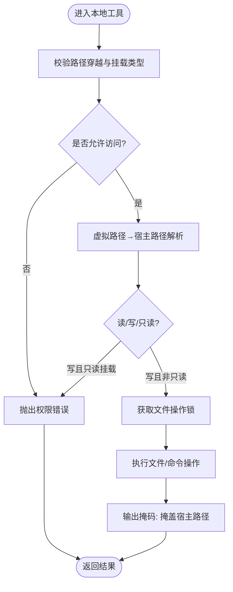
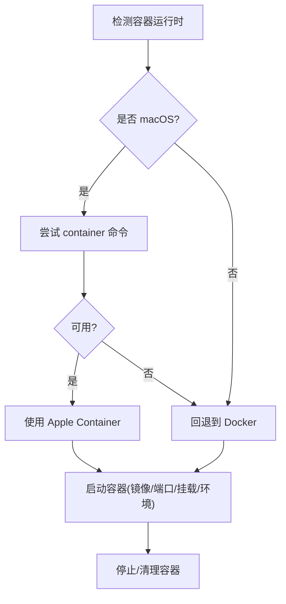
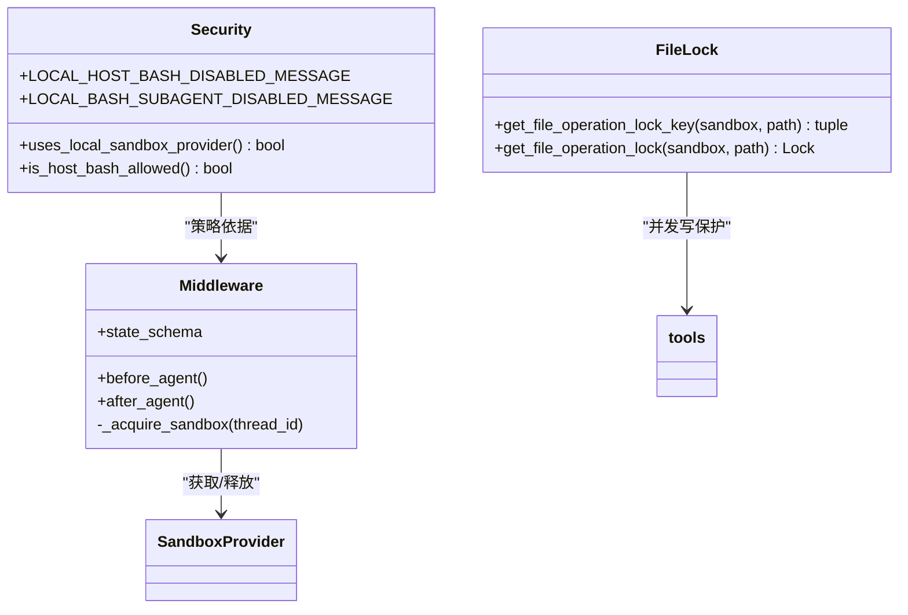
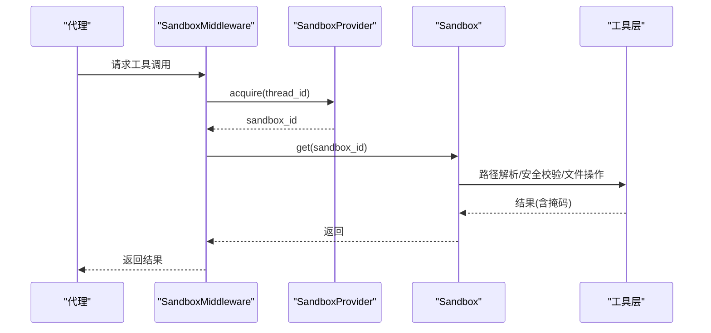
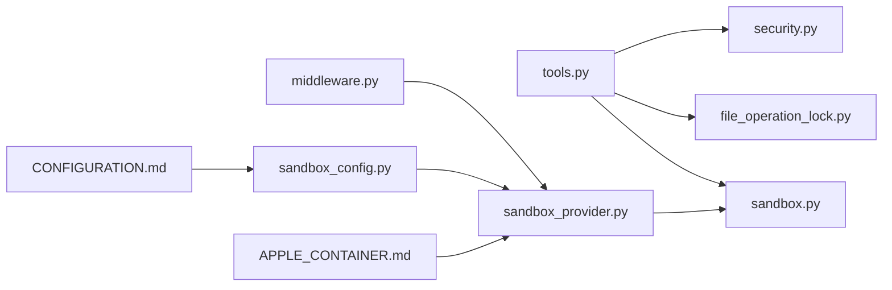

# 沙箱执行环境

<cite>
**本文引用的文件**   
- [sandbox/__init__.py](file://backend/packages/harness/deerflow/sandbox/__init__.py)
- [sandbox/sandbox.py](file://backend/packages/harness/deerflow/sandbox/sandbox.py)
- [sandbox/sandbox_provider.py](file://backend/packages/harness/deerflow/sandbox/sandbox_provider.py)
- [sandbox/security.py](file://backend/packages/harness/deerflow/sandbox/security.py)
- [sandbox/middleware.py](file://backend/packages/harness/deerflow/sandbox/middleware.py)
- [sandbox/file_operation_lock.py](file://backend/packages/harness/deerflow/sandbox/file_operation_lock.py)
- [sandbox/search.py](file://backend/packages/harness/deerflow/sandbox/search.py)
- [sandbox/tools.py](file://backend/packages/harness/deerflow/sandbox/tools.py)
- [sandbox/exceptions.py](file://backend/packages/harness/deerflow/sandbox/exceptions.py)
- [config/sandbox_config.py](file://backend/packages/harness/deerflow/config/sandbox_config.py)
- [docs/APPLE_CONTAINER.md](file://backend/docs/APPLE_CONTAINER.md)
- [docs/CONFIGURATION.md](file://backend/docs/CONFIGURATION.md)
</cite>

## 目录
1. [简介](#简介)
2. [项目结构](#项目结构)
3. [核心组件](#核心组件)
4. [架构总览](#架构总览)
5. [详细组件分析](#详细组件分析)
6. [依赖分析](#依赖分析)
7. [性能考虑](#性能考虑)
8. [故障排除指南](#故障排除指南)
9. [结论](#结论)
10. [附录](#附录)

## 简介
本文件面向DeerFlow沙箱执行环境，系统性梳理其架构设计、安全模型与实现细节，覆盖本地沙箱、Docker/AIO沙箱、Apple Container支持、沙箱提供者差异与选择策略、安全机制（权限控制、文件操作锁、安全中间件）、配置指南（模式选择、性能优化、故障排除）以及与代理系统的集成与数据交换机制。目标是帮助开发者与运维人员在不同环境中正确部署、调优与维护沙箱能力。

## 项目结构
沙箱相关代码集中在后端包deerflow的sandbox子模块中，并辅以配置与文档：
- 抽象接口与提供者：抽象沙箱接口、提供者接口与单例获取器
- 安全与中间件：权限校验、路径隔离、文件操作锁、代理中间件生命周期管理
- 工具与搜索：文件/目录/文本搜索、glob匹配、路径虚拟化与输出掩码
- 配置：沙箱模式、镜像、端口、副本数、挂载、环境变量、输出截断等
- 文档：Apple Container自动检测与回退、Docker/K8s容器编排、清理脚本等

**图表来源**
- [sandbox/sandbox.py:6-94](file://backend/packages/harness/deerflow/sandbox/sandbox.py#L6-L94)
- [sandbox/sandbox_provider.py:8-99](file://backend/packages/harness/deerflow/sandbox/sandbox_provider.py#L8-L99)
- [sandbox/middleware.py:21-84](file://backend/packages/harness/deerflow/sandbox/middleware.py#L21-L84)
- [sandbox/security.py:1-46](file://backend/packages/harness/deerflow/sandbox/security.py#L1-L46)
- [sandbox/file_operation_lock.py:1-28](file://backend/packages/harness/deerflow/sandbox/file_operation_lock.py#L1-L28)
- [sandbox/tools.py:1-800](file://backend/packages/harness/deerflow/sandbox/tools.py#L1-L800)
- [sandbox/search.py:1-211](file://backend/packages/harness/deerflow/sandbox/search.py#L1-L211)
- [sandbox/exceptions.py:1-72](file://backend/packages/harness/deerflow/sandbox/exceptions.py#L1-L72)
- [config/sandbox_config.py:1-84](file://backend/packages/harness/deerflow/config/sandbox_config.py#L1-L84)
- [docs/APPLE_CONTAINER.md:1-239](file://backend/docs/APPLE_CONTAINER.md#L1-L239)
- [docs/CONFIGURATION.md:203-280](file://backend/docs/CONFIGURATION.md#L203-L280)

**章节来源**
- [sandbox/__init__.py:1-9](file://backend/packages/harness/deerflow/sandbox/__init__.py#L1-L9)
- [sandbox/sandbox.py:6-94](file://backend/packages/harness/deerflow/sandbox/sandbox.py#L6-L94)
- [sandbox/sandbox_provider.py:8-99](file://backend/packages/harness/deerflow/sandbox/sandbox_provider.py#L8-L99)
- [sandbox/middleware.py:21-84](file://backend/packages/harness/deerflow/sandbox/middleware.py#L21-L84)
- [sandbox/security.py:1-46](file://backend/packages/harness/deerflow/sandbox/security.py#L1-L46)
- [sandbox/file_operation_lock.py:1-28](file://backend/packages/harness/deerflow/sandbox/file_operation_lock.py#L1-L28)
- [sandbox/tools.py:1-800](file://backend/packages/harness/deerflow/sandbox/tools.py#L1-L800)
- [sandbox/search.py:1-211](file://backend/packages/harness/deerflow/sandbox/search.py#L1-L211)
- [sandbox/exceptions.py:1-72](file://backend/packages/harness/deerflow/sandbox/exceptions.py#L1-L72)
- [config/sandbox_config.py:1-84](file://backend/packages/harness/deerflow/config/sandbox_config.py#L1-L84)
- [docs/APPLE_CONTAINER.md:1-239](file://backend/docs/APPLE_CONTAINER.md#L1-L239)
- [docs/CONFIGURATION.md:203-280](file://backend/docs/CONFIGURATION.md#L203-L280)

## 核心组件
- 抽象沙箱接口：统一命令执行、文件读写、目录列举、glob/grep搜索、二进制更新等能力
- 抽象沙箱提供者：负责沙箱生命周期（acquire/get/release），并支持单例缓存与优雅关闭
- 安全辅助：识别本地提供者、判断是否允许主机bash、提示安全风险
- 代理中间件：在代理执行前/后注入/释放沙箱，支持惰性初始化与线程复用
- 文件操作锁：按沙箱实例+路径粒度的弱引用锁，避免并发写冲突
- 工具与路径校验：虚拟路径映射、只读挂载、路径穿越防护、输出掩码、命令解析与白名单
- 搜索与过滤：忽略常见目录、二进制文件跳过、最大结果与截断、正则/字面量匹配
- 异常体系：结构化错误信息，便于定位命令、路径、权限等问题
- 配置模型：沙箱模式、镜像、端口、副本、挂载、环境变量、输出截断上限

**章节来源**
- [sandbox/sandbox.py:6-94](file://backend/packages/harness/deerflow/sandbox/sandbox.py#L6-L94)
- [sandbox/sandbox_provider.py:8-99](file://backend/packages/harness/deerflow/sandbox/sandbox_provider.py#L8-L99)
- [sandbox/security.py:23-46](file://backend/packages/harness/deerflow/sandbox/security.py#L23-L46)
- [sandbox/middleware.py:21-84](file://backend/packages/harness/deerflow/sandbox/middleware.py#L21-L84)
- [sandbox/file_operation_lock.py:13-28](file://backend/packages/harness/deerflow/sandbox/file_operation_lock.py#L13-L28)
- [sandbox/tools.py:584-636](file://backend/packages/harness/deerflow/sandbox/tools.py#L584-L636)
- [sandbox/search.py:105-211](file://backend/packages/harness/deerflow/sandbox/search.py#L105-L211)
- [sandbox/exceptions.py:4-72](file://backend/packages/harness/deerflow/sandbox/exceptions.py#L4-L72)
- [config/sandbox_config.py:12-84](file://backend/packages/harness/deerflow/config/sandbox_config.py#L12-L84)

## 架构总览
下图展示从代理到沙箱提供者、再到具体沙箱实现的调用链路，以及安全与中间件的横切关注点。

**图表来源**
- [sandbox/middleware.py:45-84](file://backend/packages/harness/deerflow/sandbox/middleware.py#L45-L84)
- [sandbox/sandbox_provider.py:13-38](file://backend/packages/harness/deerflow/sandbox/sandbox_provider.py#L13-L38)
- [sandbox/sandbox.py:18-94](file://backend/packages/harness/deerflow/sandbox/sandbox.py#L18-L94)

## 详细组件分析

### 抽象接口与提供者
- Sandbox 抽象类定义了命令执行、文件读写、目录列举、glob/grep搜索、二进制更新等方法，确保不同提供者实现的一致性
- SandboxProvider 抽象类定义了 acquire/get/release 生命周期方法；提供单例工厂函数与重置/关闭钩子，支持延迟初始化与全局缓存
- 提供者单例通过应用配置解析类路径动态构造，便于切换本地/容器/自定义实现

**图表来源**
- [sandbox/sandbox.py:6-94](file://backend/packages/harness/deerflow/sandbox/sandbox.py#L6-L94)
- [sandbox/sandbox_provider.py:8-99](file://backend/packages/harness/deerflow/sandbox/sandbox_provider.py#L8-L99)

**章节来源**
- [sandbox/sandbox.py:6-94](file://backend/packages/harness/deerflow/sandbox/sandbox.py#L6-L94)
- [sandbox/sandbox_provider.py:44-99](file://backend/packages/harness/deerflow/sandbox/sandbox_provider.py#L44-L99)

### 本地沙箱实现机制
- 文件系统映射：工具层将虚拟路径（用户数据、技能、ACP工作区、自定义挂载）映射到宿主实际路径，并进行路径穿越检查与只读挂载校验
- 进程隔离：本地沙箱不提供进程级隔离，仅做路径与权限边界；默认禁止主机bash，除非显式允许
- 资源限制：通过配置项限制命令输出长度、文件读取长度、列表输出长度，避免大体量输出影响性能
- 输出掩码：对本地沙箱输出中的宿主绝对路径进行虚拟路径替换，防止泄露宿主布局
- 并发控制：按“沙箱实例+路径”粒度的弱引用锁，避免并发写冲突

**图表来源**
- [sandbox/tools.py:584-636](file://backend/packages/harness/deerflow/sandbox/tools.py#L584-L636)
- [sandbox/tools.py:670-679](file://backend/packages/harness/deerflow/sandbox/tools.py#L670-L679)
- [sandbox/tools.py:501-573](file://backend/packages/harness/deerflow/sandbox/tools.py#L501-L573)
- [sandbox/file_operation_lock.py:13-28](file://backend/packages/harness/deerflow/sandbox/file_operation_lock.py#L13-L28)

**章节来源**
- [sandbox/tools.py:584-636](file://backend/packages/harness/deerflow/sandbox/tools.py#L584-L636)
- [sandbox/tools.py:670-679](file://backend/packages/harness/deerflow/sandbox/tools.py#L670-L679)
- [sandbox/tools.py:501-573](file://backend/packages/harness/deerflow/sandbox/tools.py#L501-L573)
- [sandbox/file_operation_lock.py:1-28](file://backend/packages/harness/deerflow/sandbox/file_operation_lock.py#L1-L28)
- [config/sandbox_config.py:67-81](file://backend/packages/harness/deerflow/config/sandbox_config.py#L67-L81)

### Docker/AIO 沙箱与 Apple Container 支持
- 自动检测：在macOS上优先使用Apple Container，若不可用则回退到Docker；其他平台直接使用Docker
- 容器编排：支持镜像拉取预热、端口映射、容器前缀、副本数量、空闲超时、卷挂载、环境变量注入
- 清理与测试：提供统一清理脚本与运行时检测脚本，便于问题排查
- 配置示例：文档给出本地/容器两种模式的配置要点与最佳实践

**图表来源**
- [docs/APPLE_CONTAINER.md:49-88](file://backend/docs/APPLE_CONTAINER.md#L49-L88)
- [docs/APPLE_CONTAINER.md:106-148](file://backend/docs/APPLE_CONTAINER.md#L106-L148)
- [docs/APPLE_CONTAINER.md:150-172](file://backend/docs/APPLE_CONTAINER.md#L150-L172)

**章节来源**
- [docs/APPLE_CONTAINER.md:1-239](file://backend/docs/APPLE_CONTAINER.md#L1-L239)
- [docs/CONFIGURATION.md:214-259](file://backend/docs/CONFIGURATION.md#L214-L259)

### 沙箱提供者的实现差异与选择策略
- 本地提供者（LocalSandboxProvider）
  - 特点：简单易用，无需容器；但无进程隔离，仅路径/权限边界
  - 默认禁用主机bash，仅在完全可信本地环境开启
- Docker/AIO 提供者（AioSandboxProvider）
  - 特点：强隔离，适合生产；支持Apple Container自动检测与回退
  - 可配置镜像、端口、副本、挂载、环境变量、空闲回收
- 选择策略
  - 开发/调试：本地提供者（需谨慎启用主机bash）
  - 生产/多租户：Docker/AIO提供者（可选Apple Container）

**章节来源**
- [sandbox/security.py:23-46](file://backend/packages/harness/deerflow/sandbox/security.py#L23-L46)
- [docs/CONFIGURATION.md:207-259](file://backend/docs/CONFIGURATION.md#L207-L259)
- [docs/APPLE_CONTAINER.md:1-239](file://backend/docs/APPLE_CONTAINER.md#L1-L239)

### 沙箱安全机制
- 权限控制
  - 路径穿越检测：拒绝包含“..”的路径段
  - 虚拟路径白名单：仅允许用户数据、技能、ACP工作区、自定义挂载路径
  - 只读挂载：根据配置对挂载路径强制只读
- 文件操作锁
  - 按“沙箱实例+路径”生成键，使用弱引用字典避免内存泄漏
- 安全中间件
  - 在代理调用前后注入/释放沙箱，支持惰性初始化减少开销
- 输出掩码
  - 将宿主绝对路径替换为虚拟路径，避免泄露宿主文件系统布局

**图表来源**
- [sandbox/security.py:23-46](file://backend/packages/harness/deerflow/sandbox/security.py#L23-L46)
- [sandbox/middleware.py:21-84](file://backend/packages/harness/deerflow/sandbox/middleware.py#L21-L84)
- [sandbox/file_operation_lock.py:13-28](file://backend/packages/harness/deerflow/sandbox/file_operation_lock.py#L13-L28)

**章节来源**
- [sandbox/security.py:1-46](file://backend/packages/harness/deerflow/sandbox/security.py#L1-L46)
- [sandbox/middleware.py:21-84](file://backend/packages/harness/deerflow/sandbox/middleware.py#L21-L84)
- [sandbox/file_operation_lock.py:1-28](file://backend/packages/harness/deerflow/sandbox/file_operation_lock.py#L1-L28)
- [sandbox/tools.py:575-636](file://backend/packages/harness/deerflow/sandbox/tools.py#L575-L636)

### 沙箱配置指南
- 模式选择
  - 本地：deerflow.sandbox.local:LocalSandboxProvider，默认禁用主机bash
  - 容器：deerflow.community.aio_sandbox:AioSandboxProvider，支持Apple Container自动检测
- 性能优化
  - 合理设置副本数与空闲超时，避免频繁创建销毁
  - 预拉取镜像，减少首次启动等待
  - 控制输出截断上限，避免大体量输出阻塞
- 故障排除
  - Apple Container不可用时自动回退Docker
  - 使用清理脚本批量停止/删除沙箱容器
  - 检查日志中的运行时检测信息

**章节来源**
- [docs/CONFIGURATION.md:203-280](file://backend/docs/CONFIGURATION.md#L203-L280)
- [docs/APPLE_CONTAINER.md:89-172](file://backend/docs/APPLE_CONTAINER.md#L89-L172)

### 沙箱与代理系统的集成与数据交换
- 中间件集成
  - SandboxMiddleware在代理执行前注入沙箱，在after_agent阶段释放，支持惰性初始化
  - 通过provider单例获取沙箱实例，避免重复创建
- 数据交换
  - 工具层将虚拟路径映射为宿主路径，结合输出掩码保证安全性
  - 搜索与glob功能返回结构化结果，支持截断与最大结果限制

**图表来源**
- [sandbox/middleware.py:45-84](file://backend/packages/harness/deerflow/sandbox/middleware.py#L45-L84)
- [sandbox/tools.py:435-469](file://backend/packages/harness/deerflow/sandbox/tools.py#L435-L469)

**章节来源**
- [sandbox/middleware.py:21-84](file://backend/packages/harness/deerflow/sandbox/middleware.py#L21-L84)
- [sandbox/tools.py:435-469](file://backend/packages/harness/deerflow/sandbox/tools.py#L435-L469)

## 依赖分析
- 组件内聚与耦合
  - SandboxProvider 与 Sandbox 为强依赖，通过单例工厂解耦配置解析
  - SandboxMiddleware 依赖 Provider 单例，横切代理生命周期
  - tools 与 security、file_operation_lock 形成安全与并发控制的协作
- 外部依赖
  - 配置解析：Pydantic模型用于沙箱配置校验与默认值
  - 文档：Apple Container/Docker/K8s容器运行时与清理脚本

**图表来源**
- [sandbox/tools.py:1-800](file://backend/packages/harness/deerflow/sandbox/tools.py#L1-L800)
- [sandbox/security.py:1-46](file://backend/packages/harness/deerflow/sandbox/security.py#L1-L46)
- [sandbox/file_operation_lock.py:1-28](file://backend/packages/harness/deerflow/sandbox/file_operation_lock.py#L1-L28)
- [sandbox/sandbox.py:1-94](file://backend/packages/harness/deerflow/sandbox/sandbox.py#L1-L94)
- [sandbox/middleware.py:1-84](file://backend/packages/harness/deerflow/sandbox/middleware.py#L1-L84)
- [sandbox/sandbox_provider.py:1-99](file://backend/packages/harness/deerflow/sandbox/sandbox_provider.py#L1-L99)
- [config/sandbox_config.py:1-84](file://backend/packages/harness/deerflow/config/sandbox_config.py#L1-L84)
- [docs/APPLE_CONTAINER.md:1-239](file://backend/docs/APPLE_CONTAINER.md#L1-L239)
- [docs/CONFIGURATION.md:203-280](file://backend/docs/CONFIGURATION.md#L203-L280)

**章节来源**
- [sandbox/tools.py:1-800](file://backend/packages/harness/deerflow/sandbox/tools.py#L1-L800)
- [sandbox/middleware.py:1-84](file://backend/packages/harness/deerflow/sandbox/middleware.py#L1-L84)
- [sandbox/sandbox_provider.py:1-99](file://backend/packages/harness/deerflow/sandbox/sandbox_provider.py#L1-L99)
- [config/sandbox_config.py:1-84](file://backend/packages/harness/deerflow/config/sandbox_config.py#L1-L84)
- [docs/APPLE_CONTAINER.md:1-239](file://backend/docs/APPLE_CONTAINER.md#L1-L239)
- [docs/CONFIGURATION.md:203-280](file://backend/docs/CONFIGURATION.md#L203-L280)

## 性能考虑
- 惰性初始化：代理中间件默认惰性获取沙箱，降低首次调用延迟
- 副本与回收：容器提供者支持副本上限与空闲超时，LRU淘汰策略平衡资源占用
- 输出截断：针对bash、read_file、ls等工具设置最大字符数，避免大输出拖慢响应
- 预拉取镜像：减少首次启动时的镜像拉取等待时间

**章节来源**
- [sandbox/middleware.py:34-44](file://backend/packages/harness/deerflow/sandbox/middleware.py#L34-L44)
- [config/sandbox_config.py:23-27](file://backend/packages/harness/deerflow/config/sandbox_config.py#L23-L27)
- [config/sandbox_config.py:67-81](file://backend/packages/harness/deerflow/config/sandbox_config.py#L67-L81)
- [docs/APPLE_CONTAINER.md:121-148](file://backend/docs/APPLE_CONTAINER.md#L121-L148)

## 故障排除指南
- Apple Container未被检测到
  - 检查安装与服务状态，查看应用日志中的检测信息
- 容器未清理
  - 使用清理脚本或手动列出/停止容器
- 性能问题
  - 切换到Docker临时验证；预拉取镜像；调整副本与空闲超时

**章节来源**
- [docs/APPLE_CONTAINER.md:188-233](file://backend/docs/APPLE_CONTAINER.md#L188-L233)

## 结论
DeerFlow沙箱执行环境通过抽象接口与提供者模式实现了跨本地与容器的统一能力；配合安全中间件、路径校验、文件锁与输出掩码，构建了兼顾易用性与安全性的执行边界。在开发与生产场景中，应基于安全与性能需求选择合适的沙箱模式，并遵循配置与故障排除的最佳实践。

## 附录
- 关键实现路径参考
  - 抽象接口与提供者：[sandbox/sandbox.py:6-94](file://backend/packages/harness/deerflow/sandbox/sandbox.py#L6-L94)，[sandbox/sandbox_provider.py:8-99](file://backend/packages/harness/deerflow/sandbox/sandbox_provider.py#L8-L99)
  - 安全与中间件：[sandbox/security.py:1-46](file://backend/packages/harness/deerflow/sandbox/security.py#L1-L46)，[sandbox/middleware.py:21-84](file://backend/packages/harness/deerflow/sandbox/middleware.py#L21-L84)
  - 工具与路径校验：[sandbox/tools.py:584-636](file://backend/packages/harness/deerflow/sandbox/tools.py#L584-L636)
  - 搜索与过滤：[sandbox/search.py:105-211](file://backend/packages/harness/deerflow/sandbox/search.py#L105-L211)
  - 配置模型：[config/sandbox_config.py:12-84](file://backend/packages/harness/deerflow/config/sandbox_config.py#L12-L84)
  - Apple Container支持：[docs/APPLE_CONTAINER.md:1-239](file://backend/docs/APPLE_CONTAINER.md#L1-L239)
  - 配置指南：[docs/CONFIGURATION.md:203-280](file://backend/docs/CONFIGURATION.md#L203-L280)