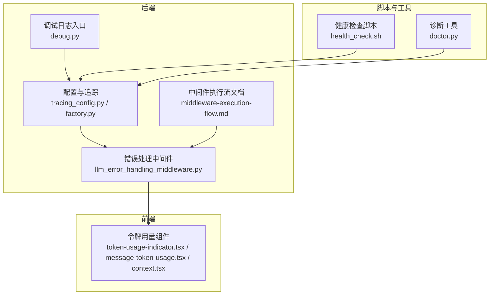
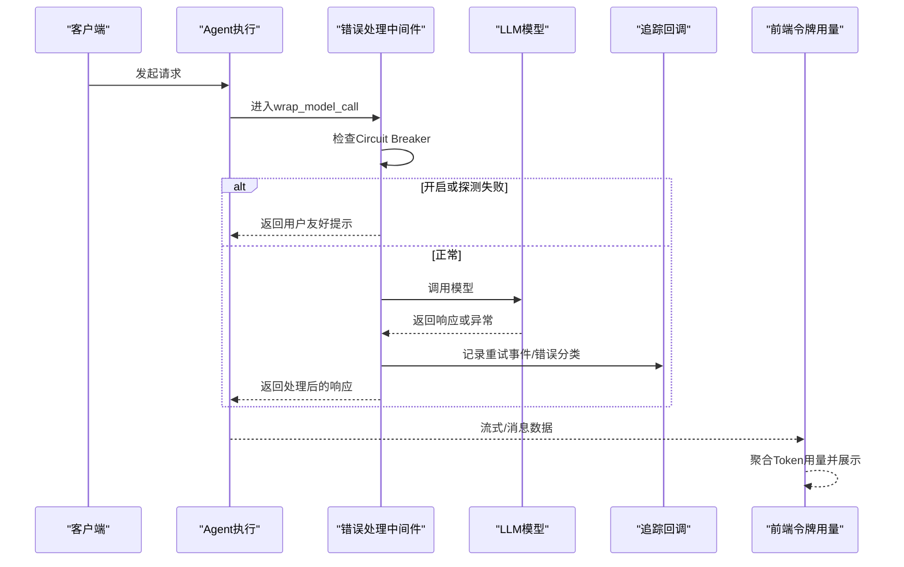
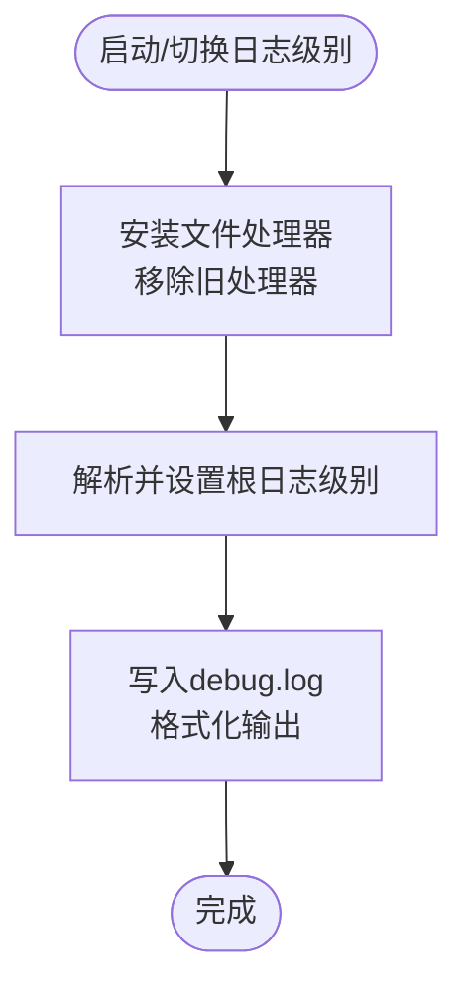
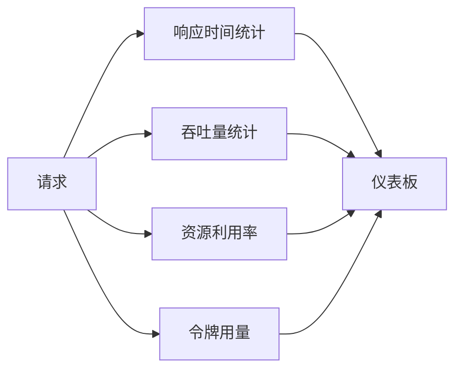
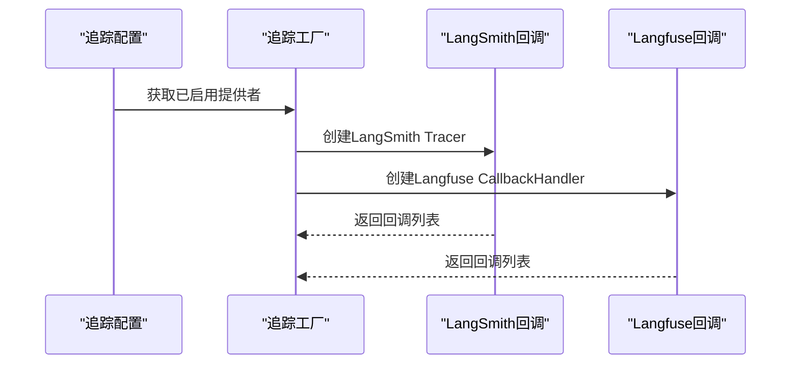
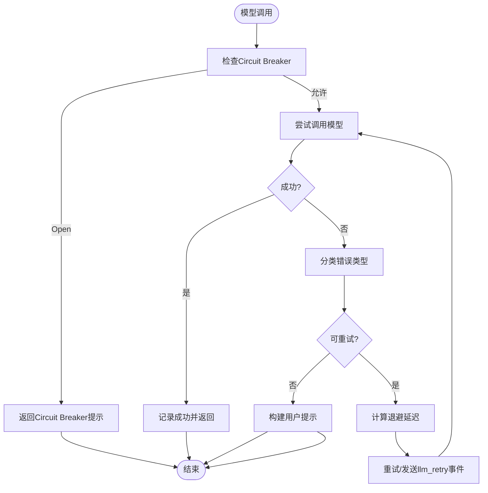
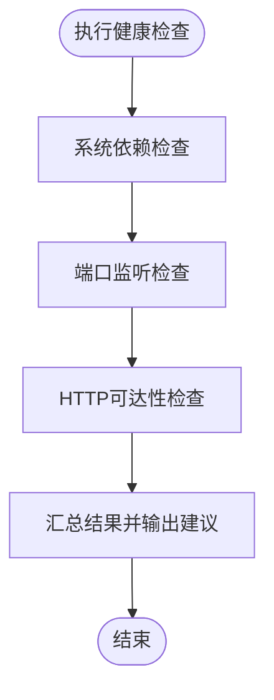
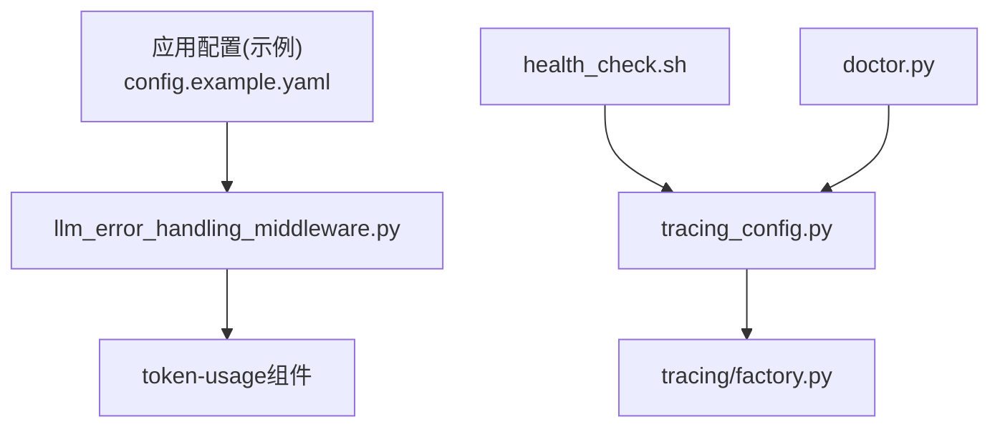

# 监控和可观测性

<cite>
**本文引用的文件**
- [tracing_config.py](file://backend/packages/harness/deerflow/config/tracing_config.py)
- [factory.py](file://backend/packages/harness/deerflow/tracing/factory.py)
- [llm_error_handling_middleware.py](file://backend/packages/harness/deerflow/agents/middlewares/llm_error_handling_middleware.py)
- [config.example.yaml](file://config.example.yaml)
- [middleware-execution-flow.md](file://backend/docs/middleware-execution-flow.md)
- [token-usage-indicator.tsx](file://frontend/src/components/workspace/token-usage-indicator.tsx)
- [message-token-usage.tsx](file://frontend/src/components/workspace/messages/message-token-usage.tsx)
- [context.tsx](file://frontend/src/components/ai-elements/context.tsx)
- [health_check.sh](file://.agent/skills/smoke-test/scripts/health_check.sh)
- [doctor.py](file://scripts/doctor.py)
- [debug.py](file://backend/debug.py)
- [test_tracing_factory.py](file://backend/tests/test_tracing_factory.py)
- [test_llm_error_handling_middleware.py](file://backend/tests/test_llm_error_handling_middleware.py)
</cite>

## 目录
1. [简介](#简介)
2. [项目结构](#项目结构)
3. [核心组件](#核心组件)
4. [架构总览](#架构总览)
5. [详细组件分析](#详细组件分析)
6. [依赖分析](#依赖分析)
7. [性能考量](#性能考量)
8. [故障排查指南](#故障排查指南)
9. [结论](#结论)
10. [附录](#附录)

## 简介
本文件面向DeerFlow监控与可观测性体系，围绕日志系统、性能监控指标、分布式追踪、错误报告机制、健康检查以及监控仪表板配置进行系统化说明。文档同时给出与外部监控系统（如Prometheus、Grafana）的对接思路与最佳实践，帮助读者快速理解并落地可观测性能力。

## 项目结构
- 后端可观测性相关模块集中在backend/packages/harness/deerflow下，包含追踪配置与工厂、中间件错误处理、应用配置等。
- 前端提供令牌用量展示组件，用于在UI侧直观呈现Token使用情况。
- 脚本与工具提供健康检查、诊断与调试能力。
- 文档与测试文件支撑流程与行为验证。

**图表来源**
- [tracing_config.py:107-149](file://backend/packages/harness/deerflow/config/tracing_config.py#L107-L149)
- [factory.py:32-54](file://backend/packages/harness/deerflow/tracing/factory.py#L32-L54)
- [llm_error_handling_middleware.py:66-307](file://backend/packages/harness/deerflow/agents/middlewares/llm_error_handling_middleware.py#L66-L307)
- [middleware-execution-flow.md:32-153](file://backend/docs/middleware-execution-flow.md#L32-L153)
- [debug.py:72-80](file://backend/debug.py#L72-L80)
- [token-usage-indicator.tsx:22-88](file://frontend/src/components/workspace/token-usage-indicator.tsx#L22-L88)
- [message-token-usage.tsx:57-91](file://frontend/src/components/workspace/messages/message-token-usage.tsx#L57-L91)
- [context.tsx:321-408](file://frontend/src/components/ai-elements/context.tsx#L321-L408)
- [health_check.sh:17-42](file://.agent/skills/smoke-test/scripts/health_check.sh#L17-L42)
- [doctor.py:617-660](file://scripts/doctor.py#L617-L660)

**章节来源**
- [tracing_config.py:107-149](file://backend/packages/harness/deerflow/config/tracing_config.py#L107-L149)
- [factory.py:32-54](file://backend/packages/harness/deerflow/tracing/factory.py#L32-L54)
- [llm_error_handling_middleware.py:66-307](file://backend/packages/harness/deerflow/agents/middlewares/llm_error_handling_middleware.py#L66-L307)
- [middleware-execution-flow.md:32-153](file://backend/docs/middleware-execution-flow.md#L32-L153)
- [debug.py:72-80](file://backend/debug.py#L72-L80)
- [token-usage-indicator.tsx:22-88](file://frontend/src/components/workspace/token-usage-indicator.tsx#L22-L88)
- [message-token-usage.tsx:57-91](file://frontend/src/components/workspace/messages/message-token-usage.tsx#L57-L91)
- [context.tsx:321-408](file://frontend/src/components/ai-elements/context.tsx#L321-L408)
- [health_check.sh:17-42](file://.agent/skills/smoke-test/scripts/health_check.sh#L17-L42)
- [doctor.py:617-660](file://scripts/doctor.py#L617-L660)

## 核心组件
- 追踪配置与工厂：支持LangSmith与Langfuse，基于环境变量动态加载，提供启用校验与回调构建。
- 错误处理中间件：内置指数退避重试、Circuit Breaker、错误分类与用户友好提示，保障服务稳定性。
- 日志系统：提供调试模式下的文件日志输出与运行时日志级别更新。
- 令牌用量：前端组件聚合并展示消息级别的Token使用统计。
- 健康检查：Shell脚本与Python诊断工具，覆盖端口监听、HTTP可达性与系统依赖检查。
- 中间件执行流：定义了before/after阶段与洋葱式执行顺序，便于定位性能瓶颈与异常点。

**章节来源**
- [tracing_config.py:107-149](file://backend/packages/harness/deerflow/config/tracing_config.py#L107-L149)
- [factory.py:32-54](file://backend/packages/harness/deerflow/tracing/factory.py#L32-L54)
- [llm_error_handling_middleware.py:66-307](file://backend/packages/harness/deerflow/agents/middlewares/llm_error_handling_middleware.py#L66-L307)
- [debug.py:43-80](file://backend/debug.py#L43-L80)
- [token-usage-indicator.tsx:22-88](file://frontend/src/components/workspace/token-usage-indicator.tsx#L22-L88)
- [message-token-usage.tsx:57-91](file://frontend/src/components/workspace/messages/message-token-usage.tsx#L57-L91)
- [context.tsx:321-408](file://frontend/src/components/ai-elements/context.tsx#L321-L408)
- [health_check.sh:17-42](file://.agent/skills/smoke-test/scripts/health_check.sh#L17-L42)
- [doctor.py:617-660](file://scripts/doctor.py#L617-L660)
- [middleware-execution-flow.md:32-153](file://backend/docs/middleware-execution-flow.md#L32-L153)

## 架构总览
下图展示了从请求进入Agent到模型调用、再到错误处理与追踪回调的关键路径，以及前端令牌用量展示的联动关系。

**图表来源**
- [llm_error_handling_middleware.py:217-307](file://backend/packages/harness/deerflow/agents/middlewares/llm_error_handling_middleware.py#L217-L307)
- [factory.py:32-54](file://backend/packages/harness/deerflow/tracing/factory.py#L32-L54)
- [token-usage-indicator.tsx:22-88](file://frontend/src/components/workspace/token-usage-indicator.tsx#L22-L88)

## 详细组件分析

### 日志系统与调试
- 文件日志：调试模式下将日志写入debug.log，避免控制台污染；支持运行时更新日志级别。
- 应用日志：通过配置项控制日志级别，结合中间件与服务层日志输出，便于问题定位。

**图表来源**
- [debug.py:43-80](file://backend/debug.py#L43-L80)

**章节来源**
- [debug.py:43-80](file://backend/debug.py#L43-L80)

### 性能监控指标
- 响应时间：中间件在每次模型调用前记录开始时间，异常时记录耗时与重试次数，可用于计算P50/P95响应时间。
- 吞吐量：通过并发请求与成功/失败计数统计，结合Circuit Breaker状态变化，评估系统承载能力。
- 资源利用率：结合容器/主机监控（Prometheus+Grafana），采集CPU、内存、网络I/O与磁盘IO，与模型调用峰值关联分析。
- 令牌用量：前端组件聚合输入/输出/推理/缓存Token，辅助成本与性能权衡。

[本图为概念性示意，无需图表来源]

**章节来源**
- [llm_error_handling_middleware.py:217-307](file://backend/packages/harness/deerflow/agents/middlewares/llm_error_handling_middleware.py#L217-L307)
- [token-usage-indicator.tsx:22-88](file://frontend/src/components/workspace/token-usage-indicator.tsx#L22-L88)
- [message-token-usage.tsx:57-91](file://frontend/src/components/workspace/messages/message-token-usage.tsx#L57-L91)
- [context.tsx:321-408](file://frontend/src/components/ai-elements/context.tsx#L321-L408)

### 分布式追踪
- 配置与启用：通过环境变量启用LangSmith/Langfuse，工厂根据已配置的提供者构建回调。
- 初始化流程：工厂遍历已启用提供者，分别创建Tracer或CallbackHandler；初始化失败抛出明确错误。
- 使用场景：将追踪回调注入Agent执行链路，实现Span生成与链路追踪。

**图表来源**
- [tracing_config.py:107-149](file://backend/packages/harness/deerflow/config/tracing_config.py#L107-L149)
- [factory.py:32-54](file://backend/packages/harness/deerflow/tracing/factory.py#L32-L54)

**章节来源**
- [tracing_config.py:107-149](file://backend/packages/harness/deerflow/config/tracing_config.py#L107-L149)
- [factory.py:32-54](file://backend/packages/harness/deerflow/tracing/factory.py#L32-L54)
- [test_tracing_factory.py:52-89](file://backend/tests/test_tracing_factory.py#L52-L89)

### 错误报告机制
- 错误分类：区分配额/鉴权/繁忙/瞬时错误，决定是否重试与用户提示。
- 重试策略：指数退避，支持从HTTP头提取retry-after，上限保护。
- Circuit Breaker：连续失败触发Open状态，半开探测恢复，避免雪崩。
- 用户提示：针对不同原因生成友好提示，保留异常详情供调试。
- 事件上报：通过流写入器发出llm_retry事件，便于前端或外部系统订阅。

**图表来源**
- [llm_error_handling_middleware.py:147-307](file://backend/packages/harness/deerflow/agents/middlewares/llm_error_handling_middleware.py#L147-L307)

**章节来源**
- [llm_error_handling_middleware.py:66-307](file://backend/packages/harness/deerflow/agents/middlewares/llm_error_handling_middleware.py#L66-L307)
- [test_llm_error_handling_middleware.py:218-234](file://backend/tests/test_llm_error_handling_middleware.py#L218-L234)

### 健康检查
- Shell脚本：检测端口监听、HTTP可达性、服务依赖，汇总通过/失败状态。
- 诊断工具：检查系统依赖（Python/Node/pnpm/uv/nginx）、环境变量存在性与基本可用性。
- 自动恢复：健康检查失败时输出建议命令（如查看日志），配合CI/CD实现自动重启或回滚。

**图表来源**
- [health_check.sh:17-42](file://.agent/skills/smoke-test/scripts/health_check.sh#L17-L42)
- [doctor.py:617-660](file://scripts/doctor.py#L617-L660)

**章节来源**
- [health_check.sh:17-42](file://.agent/skills/smoke-test/scripts/health_check.sh#L17-L42)
- [doctor.py:617-660](file://scripts/doctor.py#L617-L660)

### 监控仪表板配置指南
- 指标采集：结合应用日志、中间件事件与外部系统监控（Prometheus）采集关键指标。
- 可视化展示：在Grafana中创建面板，展示响应时间分布、吞吐量曲线、错误率与Circuit Breaker状态。
- 阈值设置：为重试事件、错误率、响应时间设定阈值告警，结合邮件/IM渠道通知。

[本节为通用配置指导，无需章节来源]

### 与外部监控系统集成
- Prometheus：通过应用指标端点暴露关键指标（如请求计数、错误计数、重试次数），Prometheus定期抓取。
- Grafana：连接Prometheus数据源，创建仪表板与告警规则，实现可视化与通知。
- 日志聚合：将debug.log与应用日志接入ELK/EFK，实现全文检索与异常定位。

[本节为通用集成指导，无需章节来源]

## 依赖分析
- 追踪配置依赖环境变量解析与验证，确保提供者完整启用。
- 追踪工厂依赖配置模块，按启用列表创建回调实例。
- 错误处理中间件依赖应用配置加载Circuit Breaker参数，同时与模型调用链路耦合。
- 前端令牌用量组件依赖消息数据与模型ID，计算Token与成本。

**图表来源**
- [tracing_config.py:107-149](file://backend/packages/harness/deerflow/config/tracing_config.py#L107-L149)
- [factory.py:32-54](file://backend/packages/harness/deerflow/tracing/factory.py#L32-L54)
- [llm_error_handling_middleware.py:66-86](file://backend/packages/harness/deerflow/agents/middlewares/llm_error_handling_middleware.py#L66-L86)
- [config.example.yaml:966-981](file://config.example.yaml#L966-L981)
- [token-usage-indicator.tsx:22-88](file://frontend/src/components/workspace/token-usage-indicator.tsx#L22-L88)
- [health_check.sh:17-42](file://.agent/skills/smoke-test/scripts/health_check.sh#L17-L42)
- [doctor.py:617-660](file://scripts/doctor.py#L617-L660)

**章节来源**
- [tracing_config.py:107-149](file://backend/packages/harness/deerflow/config/tracing_config.py#L107-L149)
- [factory.py:32-54](file://backend/packages/harness/deerflow/tracing/factory.py#L32-L54)
- [llm_error_handling_middleware.py:66-86](file://backend/packages/harness/deerflow/agents/middlewares/llm_error_handling_middleware.py#L66-L86)
- [config.example.yaml:966-981](file://config.example.yaml#L966-L981)
- [token-usage-indicator.tsx:22-88](file://frontend/src/components/workspace/token-usage-indicator.tsx#L22-L88)
- [health_check.sh:17-42](file://.agent/skills/smoke-test/scripts/health_check.sh#L17-L42)
- [doctor.py:617-660](file://scripts/doctor.py#L617-L660)

## 性能考量
- 重试与退避：合理设置最大重试次数与退避上限，避免放大请求压力。
- Circuit Breaker：根据实际SLA设定阈值与恢复时间，减少雪崩效应。
- 中间件执行顺序：依据中间件执行流文档优化顺序，减少不必要的重复处理。
- 前端渲染：令牌用量组件按需渲染，避免大消息集导致的UI卡顿。

[本节为通用性能建议，无需章节来源]

## 故障排查指南
- 日志定位：使用调试模式输出到文件，结合中间件异常日志定位问题。
- 健康检查：通过Shell脚本与诊断工具快速判断端口、服务与依赖状态。
- 追踪验证：确认追踪提供者配置正确且回调已注入，观察链路是否完整。
- 错误分类：根据错误原因选择重试或人工介入，关注Circuit Breaker状态变化。

**章节来源**
- [debug.py:43-80](file://backend/debug.py#L43-L80)
- [health_check.sh:17-42](file://.agent/skills/smoke-test/scripts/health_check.sh#L17-L42)
- [doctor.py:617-660](file://scripts/doctor.py#L617-L660)
- [test_tracing_factory.py:52-89](file://backend/tests/test_tracing_factory.py#L52-L89)
- [test_llm_error_handling_middleware.py:218-234](file://backend/tests/test_llm_error_handling_middleware.py#L218-L234)

## 结论
DeerFlow的可观测性体系以“配置驱动的追踪、稳健的错误处理、清晰的日志与健康检查”为核心，辅以外部监控与前端指标展示，形成从底层到上层的全链路可观测闭环。通过合理的阈值与告警策略，可在保证用户体验的同时提升系统稳定性与可维护性。

## 附录
- 配置参考：应用配置示例文件提供了日志级别、令牌用量、电路熔断等关键项的配置入口。
- 中间件执行流：文档明确了各中间件的执行顺序与职责边界，有助于性能优化与问题定位。

**章节来源**
- [config.example.yaml:18-31](file://config.example.yaml#L18-L31)
- [config.example.yaml:966-981](file://config.example.yaml#L966-L981)
- [middleware-execution-flow.md:32-153](file://backend/docs/middleware-execution-flow.md#L32-L153)